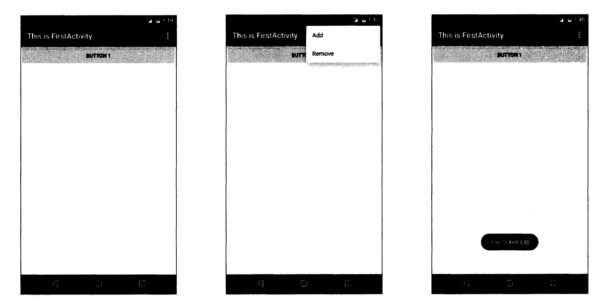

# 第2章 先从看得到的入手——探究活动  
## 2.1 活动是什么  
&emsp;&emsp;活动(Activity)是最容易吸引用户的地方，它是一种可以包含用户界面的组件，主要用于和用户进行交互。一个应用程序中可以包含零个或多个活动，但不包含任何活动的应用程序很少见，谁也不想让自己的应用永远无法被用户看到吧？  

## 2.2 活动的基本用法  
&emsp;&emsp;到现在为止，你还没有手动创建过活动呢。因为上一章中的HelloWordActivity是Android Studio帮我们自动创建的。手动创建活动可以加深我们的理解，因此现在是时候应该自己动手了。  
&emsp;&emsp;新建一个Android项目ActivityTest，但是我们不再选择Empty Activity这个选项，而是选择Add No Activity，因为这次我们准备手动创建活动。  
### 2.2.1 手动创建活动  
&emsp;&emsp;项目创建成功后，我们仍然会默认使用Android模式的项目结构，这里我们手动修改成Project模式，本书中后面的所有项目都要这样修改，以后就不再赘述了。目前ActivityTest项目中虽然还是自动生成很多文件，现在右击包->New->Activity->Empty Activity，会弹出一个活动的对话框，我们将活动命名为FirstActivity，并且不要勾选Generate Layout File 和 Launcher Activity这两个选项，勾选Generate Layout File 表示会自动为FirstActivity创建一个对应的布局文件，勾选LauncherActivity表示会自动将FirstActivity设置成当前项目的主活动，这里由于你是第一次手动创建活动，这些自动生成的东西暂时都不要勾选，下面我们将会一个个手动来完成。勾选BackwardsCompatibility表示会为项目启用向下兼容的模式，这个选项要勾上。点击Finish完成构建。  
&emsp;&emsp;你需要知道，项目中的任何活动都应该重写Activity的onCreate()方法，而目前我们的FirstActivity中已经重写了这个方法，这是由Android Studio自动帮我们完成的，代码如下所示：  
```
public class FirstActivity extends AppCompatActivity{
    @Override 
    protected void onCreate(Bundle savedInstanceState){
        super.onCreate(savedInstanceState);
    }
}
```
&emsp;&emsp;可以看到，onCreate()方法非常简单，就是调用了父类的onCreate()方法。当然这只是默认的实现，后面我们还需要在里面加入很多自己的逻辑。  
### 2.2.2 创建和加载布局  
&emsp;&emsp;前面我们说过，Android 程序的设计讲究逻辑和试图分离，最好每一个活动都能对应一个布局，布局就是用来显示界面内容的，因此我们现在就来手动创建一个布局文件。  
&emsp;&emsp;右击app/src/main/res目录->New->Directory，会弹出一个新建目录的窗口，这里先创建一个名为layout Source file，又会弹出一个新建布局资源窗口，我们将这个布局文件命名为first_layout，根元素就默认选择为LinearLayout。点击ok完成布局的创建，会出现Android Studio为我们提供的可视化布局编辑器，你可以在屏幕的中央区域预览当前的布局。在窗口的最下方有两个切换卡，左边是Design，右边是Text。Design是当前的可视化布局编辑器，在这里你不仅仅可以预览当前的布局，还可以通过拖放的方式编辑布局。而Text则是通过XML文件的方式来编辑布局的，现在点击一下Text切换卡，可以看到如下代码：  
```xml
<LinearLayout xmlns:android="http://schemas.android.com/apk/res/android"
    android:orientation="vertical"
     android:layout_width="match_parent" 
     android:layout_height="match_parent">
 
 </LinearLayout>
```
&emsp;&emsp;由于我们刚才在创建布局文件时选择了LinearLayout作为根元素，因此现在布局文件中已经有了一个LinearLayout元素了。那我们现在对这个布局稍稍做编辑，添加一个按钮，如下所示：

```xml
<LinearLayout xmlns:android="http://schemas.android.com/apk/res/android"
    android:orientation="vertical"
     android:layout_width="match_parent" 
     android:layout_height="match_parent">
    <Button
        adnrooid:id="@+id/button_1"
        android:layout_width="match_parent"
        android:layout_heght="wrap_content"
        adnroid:text="Button 1"/>
 </LinearLayout>
```
&emsp;&emsp;这里添加了一个Button元素，并在Button元素的内部增加了几个属性。android:id是给当前的元素定义一个唯一标识符，之后可以在代码中对这个元素进行操作。你可能对@+id/button_1这种语法感到陌生，但如果把加号去掉，变成@id/button_1，这样你就会觉得有些熟悉了吧，这不就是在XML中引用资源的语法吗？只不过是把string替换成了id。使得，如果你需要在XML中引用一个id，就使用@id/id_name这种语法。随后android:layout_width指定了当前元素的宽度和父元素一样宽。android:layout_hegiht指定了当前元素的高度，这里使用wrap_content表示当前元素的高度只要能刚好包含里面的内容就行。android:text指定了元素中显示的文字内容。  
&emsp;&emsp;通过预览窗口可以看到，按钮已经成功显示出来了，这样一个简单的布局就编写完成了，那么接下来我们要做的，就是在活动中加载这个布局。重新回到FirstActivity，在onCreate()方法中加入如下代码：  
```java
public class FirstActivity extends Activity{
    @Override
    protected void onCreate(Bundle savedInstanceState){
        super.onCreate(savedInstanceState);
        setContentView(R.layout.first_layout);
    }
    
}
```
&emsp;&emsp;可以看到，这里调用了setContentView()方法来给当前的活动加载一个布局，而在setContentView()方法中，我们一般都会传入一个布局文件的id。在第一章介绍项目资源的时候曾经提到过，项目中添加的任何资源都会在R文件中生成一个相应的资源id，因此我们刚才创建的first_layout.xml布局的id现在应该是已经添加到R文件中了。在代码中引用布局文件的方法你也已经学过了，只需要将这个值传入setContentView()方法即可。  

### 2.2.3 在AndroidManifest文件中注册
&emsp;&emsp;别忘了在上一章我们学过，所有的活动都要在AndroidManifest.xml中进行注册才能生效，而实际上FirstActivity已经在AndroidManifest.xml中注册过了，我们打开app/src/main/AndroidManifest.xml，代码如下所示：  
```xml
<manifest xmlns:android="http://schemas.android.com/apk/res/android"
          xmlns:tools="http://schemas.android.com/tools" package="com.zj970.activitytest">
    <application
            android:allowBackup="true"
            android:icon="@mipmap/ic_launcher"
            android:label="@string/app_name"
            android:roundIcon="@mipmap/ic_launcher_round"
            android:supportsRtl="true"
            android:theme="@style/Theme.ActivityTest">
        <activity android:name=".FirstActivity">
            
        </activity>
    </application>
</manifest>
```
&emsp;&emsp;可以看到，活动的注册声明要放在<application>标签内，这里是通过<activity>标签来对活动进行注册的。那么又是谁帮我们自动完成了FirstActivity的注册呢？当然是Android Studio了，之前在使用Eclipse创建活动或其他系统组件时，很多人都会忘记去AndroidManifest.xml中注册一下，从而导致程序运行崩溃，很显然Android Studio在这方面做得更加人性化。  
&emsp;&emsp;在<activity>标签中我们使用了android:name来指定具体注册哪一个活动，那么这里填入的.FirstActivity是什么意思呢？其实这不过就是就是全部包名的缩写。由于在最外层的<manifest>标签中已经通过package属性执行了程序的包名，因此这里直接使用.FirstActivity就足够了。  
&emsp;&emsp;不过，仅仅是这样注册了活动，我们的程序仍然是不能运行的，因为还没有为程序配置主活动，也就是说，当程序运行起来的时候，不知道要首先启动哪个活动。配置主活动的方法其实在第1章中已经介绍过了，就是在<activity>标签的内部加入<intent-filter>标签，并在这个标签里添加<action android:name="android.intent.action.MAIN"/>和<category android:name="android.intent.category.LAUNCHER"/>这两句即可。  
&emsp;&emsp;除此之外，我们还可以使用Android:label指定活动中标题栏的内容，标题栏是显示在活动最顶部的，待会儿运行的时候你就会看到。需要注意的是，给主活动指定的label不仅会成为标题栏中的内容，还会成为启动器(Launcher)中应用程序显示的名称。修改后的AndroidManifest.xml文件，代码如下所示：  
```xml
<manifest xmlns:android="http://schemas.android.com/apk/res/android"
          xmlns:tools="http://schemas.android.com/tools" package="com.zj970.activitytest">
    <application
            android:allowBackup="true"
            android:icon="@mipmap/ic_launcher"
            android:label="@string/app_name"
            android:roundIcon="@mipmap/ic_launcher_round"
            android:supportsRtl="true"
            android:theme="@style/Theme.ActivityTest">
        <activity android:name=".FirstActivity">
            <action android:name="android.intent.action.MAIN"/>
            <category android:name="android.intent.category.LAUNCHER"/>
        </activity>
    </application>
</manifest>
```
&emsp;&emsp;这样的话，FirstActivity就成为我们这个程序的主活动了，即点击桌面应用程序图标时首先打开的就是这个活动。另外需要注意，如果你的应用程序中没有声明任何一个活动作为主活动，这个程序仍然是可以正常安装的，只是你无法在启动器中看到或者打开这个程序。这种程序一般都是作为第三方服务供其他应用在内部进行调用的，如支付宝快捷支付服务。  

### 2.2.4 在活动中使用Toast  
&emsp;&emsp;Toast是Android系统提供的一种非常好的提醒方式，在程序中可以使用它将一些短小的信息通知给用户，这些信息会在一段时间后自动消失，并且不会占用任何屏幕空间，我们现在就尝试一下如何在活动中使用Toast。  
&emsp;&emsp;首先需要定义一个弹出Toast的触发点，正好界面上有个按钮，那我们就让点击这个按钮的时候弹出一个Toast吧，在onCreate()方法中添加如下代码：  
````
protected void onCreate(Bundle savedInstanaceState){
    super.onCreate(savedInstanaceState);
    setContentView(R.layout.first_layout);
    Button button1 = findViewById(R.id.button_1);
    btton1.setOnClickListener(new View.OnClickListener() {
        @Override
        public void onClick(View v){
            Toast.makeToast(FirstActivity.this, "You clicked Button 1", Toast.LENGTH_SHORT).show();
        }
    });
}
````
&emsp;&emsp;在活动中，可以通过findViewById()方法获取到布局文件中定义的元素，这里我们传入R.id.button_1，来得到按钮的实例，这个值是刚才在first_layout.xml中通过android:id属性指定的。findViewById()方法返回的是一个View对象，我们需要向下转型将它转成Button对象。得到按钮的实例之后，我们通过调用setOnClickListener()方法为按钮注册一个监听器，点击按钮时就会执行监听器中的onClick()方法。因此，弹出Toast的功能当然是在onClick()方法中编写了。  
&emsp;&emsp;Toast的用法非常简单，通过静态方法makeText()创建出一个Toast对象，然后调用show()方法将Toast显示就可以了。这里需要注意的是，makeText()方法需要传入3个参数。第一个参数是Context，也就是Toast要求的上下文，由于活动本身就是一个Context对象，因此这里直接传入FirstActivity.this即可。第二个参数是Toast显示的文本内容，第三个参数是Toast显示的时长，有两个内置常量可以选择Toast.LENGTH_SHORT和Toast.LENGTH_LONG。  

### 2.2.5 在活动中使用Menu  
&emsp;&emsp;手机毕竟和电脑不同，它的屏幕空间非常有限，因此充分地利用屏幕空间在手机界面设计中就显得非常重要了。如果你的活动中有大量的菜单需要显示，这个时候界面设计就会比较尴尬，因为这些菜单就可能占用屏幕将近三分之一的空间，这该怎么办呢？不用担心，Android给我们提供了一种方式，可以让菜单都能得到展示的同时，还能不占用任何屏幕空间。  
&emsp;&emsp;首先在res目录下新建一个menu文件夹，右击res目录->New->Directory，输入文件夹名menu，点击OK。接着在这个文件夹下再新建一个名叫main的菜单文件，右击menu文件夹->New->Menu resource file，文件名输入main，点击OK完成创建。然后在main.xml中添加如下代码：  

```xml
<?xml version="1.0" encoding="utf-8"?>
<menu xmlns:android="http://schemas.android.com/apk/res/android">
    <item
        android:id="@+id/add_item"
        android:title="Add"/>
    <item
        android:id="@+id/remove_item"
        android:title="Remove"/>
    <item
        android:id="@+id/teat_item"
        android:title="Test"/>

</menu>
```
&emsp;&emsp;这里我们创建了3个菜单项，其中<item>标签就是用来创建具体的某一个菜单项，然后通过android:id给这个菜单项指定一个唯一的标识符，通过android:title给这个菜单项指定一个名称。  
&emsp;&emsp;接着重新回到FirstActivity中重写onCreateOptionsMenu()方法，然后在onCreateOptionsMenu()方法中编写如下代码：  
```
public boolean onCreateOptionsMenu(Menu menu){
    getMenuInflater().inflate(R.menu.main,menu);
    return true;
}
```
&emsp;&emsp;通过getMenuInflater()方法能够得到MenuInflater对象，再调用它的inflate()方法就可以给当前活动创建菜单了。inflate()方法接收两个参数，第一个参数用于指定我们通过哪一个资源文件来创建菜单，这里当然传入R.menu.main。第二个参数用于指定我们的菜单项将添加到哪一个Menu对象当中，这里直接使用onCreateOptionsMenu()方法中传入的menu参数。然后给这个方法返回true，表示允许创建的菜单显示出来，如果返回了false，创建的菜单将无法显示。  
&emsp;&emsp;当然，仅仅让菜单显示出来是不够的，我们定义菜单不仅是为了看的，关键是要菜单真正可用才行，因此还要再定义菜单响应事件。在FirstActivity中重写onOptionsItemSelected()方法：  
```
public boolean onOptionsItemSelected(MenuItem item){
    switch (item.getItemId()) {
            case R.id.add_item:
                Toast.makeText(FirstActivity.this,"You clicked Add",Toast.LENGTH_LONG).show();
                Log.i(TAG,"You clicked Add");
                break;
            case R.id.remove_item:
                Toast.makeText(FirstActivity.this,"You clicked Remove",Toast.LENGTH_SHORT).show();
                break;
            case R.id.teat_item:
                Toast.makeText(FirstActivity.this,"You clicked Test",Toast.LENGTH_LONG).show();
                break;
            default:
    }
     return true;
}
```
&emsp;&emsp;在onOptionsItemSelected()方法中，通过调用item.getItemId()来判断我们点击的是哪一个菜单项，然后给每个菜单项加入自己的逻辑处理，这里我们就活学活用，弹出一个刚刚学会的Toast。重新运行程序，你会发现在标题栏的右侧多了一个三点的符号，这个就是菜单按钮了。菜单里的菜单项默认是不会显示出来的，只有点击一下菜单按钮才会弹出里面具体的内容，因此它不会占用任何活动的空间，然后如果你点击了Add菜单项就会弹出You clicked Add 提示，如下所示：  


### 2.2.6 销毁一个活动  
&emsp;&emsp;通过上节的学习，你已经掌握了手动创建活动的方法，并学会了如何在活动中创建Toast和创建菜单。或许你现在心中会有个疑惑，如何销毁一个活动呢？  
&emsp;&emsp;其实答案非常简单，只要按一下Back键就可以销毁当前的活动了。不过如果你不想通过按键的方式，而是希望在程序中通过代码来销毁活动，当然也可以，Activity提供了一个finish()方法，我们在活动中调用一下这个方法就可以销毁当前活动了。