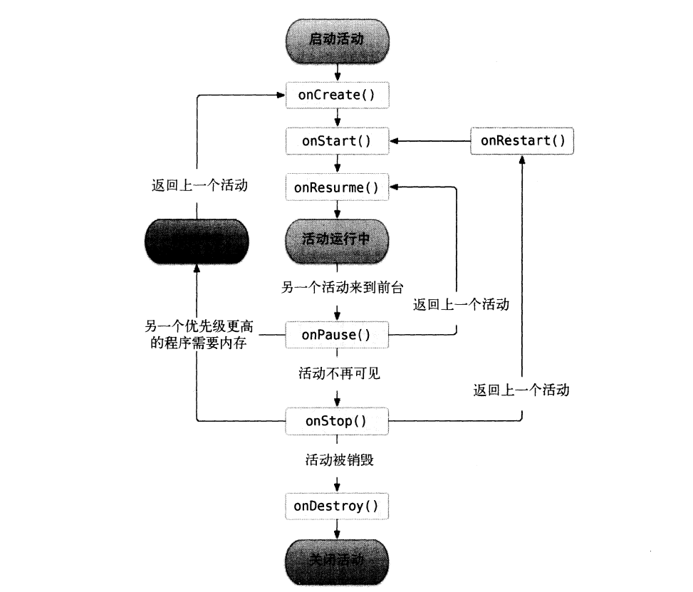
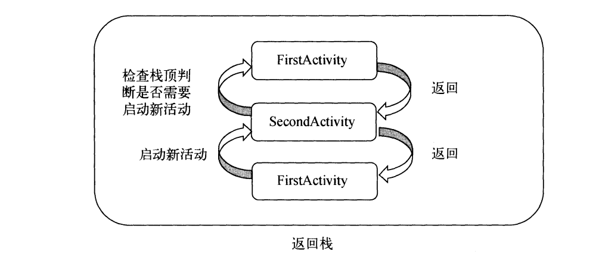

# 第2章 先从看得到的入手——探究活动  
## 2.1 活动是什么  
&emsp;&emsp;活动(Activity)是最容易吸引用户的地方，它是一种可以包含用户界面的组件，主要用于和用户进行交互。一个应用程序中可以包含零个或多个活动，但不包含任何活动的应用程序很少见，谁也不想让自己的应用永远无法被用户看到吧？  

## 2.2 活动的基本用法  
&emsp;&emsp;到现在为止，你还没有手动创建过活动呢。因为上一章中的HelloWordActivity是Android Studio帮我们自动创建的。手动创建活动可以加深我们的理解，因此现在是时候应该自己动手了。  
&emsp;&emsp;新建一个Android项目ActivityTest，但是我们不再选择Empty Activity这个选项，而是选择Add No Activity，因为这次我们准备手动创建活动。  
### 2.2.1 手动创建活动  
&emsp;&emsp;项目创建成功后，我们仍然会默认使用Android模式的项目结构，这里我们手动修改成Project模式，本书中后面的所有项目都要这样修改，以后就不再赘述了。目前ActivityTest项目中虽然还是自动生成很多文件，现在右击包->New->Activity->Empty Activity，会弹出一个活动的对话框，我们将活动命名为FirstActivity，并且不要勾选Generate Layout File 和 Launcher Activity这两个选项，勾选Generate Layout File 表示会自动为FirstActivity创建一个对应的布局文件，勾选LauncherActivity表示会自动将FirstActivity设置成当前项目的主活动，这里由于你是第一次手动创建活动，这些自动生成的东西暂时都不要勾选，下面我们将会一个个手动来完成。勾选BackwardsCompatibility表示会为项目启用向下兼容的模式，这个选项要勾上。点击Finish完成构建。  
&emsp;&emsp;你需要知道，项目中的任何活动都应该重写Activity的onCreate()方法，而目前我们的FirstActivity中已经重写了这个方法，这是由Android Studio自动帮我们完成的，代码如下所示：  
```
public class FirstActivity extends AppCompatActivity{
    @Override 
    protected void onCreate(Bundle savedInstanceState){
        super.onCreate(savedInstanceState);
    }
}
```
&emsp;&emsp;可以看到，onCreate()方法非常简单，就是调用了父类的onCreate()方法。当然这只是默认的实现，后面我们还需要在里面加入很多自己的逻辑。  
### 2.2.2 创建和加载布局  
&emsp;&emsp;前面我们说过，Android 程序的设计讲究逻辑和试图分离，最好每一个活动都能对应一个布局，布局就是用来显示界面内容的，因此我们现在就来手动创建一个布局文件。  
&emsp;&emsp;右击app/src/main/res目录->New->Directory，会弹出一个新建目录的窗口，这里先创建一个名为layout Source file，又会弹出一个新建布局资源窗口，我们将这个布局文件命名为first_layout，根元素就默认选择为LinearLayout。点击ok完成布局的创建，会出现Android Studio为我们提供的可视化布局编辑器，你可以在屏幕的中央区域预览当前的布局。在窗口的最下方有两个切换卡，左边是Design，右边是Text。Design是当前的可视化布局编辑器，在这里你不仅仅可以预览当前的布局，还可以通过拖放的方式编辑布局。而Text则是通过XML文件的方式来编辑布局的，现在点击一下Text切换卡，可以看到如下代码：  
```xml
<LinearLayout xmlns:android="http://schemas.android.com/apk/res/android"
    android:orientation="vertical"
     android:layout_width="match_parent" 
     android:layout_height="match_parent">
 
 </LinearLayout>
```
&emsp;&emsp;由于我们刚才在创建布局文件时选择了LinearLayout作为根元素，因此现在布局文件中已经有了一个LinearLayout元素了。那我们现在对这个布局稍稍做编辑，添加一个按钮，如下所示：

```xml
<LinearLayout xmlns:android="http://schemas.android.com/apk/res/android"
    android:orientation="vertical"
     android:layout_width="match_parent" 
     android:layout_height="match_parent">
    <Button
        adnrooid:id="@+id/button_1"
        android:layout_width="match_parent"
        android:layout_heght="wrap_content"
        adnroid:text="Button 1"/>
 </LinearLayout>
```
&emsp;&emsp;这里添加了一个Button元素，并在Button元素的内部增加了几个属性。android:id是给当前的元素定义一个唯一标识符，之后可以在代码中对这个元素进行操作。你可能对@+id/button_1这种语法感到陌生，但如果把加号去掉，变成@id/button_1，这样你就会觉得有些熟悉了吧，这不就是在XML中引用资源的语法吗？只不过是把string替换成了id。使得，如果你需要在XML中引用一个id，就使用@id/id_name这种语法。随后android:layout_width指定了当前元素的宽度和父元素一样宽。android:layout_hegiht指定了当前元素的高度，这里使用wrap_content表示当前元素的高度只要能刚好包含里面的内容就行。android:text指定了元素中显示的文字内容。  
&emsp;&emsp;通过预览窗口可以看到，按钮已经成功显示出来了，这样一个简单的布局就编写完成了，那么接下来我们要做的，就是在活动中加载这个布局。重新回到FirstActivity，在onCreate()方法中加入如下代码：  
```java
public class FirstActivity extends Activity{
    @Override
    protected void onCreate(Bundle savedInstanceState){
        super.onCreate(savedInstanceState);
        setContentView(R.layout.first_layout);
    }
    
}
```
&emsp;&emsp;可以看到，这里调用了setContentView()方法来给当前的活动加载一个布局，而在setContentView()方法中，我们一般都会传入一个布局文件的id。在第一章介绍项目资源的时候曾经提到过，项目中添加的任何资源都会在R文件中生成一个相应的资源id，因此我们刚才创建的first_layout.xml布局的id现在应该是已经添加到R文件中了。在代码中引用布局文件的方法你也已经学过了，只需要将这个值传入setContentView()方法即可。  

### 2.2.3 在AndroidManifest文件中注册
&emsp;&emsp;别忘了在上一章我们学过，所有的活动都要在AndroidManifest.xml中进行注册才能生效，而实际上FirstActivity已经在AndroidManifest.xml中注册过了，我们打开app/src/main/AndroidManifest.xml，代码如下所示：  
```xml
<manifest xmlns:android="http://schemas.android.com/apk/res/android"
          xmlns:tools="http://schemas.android.com/tools" package="com.zj970.activitytest">
    <application
            android:allowBackup="true"
            android:icon="@mipmap/ic_launcher"
            android:label="@string/app_name"
            android:roundIcon="@mipmap/ic_launcher_round"
            android:supportsRtl="true"
            android:theme="@style/Theme.ActivityTest">
        <activity android:name=".FirstActivity">
            
        </activity>
    </application>
</manifest>
```
&emsp;&emsp;可以看到，活动的注册声明要放在<application>标签内，这里是通过<activity>标签来对活动进行注册的。那么又是谁帮我们自动完成了FirstActivity的注册呢？当然是Android Studio了，之前在使用Eclipse创建活动或其他系统组件时，很多人都会忘记去AndroidManifest.xml中注册一下，从而导致程序运行崩溃，很显然Android Studio在这方面做得更加人性化。  
&emsp;&emsp;在<activity>标签中我们使用了android:name来指定具体注册哪一个活动，那么这里填入的.FirstActivity是什么意思呢？其实这不过就是就是全部包名的缩写。由于在最外层的<manifest>标签中已经通过package属性执行了程序的包名，因此这里直接使用.FirstActivity就足够了。  
&emsp;&emsp;不过，仅仅是这样注册了活动，我们的程序仍然是不能运行的，因为还没有为程序配置主活动，也就是说，当程序运行起来的时候，不知道要首先启动哪个活动。配置主活动的方法其实在第1章中已经介绍过了，就是在<activity>标签的内部加入<intent-filter>标签，并在这个标签里添加<action android:name="android.intent.action.MAIN"/>和<category android:name="android.intent.category.LAUNCHER"/>这两句即可。  
&emsp;&emsp;除此之外，我们还可以使用Android:label指定活动中标题栏的内容，标题栏是显示在活动最顶部的，待会儿运行的时候你就会看到。需要注意的是，给主活动指定的label不仅会成为标题栏中的内容，还会成为启动器(Launcher)中应用程序显示的名称。修改后的AndroidManifest.xml文件，代码如下所示：  
```xml
<manifest xmlns:android="http://schemas.android.com/apk/res/android"
          xmlns:tools="http://schemas.android.com/tools" package="com.zj970.activitytest">
    <application
            android:allowBackup="true"
            android:icon="@mipmap/ic_launcher"
            android:label="@string/app_name"
            android:roundIcon="@mipmap/ic_launcher_round"
            android:supportsRtl="true"
            android:theme="@style/Theme.ActivityTest">
        <activity android:name=".FirstActivity">
            <action android:name="android.intent.action.MAIN"/>
            <category android:name="android.intent.category.LAUNCHER"/>
        </activity>
    </application>
</manifest>
```
&emsp;&emsp;这样的话，FirstActivity就成为我们这个程序的主活动了，即点击桌面应用程序图标时首先打开的就是这个活动。另外需要注意，如果你的应用程序中没有声明任何一个活动作为主活动，这个程序仍然是可以正常安装的，只是你无法在启动器中看到或者打开这个程序。这种程序一般都是作为第三方服务供其他应用在内部进行调用的，如支付宝快捷支付服务。  

### 2.2.4 在活动中使用Toast  
&emsp;&emsp;Toast是Android系统提供的一种非常好的提醒方式，在程序中可以使用它将一些短小的信息通知给用户，这些信息会在一段时间后自动消失，并且不会占用任何屏幕空间，我们现在就尝试一下如何在活动中使用Toast。  
&emsp;&emsp;首先需要定义一个弹出Toast的触发点，正好界面上有个按钮，那我们就让点击这个按钮的时候弹出一个Toast吧，在onCreate()方法中添加如下代码：  
````
protected void onCreate(Bundle savedInstanaceState){
    super.onCreate(savedInstanaceState);
    setContentView(R.layout.first_layout);
    Button button1 = findViewById(R.id.button_1);
    btton1.setOnClickListener(new View.OnClickListener() {
        @Override
        public void onClick(View v){
            Toast.makeToast(FirstActivity.this, "You clicked Button 1", Toast.LENGTH_SHORT).show();
        }
    });
}
````
&emsp;&emsp;在活动中，可以通过findViewById()方法获取到布局文件中定义的元素，这里我们传入R.id.button_1，来得到按钮的实例，这个值是刚才在first_layout.xml中通过android:id属性指定的。findViewById()方法返回的是一个View对象，我们需要向下转型将它转成Button对象。得到按钮的实例之后，我们通过调用setOnClickListener()方法为按钮注册一个监听器，点击按钮时就会执行监听器中的onClick()方法。因此，弹出Toast的功能当然是在onClick()方法中编写了。  
&emsp;&emsp;Toast的用法非常简单，通过静态方法makeText()创建出一个Toast对象，然后调用show()方法将Toast显示就可以了。这里需要注意的是，makeText()方法需要传入3个参数。第一个参数是Context，也就是Toast要求的上下文，由于活动本身就是一个Context对象，因此这里直接传入FirstActivity.this即可。第二个参数是Toast显示的文本内容，第三个参数是Toast显示的时长，有两个内置常量可以选择Toast.LENGTH_SHORT和Toast.LENGTH_LONG。  

### 2.2.5 在活动中使用Menu  
&emsp;&emsp;手机毕竟和电脑不同，它的屏幕空间非常有限，因此充分地利用屏幕空间在手机界面设计中就显得非常重要了。如果你的活动中有大量的菜单需要显示，这个时候界面设计就会比较尴尬，因为这些菜单就可能占用屏幕将近三分之一的空间，这该怎么办呢？不用担心，Android给我们提供了一种方式，可以让菜单都能得到展示的同时，还能不占用任何屏幕空间。  
&emsp;&emsp;首先在res目录下新建一个menu文件夹，右击res目录->New->Directory，输入文件夹名menu，点击OK。接着在这个文件夹下再新建一个名叫main的菜单文件，右击menu文件夹->New->Menu resource file，文件名输入main，点击OK完成创建。然后在main.xml中添加如下代码：  

```xml
<?xml version="1.0" encoding="utf-8"?>
<menu xmlns:android="http://schemas.android.com/apk/res/android">
    <item
        android:id="@+id/add_item"
        android:title="Add"/>
    <item
        android:id="@+id/remove_item"
        android:title="Remove"/>
    <item
        android:id="@+id/teat_item"
        android:title="Test"/>

</menu>
```
&emsp;&emsp;这里我们创建了3个菜单项，其中<item>标签就是用来创建具体的某一个菜单项，然后通过android:id给这个菜单项指定一个唯一的标识符，通过android:title给这个菜单项指定一个名称。  
&emsp;&emsp;接着重新回到FirstActivity中重写onCreateOptionsMenu()方法，然后在onCreateOptionsMenu()方法中编写如下代码：  
```
public boolean onCreateOptionsMenu(Menu menu){
    getMenuInflater().inflate(R.menu.main,menu);
    return true;
}
```
&emsp;&emsp;通过getMenuInflater()方法能够得到MenuInflater对象，再调用它的inflate()方法就可以给当前活动创建菜单了。inflate()方法接收两个参数，第一个参数用于指定我们通过哪一个资源文件来创建菜单，这里当然传入R.menu.main。第二个参数用于指定我们的菜单项将添加到哪一个Menu对象当中，这里直接使用onCreateOptionsMenu()方法中传入的menu参数。然后给这个方法返回true，表示允许创建的菜单显示出来，如果返回了false，创建的菜单将无法显示。  
&emsp;&emsp;当然，仅仅让菜单显示出来是不够的，我们定义菜单不仅是为了看的，关键是要菜单真正可用才行，因此还要再定义菜单响应事件。在FirstActivity中重写onOptionsItemSelected()方法：  
```
public boolean onOptionsItemSelected(MenuItem item){
    switch (item.getItemId()) {
            case R.id.add_item:
                Toast.makeText(FirstActivity.this,"You clicked Add",Toast.LENGTH_LONG).show();
                Log.i(TAG,"You clicked Add");
                break;
            case R.id.remove_item:
                Toast.makeText(FirstActivity.this,"You clicked Remove",Toast.LENGTH_SHORT).show();
                break;
            case R.id.teat_item:
                Toast.makeText(FirstActivity.this,"You clicked Test",Toast.LENGTH_LONG).show();
                break;
            default:
    }
     return true;
}
```
&emsp;&emsp;在onOptionsItemSelected()方法中，通过调用item.getItemId()来判断我们点击的是哪一个菜单项，然后给每个菜单项加入自己的逻辑处理，这里我们就活学活用，弹出一个刚刚学会的Toast。重新运行程序，你会发现在标题栏的右侧多了一个三点的符号，这个就是菜单按钮了。菜单里的菜单项默认是不会显示出来的，只有点击一下菜单按钮才会弹出里面具体的内容，因此它不会占用任何活动的空间，然后如果你点击了Add菜单项就会弹出You clicked Add 提示，如下所示：  


### 2.2.6 销毁一个活动  
&emsp;&emsp;通过上节的学习，你已经掌握了手动创建活动的方法，并学会了如何在活动中创建Toast和创建菜单。或许你现在心中会有个疑惑，如何销毁一个活动呢？  
&emsp;&emsp;其实答案非常简单，只要按一下Back键就可以销毁当前的活动了。不过如果你不想通过按键的方式，而是希望在程序中通过代码来销毁活动，当然也可以，Activity提供了一个finish()方法，我们在活动中调用一下这个方法就可以销毁当前活动了。  

## 2.3 使用Intent在活动之间穿梭   
&emsp;&emsp;只有一个活动的应用也太简单了吧？没错，你的追求应该更高点。不管你想创建多少个活动，方法都和上一节中介绍的是一样的。唯一的问题在于，你在启动器中点击应用的图标只会进入到该应用的主活动，那么怎样才能由主活动跳转到其他活动呢？  
### 2.3.1 使用显示Intent
&emsp;&emsp;你应该已经对创建活动的流程比较熟悉了，那我们现在快速地在ActivityTest项目中再创建一个SecondActivity活动，get布局文件起名为second_layout。点击Finish完成创建，Android Studio会为我们自动生成SecondActivity.java和second_layout.xml这连个文件。不过自动生成的布局代码目前对你来说可能有些复杂，这里我们仍然还是使用最熟悉的LinearLayout，编辑second_layout.xml：  
```xml
<?xml version="1.0" encoding="utf-8"?>
<LinearLayout
        xmlns:android="http://schemas.android.com/apk/res/android"
        xmlns:tools="http://schemas.android.com/tools"

        android:layout_width="match_parent"
        android:layout_height="match_parent"
        tools:context=".SecondActivity">

    <Button
            android:id="@+id/button_3"
            android:layout_width="wrap_content"
            android:layout_height="wrap_content"
            android:text="Button 3"
    />

    <Button
            android:id="@+id/button_6"
            android:layout_width="wrap_content"
            android:layout_height="wrap_content"
            android:layout_marginLeft="50dp"
            android:text="button 6"/>


</LinearLayout>
```
&emsp;&emsp;然后SecondActivity中的代码已经自动生成了一部分，我们保持默认不变就好，另外不要忘记，任何一个活动都需要在AndroidManifest.xml中注册的，不过幸运的是，Android Studio 已经帮我们自动完成了。  
&emsp;&emsp;由于SecondActivity不是主活动，因此不需要配置<intent-filter>标签中的内容，注册活动的代码也简单了许多。现在第二个活动已经创建完成，剩下的问题就是如何去启动这第二个活动了，这里我们需要引入一个新概念: Intent。  
&emsp;&emsp;Intent是Android程序中各组件之间进行交互的一种重要方式，它不仅可以指明当前组件想要执行的动作，还可以在不同组件之间传递数据。Intent一般可被用于启动活动、启动服务以及发送广播等场景，Intent大致可以分为两种:显示Intent和隐式Intent，我们先来看一下显示Intent如何使用。  
&emsp;&emsp;Intent有多个构造函数的重载，其中一个是Intent(Context packageContext, Class<?> cls)。这个构造函数接收两个参数，第一个参数Context要求提供一个启动活动的上下文，第二个参数Class则是指定想要启动的目标活动，通过这个构造函数就可以构建出Intent的“意图”。然后我们应该怎么使用这个Intent呢？Activity类中提供了一个startActivity()方法，这个方法是专门用于启动活动的，它接收一个Intent参数，这里我们将构建好的Intent传入startActivity()方法就可以启动目标活动了。修改FirstActivity中按钮的点击事件，代码如下所示：  
```
button1.setOnClickListener(new View.OnClickListener(){
    @Override
    public void onClick(View view){
        Intent intent = new Intent(FirstActivity.this, SecondActivity.class);
        startActivity(intent);
    }
});
```
&emsp;&emsp;我们首先构建出了一个Intent，传入FirstActivity.this作为上下文，传入SecondActivity.class作为目标活动，这样我们的“意图”就非常明显了，即在FirstActivity这个活动的基础上打开SecondActivity这个活动。然后通过startActivity()方法来执行这个Intent。使用这种方式来启动活动，Intent的“意图”非常明显，因此我们称之为显示Intent。  

### 2.3.2 使用隐式Intent  
&emsp;&emsp;相比于显示Intent，隐式Intent则含蓄了许多，它并不明确指出我们想要启动哪一个活动，而是指定了一系列更为抽象的action和category等信息，然后交予系统去分析这个Intent，并帮我们找出合适的活动去启动。  
&emsp;&emsp;什么叫作合适的活动呢？简单来说就是可以响应我们这个隐式Intent的活动，那么目前SecondActivity可以响应什么样的隐式Intent呢？通过<activity>标签下配置<intent-filter>的内容。可以指定当前活动能够响应的action和category，打开AndroidManifest.xml，添加如下代码：  
```xml
<activity android:name=".SecondActivity">
    <intent-filter>
        <action android:name="com.zj970.activitytest.ACTION_START"/>
        <category android:name="android.intent.category.DEFAULT"/>
    </intent-filter> 
</activity>
```
&emsp;&emsp;在<action>标签中我们指明了当前活动可以响应com.zj970.activitytest.ACTION_START这个action，而<category>标签则包含了一些附加信息，更加精确地指明了当前的活动能够响应的Intent中还可能带有的category。只有<action>和<category>中的内容同时能够匹配上Intent中指定的action和category时，这个活动才能响应该Intent。修改FirstActivity中按钮的点击事件，代码如下所示：  
```
button1.setOnClickListener(new View.OnClickListener() { 
    @Override
    public void onClick(View view) {
        Intent intent = new Intent("com.zj970.activitytest.ACTION_START");
        startActivity(intent);
    }
});
```
&emsp;&emsp;可以看到，我们使用了Intent的另一个构造函数，直接将action的字符串传了进去，表明我们想要启动能够响应com.zj970.activitytest.ACTION_START这个action的活动。那前面不是说要<action>和<category>同时匹配才能响应的吗？怎么没看到哪里有指定category呢？这是因为android.intent.category.DEFAULT是一种，默认的category，在调用startActivity()方法的时候会自动将这个category添加到Intent中。  
&emsp;&emsp;重新运行程序，在FirstActivity的界面上点击一下按钮，你同样成功启动SecondActivity了。不同的是，这次你使用了隐式Intent的方式来启动的，说明我们在<activity>标签下配置的action和category的内容已经生效了！  
&emsp;&emsp;每个Intent中只能指定一个action，但却能指定多个category。目前我们的Intent中只有一个默认的category，那么现在再来增加一个，修改FirstActivity中按钮的点击事件，代码如下所示：  
```
button1.setOnClickListener(new View.OnClickListener() { 
    @Override
    public void onClick(View v) {
        Intent intent = new Intent("com.zj970.activitytest.ACTION_START");
        intent.addCategory("com.zj970.activitytest.MY_CATEGORY");
        startActivity(intent);
    }
});
```
&emsp;&emsp; 现在重新运行程序，在FirstActivity的界面点击一下按钮，你会发现，程序崩溃了！这是你第一次遇到程序崩溃，可能会有些束手无策。别紧张，其实大多数的崩溃问题都是很好解决的，只要你善于分析。在Logcat界面查看错误日志，你会看到如下错误信息：  
  
&emsp;&emsp;错误信息中提醒我们，没有呢任何一个活动可以响应我们的Intent，为什么呢？这是因为我们刚刚在Intent中新增了一个category，而SecondActivity的<intent-filter>标签中并没有声明可以响应这个category，所以就出现了没有任何活动可以响应该Intent的情况。现在我们在<intent-filter>中再添加一个category的声明就行了。  
```xml
        <activity android:name=".SecondActivity">
            <intent-filter>
                <action android:name="aom.zj970.activitytest.ACTION_START"/>
                <category android:name="android.intent.category.DEFAULT"/>
                <category android:name="android.intent.category.MY_CATEGORY"/>
            </intent-filter>
        </activity>
```

### 2.3.3 更多隐式Intent的用法  
&emsp;&emsp;在上一节中，你掌握了通过隐式Intent来启动活动的方法，但实际上隐式Intent还有更多的内容需要你去了解，本节我们就来展开介绍一下。  
&emsp;&emsp;使用隐式Intent。我们不仅可以启动自己程序的活动，还可以启动程序的活动，这使得Android多个应用程序之间的功能共享成为了可能。比如说你的应用程序需要展示一个网页，这时你没有必要自己去实现一个浏览器，而是只需要调用系统的浏览器来打开这个网页就就行了。修改FirstActivity中按钮点击事件的代码，如下所示：  
```
    button1.setOnClickListener(new View.OnClickListener(){
        @Override
        public void onClick(View v){
            Intent intent = new Intent(Intent.ACTION_VIEW);
            intent.setData(Uri.parse("http://www.baidu.com"));
            startActivity(intent);
        }
    });
```
&emsp;&emsp;这里我们首先指定了Intent的action是Intent.ACTION_VIEW，这是一个Android内置的动作，其常量值为android.intent.action.VIEW。然后通过Uri.parse()方法，将一个网址字符串解析成一个Uri对象，再调用Intent的setData()方法将这个Uri对象传递进去。  
&emsp;&emsp;在上述代码中，setData()部分它接收一个Uri对象，主要用于指定当前Intent正在操作的数据，而这些数据通常都是以字符串的形式传入到Uri.parse()方法中解析产生的。  
&emsp;&emsp;与此对应，我们还可以在<intent-filter>标签中再配置一个<data>标签，用于更精确地指定当前活动能够响应什么类型的数据。<data>标签中主要可以配置以下内容。  

- android:scheme 用于指定数据的协议部分，如上例中的http部分。
- android:host。用于指定数据的主机名部分，如上例中的www.baidu.com部分
- android:port。用于指定数据的端口部分，一般紧随在主机名之后。 
- android:path。用于指定主机名和端口之后的部分，如一段网址中跟在域名之后的内容。  
- android:mimeType。用于指定可以处理的数据类型，允许使用通配符的方式进行指定。  

&emsp;&emsp;只有<data>标签中指定的内容和Intent中携带的Data完全一致时，当前活动才能够响应该Intent。不过一般在<data>标签中都不会指定过多的内容，如上面浏览器示例中，其实只需要指定android:scheme为http，就可以响应所有的http协议的Intent了。  
&emsp;&emsp;在这里我们新建一个ThirdActivity活动，并将其布局文件内容修改为：  
```xml
<?xml version="1.0" encoding="utf-8"?>
<LinearLayout
        xmlns:android="http://schemas.android.com/apk/res/android"
        xmlns:tools="http://schemas.android.com/tools"
        android:orientation="vertical"
        android:layout_width="match_parent"
        android:layout_height="match_parent"
        tools:context=".ThirdActivity">

    <Button android:id="@+id/button_4"
            android:layout_width="match_parent"
            android:layout_height="wrap_content"
            android:text="Button 4"/>

    
</LinearLayout>
```
&emsp;&emsp;ThirdActivity修改注册信息：  
```xml
<activity android:name=".ThreadActivity">
    <intent-filter>
        <action android:name="android.intent.action.View"/>
        <category android:name="android.intent.category.DEFAULT" />
        <data android:scheme="http"/>
    </intent-filter>    
</activity>

```
&emsp;&emsp;我们在ThirdActivity的<intent-filter>中配置了当前活动能够响应的action是Intent.ACTION_VIEW的常量值，而category则毫无疑问指定了默认的category值，另外在<data>标签中我们通过android:scheme指定了数据的协议必须是http协议，这样ThirdActivity应该就和浏览器一样，能够响应一个打开网页的Intent了。让我们运行一下程序，店家一下按钮，结果如图所示：  

&emsp;&emsp;可以看到，系统自动弹出了一个列表，显示了目前能够响应这个Intent的所有程序。选择Browser还会像之前打开浏览器，并显示百度的主页，而如果选择了ActivityTest，则会启动ThirdActivity。JUST ONCE表示只是这次使用选择的程序打开，ALWAYS则表示以后一直都使用这次选择的程序打开。需要注意的是，虽然我们声明了ThirdActivity是可以响应打开网页的Intent的，但实际上这个活动并没有加载并显示网页的功能，所以在真正的项目中尽量不要出现这种有可能误导用户的行为，不然会让用户对我们的应用产生负面的印象。  
&emsp;&emsp;除了http协议外，我们还可以指定很多其他协议，比如geo表示地理位置、tel表示拨打电话。下面的代码展示了如何在我们的程序中调用系统拨号界面。  
```
button1.setOnClickListener(new View.OnClickListener(){
    @Override
    public void onClick(View v){
        Intent intent = new Intent(Intent.ACTION_DIAL);
        intent.setData(Uri.parse("tel:10086"));
        startActivity(intent);
    }
});
```
&emsp;&emsp;首先指定了Intent的action是Intent.ACTION_DIAL，这又是一个Android系统的内置动作。然后在data部分指定了协议是tel，号码是10086。  

### 2.3.4 向下一个活动传递数据  
&emsp;&emsp;经过前面几节的学习，你已经对Intent有了一定的了解。不过到目前为止，我们都只是简单地使用Intent来启动一个活动，其实Intent还可以在启动活动的时候传递数据，下面我们来看一下。  
&emsp;&emsp;在启动活动时传递数据的思路很简单，Intent中提供了一系列putExtra()方法的重载，可以把我们想要传递的数据暂存在Intent中，启动了另一个活动后，只需要把这些数据再从Intent中取出就可以了。比如说FirstActivity中有一个字符串，现在想把这个字符串传递SecondActivity中，你就可以这样编写：  
```
button1.setOnClickListener(new View.OnClickListener() { 
    @Override
    public void onClick(View view) {
        String data =  "Hello SecondActivity";
        Intent intent = new Intent(FirstActivity.this,SecondActivity.class);
        intent.putExtra("extra_data",data);
        startActivity(intent);
    }
});
```
&emsp;&emsp;这里我们还是使用显式Intent的方式来启动SecondActivity，并通过putExtra()方法传递了一个字符串。注意这里putExtra()方法接收两个参数，第一个参数是键，用于后面从Intent中取值，第二参数才是真正要传递的数据。然后在SecondActivity中将传递的数据取出，并打印出来，代码如下所示：  

```
public class SecondActivity extends Activity{
    @Override
    protected void onCreate(Bundle savedInstanceState){
        super.onCreate(savedInstanceState);
        Intent intent = getIntent();
        String data = intent.getSrtringExtra("extra_data");
        Log.d("SecondActivity", data);
    }
}
```

&emsp;&emsp;首先可以通过getIntent()方法获取到用于启动SecondActivity的intent，然后调用getStringExtra()方法，传入相应的键值，就可以得到传递的数据了。这里由于我们传递的是字符串，所以使用getStringExtra()方法来获取传递数据。如果传递的是整型数据，则使用getIntExtra()方法；如果传递的是布尔型数据，则使用getBooleanExtra()方法，以此类推。现在重新运行程序，如下所示：  


### 2.3.5 返回数据给上一活动  
&emsp;&emsp;既然可以传递数据给下一个活动，那么能不能够返回数据给上一个活动呢？答案是肯定的。不过不同的是，返回上一个活动只需要按一下Back键就可以了，并没有一个用于启动活动Intent来传递数据。通过查询文档你会发现，Activity还有一个startActivityForResult()方法也是用于启动活动的，但这个方法期望在活动销毁的时候能够返回一个结果给上一个活动。毫无疑问，这就是我们所需要的。startActivityForResult()方法接收两个参数，第一个参数还是Intent，第二个参数是请求码，用于在之后的回调中判断数据的来源。我们还是来实战一下，修改FirstActivity中按钮的点击事件：  
```
button1.setOnClickListener(new View.OnClickListener(){
    @Override
    public void onClick(View v) {
        Intent intent = new Intent(FirstActivity.this, SecondActivity.class);
        startActivityForResult(intent,1);
    }
});
```
&emsp;&emsp;这里我们使用startActivityForResult()方法来启动SecondActivity，请求码只要是一个唯一值就可以了，这里传入了1。接下来我们在SecondActivity中给注册点击事件，并在点击事件里添加返回数据的逻辑，代码如下所示：  
```
public class SecondActivity extends AppCompatActivity{

    @Override
    protected void onCreate(Bundle savedInstanceState) {
        super.onCreate(savedInstanceState);
        setContentView(R.layout.second_activity);
        Button button2 = findViewById(R.id.button2);
        button2.setOnClickListener(new View.OnClickListener(){
            @Override
            public void onClick(View v){
                Intent intent = new Intent();
                intent.putExtra("data_return","Hello FirstActivity");
                setResult(RESULT_OK,intent);
                finish();
            }
        });
    }
}
```
&emsp;&emsp;可以看到，我们还是构建了一个Intent，只不过这个Intent仅仅是用于传递数据而已，它没有指定任何的“意图”。紧接着要把传递的数据存放在Intent中，然后调用了setResult()方法，这个方法非常重要，是专门用于向上一个活动返回数据的。setResult()方法接收两个参数，第一个参数用于向上一个活动返回处理结果，一般只使用RESULT_OK或RESULT_CANCELED这两个值，第二个参数则把带有数据的Intent擦魂帝回去，然后调用了finish()方法来销毁当前活动。  
&emsp;&emsp;由于我们是使用startActivityForResult()方法来启动SecondActivity的，在SecondActivity被销毁之后会回调上一个活动的onActivityResult()方法，因此我们需要在FirstActivity中重写这个方法来得到返回的数据，如下所示：  
```
@Override
protected void onActivityResult(int requestCode, int resultCode, Intent data){
    switch(requestCode){
        case 1:
            if(resultCode == RESULT_OK){
                String returnedData = data.getStringExtra("data_return");
                Log.d("FirstActivity",returnedData);
            }
            break;
        default:
        }    
}

```

&emsp;&emsp;onActivityResult()方法带有三个参数，第一个参数requestCode，即我们在启动活动时传入的请求码。第二个参数resultCode。即我们在返回数据时传入的处理结果。第三个参数data，即携带带着返回数据的Intent。由于在一个活动中有可能调用startActivityForResult()方法去启动很多不同的活动，每一个活动返回的数据都会回调到onActivityResult()这个方法中，因此我们首先要做的就是通过检查requestCode的值来判断数据来源。确定数据是从SecondActivity返回的之后，我们再通过resultCode的值来判断处理结果是否成功。最后从data中取值并打印出来，这样就完成了向上一个活动返回数据的工作。  
&emsp;&emsp;重新运行程序，在FirstActivity的界面点击按钮会打开SecondActivity，然后在SecondActivity界面点击Button2按钮会回到FirstActivity，这时查看logcat的打印信息：  

&emsp;&emsp;可以看到，SecondActivity已经成功返回数据给FirstActivity了。这个时候你可能会问，如果用户在SecondActivity中并不是通过点击按钮，而是通过按下Back键回到FirstActivity，这样数据不就没法返回了吗？没错，不过这种情况还是很好处理，我们可以通过SecondActivity中重写onBackPressed()方法来解决这个问题，代码如下所示：  
```
@Override
public void onBackPressed() {
    Intent intent = new Intent();
    intent.putExtra("data_return","Hello FirstActivity");
    setResult(RESULT_OK, intent);
    finish();
}
```
&emsp;&emsp;这样的话，当用户按下Back键，就会去执行onBackPressed()方法中的代码，我们在这里添加返回数据的逻辑就行了。  

## 2.4 活动的生命周期  
&emsp;&emsp;掌握活动的生命周期对任何Android开发者来说都非常重要，当你深入理解活动的生命周期之后，就可以写出更加连贯流畅的程序，并在如何合理管理应用资源方面发挥得游刃有余。你的应用程序将会拥有更好的用户体验。  
### 2.4.1 返回栈  
&emsp;&emsp;经过前面几节的学习，我相信你已经发现这一点，Android中的活动是可以层叠的。我们每启动一个新的活动，就会覆盖在原活动之上，然后点击Back键会销毁最上面的活动，下面的一个活动就会重新显示出来。  
&emsp;&emsp;其实Android是使用任务(Task)来管理活动的，一个任务就是一组存放在栈里的活动的集合，这个栈也被称作返回栈(Back Stack)。栈是一种后进先出的数据结构，在默认情况下，每当我们启动了一个新的活动，它会在返回栈入栈，并处于栈顶的位置。而每当我们按下Back键或调用finish()方法去销毁一个活动时，处于栈顶的活动会出栈，这时前一个入栈的活动就会重新处于栈顶的位置。系统总是会显示处于栈顶的活动给用户。下图展示了返回栈是如何管理活动入栈出栈操作的：  


### 2.4.2 活动状态  
&emsp;&emsp;每个活动在其生命周期中最多可能会有4种状态。  

1. 运行状态

&emsp;&emsp;当一个活动位于返回栈的栈顶时，这时活动就处于运行状态。系统最不愿意回收的就是处于运行状态的活动，因为这会带来非常差的用于体验。

2. 暂停状态

&emsp;&emsp;当一个活动不再处于栈顶位置，但仍然可见时，这时活动就进入了暂停状态。你可能会觉得既然活动已经不在栈顶了，还怎么会可见呢？这是因为并不是每一个活动都会占满整个屏幕的，比如对话框形式的活动只会占用屏幕中间的部分区域，你很快就会在后面看到这种活动。处于暂停状态的活动仍然是完全存活着的，系统也不愿意去回收这种活动（因为它还是可见的，回收可见的东西都会在用户体验方面有不好的影响），只有在内存极低的情况下，系统才会去考虑回收这种活动。

3. 停止状态

&emsp;&emsp;当一个活动不再处于栈顶位置，并且完全不可见的时候，就进入了停止状态。系统仍然会为这种活动保存相应的状态和成员变量，但是这并不是完全可靠的，当其他地方需要内存时，处于停止状态的活动有可能会被系统回收。

4. 销毁状态

&emsp;&emsp;当一个活动从返回栈中移除后就变成了销毁状态。系统会最倾向于回收处于这种状态的活动，从而保证手机的内存充足。  

### 2.4.3 活动的生存期  
&emsp;&emsp;Activity类中定义了7个回调方法，覆盖了活动生命周期的每一个环节，下面就来一一介绍这7个方法。  
- onCreate() 这个方法你已经看到过很多次了，每个活动中我们都重写了这个方法，它会在活动第一次被创建的时候调用。你应该在这个方法中完成活动的初始化操作，比如说加载布局、绑定事件等。  
- onStart() 这个方法在活动由不可见变为可见的时候调用。  
- onResume() 这个方法在活动准备好和用户进行交互的时候调用。此时的活动一定位于返回栈的栈顶，并且处于运行状态。  
- onPause() 这个方法在系统准备去启动或者恢复另一个活动的时候调用。我们通常会在这个方法中将一些消耗CPU的资源释放掉，以及保存一些关键数据，但这个方法的执行速度一定要快，不严会影响到新的栈顶活动的使用。  
- onStop() 这个方法在活动完全可见的时候调用。它和onPause()方法的主要区别在于，如果启动的新活动是一个对话框的活动，那么onPause()方法会得到执行，而onStop()方法并不会执行。  
- onDestroy() 这个方法在活动被销毁之前调用，之后活动的状态将变为销毁状态。  
- onRestart() 这个方法在活动由停止状态变为运行状态之前调用，也就是活动被重新启动了。

&emsp;&emsp;以上7个方法中除了onRestart()方法，其他都是两两相对的，从而又可以将活动分为3种生存期。  

- 完整生存期。活动在onCreate()方法和onDestroy()方法之间所经历的，就是完整生存期。一般情况下，一个活动会在onCreate()方法中完成各种初始化操作，而在onDestroy()方法中完成释放内存的操作。  
- 可见生存期。活动在onStart()方法和onStop()方法之间所经历的，就是可见生存期。在可见生存期内，活动对于用户总是可见的，即便有可能无法和用户进行交互。我们可以通过这两个方法，合理地管理哪些对用户可见的资源。比如说在onStart()方法中对资源进行加载，而在onStop()方法中对资源进行释放，从而保证处于停止状态的活动不会占用过多内存。  
- 前台生存期。活动在onResume()方法和onPause()方法之间所经历的就是前台生存期。在前台生存期内，活动总是处于运行状态的，此时的活动是可以和用户进行交互的，我们平时看到和接触最多的也就是这个状态下的活动。

&emsp;&emsp;为了帮助你能够更好地理解，Android官方提供了一张活动生命周期的示意图，如下所示：  


### 2.4.4 体验活动的生命周期  
&emsp;&emsp;讲了这么多理论知识，也是时候该实战一下了，下面我们将通过一个实例，让你可以更加直观体验活动的生命周期。  
&emsp;&emsp;我们在新建一个ActivityLifeCycleTest项目，这次我们允许Android Studio帮我们自动创建活动和布局，并且勾选Launcher Activity来将创建的活动设置为主活动，这样可以省去不少工作，创建的活动名和布局名都使用默认值。然后我们需要分别再创建两个子活动——NormalActivity和DialogActivity，其布局文件如下： 
- normal_layout.xml

```xml
<?xml version="1.0" encoding="utf-8"?>
<LinearLayout
        xmlns:android="http://schemas.android.com/apk/res/android"
        xmlns:tools="http://schemas.android.com/tools"
        xmlns:app="http://schemas.android.com/apk/res-auto"
        android:orientation="vertical"
        android:layout_width="match_parent"
        android:layout_height="match_parent"
        tools:context=".NormalActivity">
    <TextView
            android:layout_width="match_parent"
            android:layout_height="wrap_content"
            android:text="This is a normal activity"
            android:textSize="28sp"/>

</LinearLayout>
```
- dialog_layout.xml

```xml
<?xml version="1.0" encoding="utf-8"?>
<LinearLayout
        xmlns:android="http://schemas.android.com/apk/res/android"
        xmlns:tools="http://schemas.android.com/tools"
        xmlns:app="http://schemas.android.com/apk/res-auto"
        android:orientation="vertical"
        android:layout_width="match_parent"
        android:layout_height="match_parent"
        tools:context=".DialogActivity">
    <TextView
            android:layout_width="match_parent"
            android:layout_height="wrap_content"
            android:text="This is a dialog activity"
            android:textSize="28sp"/>

</LinearLayout>
```
&emsp;&emsp;两个布局文件的代码几乎没有区别，只是显示的文字不同而已。其实从名字上就可以看出，这两个活动一个是普通活动，一个是对话框式的活动。可是我们并没有修改活动的任何代码，两个活动的代码应该几乎是一模一样，在哪里有体现出将活动设成对话框式呢？别着急，下面我们马上开始设置。修改AndroidManifest.xml的<activity>标签的配置，如下所示：  
```
<activity android:name=".NormalActivity"></activity>

<activity android:name=".DialogActivity"
          android:theme="@android:style/Theme.Dialog">
</activity>
```
&emsp;&emsp;这里是两个活动的注册代码，但是DialogActivity的代码有些不同，我们给它使用了一个android:theme属性，这是用于给当前活动指定主题的，Android系统内置有很多主题可以选择，当然我们也可以定制自己的主题，而这里@android:style/Theme.Dialog则毫无疑问是让DialogActivity使用对话框式的主题。接下来修改activity_main.xml：  
```xml
<?xml version="1.0" encoding="utf-8"?>
<LinearLayout
        xmlns:android="http://schemas.android.com/apk/res/android"
        xmlns:tools="http://schemas.android.com/tools"
        android:orientation="vertical"
        android:layout_width="match_parent"
        android:layout_height="match_parent"
        tools:context=".MainActivity">
    <Button
            android:id="@+id/start_normal_activity"
            android:layout_width="match_parent"
            android:layout_height="wrap_content"
            android:text="Start NormalActivity"/>
    <Button
            android:id="@+id/start_dialog_activity"
            android:layout_width="match_parent"
            android:layout_height="wrap_content"
            android:text="Start DialogActivity"/>

</LinearLayout>
```
&emsp;&emsp;可以看到，我们在LinearLayout中加入了两个按钮，一个用于启动NormalActivity，一个用于启动DialogActivity，最后修改MainActivity中的代码：  
```java
package com.zj970.activitylifecycletest;

import android.content.Intent;
import android.os.Handler;
import android.util.Log;
import android.view.View;
import android.widget.Button;
import androidx.appcompat.app.AppCompatActivity;
import android.os.Bundle;

/**
 * 每个活动在其生命周期最多可能有4种状态
 * 1. 运行状态
 * 2. 暂停状态
 * 3. 停止状态
 * 4. 销毁状态
 */
public class MainActivity extends AppCompatActivity {

    private static final String TAG = "MainActivity";
   // private static int startNum = 1;//启动次数
    /**
     * 每个活动我们都重写了这个方法，它会在活动第一次被创建的时候调用。
     * 你应该在这个方法中完成活动的初始化操作，比如说加载布局、绑定事件等.
     * 这个验证失败
     * @param savedInstanceState 如果在活动被系统回收之前通过onSaveInstanceStata()方法保存数据，这个参数就有之前保存的全部数据
     */
    @Override
    protected void onCreate(Bundle savedInstanceState) {
        super.onCreate(savedInstanceState);
        setContentView(R.layout.activity_main);
        Button startNormalActivity = findViewById(R.id.start_normal_activity);
        Button startDialogActivity = findViewById(R.id.start_dialog_activity);
        Log.d(TAG,"开始执行onCreate()方法");
        if (savedInstanceState != null){
            String tempdata = savedInstanceState.getString("data_key");
            Log.d(TAG,tempdata);
        }
        startNormalActivity.setOnClickListener(new View.OnClickListener() {
            @Override
            public void onClick(View v) {
                Intent intent_normal = new Intent(MainActivity.this,NormalActivity.class);
                startActivity(intent_normal);
            }
        });
        startDialogActivity.setOnClickListener(new View.OnClickListener(){
            @Override
            public void onClick(View v) {
                Intent intent_dialog = new Intent(MainActivity.this,DialogActivity.class);
                startActivity(intent_dialog);
            }
        });
    }

    /**
     * 这个方法在活动由不可见变为可见的时候调用
     */
    @Override
    protected void onStart() {
        super.onStart();
        Log.d(TAG,"开始执行onStart()方法");
    }

    /**
     * 这个方法在活动准备号和用户进行交互的时候调用
     * 此时的活动一定处于栈顶，并且处于运行的状态
     */
    @Override
    protected void onResume() {
        super.onResume();
        Log.d(TAG,"开始执行onResume()方法");
    }

    /**
     * 这个方法在系统准备去启动或者去恢复另一个活动的时候调用
     * 我们通常在这个方法中将一些消耗cpu的资源释放掉，以及保存一些关键数据
     * 但这个方法的执行速度一定要快，不然会影响到栈顶活动的调用
     */
    @Override
    protected void onPause() {
        super.onPause();
        Log.i(TAG,"开始执行onPause()方法");
    }

    /**
     * 这个方法在活动完全不可见的时候调用
     * 它和onPause方法的主要区别在于，如果启动的是一个对话框式的活动，那么onPause会执行，而onStop不会执行
     */
    @Override
    protected void onStop() {
        super.onStop();
        new Handler().post(new Runnable() {
            public void run() {
                // TODO Auto-generated method stub
                Runtime.getRuntime().exit(1);
            }
        });
        Log.d(TAG,"开始执行onStop()方法");
    }

    /**
     * 这个方法在活动被销毁之前调用，之后的活动的状态将变为销毁状态
     */
    @Override
    protected void onDestroy() {
        super.onDestroy();
        Log.i(TAG,"开始执行onDestroy()方法");
    }

    /**
     * 这个方法在活动由停止状态变为运行状态之前调用，也就是活动被重新启动了
     */
    @Override
    protected void onRestart() {
        super.onRestart();
        Log.i(TAG,"开始执行onRestart()方法");
    }


    /**
     * 当活动被回收时如何保存数据，使用onSaveInstanceState(0回调方法
     * 这个方法可以保证在活动被回收之前一定会被调用
     * 我们可以通过这个方法来解决活动被回收之前一定会被调用，
     * 因此我们可以通过这个方法来解决活动被回收时临时数据得不到保存的问题
     * onSaveInstanceState(Bundle outState)用于在系统由于内存紧张而回收程序的内存等情况时保存一些关键数据
     *
     * onSaveInstanceState()方法会携带一个Bundle类型的参数，
     * Bundle提供了一系列的方法用于保存数据。
     * @param outState
     */
    @Override
    protected void onSaveInstanceState(Bundle outState) {
        super.onSaveInstanceState(outState);
        Log.d(TAG,"开始执行onSaveInstanceState");
        String tempData = "Something you just typed ==== ";
        outState.putString("data_key",tempData);
    }
}
```

&emsp;&emsp;在onCreate()方法中，我们分别为两个按钮注册了点击事件，点击第一个按钮会启动NormalActivity，点击第二个按钮会启动DialogActivity。然后在Activity的7个回调方法中分别打印了一句话，这样就可以通过观察日志的方式来更直观地理解活动的生命周期。  
&emsp;&emsp;可以看到，当MainActivity第一次被创建时会依次执行onCreate()、onStart()和onResume()方法。然后点击第一个按钮，启动NormalActivity，由于NormalActivity已经把MainActivity完全遮挡住，因此onPause()和onStop()方法都会得到执行。然后按下Back键返回MainActivity，由于之前MainActivity已经进入了停止状态，所以onRestart()方法会得到执行，之后又会依次执行onStart()和onResume()方法。注意此时onCreate()方法不会执行，因为MainActivity并没有重新创建，然后再点击第二个按钮，启动DialogActivity，可以看到，只有onPause()方法得到了执行，onStop()方法并没有执行，这是因为DialogActivity并没有完全遮挡住MainActivity，此时MainActivity只是进入了暂停状态，并没有进入停止状态。相应地，按下Back键返回MainActivity也应该只有onResume()方法会得到执行。最后在MainActivity按下Back键退出程序，依次会执行onPause()、onStop()和onDestroy()方法，最终销毁MainActivity。  

### 2.4.5 活动被回收了怎么办  
&emsp;&emsp;前面我们已经说过，当一个活动进入了停止状态，是有可能被系统回收的。那么想象以下场景：应用中有个活动A，用户在活动A的基础上启动了活动B，活动A就进入了停止状态，这个时候由于系统内存不足，将活动A回收掉了，然后用户按下Back键返回活动A，会出现什么情况呢？其实还是会正常显示活动A的，只不过这时并不会执行onRestart()方法，而是会执行活动A的onCreate()方法，因此活动A在这种情况下会重新创建一次。  
&emsp;&emsp;这样看上去好像一切正常，可是别忽略了一个重要问题，活动A中是可能存在临时数据和状态的。打个比方，MainActivity中有一个文本输入框，现在你输入了一段文字，然后启动NormalActivity，这时MainActivity由于系统内存不足被回收掉。过了一会你又点击了Back键回到MainActivity，你会发现刚刚输入的文字全部都没了，因为MainActivity被重新创建了。  
&emsp;&emsp;如果我们的应用出现了这种情况，是会严重影响用户体验的，所以必须要想想办法解决这个问题。查阅文档可以看出，Activity中还提供了一个onSaveInstanceState()回调方法，这个方法可以保证在活动被回收之前一定会被调用，因此我们可以通过这个方法来解决活动被回收时临时数据得不到保存的问题。  
&emsp;&emsp;onSaveInstanceState()方法会携带一个Bundle类型的参数，Bundle提供了一系列的方法用于保存数据，比如可以使用putString()方法保存字符串，使用putInt()方法保存整型数据，以此类推。每个保存方法需要传入两个参数，第一个参数是键，用于后面从Bundle中取值，第二个参数是真正要保存的内容。在MainActivity中添加如下代码就可以将临时数据进行保存：  
```
@Override
protected void onSaveInstanceState(Bundle outState) {
    super.onSaveInstanceState(outState);
    String tempData =  "Something you just typed";
    outState.putString("data_key", tempData);
}
```
&emsp;&emsp;sh数据是已经保存下来了，那么我们应该在哪里进行恢复呢？细心的你也许早就发现，我们一直使用的onCreate()方法其实也有一个Bundle类型的参数。这个参数在一般情况下都是null，但是如果在活动被系统回收之前有通过onSaveInstanceState()方法来保存数据的话，这个参数就会带有之前所保存的全部数据，我们只需要再通过相应的取值方法将数据取出即可。修改MainActivity的onCreate()方法，如下所示：  
```
@Override
protected void onCreate(Bundle savedInstanceState){
    super.onCreate(savedInstanceState);
    setContentView(R.layout.activity_main);
    if(savedInstanceState != null){
        String tempData = savedInstanceState.getString("data_key");
    }
}
```

&emsp;&emsp;取出值之后再做相应的恢复操作就可以了，比如说将文本内容重新赋值到文本输入框上，这里我们只是简单地打印一下。  
&emsp;&emsp;不知道你有没有察觉，使用Bundle来保存和取出数据是不是有些似曾相识呢？没错！我们在使用Intent传递数据也是用的类似的方法。这里跟你提醒一点，Intent还可以结合Bundle一起用于传递数据，首先可以把需要传递的数据都保存在Bundle对象中，然后再将Bundle对象存放在Intent对象存放在Intent里。当了目标活动之后先从Intent中取出Bundle，再从Bundle中一一取出数据。  

## 2.5 活动的启动模式  
&emsp;&emsp;活动的启动模式对你来说应该是个全新的概念，在实际项目中我们应该根据特定的需求为每个活动指定恰当的启动模式。启动模式一共有4种，分别是standard、singleTop、singleTask和singleInstance，可以在AndroidManifest.xml中通过给<activity>标签指定android:launchMode属性来选择启动模式。下面我们来逐个进行学习。  
### 2.5.1 standard  
&emsp;&emsp;standard是活动默认的启动模式，在不进行显示指定的情况下，所有活动都会自动使用这种启动模式。因此，到目前为止我们写过的所有活动都是使用standard模式(即默认情况下)，每当启动一个新的活动，它就会在返回栈中入栈，并处于栈顶的位置。对于使用standard模式的活动，系统不会在乎这个活动是否已经在返回栈中存在，每次启动都会创建该活动的一个新的实例。  
&emsp;&emsp;我们现在通过实践来体会一下standard模式，这次还是准备在ActivityTest项目的基础上修改，修改FirstActivity中onCreate()方法： 
```
@Override
protected void onCreate(Bundle savedInstanceState) {
    super.onCreate(savedInstanceState);
    Log.d("FirstActivity", this.toString()); 
    setContentView(R.layout.first_layout);
    Button button1 = findViewById(R.id.button_1);
    button1.setOnClickListener(new View.OnClickListener(){
        @Override
        public void onClick(View v){
            Intent intent - new Intent(FirstActivity.this, FirstActivity.class);
            startActivity(intent);
        }
    });
}
```
&emsp;&emsp;代码看起来有些奇怪吧，在FirstActivity的基础上启动FirstActivity。从逻辑上来讲这确实没什么意义，不过我们的重点在于研究standard模式，因此不必在意这段代码有什么实际用途。另外我们还在onCreate()方法中添加网络一行打印信息，用于打印当前活动的实例。现在重新运行程序，然后在FirstActivity界面连续点击两次按钮，可以看到Logcat中打印信息如图所示：  

&emsp;&emsp;从打印信息中我们就可以看出，每点击一次按钮就会创建出一个新的FirstActivity实例。此时返回栈中也会存在3个FirstActivity的实例，因此你还需要连按3次Back键才能退出程序。standard模式的原理示意图，如下所示：  


### 2.5.2 singleTop 

&emsp;&emsp;可能在有些情况下，你会觉得standard模式不太合理。活动明明已经在栈顶了，为什么再次启动的时候还要创建一个新的活动实例呢？别着急，这只是系统默认的一种启动模式而已，你完全可以根据的需求进行修改，比如说使用singleTop模式。当活动的启动模式指定为singleTop，在启动活动时如果发现返回栈的栈顶已经是该活动，则认为可以直接使用它，不会再创建新的活动实例。  
&emsp;&emsp;我们还是通过实践来体会一下，修改AndroidManifest.xml中FirstActivity的启动模式，如下所示：  
```xml
<activity 
    android:name=".FirstActivity"
    android:lunchMode="singleTop"
    android:label="This is FirstActivity">
    <intent-filter>
        <action android:name="android.intent.action.MAIN"/>
        <category android:name="android.intent.category.LAUNCHER"/>
    </intent-filter>
</activity>
```
&emsp;&emsp;然后重新运行程序，查看logcat会看到已经创建了一个FirstActivity的实例，但是之后不管你点击多少次按钮都不会再有新的打印信息出现，因为目前FirstActivity已经处于返回栈的栈顶，每当想要再启动一个FirstActivity时都会直接使用栈顶的活动，因此FirstActivity也只会有一个实例，仅按一次Back键就可以退出程序。  
&emsp;&emsp;不过当FirstActivity并未处于栈顶位置时，这时再启动FirstActivity，还是会创建新的实例。下面我们来实验一下，修改FirstActivity中onCreate()方法的代码，如下所示：  
```
@Override
protected void onCreate(Bundle savedInstanceState) {
    super.onCreate(savedInstanceState);
    Log.d("FirstActivity", this.toString()); 
    setContentView(R.layout.first_layout);
    Button button1 = findViewById(R.id.button_1);
    button1.setOnClickListener(new View.OnClickListener(){
        @Override
        public void onClick(View v){
            Intent intent - new Intent(FirstActivity.this, SecondActivity.class);
            startActivity(intent);
        }
    });
}
```
&emsp;&emsp;这次我们点击按钮后启动的是SecondActivity。然后修改SecondActivity中的onCreate()方法，如下所示：  
```
@Override
protected void onCreate(Bundle savedInstanceState) {
    super.onCreate(savedInstanceState);
    Log.d("SecondActivity", this.toString()); 
    setContentView(R.layout.first_layout);
    Button button2 = findViewById(R.id.button_2);
    button2.setOnClickListener(new View.OnClickListener(){
        @Override
        public void onClick(View v){
            Intent intent - new Intent(SecondActivity.this, FirstActivity.class);
            startActivity(intent);
        }
    });
}
```
&emsp;&emsp;我们在SecondActivity中的按钮点击事件里又加入了启动FirstActivity的代码。现在重新运行程序，在FirstActivity界面点击按钮进入到SecondActivity，然后在SecondActivity界面点击按钮，又会重新进入到FirstActivity。查看logcat中的打印信息


&emsp;&emsp;可以看到系统创建了两个不同的FirstActivity实例，这是由于在SecondActivity中再次启动FirstActivity时，栈顶活动已经变成了SecondActivity，因此会创建一个新的FirstActivity实例。现在按下Back键会返回到SecondActivity，再次按下Back键会返回到SecondActivity，再次按下Back键又会回到FirstActivity，再按一次Back键才会退出程序。singleTop模式的原理示意图：  


### 2.5.3 singleTask 
&emsp;&emsp;使用singleTop模式可以很好地解决重复创建栈顶活动的问题，但是正如你在上节中所看到的，如果该活动并没有处于栈顶的位置，还是可能会创建多个活动实例的。那么有没有什么办法可以让某个活动在整个应用程序的上下文只存在一个实例呢？这就要借助singleTask模式来实现了。当活动的启动模式指定为singleTask，每次启动该活动时系统首先会在返回栈中检查是否存在该活动的实例，如果发现已经存在则直接使用该实例，并把在这个活动之上的所有活动统统出栈，如果发现没有就会创建一个新的活动实例。我们还是通过代码来更加直观地理解一下。修改AndroidManifest.xml中FirstActivity的启动模式：  
```xml
<activity
    android:name=".FirstActivity"
    android:launchMode="singleTask"
    android:label="This is FirstActivity">
    <intent-filter>
        <action android:name="android.intent.action.MAIN"/>
        <category android:name="android.intent.category.LAUNCHER"/>
    </intent-filter>
</activity>

```
&emsp;&emsp;然后在FirstActivity中添加onRestart()方法并打印日志，最后在SecondActivity中添加onDestroy()方法并打印日志。现在重新运行程序，在FirstActivity界面点击按钮进入到了SecondActivity，然后在SecondActivity界面点击按钮，又会重新进入FirstActivity。查看logcat中的打印信息：  

&emsp;&emsp;其实从打印信息就可以明显看出了，在SecondActivity中启动FirstActivity时，会发现返回栈中已经存在一个FirstActivity的实例，并且是在SecondActivity会从返回栈中出栈，而FirstActivity重新成为了栈顶活动，因此FirstActivity的onRestart()方法和SecondActivity的onDestroy()方法会得到执行。现在返回栈中应该只剩下一个FirstActivity的实例了，按一下Back键就可以退出程序。singleTask模式的原理示意图：  


### 2.5.4 singleInstance  
&emsp;&emsp;singleInstance模式应该算是4种启动模式中最特殊也最复杂的一个了，你也需要多花点功夫来理解这个模式。不同于以上3种启动模式，指定为singleInstance模式的活动会启用一个新的返回栈来管理这个活动（其实如果singleTask模式指定了不同的taskAffinity，也会启动一个新的返回栈）。那么这样做有什么意义呢？想象以下场景，假设我们的程序中有一个活动是允许其他程度调用的，如果我们想要实现其他程序和我们的程序可以共享这个活动的实例，应该如何实现呢？使用前面3中启动模式肯定是做不到的，因为每个应用程序都会有自己的返回栈，同一个活动在不同的返回栈入栈时必然是创建了新的实例。而使用singleInstance模式就可以解决这个问题，在这种模式下会有一个单独的返回栈来管理这个活动，不管是哪个应用程序来访问这个活动，都公用的同一个返回栈，也解决了共享活动的实例的问题。  

&emsp;&emsp;类似的，在SecondActivity中添加如上内容。查看logcat的打印信息：  

&emsp;&emsp;可以看到，SecondActivity的Task id 不同于FirstActivity和ThirdActivity，这说明SecondActivity确实是存放在一个单独的返回栈里的，而且这个栈中只有SecondActivity这一个活动。  
&emsp;&emsp;然后我们按下Back键进行返回，你会发现ThirdActivity竟然直接返回到了FirstActivity，再按下Back键又会返回到SecondActivity，再按下Back键才会退出程序，这是为什么呢？其实原理很简单，由于FirstActivity和ThirdActivity是存放在同一个返回栈里的，当在ThirdActivity的界面按下Back键，ThirdActivity会从返回栈中出栈，那么FirstActivity就成为了栈顶活动显示在界面上，因此也就出现了从ThirdActivity直接返回到FirstActivity的情况。然后在FirstActivity界面再次按下Back键，这时当前的返回栈已经空了，于是就显示了另外一个返回栈的栈顶活动，即SecondActivity。最后再次按下Back键，这时所有返回栈都已经空了，也就自然退出了程序。singleInatance模式的原理示意图，如图所示：  


## 2.6 活动的最佳实践
&emsp;&emsp;你已经掌握了关于活动非常多的知识，不过恐怕完全灵活运用还有一段距离。虽然知识点只有这么多，但运用的技巧却是多种多样。所以，在这里我准备教你几种关于活动的最佳实践技巧，这些技巧在你以后的开发工作中将会非常受用。  
### 2.6.1 知晓当前是在哪一个活动  
&emsp;&emsp;这个技巧将教会你如何根据程序当前的界面就能判断出这是哪一个活动。这里除了书上所说BaseActivity，让其所有的Activity继承自此，并在onCreate中加入 Log.d("BaseActivity",getClass.getSimpleName());还有一种方法： 
```
# 在shell里面查看
adb shell dumpsys window | grep -ins "mFocus"
```
### 2.6.2 随时随地退出程序  
&emsp;&emsp;如果目前你手机的界面还停留在ThirdActivity，你会发现当前想退出程序是非常不方便的，需要连按3次Back键才行。按Home键只是把程序挂起，并没有退出程序。其实这个问题就足以引起你的思考，如果我们的程序需要一个注销或者退出的功能该怎么办呢？必须要有一个随时随地都能退出程序的方案才行。  
&emsp;&emsp;其实解决思路也很简单，只需要用一个专门的集合类对所有的活动进行管理就可以了。下面我们就来实现一下。新建一个ActivityCollector类作为活动管理器，代码如下：  
```java
package com.zj970.activitytest;

import android.app.Activity;

import java.util.ArrayList;
import java.util.List;

/**
 * 活动管理器
 */
public class ActivityCollector {
    /**
     * 在活动管理器中，我们通过一个List来暂存活动，
     * 然后提供了一个addActivity()方法用于向List中添加一个活动
     * 提供一个removeActivity()方法用于从List中移除活动
     * 最后提供了一个finish()方法用于将List中存储的火哦的那个全部销毁掉
     */
    public static List<Activity> activities = new ArrayList<>();

    /**
     * 在BaseActivity的onCreate()方法中调用了ActivityCollector的addActivity()方法，
     * 表明将当前正在创建的活动添加到活动管理器里。
     * @param activity
     */
    public static void addActivity(Activity activity){
        activities.add(activity);
    }

    /**
     * 然后在BaseActivity中重写onDestroy()方法
     * 并调用了ActivityCollector的removeActivity方法
     * 表明将一个马上要销毁的活动从活动管理器移除
     * @param activity
     */
    public static void removeActivity(Activity activity){
        activities.remove(activity);
    }

    /**
     * 从此以后，不管你想在什么地方退出程序，只需要调用ActivityCollector.finishALl
     *
     */
    public static void finishAll(){
        for (Activity activity : activities){
            activity.finish();
            /**
             * 还可以在销毁所有活动的代码后面再加上杀掉当前进程的代码
             * 以保证程序完全退出，杀掉进程的代码如下
             */
            android.os.Process.killProcess(android.os.Process.myPid());
            /**
             * 其中，killProcess()方法用于杀掉一个进程，它接收一个进程id参数，我们可以通过myPid()方法来获得当前程序的进程id。
             * 需要注意的是,killProcess()方法只能用于杀掉当前程序的进程
             * 不能使用此方法去杀掉其他程序
             */
        }
    }
}

```
&emsp;&emsp;在活动管理器中，我们通过一个List来暂存活动，然后提供了一个addActivity()方法用于向List中添加一个活动，提供了一个removeActivity()方法用于从List中移除活动，最后提供了一个finishAll()方法用于将List中存储的活动全部摧毁掉。接下来修改BaseActivity中的代码：  
```java
package com.zj970.activitytest;

import android.os.Bundle;
import android.util.Log;
import androidx.annotation.Nullable;
import androidx.appcompat.app.AppCompatActivity;


public class BaseActivity extends AppCompatActivity {
    private static final String TAG = "BaseActivity";
    @Override
    protected void onCreate(@Nullable Bundle savedInstanceState) {
        super.onCreate(savedInstanceState);
        Log.d(TAG,getClass().getSimpleName());//知晓当前是在哪一个活动
        ActivityCollector.addActivity(this);
    }

    @Override
    protected void onDestroy() {
        super.onDestroy();
        ActivityCollector.removeActivity(this);
    }

}
```
&emsp;&emsp;在BaseActivity的onCreate()方法中调用了ActivityCollector的addActivity()方法，表明将当前正在创建的活动添加到活动管理器里。然后在BaseActivity中重写onDestroy()方法，并调用了ActivityCollector的removeActivity()方法，表明将一个马上要销毁的话从活动管理器里移除。  
&emsp;&emsp;从此以后，不管你想在什么地方退出程序，只需要调用ActivityCollector.finishAll()方法就可以了。  
&emsp;&emsp;当然你还可以在销毁所有活动的代码后面再加上杀掉当前进程的代码，以保证程序完全退出，杀掉进程的代码如下所示：  
```
android.os.Process.killProcess(android.os.Process.myPid());
```
&emsp;&emsp;其中，killProcess()方法用于杀掉一个进程，它接收一个进程id参数，我们可以通过myPid()方法来获得当前进程id。需要注意的是，killProcess()方法只能用于杀掉当前程序的进程，我们不能使用这个方法去杀掉其他程序。  

### 2.6.3 启动活动的最佳写法  
&emsp;&emsp;启动活动的方法相信你已经非常熟悉了，首先通过Intent构建出当前的“意图”，然后调用startActivity()或startActivityForResult()方法将活动启动起来，如果有数据需要从一个活动传递到另一个活动，亦可以借助Intent来完成。  
&emsp;&emsp;假设SecondActivity中需要用到两个非常重要的字符串参数，在启动SecondActivity的时候必须要传递过来，那么我们很容易会写出如下代码：  
```
Intent intent = new Intent(FirstActivity.this, SecondActivity.class);
intent.putExtra("param1", "data1");
intent.putExtra("param2", "data2");
startActivity(intent);
```
&emsp;&emsp;这样写是完全正确，不管是从语法还是规范上，只是在真正的项目开发中经常会有对接的问题出现。比如SecondActivity并不是由你开发的，但现在你负责的部分需要有启动SecondActivity这个功能，而你却不清楚启动这个活动需要传递哪些数据。这时无非就有两种办法，一个是你自己去阅读SecondActivity中的代码，二是询问负责编写SecondActivity的同事。你会不会觉得很麻烦呢？其实只需要换一种写法，就可以轻松解决上面的窘境。修改SecondActivity中的代码：  
```
public class SecondActivity extends BaseActivity{
    public static void actionStart(Context context, String data1, String data2){
        Intent intent = new Intent(context, SecondActivity.class);
        intent.putExtra("param1", data1);
        intent.putExtra("param2", data2);
        context.startActivity(intent);
    }
}
```
&emsp;&emsp;我们在SecondActivity中添加了一个actionStart()方法，在这个方法中完成了Intent的构建，林割爱所有SecondActivity中需要的数据都是通过actionStart()方法的参数传递过来的，然后将它们存储到Intent中，最后调用startActivity()方法启动SecondActivity。  
&emsp;&emsp;这样写的好处在哪里呢？最重要的一点就是一目了然，SecondActivity所需要的数据在方法参数中全部体现出来了，这样即使不用阅读SecondActivity中的代码，不去询问负责编写SecondActivity的同事，你也可以非常清晰地知道启动SecondActivity需要传递哪些数据。另外这样写还简化了启动活动的代码，现在只需要一行代码就可以启动SecondActivity。  

## 2.7 小结与点评  
&emsp;&emsp;本章从活动的基本用法，到启动活动和传递数据的方式，再到活动的生命周期，以及活动的启动模式。