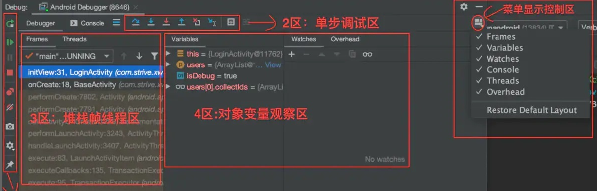
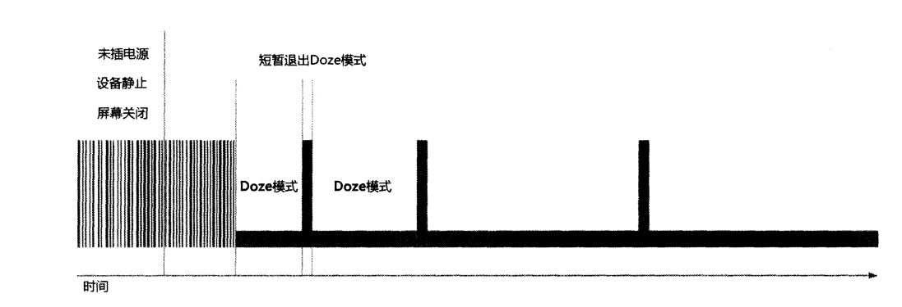

# 第 13 章 继续进阶——你还应该掌握的高级技巧

&emsp;&emsp;本书的内容虽然已经接近尾声 了，但是千万不要因此放松，现在正是你继续进阶的时机。相信基础性的Android只是已经没有太多能够难倒你了，那么本章中我们就来学习一些你还应该掌握的高级技巧吧。  

## 13.1 全局获取Context的技巧  
&emsp;&emsp;回想这么久以来我们所学的内容，你会发现有很多地方都需要用到Context，弹出的Toast的时候需要，启动活动的时候需要，发送广播的时候需要，操作数据库的时候需要，使用通知通知的时候需要等等。  
&emsp;&emsp;或许目前你还没有为得不到Context而发愁过，因为我们很多的操作都是在活动中进行的，而活动本身就是一个Context对象。但是，当应用程序的架构逐渐开始复杂起来的时候，很多的逻辑代码都将脱离Activity类，但此时你又恰恰需要使用Context，也许这个时候你就会感到有些伤脑筋了。  
&emsp;&emsp;举个例子来说吧，在第9章的最佳实践环节中，我们编写了一个HttpUtil类，在这里将一些通用的网络操作进行封装起来，代码如下所示：

```java

package com.zj970.advanced.utils;

import com.zj970.advanced.IHttpCallbackListener;

import java.io.BufferedReader;
import java.io.InputStream;
import java.io.InputStreamReader;
import java.net.HttpURLConnection;
import java.net.URL;

/**
 * <p>
 * 封装网络操作
 * </p>
 *
 * @author: zj970
 * @date: 2022/12/14
 */
public class HttpUtil {

    public static void sendHttpRequest(final String address, final IHttpCallbackListener callbackListener){
        new Thread(new Runnable() {
            @Override
            public void run() {
                HttpURLConnection connection = null;
                try {
                    URL url = new URL(address);
                    connection = (HttpURLConnection) url.openConnection();
                    connection.setRequestMethod("GET");
                    connection.setConnectTimeout(8000);
                    connection.setReadTimeout(8000);
                    connection.setDoInput(true);
                    connection.setDoOutput(true);
                    InputStream in = connection.getInputStream();
                    BufferedReader reader = new BufferedReader(new InputStreamReader(in));
                    StringBuilder response = new StringBuilder();
                    String line;
                    while ((line = reader.readLine()) != null){
                        response.append(line);
                    }
                    if (callbackListener != null){
                        callbackListener.onFinish(response.toString());//回调onFinish()方法
                    }
                } catch (Exception e) {
                    if (callbackListener != null){
                        callbackListener.onError(e);//回调onError()方法
                    }
                } finally {
                    if (connection != null){
                        connection.disconnect();
                    }
                }
            }
        }).start();
    }
}

```

&emsp;&emsp;这里使用sendHttpRequest()方法来发送HTTP请求显然是没有问题的，并且我们还可以在回调方法中处理服务器返回的数据。但现在我们想对sendHttpRest()方法进行一些优化，当检测到网络不存在的时候就给用户一个Toast提示，并且不再执行后面的代码。看似一个挺简单的功能，可是却存在一个让人头疼的问题，弹出Toast提示需要一个Context参数，而我们在HttpUtil类中显然是获取不到Context对象的，这该怎么办呢？  
&emsp;&emsp;其实要想解决这个问题也很简单，大不了在sendHttpRequest()方法中添加一个Context参数就行了嘛，于是就将HttpUtil中的代码进行如下修改：  

```java
package com.zj970.advanced.utils;

import android.content.Context;
import android.widget.Toast;
import com.zj970.advanced.IHttpCallbackListener;

import java.io.BufferedReader;
import java.io.InputStream;
import java.io.InputStreamReader;
import java.net.HttpURLConnection;
import java.net.URL;

/**
 * <p>
 * 封装网络操作
 * </p>
 *
 * @author: zj970
 * @date: 2022/12/14
 */
public class HttpUtil {

    public static void sendHttpRequest(final Context context, final String address, final IHttpCallbackListener callbackListener){
        if(isNetworkAvailable(context)){
            Toast.makeText(context, "network is unavailable", Toast.LENGTH_SHORT).show();
        }

        new Thread(new Runnable() {
            @Override
            public void run() {
                HttpURLConnection connection = null;
                try {
                    URL url = new URL(address);
                    connection = (HttpURLConnection) url.openConnection();
                    connection.setRequestMethod("GET");
                    connection.setConnectTimeout(8000);
                    connection.setReadTimeout(8000);
                    connection.setDoInput(true);
                    connection.setDoOutput(true);
                    InputStream in = connection.getInputStream();
                    BufferedReader reader = new BufferedReader(new InputStreamReader(in));
                    StringBuilder response = new StringBuilder();
                    String line;
                    while ((line = reader.readLine()) != null){
                        response.append(line);
                    }
                    if (callbackListener != null){
                        callbackListener.onFinish(response.toString());//回调onFinish()方法
                    }
                } catch (Exception e) {
                    if (callbackListener != null){
                        callbackListener.onError(e);//回调onError()方法
                    }
                } finally {
                    if (connection != null){
                        connection.disconnect();
                    }
                }
            }
        }).start();
    }

    private static boolean isNetworkAvailable(final Context context){
        return NetUtil.getNetWorkStart(context) == NetUtil.NETWORK_MOBILE ? true : false;
    }
}

```

&emsp;&emsp;可以看到，这里在方法中添加了一个Context参数，并且有一个isNetworkAvailable()方法用于判断当前网络是否可用，如果网络不可用的话就弹出Toast提示，并将方法return掉。  
&emsp;&emsp;虽说这也确实是一种解决方案，但是却有点推卸责任的嫌疑，因为我们将获取Context的任务转移给了sendHttpRequest()方法的调用方，至于调用方能不能的得到Context对象，那就不是我么需要考虑的问题了。由此可以看出，在某些情况下，获取Context并非不是那么容易的一件事，有时候还是很伤脑静的。不过别担心，下面我们学习一种技巧，让你在项目的任何地方都能轻松获取到Context。  
&emsp;&emsp;Android 提供了一个Application类，每当应用程序启动的时候，系统就会自动将这个类进行初始化。而我们可以定制一个自己的Application类，以便于管理程序内一些全局的状态信息，比如说全局Context。  
&emsp;&emsp;定义一个自己的Application其实并不复杂，首先我们需要创建一个MyApplication类继承自Application，代码如下所示：  

```java
package com.zj970.advanced;

import android.app.Application;
import android.content.Context;

/**
 * <p>
 *
 * </p>
 *
 * @author: zj970
 * @date: 2022/12/15
 */
public class MyApplication extends Application {
    private static Context context;
    @Override
    public void onCreate() {
        context = getApplicationContext();
    }
    public static Context getContext() {
        return context;
    }

}

```

&emsp;&emsp;可以看到，MyApplication中的代码非常简单。这里我们重写了父类的onCreate()方法，并通过调用getApplicationContext()方法得到了一个应用程序级别的Context，然后又提供了一个静态的getContext()方法，在这里将刚才获取到的Context进行返回。  
&emsp;&emsp;接下里我们需要告知系统，当程序启动的时候应该初始化MyApplication类，而不是默认的Application类。这一步其实也很简单，在AndroidManifest.xml的<application>标签下进行指定就可以了，代码如下所示：  

```xml
<?xml version="1.0" encoding="utf-8"?>
<manifest xmlns:android="http://schemas.android.com/apk/res/android"
          package="com.zj970.advanced">

    <uses-permission android:name="android.permission.ACCESS_NETWORK_STATE"/>
    <application
            android:name="com.zj970.advanced.MyApplication"
            android:allowBackup="true"
            android:label="@string/app_name"
            android:icon="@mipmap/ic_launcher"
            android:roundIcon="@mipmap/ic_launcher_round"
            android:supportsRtl="true"
            android:theme="@style/Theme.AdvancedSkills"/>

</manifest>
```
&emsp;&emsp;注意这里在指定MyApplication的时候最好加上完整的包名，不然系统将无法找到这个类。这样我们就已经实现了一种全局获取Context的机制，之后不管你在想在项目的任何地方使用Context，只需要调用一下MyApplication.getContext()就可以了。接下来我们再对sendHttpRequest()方法进行优化，代码如下所示： 

```java
package com.zj970.advanced.utils;

import android.app.Application;
import android.content.Context;
import android.widget.Toast;
import com.zj970.advanced.IHttpCallbackListener;
import com.zj970.advanced.MyApplication;

import java.io.BufferedReader;
import java.io.InputStream;
import java.io.InputStreamReader;
import java.net.HttpURLConnection;
import java.net.URL;

/**
 * <p>
 * 封装网络操作
 * </p>
 *
 * @author: zj970
 * @date: 2022/12/14
 */
public class HttpUtil {

    public static void sendHttpRequest(final Context context, final String address, final IHttpCallbackListener callbackListener){
        if(isNetworkAvailable(context)){
            Toast.makeText(context, "network is unavailable", Toast.LENGTH_SHORT).show();
        }

        new Thread(new Runnable() {
            @Override
            public void run() {
                HttpURLConnection connection = null;
                try {
                    URL url = new URL(address);
                    connection = (HttpURLConnection) url.openConnection();
                    connection.setRequestMethod("GET");
                    connection.setConnectTimeout(8000);
                    connection.setReadTimeout(8000);
                    connection.setDoInput(true);
                    connection.setDoOutput(true);
                    InputStream in = connection.getInputStream();
                    BufferedReader reader = new BufferedReader(new InputStreamReader(in));
                    StringBuilder response = new StringBuilder();
                    String line;
                    while ((line = reader.readLine()) != null){
                        response.append(line);
                    }
                    if (callbackListener != null){
                        callbackListener.onFinish(response.toString());//回调onFinish()方法
                    }
                } catch (Exception e) {
                    if (callbackListener != null){
                        callbackListener.onError(e);//回调onError()方法
                    }
                } finally {
                    if (connection != null){
                        connection.disconnect();
                    }
                }
            }
        }).start();
    }

    private static boolean isNetworkAvailable(final Context context){
        return NetUtil.getNetWorkStart(context) == NetUtil.NETWORK_MOBILE ? true : false;
    }


    public static void sendHttpRequest(final String address, final IHttpCallbackListener callbackListener){
        if(isNetworkAvailable()){
            Toast.makeText(MyApplication.getContext(), "network is unavailable", Toast.LENGTH_SHORT).show();
        }

        new Thread(new Runnable() {
            @Override
            public void run() {
                HttpURLConnection connection = null;
                try {
                    URL url = new URL(address);
                    connection = (HttpURLConnection) url.openConnection();
                    connection.setRequestMethod("GET");
                    connection.setConnectTimeout(8000);
                    connection.setReadTimeout(8000);
                    connection.setDoInput(true);
                    connection.setDoOutput(true);
                    InputStream in = connection.getInputStream();
                    BufferedReader reader = new BufferedReader(new InputStreamReader(in));
                    StringBuilder response = new StringBuilder();
                    String line;
                    while ((line = reader.readLine()) != null){
                        response.append(line);
                    }
                    if (callbackListener != null){
                        callbackListener.onFinish(response.toString());//回调onFinish()方法
                    }
                } catch (Exception e) {
                    if (callbackListener != null){
                        callbackListener.onError(e);//回调onError()方法
                    }
                } finally {
                    if (connection != null){
                        connection.disconnect();
                    }
                }
            }
        }).start();
    }

    private static boolean isNetworkAvailable(){
        return NetUtil.getNetWorkStart(MyApplication.getContext()) == NetUtil.NETWORK_MOBILE ? true : false;
    }
}

```

&emsp;&emsp;可以看到，sendHttpRequest()方法不需要再通过传参的方式来得到Context对象，而是调用一下MyApplication.getContext()方法就可以了。有了这个技巧，你再也不用为得不到Context对象而发愁了。然后回顾一下6.5.2小节中学过的内容，当时为了让LitePal可以正常工作，要求必选在AndroidManifest.xml配置以下内容

```xml
<?xml version="1.0" encoding="utf-8"?>
<manifest xmlns:android="http://schemas.android.com/apk/res/android"
          package="com.zj970.litepaltest">

    <application
            android:name="org.litepal.LitePalApplication"
            android:allowBackup="true"
            android:icon="@mipmap/ic_launcher"
            android:label="@string/app_name"
            android:roundIcon="@mipmap/ic_launcher_round"
            android:supportsRtl="true"
            android:theme="@style/Theme.PersistenceTechnology">

        <activity android:name=".MainActivity">
            <intent-filter>
                <action android:name="android.intent.action.MAIN"/>

                <category android:name="android.intent.category.LAUNCHER"/>
            </intent-filter>
        </activity>
    </application>

</manifest>
```

&emsp;&emsp;其实道理也是一样的，因为经过这样的配置之后，LitePal就能在内部自动获取到Context了。不过这里你可能又会产生疑问了，如果我们已经配置过了自己的Application怎么办》这样岂不是和LitePalApplication冲突了？没错，任何一个项目都只能配置一个Application，对于这种情况，LitePal提供了很简单的解决方案，那就是在我们自己的Application中去调用LitePal的初始化方法就可以了，在onCreate()方法中加入 LitePalApplication.initialize(context)；皆就可以了。使用这种写法，就相当于我们把全局的Context对象通过参数传递给了LitePal，效果和在AndroidManifest.xml中配置LiteApplication是一模一样的。  


## 13.2 使用Intent传递对象

&emsp;&emsp;Intent的用法相信你已经比较熟悉了，我们可以借助它来启动活动、发送广播、启动服务等。在进行上述操作的时候，我们还可以在Intent中添加一些附加数据，以达到传值的效果，比如在FirstActivity中添加如下代码： 

```
Intent intent = new Intent(FirstActivity.this,SecondActivity.class);
intent.putExtra("string_data","hello");
intent.putExtra("int_data",100);
startActivity(intent);
```
&emsp;&emsp;这里调用了Intent的putExtra()方法来添加要传递的数据，之后在SecondActivity中就可以得到这些值了，代码如下所示：

```
getIntent().getStringExtra("string_data");
getIntent().getIntExtra("int_data",0);
```
&emsp;&emsp;但是不知道你有没有发现，putExtra()方法中所支持的数据类型是有限的，虽然常用的一些数据类型它都会支持，但是当你想去传递一些自定义对象的时候，就会无从下手。不用担心，下面将就学习一下使用Intent来传递对象的技巧。  

### 13.2.1 Serializable 方式

&emsp;&emsp;使用Intent来传递对象通常有两种方式：Serializable和Parcelable，本小节中我们先来学习一下第一种实现方式。
&emsp;&emsp;Serializable是序列化的意思，表示将一个对象转换成可存储或可传输的状态。序列化后的对象可以在网络上进行传输，也可以存储到本地。至于序列化的方法也很简单，只需要让一个类去实现Serializable这个接口就可以了。比如说有一个Person类，其中包含了name和age这两个字段，想要将它序列化就可以这样写：  

```java
package com.zj970.advanced.entity;

import java.io.Serializable;

/**
 * <p>
 *
 * </p>
 *
 * @author: zj970
 * @date: 2022/12/15
 */
public class Person implements Serializable {
    private int id;
    private String name;
    private int age;

    public Person() {
    }

    public Person(int id, String name, int age) {
        this.id = id;
        this.name = name;
        this.age = age;
    }

    public int getId() {
        return id;
    }

    public void setId(int id) {
        this.id = id;
    }

    public String getName() {
        return name;
    }

    public void setName(String name) {
        this.name = name;
    }

    public int getAge() {
        return age;
    }

    public void setAge(int age) {
        this.age = age;
    }
}

```

&emsp;&emsp;其中，get、set方法都是用于赋值和读取字段数据的，最重要的部分是在第一行。这里让Person类去实现了Serializable接口，这样所有的Person对象都是可序列化的了。接下来在FirstActivity中的写法非常简单：  
```
Person person = new Person(1,"李华",18);
Intent intent = new Intent(FirstActivity.this,Serializable.class);
intent.putExtra("person_data",person);
startActivity(intent);
```
&emsp;&emsp;可以看到，这里我们创建了一个Person的实例，然后就直接将它传入到putExtra()方法中了。由于Person类实现了Serializable接口，所以才可以这样写。接下来在SecondActivity中获取这个对象也很简单，写法如下： Person peron = (person)getIntent().getSerializableExtra("person_data");  
&emsp;&emsp;这里调用了getSerializableExtra()方法来获取通过参数传递过来的序列化对象，接着再将它向下转型成Person对象，这样我们就成功实现了使用Intent来传递对象的功能了。

### 13.2.2 Parcelable方式  
&emsp;&emsp;除了Serializable之外，使用Parcelable也可以实现相同的效果，不过不同于将对象进行序列化，Parcelable方式的实现原理是将一个完整的对象进行分解，而分解后的每一部分都是Intent所支持的数据类型，这样也就实现传递对象的功能了。下面看一下Parcelable的实现方式，新建Dog，如下：  

```java
package com.zj970.advanced.entity;

import android.os.Parcel;
import android.os.Parcelable;

/**
 * <p>
 *
 * </p>
 *
 * @author: zj970
 * @date: 2022/12/15
 */
public class Dog implements Parcelable {
    private String name;
    private int age;

    public Dog(String name, int age) {
        this.name = name;
        this.age = age;
    }

    protected Dog(Parcel in) {
        name = in.readString();
        age = in.readInt();
    }

    public static final Creator<Dog> CREATOR = new Creator<Dog>() {
        @Override
        public Dog createFromParcel(Parcel in) {
            return new Dog(in);
        }

        @Override
        public Dog[] newArray(int size) {
            return new Dog[size];
        }
    };

    public String getName() {
        return name;
    }

    public void setName(String name) {
        this.name = name;
    }

    public int getAge() {
        return age;
    }

    public void setAge(int age) {
        this.age = age;
    }

    @Override
    public int describeContents() {
        return 0;
    }

    @Override
    public void writeToParcel(Parcel dest, int flags) {
        dest.writeString(name);
        dest.writeInt(age);
    }
}

```

&emsp;&emsp;Parcelable的实现方式要稍微复杂一些。可以看到，首先我们让Dog类去实现了Parcelable接口，这样就必须重写describeContents()方法和writeToParcel()方法。其中describeContents()方法直接返回0就可以了，而writeToParcel()方法中我们需要调用Parcel的writeXxx()方法，将Dog类中的字段一一写出。注意，字符串类型数据就调用writeString()方法，整型数据就调用writeInt()方法，以此类推。  
&emsp;&emsp;除此之外，我们还必须在Dog类中提供一个名为CREATOR的常量，这里创建Parcelable.Creator接口的一个实现，并将泛型指定为Dog。接着需要重写createFromParcel()方法和newArray()方法，在createFromParcel()方法中我要去读取刚才写出的name和age字段，并创建一个Dog对象返回，其中name和age都是调用Parcel的readXxx()方法读取到的，注意这里的读取顺序要和刚才的写出顺序一定要完全相同。而newArray()方法中的实现就简单多了，只需要new出一个Dog数组，并使用方法中传入的size作为数组大小就可以了。  
&emsp;&emsp;接下来，在FirstActivity中我们仍然使用之前相同的代码来传递对象，只不过在SecondActivity中获取的时候需要进行改动，如下所示：

```
Dog dog = (Dog) getIntent().getParcelableExtra("dog_data");
```
&emsp;&emsp;注意，这里不再是调用getSerializableExtra()而是调用getParcelableExtra()方法，其他的地方都完全相同。这样我们就把是使用Intent来传递对象的两种实现方式都学习完了，对比一下，Serializable的方式比较简单，但是由于会把整个对象进行序列化，因此效率会比Parcelable方法低一些，所以在通常情况下还是更加推荐Parcelable的方式来实现Intent来传递对象的功能。  

## 13.3 定制自己的日志工具  
&emsp;&emsp;早在第1章的1.4节中我们就已经学习过了Android日志工具的用法，并且日志工具也确实贯穿了我们整本书的学习，基本上每一章都有用过。虽然Android中自带的日志工具非常强大，但也不能说是完全没有缺点，例如在打印日志的控制方面就做得不够好。  
&emsp;&emsp;打个比方，你正在编写一个比较庞大的项目，期间为了方便调试，在代码的很多地方都打印了大量的日志。最近项目已经基本完成了，但是却有一个非常让人头疼的问题，之前用于调试的哪些日志，在项目正式上线之后仍然会照常打印，这样不仅会降低程序的运行效率，还有可能将一些机密性的数据泄露出去。  
&emsp;&emsp;那该怎么办呢？难道要一行一行地把所有打印日志的代码都删掉？显然这不是什么好点子。不仅费时费力，而且以后你继续维护这个项目的时候可能还需要这些日志。因此，最理想的情况是能够自由地控制日志的打印，当程序处于开发阶段时就让日志打印出来，当程序上线之后就把日志屏蔽掉。  
&emsp;&emsp;看起来好像是挺高级的一个功能，其实并不复杂，我们只需要定制一个自己的日志工具就可以轻松完成了。比如新建一个LogUtil类，代码如下所示：  

```java
package com.zj970.advanced.utils;

import android.util.Log;

/**
 * <p>
 *
 * </p>
 *
 * @author: zj970
 * @date: 2022/12/16
 */
public class LogUtil {
    public static final int VERBOSE = 1;
    public static final int DEBUG = 2;
    public static final int INFO = 3;
    public static final int WARN = 4;
    public static final int ERROR = 5;
    public static final int NOTHING = 6;
    public static final int level = VERBOSE;

    public static void v(String tag, String msg) {
        if (level <= VERBOSE) {
            Log.v(tag, msg);
        }
    }

    public static void d(String tag, String msg) {
        if (level <= DEBUG) {
            Log.d(tag, msg);
        }
    }

    public static void i(String tag, String msg) {
        if (level <= INFO) {
            Log.i(tag, msg);
        }
    }

    public static void w(String tag, String msg) {
        if (level <= WARN) {
            Log.w(tag, msg);
        }
    }

    public static void e(String tag, String msg) {
        if (level <= ERROR) {
            Log.e(tag, msg);
        }
    }
}

```

&emsp;&emsp;可以看到，我们在LogUtil中先是定义了VERBOSE、DEBUG、INFO、WARN、ERROR、NOTHING这6个整型常量，并且它们对应的值都是递增的。然后又定义了一个静态变量level，可以将它的值指定为上面6个常量的任意一个。  
&emsp;&emsp;接下来我们提供了v()、d()、i()、w()、e()这5个自定义的日志方法，在其内部分别调用了Log.v()、Log.d()、Log.i()、Log.w()、Log.e()这5个方法来打印日志，只不过在这些自定义的方法中我们都加入了一个if判断，只有当level的值小于或等于对应日志级别的时候，才会将日志打印出来。  
&emsp;&emsp;这样就把一个自定义的日志创建好了，之后在项目我们可以像使用普通的日志工具一样使用LogUtil，比兔打印一行DEBUG级别的日志就可以这样写：LogUtil.d("TAG", "debug log");打印一行WARN级别的日志就可以这样写：LogUtil.w("TAG", "warn log");  
&emsp;&emsp;然后我们只需要修改level变量的值，就可以自由地控制日志的打印行为了。比如让level等于VERBOSE就可以把所有的日志都打印出来，让level等于WARN就可以只打印警告以上级别的日志，让level等于NOTHING就可以把所有屏蔽掉。使用了这种方法之后，刚才所说的那个问题就不复存在了，你只需要在开发阶段将level指定成VERBOSE，当项目正式上线的时候将level指定成NOTHING就可以了。  

## 13.4 调试Android程序  
&emsp;&emsp;当开发过程中遇到一些奇怪的bug，但又迟迟定位不出来原因的时候，最好的解决办法就是调试了。调试允许我们逐行地执行代码，并可以实时观察内容中的数据，从而能够比较轻易地查出问题的原因，那么本节中我们就来学习一下使用Android断点调试，断点调试很简单，就是在想断点的代码处进行断点，此处会有红点。然后点击Debug调试按钮（一个小虫子），然后运行机上会有一个断点调试提示框，这个框很快就会自动消失，不能点击提示框按钮。当程序运行到断点的代码处就会停下来。然后在开发工具上会弹出Debug的控制台，这里可有进行控制代码的步入、步出、强制步入、强制步出。在这个框里我们还可以看出变量的堆栈情况等。



&emsp;&emsp;这里会可以借鉴[不正经的创造者的文章](https://zhuanlan.zhihu.com/p/142128857)

## 13.5 创建定时任务

&emsp;&emsp;Android中的定时任务一般有两种方式，一种是使用Java API里提供的Timer类，一种是使用Android的Alarm机制。这两种方式在多数情况下都能实现类似的效果，但Timer有一个明显的短板，它并不太适合用于那些需要长期在后台运行的定时任务。我们都知道，为了能让电池更加耐用，每种手机都会有自己的休眠策略，Android手机就会在长时间不操作的情况下自动让CPU进入睡眠状态，这就有可能导致Timer中的定时任务无法正常运行。而Alarm则居右唤醒CPU的功能，它可以保证在大多数情况下需要执行定时任务的时候CPU都能正常工作，需要注意，这里唤醒CPU和唤醒屏幕完全不是一个概念，千万不要产生混淆。  

### 13.5.1 Alarm机制

&emsp;&emsp;那么首先我们来看一下Alarm机制的用法吧，其实并不复杂，主要就是借助了AlarmManager类实现的。这个类和NotificationManager有点类似，都是通过调用Context的getSystemService()方法来获取实例的，只是这里需要传入的参数是Context.ALARM_SERVICE。因此，获取一个AlarManager的实例就可以写成：  
> AlarmManager manager = (AlarmManager) getSystemService(Context.ALARM_SERVICE);

&emsp;&emsp;接下来调用AlarmManager的set()方法就可以设置一个定时任务了，比如说想要设定一个任务在10秒钟后执行，就可以写成：  
> long triggerAtTime = SystemClock.elapsedRealtime() + 10 * 1000;
> manager.set(AlarmManager.ELAPSED_REALTIME_WAKEUP,triggerAtTime,pendingIntent);

&emsp;&emsp;上面的两行代码你不一定能看得明白，因为set()方法中需要传入的3个参数稍微有点复杂，下面我们就来仔细地分析一下。第一个参数是一个整型参数，用于指定AlarmManager的工具类型，有4种值可选，分别是ELAPSED_REALTIME_WAKEUP、ELAPSED_REALTIME、RTC和RTC_WAKEUP。其中ELAPSED_REALTIME表示让定时任务的触发时间从系统开机开始算起，但不会唤醒CPU。ELAPSED_REALTIME_WAKEUP同样表示让定时任务的触发时间从系统开机开始算起，但会唤醒CPU。RTC表示让定时任务的触发时间从1970年1月1日0点开始算起，但不会唤醒CPU。RTC同样表示让定时任务的触发时间从1920年1月1日0点开始算起，但不会唤醒CPU。RTC_WAKEUP同样表示让定时任务的触发时间从1970年1月1日0点开始算起，但会唤醒CPU。使用SystemClock.elapsedRealtime()方法可以获取到系统开机至今所经历时间的毫秒数，使用System.currentTimeMillis()方法可以获取到1970年1月1日0点至今所经历时间的毫秒数。  
&emsp;&emsp;然后看一下第二个参数，这个参数就好理解多了，就是定时任务触发的时间，以毫秒为单位。如果第一个参数使用的是ELAPSED_REALTIME_WAKEUP或ELAPSED_REALTIME，则这里传入开机至今的时间再加上延迟执行的时间。如果第一个参数使用的是RTC或RTC_WAKEUP，则这里传入1970年1月1日0点至今的时间再加上延迟执行的时间。  
&emsp;&emsp;第三个参数是一个PendingIntent，对于它你应该已经不会陌生了吧。这里我们一般会调用getService()方法或者geiBroadcast()方法来获取一个能够执行服务或广播的PendingIntent。这样当定时任务被触发的时候，服务的onStartCommand()方法或广播接收器的onReceiver()方法就可以得到执行。  
&emsp;&emsp;了解了set()方法的每个参数之后，你应该能想到，设定一个任务在10秒钟后执行也可以写成：  
> long triggerAtTime = System.currentTimeMillis() + 10 * 1000;
> manager.set(AlarmManager.RTC_WAKEUP,triggerAtTime,pendingIntent);

&emsp;&emsp;那么，如果我们要实现一个长事件在后台定时运行的服务该怎么做呢？其实很简单，首先新建一个普通的服务，比如把它起名叫LongRunningService，然后将触发定时任务的代码写到onStartCommand()方法中，如下所示：  

```java
package com.zj970.advanced.service;

import android.app.AlarmManager;
import android.app.PendingIntent;
import android.app.Service;
import android.content.Intent;
import android.os.IBinder;
import android.os.SystemClock;
import androidx.annotation.Nullable;

/**
 * <p>
 *
 * </p>
 *
 * @author: zj970
 * @date: 2022/12/16
 */
public class LongRunningService extends Service {
    @Nullable
    @Override
    public IBinder onBind(Intent intent) {
        return null;
    }

    @Override
    public int onStartCommand(Intent intent, int flags, int startId) {
        new Thread(new Runnable() {
            @Override
            public void run() {
                //在这里执行具体的逻辑操作
            }
        }).start();

        AlarmManager manager = (AlarmManager) getSystemService(ALARM_SERVICE);
        int anHour = 60 * 60 * 1000;//这是一小时的毫秒数
        long triggerAtTime = SystemClock.elapsedRealtime() + anHour ;
        Intent i = new Intent(this, LongRunningService.class);
        PendingIntent pi = PendingIntent.getActivity(this,0,i,0);
        manager.set(AlarmManager.ELAPSED_REALTIME_WAKEUP,triggerAtTime,pi);
        return super.onStartCommand(intent, flags, startId);
    }
}
```
&emsp;&emsp;可以看到，我们先是在onStartCommand()方法中开启了一个子线程，这样就可以在这里执行具体的逻辑操作了。之所以在子线程里执行逻辑操作，是因为逻辑操作也是需要耗时的，如果放在主线程里执行可能会定时任务的准确性造成轻微的影响。  
&emsp;&emsp;创建线程之后的代码就是我们刚刚讲解的ALrm机制的用法了，显示获取到了AlarmManager的实例，然后定义任务的触发时间为一小时后，再使用PendingIntent指定处理定时任务的服务为LongRunningService，最后调用set()方法完成设定。  
&emsp;&emsp;这样我们就将一个长时间在后台定时运行的服务成功实现了。因为一旦启动了LongRunningService，就会在onStartCommand()方法里设定一个定时任务，这样一小时后将会再次启动LongRunningService，从而也就形成一个永久的循环，保证LongRunningService的onStartCommand()方法可以每隔一小时就执行一次。  
&emsp;&emsp;最后，只需要在你想要启动定时服务的时候调用如下代码即可：  
> Intent intent = new Intent(context,LongRunningService);
> context.startService(intent);

&emsp;&emsp;另外需要注意的是，从Android 4.4系统开始，Alarm任务的触发时间将会变得不准确，有可能会延迟一段时间任务才能得到执行。这并不是bug，而是系统在耗电性能方面进行优化。系统会自动检测目前有多少Alarm任务存在，然后将触发时间相近的几个任务放在一起执行，这就可以大幅度地减少CPU被唤醒的次数，从而有效延长电池的使用时间。  
&emsp;&emsp;当然，如果你要求Alarm 任务的执时间必须准确无误，Android仍然提供了解决方案，使用AlarmManager的setExact()方法来替代set()方法，就基本上可以保证任务能够准时执行了。  

### 15.4.2 Doze模式  
&emsp;&emsp;虽然Android的每个系统版本都在手机电量方面努力进行优化，不过一直没能解决后台服务泛滥、手机电量消耗过快的问题。于是在Android 6.0 系统中，谷歌加入了一个全新的Doze模式，从而就可以极大幅度地延长电池的使用寿命。本小节中我们就来了解一下这个模式，并且掌握一些编程时的注意事项。  
&emsp;&emsp;首先看一下到底什么是Doze模式。当用户的设备是Android 6.0 或以上系统时，如果该设备未插电源，处于静止状态(Android 7.0 中删除了这一条件)，且屏幕关闭了一段时间之后，就会进入到Doze模式。在Doze模式下，系统会对CPU、网络、Alarm等活动进行限制，从而延长了电池的使用寿命。  
&emsp;&emsp;当然，系统并不会一直处于Doze模式，而是会间歇性地退出Doze模式一小段时间，在这段时间中，应用就可以完成它们的同步操作、Alarm任务等等。下图完整描述了Doze模式的工作过程。



&emsp;&emsp;可以看到，随着设备进入Doze模式的时间越长，间歇性地退出Doze模式的时间间隔也会越长。因为如果设备长时间不适用的话，是没必要频繁退出Doze模式来执行同步等操作的，Android在这些细节上的把控使得电池寿命进一步得到延长。  
&emsp;&emsp;接下来我们具体看一看在Doze模式下有哪些功能会受到限制：  
- 网络访问被禁止
- 系统忽略唤醒CPU或者屏幕操作。
- 系统不再执行WIFI扫描
- 系统不再执行同步服务
- Alarm任务将会在下次退出Doze模式的时候执行。  

&emsp;&emsp;注意其中的最后一条，也就是说，在Doze模式下，我们的Alarm任务将会变得不准时。当然吗，这在大多数情况写都是合理的，因为只有当用户长时间不使用手机的时候才会进入Doze模式，通常这种情况下对Alarm任务的准时性要求并没有那么高。  
&emsp;&emsp;不过，如果你真的有非常特殊的需求，要求Alarm任务即使在Doze模式下也必须正常执行，Android还是提供了解决方案。调用AlarmManager的setAndAllowWhileIdle()或setExactAndAllowWhileIdle()方法就能让定时任务即使在Doze模式下也能正常执行了，这两个方法之间的区别和set()、setExact()方法之间的区别是一样的。

## 13.6 多敞口模式编程  
&emsp;&emsp;由于手机屏幕大小的限制，传统情况下一个手机只能同时打开一个应用程序，不论是Android、IOS还是Windows Phone都是如此。我们也早就对此习以为常，认为这是理所当然的事情。而Android 7.0 系统中却引入了一个非常有特色的功能——多敞口模式，它允许我们在同一个屏幕中同时打开两个应用程序。对于手机屏幕越来越大的今天，这个功能确实越发重要了，那么本节中我们就将针对这一主题进行学习。  
### 13.6.1 进入多窗口模式  
&emsp;&emsp;首先你需要知道，我们不用编写任何额外的代码来让应用程序支持多窗口模式。但是这并不意味着我们就不需要对多窗口模式进行学习，因为系统化地了解这些知识点才能编写出多窗口模式下兼容性更好的程序。  
&emsp;&emsp;在多窗口模式下，整个应用的界面会缩小很多，那么编写程序时就应该多考虑使用match_parent属性、RecyclerView、ListView、ScrollView等控件，来让应用的界面能够更好地适配各种不同尺寸的屏幕，尽量不要出现屏幕尺寸变化过大时界面就无法正常显示的情况。  

### 13.6.2 多窗口模式下的生命周期  
c接下来我们学习一下多窗口模式下的生命周期。其实多窗口模式并不会改变活动原有的生命周期，只是会将用户最近交互过的那个活动设置成运行状态，而将多窗口模式下另外一个可见的活动设置为暂停状态。如果这时用户又去和暂停的活动进行交互，那么该活动就变成运行状态，之前处于运行状态的活动变成暂停状态。新建一个MaterialTest项目，修改MainActivity中的代码，如下所示：

```java
package com.zj970.materialtest;

import android.util.Log;
import androidx.appcompat.app.AppCompatActivity;
import android.os.Bundle;

public class MainActivity extends AppCompatActivity {
    private static final String TAG = "MainActivity";
    @Override
    protected void onCreate(Bundle savedInstanceState) {
        super.onCreate(savedInstanceState);
        setContentView(R.layout.activity_main);
        Log.d(TAG, "onCreate: ");
    }

    @Override
    protected void onStart() {
        super.onStart();
        Log.d(TAG, "onStart: ");
    }

    @Override
    protected void onResume() {
        super.onResume();
        Log.d(TAG, "onResume: ");
    }

    @Override
    protected void onPause() {
        super.onPause();
        Log.d(TAG, "onPause: ");
    }

    @Override
    protected void onStop() {
        super.onStop();
        Log.d(TAG, "onStop: ");
    }

    @Override
    protected void onDestroy() {
        super.onDestroy();
        Log.d(TAG, "onDestroy: ");
    }

    @Override
    protected void onRestart() {
        super.onRestart();
        Log.d(TAG, "onRestart: ");
    }
    
}


```
&emsp;&emsp;这里我们在Activity的7个生命周期回调方法分别打印了一句日志。然后在advancedSkills中修改MainActivity的代码，如下所示：  

```java
package com.zj970.advanced;

import android.util.Log;
import androidx.appcompat.app.AppCompatActivity;
import android.os.Bundle;

public class MainActivity extends AppCompatActivity {
    private static final String TAG = "LBS";
    @Override
    protected void onCreate(Bundle savedInstanceState) {
        super.onCreate(savedInstanceState);
        setContentView(R.layout.activity_main);
        Log.d(TAG, "onCreate: ");
    }

    @Override
    protected void onStart() {
        super.onStart();
        Log.d(TAG, "onStart: ");
    }

    @Override
    protected void onResume() {
        super.onResume();
        Log.d(TAG, "onResume: ");
    }

    @Override
    protected void onPause() {
        super.onPause();
        Log.d(TAG, "onPause: ");
    }

    @Override
    protected void onStop() {
        super.onStop();
        Log.d(TAG, "onStop: ");
    }

    @Override
    protected void onDestroy() {
        super.onDestroy();
        Log.d(TAG, "onDestroy: ");
    }

    @Override
    protected void onRestart() {
        super.onRestart();
        Log.d(TAG, "onRestart: ");
    }
}
```

&emsp;&emsp;这里同样也是在Activity的7个生命周期回调方法中分别打印了一句日志。只是在这两处日志的TAG是不一样的，方便面我们进行区分。现在将两个程序都安装运行在模式器上，然后启动MaterialTest程序。此时onCreate()、onStart()和onResume()方法会依次得到执行，然后长按Overview按钮，进入多窗口模式，此时MaterialTest中的MainActivity经历了一个重新创建的过程。其实这个是正常现象，因为进入多窗口模式后活动的大小发生了比较大的变化，此时默认是重新创建活动的。除此之外，像横竖屏也是会重新创建活动的。进入多窗口模式后，MaterialTest变成暂停状态。接着在Overview按钮选中advanced程序，然后此程序的onCreate()、onStart()和onResume()方法依次得到执行，说明现在advanced程序变成了运行状态。接下来我们随意操作一下MaterialTest程序，然后观察Logcat中的打印日志，现在advanced程序的onPause()方法得到了执行，而MaterialTest的onResume()方法得到了执行，说明advanced变成了暂停状态，MaterialTest则变成运行状态.  
&emsp;&emsp;了解了多窗口模式下活动的生命周期规则，那么我们在编写程序的时候，就可以将一些关键性的点考虑进去了。比如说，在多窗口模式下，用户仍然可以处于暂停状态的应用，那么像视频播放器之类的应用在此时就可以继续播放视频才对。因此，我们最好不要在活动的onPause()方法中去处理视频播放器的暂停逻辑，而是应该在onStop()方法中去处理，并且在onStart()方法去恢复视频的播放。  
&emsp;&emsp;另外，针对进入多窗口模式时活动会被重新创建，如果你想要改变这一默认行为，可以在AndroidManifest.xml中对活动进行如下配置：  
```xml
<activity 
    android:name=".MainActivity"
    android:label="Fruits"
    android:configChanges="orientation|keyboardHidden|screenSize|screenLayout">
    
</activity>
```
&emsp;&emsp;加入了这行配置，不管是进入多窗口模式，还是横竖屏切换，活动都不会被重新创建，而是会将屏幕发生辩护的事件通知到Activity的onConfigurationChanged()方法当中。因此，如果你想在屏幕发生变化的时候进行相应的逻辑处理，那么在活动中重写onConfigurationChanged()方法即可。

### 13.6.3 禁用多窗口模式

&emsp;&emsp;多窗口模式虽然功能非常强大，但是未必就适用所有的程序。比如说，手机游戏就非常不适合在多窗口模式下运行，很难想象我们如何一边玩着游戏，一边又操作着其他应用。因此，Android还是给我们提供了禁用多窗口模式的选项，如果你非常不希望自己的应用能够在多窗口模式下运行，那么就可以将这个功能关闭掉。  
&emsp;&emsp;禁用多窗口模式的方法非常简单，只需要在AndroidManifest.xml中的<application>或<activity>标签中加入如下属性即可：  
> android:resizableActivity=["true"|"false"]

&emsp;&emsp;其中，true表示支持多窗口模式，false表示应用不支持多窗口模式，如果不配置这个属性，那么默认值为true。当我们设置false后应用是无法进入到多窗口模式，而且屏幕下方还会弹出一个Toast提示来告知用户，当前应用不支持多窗口模式。  
&emsp;&emsp;虽说android:resizableActivity这个属性的用法很简单，而且它还存在着一个问题，就是这个属性只有当项目的targetSdkVersion指定成24或者跟高的时候才会有用，否则这个属性就是无敌的，那么比如时候我们将项目的targetSdkVersion指定成23，这个时候尝试进入多窗口模式，但是界面上弹出了一个提示，告知我们此应用在多窗口模式下可能无法正常工作，但还是进入了多窗口模式。那这样我们就非常头疼了，因为有很多的老项目，它们的targetSdkVersion都没有指定到24，岂不是这些老项目都无法禁用多窗口模式了？  
&emsp;&emsp;针对这个情况，还有一种解决方案。Android规定，如果项目指定的targetSdkVersion低于24，并且活动是不允许横竖切换，难么该应用也将多支持多窗口模式。  
&emsp;&emsp;默认情况下，我们的应用都是可以随着手机的旋转手机的旋转自由地横竖屏，那么就需要在AndroidManifest.xml的<activity>标签中加入如下配置：  
> android:screenOrientation=["portrait"|"landscape"]

&emsp;&emsp;其中，portrait表示活动中支持竖屏，landscape表示活动只支持横屏。当然android:screenOrientation属性中还有很多其他可选值，不过最常用的就是portrait和landscape。

