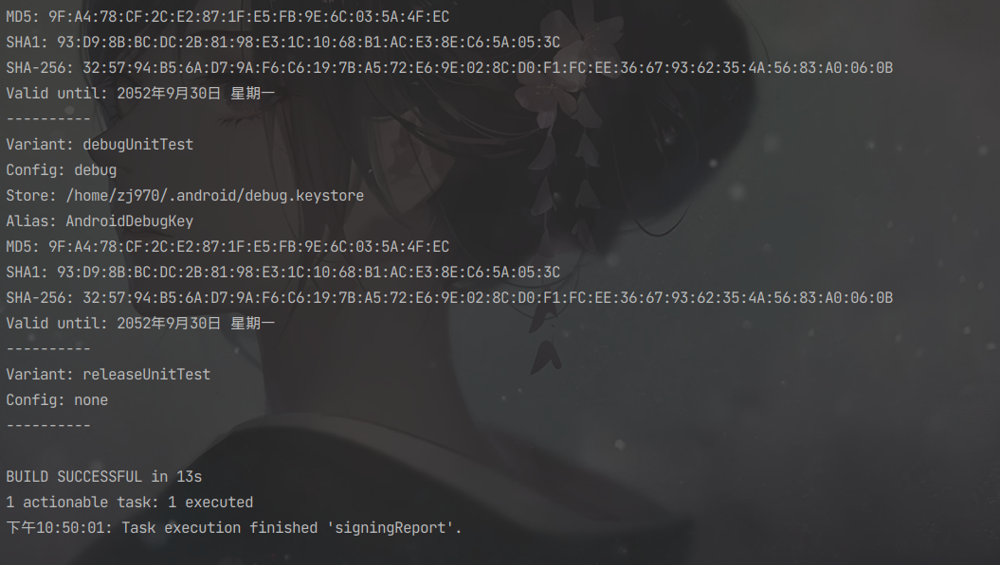
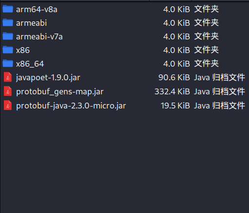
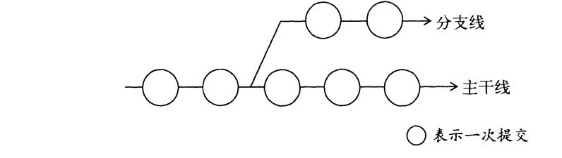

# 第11章 Android 特色开发——基于位置的服务

&emsp;&emsp;现在你已经学会了非常多的Android 技能，并且通过这些技能你完全可以编写出相当不错的应用程序了。不过本章中，我们将要学习一些全新的Android技术，这些技术有别于传统的传统的PC或Web领域的应用技术，是只有在移动设备上才能实现的。  
&emsp;&emsp;说到只有在移动设备上才能实现的技术，很容易就让人联想到基于位置的服务(Location Base Service)。由于移动设备相比于电脑可以随身携带，我们通过地理定位的技术就可以随时得到自己所在的位置。从而围绕这一点开发出很多有意思的应用。本章中我们就将针对这一点进行讨论，学习一下基于位置的服务究竟是如何实现的。  

### 11.1 基于位置的服务简介

&emsp;&emsp;基于位置的服务简称LBS，随着移动互联网的兴起，这个技术在最近的几年里十分火爆。其实它本身并不是什么时髦的技术，主要的工作原理就是利用无线电通讯或GPS等定位方式来确定出移动设备所在的位置，而这种定位技术早在很多年前就已经出现了。  
&emsp;&emsp;那为什么LBS结束直到最近几年才开始流行呢？这主要是因为，在过去移动设备的功能极其有限，即使定位到了设备所在的位置，也就仅仅只是定位到了而已，我们并不能在位置的基础上进行一些其他的操作。而现在就太大不同了，有了Android系统作为载体，我们可以利用定位出的位置进行絮叨丰富多彩的操作。比如说天气预报程序可以根据用户所在的位置自动选选择城市，发微博的时候我们可以向朋友们晒一下自己在哪里，不认识路的时候随时打开滴入就可以查询路线等等。  
&emsp;&emsp;介绍了这么多，首先要清楚，基于位置的服务所未然的核心就是要先确定用户所在的位置。通常有两种技术方式可以实现：一种是通过GPS定位，一种是通过网络定位。GPS定位的工作原理是基于手机内置的GPS硬件直接和卫星交互来获取当前的经纬度信息，这种定位方式精确度非常高，但缺点是只能在室外使用，室内基本无法接收到卫星的信号。网络定位的工作原理是根据手机当前网络附近的三个基站进行测速，以此计算出手机和每个基站之间的距离，再通过三角定位出一个大概位置，这定位方式精确度一般，但优点是在室内室外都可以使用。  
&emsp;&emsp;Android对这两种定位方式都提供了相应的API支持，但是由于一些特殊原因，Google的网络服务在中国不可访问，从而导致网络定位方式的API失效。而GPS定位虽然不需要网络，但是必须在室外才可以使用，因此你在室内开发的时候很有可能会遇到不管使用哪种定位方式都无法成功定位的情况。  
&emsp;&emsp;基于以上原因，不在本书讲解Android原生定位API的用法，而是使用国内第三方公司的SDK。目前国内在这一领域做得比较好的一个是百度，一个是搞得，本章我们就来学习一下百度在LBS方面提供的丰富多彩的功能。  

### 11.2 申请 API Key

&emsp;&emsp;要向在自己的应用程序里使用百度的LBS功能，首先必须申请一个API Key。你得拥有一个百度账号才能进行申请，有了百度账号之后，我们就可以申请成为一名百度开发者，登录你的百度账号，并打开http://developer.baidu.com/user/reg这个网站，在这里填写一些注册信息。


&emsp;&emsp;填写认证完成后，接着访问http://lbsyum.baidu.com/apiconsole/key这个地址


&emsp;&emsp;然后创建应用申请API Key，应用名称随便填，应用类型选择Android SDK ，启用服务保持默认即可。


&emsp;&emsp;那么，这个发布版SHA1和开发版SHA1又是什么呢？这是我们申请API Key所必须填写的一个字段，它指的是打包程序时所用的签名文件的SHA1指纹，可以通过Android Studio查看到。代开Android Studio中的任意一个项目，点击右侧工具栏中的Gradle->项目名->:app->Tasks->Android


&emsp;&emsp;这里展示了一个Android Studio 项目中所有内置的Gradle Tasks，其中signingReport这个Task就可以用来查看签名文件信息。双击signingReport



&emsp;&emsp;其中SHA1就是我们所需要的SHA1指纹了。另外需要注意。目前我们使用的是debug.keystore文件所生成的指纹，这是Android自动生成的一个用于测试的签名文件。而当你的应用发布时还需要创建一个正式的签名文件，如果要得到它的指纹，可以在cmd中输入如下命令:
&emsp;&emsp;  keytool -list -v -keystore <签名文件路径>  
&emsp;&emsp;然后输入正确的密码就可以了。创建签名文件的方法在15章中学习。那么也就是说，现在得到的这个SHA1指纹其实是一个开发版的SHA1指纹，不过因为暂时我们还没有一个发布版的SHA1指纹，因此这连个值都填成一样的就可以了。最后还剩下一个包名选项，虽然目前我们的应用程序不存在，但是可以预定下来。填写完全后就可以额开始后续的LBS开发工作了。  


&emsp;&emsp;ak 就是我们访问的秘钥

## 11.3 使用百度定位  
&emsp;&emsp;现在正是乘热打铁的好时机，新建一个LBSTest项目，包名应该命名为之前所申请的包名一致。本章中所写的代码建议你都在手机上运行，虽然模拟器中也提供了模拟地理位置的功能，但在手机上可以得到真实的位置数据。  

### 11.3.1 准备LBS SDK  
&emsp;&emsp;在开始编码之前，我们还需要将百度LBS开发平台的SDK准备好，下载地址是：http://lbsyun.baidu.com/sdk/download。本章中我们会用到基础地图和定位功能这两个SDK，将其勾选上然后下载  
  

&emsp;&emsp;下载完成后对该压缩包解压，其中会有一个libs目录，这里面的内容就是我们所需要的一切，如图所示：  


&emsp;&emsp;libs目录下的内容又分为两部分，BaiduLBS_Android.jar复制到项目中，接下来展开src/main目录，新建一个jniLibs目录，这里就是专门用来存放so文件的，然后把压缩包里的其他所有目录直接复制到这里。如图所示：  


&emsp;&emsp;在app/build.gradle文件都会默认配置以下声明：  

```groovy
dependencies{
    implementation fileTree(dir: 'libs',includes: ['*.jar'])
}
```
&emsp;&emsp;这表示会将libs目录下所有以.jar结尾的文件添加到当前项目的引用中。但是由于我们是直接将Jar包复制到libs目录下，并没有修改gradle文件，手动sync一下。  

### 11。3.2 确定自己位置的经纬度  

&emsp;&emsp;首先修改activity_main.xml中的代码，如下所示：  

```xml
<?xml version="1.0" encoding="utf-8"?>
<LinearLayout
        xmlns:android="http://schemas.android.com/apk/res/android"
        xmlns:tools="http://schemas.android.com/tools"
        android:orientation="vertical"
        android:layout_width="match_parent"
        android:layout_height="match_parent"
        tools:context=".MainActivity">
    <TextView
            android:id="@+id/position_text_view"
            android:layout_width="wrap_content"
            android:layout_height="wrap_content"/>

</LinearLayout>
```

&emsp;&emsp;布局文件的内容非常简单，只有一个TextView控件，用于稍后显示当前的经纬度信息。然后修改AndroidManifest.xml文件中的代码，如下所示：  

```xml
<?xml version="1.0" encoding="utf-8"?>
<manifest xmlns:android="http://schemas.android.com/apk/res/android"
          xmlns:tools="http://schemas.android.com/tools" package="com.zj970.lbstest">
    <uses-permission android:name="android.permission.ACCESS_COARSE_LOCATION"/>
    <uses-permission android:name="android.permission.ACCESS_FINE_LOCATION"/>
    <uses-permission android:name="android.permission.ACCESS_WIFI_STATE"/>
    <uses-permission android:name="android.permission.ACCESS_NETWORK_STATE"/>
    <uses-permission android:name="android.permission.CHANGE_WIFI_STATE"/>
    <uses-permission android:name="android.permission.READ_PHONE_STATE"/>
    <uses-permission android:name="android.permission.WRITE_EXTERNAL_STORAGE"/>
    <uses-permission android:name="android.permission.INTERNET"/>
    <uses-permission android:name="android.permission.MOUNT_UNMOUNT_FILESYSTEMS" tools:ignore="ProtectedPermissions"/>
    <uses-permission android:name="android.permission.WAKE_LOCK"/>
    <application
            android:allowBackup="true"
            android:icon="@mipmap/ic_launcher"
            android:label="@string/app_name"
            android:roundIcon="@mipmap/ic_launcher_round"
            android:supportsRtl="true"
            android:theme="@style/Theme.AndroidLocation">
        <meta-data
            android:name="com.baidu.lbsapi.API_KEY"
            android:value="8FVkGlrR50ztPFPw4ST6vTm2lttMCQOh"
        />
        <activity android:name=".MainActivity">
            <intent-filter>
                <action android:name="android.intent.action.MAIN"/>

                <category android:name="android.intent.category.LAUNCHER"/>
            </intent-filter>
        </activity>
        <service
                android:name="com.baidu.location.f"
                android:enabled="true"
                android:process=":remote">
        </service>
    </application>
</manifest>
```

&emsp;&emsp;AndroidManifest.xml文件改动比较多，我们仔细阅读一下，可以看到，这里首先添加了很多行权限声明。每一个权限都是百度LBS SDK 内部要用到的。然后在<application>标签的内部添加了一个<meta-data>标签，这个标签的android:name部分是固定的，必须填写com.baidu.lbsapi.API_KEY。而android:value部分应该填入我们申请的API Key。最后，还需要再注册一个LBS SDK 中的服务，不用对这个服务的名字感到疑惑，因为在LBS SDK中的代码都是混淆过的。接下来修改ManiActivity中的代码。如下所示：  

```java
package com.zj970.lbstest;

import android.Manifest;
import android.content.pm.PackageManager;
import android.widget.TextView;
import android.widget.Toast;
import androidx.annotation.NonNull;
import androidx.appcompat.app.AppCompatActivity;
import android.os.Bundle;
import androidx.core.app.ActivityCompat;
import androidx.core.content.ContextCompat;
import com.baidu.location.BDLocation;
import com.baidu.location.BDLocationListener;
import com.baidu.location.LocationClient;

import java.util.ArrayList;
import java.util.List;

public class MainActivity extends AppCompatActivity {
    public LocationClient mLocationClient;
    private TextView positionText;

    @Override
    protected void onCreate(Bundle savedInstanceState) {
        super.onCreate(savedInstanceState);
        try {
            mLocationClient = new LocationClient(getApplicationContext());
        } catch (Exception e) {
            e.printStackTrace();
        }
        mLocationClient.registerLocationListener(new MyLocationListener());
        setContentView(R.layout.activity_main);
        positionText = findViewById(R.id.position_text_view);
        List<String> permissionList = new ArrayList<>();
        if (ContextCompat.checkSelfPermission(MainActivity.this, Manifest.permission.ACCESS_FINE_LOCATION) != PackageManager.PERMISSION_GRANTED){
            permissionList.add(Manifest.permission.ACCESS_FINE_LOCATION);
        }
        if (ContextCompat.checkSelfPermission(MainActivity.this, Manifest.permission.READ_PHONE_STATE) != PackageManager.PERMISSION_GRANTED){
            permissionList.add(Manifest.permission.READ_PHONE_STATE);
        }
        if (ContextCompat.checkSelfPermission(MainActivity.this, Manifest.permission.WRITE_EXTERNAL_STORAGE) != PackageManager.PERMISSION_GRANTED){
            permissionList.add(Manifest.permission.WRITE_EXTERNAL_STORAGE);
        }
        if (!permissionList.isEmpty()){
            String[] permissions = permissionList.toArray(new String[permissionList.size()]);
            ActivityCompat.requestPermissions(MainActivity.this,permissions,1);
        } else {
            requestLocation();
        }
    }
    private void requestLocation(){
        mLocationClient.start();
    }

    @Override
    public void onRequestPermissionsResult(int requestCode, @NonNull String[] permissions, @NonNull int[] grantResults) {
        switch (requestCode){
            case 1:
                if (grantResults.length > 0){
                    for (int result : grantResults){
                        if (result != PackageManager.PERMISSION_GRANTED){
                            Toast.makeText(this, "必须同意所有权限才能使用本程序", Toast.LENGTH_SHORT).show();
                            finish();
                            return;
                        }
                    }
                    requestLocation();
                }else {
                    Toast.makeText(this, "发生未知错误", Toast.LENGTH_SHORT).show();
                    finish();
                }
                break;
            default:
                break;
        }
    }

    public class MyLocationListener implements BDLocationListener{

        @Override
        public void onReceiveLocation(BDLocation bdLocation) {
            StringBuilder currentPosition = new StringBuilder();
            currentPosition.append("纬度：").append(bdLocation.getLatitude()).append("\n");
            currentPosition.append("经线：").append(bdLocation.getLongitude()).append("\n");
            currentPosition.append("定位方式：");
            if (bdLocation.getLocType() == BDLocation.TypeGpsLocation){
                currentPosition.append("GPS");
            } else if (bdLocation.getLocType() == BDLocation.TypeNetWorkLocation){
                currentPosition.append("网络");
            }
            positionText.setText(currentPosition);
        }
    }
}
```

&emsp;&emsp;可以看到，在onCreate()方法中，我们首先创建了一个LocationClient的实例，LocationClient的构建函数接收一个Context参数，这里调用getApplicationContext()方法来获取一个全局的Context参数并传入。然后调用LocationClient的registerLocationListener()方法来注册一个定位监听器，当获取到位置信息的时候，就会回调这个定位监听器。  
&emsp;&emsp;接下来看一下这里运行权限的用法，由于我们在AndroidManifest.xml中声明了很多权限，参考一下 7.2.1 小节中的危险权限表格可以发现，气质ACCESS_COARSE_LOCATION、ACCESS_FINE_LOCATION、READ_PHONE_STATE、WRITE_EXTERNAL_STORAGE这4个权限是需要进行运行时权限处理。不过由于ACCESS_COARSE_LOCATION和ACCESS_FINE_LOCATION都是属于同一个权限组，因此两者只要申请其一就可以了。那么怎样才能运行时一次性申请3个权限呢？这里我们石永红了一种新的用法，首先创建一个空的List集合，然后依次判断这3个权限有没有被授权，如果没有被授权就添加到List集合中，最后将List转换为数组，再调用ActivityCompat.requestPermissions()方法一次性申请。  
&emsp;&emsp;除此之外，onRequestPermissionsResult()方法中对权限申请结果的逻辑处理也和之前有所不同，这次我们通过一个循环将申请的每个权限进行了判断，如果有任何一个权限被拒绝，那么就直接调用finish()方法关闭当前程序，只有当所有权限都被用户同意了，才会调用requestLocation()方法开始地理位置定位。  
&emsp;&emsp;requestLocation()方法中的代码比较简单，只是调用了一下LocationClient的start()方法就能开始定位了。定位的结果会回调到我们签名注册的监听器当中，也就是MyLocationListener。观察一下MyLocationListener的onReceiveLocation()方法中，在这里我们通过BDLocation的getLatitude()方法获取当前位置的纬度，通过getLongitude()方法获取当前位置的精度，通过getLocType()方法获取当前位置的纬度，通过getLongitude()方法获取当前位置的经度，通过getLocType()方法的当前定位方式，最终将结果组装成一个字符串，显示到TextView上面。
&emsp;&emsp;现在我们可以运行来运行一下程序了，如图所示。毫无疑问，打开程序首先就会弹出运行时权限的申请对话框，注意看对话框的底部，提示我们一共有3项权限申请，全部点击允许，然后立刻开始定位了。  


&emsp;&emsp;可以看到。设备当前的经纬度信息已经成功定位了。另外本程序需要设置同意隐私才能使用。不过，在默认情况下，调用LocationClient的start()方法只会定位一次，如果我们正在快速移动中，怎么才能实时更新当前的位置呢？为此，百度LBS SDK提供了一些列的设置方法，来允许我们更改默认的行为，修改MainActivity中代码，如下所示:  

```java
package com.zj970.lbstest;

import android.Manifest;
import android.content.pm.PackageManager;
import android.util.Log;
import android.widget.TextView;
import android.widget.Toast;
import androidx.annotation.NonNull;
import androidx.appcompat.app.AppCompatActivity;
import android.os.Bundle;
import androidx.core.app.ActivityCompat;
import androidx.core.content.ContextCompat;
import com.baidu.location.BDLocation;
import com.baidu.location.BDLocationListener;
import com.baidu.location.LocationClient;
import com.baidu.location.LocationClientOption;

import java.util.ArrayList;
import java.util.List;

public class MainActivity extends AppCompatActivity {
    public LocationClient mLocationClient;
    private TextView positionText;

    @Override
    protected void onCreate(Bundle savedInstanceState) {
        super.onCreate(savedInstanceState);
        LocationClient.setAgreePrivacy(true);
        try {
            mLocationClient = new LocationClient(getApplicationContext());
        } catch (Exception e) {
            e.printStackTrace();
        }
        mLocationClient.registerLocationListener(new MyLocationListener());
        setContentView(R.layout.activity_main);
        positionText = findViewById(R.id.position_text_view);
        List<String> permissionList = new ArrayList<>();
        if (ContextCompat.checkSelfPermission(MainActivity.this, Manifest.permission.ACCESS_FINE_LOCATION) != PackageManager.PERMISSION_GRANTED){
            permissionList.add(Manifest.permission.ACCESS_FINE_LOCATION);
        }
        if (ContextCompat.checkSelfPermission(MainActivity.this, Manifest.permission.READ_PHONE_STATE) != PackageManager.PERMISSION_GRANTED){
            permissionList.add(Manifest.permission.READ_PHONE_STATE);
        }
        if (ContextCompat.checkSelfPermission(MainActivity.this, Manifest.permission.WRITE_EXTERNAL_STORAGE) != PackageManager.PERMISSION_GRANTED){
            permissionList.add(Manifest.permission.WRITE_EXTERNAL_STORAGE);
        }
        if (!permissionList.isEmpty()){
            String[] permissions = permissionList.toArray(new String[permissionList.size()]);
            ActivityCompat.requestPermissions(MainActivity.this,permissions,1);
        } else {
            requestLocation();
        }
    }
    private void requestLocation(){
        initLocation();
        mLocationClient.start();
    }

    @Override
    public void onRequestPermissionsResult(int requestCode, @NonNull String[] permissions, @NonNull int[] grantResults) {
        switch (requestCode){
            case 1:
                if (grantResults.length > 0){
                    for (int result : grantResults){
                        if (result != PackageManager.PERMISSION_GRANTED){
                            Toast.makeText(this, "必须同意所有权限才能使用本程序", Toast.LENGTH_SHORT).show();
                            finish();
                            return;
                        }
                    }
                    requestLocation();
                }else {
                    Toast.makeText(this, "发生未知错误", Toast.LENGTH_SHORT).show();
                    finish();
                }
                break;
            default:
                break;
        }
    }
    private void initLocation(){
        LocationClientOption option = new LocationClientOption();
        option.setScanSpan(5000);
        mLocationClient.setLocOption(option);
    }

    @Override
    protected void onDestroy() {
        super.onDestroy();
        mLocationClient.stop();
    }

    public class MyLocationListener implements BDLocationListener{

        @Override
        public void onReceiveLocation(BDLocation bdLocation) {
            StringBuilder currentPosition = new StringBuilder();
            currentPosition.append("纬度：").append(bdLocation.getLatitude()).append("\n");
            currentPosition.append("经线：").append(bdLocation.getLongitude()).append("\n");
            currentPosition.append("定位方式：");
            if (bdLocation.getLocType() == BDLocation.TypeGpsLocation){
                currentPosition.append("GPS");
            } else if (bdLocation.getLocType() == BDLocation.TypeNetWorkLocation) {
                currentPosition.append("网络");
            }
            positionText.setText(currentPosition);
        }
    }
}
```

&emsp;&emsp;这里增加了一个initLocation()方法，在initLocation()方法中我们创建了一个LocationClientOption对象，然后调用它的setScanSpan（）方法来设置更新的间隔。这里传入了5000,表示每5秒会更新一下当前的位置。  
&emsp;&emsp;最后要记得，在活动被销毁的时候一定要调用LocationClient的stop()方法来停止定位，不然程序会持续在后台不停地进行定位，从而严重消耗手机的电量。  
&emsp;&emsp;现在重新运行一下程序，然后拿着手机随处移动，界面上的经纬度信息也会跟着一起变化。  

### 11.3.3 选择定位模式  
&emsp;&emsp;还记得在本章刚开始的时候说过，Android中主要有两种定位方式吗？一种是通过GPS定位，一种是通过网络定位。从上一小节中可以看出，我们一直都是使用的网络定位。那么如何才能切换到精确度更高的GPS定位呢?  
&emsp;&emsp;首先，GPS定位功能必须必须由用户主动去启用才行，不然热河应用程序都无法使用GPS获取到手机当前的位置信息。  
&emsp;&emsp;开启了GPS定位功能之后，再回来看一下代码，我们可以在InitLocation()方法中对百度LBS SDK的定位模式进行指定，一共有3种模式可选：Hight_Accuracy、Battery_Saving和Device_sensors。Hight_Accuracy表示高精度模式。会在GPS信号正常的情况下优先使用GPS，在无法接收GPS信号的时候使用网络定位。Battery_Saving表示节电模式，只会使用网络进行定位。Device_Sensors表示传感器模式，只会使用GPS进行定位。其中，Hight_Accuracy是默认的模式，也就是说，我们即使不修改任何代码，只要拿着手机走到室外去，让手机可以接收到GPS信号，就会自动切换到GPS进行定位模式了。  
&emsp;&emsp;当然我们也可以强制指定只使用GPS进行定位，修改MainActivity中的代码：  

```java
package com.zj970.lbstest;

import android.Manifest;
import android.content.pm.PackageManager;
import android.widget.TextView;
import android.widget.Toast;
import androidx.annotation.NonNull;
import androidx.appcompat.app.AppCompatActivity;
import android.os.Bundle;
import androidx.core.app.ActivityCompat;
import androidx.core.content.ContextCompat;
import com.baidu.location.*;

import java.util.ArrayList;
import java.util.List;

/**
 * @author zj970
 */
public class MainActivity extends AppCompatActivity {
    public LocationClient mLocationClient;
    private TextView positionText;

    @Override
    protected void onCreate(Bundle savedInstanceState) {
        super.onCreate(savedInstanceState);
        LocationClient.setAgreePrivacy(true);
        try {
            mLocationClient = new LocationClient(getApplicationContext());
        } catch (Exception e) {
            e.printStackTrace();
        }
        mLocationClient.registerLocationListener(new MyLocationListener());
        setContentView(R.layout.activity_main);
        positionText = findViewById(R.id.position_text_view);
        List<String> permissionList = new ArrayList<>();
        if (ContextCompat.checkSelfPermission(MainActivity.this, Manifest.permission.ACCESS_FINE_LOCATION) != PackageManager.PERMISSION_GRANTED){
            permissionList.add(Manifest.permission.ACCESS_FINE_LOCATION);
        }
        if (ContextCompat.checkSelfPermission(MainActivity.this, Manifest.permission.READ_PHONE_STATE) != PackageManager.PERMISSION_GRANTED){
            permissionList.add(Manifest.permission.READ_PHONE_STATE);
        }
        if (ContextCompat.checkSelfPermission(MainActivity.this, Manifest.permission.WRITE_EXTERNAL_STORAGE) != PackageManager.PERMISSION_GRANTED){
            permissionList.add(Manifest.permission.WRITE_EXTERNAL_STORAGE);
        }
        if (!permissionList.isEmpty()){
            String[] permissions = permissionList.toArray(new String[permissionList.size()]);
            ActivityCompat.requestPermissions(MainActivity.this,permissions,1);
        } else {
            requestLocation();
        }
    }
    private void requestLocation(){
        initLocation();
        mLocationClient.start();
    }

    @Override
    public void onRequestPermissionsResult(int requestCode, @NonNull String[] permissions, @NonNull int[] grantResults) {
        switch (requestCode){
            case 1:
                if (grantResults.length > 0){
                    for (int result : grantResults){
                        if (result != PackageManager.PERMISSION_GRANTED){
                            Toast.makeText(this, "必须同意所有权限才能使用本程序", Toast.LENGTH_SHORT).show();
                            finish();
                            return;
                        }
                    }
                    requestLocation();
                }else {
                    Toast.makeText(this, "发生未知错误", Toast.LENGTH_SHORT).show();
                    finish();
                }
                break;
            default:
                break;
        }
    }
    private void initLocation(){
        LocationClientOption option = new LocationClientOption();
        option.setScanSpan(5000);
        option.setLocationMode(LocationClientOption.LocationMode.Device_Sensors);
        //可选，设置定位模式，默认高精度
        //LocationMode.Hight_Accuracy：高精度；
        //LocationMode.Battery_Saving：低功耗；
        //LocationMode.Device_Sensors：仅使用设备；
        //LocationMode.Fuzzy_Locating, 模糊定位模式；v9.2.8版本开始支持，可以降低API的调用频率，但同时也会降低定位精度
        mLocationClient.setLocOption(option);
    }

    @Override
    protected void onDestroy() {
        super.onDestroy();
        mLocationClient.stop();
    }

    public class MyLocationListener extends BDAbstractLocationListener {

        @Override
        public void onReceiveLocation(BDLocation bdLocation) {
            StringBuilder currentPosition = new StringBuilder();
            currentPosition.append("纬度：").append(bdLocation.getLatitude()).append("\n");
            currentPosition.append("经线：").append(bdLocation.getLongitude()).append("\n");
            currentPosition.append("定位方式：");
            if (bdLocation.getLocType() == BDLocation.TypeGpsLocation){
                currentPosition.append("GPS");
            } else if (bdLocation.getLocType() == BDLocation.TypeNetWorkLocation) {
                currentPosition.append("网络");
            }
            positionText.setText(currentPosition);
        }
    }
}
```

&emsp;&emsp;这里调用了setLocationMode()方法来将定位模式指定成传感器模式，也就是说只能使用GPS进行定位。

### 11.3.4 看得懂的位置信息  
&emsp;&emsp;话说回来，刚才我们虽然成功获取到了设备当前位置的经纬度信息，但遗憾的是，这种经纬度的值一般人是根据看不懂的，我们只需要进行一些简单的接口调用就能得到当前位置各种丰富的地址信息。修改MainActivity.java中的代码：  

```java
package com.zj970.lbstest;

import android.Manifest;
import android.content.pm.PackageManager;
import android.widget.TextView;
import android.widget.Toast;
import androidx.annotation.NonNull;
import androidx.appcompat.app.AppCompatActivity;
import android.os.Bundle;
import androidx.core.app.ActivityCompat;
import androidx.core.content.ContextCompat;
import com.baidu.location.*;

import java.util.ArrayList;
import java.util.List;

/**
 * @author zj970
 */
public class MainActivity extends AppCompatActivity {
    public LocationClient mLocationClient;
    private TextView positionText;

    @Override
    protected void onCreate(Bundle savedInstanceState) {
        super.onCreate(savedInstanceState);
        LocationClient.setAgreePrivacy(true);
        try {
            mLocationClient = new LocationClient(getApplicationContext());
        } catch (Exception e) {
            e.printStackTrace();
        }
        mLocationClient.registerLocationListener(new MyLocationListener());
        setContentView(R.layout.activity_main);
        positionText = findViewById(R.id.position_text_view);
        List<String> permissionList = new ArrayList<>();
        if (ContextCompat.checkSelfPermission(MainActivity.this, Manifest.permission.ACCESS_FINE_LOCATION) != PackageManager.PERMISSION_GRANTED){
            permissionList.add(Manifest.permission.ACCESS_FINE_LOCATION);
        }
        if (ContextCompat.checkSelfPermission(MainActivity.this, Manifest.permission.READ_PHONE_STATE) != PackageManager.PERMISSION_GRANTED){
            permissionList.add(Manifest.permission.READ_PHONE_STATE);
        }
        if (ContextCompat.checkSelfPermission(MainActivity.this, Manifest.permission.WRITE_EXTERNAL_STORAGE) != PackageManager.PERMISSION_GRANTED){
            permissionList.add(Manifest.permission.WRITE_EXTERNAL_STORAGE);
        }
        if (!permissionList.isEmpty()){
            String[] permissions = permissionList.toArray(new String[permissionList.size()]);
            ActivityCompat.requestPermissions(MainActivity.this,permissions,1);
        } else {
            requestLocation();
        }
    }
    private void requestLocation(){
        initLocation();
        mLocationClient.start();
    }

    @Override
    public void onRequestPermissionsResult(int requestCode, @NonNull String[] permissions, @NonNull int[] grantResults) {
        switch (requestCode){
            case 1:
                if (grantResults.length > 0){
                    for (int result : grantResults){
                        if (result != PackageManager.PERMISSION_GRANTED){
                            Toast.makeText(this, "必须同意所有权限才能使用本程序", Toast.LENGTH_SHORT).show();
                            finish();
                            return;
                        }
                    }
                    requestLocation();
                }else {
                    Toast.makeText(this, "发生未知错误", Toast.LENGTH_SHORT).show();
                    finish();
                }
                break;
            default:
                break;
        }
    }
    private void initLocation(){
        LocationClientOption option = new LocationClientOption();
        option.setScanSpan(5000);
        option.setLocationMode(LocationClientOption.LocationMode.Device_Sensors);
        //可选，设置定位模式，默认高精度
        //LocationMode.Hight_Accuracy：高精度；
        //LocationMode.Battery_Saving：低功耗；
        //LocationMode.Device_Sensors：仅使用设备；
        //LocationMode.Fuzzy_Locating, 模糊定位模式；v9.2.8版本开始支持，可以降低API的调用频率，但同时也会降低定位精度
        option.setIsNeedAddress(true);
        mLocationClient.setLocOption(option);
    }

    @Override
    protected void onDestroy() {
        super.onDestroy();
        mLocationClient.stop();
    }

    public class MyLocationListener extends BDAbstractLocationListener {

        @Override
        public void onReceiveLocation(BDLocation bdLocation) {
            StringBuilder currentPosition = new StringBuilder();
            currentPosition.append("纬度：").append(bdLocation.getLatitude()).append("\n");
            currentPosition.append("经线：").append(bdLocation.getLongitude()).append("\n");
            currentPosition.append("国家：").append(bdLocation.getCountry()).append("\n");
            currentPosition.append("省：").append(bdLocation.getProvince()).append("\n");
            currentPosition.append("市：").append(bdLocation.getCity()).append("\n");
            currentPosition.append("区：").append(bdLocation.getDistrict()).append("\n");
            currentPosition.append("街道：").append(bdLocation.getStreet()).append("\n");
            currentPosition.append("定位方式： ");
            if (bdLocation.getLocType() == BDLocation.TypeGpsLocation){
                currentPosition.append("GPS");
            } else if (bdLocation.getLocType() == BDLocation.TypeNetWorkLocation) {
                currentPosition.append("网络");
            }
            positionText.setText(currentPosition);
        }
    }
}
```

&emsp;&emsp;首先在initLocation()方法中，我们调用了LocationClientOption的setIsNeedAddress()方法，并传入true，这就表示我们需要获取当前位置详细信息。  
&emsp;&emsp;接下来在MyLocationListener的onReceiveLocation()方法就可以获取到各种丰富的地址信息了，调用getCountry()方法可以得到当前所在国家，调用getProvince()方法可以得到当前所在省份，以此类推。另外还有一点需要注意，由于获取地址信息一定需要网络，因此我们即使将定位模式指定成了Device_Sensors，也会自动开启网络定位功能。


## 11.4 使用百度地图

&emsp;&emsp;现在手机地图的应用真的可以算得上是非常广泛了，和PC上的地图相比，手机地图能够随时随地进行查看，并且轻松构建出行路线，使用起来明显更加地方便。但是你有没有想过，其实我们在自己的应用程序中也是可以加入地图功能，比如优步中使用的就是百度地图。  

### 11.4.1 让地图显示出来  
&emsp;&emsp;修改activity_main.xml中的代码：  

```xml
<?xml version="1.0" encoding="utf-8"?>
<LinearLayout
        xmlns:android="http://schemas.android.com/apk/res/android"
        xmlns:tools="http://schemas.android.com/tools"
        android:orientation="vertical"
        android:layout_width="match_parent"
        android:layout_height="match_parent"
        tools:context=".MainActivity">
    <TextView
            android:id="@+id/position_text_view"
            android:layout_width="wrap_content"
            android:layout_height="wrap_content"
            android:visibility="gone"/>
    <com.baidu.mapapi.map.MapView
            android:id="@+id/mapView"
            android:layout_width="match_parent"
            android:layout_height="match_parent"
            android:clickable="true"/>

</LinearLayout>
```

&emsp;&emsp;这里在布局文件中新放置了一个MapView，并让它填充满整个屏幕。这个MapView是由百度提供的自定义控件，所以在使用它的时候需要将完整的包名加上。另外，之前用于显示定位信息的TextView现在暂时用不到了，我们将它的visibility属性指定成gone，让他在界面上隐藏起来。接下来修改MainActivity中的代码：  

```java
package com.zj970.lbstest;

import android.Manifest;
import android.content.pm.PackageManager;
import android.widget.TextView;
import android.widget.Toast;
import androidx.annotation.NonNull;
import androidx.appcompat.app.AppCompatActivity;
import android.os.Bundle;
import androidx.core.app.ActivityCompat;
import androidx.core.content.ContextCompat;
import com.baidu.location.*;
import com.baidu.mapapi.SDKInitializer;
import com.baidu.mapapi.map.MapView;

import java.util.ArrayList;
import java.util.List;

/**
 * @author zj970
 */
public class MainActivity extends AppCompatActivity {
    public LocationClient mLocationClient;
    private TextView positionText;
    private MapView mapView;

    @Override
    protected void onCreate(Bundle savedInstanceState) {
        super.onCreate(savedInstanceState);
        LocationClient.setAgreePrivacy(true);
        try {
            mLocationClient = new LocationClient(getApplicationContext());
        } catch (Exception e) {
            e.printStackTrace();
        }
        mLocationClient.registerLocationListener(new MyLocationListener());
        SDKInitializer.initialize(getApplicationContext());
        setContentView(R.layout.activity_main);
        mapView = findViewById(R.id.mapView);
        positionText = findViewById(R.id.position_text_view);
        List<String> permissionList = new ArrayList<>();
        if (ContextCompat.checkSelfPermission(MainActivity.this, Manifest.permission.ACCESS_COARSE_LOCATION) != PackageManager.PERMISSION_GRANTED){
            permissionList.add(Manifest.permission.ACCESS_COARSE_LOCATION);
        }
        if (ContextCompat.checkSelfPermission(MainActivity.this, Manifest.permission.ACCESS_FINE_LOCATION) != PackageManager.PERMISSION_GRANTED){
            permissionList.add(Manifest.permission.ACCESS_FINE_LOCATION);
        }
        if (ContextCompat.checkSelfPermission(MainActivity.this, Manifest.permission.READ_PHONE_STATE) != PackageManager.PERMISSION_GRANTED){
            permissionList.add(Manifest.permission.READ_PHONE_STATE);
        }
        if (ContextCompat.checkSelfPermission(MainActivity.this, Manifest.permission.WRITE_EXTERNAL_STORAGE) != PackageManager.PERMISSION_GRANTED){
            permissionList.add(Manifest.permission.WRITE_EXTERNAL_STORAGE);
        }
        if (!permissionList.isEmpty()){
            String[] permissions = permissionList.toArray(new String[permissionList.size()]);
            ActivityCompat.requestPermissions(MainActivity.this,permissions,1);
        } else {
            requestLocation();
        }
    }
    private void requestLocation(){
        initLocation();
        mLocationClient.start();
    }

    @Override
    public void onRequestPermissionsResult(int requestCode, @NonNull String[] permissions, @NonNull int[] grantResults) {
        switch (requestCode){
            case 1:
                if (grantResults.length > 0){
                    for (int result : grantResults){
                        if (result != PackageManager.PERMISSION_GRANTED){
                            Toast.makeText(this, "必须同意所有权限才能使用本程序", Toast.LENGTH_SHORT).show();
                            finish();
                            return;
                        }
                    }
                    requestLocation();
                }else {
                    Toast.makeText(this, "发生未知错误", Toast.LENGTH_SHORT).show();
                    finish();
                }
                break;
            default:
                break;
        }
    }
    private void initLocation(){
        LocationClientOption option = new LocationClientOption();
        option.setScanSpan(5000);
        option.setLocationMode(LocationClientOption.LocationMode.Hight_Accuracy);
        //可选，设置定位模式，默认高精度
        //LocationMode.Hight_Accuracy：高精度；
        //LocationMode.Battery_Saving：低功耗；
        //LocationMode.Device_Sensors：仅使用设备；
        //LocationMode.Fuzzy_Locating, 模糊定位模式；v9.2.8版本开始支持，可以降低API的调用频率，但同时也会降低定位精度
        option.setIsNeedAddress(true);
        mLocationClient.setLocOption(option);
    }

    @Override
    protected void onDestroy() {
        super.onDestroy();
        mLocationClient.stop();
        mapView.onDestroy();
    }

    public class MyLocationListener extends BDAbstractLocationListener {

        @Override
        public void onReceiveLocation(BDLocation bdLocation) {
            StringBuilder currentPosition = new StringBuilder();
            currentPosition.append("纬度：").append(bdLocation.getLatitude()).append("\n");
            currentPosition.append("经线：").append(bdLocation.getLongitude()).append("\n");
            currentPosition.append("国家：").append(bdLocation.getCountry()).append("\n");
            currentPosition.append("省：").append(bdLocation.getProvince()).append("\n");
            currentPosition.append("市：").append(bdLocation.getCity()).append("\n");
            currentPosition.append("区：").append(bdLocation.getDistrict()).append("\n");
            currentPosition.append("街道：").append(bdLocation.getStreet()).append("\n");
            currentPosition.append("定位方式： ");
            if (bdLocation.getLocType() == BDLocation.TypeGpsLocation){
                currentPosition.append("GPS");
            } else if (bdLocation.getLocType() == BDLocation.TypeNetWorkLocation) {
                currentPosition.append("网络");
            }
            positionText.setText(currentPosition);
        }
    }

    @Override
    protected void onResume() {
        super.onResume();
        mapView.onResume();
    }

    @Override
    protected void onPause() {
        super.onPause();
        mapView.onPause();
    }
}
```

&emsp;&emsp;可以看到，这里的代码也非常简单。首先需要调用SDKInitializer的initialize()方法来进行初始化操作，initialize()方法接收一个Context参数，这里我们调用getApplicationContext()方法来获取一个全局的Context参数并传入。注意初始化操作一定要在setContextView()方法前调用，不然的话就会出错。接下来我们调用findViewById()方法获取到了MapView的实例，这个实例在后面的功能中还会用到。  
&emsp;&emsp;另外还需要重写onResume()、onPause()和onDestroy()这3个方法，在这里对MapView进行管理，以保证资源能够及时地得到释放。现在运行一下程序，效果如图所示：  


### 11.4.1 移动到我的位置  

&emsp;&emsp;地图是成功显示出来了，但也许并不是你想要的。因为这时一张默认的地图，显示的是北京市中心的位置，而你可能希望看到更加精细的地图信息，比如说自己所在位置的周边环境。显然，通过缩放和移动的方式来慢慢找到自己的位置是一种很愚蠢的做法，那么如何才能在地图中快速移动到自己的位置？  
&emsp;&emsp;百度LBS SDK 的API中提供了一个BaiduMap类，它是地图的总控制器，调用MApView的getMap()方法就能获取到BaiduMap的实例，如下所示：BaiduMap baiduMAp = mapView.getMap();有了baiduMap之后，我们就能对地图进行各种各样的操作了，比如设置地图的缩放级别以及将地图移动到某一个经纬度上。  
&emsp;&emsp;百度地图将缩放几倍的取值范围限定在3到19之间，其中小数点的值也是可以取得，取值越大，地图显示的信息就越精细。比如我们想要将缩放级别设置成12.5，就可以这样写：MapStatusUpdate update = MapStatusUpdateFactory.zoomTo(12.5f);baiduMap.animateMapStatus(update);  
&emsp;&emsp;其中MapStatusUpdateFactory的zoomTo()方法返回一个MapStatusUpdate对象，我们把这个对象传入BaiduMap的animateMapStatus()方法当中即可完成缩放功能。  
&emsp;&emsp;那么怎样才能让地图移动某一个经纬度上呢？这就需要借助LatLng类了。它的构造方法接收两个参数，第一个参数是纬度值，第二个参数是经度值。之后调用MaoStatusUpdateFactory的newLatLng()方法将LatLng对象传入，newLatLng()方法返回的也是一个MapStatusUpdate对象，我们再把这个对象传入BaiduMap的animateMapStatus()方法当中，就可以将地图移动到指定的经纬度上。写法如下：
```
LatLng ll =new LatLng(39.915,116.404);
MapStatusUpdate update = MapStatusUpdateFactory.newLatLng(ll);
baiduMap.animateMapStatus(update);
```
&emsp;&emsp;上述代码就能实现将地图移动到北纬39.915度、东经116.404度这个位置的功能。了解了这些我，我们继续完善代码，加入“移动到我的位置”这个代码。修改MainActivity中的代码:  

```java
package com.zj970.lbstest;

import android.Manifest;
import android.content.pm.PackageManager;
import android.widget.TextView;
import android.widget.Toast;
import androidx.annotation.NonNull;
import androidx.appcompat.app.AppCompatActivity;
import android.os.Bundle;
import androidx.core.app.ActivityCompat;
import androidx.core.content.ContextCompat;
import com.baidu.location.*;
import com.baidu.mapapi.SDKInitializer;
import com.baidu.mapapi.map.BaiduMap;
import com.baidu.mapapi.map.MapStatusUpdate;
import com.baidu.mapapi.map.MapStatusUpdateFactory;
import com.baidu.mapapi.map.MapView;
import com.baidu.mapapi.model.LatLng;

import java.util.ArrayList;
import java.util.List;

/**
 * @author zj970
 */
public class MainActivity extends AppCompatActivity {
    public LocationClient mLocationClient;
    private TextView positionText;
    private MapView mapView;
    private BaiduMap baiduMap;
    private boolean isFirstLocate = true;

    @Override
    protected void onCreate(Bundle savedInstanceState) {
        super.onCreate(savedInstanceState);
        LocationClient.setAgreePrivacy(true);
        try {
            mLocationClient = new LocationClient(getApplicationContext());
        } catch (Exception e) {
            e.printStackTrace();
        }
        mLocationClient.registerLocationListener(new MyLocationListener());
        SDKInitializer.setAgreePrivacy(getApplicationContext(),true);
        SDKInitializer.initialize(getApplicationContext());
        setContentView(R.layout.activity_main);
        mapView = findViewById(R.id.mapView);
        baiduMap = mapView.getMap();
        positionText = findViewById(R.id.position_text_view);
        List<String> permissionList = new ArrayList<>();
        if (ContextCompat.checkSelfPermission(MainActivity.this, Manifest.permission.ACCESS_COARSE_LOCATION) != PackageManager.PERMISSION_GRANTED){
            permissionList.add(Manifest.permission.ACCESS_COARSE_LOCATION);
        }
        if (ContextCompat.checkSelfPermission(MainActivity.this, Manifest.permission.ACCESS_FINE_LOCATION) != PackageManager.PERMISSION_GRANTED){
            permissionList.add(Manifest.permission.ACCESS_FINE_LOCATION);
        }
        if (ContextCompat.checkSelfPermission(MainActivity.this, Manifest.permission.READ_PHONE_STATE) != PackageManager.PERMISSION_GRANTED){
            permissionList.add(Manifest.permission.READ_PHONE_STATE);
        }
        if (ContextCompat.checkSelfPermission(MainActivity.this, Manifest.permission.WRITE_EXTERNAL_STORAGE) != PackageManager.PERMISSION_GRANTED){
            permissionList.add(Manifest.permission.WRITE_EXTERNAL_STORAGE);
        }
        if (!permissionList.isEmpty()){
            String[] permissions = permissionList.toArray(new String[permissionList.size()]);
            ActivityCompat.requestPermissions(MainActivity.this,permissions,1);
        } else {
            requestLocation();
        }
    }
    private void requestLocation(){
        initLocation();
        mLocationClient.start();
    }

    @Override
    public void onRequestPermissionsResult(int requestCode, @NonNull String[] permissions, @NonNull int[] grantResults) {
        switch (requestCode){
            case 1:
                if (grantResults.length > 0){
                    for (int result : grantResults){
                        if (result != PackageManager.PERMISSION_GRANTED){
                            Toast.makeText(this, "必须同意所有权限才能使用本程序", Toast.LENGTH_SHORT).show();
                            finish();
                            return;
                        }
                    }
                    requestLocation();
                }else {
                    Toast.makeText(this, "发生未知错误", Toast.LENGTH_SHORT).show();
                    finish();
                }
                break;
            default:
                break;
        }
    }
    private void initLocation(){
        LocationClientOption option = new LocationClientOption();
        option.setScanSpan(5000);
        option.setLocationMode(LocationClientOption.LocationMode.Hight_Accuracy);
        //可选，设置定位模式，默认高精度
        //LocationMode.Hight_Accuracy：高精度；
        //LocationMode.Battery_Saving：低功耗；
        //LocationMode.Device_Sensors：仅使用设备；
        //LocationMode.Fuzzy_Locating, 模糊定位模式；v9.2.8版本开始支持，可以降低API的调用频率，但同时也会降低定位精度
        option.setIsNeedAddress(true);
        mLocationClient.setLocOption(option);
    }

    @Override
    protected void onDestroy() {
        super.onDestroy();
        mLocationClient.stop();
        mapView.onDestroy();
    }

    @Override
    protected void onResume() {
        super.onResume();
        mapView.onResume();
    }

    @Override
    protected void onPause() {
        super.onPause();
        mapView.onPause();
    }

    private void navigateTo(BDLocation location){
        if (isFirstLocate){
            LatLng ll = new LatLng(location.getLatitude(),location.getLongitude());
            MapStatusUpdate update = MapStatusUpdateFactory.newLatLng(ll);
            baiduMap.animateMapStatus(update);
            update = MapStatusUpdateFactory.zoomTo(16f);
            baiduMap.animateMapStatus(update);
            isFirstLocate = false;
        }
    }


    public class MyLocationListener extends BDAbstractLocationListener {

        @Override
        public void onReceiveLocation(BDLocation bdLocation) {
            if (bdLocation.getLocType() == BDLocation.TypeGpsLocation || bdLocation.getLocType() == BDLocation.TypeNetWorkLocation){
                navigateTo(bdLocation);
            }

            StringBuilder currentPosition = new StringBuilder();
            currentPosition.append("纬度：").append(bdLocation.getLatitude()).append("\n");
            currentPosition.append("经线：").append(bdLocation.getLongitude()).append("\n");
            currentPosition.append("国家：").append(bdLocation.getCountry()).append("\n");
            currentPosition.append("省：").append(bdLocation.getProvince()).append("\n");
            currentPosition.append("市：").append(bdLocation.getCity()).append("\n");
            currentPosition.append("区：").append(bdLocation.getDistrict()).append("\n");
            currentPosition.append("街道：").append(bdLocation.getStreet()).append("\n");
            currentPosition.append("定位方式： ");
            if (bdLocation.getLocType() == BDLocation.TypeGpsLocation){
                currentPosition.append("GPS");
            } else if (bdLocation.getLocType() == BDLocation.TypeNetWorkLocation) {
                currentPosition.append("网络");
            }
            positionText.setText(currentPosition);
        }
    }

}
```

&emsp;&emsp;这里并没有新增多少代码，主要是加入了一个navigateTO()方法。这个方法中的代码也很好理解，先是将BDLocation对象中的地理位置信息取出并封装到LatLng对象中，然后调用MapStatusUpdateFactory的newLatLng()方法并将LatLng对象传入，接着将返回的MapStatusUpdate对象作为参数传入到BaiduMap的animateMapStatus()方法中，和上面介绍的用法是一模一样。并且这里为了让地图显示的更加丰富些，我们将缩放级别设置了16.另外还有一点需要注意，我们使用了一个isFirstLocate变量。这个变量的作用是为了防止多次调用animateMapStatus()方法，因为将地图移动到我们当前的位置只需要在程序第一次定位的时候调用一次就可以了。  
&emsp;&emsp;写好了navigateTo()方法之后，剩下的事情就简单了，当定位到设备当前位置的时候吗，我们在onReceiveLocation()方法中直接把BDLocation对象传给navigateTo()方法，这样就能够让地图移动到设备所在位置了。现在重新运行一下程序：


### 11.4.3 让“我”显示在地图上  
&emsp;&emsp;现在我们已经可以让地图显示我们周边的环境了，但是相信在你平时使用手机地图时应该会注意到，通常情况下手机地图上应该都会有一个小光标，用于显示设备当前所在位置，并且如果设备正在移动的话，那么这个光标也会跟着一起移动。那么我们现在就继续对现有点名进行扩展，让“我”显示在地图上。  
&emsp;&emsp;百度LBS SDK 当中提供了一个MyLocationData.Builder类，这个类是用于封装设备当前所在位置，并且如果设备正在移动的话，那么这个光标也会跟着一起移动。我们只需要将经纬度信息传入到这个类的相应方法中就可以了，如下所示：  

```

MyLocationData locationData = locationBuilder.build();
baiduMap.setMyLocationData(loacationData);
```
&emsp;&emsp;大体思路就是这个样子，下面我们开始来实现一下，修改MainActivity中的代码：  

```java
package com.zj970.lbstest;

import android.Manifest;
import android.content.pm.PackageManager;
import android.widget.TextView;
import android.widget.Toast;
import androidx.annotation.NonNull;
import androidx.appcompat.app.AppCompatActivity;
import android.os.Bundle;
import androidx.core.app.ActivityCompat;
import androidx.core.content.ContextCompat;
import com.baidu.location.*;
import com.baidu.mapapi.SDKInitializer;
import com.baidu.mapapi.map.*;
import com.baidu.mapapi.model.LatLng;

import java.util.ArrayList;
import java.util.List;

/**
 * @author zj970
 */
public class MainActivity extends AppCompatActivity {
    public LocationClient mLocationClient;
    private TextView positionText;
    private MapView mapView;
    private BaiduMap baiduMap;
    private boolean isFirstLocate = true;

    @Override
    protected void onCreate(Bundle savedInstanceState) {
        super.onCreate(savedInstanceState);
        LocationClient.setAgreePrivacy(true);
        try {
            mLocationClient = new LocationClient(getApplicationContext());
        } catch (Exception e) {
            e.printStackTrace();
        }
        mLocationClient.registerLocationListener(new MyLocationListener());
        SDKInitializer.setAgreePrivacy(getApplicationContext(),true);
        SDKInitializer.initialize(getApplicationContext());
        setContentView(R.layout.activity_main);
        mapView = findViewById(R.id.mapView);
        baiduMap = mapView.getMap();
        positionText = findViewById(R.id.position_text_view);
        List<String> permissionList = new ArrayList<>();
        if (ContextCompat.checkSelfPermission(MainActivity.this, Manifest.permission.ACCESS_COARSE_LOCATION) != PackageManager.PERMISSION_GRANTED){
            permissionList.add(Manifest.permission.ACCESS_COARSE_LOCATION);
        }
        if (ContextCompat.checkSelfPermission(MainActivity.this, Manifest.permission.ACCESS_FINE_LOCATION) != PackageManager.PERMISSION_GRANTED){
            permissionList.add(Manifest.permission.ACCESS_FINE_LOCATION);
        }
        if (ContextCompat.checkSelfPermission(MainActivity.this, Manifest.permission.READ_PHONE_STATE) != PackageManager.PERMISSION_GRANTED){
            permissionList.add(Manifest.permission.READ_PHONE_STATE);
        }
        if (ContextCompat.checkSelfPermission(MainActivity.this, Manifest.permission.WRITE_EXTERNAL_STORAGE) != PackageManager.PERMISSION_GRANTED){
            permissionList.add(Manifest.permission.WRITE_EXTERNAL_STORAGE);
        }
        if (!permissionList.isEmpty()){
            String[] permissions = permissionList.toArray(new String[permissionList.size()]);
            ActivityCompat.requestPermissions(MainActivity.this,permissions,1);
        } else {
            requestLocation();
        }
    }
    private void requestLocation(){
        initLocation();
        mLocationClient.start();
    }

    @Override
    public void onRequestPermissionsResult(int requestCode, @NonNull String[] permissions, @NonNull int[] grantResults) {
        switch (requestCode){
            case 1:
                if (grantResults.length > 0){
                    for (int result : grantResults){
                        if (result != PackageManager.PERMISSION_GRANTED){
                            Toast.makeText(this, "必须同意所有权限才能使用本程序", Toast.LENGTH_SHORT).show();
                            finish();
                            return;
                        }
                    }
                    requestLocation();
                }else {
                    Toast.makeText(this, "发生未知错误", Toast.LENGTH_SHORT).show();
                    finish();
                }
                break;
            default:
                break;
        }
    }
    private void initLocation(){
        LocationClientOption option = new LocationClientOption();
        option.setScanSpan(5000);
        option.setLocationMode(LocationClientOption.LocationMode.Hight_Accuracy);
        //可选，设置定位模式，默认高精度
        //LocationMode.Hight_Accuracy：高精度；
        //LocationMode.Battery_Saving：低功耗；
        //LocationMode.Device_Sensors：仅使用设备；
        //LocationMode.Fuzzy_Locating, 模糊定位模式；v9.2.8版本开始支持，可以降低API的调用频率，但同时也会降低定位精度
        option.setIsNeedAddress(true);
        mLocationClient.setLocOption(option);
    }

    @Override
    protected void onDestroy() {
        super.onDestroy();
        mLocationClient.stop();
        mapView.onDestroy();
        baiduMap.setMyLocationEnabled(false);
    }

    @Override
    protected void onResume() {
        super.onResume();
        mapView.onResume();
    }

    @Override
    protected void onPause() {
        super.onPause();
        mapView.onPause();
    }

    private void navigateTo(BDLocation location){
        if (isFirstLocate){
            LatLng ll = new LatLng(location.getLatitude(),location.getLongitude());
            MapStatusUpdate update = MapStatusUpdateFactory.newLatLng(ll);
            baiduMap.animateMapStatus(update);
            update = MapStatusUpdateFactory.zoomTo(16f);
            baiduMap.animateMapStatus(update);
            isFirstLocate = false;
        }

        MyLocationData.Builder builder = new MyLocationData.Builder();
        builder.latitude(location.getLatitude());
        builder.longitude(location.getLongitude());
        MyLocationData locationData = builder.build();
        baiduMap.setMyLocationData(locationData);
    }


    public class MyLocationListener extends BDAbstractLocationListener {

        @Override
        public void onReceiveLocation(BDLocation bdLocation) {
            if (bdLocation.getLocType() == BDLocation.TypeGpsLocation || bdLocation.getLocType() == BDLocation.TypeNetWorkLocation){
                navigateTo(bdLocation);
            }

            StringBuilder currentPosition = new StringBuilder();
            currentPosition.append("纬度：").append(bdLocation.getLatitude()).append("\n");
            currentPosition.append("经线：").append(bdLocation.getLongitude()).append("\n");
            currentPosition.append("国家：").append(bdLocation.getCountry()).append("\n");
            currentPosition.append("省：").append(bdLocation.getProvince()).append("\n");
            currentPosition.append("市：").append(bdLocation.getCity()).append("\n");
            currentPosition.append("区：").append(bdLocation.getDistrict()).append("\n");
            currentPosition.append("街道：").append(bdLocation.getStreet()).append("\n");
            currentPosition.append("定位方式： ");
            if (bdLocation.getLocType() == BDLocation.TypeGpsLocation){
                currentPosition.append("GPS");
            } else if (bdLocation.getLocType() == BDLocation.TypeNetWorkLocation) {
                currentPosition.append("网络");
            }
            positionText.setText(currentPosition);
        }
    }

}
```

&emsp;&emsp;可以看到，在navigateYo()方法中，我们添加了MyLocationData的构建逻辑，将Location中包含的经纬度分别封装到了MyuLocationData.Builder当中，最后把MyLocationData设置到了BaiduMap的setMyLocationData()方法当中。注意这段逻辑必须卸载isFirstLocate这个if条件语句的外面，因为让地图移动到我们这个当前的位置只需要第一次定位的时候执行，但是设备在地图上显示的位置却应该是随着设备的移动而实时改变的。  
&emsp;&emsp;另外，根据百度地图的限制，如果我们想要使用这一功能，一定要实现调用BaiduMap的setMyLocationEnabled()方法将此功能开启，否则设备的位置将无法在地图上显示。而在程序退出的时候，也要记得将此功能给关闭掉。现在重新运行一下程序：  

&emsp;&emsp;这样的话，用户就可以非常清晰地看出自己当前是在哪里。关于LBS SDK的各种用法可以看官方文档： https://lbsyun.baidu.com  

## 11.5 Git 高级用法

### 11.5.1 分支的用法

&emsp;&emsp;分支是版本控制工具中比较高级且比较重要的一个概念，它主要的作用就是在现有代码的基础上开辟一个分叉口，使得代码可以在主线程和分支线同时进行开发，且相互之间不会影响。分支的工作原理示意图如下所示。



&emsp;&emsp;查看当前版本库有哪些分支，可以使用git branch，
- 创建分支 git branch version1  
- 切换分支 git checkout version1  
- 删除分支 git branch -D version
- 合并分支 git checkout master & git merge version1


&emsp;&emsp; 需要注意的是,在分支上修改提交的代码不会影响到master分支，合并出现的冲突需要自己解决。

### 11.5.2 与远程版本库协作  

&emsp;&emsp;多人协作开发，将远程版本库的Git地址下载到本地

- 下载 git clone xxx

- 上传代码 git push origin master(origin部分指定远程版本库的Git地址，master部分指定的是同步哪一个分支上)

- 同步代码 git fetch origin master 同步下来代码不会合并到任何分支上，而是存放到一个origin/master分支上，之后修改在执行 git merge origin/master 

- 查看修改 fit diff origin/master

- 同步代码 git pull origin master 这个命令相当于将fetch和merge这个命令放在一起执行了，它将远程修改和本地合并

## 11.6 小结与点评  
&emsp;&emsp;在这次的Android特色开发环节中，我们主要学习了基于位置服务的工作原理和用法，借助百度提供的LBS SDK，我们可以随时确定自己当前位置的经纬度，并且还能获取到具体的省、市、区、街道等地址。之后又学习了百度地图的用法，不仅成功地将地图信息显示出来，还综合利用了前面所学到的定位技术实现了一个较为完整的例子。  
&emsp;&emsp;除了基于位置的服务之外，本章Git时间中继续对Git的用法进行了更深一步的探究，使得我们对分支和远程版本库的使用都有一定层次的了解