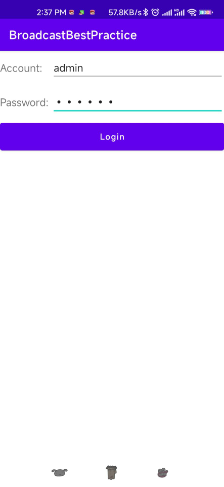
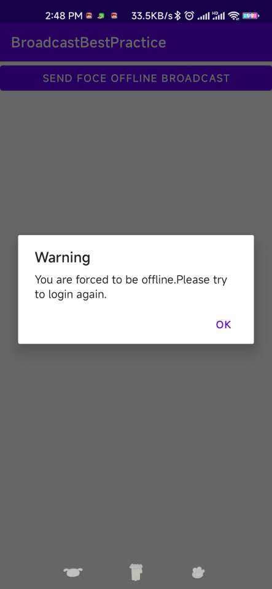

## 5.5 广播的最佳实践——实现强制下线功能

&emsp;&emsp;本章的内容不是非常多，相信学习起来是非常轻松的。现在我们准备通过一个完整的例子的实践，来综合运用一下本章中所学的知识。强制下线功能应该是比较常见的，很多应用程序都具备这个功能，比如你的qq号在别处登录了，就会将你强制下线。其实实现强制下线功能的思路也比较简单，只需要在界面上弹出一个对话框，让用户无法进行任何其他操作，必须要点击对话框中的确定按钮，然后回到登录界面即可。可是这样就存在一个问题，因为当我们被通知需要强制下线时可能正处于任何一个界面，难道我们需要在每个界面上都编写一个弹出对话框的逻辑？强制下线需要关闭所有的活动，然后回到登录页面。这个用到第二章的最佳实践部分就可以实现了，先创建一个ActivityColler=ctor类用于管理所有的活动，代码如下所示：

```java
package com.zj970.broadcastbestpractice;

import android.app.Activity;
import androidx.annotation.NonNull;

import java.util.ArrayList;
import java.util.List;

public class ActivityCollector {
    /**
     * This set of Activities is designed to manage Activities.
     */
    public static List<Activity> activities = new ArrayList<>();

    /**
     * add activity 
     * @param activity
     */
    public static void addActivity(@NonNull Activity activity){
        activities.add(activity);
    }

    /**
     * remove activity
     * @param activity
     */
    public static void removeActivity(@NonNull Activity activity){
        activities.remove(activity);
    }

    /**
     * destroy activity
     */
    public static void finshAll(){
        for (Activity activity : activities){
            if (!activity.isFinishing()){
                activity.finish();
            }
        }
    }
}

```
以及BaseActivity

```java
package com.zj970.broadcastbestpractice;

import android.os.Bundle;
import android.util.Log;
import androidx.annotation.Nullable;
import androidx.appcompat.app.AppCompatActivity;


public class BaseActivity extends AppCompatActivity {
    private static final String TAG = "BaseActivity";
    @Override
    protected void onCreate(@Nullable Bundle savedInstanceState) {
        super.onCreate(savedInstanceState);
        Log.d(TAG,getClass().getSimpleName());//知晓当前是在哪一个活动
        ActivityCollector.addActivity(this);
    }

    @Override
    protected void onDestroy() {
        super.onDestroy();
        ActivityCollector.removeActivity(this);
    }

}
```

首先创建一个登录界面的活动，新建LoginActivity，并生成对应的activity_login.xml配置文件

```xml
<?xml version="1.0" encoding="utf-8"?>
<LinearLayout
        xmlns:android="http://schemas.android.com/apk/res/android"
        xmlns:tools="http://schemas.android.com/tools"
        android:orientation="vertical"
        android:layout_width="match_parent"
        android:layout_height="match_parent"
        tools:context=".LoginActivity">
        <LinearLayout
                android:orientation="horizontal"
                android:layout_width="match_parent"
                android:layout_height="60dp">
            <TextView
                    android:layout_width="90dp"
                    android:layout_height="wrap_content"
                    android:layout_gravity="center_vertical"
                    android:textSize="18sp"
                    android:text="Account: "/>
            <EditText
                    android:id="@+id/account"
                    android:layout_width="0dp"
                    android:layout_height="wrap_content"
                    android:layout_weight="1"
                    android:layout_gravity="center_vertical"/>
        </LinearLayout>
    <LinearLayout
            android:orientation="horizontal"
            android:layout_width="match_parent"
            android:layout_height="60dp">
        <TextView
                android:layout_width="90dp"
                android:layout_height="wrap_content"
                android:layout_gravity="center_vertical"
                android:textSize="18sp"
                android:text="Password: "/>
        <EditText
                android:id="@+id/password"
                android:layout_width="0dp"
                android:layout_height="wrap_content"
                android:layout_weight="1"
                android:layout_gravity="center_vertical"
                android:inputType="textPassword"/>
    </LinearLayout>

    <Button
            android:id="@+id/login"
            android:layout_width="match_parent"
            android:layout_height="60dp"
            android:text="Login"
            android:textAllCaps="false"/>
</LinearLayout>
```
这里我们使用LinearLayout编写了一个登录布局，最外层是是一个纵向的LinearLayout，里面包含了三行直接子元素。第一行是一个横向LinearLayout，用于输入账户信息；第二行也是一个横向的LinearLayout，用于输入密码信息；第三行是一个登录按钮。这里有个android:inputType是设置文本类型，用于帮助输入法显示及合适的键盘类型。接下来修改LoginActivity中的代码，如下所示：

```java
package com.zj970.broadcastbestpractice;

import android.content.Intent;
import android.view.View;
import android.widget.Button;
import android.widget.EditText;
import android.os.Bundle;
import android.widget.Toast;

public class LoginActivity extends BaseActivity {

    private EditText accountEidt;
    private EditText passwordEdit;
    private Button login;

    @Override
    protected void onCreate(Bundle savedInstanceState) {
        super.onCreate(savedInstanceState);
        setContentView(R.layout.activity_login);
        accountEidt = findViewById(R.id.account);
        passwordEdit = findViewById(R.id.password);
        login = findViewById(R.id.login);
        login.setOnClickListener(new View.OnClickListener() {
            @Override
            public void onClick(View v) {
                String account = accountEidt.getText().toString();
                String password = passwordEdit.getText().toString();
                
                //默认账户是admin密码是123456
                if (account.equals("admin") && password.equals("123456")){
                    Intent intent = new Intent(LoginActivity.this,MainActivity.class);
                    startActivity(intent);
                    finish();
                }else {
                    Toast.makeText(LoginActivity.this, "account or password is invalid", Toast.LENGTH_SHORT).show();
                }
            }
        });
    }
}
```
这里模拟了一个非常简单的登录功能。首先要将LoginActivity的继承结构改成继承自BaseActivity，然后调用findViewById()方法分别获取到账户输入框、密码输入框以及登录按钮的实例，接着在登录按钮的点击事件里面对输入的账户和密码进行判断，如果账户是admin并且密码是123456，就认为登录成功进入MainActivity,否则就提示用户或密码错误。可以把MainActivity理解成是登录成功后进入的程序主界面，这里我们并不需要在主界面里提供什么花哨的功能，只需要加入强制下线就可以了，修改activity_main.xml

```xml
<?xml version="1.0" encoding="utf-8"?>
<LinearLayout
        xmlns:android="http://schemas.android.com/apk/res/android"
        xmlns:tools="http://schemas.android.com/tools"
        android:orientation="vertical"
        android:layout_width="match_parent"
        android:layout_height="match_parent"
        tools:context=".MainActivity">
    <Button
            android:id="@+id/foce_offline"
            android:layout_width="match_parent"
            android:layout_height="wrap_content"
            android:text="Send foce offline broadcast"/>
</LinearLayout>
```
只有一个按钮，用于触发下线功能。然后修改MainActivity中的代码

```java
package com.zj970.broadcastbestpractice;

import android.content.Intent;
import android.view.View;
import android.widget.Button;
import androidx.appcompat.app.AppCompatActivity;
import android.os.Bundle;

public class MainActivity extends AppCompatActivity {

    @Override
    protected void onCreate(Bundle savedInstanceState) {
        super.onCreate(savedInstanceState);
        setContentView(R.layout.activity_main);

        Button forceOffline = findViewById(R.id.foce_offline);
        forceOffline.setOnClickListener(new View.OnClickListener() {
            @Override
            public void onClick(View v) {
                Intent intent = new Intent("com.zj970.broadcastbestpractice.FORCE_OFFLINE");
                sendBroadcast(intent);
            }
        });
    }
}
```
同样非常简单，不过这里有个重点，我们在按钮的点击事件里面发送了一条广播，广播的值为com.zj970.broadcastbestpractice.FORCE_OFFLINE，这条广播就是用于通知程序强制用户下线的。也就是说强制用户下线的逻辑并不是写在MainActivity里的，而是应该写在接收这条广播接收器里面，这样强制下线的功能就不会依附于任何的界面，不管是在程序的任何地方，只需要发出这一条广播，就可以完成强制下线的操作了。那么接下来我们就需要创建一个广播接收器来接收这条强制下线广播，唯一的问题就是，应该在哪里创建？由于广播接收器里面需要弹出一个对话框阻塞用户的正常操作，但如果是创建的是一个静态注册的广播接收器，是没有办法在onReceive()方法里弹出对话框这样的UI控件的，显然我们也不可能去在每个活动中都注册一个动态的广播接收器。所以只需要在BaseActivity中动态注册一个接收器就可以了，因为所有的活动都是继承自BaseActivity的，修改BaseActivity的代码

```java
package com.zj970.broadcastbestpractice;

import android.content.*;
import android.os.Bundle;
import android.util.Log;
import androidx.annotation.Nullable;
import androidx.appcompat.app.AlertDialog;
import androidx.appcompat.app.AppCompatActivity;


public class BaseActivity extends AppCompatActivity {
    private static final String TAG = "BaseActivity";
    private ForceOfflineReceiver receiver;
    @Override
    protected void onCreate(@Nullable Bundle savedInstanceState) {
        super.onCreate(savedInstanceState);
        Log.d(TAG,getClass().getSimpleName());//知晓当前是在哪一个活动
        ActivityCollector.addActivity(this);
    }

    @Override
    protected void onResume() {
        super.onResume();
        IntentFilter intentFilter = new IntentFilter();
        intentFilter.addAction("com.zj970.broadcastbestpractice.FORCE_OFFLINE");
        receiver = new ForceOfflineReceiver();
        registerReceiver(receiver,intentFilter);
    }

    @Override
    protected void onPause() {
        super.onPause();
        if (receiver!=null){
            unregisterReceiver(receiver);
            receiver = null;
        }
    }

    @Override
    protected void onDestroy() {
        super.onDestroy();
        ActivityCollector.removeActivity(this);
    }

    class ForceOfflineReceiver extends BroadcastReceiver{

        @Override
        public void onReceive(Context context, Intent intent) {
            AlertDialog.Builder builder = new AlertDialog.Builder(context);
            builder.setTitle("Warning");
            builder.setMessage("You are forced to be offline.Please try to login again.");
            builder.setCancelable(false);
            builder.setPositiveButton("ok", new DialogInterface.OnClickListener() {
                @Override
                public void onClick(DialogInterface dialog, int which) {
                    ActivityCollector.finshAll();//销毁所有活动
                    Intent intent = new Intent(context,LoginActivity.class);
                    context.startActivity(intent);//重新启动LoginActivity
                }
            });
            builder.show();
        }
    }

}
```

&emsp;&emsp;在ForceOfflineReceiver中的onReceive()方法中不只是弹出一个Toast。首先肯定是使用了AlertDialog.Builder来构建一个对话框，这里注意一定要调用setCancelable()方法将对话框设置不可取消，否则用户按一下Back键就可以继续使用程序了，然后使用serPositiveButton()方法来给对话框注册确定按钮，当用户点击了确定按钮时，就调用ActivityCollector的finishAll()方法来销毁所有活动，并重新启动LoginActivity这个活动。

&emsp;&emsp;再来看一下我们是怎么注册ForceOfflineReceiver这个广播接收器的，可以看到，这里重写了onResume和onPause()这两个生命周期函数，然后分别在这两个方法里注册和取消注册ForceOfflineReceiver。

&emsp;&emsp;那么为什么这么写呢？之前不都是在onCreate()和onDestroy()方法里来注册和取消注册广播接收器的么？这是因为我们始终需要保证只有处于栈顶的活动才能接收到这条强制下线广播，非栈顶的活动不应该也没有必要去接收这条广播，所以写在onResume和onPause()方法里就可以很好地解决这个问题，当一个活动失去栈顶位置会自动取消广播接收器的注册。我们还需要修改AndroidManifest.xml

```xml
<?xml version="1.0" encoding="utf-8"?>
<manifest xmlns:android="http://schemas.android.com/apk/res/android"
          package="com.zj970.broadcastbestpractice">

    <application
            android:allowBackup="true"
            android:icon="@mipmap/ic_launcher"
            android:label="@string/app_name"
            android:roundIcon="@mipmap/ic_launcher_round"
            android:supportsRtl="true"
            android:theme="@style/Theme.BroadcastBestPractice">
        <activity android:name=".LoginActivity">
            <intent-filter>
                <action android:name="android.intent.action.MAIN"/>
                <category android:name="android.intent.category.LAUNCHER"/>
            </intent-filter>
        </activity>
        <activity android:name=".MainActivity">
        </activity>
    </application>

</manifest>
```
这里将主活动设置为LoginActivity而不是MainActivity。然后运行一下程序，首先进入登录页



如果输入的账户是admin，密码是123456点击登录按钮就会进入到程序的主界面，如图所示，如果再发送一下广播的按钮，就会发出一条强制下线的广播，ForceOfflineReceiver里收到这条广播后会弹出一个对话框提示用户已被强制下线



这时用户将无法再对界面的任何元素进行操作，只能点击确定按钮，然后重新回到登录界面。

## 5.6 Git实践——初识版本控制工具

&emsp;&emsp;git时一个开源的分布式版本控制工具，它的开发者就是大名鼎鼎的Linux操作系统的作者Linus Torvalds。git被开发出来的初衷是为了更好地管理Linux内核，而现在却早已被广泛应用于全球各种大小型的项目。

操作：

- 安装
1. Linux ：sudo apt-get install git
2. windows :[官网下载](https://git-scm.com/downloads)git for windows安装

- 使用
1. git config --global user.name "xxx"(配置用户名);git config --global user.email "xx"(配置邮箱);
2. cd到项目目录下git init(初始化仓库，该文件夹下有个隐藏文件夹.git)
3. git add 
4. git commit -m "xx"(提交信息)
5. git push(上传)
6. git pull(拉取)

## 5.7 小结与总结

&& 本章中我们主要是对Android的广播机制进行了深入的研究，不仅了解了广播的理论知识，还掌握了接收广播、发送自定义广播以及本地广播的使用方法。广播接收器属于Android四大组件之一，目前已经学习了四大组件中的两个了。