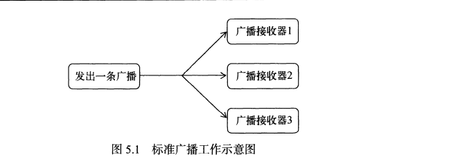
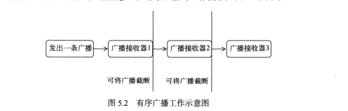
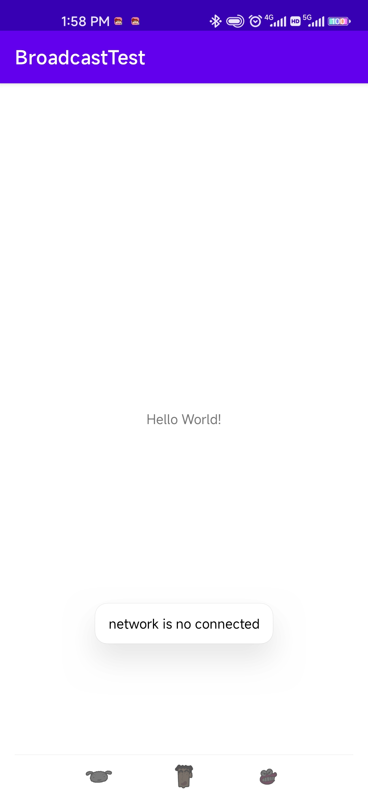
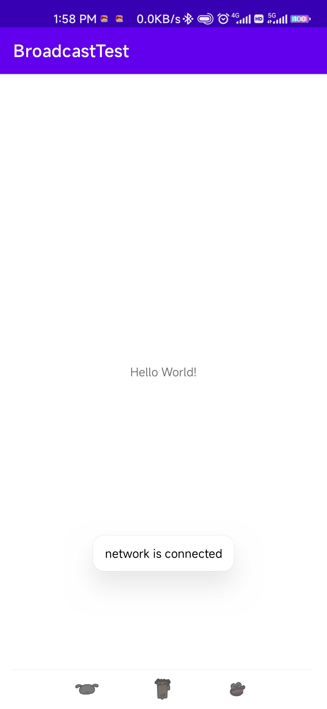
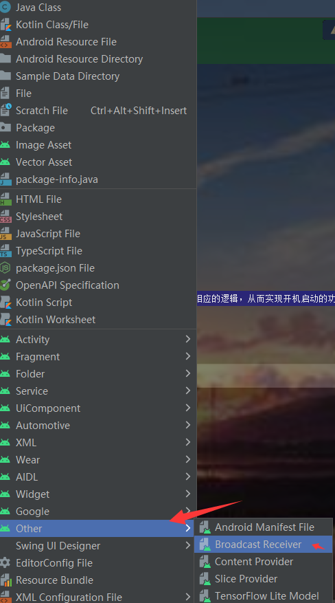
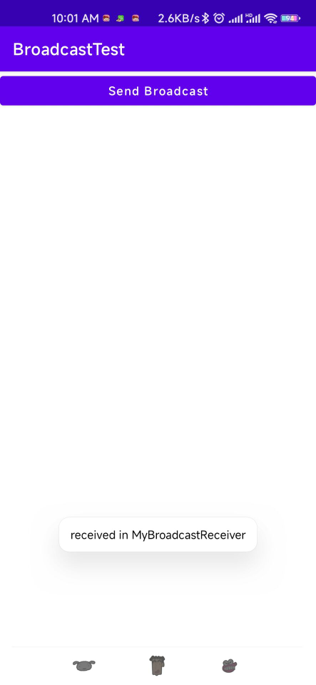
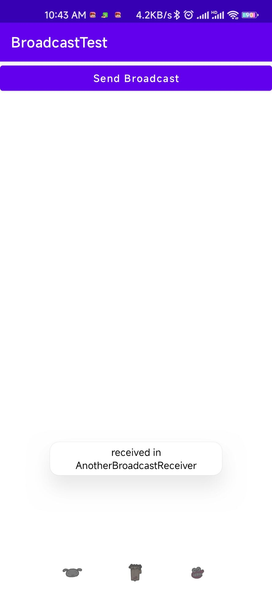
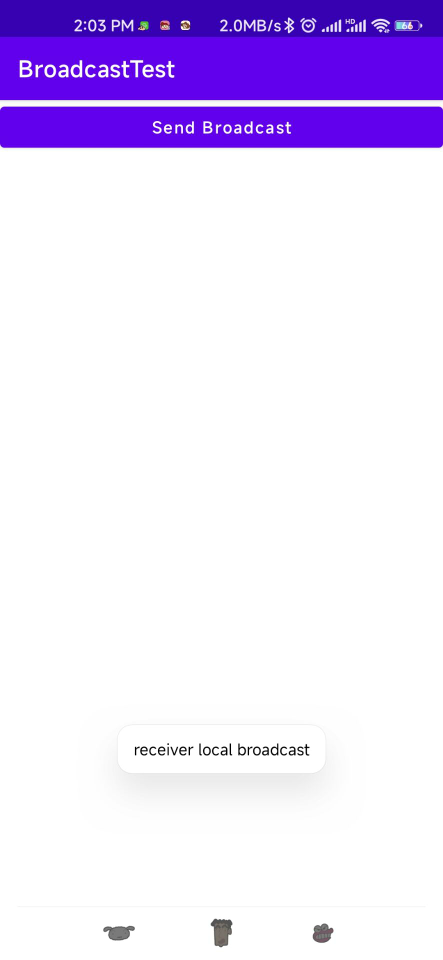
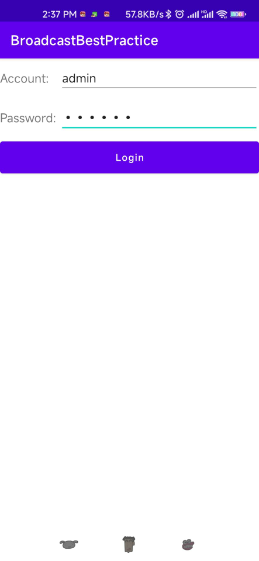
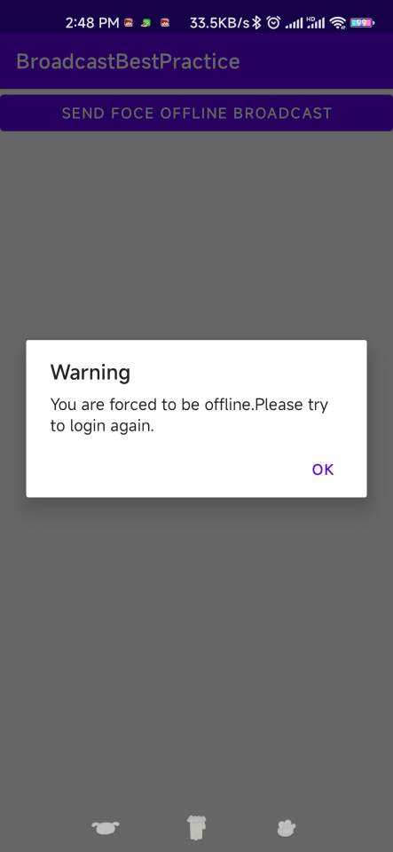

# 第5章 全局大喇叭——详解广播机制
&emsp;&emsp;记得上学的时候，每个班级的教室都会装有一个喇叭。这些喇叭都是接入到学校的广播室的，一旦以后什么重要通知，就会播放一条广播来告知全校师生。类似的工作机制其实在计算机领域也有非常广泛大的应用。了解网络通信原理的应该知道，在一个IP网络范围中，最大的IP地址是被保留作为广播地址来使用的。比如某个网络的IP地址范围是192.168.0.XXX，子网掩码是255.255.255.0。那么这个网络的广播地址就是192.168.0.255。广播数据包会被发送到统一网络上的所有端口，这样在该网络下的每台主机都会收到这个广播。为了便于进行系统级别的消息通知，Android也引入了一套类似于广播消息机制。

## 5.1 广播机制简介

&emsp;&emsp;为什么说Android中的广播机制更加灵活呢？这是因为Android中的每个应用程序都可以对自己感兴趣的广播进行注册，这样该程序就只会接收到自己所关心的广播内容，这些广播可能是来自系统的，也可能是来自于其他应用程序的。Android提供了一套完整的API，允许应用程序自由地发送和接收广播。发送广播的方法其实之前稍微提到过，就是借助学习过的Intent。而接收广播的方法则需要引入一个新的概念——广播接收器(Broadcast Receiver)。

广播主要可以分为两种类型：标准广播和有序广播。

- 标准广播(Normal broadcasts)是一种完全异步执行的广播，在广播发出之后，所有的广播接收器几乎都会在同一时刻接收到这条广播消息，因此它们之间没有任何先后顺序可言。这种广播的效率会比较高，但同时也意味着它是无法被截断的。标准广播的工作流程如图所示



- 有序广播(Ordered broadcasts)则是一种同步执行的广播，在广播发出之后，同一时刻只有一个广播接收器能够收到这条消息，当这个广播接收器中的逻辑执行完毕之后，广播才会继续传递。所以此时的广播接收器中的逻辑执行完毕后，广播才会继续传递。所以此时的广播接收器是有先后顺序的，优先级高的广播接收器就可以先收到广播消息，并且前面的广播接收器还可以截断正在传递的广播，这样后面的广播接收器就无法收到广播消息了。有序广播的工作流程如图所示：



## 5.2 接收系统广播

&emsp;&emsp;Android内置了很多系统级别的广播，我们可以在应用程序中通过监听这些广播来得到各种系统的状态信息。比如手机开机完成之后会发出一条广播，电池的电量变化会发出一条广播，时间或时区发生改变也会发出一条广播等等。如果想要接收这些广播，就需要使用广播接收器，下面是它的具体用法：

### 5.2.1 动态注册监听网络变化

&emsp;&emsp;广播接收器可以自由地对自己感兴趣的广播进行注册，这样当有相应的广播发出时，广播接收器就能收到这条广播，并在内部处理相应的逻辑。注册广播的方式一般有两种，在代码中注册和在AndroidManifest中注册，其中前者也被称为动态注册，后者被称为静态注册。那么该如何创建一个广播接收器呢？其实只需要新建一个类，让它继承自BroadcastReceiver，并重写父类的onReceiver()方法就可以了，当有广播到来时，onReceiver()方法就会得到执行，具体的逻辑就可以在这个方法中处理。那么先通过动态注册的方式编写一个能够监听网络变化的程序，借此学习一下广播接收器的基本用法。新建一个BroadcastTest项目，修改MainActivity中的代码

```java
package com.zj970.broadcasttest;

import android.content.BroadcastReceiver;
import android.content.Context;
import android.content.Intent;
import android.content.IntentFilter;
import android.widget.Toast;
import androidx.appcompat.app.AppCompatActivity;
import android.os.Bundle;

public class MainActivity extends AppCompatActivity {

    private IntentFilter intentFilter;
    private NetWorkChangeReceiver receiver;

    @Override
    protected void onCreate(Bundle savedInstanceState) {
        super.onCreate(savedInstanceState);
        setContentView(R.layout.activity_main);
        intentFilter = new IntentFilter();
        intentFilter.addAction("android.net.conn.CONNECTIVITY_CHANGE");//ConnectivityManager.CONNECTIVITY_ACTION
        receiver = new NetWorkChangeReceiver();
        registerReceiver(receiver,intentFilter);
    }

    @Override
    protected void onDestroy() {
        super.onDestroy();
        if (receiver != null){
            unregisterReceiver(receiver);
        }
    }

    class NetWorkChangeReceiver extends BroadcastReceiver{

        @Override
        public void onReceive(Context context, Intent intent) {
            Toast.makeText(context,"network changes",Toast.LENGTH_LONG).show();
        }
    }
}
```
&emsp;&emsp;可以看到，我们在MainActivity中定义了一个内部类NetWorkChangeReceiver，这个类是继承自BroadcastReceiver的，并重写了父类的onReceiver()方法。这样每当网络状态发生改变，onReceiver()方法就会得到执行，这里只是简单地使用了Toast提示了一段文本信息。然后观察onCreate()方法，首先我们创建了一个IntentFilter的实例，并给它添加了一个值为android.net.conn.CONNECTIVITY_CHANGE的action，为什么会要添加这个值呢？因为当网络状态发生变化的时候，系统正是发出一条值为android.net.conn.CONNECTIVITY_CHANGE的广播，也就是说我们的广播接收器想要监听什么广播，就在这里添加相应的action。接下来创建了一个NetworkChangeReceiver的实例，然后调用registerReceiver()方法进行注册，将NetworkChangeReceiver的实例和IntentFilter的实例都传入进去，这样NetworkChagneReceiver就会接收到所有值为android.net.conn.CONNECTIVITY_CHANGE的广播，也就实现了监听网络变化的功能。最后要记得，动态注册的广播一定要取消注册才行，这里我们是在onDestroy()方法中通过调用unregisterReceiver()方法来实现的。整体来说，代码还是非常简单的，运行一下程序。首先注册的完成的时候会收到一条广播，然后按下Home键回到主页（即销毁活动），接下来尝试关闭网络装填，就会发现有Toast提醒网络发生了变化。不过，只是提醒网络发生了改变还不够人性化，最好能准确地告诉用于当前是有网络还是没有，修改MainActivity中的代码：

```java
package com.zj970.broadcasttest;

import android.content.BroadcastReceiver;
import android.content.Context;
import android.content.Intent;
import android.content.IntentFilter;
import android.net.ConnectivityManager;
import android.net.Network;
import android.net.NetworkInfo;
import android.widget.Toast;
import androidx.appcompat.app.AppCompatActivity;
import android.os.Bundle;

public class MainActivity extends AppCompatActivity {

    private IntentFilter intentFilter;
    private NetWorkChangeReceiver receiver;

    @Override
    protected void onCreate(Bundle savedInstanceState) {
        super.onCreate(savedInstanceState);
        setContentView(R.layout.activity_main);
        intentFilter = new IntentFilter();
        intentFilter.addAction("android.net.conn.CONNECTIVITY_CHANGE");//ConnectivityManager.CONNECTIVITY_ACTION
        receiver = new NetWorkChangeReceiver();
        registerReceiver(receiver,intentFilter);
    }

    @Override
    protected void onDestroy() {
        super.onDestroy();
        if (receiver != null){
            unregisterReceiver(receiver);
        }
    }

    class NetWorkChangeReceiver extends BroadcastReceiver{

        @Override
        public void onReceive(Context context, Intent intent) {

            ConnectivityManager connectivityManager = (ConnectivityManager)getSystemService(Context.CONNECTIVITY_SERVICE);
            NetworkInfo networkInfo = connectivityManager.getActiveNetworkInfo();//这里要添加一个权限    <uses-permission android:name="android.permission.ACCESS_NETWORK_STATE"/>

            if (networkInfo != null && networkInfo.isConnected()){
                Toast.makeText(context,"network is connected",Toast.LENGTH_LONG).show();
            }
            else {
                Toast.makeText(context,"network is no connected",Toast.LENGTH_LONG).show();
            }
        }
    }
}
```

&emsp;&emsp;在onReceiver()方法中，首先通过getSystemService()方法得到了ConnectivityManager的实例，这是一个系统服务类，专门用于管理网络连接的。然后调用它的getActiveNetworkInfo()方法可以得到NetworkInfo的实例，接着调用NetWorkInfo的isConnected()方法，就可以判断当前是否有网络了，最后我们还是通过Toast的方式展示。另外，这里有非常重要的一点需要说明，Android系统为了保护用户设备的安全和隐私，做了严格的规定，如果程序需要进行一些对用户来说比较敏感的操作，就必须在配置文件中声明权限才可以，否则程序就会直接崩溃。比如这里访问系统的网络状态就是需要声明权限的。在AndroidManifest.xml文件加入android.permission.ACCESS_NETWORK_STATE

```xml
<?xml version="1.0" encoding="utf-8"?>
<manifest xmlns:android="http://schemas.android.com/apk/res/android"
          package="com.zj970.broadcasttest">

    <uses-permission android:name="android.permission.ACCESS_NETWORK_STATE"/>
    <application
            android:allowBackup="true"
            android:icon="@mipmap/ic_launcher"
            android:label="@string/app_name"
            android:roundIcon="@mipmap/ic_launcher_round"
            android:supportsRtl="true"
            android:theme="@style/Theme.BroadcastTest">
        <activity android:name=".MainActivity">
            <intent-filter>
                <action android:name="android.intent.action.MAIN"/>
                <category android:name="android.intent.category.LAUNCHER"/>
            </intent-filter>
        </activity>
    </application>

</manifest>
```

这是我们第一次遇到权限的问题，其实Android中许多操作都是需要声明权限才可以进行的，后面还会不断使用新的权限，目前这个访问系统的权限还是比较简单的，只需要在AndroidManifest.xml中声明一下就可以了，而Android6.0系统中引入了更加严格的运行时权限，从而能够更好地保证用户设备的安全和隐私。现在重新运行一下程序

- 禁用系统网络



- 启用系统网络



### 静态注册实现开机启动

&emsp;&emsp;动态注册的广播接收器可以自由地注册与注销，在灵活性方面有很大的优势，但是它也存在着一个缺点，即必须在程序启动之后才能接收到广播，因为注册的逻辑是写在onCreate()方法中的，那么有没有什么办法可以让程序在未启动的情况下就能接收到广播呢？这就需要使用静态注册的方式了。在这里我们准备让程序接收一条开机广播，当收到这条广播时就可以在onReceive()方法里执行相应的逻辑，从而实现开机启动的功能。



可以使用new->other->BroadcastReceiver快捷方式创建一个广播接收器，然后修改BootCompleteReceiver代码，其实就是新建类继承BroadcastReceiver然后在AndroidManifest.xml中注册。

```java
package com.zj970.broadcasttest;

import android.content.BroadcastReceiver;
import android.content.Context;
import android.content.Intent;
import android.widget.Toast;

public class BootCompleteReceiver extends BroadcastReceiver {

    @Override
    public void onReceive(Context context, Intent intent) {
        // TODO: This method is called when the BroadcastReceiver is receiving
        // an Intent broadcast.
        //throw new UnsupportedOperationException("Not yet implemented");
        Toast.makeText(context,"Boot Complete",Toast.LENGTH_LONG).show();
    }
}
```

代码非常简单，我们只是在onReceiver()方法中使用Toast弹出一段提示信息。另外，静态的广播接收器一定要AndroidManifest.xml文件中注册才可以使用，不过由于我们是使用Android Studio的快捷方式创建的广播接收器，因此注册这一步已经被自动完成了

```xml
<?xml version="1.0" encoding="utf-8"?>
<manifest xmlns:android="http://schemas.android.com/apk/res/android"
          package="com.zj970.broadcasttest">

    <uses-permission android:name="android.permission.ACCESS_NETWORK_STATE"/>

    <application
            android:allowBackup="true"
            android:icon="@mipmap/ic_launcher"
            android:label="@string/app_name"
            android:roundIcon="@mipmap/ic_launcher_round"
            android:supportsRtl="true"
            android:theme="@style/Theme.BroadcastTest">
        <receiver
                android:name=".BootCompleteReceiver"
                android:enabled="true"
                android:exported="true">
        </receiver>

        <activity android:name=".MainActivity">
            <intent-filter>
                <action android:name="android.intent.action.MAIN"/>

                <category android:name="android.intent.category.LAUNCHER"/>
            </intent-filter>
        </activity>
    </application>

</manifest>
```

可以看到，<application>标签内出现了一个新的标签<receiver>，所有静态的广播接收器都是在这里进行注册的。它的用法其实和<activity>标签非常相似，也是通过android:name来指定具体注册哪一个广播接收器，而enabled和exported属性则是根据我们刚才勾选的状态自动生成的。不过目前BootCompleteReceiver还是不能接收开机广播，我们还需要对AndroidManifest.xml文件进行修改才行，如下：

```xml
<?xml version="1.0" encoding="utf-8"?>
<manifest xmlns:android="http://schemas.android.com/apk/res/android"
          package="com.zj970.broadcasttest">

    <uses-permission android:name="android.permission.ACCESS_NETWORK_STATE"/>
    <user-permission android:name="android.permission.RECEIVE_BOOT_COMPLETED"/>
    <application
            android:allowBackup="true"
            android:icon="@mipmap/ic_launcher"
            android:label="@string/app_name"
            android:roundIcon="@mipmap/ic_launcher_round"
            android:supportsRtl="true"
            android:theme="@style/Theme.BroadcastTest">
        <receiver
                android:name=".BootCompleteReceiver"
                android:enabled="true"
                android:exported="true">
            <intent-filter>
                <action android:name="android.intent.action.BOOT_COMPLETED"/>
            </intent-filter>
        </receiver>

        <activity android:name=".MainActivity">
            <intent-filter>
                <action android:name="android.intent.action.MAIN"/>
                <category android:name="android.intent.category.LAUNCHER"/>
            </intent-filter>
        </activity>
    </application>
</manifest>
```
由于Android系统启动完成后会发出一条值为android.intent.action.BOOT_COMPLETED的广播，因此我们在<intent-filter>标签里添加了相应的action。另外，监听系统开机广播也是需要声明权限，可以看到，我们使用<uses-permission>标签又加入了一条android.permission.RECEIVE_BOOT_COMPLETED权限。效果图暂时没有。

&emps;&emsp;到现在为止，我们在广播接收器的onReceiver()方法中都只是简单地使用Toast提示一段文本信息，当真正在项目中使用到它的时候，就可以编写自己的逻辑。需要注意的是，不要在onReceiver()方法中添加过多的逻辑或者进行任何的耗时操作，因为在广播接收器中是不允许开启线程的，当onReceiver()方法中运行了较长时间而没有结束时，程序就会报错。因此，广播接收器更多的是扮演一种打开程序其他组件的角色，比如创建一条状态栏通知，或者启动一个服务等。

## 5.3 发送自定义广播

&emsp;&emsp;现在已经通过广播接收器来接收系统广播，接下来我们就要学习一下如何在应用程序中发送自定义的广播。前面有说到广播主要分为两种类型：标准广播和有序广播。

### 5.3.1 发送标准广播

&emsp;&emsp;在发送广播之前，我们还是需要先定义一个广播接收器来准备接收此广播才行，不然发出去也是白发。因此新建一个MyBroadcastReceiver，代码如下所示：

```java
package com.zj970.broadcasttest;

import android.content.BroadcastReceiver;
import android.content.Context;
import android.content.Intent;
import android.widget.Toast;

public class MyBroadcastReceiver extends BroadcastReceiver {

    @Override
    public void onReceive(Context context, Intent intent) {
        // TODO: This method is called when the BroadcastReceiver is receiving
        // an Intent broadcast.
        Toast.makeText(context,"received in MyBroadcastReceiver",Toast.LENGTH_LONG).show();
        throw new UnsupportedOperationException("Not yet implemented");
    }
}
```

这里当MyBroadcastReceiver收到自定义广播时，就会弹出 "received in MyBroadcastReceiver"的提示。然后在AndroidManifest.xml中对这个广播接收器进行修改

```xml
<?xml version="1.0" encoding="utf-8"?>
<manifest xmlns:android="http://schemas.android.com/apk/res/android"
          package="com.zj970.broadcasttest">

    <uses-permission android:name="android.permission.ACCESS_NETWORK_STATE"/>
    <uses-permission android:name="android.permission.RECEIVE_BOOT_COMPLETED"/>

    <application
            android:allowBackup="true"
            android:icon="@mipmap/ic_launcher"
            android:label="@string/app_name"
            android:roundIcon="@mipmap/ic_launcher_round"
            android:supportsRtl="true"
            android:theme="@style/Theme.BroadcastTest">
        <receiver
                android:name=".MyBroadcastReceiver"
                android:enabled="true"
                android:exported="true">
            <intent-filter>
                <action android:name="com.zj970.broadcasttest.MY_BROADCAST"/>
            </intent-filter>
        </receiver>
        <receiver
                android:name=".BootCompleteReceiver"
                android:enabled="true"
                android:exported="true">
            <intent-filter>
                <action android:name="android.intent.action.ACTION_SHUTDOWN"/>
                <action android:name="android.intent.action.BOOT_COMPLETED"/>
            </intent-filter>
        </receiver>

        <activity android:name=".MainActivity">
            <intent-filter>
                <action android:name="android.intent.action.MAIN"/>

                <category android:name="android.intent.category.LAUNCHER"/>
            </intent-filter>
        </activity>
    </application>

</manifest>
```

可以看到，这里让MyBroadcastReceiver接收一条值为com.zj970.broadcasttest.MY_BROADCAST的广播，因此待会儿在发送广播的时候，我们就需要发出这样的广播。接下来修改activity_main.xml中的代码：

```xml
<?xml version="1.0" encoding="utf-8"?>
<LinearLayout
        xmlns:android="http://schemas.android.com/apk/res/android"
        xmlns:tools="http://schemas.android.com/tools"
        android:layout_width="match_parent"
        android:layout_height="match_parent"
        android:orientation="vertical"
        tools:context=".MainActivity">
    <Button
            android:id="@+id/button"
            android:layout_width="match_parent"
            android:layout_height="wrap_content"
            android:text="Send Broadcast"
            android:textAllCaps="false"/>
</LinearLayout>
```
这里在布局文件中定义了一个按钮，用作发送广播的触发点。然后修改MainActivity中的代码：

```java
package com.zj970.broadcasttest;

import android.content.BroadcastReceiver;
import android.content.Context;
import android.content.Intent;
import android.content.IntentFilter;
import android.net.ConnectivityManager;
import android.net.Network;
import android.net.NetworkInfo;
import android.view.View;
import android.widget.Button;
import android.widget.Toast;
import androidx.appcompat.app.AppCompatActivity;
import android.os.Bundle;

public class MainActivity extends AppCompatActivity {

    private IntentFilter intentFilter;
    private NetWorkChangeReceiver receiver;

    @Override
    protected void onCreate(Bundle savedInstanceState) {
        super.onCreate(savedInstanceState);
        setContentView(R.layout.activity_main);
        Button button = findViewById(R.id.button);
        button.setOnClickListener(new View.OnClickListener() {
            @Override
            public void onClick(View v) {
                Intent intent = new Intent("com.zj970.broadcasttest.MY_BROADCAST");
                intent.setPackage("com.zj970.broadcasttest");
                sendBroadcast(intent);
            }
        });

        intentFilter = new IntentFilter();
        intentFilter.addAction("android.net.conn.CONNECTIVITY_CHANGE");//ConnectivityManager.CONNECTIVITY_ACTION
        receiver = new NetWorkChangeReceiver();
        registerReceiver(receiver,intentFilter);
    }

    @Override
    protected void onDestroy() {
        super.onDestroy();
        if (receiver != null){
            unregisterReceiver(receiver);
        }
    }

    class NetWorkChangeReceiver extends BroadcastReceiver{

        @Override
        public void onReceive(Context context, Intent intent) {

            ConnectivityManager connectivityManager = (ConnectivityManager)getSystemService(Context.CONNECTIVITY_SERVICE);
            NetworkInfo networkInfo = connectivityManager.getActiveNetworkInfo();//这里要添加一个权限    <uses-permission android:name="android.permission.ACCESS_NETWORK_STATE"/>

            if (networkInfo != null && networkInfo.isConnected()){
                Toast.makeText(context,"network is connected",Toast.LENGTH_LONG).show();
            }
            else {
                Toast.makeText(context,"network is no connected",Toast.LENGTH_LONG).show();
            }
        }
    }
}
```
我们可以看到，在按钮事件中加入了发送自定义广播的逻辑。首先构造出了一个Intent对象，并把要发送的广播的值传入，然后调用了Context的sendBroadcast()方法将广播发送出去，这样所有监听com.zj970.broadcasttest.MY_BROADCAST这条广播的广播接收器就会收到消息。此时发出的广播时一条标准广播，运行程序，点击send按钮如下（intent.setPackage("com.zj970.broadcasttest");//安卓8.0后静态注册的广播无法接收需要添加Intent.sendComponent();在暗中9.0后对静态注册则需要发送指定app所在的包名）：



这样我们就成功完成了发送自定义广播的功能。另外，由于广播是使用Intent进行传递的，因此你还可以在Intent中携带一些数据传递给广播接收器。

### 5.3.2 发送有序广播

&emsp;&emsp;广播是一种可以跨进程的通信方式，这一点从前面接收系统广播的时候就可以看出来了。因此我们应用程序内发出的广播，其他的应用程序应该也是可以接收到的。为了验证这一点，我们再新建一个BroadcastTest2模块，并定义一个广播接收器AnotherBroadcastReceiver:

```java
package com.zj970.broadcasttest2;

import android.content.BroadcastReceiver;
import android.content.Context;
import android.content.Intent;
import android.widget.Toast;

public class AnotherBroadcastReceiver extends BroadcastReceiver {
    @Override
    public void onReceive(Context context, Intent intent) {
        Toast.makeText(context, "received in AnotherBroadcastReceiver", Toast.LENGTH_SHORT).show();
    }
}
```
这里仍然是在广播接收器的onReceiver()方法中弹出一段文本提示信息，然后在AndroidManifest.xml中对这个广播接收器进行修改：

```xml
<?xml version="1.0" encoding="utf-8"?>
<manifest xmlns:android="http://schemas.android.com/apk/res/android"
          package="com.zj970.broadcasttest2">

    <application
            android:allowBackup="true"
            android:icon="@mipmap/ic_launcher"
            android:label="@string/app_name"
            android:roundIcon="@mipmap/ic_launcher_round"
            android:supportsRtl="true"
            android:theme="@style/Theme.BroadcastTest">
        <activity android:name=".MainActivity">
            <intent-filter>
                <action android:name="android.intent.action.MAIN"/>

                <category android:name="android.intent.category.LAUNCHER"/>
            </intent-filter>
        </activity>
        <receiver android:name=".AnotherBroadcastReceiver"
                  android:exported="true"
                  android:enabled="true">
            <intent-filter>
                <action android:name="com.zj970.broadcasttest.MY_BROADCAST"/>
            </intent-filter>
        </receiver>
    </application>
</manifest>
```
可以看到，AnotherBroadcastReceiver同样接收的是com.zj970.broadcasttest.MY_BROADCAST这条广播，现在运行BroadcastTest2安装，回到BroadcastTest项目主界面，并点击send按钮，就会弹出两次提示消息，如图所示：




这样就强有力地证明了，我们的应用程序发出的广播是可以被其他应用程序接收到的。不过目前为止，程序内发出的广播都还是标准广播，现在我们来尝试一下发送有序广播。重新回到BroadcastTest模块，然后修改MainActivity中的代码：

```java
package com.zj970.broadcasttest;

import android.content.BroadcastReceiver;
import android.content.Context;
import android.content.Intent;
import android.content.IntentFilter;
import android.net.ConnectivityManager;
import android.net.Network;
import android.net.NetworkInfo;
import android.view.View;
import android.widget.Button;
import android.widget.Toast;
import androidx.appcompat.app.AppCompatActivity;
import android.os.Bundle;

public class MainActivity extends AppCompatActivity {

    private IntentFilter intentFilter;
    private NetWorkChangeReceiver receiver;

    @Override
    protected void onCreate(Bundle savedInstanceState) {
        super.onCreate(savedInstanceState);
        setContentView(R.layout.activity_main);
        Button button = findViewById(R.id.button);
        button.setOnClickListener(new View.OnClickListener() {
            @Override
            public void onClick(View v) {
                Intent intent = new Intent("com.zj970.broadcasttest.MY_BROADCAST");
                intent.setPackage("com.zj970.broadcasttest");//安卓8.0后静态注册的广播无法接收需要添加Intent.sendComponent();在暗中9.0后对静态注册则需要发送指定app所在的包名
                //intent.setPackage("com.zj970.broadcasttest2");
                sendOrderedBroadcast(intent,null);
                intent.setPackage("com.zj970.broadcasttest2");
                sendBroadcast(intent);
            }
        });

        intentFilter = new IntentFilter();
        intentFilter.addAction("android.net.conn.CONNECTIVITY_CHANGE");//ConnectivityManager.CONNECTIVITY_ACTION
        receiver = new NetWorkChangeReceiver();
        registerReceiver(receiver, intentFilter);//动态注册
    }

    @Override
    protected void onDestroy() {
        super.onDestroy();
        if (receiver != null) {
            unregisterReceiver(receiver);
        }
    }

    class NetWorkChangeReceiver extends BroadcastReceiver {

        @Override
        public void onReceive(Context context, Intent intent) {

            ConnectivityManager connectivityManager = (ConnectivityManager) getSystemService(Context.CONNECTIVITY_SERVICE);
            NetworkInfo networkInfo = connectivityManager.getActiveNetworkInfo();//这里要添加一个权限    <uses-permission android:name="android.permission.ACCESS_NETWORK_STATE"/>

            if (networkInfo != null && networkInfo.isConnected()) {
                Toast.makeText(context, "network is connected", Toast.LENGTH_LONG).show();
            } else {
                Toast.makeText(context, "network is no connected", Toast.LENGTH_LONG).show();
            }
        }
    }
}                
```

可以看到，发送有序广播只需要改动一行代码，即将sendBroadcast()方法改成sendOrderedBroadcast()方法。sendOrderedBroadcast()方法接收连个参数，第一个参数仍然是Intent，第二个参数是一个与权限相关的字符串，这里传入null就行了。现在重新运行程序，并点击按钮，这两个应用程序仍然都可以接收到这条广播。看上去好像和标准广播没什么区别，不过，这个时候的广播接收器是有先后顺序的，而且前面的广播接收器还可以将广播截断，以阻止其继续传播。那么该如何设定广播接收器的先后顺序呢？当然是在注册的时候进行设定了，修改AndroidManifest.xml中的代码：

```xml
<?xml version="1.0" encoding="utf-8"?>
<manifest xmlns:android="http://schemas.android.com/apk/res/android"
          package="com.zj970.broadcasttest">

    <uses-permission android:name="android.permission.ACCESS_NETWORK_STATE"/>
    <uses-permission android:name="android.permission.RECEIVE_BOOT_COMPLETED"/>

    <application
            android:allowBackup="true"
            android:icon="@mipmap/ic_launcher"
            android:label="@string/app_name"
            android:roundIcon="@mipmap/ic_launcher_round"
            android:supportsRtl="true"
            android:theme="@style/Theme.BroadcastTest">
        <receiver
                android:name=".MyBroadcastReceiver"
                android:enabled="true"
                android:exported="true">
            <intent-filter android:priority="100">
                <action android:name="com.zj970.broadcasttest.MY_BROADCAST"/>
            </intent-filter>
        </receiver>

        <receiver
                android:name=".BootCompleteReceiver"
                android:enabled="true"
                android:exported="true">
            <intent-filter>
                <action android:name="android.intent.action.BOOT_COMPLETED"/>
                <action android:name="android.intent.action.ACTION_SHUTDOWN"/>
            </intent-filter>
        </receiver>

        <activity android:name=".MainActivity">
            <intent-filter>
                <action android:name="android.intent.action.MAIN"/>
                <category android:name="android.intent.category.LAUNCHER"/>
            </intent-filter>
        </activity>
    </application>

</manifest>
```
可以看到，我们通过android:priority属性给广播接收器设置了优先级，优先级比较高的广播接收器就可以先收到广播(数字越高优先级越高)。这里我们将MyBroadcastReceiver的优先级设置了100，以保证它一定会在AnotherBroadcastReceiver之前收到广播。既然已经获得了接收广播的优先权，那么MyBroadcastReceiver就可以选择是否允许广播继续传递了。修改MyBroadcastReceiver中的代码：

```java
package com.zj970.broadcasttest;

import android.content.BroadcastReceiver;
import android.content.Context;
import android.content.Intent;
import android.util.Log;
import android.widget.Toast;

public class MyBroadcastReceiver extends BroadcastReceiver {

    @Override
    public void onReceive(Context context, Intent intent) {
        // TODO: This method is called when the BroadcastReceiver is receiving
        // an Intent broadcast.
        Toast.makeText(context,"received in MyBroadcastReceiver",Toast.LENGTH_LONG).show();
        abortBroadcast();
        Log.d("zj970", "onReceive: MyBroadcastReceiver");
    }
}
```
如果在onReceiver()方法中调用了abortBroadcast()方法就表示将这条广播截断，后面的广播接收器就无法再接收这条广播。现在重新运行程序，并点击按钮，只有MyBroadcastReceiver中的Toast信息能够弹出，说明这条广播经过MyBroadcastReceiver之后确实终止传递了。

## 5.4 使用本地广播

&emsp;&emsp;前面我们发送和接收的广播全部属于系统全局广播，即发出的广播可以被其他任何应用程序接收到，并且我们也可以就收来自其他应用程序的广播。这样就很容易引起安全性的问题，比如说我们发送的一些携带关键性数据的广播有可能被其他的应用程序截获，或者其他的程序不停地向我们的广播接收器里发送各种各样垃圾广播。为了能够简单地解决广播的安全性问题，Android引入了一套本地广播机制，使用这个机制发出的广播只能够再应用程序内部进行传递，并且广播接收器也只能接收来自本应用程序发出的广播，这样所有的安全性问题就都不存在了。本地广播的用法并不复杂，主要是使用了一个LocalBroadcastManager，来对广播进行管理，并提供了发送广播和注册广播接收器的方法。修改MainActivity(这里我用到的是Androidx，所以要导入依赖    implementation 'androidx.localbroadcastmanager:localbroadcastmanager:1.0.0')

```java
package com.zj970.broadcasttest;

import android.content.BroadcastReceiver;
import android.content.Context;
import android.content.Intent;
import android.content.IntentFilter;
import android.net.ConnectivityManager;
import android.net.NetworkInfo;
import android.view.View;
import android.widget.Button;
import android.widget.Toast;
import androidx.appcompat.app.AppCompatActivity;
import android.os.Bundle;
import androidx.localbroadcastmanager.content.LocalBroadcastManager;

public class MainActivity extends AppCompatActivity {

    private IntentFilter intentFilter;
    private NetWorkChangeReceiver receiver;

    private LocalReceiver localReceiver;
    private LocalBroadcastManager localBroadcastManager;

    @Override
    protected void onCreate(Bundle savedInstanceState) {
        super.onCreate(savedInstanceState);
        setContentView(R.layout.activity_main);
        localBroadcastManager = LocalBroadcastManager.getInstance(this);//获取实例
        Button button = findViewById(R.id.button);
        button.setOnClickListener(new View.OnClickListener() {
            @Override
            public void onClick(View v) {
/*                Intent intent = new Intent("com.zj970.broadcasttest.MY_BROADCAST");
                intent.setPackage("com.zj970.broadcasttest");//安卓8.0后静态注册的广播无法接收需要添加Intent.sendComponent();在暗中9.0后对静态注册则需要发送指定app所在的包名
                //intent.setPackage("com.zj970.broadcasttest2");
                //sendBroadcast(intent);
                sendOrderedBroadcast(intent,null);
                intent.setPackage("com.zj970.broadcasttest2");
                sendBroadcast(intent);*/

                Intent intent = new Intent("com.zj970.broadcasttest.LOCAL_BROADCAST");
                localBroadcastManager.sendBroadcast(intent);//发送本地广播
            }
        });

        intentFilter = new IntentFilter();
/*        intentFilter.addAction("android.net.conn.CONNECTIVITY_CHANGE");//ConnectivityManager.CONNECTIVITY_ACTION
        receiver = new NetWorkChangeReceiver();
        registerReceiver(receiver, intentFilter);//动态注册*/
        intentFilter.addAction("com.zj970.broadcasttest.LOCAL_BROADCAST");
        localReceiver = new LocalReceiver();
        localBroadcastManager.registerReceiver(localReceiver,intentFilter);//注册本地广播监听器
    }

    @Override
    protected void onDestroy() {
        super.onDestroy();
        if (receiver != null) {
            /*unregisterReceiver(receiver);*/
            localBroadcastManager.unregisterReceiver(localReceiver);
        }
    }

    class NetWorkChangeReceiver extends BroadcastReceiver {

        @Override
        public void onReceive(Context context, Intent intent) {

            ConnectivityManager connectivityManager = (ConnectivityManager) getSystemService(Context.CONNECTIVITY_SERVICE);
            NetworkInfo networkInfo = connectivityManager.getActiveNetworkInfo();//这里要添加一个权限    <uses-permission android:name="android.permission.ACCESS_NETWORK_STATE"/>

            if (networkInfo != null && networkInfo.isConnected()) {
                Toast.makeText(context, "network is connected", Toast.LENGTH_LONG).show();
            } else {
                Toast.makeText(context, "network is no connected", Toast.LENGTH_LONG).show();
            }
        }
    }

    class LocalReceiver extends BroadcastReceiver{

        @Override
        public void onReceive(Context context, Intent intent) {
            Toast.makeText(context,"receiver local broadcast",Toast.LENGTH_SHORT).show();
        }
    }
}
```
&emsp;&emsp;有没有感觉这些代码很熟悉？没错，其实这基本上就和我们之前所学的动态注册广播接收器以及发送广播的代码是一样的。只不过现在首先是通过LocalBroadcastManager的getInstance()方法得到它的一个实例，然后在注册广播接收器的时候调用的是LocalBroadcastManager的registerReceiver()方法，在发送广播的时候调用的是LocalBroadcastManager的registerReceiver()方法，在发送广播的时候调用的是LocalBroadcastManager的sendBroadcast()方法，仅此而已。这里我们在按钮的点击事件里面发出了一条com.zj970.broadcasttest.LOCAL_BROADCAST广播，然后在LocalReceiver里去接收这条广播。重新运行程序，并点击按钮，效果如图所示：



&emsp;&emsp;可以看到，LocalReceiver成功接收到了这条广播，并通过Toast提示出来。如果在BroadcastTest2去接收com.zj970.broadcasttest.MY_BROADCAST这条广播，是无法收到的，因为这条广播只是在BroadcastTest程序内传播。另外还有一点需要说明，本地广播是无法通过静态注册的方式来接收的。因为静态注册主要是为了让程序在未启动的情况下也能收到广播，而发送本地广播的时候，我们的程序肯定是启动了，因此也完全不需要使用静态注册的功能。

本地广播的优势

- 可以明确地知道正在发送的广播不会离开我们的程序，因此不必担心机密数据泄露。
- 其他的程序无法将广播发送到我们程序的内部，因此不需要担心会有安全漏洞的隐患。
- 发送本地广播比发送系统全局广播将会更加高效。


## 5.5 广播的最佳实践——实现强制下线功能

&emsp;&emsp;本章的内容不是非常多，相信学习起来是非常轻松的。现在我们准备通过一个完整的例子的实践，来综合运用一下本章中所学的知识。强制下线功能应该是比较常见的，很多应用程序都具备这个功能，比如你的qq号在别处登录了，就会将你强制下线。其实实现强制下线功能的思路也比较简单，只需要在界面上弹出一个对话框，让用户无法进行任何其他操作，必须要点击对话框中的确定按钮，然后回到登录界面即可。可是这样就存在一个问题，因为当我们被通知需要强制下线时可能正处于任何一个界面，难道我们需要在每个界面上都编写一个弹出对话框的逻辑？强制下线需要关闭所有的活动，然后回到登录页面。这个用到第二章的最佳实践部分就可以实现了，先创建一个ActivityColler=ctor类用于管理所有的活动，代码如下所示：

```java
package com.zj970.broadcastbestpractice;

import android.app.Activity;
import androidx.annotation.NonNull;

import java.util.ArrayList;
import java.util.List;

public class ActivityCollector {
    /**
     * This set of Activities is designed to manage Activities.
     */
    public static List<Activity> activities = new ArrayList<>();

    /**
     * add activity 
     * @param activity
     */
    public static void addActivity(@NonNull Activity activity){
        activities.add(activity);
    }

    /**
     * remove activity
     * @param activity
     */
    public static void removeActivity(@NonNull Activity activity){
        activities.remove(activity);
    }

    /**
     * destroy activity
     */
    public static void finshAll(){
        for (Activity activity : activities){
            if (!activity.isFinishing()){
                activity.finish();
            }
        }
    }
}

```
以及BaseActivity

```java
package com.zj970.broadcastbestpractice;

import android.os.Bundle;
import android.util.Log;
import androidx.annotation.Nullable;
import androidx.appcompat.app.AppCompatActivity;


public class BaseActivity extends AppCompatActivity {
    private static final String TAG = "BaseActivity";
    @Override
    protected void onCreate(@Nullable Bundle savedInstanceState) {
        super.onCreate(savedInstanceState);
        Log.d(TAG,getClass().getSimpleName());//知晓当前是在哪一个活动
        ActivityCollector.addActivity(this);
    }

    @Override
    protected void onDestroy() {
        super.onDestroy();
        ActivityCollector.removeActivity(this);
    }

}
```

首先创建一个登录界面的活动，新建LoginActivity，并生成对应的activity_login.xml配置文件

```xml
<?xml version="1.0" encoding="utf-8"?>
<LinearLayout
        xmlns:android="http://schemas.android.com/apk/res/android"
        xmlns:tools="http://schemas.android.com/tools"
        android:orientation="vertical"
        android:layout_width="match_parent"
        android:layout_height="match_parent"
        tools:context=".LoginActivity">
        <LinearLayout
                android:orientation="horizontal"
                android:layout_width="match_parent"
                android:layout_height="60dp">
            <TextView
                    android:layout_width="90dp"
                    android:layout_height="wrap_content"
                    android:layout_gravity="center_vertical"
                    android:textSize="18sp"
                    android:text="Account: "/>
            <EditText
                    android:id="@+id/account"
                    android:layout_width="0dp"
                    android:layout_height="wrap_content"
                    android:layout_weight="1"
                    android:layout_gravity="center_vertical"/>
        </LinearLayout>
    <LinearLayout
            android:orientation="horizontal"
            android:layout_width="match_parent"
            android:layout_height="60dp">
        <TextView
                android:layout_width="90dp"
                android:layout_height="wrap_content"
                android:layout_gravity="center_vertical"
                android:textSize="18sp"
                android:text="Password: "/>
        <EditText
                android:id="@+id/password"
                android:layout_width="0dp"
                android:layout_height="wrap_content"
                android:layout_weight="1"
                android:layout_gravity="center_vertical"
                android:inputType="textPassword"/>
    </LinearLayout>

    <Button
            android:id="@+id/login"
            android:layout_width="match_parent"
            android:layout_height="60dp"
            android:text="Login"
            android:textAllCaps="false"/>
</LinearLayout>
```
这里我们使用LinearLayout编写了一个登录布局，最外层是是一个纵向的LinearLayout，里面包含了三行直接子元素。第一行是一个横向LinearLayout，用于输入账户信息；第二行也是一个横向的LinearLayout，用于输入密码信息；第三行是一个登录按钮。这里有个android:inputType是设置文本类型，用于帮助输入法显示及合适的键盘类型。接下来修改LoginActivity中的代码，如下所示：

```java
package com.zj970.broadcastbestpractice;

import android.content.Intent;
import android.view.View;
import android.widget.Button;
import android.widget.EditText;
import android.os.Bundle;
import android.widget.Toast;

public class LoginActivity extends BaseActivity {

    private EditText accountEidt;
    private EditText passwordEdit;
    private Button login;

    @Override
    protected void onCreate(Bundle savedInstanceState) {
        super.onCreate(savedInstanceState);
        setContentView(R.layout.activity_login);
        accountEidt = findViewById(R.id.account);
        passwordEdit = findViewById(R.id.password);
        login = findViewById(R.id.login);
        login.setOnClickListener(new View.OnClickListener() {
            @Override
            public void onClick(View v) {
                String account = accountEidt.getText().toString();
                String password = passwordEdit.getText().toString();
                
                //默认账户是admin密码是123456
                if (account.equals("admin") && password.equals("123456")){
                    Intent intent = new Intent(LoginActivity.this,MainActivity.class);
                    startActivity(intent);
                    finish();
                }else {
                    Toast.makeText(LoginActivity.this, "account or password is invalid", Toast.LENGTH_SHORT).show();
                }
            }
        });
    }
}
```
这里模拟了一个非常简单的登录功能。首先要将LoginActivity的继承结构改成继承自BaseActivity，然后调用findViewById()方法分别获取到账户输入框、密码输入框以及登录按钮的实例，接着在登录按钮的点击事件里面对输入的账户和密码进行判断，如果账户是admin并且密码是123456，就认为登录成功进入MainActivity,否则就提示用户或密码错误。可以把MainActivity理解成是登录成功后进入的程序主界面，这里我们并不需要在主界面里提供什么花哨的功能，只需要加入强制下线就可以了，修改activity_main.xml

```xml
<?xml version="1.0" encoding="utf-8"?>
<LinearLayout
        xmlns:android="http://schemas.android.com/apk/res/android"
        xmlns:tools="http://schemas.android.com/tools"
        android:orientation="vertical"
        android:layout_width="match_parent"
        android:layout_height="match_parent"
        tools:context=".MainActivity">
    <Button
            android:id="@+id/foce_offline"
            android:layout_width="match_parent"
            android:layout_height="wrap_content"
            android:text="Send foce offline broadcast"/>
</LinearLayout>
```
只有一个按钮，用于触发下线功能。然后修改MainActivity中的代码

```java
package com.zj970.broadcastbestpractice;

import android.content.Intent;
import android.view.View;
import android.widget.Button;
import androidx.appcompat.app.AppCompatActivity;
import android.os.Bundle;

public class MainActivity extends AppCompatActivity {

    @Override
    protected void onCreate(Bundle savedInstanceState) {
        super.onCreate(savedInstanceState);
        setContentView(R.layout.activity_main);

        Button forceOffline = findViewById(R.id.foce_offline);
        forceOffline.setOnClickListener(new View.OnClickListener() {
            @Override
            public void onClick(View v) {
                Intent intent = new Intent("com.zj970.broadcastbestpractice.FORCE_OFFLINE");
                sendBroadcast(intent);
            }
        });
    }
}
```
同样非常简单，不过这里有个重点，我们在按钮的点击事件里面发送了一条广播，广播的值为com.zj970.broadcastbestpractice.FORCE_OFFLINE，这条广播就是用于通知程序强制用户下线的。也就是说强制用户下线的逻辑并不是写在MainActivity里的，而是应该写在接收这条广播接收器里面，这样强制下线的功能就不会依附于任何的界面，不管是在程序的任何地方，只需要发出这一条广播，就可以完成强制下线的操作了。那么接下来我们就需要创建一个广播接收器来接收这条强制下线广播，唯一的问题就是，应该在哪里创建？由于广播接收器里面需要弹出一个对话框阻塞用户的正常操作，但如果是创建的是一个静态注册的广播接收器，是没有办法在onReceive()方法里弹出对话框这样的UI控件的，显然我们也不可能去在每个活动中都注册一个动态的广播接收器。所以只需要在BaseActivity中动态注册一个接收器就可以了，因为所有的活动都是继承自BaseActivity的，修改BaseActivity的代码

```java
package com.zj970.broadcastbestpractice;

import android.content.*;
import android.os.Bundle;
import android.util.Log;
import androidx.annotation.Nullable;
import androidx.appcompat.app.AlertDialog;
import androidx.appcompat.app.AppCompatActivity;


public class BaseActivity extends AppCompatActivity {
    private static final String TAG = "BaseActivity";
    private ForceOfflineReceiver receiver;
    @Override
    protected void onCreate(@Nullable Bundle savedInstanceState) {
        super.onCreate(savedInstanceState);
        Log.d(TAG,getClass().getSimpleName());//知晓当前是在哪一个活动
        ActivityCollector.addActivity(this);
    }

    @Override
    protected void onResume() {
        super.onResume();
        IntentFilter intentFilter = new IntentFilter();
        intentFilter.addAction("com.zj970.broadcastbestpractice.FORCE_OFFLINE");
        receiver = new ForceOfflineReceiver();
        registerReceiver(receiver,intentFilter);
    }

    @Override
    protected void onPause() {
        super.onPause();
        if (receiver!=null){
            unregisterReceiver(receiver);
            receiver = null;
        }
    }

    @Override
    protected void onDestroy() {
        super.onDestroy();
        ActivityCollector.removeActivity(this);
    }

    class ForceOfflineReceiver extends BroadcastReceiver{

        @Override
        public void onReceive(Context context, Intent intent) {
            AlertDialog.Builder builder = new AlertDialog.Builder(context);
            builder.setTitle("Warning");
            builder.setMessage("You are forced to be offline.Please try to login again.");
            builder.setCancelable(false);
            builder.setPositiveButton("ok", new DialogInterface.OnClickListener() {
                @Override
                public void onClick(DialogInterface dialog, int which) {
                    ActivityCollector.finshAll();//销毁所有活动
                    Intent intent = new Intent(context,LoginActivity.class);
                    context.startActivity(intent);//重新启动LoginActivity
                }
            });
            builder.show();
        }
    }

}
```

&emsp;&emsp;在ForceOfflineReceiver中的onReceive()方法中不只是弹出一个Toast。首先肯定是使用了AlertDialog.Builder来构建一个对话框，这里注意一定要调用setCancelable()方法将对话框设置不可取消，否则用户按一下Back键就可以继续使用程序了，然后使用serPositiveButton()方法来给对话框注册确定按钮，当用户点击了确定按钮时，就调用ActivityCollector的finishAll()方法来销毁所有活动，并重新启动LoginActivity这个活动。

&emsp;&emsp;再来看一下我们是怎么注册ForceOfflineReceiver这个广播接收器的，可以看到，这里重写了onResume和onPause()这两个生命周期函数，然后分别在这两个方法里注册和取消注册ForceOfflineReceiver。

&emsp;&emsp;那么为什么这么写呢？之前不都是在onCreate()和onDestroy()方法里来注册和取消注册广播接收器的么？这是因为我们始终需要保证只有处于栈顶的活动才能接收到这条强制下线广播，非栈顶的活动不应该也没有必要去接收这条广播，所以写在onResume和onPause()方法里就可以很好地解决这个问题，当一个活动失去栈顶位置会自动取消广播接收器的注册。我们还需要修改AndroidManifest.xml

```xml
<?xml version="1.0" encoding="utf-8"?>
<manifest xmlns:android="http://schemas.android.com/apk/res/android"
          package="com.zj970.broadcastbestpractice">

    <application
            android:allowBackup="true"
            android:icon="@mipmap/ic_launcher"
            android:label="@string/app_name"
            android:roundIcon="@mipmap/ic_launcher_round"
            android:supportsRtl="true"
            android:theme="@style/Theme.BroadcastBestPractice">
        <activity android:name=".LoginActivity">
            <intent-filter>
                <action android:name="android.intent.action.MAIN"/>
                <category android:name="android.intent.category.LAUNCHER"/>
            </intent-filter>
        </activity>
        <activity android:name=".MainActivity">
        </activity>
    </application>

</manifest>
```
这里将主活动设置为LoginActivity而不是MainActivity。然后运行一下程序，首先进入登录页



如果输入的账户是admin，密码是123456点击登录按钮就会进入到程序的主界面，如图所示，如果再发送一下广播的按钮，就会发出一条强制下线的广播，ForceOfflineReceiver里收到这条广播后会弹出一个对话框提示用户已被强制下线



这时用户将无法再对界面的任何元素进行操作，只能点击确定按钮，然后重新回到登录界面。

## 5.6 Git实践——初识版本控制工具

&emsp;&emsp;git时一个开源的分布式版本控制工具，它的开发者就是大名鼎鼎的Linux操作系统的作者Linus Torvalds。git被开发出来的初衷是为了更好地管理Linux内核，而现在却早已被广泛应用于全球各种大小型的项目。

操作：

- 安装
1. Linux ：sudo apt-get install git
2. windows :[官网下载](https://git-scm.com/downloads)git for windows安装

- 使用
1. git config --global user.name "xxx"(配置用户名);git config --global user.email "xx"(配置邮箱);
2. cd到项目目录下git init(初始化仓库，该文件夹下有个隐藏文件夹.git)
3. git add
4. git commit -m "xx"(提交信息)
5. git push(上传)
6. git pull(拉取)

## 5.7 小结与总结

&& 本章中我们主要是对Android的广播机制进行了深入的研究，不仅了解了广播的理论知识，还掌握了接收广播、发送自定义广播以及本地广播的使用方法。广播接收器属于Android四大组件之一，目前已经学习了四大组件中的两个了。