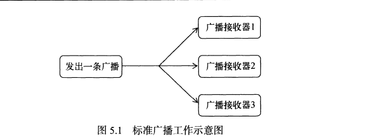
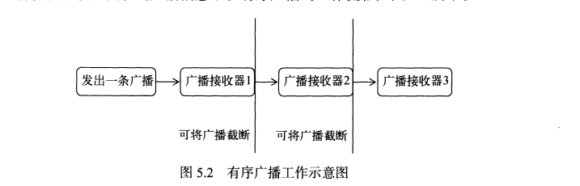
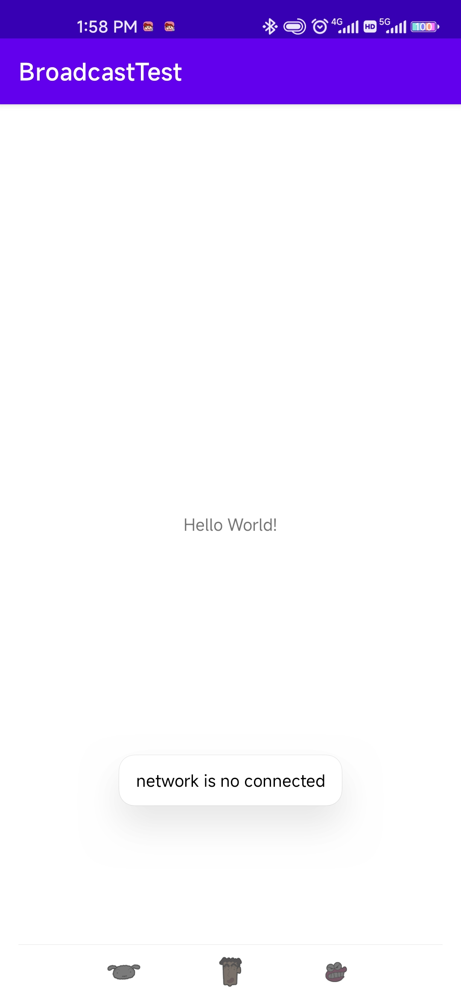
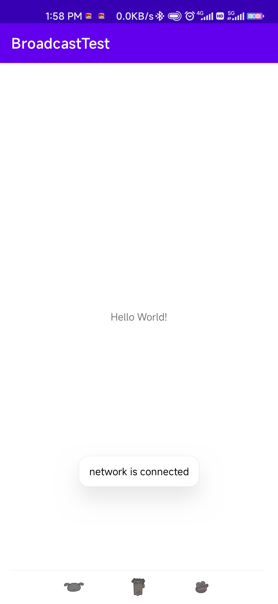
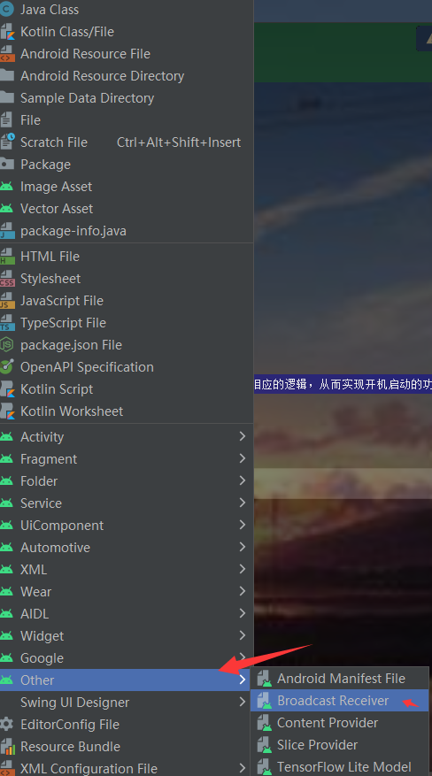

# 第5章 全局大喇叭——详解广播机制
&emsp;&emsp;记得上学的时候，每个班级的教室都会装有一个喇叭。这些喇叭都是接入到学校的广播室的，一旦以后什么重要通知，就会播放一条广播来告知全校师生。类似的工作机制其实在计算机领域也有非常广泛大的应用。了解网络通信原理的应该知道，在一个IP网络范围中，最大的IP地址是被保留作为广播地址来使用的。比如某个网络的IP地址范围是192.168.0.XXX，子网掩码是255.255.255.0。那么这个网络的广播地址就是192.168.0.255。广播数据包会被发送到统一网络上的所有端口，这样在该网络下的每台主机都会收到这个广播。为了便于进行系统级别的消息通知，Android也引入了一套类似于广播消息机制。

## 5.1 广播机制简介

&emsp;&emsp;为什么说Android中的广播机制更加灵活呢？这是因为Android中的每个应用程序都可以对自己感兴趣的广播进行注册，这样该程序就只会接收到自己所关心的广播内容，这些广播可能是来自系统的，也可能是来自于其他应用程序的。Android提供了一套完整的API，允许应用程序自由地发送和接收广播。发送广播的方法其实之前稍微提到过，就是借助学习过的Intent。而接收广播的方法则需要引入一个新的概念——广播接收器(Broadcast Receiver)。

广播主要可以分为两种类型：标准广播和有序广播。

- 标准广播(Normal broadcasts)是一种完全异步执行的广播，在广播发出之后，所有的广播接收器几乎都会在同一时刻接收到这条广播消息，因此它们之间没有任何先后顺序可言。这种广播的效率会比较高，但同时也意味着它是无法被截断的。标准广播的工作流程如图所示



- 有序广播(Ordered broadcasts)则是一种同步执行的广播，在广播发出之后，同一时刻只有一个广播接收器能够收到这条消息，当这个广播接收器中的逻辑执行完毕之后，广播才会继续传递。所以此时的广播接收器中的逻辑执行完毕后，广播才会继续传递。所以此时的广播接收器是有先后顺序的，优先级高的广播接收器就可以先收到广播消息，并且前面的广播接收器还可以截断正在传递的广播，这样后面的广播接收器就无法收到广播消息了。有序广播的工作流程如图所示：



## 5.2 接收系统广播

&emsp;&emsp;Android内置了很多系统级别的广播，我们可以在应用程序中通过监听这些广播来得到各种系统的状态信息。比如手机开机完成之后会发出一条广播，电池的电量变化会发出一条广播，时间或时区发生改变也会发出一条广播等等。如果想要接收这些广播，就需要使用广播接收器，下面是它的具体用法：

### 5.2.1 动态注册监听网络变化

&emsp;&emsp;广播接收器可以自由地对自己感兴趣的广播进行注册，这样当有相应的广播发出时，广播接收器就能收到这条广播，并在内部处理相应的逻辑。注册广播的方式一般有两种，在代码中注册和在AndroidManifest中注册，其中前者也被称为动态注册，后者被称为静态注册。那么该如何创建一个广播接收器呢？其实只需要新建一个类，让它继承自BroadcastReceiver，并重写父类的onReceiver()方法就可以了，当有广播到来时，onReceiver()方法就会得到执行，具体的逻辑就可以在这个方法中处理。那么先通过动态注册的方式编写一个能够监听网络变化的程序，借此学习一下广播接收器的基本用法。新建一个BroadcastTest项目，修改MainActivity中的代码

```java
package com.zj970.broadcasttest;

import android.content.BroadcastReceiver;
import android.content.Context;
import android.content.Intent;
import android.content.IntentFilter;
import android.widget.Toast;
import androidx.appcompat.app.AppCompatActivity;
import android.os.Bundle;

public class MainActivity extends AppCompatActivity {

    private IntentFilter intentFilter;
    private NetWorkChangeReceiver receiver;

    @Override
    protected void onCreate(Bundle savedInstanceState) {
        super.onCreate(savedInstanceState);
        setContentView(R.layout.activity_main);
        intentFilter = new IntentFilter();
        intentFilter.addAction("android.net.conn.CONNECTIVITY_CHANGE");//ConnectivityManager.CONNECTIVITY_ACTION
        receiver = new NetWorkChangeReceiver();
        registerReceiver(receiver,intentFilter);
    }

    @Override
    protected void onDestroy() {
        super.onDestroy();
        if (receiver != null){
            unregisterReceiver(receiver);
        }
    }

    class NetWorkChangeReceiver extends BroadcastReceiver{

        @Override
        public void onReceive(Context context, Intent intent) {
            Toast.makeText(context,"network changes",Toast.LENGTH_LONG).show();
        }
    }
}
```
&emsp;&emsp;可以看到，我们在MainActivity中定义了一个内部类NetWorkChangeReceiver，这个类是继承自BroadcastReceiver的，并重写了父类的onReceiver()方法。这样每当网络状态发生改变，onReceiver()方法就会得到执行，这里只是简单地使用了Toast提示了一段文本信息。然后观察onCreate()方法，首先我们创建了一个IntentFilter的实例，并给它添加了一个值为android.net.conn.CONNECTIVITY_CHANGE的action，为什么会要添加这个值呢？因为当网络状态发生变化的时候，系统正是发出一条值为android.net.conn.CONNECTIVITY_CHANGE的广播，也就是说我们的广播接收器想要监听什么广播，就在这里添加相应的action。接下来创建了一个NetworkChangeReceiver的实例，然后调用registerReceiver()方法进行注册，将NetworkChangeReceiver的实例和IntentFilter的实例都传入进去，这样NetworkChagneReceiver就会接收到所有值为android.net.conn.CONNECTIVITY_CHANGE的广播，也就实现了监听网络变化的功能。最后要记得，动态注册的广播一定要取消注册才行，这里我们是在onDestroy()方法中通过调用unregisterReceiver()方法来实现的。整体来说，代码还是非常简单的，运行一下程序。首先注册的完成的时候会收到一条广播，然后按下Home键回到主页（即销毁活动），接下来尝试关闭网络装填，就会发现有Toast提醒网络发生了变化。不过，只是提醒网络发生了改变还不够人性化，最好能准确地告诉用于当前是有网络还是没有，修改MainActivity中的代码：

```java
package com.zj970.broadcasttest;

import android.content.BroadcastReceiver;
import android.content.Context;
import android.content.Intent;
import android.content.IntentFilter;
import android.net.ConnectivityManager;
import android.net.Network;
import android.net.NetworkInfo;
import android.widget.Toast;
import androidx.appcompat.app.AppCompatActivity;
import android.os.Bundle;

public class MainActivity extends AppCompatActivity {

    private IntentFilter intentFilter;
    private NetWorkChangeReceiver receiver;

    @Override
    protected void onCreate(Bundle savedInstanceState) {
        super.onCreate(savedInstanceState);
        setContentView(R.layout.activity_main);
        intentFilter = new IntentFilter();
        intentFilter.addAction("android.net.conn.CONNECTIVITY_CHANGE");//ConnectivityManager.CONNECTIVITY_ACTION
        receiver = new NetWorkChangeReceiver();
        registerReceiver(receiver,intentFilter);
    }

    @Override
    protected void onDestroy() {
        super.onDestroy();
        if (receiver != null){
            unregisterReceiver(receiver);
        }
    }

    class NetWorkChangeReceiver extends BroadcastReceiver{

        @Override
        public void onReceive(Context context, Intent intent) {

            ConnectivityManager connectivityManager = (ConnectivityManager)getSystemService(Context.CONNECTIVITY_SERVICE);
            NetworkInfo networkInfo = connectivityManager.getActiveNetworkInfo();//这里要添加一个权限    <uses-permission android:name="android.permission.ACCESS_NETWORK_STATE"/>

            if (networkInfo != null && networkInfo.isConnected()){
                Toast.makeText(context,"network is connected",Toast.LENGTH_LONG).show();
            }
            else {
                Toast.makeText(context,"network is no connected",Toast.LENGTH_LONG).show();
            }
        }
    }
}
```

&emsp;&emsp;在onReceiver()方法中，首先通过getSystemService()方法得到了ConnectivityManager的实例，这是一个系统服务类，专门用于管理网络连接的。然后调用它的getActiveNetworkInfo()方法可以得到NetworkInfo的实例，接着调用NetWorkInfo的isConnected()方法，就可以判断当前是否有网络了，最后我们还是通过Toast的方式展示。另外，这里有非常重要的一点需要说明，Android系统为了保护用户设备的安全和隐私，做了严格的规定，如果程序需要进行一些对用户来说比较敏感的操作，就必须在配置文件中声明权限才可以，否则程序就会直接崩溃。比如这里访问系统的网络状态就是需要声明权限的。在AndroidManifest.xml文件加入android.permission.ACCESS_NETWORK_STATE

```xml
<?xml version="1.0" encoding="utf-8"?>
<manifest xmlns:android="http://schemas.android.com/apk/res/android"
          package="com.zj970.broadcasttest">

    <uses-permission android:name="android.permission.ACCESS_NETWORK_STATE"/>
    <application
            android:allowBackup="true"
            android:icon="@mipmap/ic_launcher"
            android:label="@string/app_name"
            android:roundIcon="@mipmap/ic_launcher_round"
            android:supportsRtl="true"
            android:theme="@style/Theme.BroadcastTest">
        <activity android:name=".MainActivity">
            <intent-filter>
                <action android:name="android.intent.action.MAIN"/>
                <category android:name="android.intent.category.LAUNCHER"/>
            </intent-filter>
        </activity>
    </application>

</manifest>
```

这是我们第一次遇到权限的问题，其实Android中许多操作都是需要声明权限才可以进行的，后面还会不断使用新的权限，目前这个访问系统的权限还是比较简单的，只需要在AndroidManifest.xml中声明一下就可以了，而Android6.0系统中引入了更加严格的运行时权限，从而能够更好地保证用户设备的安全和隐私。现在重新运行一下程序

- 禁用系统网络



- 启用系统网络



### 静态注册实现开机启动

&emsp;&emsp;动态注册的广播接收器可以自由地注册与注销，在灵活性方面有很大的优势，但是它也存在着一个缺点，即必须在程序启动之后才能接收到广播，因为注册的逻辑是写在onCreate()方法中的，那么有没有什么办法可以让程序在未启动的情况下就能接收到广播呢？这就需要使用静态注册的方式了。在这里我们准备让程序接收一条开机广播，当收到这条广播时就可以在onReceive()方法里执行相应的逻辑，从而实现开机启动的功能。



可以使用new->other->BroadcastReceiver快捷方式创建一个广播接收器，然后修改BootCompleteReceiver代码，其实就是新建类继承BroadcastReceiver然后在AndroidManifest.xml中注册。

```java
package com.zj970.broadcasttest;

import android.content.BroadcastReceiver;
import android.content.Context;
import android.content.Intent;
import android.widget.Toast;

public class BootCompleteReceiver extends BroadcastReceiver {

    @Override
    public void onReceive(Context context, Intent intent) {
        // TODO: This method is called when the BroadcastReceiver is receiving
        // an Intent broadcast.
        //throw new UnsupportedOperationException("Not yet implemented");
        Toast.makeText(context,"Boot Complete",Toast.LENGTH_LONG).show();
    }
}
```

代码非常简单，我们只是在onReceiver()方法中使用Toast弹出一段提示信息。另外，静态的广播接收器一定要AndroidManifest.xml文件中注册才可以使用，不过由于我们是使用Android Studio的快捷方式创建的广播接收器，因此注册这一步已经被自动完成了

```xml
<?xml version="1.0" encoding="utf-8"?>
<manifest xmlns:android="http://schemas.android.com/apk/res/android"
          package="com.zj970.broadcasttest">

    <uses-permission android:name="android.permission.ACCESS_NETWORK_STATE"/>

    <application
            android:allowBackup="true"
            android:icon="@mipmap/ic_launcher"
            android:label="@string/app_name"
            android:roundIcon="@mipmap/ic_launcher_round"
            android:supportsRtl="true"
            android:theme="@style/Theme.BroadcastTest">
        <receiver
                android:name=".BootCompleteReceiver"
                android:enabled="true"
                android:exported="true">
        </receiver>

        <activity android:name=".MainActivity">
            <intent-filter>
                <action android:name="android.intent.action.MAIN"/>

                <category android:name="android.intent.category.LAUNCHER"/>
            </intent-filter>
        </activity>
    </application>

</manifest>
```

可以看到，<application>标签内出现了一个新的标签<receiver>，所有静态的广播接收器都是在这里进行注册的。它的用法其实和<activity>标签非常相似，也是通过android:name来指定具体注册哪一个广播接收器，而enabled和exported属性则是根据我们刚才勾选的状态自动生成的。不过目前BootCompleteReceiver还是不能接收开机广播，我们还需要对AndroidManifest.xml文件进行修改才行，如下：

```xml
<?xml version="1.0" encoding="utf-8"?>
<manifest xmlns:android="http://schemas.android.com/apk/res/android"
          package="com.zj970.broadcasttest">

    <uses-permission android:name="android.permission.ACCESS_NETWORK_STATE"/>
    <user-permission android:name="android.permission.RECEIVE_BOOT_COMPLETED"/>
    <application
            android:allowBackup="true"
            android:icon="@mipmap/ic_launcher"
            android:label="@string/app_name"
            android:roundIcon="@mipmap/ic_launcher_round"
            android:supportsRtl="true"
            android:theme="@style/Theme.BroadcastTest">
        <receiver
                android:name=".BootCompleteReceiver"
                android:enabled="true"
                android:exported="true">
            <intent-filter>
                <action android:name="android.intent.action.BOOT_COMPLETED"/>
            </intent-filter>
        </receiver>

        <activity android:name=".MainActivity">
            <intent-filter>
                <action android:name="android.intent.action.MAIN"/>
                <category android:name="android.intent.category.LAUNCHER"/>
            </intent-filter>
        </activity>
    </application>
</manifest>
```
由于Android系统启动完成后会发出一条值为android.intent.action.BOOT_COMPLETED的广播，因此我们在<intent-filter>标签里添加了相应的action。另外，监听系统开机广播也是需要声明权限，可以看到，我们使用<uses-permission>标签又加入了一条android.permission.RECEIVE_BOOT_COMPLETED权限。效果图暂时没有。

&emps;&emsp;到现在为止，我们在广播接收器的onReceiver()方法中都只是简单地使用Toast提示一段文本信息，当真正在项目中使用到它的时候，就可以编写自己的逻辑。需要注意的是，不要在onReceiver()方法中添加过多的逻辑或者进行任何的耗时操作，因为在广播接收器中是不允许开启线程的，当onReceiver()方法中运行了较长时间而没有结束时，程序就会报错。因此，广播接收器更多的是扮演一种打开程序其他组件的角色，比如创建一条状态栏通知，或者启动一个服务等。

## 5.3 发送自定义广播

&emsp;&emsp;现在已经通过广播接收器来接收系统广播，接下来我们就要学习一下如何在应用程序中发送自定义的广播。前面有说到广播主要分为两种类型：标准广播和有序广播。

### 5.3.1 发送标准广播

&emsp;&emsp;在发送广播之前，我们还是需要先定义一个广播接收器来准备接收此广播才行，不然发出去也是白发。因此新建一个MyBroadcastReceiver，代码如下所示：

```java
package com.zj970.broadcasttest;

import android.content.BroadcastReceiver;
import android.content.Context;
import android.content.Intent;
import android.widget.Toast;

public class MyBroadcastReceiver extends BroadcastReceiver {

    @Override
    public void onReceive(Context context, Intent intent) {
        // TODO: This method is called when the BroadcastReceiver is receiving
        // an Intent broadcast.
        Toast.makeText(context,"received in MyBroadcastReceiver",Toast.LENGTH_LONG).show();
        throw new UnsupportedOperationException("Not yet implemented");
    }
}
```

这里当MyBroadcastReceiver收到自定义广播时，就会弹出 "received in MyBroadcastReceiver"的提示。然后在AndroidManifest.xml中对这个广播接收器进行修改

```xml
<?xml version="1.0" encoding="utf-8"?>
<manifest xmlns:android="http://schemas.android.com/apk/res/android"
          package="com.zj970.broadcasttest">

    <uses-permission android:name="android.permission.ACCESS_NETWORK_STATE"/>
    <uses-permission android:name="android.permission.RECEIVE_BOOT_COMPLETED"/>

    <application
            android:allowBackup="true"
            android:icon="@mipmap/ic_launcher"
            android:label="@string/app_name"
            android:roundIcon="@mipmap/ic_launcher_round"
            android:supportsRtl="true"
            android:theme="@style/Theme.BroadcastTest">
        <receiver
                android:name=".MyBroadcastReceiver"
                android:enabled="true"
                android:exported="true">
            <intent-filter>
                <action android:name="com.zj970.broadcasttest.MY_BROADCAST"/>
            </intent-filter>
        </receiver>
        <receiver
                android:name=".BootCompleteReceiver"
                android:enabled="true"
                android:exported="true">
            <intent-filter>
                <action android:name="android.intent.action.ACTION_SHUTDOWN"/>
                <action android:name="android.intent.action.BOOT_COMPLETED"/>
            </intent-filter>
        </receiver>

        <activity android:name=".MainActivity">
            <intent-filter>
                <action android:name="android.intent.action.MAIN"/>

                <category android:name="android.intent.category.LAUNCHER"/>
            </intent-filter>
        </activity>
    </application>

</manifest>
```
