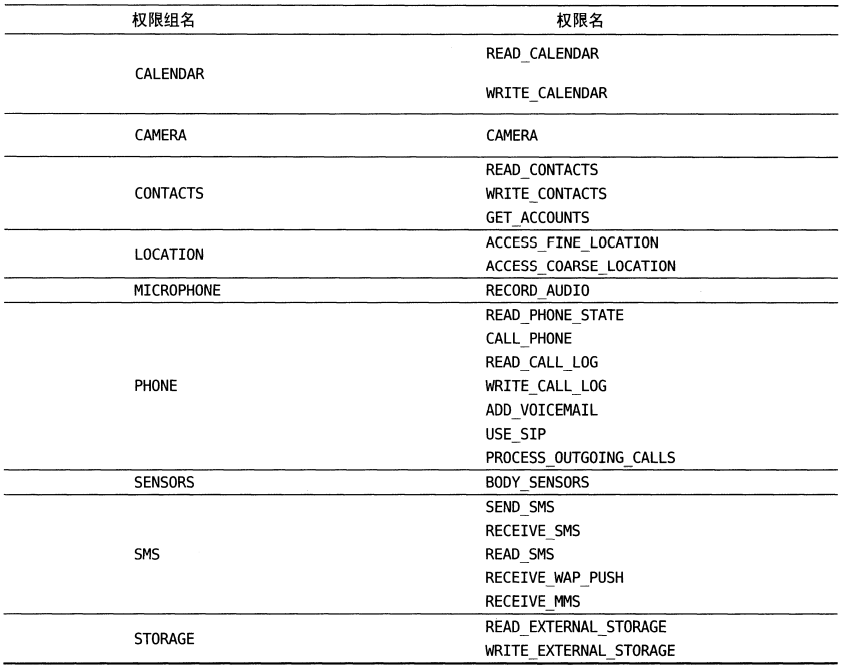
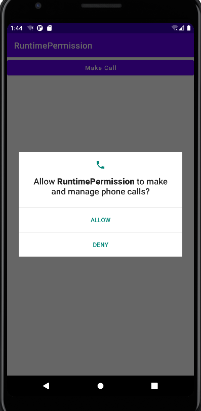
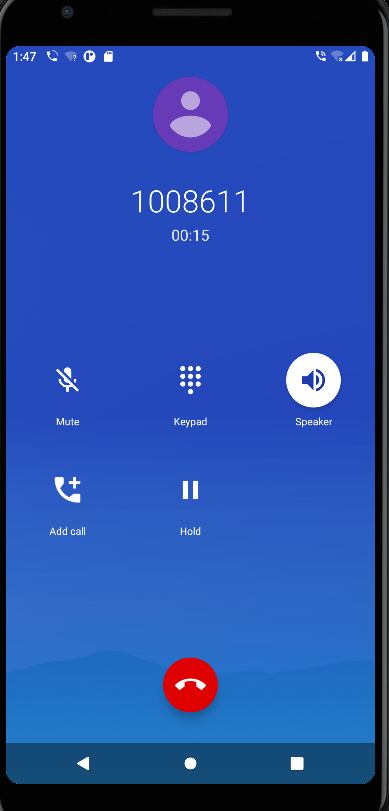
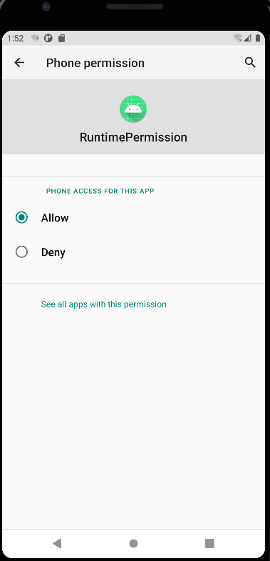
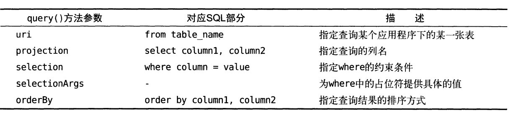
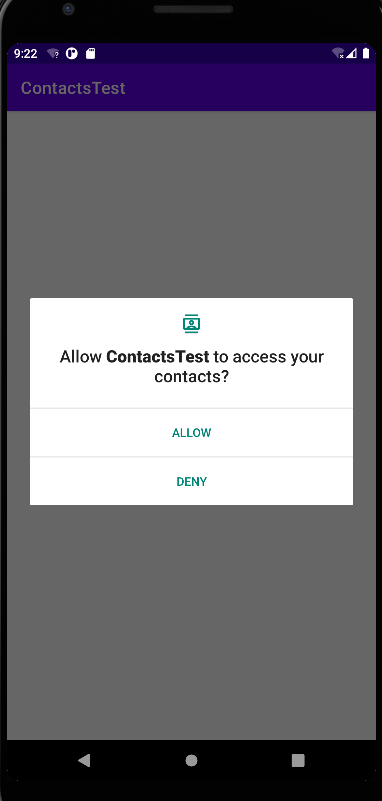
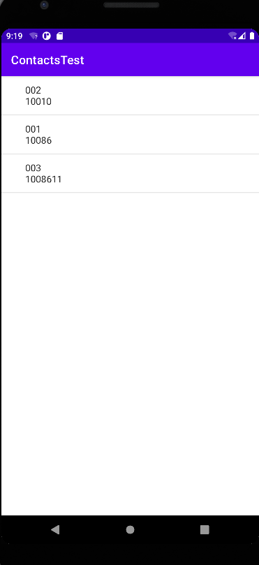

## 第七章 跨程序共享数据——探究内容提供器

&emsp;&emsp;在上一章的持久化技术所保存的数据都只能在当前应用程序中访问。虽然文件和SharedPreferences存储中提供了MODE_WORLD_READABLE和MODE_WORLD_WRITEABLE这两种操作模式，用于供给其他的应用程序访问当前应用的程序，但这两种模式在Android4.2版本种都已经废弃了。因为Android官方已经不在推荐使用这种方式来实现跨程序共享的功能，而是应该使用更加安全可靠的内容提供器技术。

&emsp;&emsp;可能你会有些疑惑，为什么将我们程序的数据共享给其他程序呢？当然，这个是要视情况而定的，比如说账户和密码这样的隐私数据显然是不能给其他应用程序的，不过一些可以让其他程序进行二次开发的基础数据，我们还是可以选择将其共享的。例如系统的电话薄程序，它的数据库中保存了很多的联系人信息。如果这些数据都不允许第三方的程序进行访问的话，恐怕很多应用的功能都要大打折扣。除了电话薄之外，还有短信、媒体库等程序都实现了跨程序数据共享的功能，而使用的技术当然就是内容提供器了。

### 7.1 内容提供器简介

&emsp;&emsp;内容提供器(Content Provider)主要用于在不同的应用程序之间实现数据共享的功能，它提供了一套完整的机制，允许一个程序访问另一个程序中的数据，同时还能保证被访问数据的安全性。目前，使用内容提供器是Android实现跨程序共享数据的标准方式。

&emsp;&emsp;不同于文件存储和SharedPreferences存储中的两种全局可读写操作模式，内容提供器可以选择只对那一部分数据进行共享，从而保证我们程序中的隐私数据不会有泄露的风险。

&emsp;&emsp;不过在正式学习内容提供器之前，我们需要先掌握另外一个非常重要的知识——Android运行时，因为待会的内容提供器示例中会使用到运行时权限。当然不光是内容提供器，以后我们的开发过程中也会经常使用到运行时权限，因此必须掌握它。

### 7.2 运行时权限

&emsp;&emsp;Android的权限机制并不是什么新鲜事物，从系统的第一个版本开始就已经存在了。但其实之前Android的权限机制在保护用户安全和隐私等方面起到的作用比较有限，尤其是大家都离不开的常用软件，非常容易“店大欺客”。为此，Android开发团队在Android 6.0 系统中引用了运行时权限这个功能，从而更好地保护了用户的安全和隐私，那么本节我们就来详细学习一下这个6.0系统中引入的新特性。

#### 7.2.1 Android权限机制详解

&emsp;&emsp;首先来回顾一下过去Android的权限机制是什么样的。我们在第5章些BroadcastTest项目的时候第一次接触了Android权限相关的内容，当时为了要访问系统的网络状态以及监听开机广播，于是在AndroidManifest.xml文件中添加了这样两句权限声明：

```
    <uses-permission android:name="android.permission.ACCESS_NETWORK_STATE"/>
    <uses-permission android:name="android.permission.RECEIVE_BOOT_COMPLETED"/>
```

&emsp;&emsp;因为访问系统的网络状态以及监听开机广播涉及了用户设备的安全性，因此必须在AndroidManifest.xml中加入权限声明后，否则我们的程序就会崩溃。那么问题来了，加入了这两句权限声明之后，对于用户来说到底有什么影响呢？为什么这样就可以保护用户设备的安全性了呢？其实用户主要在以下两个方面得到了保护，一方面，如果用户在低于6.0系统的设备上安装该程序，会在安装界面给出提醒。这样用户就可以清楚地知晓该程序一共申请了哪些权限，从而决定是否要安装这个程序。另一方面，用户可以随时在应用管理界面查看任意一个程序的权限申请情况。这样该程序申请的所有权限就尽收眼底，什么都瞒不过用户的眼睛，以此保证应用程序不会出现各种滥用权限的情况。这种权限机制的设计思路其实非常简单，就是用户如果认可你所申请的权限，那么就会安装你的程序，如果不认可你所申请的权限，那么拒绝安装就可以了。但是理想是美好的，现实却很残酷，因为很多我们所离不开的常用软件普遍存在着滥用权限的情况，不管到底用不用得到，反正先把权限申请了再说。  
&emsp;&emsp;Android开发团队也意识到了这个问题，于是在6.0系统中加入了运行时权限功能。也就是说，用户不需要在安装团建的时候一次性授权所有的申请权限，而是可以在软件的使用过程中再对某一权限申请进行授权。比如说一款相机应用在运行时申请了地理位置定位权限，就算我拒绝了这个权限，但是我应该仍然可以使用这个应用的其他功能，而不是像之前那样直接无法安装他们。  
&emsp;&emsp;当然，并不是所有权限都需要运行时申请，对于用户来说，不停地授权也很繁琐。Android现在将所有的权限归成两类，一类是普通权限，一类是危险权限。普通权限指的是那些不会直接威胁到用户的安全和隐私的权限，对于这部分权限申请，系统会自动帮我们进行授权，而不需要用户再去手动操作了，比如在BroadcastTest项目中申请的两个权限就是普通权限。危险权限则表示那些可能会触及用户隐私，或者对设备安全性造成影响的权限，如获取设备联系人信息，定位设备的地理位置等，对于这部分权限申请，必须由用户手动点击授权才可以，否则程序就无法使用相应的功能。  
&emsp;&emsp;但是Android中有一共有上百种权限，我们怎么从中区分那些是普通权限，哪些是危险权限呢？其实并没有那么难，因为危险权限总共就那么几个，除了危险权限之外，剩余的就是普通权限了。下表列出了Android中所有的危险权限，一共是9组24个权限。



&emsp;&emsp;这张表你看起来可能并不会那么轻松，因为里面的权限全都是你没使用过的。不过没有关系，你并不需要了解表格中每个权限的作用，只要把它当成一个参照表来查看就行了。每当要使用一个权限式，可以先从这张表中查一下，如果是属于这张表中的权限，那么就需要进行运行时权限处理，如果不在这张表中，那么只需要在AndroidManifest.xml中添加一下权限声明就可以了。另外注意一下，表格中每个危险权限都属于一个权限组，我们在进行运行时权限处理时使用的是权限名，但是用户一旦同意授权了，那么该权限所对应的权限组中所有的其他权限也会同时被授权。访问 http://developer.android.com/reference/android/Manifest.permisson.html 查看Android系统中完整的权限列表。

#### 7.2.2 在程序运行时申请权限

&emsp;&emsp;首先新建一个RuntimePermission项目，我们就在这个项目的基础上来学习运行时权限的使用方法。这里使用CALL_HOME这权限做示例。  
&emsp;&emsp;CALL_PHONE这个权限是编写拨打电话功能的时候需要声明的，因为拨打电话会涉及到用户手机资费的问题，因而被列为了危险权限。在Android 6.0 之前，拨打电话的功能实现非常简单，修改activity_main.xml布局文件：

```xml
<?xml version="1.0" encoding="utf-8"?>
<LinearLayout
        xmlns:android="http://schemas.android.com/apk/res/android"
        xmlns:tools="http://schemas.android.com/tools"
        android:layout_width="match_parent"
        android:layout_height="match_parent"
        tools:context=".MainActivity">
    <Button android:id="@+id/make_call"
            android:layout_width="match_parent"
            android:layout_height="wrap_content"
            android:text="Make Call"
            android:textAllCaps="false"/>

</LinearLayout>
```

我们在布局文件中只是定义了一个按钮，当点击按钮时就去触发拨打电话的逻辑。修改MainActivity.java

```java
package com.zj970.runtimepermission;

import android.content.Intent;
import android.net.Uri;
import android.view.View;
import android.widget.Button;
import android.widget.QuickContactBadge;
import androidx.appcompat.app.AppCompatActivity;
import android.os.Bundle;

public class MainActivity extends AppCompatActivity {

    @Override
    protected void onCreate(Bundle savedInstanceState) {
        super.onCreate(savedInstanceState);
        setContentView(R.layout.activity_main);
        Button makeCall = findViewById(R.id.make_call);
        makeCall.setOnClickListener(new View.OnClickListener() {
            @Override
            public void onClick(View v) {
                try {
                    Intent intent = new Intent(Intent.ACTION_CALL);
                    intent.setData(Uri.parse("tel:1008611"));
                    startActivity(intent);
                } catch (SecurityException e){
                    e.printStackTrace();
                }
            }
        });
    }
}
```
&emsp;&emsp;可以看到，在按钮的点击事件中，我们构建了一个隐式Intent,Intent的action指定为Intent.ACTION_CALL,这是一个系统内置的打电话的动作，然后在data部分指定了协议是tel,号码是10086。其实这部分的代码在2.3.3小节就已经见过了，只不过当时指定的action是Intent.ACTION_DIAL,表示打开拨号界面，这个是不需要声明权限的，而Intent.ACTION_CALL则是直接可以拨打电话，因此必须声明权限。另外为了防止程序崩溃，我们将所有的操作都放在了异常捕获代码块中。接下来修改AndroidManifest.xml文件，在其声明如下权限：

```xml
<?xml version="1.0" encoding="utf-8"?>
<manifest xmlns:android="http://schemas.android.com/apk/res/android"
          package="com.zj970.runtimepermission">
    <uses-permission android:name="android.permission.CALL_PHONE"/>
    <application
            android:allowBackup="true"
            android:icon="@mipmap/ic_launcher"
            android:label="@string/app_name"
            android:roundIcon="@mipmap/ic_launcher_round"
            android:supportsRtl="true"
            android:theme="@style/Theme.ConTentProviders">
        <activity android:name=".MainActivity">
            <intent-filter>
                <action android:name="android.intent.action.MAIN"/>

                <category android:name="android.intent.category.LAUNCHER"/>
            </intent-filter>
        </activity>
    </application>

</manifest>
```
这样我们就将拨打电话的功能实现了，并且低于Android 6.0 系统的手机是可以正常运行的，但是如果我们在6.0以上版本系统的手机上运行，点击Make Call按钮就没有任何效果，报错信息如下：

```
2022-10-10 09:20:26.452 3376-3376/com.zj970.runtimepermission W/System.err: java.lang.SecurityException: Permission Denial: starting Intent { act=android.intent.action.CALL dat=tel:xxxxxxx cmp=com.android.server.telecom/.components.UserCallActivity } from ProcessRecord{ec600dd 3376:com.zj970.runtimepermission/u0a121} (pid=3376, uid=10121) with revoked permission android.permission.CALL_PHONE
2022-10-10 09:20:26.452 392-748/? W/iorapd: Overwriting transition from kIntentStarted to kIntentStarted into kIntentFailed
2022-10-10 09:20:26.452 3376-3376/com.zj970.runtimepermission W/System.err:     at android.os.Parcel.createExceptionOrNull(Parcel.java:2373)
2022-10-10 09:20:26.452 3376-3376/com.zj970.runtimepermission W/System.err:     at android.os.Parcel.createException(Parcel.java:2357)
2022-10-10 09:20:26.452 3376-3376/com.zj970.runtimepermission W/System.err:     at android.os.Parcel.readException(Parcel.java:2340)
2022-10-10 09:20:26.452 3376-3376/com.zj970.runtimepermission W/System.err:     at android.os.Parcel.readException(Parcel.java:2282)
2022-10-10 09:20:26.453 3376-3376/com.zj970.runtimepermission W/System.err:     at android.app.IActivityTaskManager$Stub$Proxy.startActivity(IActivityTaskManager.java:3696)
2022-10-10 09:20:26.453 3376-3376/com.zj970.runtimepermission W/System.err:     at android.app.Instrumentation.execStartActivity(Instrumentation.java:1723)
2022-10-10 09:20:26.453 3376-3376/com.zj970.runtimepermission W/System.err:     at android.app.Activity.startActivityForResult(Activity.java:5314)
2022-10-10 09:20:26.453 3376-3376/com.zj970.runtimepermission W/System.err:     at androidx.fragment.app.FragmentActivity.startActivityForResult(FragmentActivity.java:676)
2022-10-10 09:20:26.453 3376-3376/com.zj970.runtimepermission W/System.err:     at android.app.Activity.startActivityForResult(Activity.java:5272)
2022-10-10 09:20:26.453 3376-3376/com.zj970.runtimepermission W/System.err:     at androidx.fragment.app.FragmentActivity.startActivityForResult(FragmentActivity.java:663)
2022-10-10 09:20:26.453 3376-3376/com.zj970.runtimepermission W/System.err:     at android.app.Activity.startActivity(Activity.java:5658)
2022-10-10 09:20:26.453 3376-3376/com.zj970.runtimepermission W/System.err:     at android.app.Activity.startActivity(Activity.java:5611)
2022-10-10 09:20:26.453 3376-3376/com.zj970.runtimepermission W/System.err:     at com.zj970.runtimepermission.MainActivity$1.onClick(MainActivity.java:24)
2022-10-10 09:20:26.453 3376-3376/com.zj970.runtimepermission W/System.err:     at android.view.View.performClick(View.java:7448)
2022-10-10 09:20:26.453 3376-3376/com.zj970.runtimepermission W/System.err:     at com.google.android.material.button.MaterialButton.performClick(MaterialButton.java:967)
2022-10-10 09:20:26.453 3376-3376/com.zj970.runtimepermission W/System.err:     at android.view.View.performClickInternal(View.java:7425)
2022-10-10 09:20:26.453 3376-3376/com.zj970.runtimepermission W/System.err:     at android.view.View.access$3600(View.java:810)
2022-10-10 09:20:26.453 3376-3376/com.zj970.runtimepermission W/System.err:     at android.view.View$PerformClick.run(View.java:28305)
2022-10-10 09:20:26.454 3376-3376/com.zj970.runtimepermission W/System.err:     at android.os.Handler.handleCallback(Handler.java:938)
2022-10-10 09:20:26.454 3376-3376/com.zj970.runtimepermission W/System.err:     at android.os.Handler.dispatchMessage(Handler.java:99)
2022-10-10 09:20:26.454 3376-3376/com.zj970.runtimepermission W/System.err:     at android.os.Looper.loop(Looper.java:223)
2022-10-10 09:20:26.454 3376-3376/com.zj970.runtimepermission W/System.err:     at android.app.ActivityThread.main(ActivityThread.java:7656)
2022-10-10 09:20:26.454 3376-3376/com.zj970.runtimepermission W/System.err:     at java.lang.reflect.Method.invoke(Native Method)
2022-10-10 09:20:26.454 3376-3376/com.zj970.runtimepermission W/System.err:     at com.android.internal.os.RuntimeInit$MethodAndArgsCaller.run(RuntimeInit.java:592)
2022-10-10 09:20:26.454 3376-3376/com.zj970.runtimepermission W/System.err:     at com.android.internal.os.ZygoteInit.main(ZygoteInit.java:947)
2022-10-10 09:20:26.454 3376-3376/com.zj970.runtimepermission W/System.err: Caused by: android.os.RemoteException: Remote stack trace:
2022-10-10 09:20:26.454 3376-3376/com.zj970.runtimepermission W/System.err:     at com.android.server.wm.ActivityStackSupervisor.checkStartAnyActivityPermission(ActivityStackSupervisor.java:1032)
2022-10-10 09:20:26.454 3376-3376/com.zj970.runtimepermission W/System.err:     at com.android.server.wm.ActivityStarter.executeRequest(ActivityStarter.java:999)
2022-10-10 09:20:26.454 3376-3376/com.zj970.runtimepermission W/System.err:     at com.android.server.wm.ActivityStarter.execute(ActivityStarter.java:669)
2022-10-10 09:20:26.454 3376-3376/com.zj970.runtimepermission W/System.err:     at com.android.server.wm.ActivityTaskManagerService.startActivityAsUser(ActivityTaskManagerService.java:1100)
2022-10-10 09:20:26.454 3376-3376/com.zj970.runtimepermission W/System.err:     at com.android.server.wm.ActivityTaskManagerService.startActivityAsUser(ActivityTaskManagerService.java:1072)
```
错误信息中提醒我们“Permission Denial”，可以看出，是由于权限禁止所导致的，因为6.0及以上的系统在使用危险权限时都必须进行运行时权限处理。下面修复这个问题，修改MainActivity中的代码：

```java
package com.zj970.runtimepermission;

import android.Manifest;
import android.content.Intent;
import android.content.pm.PackageManager;
import android.net.Uri;
import android.view.View;
import android.widget.Button;
import android.widget.QuickContactBadge;
import android.widget.Toast;
import androidx.annotation.NonNull;
import androidx.appcompat.app.AppCompatActivity;
import android.os.Bundle;
import androidx.core.app.ActivityCompat;
import androidx.core.content.ContextCompat;

public class MainActivity extends AppCompatActivity {

    @Override
    protected void onCreate(Bundle savedInstanceState) {
        super.onCreate(savedInstanceState);
        setContentView(R.layout.activity_main);
        Button makeCall = findViewById(R.id.make_call);
        makeCall.setOnClickListener(new View.OnClickListener() {
            @Override
            public void onClick(View v) {
/*                try {
                    Intent intent = new Intent(Intent.ACTION_CALL);
                    intent.setData(Uri.parse("tel:1008611"));
                    startActivity(intent);
                } catch (SecurityException e){
                    e.printStackTrace();
                }*/

                if (ContextCompat.checkSelfPermission(MainActivity.this, Manifest.permission.CALL_PHONE) != PackageManager.PERMISSION_GRANTED) {
                    ActivityCompat.requestPermissions(MainActivity.this, new String[]{Manifest.permission.CALL_PHONE}, 1);
                } else {
                    call();
                }
            }
        });
    }

    private void call() {
        try {
            Intent intent = new Intent(Intent.ACTION_CALL);
            intent.setData(Uri.parse("tel:1008611"));
            startActivity(intent);
        } catch (SecurityException e) {
            e.printStackTrace();
        }
    }

    @Override
    public void onRequestPermissionsResult(int requestCode, @NonNull String[] permissions, @NonNull int[] grantResults) {
        switch (requestCode){
            case 1:
                if (grantResults.length > 0 && grantResults[0] == PackageManager.PERMISSION_GRANTED){
                    call();
                } else {
                    Toast.makeText(this, "You denied the permission", Toast.LENGTH_SHORT).show();
                }
                break;
            default:
        }
    }
}
```
&emsp;&emsp;上面的代码将运行时权限的完整流程都覆盖了，运行时权限的核心就是在程序运行过程中由用户授权我们去执行某些危险操作，程序是不可以擅自做主去执行这些危险操作的。因此，第一步就是要先判断用户是不是已经给过我们授权了，借助的是ContextCompat.checkSelfPermission()方法。checkSelfPermission()方法接收两个参数，第一个参数是Context，第二个参数是具体的权限名，比如打电话的权限名就是Manifest.permission.CALL_PHONE，然后我们使用方法的返回值和PackageManager.PERMISSION_GRANTED做比较，相等就说明用户已经授权，不相等就表示用户没有授权。  
&emsp;&emsp;如果已经授权就直接去执行拨打电话的逻辑操作就可以了，这里我们把拨打电话的逻辑封装到了call()方法当中。如果没有授权的话，则需要调用ActivityCompat.requestPermissions()方法来向用户申请授权，requestPermissions()方法接收3个参数，第一参数要求是Activity的实例，第二个参数是一个String数组，我们把要申请的权限名放进数组即可，第三个参数是请求码，只要是唯一值就可以了，这里传入了1。  
&emsp;&emsp;调用完了requestPermissions()方法之后，系统会弹出一个权限申请的对话框，然后用户可以选择同意或者拒绝我们的权限申请，不论是哪种结果，最终都会回到onRequestPermissionsResult()方法中，而授权的结果会封装在grantResults参数中。这里我们只需要判断一下最后的授权结果，如果用户同意的话就调用call()方法来拨打电话，如果用户拒绝的话我们只能放弃操作，并且弹出一条失败提示。现在重新运行一下程序并点击Make Call按钮，由于用户还没有授权过我们拨打电话权限，因此第一次运行时弹出一个权限申请的对话框，用户可以选择同意或者拒绝。比如点击deny



就会弹出失败框，点击ALLOW之后进入拨打界面了



&emsp;&emsp;当之前用户已经完成了授权操作，之后在点击Make Call按钮就不会再弹出权限申请对话框了，而是可以直接拨打电话。用户随时都可以将授予的危险权限进行关闭。Settings->Apps->RuntimePermission->Permission。



---

### 7.3 访问其他应用程序中的数据

&emsp;&emsp;内容提供器的用法一般有两种，一种是使用现有的内容提供器来读取和操作应用程序中的数据，另外一种是创建自己的内容提供器给我们程序提供外部访问接口。接下来我们就一个一个开始学习，首先从使用现有的内容提供器开始。  
&emsp;&emsp;如果一个应用程序通过内容提供器对其数据提供了外部访问接口，那么任何其他的应用程序就都可以对这部分数据进行访问。Android系统中自带的电话薄、短信、媒体库等程序都提供了类似的访问接口，这就使得第三方应用程序可以充分地利用这部分数据来实现更好的功能。

#### 7.3.1 ContentResolver的基本用法

&emsp;&emsp;对于每一个应用程序来说，如果想要访问内容提供器中共享的数据，就一定要借助ContentResolver类，可以通过Context中的getContentResolver()方法获取到该类的实例。ContentResolver中提供了一系列的方法用于对数据进行CRUD操作，其中insert()方法是用于添加数据，update()方法用于更新数据，delete()方法用于删除数据，query()方法用于查询数据。SQLiteDatabase中也是使用这几个方法来进行CRUD操作的，只不过它们在方法参数上稍微有一些区别。不同于SQLiteDatabase,ContentResolver中的增删改查方法都是不接收表名参数的，而使用一个Uri参数替代，这个参数被称之为内容URI。内容URI给内容提供器中的数据建立了唯一标识符，它主要由两部分组成：authority和path。authority是用于对不同的应用程序做区分，一般为了避免冲突，都会采用程序包名的方式来进行命名。比如说某个程序的包名是com.example.app。那么该程序对应的authority就可以命名为com.example.app.provider。path则是用于对同一个应用程序中不同表做区分的，通常会添加到authority的后面。比如某个程序的数据库里面存在两张表：table1和table2，这时就可以将path分别命名为/table1和/table2，然后把authority和path进行组合，内容URI就变成了com.example.app.provider/table1和com.example.app.provider/table2。不过，目前还很难辨认出这两个字符串就是两个内容URI，我们还需要在字符串的头部加上协议声明。因此，内容URI最标准的格式写法如下：  
content://com.example.app.provider/table1  
content://com.example.app.provider/table2

&emsp;&emsp;内容URI可以非常清楚地表达出我们想要访问哪个程序中哪张表的数据。也正因此，ContentResolver中的增删改查方法才都接收Uri对象作为参数，因为如果使用表名的话，系统将无法得知我们期望的是哪个应用程序里面的表。在得到内容URI字符串之后，我们还需要将它解析成Uri对象才可以作为参数传入，解析的方法如下：  
> Uri uri = Uri.parse("content://com.example.app.provider/table1");

只需要调用Uri.parse()方法就可以将内容URI字符串解析成Uri对象了。现在我们可以使用这个Uri对象来查询table表中的数据了，代码如下所示：

```
Cursor cursor = getContentResolver().query(
    uri,
    projection,
    selection,
    selectionArgs,
    sortOrder);
```

&emsp;&emsp;这些参数和SQLiteDatabase中query()方法里的参数很像，但总体来说要简单一些，毕竟这是在访问其他程序中的数据，没必要构建过于复杂的查询语句。下表对使用到的这部分参数进行详细的解释：



&emsp;&emsp;查询完成后返回的仍然是一个Cursor对象，这时我们就可以将数据从Cursor对象中逐个读取出来。读取的方法仍然是通过移动游标的位置来遍历Currsor的所有行，然后再取出每一行中相应列的数据，代码如下所示：

```
if(cursor != null){
    while(cursor.moveToNext()){
        String column1 = cursor.getString(cursor.getColumnIndex("column1"));
        int column2 = cursor.getInt(cursor.getColumnIndex("column2"));
    }
    cursor.close();
}
```
向table1表中增加一条数据，代码如下：

```
ContentValues values = new ContentValues();
values.put("column1","text");
values.put("column2",1);
getContentResolver().insert(uri,values);
```
仍然是将待添加的数据组装到ContentValues中，然后调用ContentResolver的insert()方法，将uri和ContentValues作为参数传入即可。  
现在我们想要更新这条添加的数据，把column1的值清空，可以借助ContentResolver的update()方法实现，代码如下：

```
ContentValues values = new ContentValues();
values.put("column1","");
getContentResolver().update(uri,values,"column1 = ? and column2 = ? ",new String[]{"text","1"});
```
注意上述代码使用了selection和selectionArgs参数来对想要更新的数据进行约束，以防止所有的行都受到影响。最后，可以调用ContentResolver的delete()方法将这条数据删除掉，代码如下所示：

```
getContentResolver().delete(uri,"column2 = ?",new String[] {"1"});
```
&emsp;&emsp;到现在为止，我们就把ContentResolver中的增删改查方法全部学完了。我们接下来看看如何读取系统电话薄的联系人信息。

---

#### 7.3.2 读取系统联系人

&emsp;&emsp;先给模拟器增加联系人，然后新建ContactsTest项目,编写activity_main.xml中的代码，如下所示：

```xml
<?xml version="1.0" encoding="utf-8"?>
<LinearLayout
        xmlns:android="http://schemas.android.com/apk/res/android"
        xmlns:tools="http://schemas.android.com/tools"
        android:layout_width="match_parent"
        android:layout_height="match_parent"
        tools:context=".MainActivity">
    <ListView 
            android:id="@+id/contacts_view"
            android:layout_width="match_parent" 
            android:layout_height="match_parent"/>
</LinearLayout>
```

&emsp;&emsp;简单来说，LinearLayout里就只放置了一个ListView，这里使用ListView而不是RecyclerView，是因为我将要关注的重点放在读取系统联系人上面，如果使用RecyclerView的话，代码偏多，会容易让我们找不到重点，接着修改MainActivity,java中的代码：

```java
package com.zj970.contactstest;

import android.Manifest;
import android.content.pm.PackageManager;
import android.database.Cursor;
import android.provider.ContactsContract;
import android.widget.ArrayAdapter;
import android.widget.ListView;
import android.widget.Toast;
import androidx.annotation.NonNull;
import androidx.appcompat.app.AppCompatActivity;
import android.os.Bundle;
import androidx.core.app.ActivityCompat;
import androidx.core.content.ContextCompat;

import java.util.ArrayList;
import java.util.List;

public class MainActivity extends AppCompatActivity {
    ArrayAdapter<String> arrayAdapter;
    List<String> contactsList = new ArrayList<>();

    @Override
    protected void onCreate(Bundle savedInstanceState) {
        super.onCreate(savedInstanceState);
        setContentView(R.layout.activity_main);
        ListView contactsListView = findViewById(R.id.contacts_view);
        arrayAdapter = new ArrayAdapter<String>(this, android.R.layout.simple_expandable_list_item_1,contactsList);
        contactsListView.setAdapter(arrayAdapter);
        if (ContextCompat.checkSelfPermission(this, Manifest.permission.READ_CONTACTS)!= PackageManager.PERMISSION_GRANTED){
            ActivityCompat.requestPermissions(this,new String[]{
                    Manifest.permission.READ_CONTACTS
            },1);
        } else {
            readContacts();
        }
    }

    private void readContacts(){
        Cursor cursor = null;

        try {
            //查询联系人数据
            cursor = getContentResolver().query(ContactsContract.CommonDataKinds.Phone.CONTENT_URI,null,null,null,null);
            if (cursor != null){
                while (cursor.moveToNext()){
                    //获取联系人姓名
                    String displayName = cursor.getString(cursor.getColumnIndex(ContactsContract.CommonDataKinds.Phone.DISPLAY_NAME));
                    //获取联系人手机号
                    String number = cursor.getString(cursor.getColumnIndex(ContactsContract.CommonDataKinds.Phone.NUMBER));
                    contactsList.add(displayName+"\n"+number);
                }
                arrayAdapter.notifyDataSetChanged();
            }
        }catch (Exception e){
            e.printStackTrace();
        } finally {
            if (cursor!=null){
                cursor.close();
            }
        }
    }

    @Override
    public void onRequestPermissionsResult(int requestCode, @NonNull String[] permissions, @NonNull int[] grantResults) {
        switch (requestCode){
            case 1:
                if (grantResults.length >0 && grantResults[0] == PackageManager.PERMISSION_GRANTED){
                    readContacts();
                } else {
                    Toast.makeText(this, "You denied the permission", Toast.LENGTH_SHORT).show();
                }
                break;
            default:
        }
    }
}
```

&emsp;&emsp;在onCreate()方法中，我们首先获取了ListView控件的实例，并给它设置好了适配器，然后开始调用运行时权限的处理逻辑，因为READ_CONTACTS权限是属于危险权限的。关于运行时权限的处理流程相信你已经熟悉掌握了，这里我们在用户授权之后调用了readContacts()方法来读取系统联系人信息。  
&emsp;&emsp;下面重点看一下readContacts()方法，可以看到，这里使用了ContentResolver的query()方法来查询系统联系人数据。不过传入的Uri参数怎么有些奇怪啊？为什么没有调用Uri.parse()方法去解析一个内容URI字符串呢？这是因为ContactsContract.CommonDataKinds.Phone类已经帮我们做好了封装，提供了一个CONTENT_URI常量，而这个常量就是使用Uri.parse()方法解析出来的结果。接着我们对Cursor对象进行遍历，将联系人姓名和手机号这些数据逐个读出。联系人姓名这一列对应的常量是ContactsContract.CommonDataKinds.Phone.DISPLAY_NAME，联系人手机号这一列对应的常量是ContactsContract.CommonDataKinds.Phone.NUMBER。两个数据都取出之后，将它们进行拼接，并且在中间加上换行符，然后将拼接后的数据添加到ListView的数据源里，并通知刷新一下ListView。最后将Cursor对象关闭掉。最后在AndroidManifest.xml中添加读取系统联系人的权限：

>     <uses-permission android:name="android.permission.READ_CONTACTS"/>

运行效果如下：

1. 首先弹出申请联系人权限对话框，同意后：



2. 效果如下



