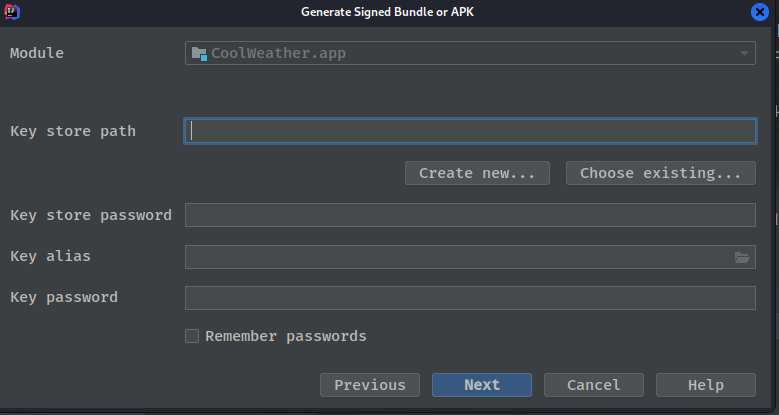

# 第14章 进入实战——开发酷欧天气

&emsp;&emsp;我们将要在本章中编写一个功能较为完整的天气预报程序，学习了这么就久的Android开发，现在终于到了考核验收的时候了。那么第一步我们需要给这个软件起个好听的名字，这里就叫它酷欧天气吧，英文名就叫做Cool Weather。确定好名字之后，下面就开始动手了。  

## 14.1 功能需求及技术可行性分析  
&emsp;&emsp;在开始编码之前，我们需要对程序进行需求分析，想一想酷欧天气中应该具备有哪些功能。将这些功能全部整理出来之后，我们才好动手去一一实现。这里我认为酷欧天气中至少应该具备以下功能：  
- 可以罗列出全国所有的省、市、县；
- 可以查看全国任意城市的天气信息；
- 可以自由地切换城市，去查看其他城市的天气；
- 提供手动刷新以及后台自动更新天气的功能。

&emsp;&emsp;虽然看上去只有4个主要的功能点，但如果想要全部实现这些功能却需要用到UI、网络、数据存储、服务等技术。因此还是非常考验你的综合应用能力的。不过好在这些技术在前面的章节中我们全部都学习过了，只要你学得用心，相信完成这些功能对于你来说并不难。  
&emsp;&emsp;分析完了需求之后，接下来就要进行技术可行性分析了。首先需要考虑的一个问题就是，我们如何才能得到全国省市县的数据信息，以及如何才能获取到每个城市的天气信息。比较遗憾的是，现在网上免费的天气预报接口已经越来越少，很多之前可以使用的接口都慢慢关闭掉了，包括本书第1版中使用的中国天气网的接口。因此，这次我也是特意用心去找了一些更加稳定的天气预报服务，比如彩云天气以及和风天气都非常不错。这两个天气预报服务虽说都是收费的，但它们每天都提供了一定次数的免费天气预报请求。那么简单起见，这里我们就使用和风天气来作为天气预报的数据来源，每天3000次的免费请求对于学习而言已经是相当充足了。  
&emsp;&emsp;解决了天气数据的问题，接下来还需要解决全国省市县数据的问题。同样，现在网上也没有一个稳定的接口可以使用，那么为了方便你的学习，我专门架设了一台服务器用于提供全国所有省市县的数据信息，从而帮你把道路都铺平了。  
&emsp;&emsp;那么下面我们来看一下这些接口的具体用法。比如想要罗列出中国所有的省份，只需要访问如下地址：  
> http://guolin.tech/api/china

&emsp;&emsp;服务器会返回我们一段JSON格式的数据，其中包含了中国所有省份名称以及省份id，如下所示：  
```json
[
  {
    "id": 1,
    "name": "北京"
  },
  {
    "id": 2,
    "name": "上海"
  },
  {
    "id": 3,
    "name": "天津"
  },
  {
    "id": 4,
    "name": "重庆"
  },
  {
    "id": 5,
    "name": "香港"
  },
  {
    "id": 6,
    "name": "澳门"
  },
  {
    "id": 7,
    "name": "台湾"
  },
  {
    "id": 8,
    "name": "黑龙江"
  },
  {
    "id": 9,
    "name": "吉林"
  },
  {
    "id": 10,
    "name": "辽宁"
  },
  {
    "id": 11,
    "name": "内蒙古"
  },
  {
    "id": 12,
    "name": "河北"
  },
  {
    "id": 13,
    "name": "河南"
  },
  {
    "id": 14,
    "name": "山西"
  },
  {
    "id": 15,
    "name": "山东"
  },
  {
    "id": 16,
    "name": "江苏"
  },
  {
    "id": 17,
    "name": "浙江"
  },
  {
    "id": 18,
    "name": "福建"
  },
  {
    "id": 19,
    "name": "江西"
  },
  {
    "id": 20,
    "name": "安徽"
  },
  {
    "id": 21,
    "name": "湖北"
  },
  {
    "id": 22,
    "name": "湖南"
  },
  {
    "id": 23,
    "name": "广东"
  },
  {
    "id": 24,
    "name": "广西"
  },
  {
    "id": 25,
    "name": "海南"
  },
  {
    "id": 26,
    "name": "贵州"
  },
  {
    "id": 27,
    "name": "云南"
  },
  {
    "id": 28,
    "name": "四川"
  },
  {
    "id": 29,
    "name": "西藏"
  },
  {
    "id": 30,
    "name": "陕西"
  },
  {
    "id": 31,
    "name": "宁夏"
  },
  {
    "id": 32,
    "name": "甘肃"
  },
  {
    "id": 33,
    "name": "青海"
  },
  {
    "id": 34,
    "name": "新疆"
  }
]
```
&emsp;&emsp;可以看到，这是一个JSON数组，数组中的每一个元素都代表着一个省份。其中，北京的id是1，上海的id是2。那么如何才能知道某个省内有哪些城市呢？其实也很简单，比如江苏的id是16，访问如下地址即可：  
> http://guolin.tech/api/china/16

&emsp;&emsp;也就是说，只需要将省份id添加到url地址的最后面就可以了，现在服务器返回的数据如下：  
```json
[
  {
    "id": 113,
    "name": "南京"
  },
  {
    "id": 114,
    "name": "无锡"
  },
  {
    "id": 115,
    "name": "镇江"
  },
  {
    "id": 116,
    "name": "苏州"
  },
  {
    "id": 117,
    "name": "南通"
  },
  {
    "id": 118,
    "name": "扬州"
  },
  {
    "id": 119,
    "name": "盐城"
  },
  {
    "id": 120,
    "name": "徐州"
  },
  {
    "id": 121,
    "name": "淮安"
  },
  {
    "id": 122,
    "name": "连云港"
  },
  {
    "id": 123,
    "name": "常州"
  },
  {
    "id": 124,
    "name": "泰州"
  },
  {
    "id": 125,
    "name": "宿迁"
  }
]
```
&emsp;&emsp;这样我们就得到江苏省内所有城市的信息了，可以看到，现在返回的数据格式和刚才查看省份信息时赶回的数据格式是一样的。相信此时你已经可以举一反三了，比如说苏州的id是116，那么想要知道苏州市下又有哪些县和区的时候，只需要访问如下地址：  
> http://guolin.tech/api/china/16/116

&emsp;&emsp;这次服务器返回的数据如下：

```json
[
  {
    "id": 937,
    "name": "苏州",
    "weather_id": "CN101190401"
  },
  {
    "id": 938,
    "name": "常熟",
    "weather_id": "CN101190402"
  },
  {
    "id": 939,
    "name": "张家港",
    "weather_id": "CN101190403"
  },
  {
    "id": 940,
    "name": "昆山",
    "weather_id": "CN101190404"
  },
  {
    "id": 941,
    "name": "吴中",
    "weather_id": "CN101190405"
  },
  {
    "id": 942,
    "name": "吴江",
    "weather_id": "CN101190407"
  },
  {
    "id": 943,
    "name": "太仓",
    "weather_id": "CN101190408"
  }
]
```
&emsp;&emsp;通过这种方式，我们就能把全国所有的省、市、县都罗列出来。那么解决了省市县数据的获取，我们又怎样才能查看到具体的天气信息呢？这就必须要用到每个地区对应的天气id了。观察上面返回的数据，你会发现每个县或区都会有一个weather_id，拿这个id再去访问对应的天气的接口，就能够获取到该地区具体的天气信息了。  
&emsp;&emsp;下面我们来看一下和风天气的接口该如何使用。首先你需要注册一个自己的账号，注册地址是http://guolin.tech/api/weather/register。注册好了之后使用这个账户登录，就能看到自己的API KEY，以及每天剩余的访问次数了。有了API KEY，再配合刚才的weather_id，我们就能获取到任意城市的天气信息了。比如说苏州的weather_id是CN101190401，那么访问如下接口即可查兰苏州的天气信息：  
> http://guolin.tech/api/weather?cityid=CN101190401&key=3906d8568ef8470d943c9765f5d891a8

&emsp;&emsp;返回的数据如下：

```json
{
  "HeWeather": [
    {
      "basic": {
        "cid": "CN101190401",
        "location": "苏州",
        "parent_city": "苏州",
        "admin_area": "江苏",
        "cnty": "中国",
        "lat": "26.07530212",
        "lon": "119.30623627",
        "tz": "+8.00",
        "city": "苏州",
        "id": "CN101190401",
        "update": {
          "loc": "2022-12-19 03:56",
          "utc": "2022-12-19 03:56"
        }
      },
      "update": {
        "loc": "2022-12-19 03:56",
        "utc": "2022-12-19 03:56"
      },
      "status": "ok",
      "now": {
        "cloud": "99",
        "cond_code": "104",
        "cond_txt": "阴",
        "fl": "16",
        "hum": "84",
        "pcpn": "0.0",
        "pres": "1012",
        "tmp": "17",
        "vis": "6",
        "wind_deg": "155",
        "wind_dir": "东南风",
        "wind_sc": "3",
        "wind_spd": "12",
        "cond": {
          "code": "104",
          "txt": "阴"
        }
      },
      "daily_forecast": [
        {
          "date": "2022-12-20",
          "cond": {
            "txt_d": "中雨"
          },
          "tmp": {
            "max": "20",
            "min": "15"
          }
        },
        {
          "date": "2022-12-21",
          "cond": {
            "txt_d": "多云"
          },
          "tmp": {
            "max": "27",
            "min": "14"
          }
        },
        {
          "date": "2022-12-22",
          "cond": {
            "txt_d": "阴"
          },
          "tmp": {
            "max": "17",
            "min": "10"
          }
        },
        {
          "date": "2022-12-23",
          "cond": {
            "txt_d": "阵雨"
          },
          "tmp": {
            "max": "25",
            "min": "15"
          }
        },
        {
          "date": "2022-12-24",
          "cond": {
            "txt_d": "多云"
          },
          "tmp": {
            "max": "27",
            "min": "14"
          }
        },
        {
          "date": "2022-12-25",
          "cond": {
            "txt_d": "阴"
          },
          "tmp": {
            "max": "28",
            "min": "10"
          }
        }
      ],
      "aqi": {
        "city": {
          "aqi": "59",
          "pm25": "32",
          "qlty": "良"
        }
      },
      "suggestion": {
        "comf": {
          "type": "comf",
          "brf": "舒适",
          "txt": "白天不太热也不太冷，风力不大，相信您在这样的天气条件下，应会感到比较清爽和舒适。"
        },
        "sport": {
          "type": "sport",
          "brf": "较不宜",
          "txt": "有较强降水，建议您选择在室内进行健身休闲运动。"
        },
        "cw": {
          "type": "cw",
          "brf": "不宜",
          "txt": "不宜洗车，未来24小时内有雨，如果在此期间洗车，雨水和路上的泥水可能会再次弄脏您的爱车。"
        }
      },
      "msg": "所有天气数据均为模拟数据，仅用作学习目的使用，请勿当作真实的天气预报软件来使用。"
    }
  ]
}
```

&emsp;&emsp;所有天气数据均为模拟数据，仅用作学习目的使用，请勿当作真实的天气预报软件来使用。返回数据的格式大体上就是这个样子，其中status代表请求的状态，ok表示成功。basic中包含城市的一些基本信息，aqi中会包含当前空气质量的情况，now中会包含当前的天气信息，suggestion中会包含一些天气相关的生活建议,daily_forecast中会包含未来几天的天气信息。访问http://guolin.tech/api/weather/doc这个网站可以查看更加详细的文档说明。  
&emsp;&emsp;数据都能获取到了之后，接下来就是JSON解析的工作了，这对于你来说应该很轻松了吧?确定了技术完全可行之后，接下来就可以开始编码了。至于将项目托管到github上这里就不赘述了。  

## 14.2 创建数据库和表  
&emsp;&emsp;从本节开始，我们就要真正地动手编码了，为了要让项目能够有更好的结构，这里需要在com.coolweather.android包下再新建几个包，如图所示：  


&emsp;&emsp;其中db包用于存放数据库模型相关的代码，gson包用于存放GSON模型相关的代码，service包用于存放服务相关的代码，util包用于存放工具相关的代码。  
&emsp;&emsp;根据14.1节进行的技术可行性分析，第一阶段我们要做的就是创建好数据库和表，这样从服务器获取到的数据才能存储到本地。关于数据库和表的创建方式，我们早在第6章中就已经学过了。那么为了简化数据库操作，这里我准备使用LitePal来管理酷欧天气的数据库。  
&emsp;&emsp;首先需要将项目所需要的各种依赖库进行声明，编辑app/build.gradle文件，在dependencies闭包中添加如下内容：

```groovy
dependencies {

    implementation 'androidx.appcompat:appcompat:1.5.1'
    implementation 'com.google.android.material:material:1.7.0'
    testImplementation 'junit:junit:4.+'
    androidTestImplementation 'androidx.test.ext:junit:1.1.4'
    androidTestImplementation 'androidx.test.espresso:espresso-core:3.5.0'
    //https://github.com/guolindev/LitePal
    implementation 'org.litepal.guolindev:core:3.2.3'
    // define a BOM and its version
    implementation(platform("com.squareup.okhttp3:okhttp-bom:4.10.0"))
    // define any required OkHttp artifacts without version
    implementation("com.squareup.okhttp3:okhttp")
    implementation("com.squareup.okhttp3:logging-interceptor")
    // https://mvnrepository.com/artifact/com.google.code.gson/gson
    implementation 'com.google.code.gson:gson:2.10'
    // https://mvnrepository.com/artifact/com.github.bumptech.glide/glide
    implementation 'com.github.bumptech.glide:glide:4.14.2'
    // https://mvnrepository.com/artifact/org.projectlombok/lombok
    compileOnly 'org.projectlombok:lombok:1.18.24'
}
```

&emsp;&emsp;这里声明的4个库我们之前都是使用过的，LitePal用于对数据库进行操作，OkHttp用于进行网络请求，GSON用于解析JSON数据，Glide用于加载和展示图片。酷欧天气将会对这几个库进行综合运用，这里直接一次性将它们都添加进来,lombok是一种java实用工具，可以帮助开发人员消除Java的冗长，尤其是对于简单的Java对象(POJO)。  
&emsp;&emsp;然后我们来设计一下数据库的表结构，表的设计当然是仁者见仁，智者见智，并不是说哪种设计就是最规范最完美的。这里我准备建立3张表：province、city、county，分别用于存放省、市、县的数据信息。对应到实体类中的话，就应该建立Province、City、County这3个类。那么，在db包下新建一个Province类，代码如下所示：  
```java
package com.coolweather.android.db;

import lombok.Getter;
import lombok.Setter;
import org.litepal.crud.LitePalSupport;

/**
 * <p>
 * 省份实体类
 * </p>
 *
 * @author: zj970
 * @date: 2022/12/19
 */
@Getter
@Setter
public class Province extends LitePalSupport {
    private int id;
    private String provinceName;
    private int provinceCode;
}
```
&emsp;&emsp;其中，id是每个实体类中应该有的字段，provinceName记录省的名字，provinceCode记录省的代号。另外，LitePal中的每一个实体类都是必须继承自LitePalSupport而不是DataSupport。接着在db下新建一个City类，代码如下所示:  
```java
package com.coolweather.android.db;

import lombok.Getter;
import lombok.Setter;

/**
 * <p>
 * 市实体类
 * </p>
 *
 * @author: zj970
 * @date: 2022/12/19
 */
@Setter
@Getter
public class City extends LitePalSupport {
    private int id;
    /**
     * 市的名字
     */
    private String cityName;
    /**
     * 市的代号
     */
    private int cityCode;
    /**
     * 当前市所属省份的id
     */
    private int provinceId;
}
```
&emsp;&emsp;其中，cityName记录市的名字，cityCode记录市的代号，provinceId记录当前市所属省的id值，然后在db包下新建一个County类，代码如下所示：  

```java
package com.coolweather.android.db;

import lombok.Getter;
import lombok.Setter;

/**
 * <p>
 * 城市实体类
 * </p>
 *
 * @author: zj970
 * @date: 2022/12/19
 */
@Getter
@Setter
public class County extends LitePalSupport {
    private int id;
    /**
     * 县名
     */
    private String countyName;
    /**
     * 县所对应的天气id
     */
    private String weatherId;
    /**
     * 当前县所属市的id值
     */
    private int cityId;
}

```
&emsp;&emsp;其中，countyName记录县的名字，weatherId记录县所对应的天气id，cityId记录当前县所属市的id值。可以看到，实体类的内容都非常简单，就是声明了一些需要的字段，并生成相应的getter和setter方法就可以了。  
&emsp;&emsp;接下来需要配置litepal.xml文件。创建一个assets目录，然后新建此文件，并编辑litepal.xml文件中的内容，如下所示：  

```xml
<?xml version="1.0" encoding="utf-8" ?>
<litepal>
    <dname value="cool_weather"></dname>
    <version value="1"></version>
    <list>
        <mapping class="com.coolweather.android.db.Province"/>
        <mapping class="com.coolweather.android.db.City"/>
        <mapping class="com.coolweather.android.db.County"/>
    </list>
</litepal>
```
&emsp;&emsp;这里我们将数据名指定成cool_weather，数据库版本指定成1，并将Province、City和County这3个实体类添加到映射列表当中。最后还需要配置一下LitePalApplication，这里使用自定义Application，代码如下所示：  
```java
package com.coolweather.android.base;

import android.app.Application;
import android.content.Context;
import org.litepal.LitePal;

/**
 * <p>
 *  全局获取Context
 * </p>
 *
 * @author: zj970
 * @date: 2022/12/19
 */
public class MyApplication extends Application {
    public static Context context;
    @Override
    public void onCreate() {
        super.onCreate();
        context = this;
        LitePal.initialize(this);
    }
}

```
&emsp;&emsp;最后还需要修改AndroidManifest.xml中的代码，如下所示：

```xml
<?xml version="1.0" encoding="utf-8"?>
<manifest xmlns:android="http://schemas.android.com/apk/res/android"
          package="com.coolweather.android">

    <application
            android:name="com.coolweather.android.base.MyApplication"
            android:allowBackup="true"
            android:label="@string/app_name"
            android:icon="@mipmap/ic_launcher"
            android:roundIcon="@mipmap/ic_launcher_round"
            android:supportsRtl="true"
            android:theme="@style/Theme.CoolWeather"/>

</manifest>
```
## 14.3 遍历全国省市县数据

&emsp;&emsp;在第阶段中，我们准备把遍历全国省市县的功能加入，这一阶段需要编写的代码量比较大。我们已经知道，全国所有省市县的数据都是从服务器端获取到的，因此这里和服务器的交互是必不可少的，所以我们可以在util包先增加一个HttpUtil类，代码如下所示：  
```java
package com.coolweather.android.util;

import okhttp3.OkHttpClient;
import okhttp3.Request;

/**
 * <p>
 * 网络工具类
 * </p>
 *
 * @author: zj970
 * @date: 2022/12/19
 */
public class HttpUtil {
    public static void sendOkHttpRequest(String address, okhttp3.Callback callback){
        OkHttpClient client = new OkHttpClient();
        Request request = new Request.Builder().url(address).build();
        client.newCall(request).enqueue(callback);
    }
}

```
&emsp;&emsp;由于OkHttp的出色封装，这里和服务器进行交互的代码非常简单，仅仅3行就完成了。现在我们发起一条HTTP请求只需要调用sendOkHttpRequest()方法，传入请求地址，并注册一个回调来处理服务器响应就可以了。  
&emsp;&emsp;另外，由于服务器返回的省市县数据都是JSON格式的，所有我们最好再提供一个工具来解析和处理这种数据。在util包下新建一个Utility类，代码如下所示：  
```java
package com.coolweather.android.util;

import android.text.TextUtils;
import com.coolweather.android.db.City;
import com.coolweather.android.db.County;
import com.coolweather.android.db.Province;
import org.json.JSONArray;
import org.json.JSONException;
import org.json.JSONObject;

/**
 * <p>
 * 处理数据
 * </p>
 *
 * @author: zj970
 * @date: 2022/12/19
 */
public class Utility {
    /**
     * 解析和处理服务器返回的省级数据
     * @param response 请求返回体
     * @return
     */
    public static boolean handleProvinceResponse(String response) {
        if (!TextUtils.isEmpty(response)){
            try {
                JSONArray allProvinces = new JSONArray(response);
                for (int i = 0; i < allProvinces.length(); i++) {
                    JSONObject provinceObject = allProvinces.getJSONObject(i);
                    Province province = new Province();
                    province.setProvinceName(provinceObject.getString("name"));
                    province.setProvinceCode(provinceObject.getInt("id"));
                    province.save();
                }
                return true;
            } catch (JSONException e){
                e.printStackTrace();
            }
        }
        return false;
    }

    /**
     * 解析和处理服务器返回的市级数据
     * @param response 请求返回体
     * @param provinceId 省级id
     * @return
     */
    public static boolean handleCityResponse(String response, int provinceId){
        if (!TextUtils.isEmpty(response)) {
            try {
                JSONArray allCities = new JSONArray(response);
                for (int i = 0; i < allCities.length(); i++) {
                    JSONObject cityObject = allCities.getJSONObject(i);
                    City city = new City();
                    city.setCityName(cityObject.getString("name"));
                    city.setCityCode(cityObject.getInt("id"));
                    city.setProvinceId(provinceId);
                    city.save();
                }
                return true;
            } catch (JSONException e){
                e.printStackTrace();
            }

        }
        return false;
    }

    /**
     * 解析和处理服务器返回的县级数据
     * @param response 请求返回体
     * @param cityId 市id
     * @return
     */
    public static boolean handleCountyResponse(String response, int cityId){
        if (!TextUtils.isEmpty(response)) {
            try {
                JSONArray allCounties = new JSONArray(response);
                for (int i = 0; i < allCounties.length(); i++) {
                    JSONObject countyObject = allCounties.getJSONObject(i);
                    County county = new County();
                    county.setCountyName(countyObject.getString("name"));
                    county.setWeatherId(countyObject.getString("weather_id"));
                    county.setCityId(cityId);
                    county.save();
                }
                return true;
            } catch (JSONException e){
                e.printStackTrace();
            }
        }
        return false;
    }
}

```

&emsp;&emsp;可以看到，我们提供了handleProvinceResponse()、handleCityResponse()和handleCountyResponse()这3个方法，分别用于解析和处理服务器返回的省级、市级和县级数据。处理的方式都是类似的，先使用JSONArray和JSONObject将数据解析出来，然后组装成实体类对象，再调用save()方法将数据存储到数据库当中。由于这里的JSON数据结构比较简单，我们就不使用GSON来进行解析了。  
&emsp;&emsp;需要准备的工具类就这么多，现在可以开始写界面了。由于遍历全国省市县的功能我们在后面还会复用，因此不写在活动里面，而是写在碎片里面。这样复用的时候直接在布局里面引用碎片就可以了。在res/layout目录中新建choose_area.xml布局，代码如下所示：  
```xml
<?xml version="1.0" encoding="utf-8"?>
<LinearLayout xmlns:android="http://schemas.android.com/apk/res/android"
              android:orientation="vertical"
              android:background="#fff"
              android:layout_width="match_parent"
              android:layout_height="match_parent">
    <RelativeLayout
        android:layout_width="match_parent"
        android:layout_height="?android:attr/actionBarSize"
        android:background="?android:attr/colorPrimary">
        <TextView
            android:id="@+id/title_text"
            android:layout_width="wrap_content"
            android:layout_height="wrap_content"
            android:layout_centerInParent="true"
            android:textColor="#fff"
            android:textSize="20sp"/>
        <Button
            android:id="@+id/back_button"
            android:layout_width="25dp"
            android:layout_height="25dp"
            android:layout_marginLeft="10dp"
            android:layout_alignParentLeft="true"
            android:background="@drawable/ic_back"/>
    </RelativeLayout>
    <ListView
        android:id="@+id/list_view"
        android:layout_width="match_parent"
        android:layout_height="match_parent"/>
</LinearLayout>
```

&emsp;&emsp;布局文件的内容并不复杂，我们先是定义了一个头布局来作为标题栏，将布局高度设置为actionBar的高度，背景色设置为colorPrimary。然后在头布局中放置了一个TextView用于显示标题内容放置了Button用于执行返回操作。这里之所以要自己定义标题栏，是因为碎片中最好不要直接使用ActionBar或Toolbar，不然在复用的时候可能会出现一些你不想看到的效果。  
&emsp;&emsp;接下来在头布局的下面定义了一个ListView，省市县的数据就将显示在这里。之所以这次使用了ListView，是因为它会自动给每个子项之间添加一条分割线，而如果使用RecyclerView想实现同样的功能则会比较麻烦，这里我们总是选择最优的实现方案。接下来也是最关键的一步，我们需要编写用于遍历省市县数据的碎片了。新建ChooseAreaFragment继承自Fragment，代码如下所示：  
```java
package com.coolweather.android;

import android.app.ProgressDialog;
import android.os.Bundle;
import android.view.LayoutInflater;
import android.view.View;
import android.view.ViewGroup;
import android.widget.*;
import androidx.annotation.NonNull;
import androidx.annotation.Nullable;
import androidx.fragment.app.Fragment;
import com.coolweather.android.db.City;
import com.coolweather.android.db.County;
import com.coolweather.android.db.Province;
import com.coolweather.android.util.HttpUtil;
import com.coolweather.android.util.Utility;
import okhttp3.Call;
import okhttp3.Callback;
import okhttp3.Response;
import org.jetbrains.annotations.NotNull;
import org.litepal.LitePal;

import java.io.IOException;
import java.util.ArrayList;
import java.util.List;

/**
 * <p>
 *
 * </p>
 *
 * @author: zj970
 * @date: 2022/12/19
 */
public class ChooseAreaFragment extends Fragment {
    public static final int LEVEL_PROVINCE = 0;
    public static final int LEVEL_CITY = 1;
    public static final int LEVEL_COUNTY = 2;
    private TextView titleText;
    private Button backButton;
    private ListView listView;
    private ArrayAdapter<String> adapter;
    private List<String> dataList = new ArrayList<String>();
    private static final String URL = "http://guolin.tech/api/china";
    private ProgressDialog progressDialog;
    /**
     * 省列表
     */
    private List<Province> provinceList;
    /**
     * 市列表
     */
    private List<City> cityList;
    /**
     * 县列表
     */
    private List<County> countyList;

    /**
     * 选中的省份
     */
    private Province selectedProvince = null;
    /**
     * 选中的城市
     */
    private City selectedCity = null;
    /**
     * 选中的级别
     */
    private int currentLevel;

    @Nullable
    @org.jetbrains.annotations.Nullable
    @Override
    public View onCreateView(@NonNull @NotNull LayoutInflater inflater, @Nullable @org.jetbrains.annotations.Nullable ViewGroup container, @Nullable @org.jetbrains.annotations.Nullable Bundle savedInstanceState) {
        View view = inflater.inflate(R.layout.choose_area, container, false);
        titleText = view.findViewById(R.id.title_text);
        backButton = view.findViewById(R.id.back_button);
        listView = view.findViewById(R.id.list_view);
        adapter = new ArrayAdapter<>(getContext(), android.R.layout.simple_list_item_1, dataList);
        listView.setAdapter(adapter);
        return view;
    }

    @Override
    public void onCreate(@Nullable @org.jetbrains.annotations.Nullable Bundle savedInstanceState) {
        super.onCreate(savedInstanceState);
        listView.setOnItemClickListener(new AdapterView.OnItemClickListener() {
            @Override
            public void onItemClick(AdapterView<?> parent, View view, int position, long id) {
                if (currentLevel == LEVEL_PROVINCE) {
                    selectedProvince = provinceList.get(position);
                    queryCities();
                } else if (currentLevel == LEVEL_CITY) {
                    selectedCity = cityList.get(position);
                    queryCounties();
                }
            }
        });
        backButton.setOnClickListener(new View.OnClickListener() {
            @Override
            public void onClick(View v) {
                if (currentLevel == LEVEL_COUNTY) {
                    queryCities();
                } else if (currentLevel == LEVEL_CITY) {
                    queryProvinces();
                }
            }
        });
        queryProvinces();
    }

    /**
     * 查询全国所有的省，优先从数据库查询，如果没有查询到再去服务器上查询
     */
    private void queryProvinces() {
        titleText.setText("中国");
        backButton.setVisibility(View.GONE);
        provinceList = LitePal.findAll(Province.class);
        if (provinceList.size() > 0) {
            dataList.clear();
            for (Province province : provinceList) {
                dataList.add(province.getProvinceName());
            }
            adapter.notifyDataSetChanged();
            listView.setSelection(0);
            currentLevel = LEVEL_PROVINCE;
        } else {
            String address = URL;
            queryFromServer(address, "province");
        }
    }

    /**
     * 查询选中省内所有的市，优先从数据库查询，，如果没有查询到再去服务器上查询
     */
    private void queryCities() {
        titleText.setText(selectedProvince.getProvinceName());
        backButton.setVisibility(View.VISIBLE);
        cityList = LitePal.where("provinceid = ?", String.valueOf(selectedProvince.getId())).find(City.class);

        if (cityList.size() > 0) {
            dataList.clear();
            for (City city : cityList) {
                dataList.add(city.getCityName());
            }
            adapter.notifyDataSetChanged();
            listView.setSelection(0);
            currentLevel = LEVEL_CITY;
        } else {
            int provinceCode = selectedProvince.getProvinceCode();
            String address = URL + "/" + provinceCode;
            queryFromServer(address, "city");
        }
    }

    /**
     * 查询选中市内所有县，优先从数据库查询，如果没有查询到再去服务器上查询
     */
    private void queryCounties() {
        titleText.setText(selectedCity.getCityName());
        backButton.setVisibility(View.VISIBLE);
        countyList = LitePal.where("cityid = ?", String.valueOf(selectedCity.getId())).find(County.class);
        if (countyList.size() > 0) {
            dataList.clear();
            for (County county : countyList) {
                dataList.add(county.getCountyName());
            }
            adapter.notifyDataSetChanged();
            listView.setSelection(0);
            currentLevel = LEVEL_COUNTY;
        } else {
            int provinceCode = selectedProvince.getProvinceCode();
            int cityCode = selectedCity.getCityCode();
            String address = URL + "/" + provinceCode + "/" + cityCode;
            queryFromServer(address, "county");
        }
    }

    /**
     * 根据传入的地址和类型从服务器上查询省市县数据
     */
    private void queryFromServer(String address, final String type){
        showProgressDialog();
        HttpUtil.sendOkHttpRequest(address, new Callback() {
            @Override
            public void onFailure(@NotNull Call call, @NotNull IOException e) {
                //通过runOnUiThread()方法回到主线程处理逻辑
                getActivity().runOnUiThread(new Runnable() {
                    @Override
                    public void run() {
                        closeProgressDialog();
                        Toast.makeText(getActivity(), "加载失败",Toast.LENGTH_LONG).show();
                    }
                });
            }

            @Override
            public void onResponse(@NotNull Call call, @NotNull Response response) throws IOException {
                String responseText = response.body().string();
                boolean result = false;
                if ("province".equals(type)) {
                    result = Utility.handleProvinceResponse(responseText);
                } else if ("city".equals(type)){
                    result = Utility.handleCityResponse(responseText,selectedProvince.getId());
                } else if ("county".equals(type)){
                    result = Utility.handleCountyResponse(responseText,selectedCity.getId());
                }

                if (result){
                    getActivity().runOnUiThread(new Runnable() {
                        @Override
                        public void run() {
                            closeProgressDialog();
                            if("province".equals(type)){
                                queryProvinces();
                            } else if("city".equals(type)){
                                queryCities();
                            } else if("county".equals(type)){
                                queryCounties();
                            }
                        }
                    });
                }
            }
        });
    }

    /**
     * 显示进度对话框
     */
    private void showProgressDialog(){
        if (progressDialog != null){
            progressDialog = new ProgressDialog(getContext());
            progressDialog.setMessage("正在加载...");
            progressDialog.setCanceledOnTouchOutside(false);
        }
        progressDialog.show();
    }

    /**
     * 关闭进度对话框
     */
    private void closeProgressDialog(){
        if (progressDialog!= null){
            progressDialog.dismiss();
        }
    }
}

```

&emsp;&emsp;这个类里的代码虽然非常多，可是逻辑却不复杂，我们来慢慢理一下。在onCreate()方法中先是获取到了一些控件的实例，然后去初始化了ArrayAdapter，并将它设置为ListView的适配器。接着在onActivityCreated()方法中给ListView和Button设置了点击事件，到这里我们的初始化工作就算是完成了。  
&emsp;&emsp;在onCreated()方法的最后，调用了queryProvinces()方法，也就是从这里开始加载省级数据。queryProvinces()方法首先会将有布局的标题设置成中国，将返回的按钮隐藏起来，因为省级列表已经不能再返回了。然后调用LitePal的查询接口来从数据库中读取省级数据，如果读取到了就直接将数据显示到界面上，如果没有读取到就按照14.1节讲述的接口组装出一个请求地址，然后调用queryFromServer()方法来从服务器上查询数据。  
&emsp;&emsp;queryFromServer()方法中会调用HttpUtil的sendOkHttpRequest()方法来向服务器发送请求，响应的数据会回调到onResponse()方法中，然后我们在这里去调用Utility的handleProvinceResponse()方法来解析和处理服务器返回的数据，并存储到数据库中。接下来的一步很关键，在解析和处理完数据之后，我们再次调用了queryProvinces()方法重新加载省级数据，由于queryProvinces()方法牵扯到了UI操作，因此必须要在主线程中调用，这里借助了runOnUiThread()方法来实现从子线程切回主线程。现在数据库中已经存在了数据，因此调用queryProvinces()就会直接将数据显示到界面上。  
&emsp;&emsp;当你点击了某个省份的时候会进入到ListView的onItemClick()方法中，这个时候会根据当前的级别来判断是去调用queryCities()方法还是queryCounties()方法，queryCities()方法是去查询市级数据，而queryCounties()方法是去查询县级数据，这两个方法内部的流程和queryProvinces()方法基本相同，这里就不重复讲解了。  
&emsp;&emsp;另外还有一点需要注意，在返回按钮的点击事件里，会对当前ListView的列表级别进行判断。如果当前是县级列表，那么就返回市级列表，如果当前是市级列表，那么就返回到省级列表。当返回到省级列表时，返回按钮会自动隐藏，从而也就不需要再进一步的处理了。  
&emsp;&emsp;这样我们就把遍历全国省市县的功能完成了，可是碎片是不能直接显示到界面上，因此我们还需要把它添加活动里面才行。修改activity_main.xml中的代码，如下所示：  
```xml
<?xml version="1.0" encoding="utf-8"?>
<FrameLayout
        xmlns:android="http://schemas.android.com/apk/res/android"
        xmlns:tools="http://schemas.android.com/tools"
        xmlns:app="http://schemas.android.com/apk/res-auto"
        android:layout_width="match_parent"
        android:layout_height="match_parent"
        tools:context=".MainActivity">
    <fragment
        android:id="@+id/chose_area_fragment"
        android:name="com.coolweather.android.ChooseAreaFragment"
        android:layout_width="match_parent"
        android:layout_height="match_parent"/>

</FrameLayout>
```

&emsp;&emsp;布局文件很简单，只是定义了一个FrameLayout，然后将ChooseAreaFragment添加进来，并让它充满整个布局。另外，我们刚才在碎片的布局里面已经自定义了一个标题栏，因此就不再需要原生的ActionBar了，修改res/values/theme.xml中的代码，如下所示：  

```xml
<resources xmlns:tools="http://schemas.android.com/tools">
    <!-- Base application theme. -->
    <style name="Theme.CoolWeather" parent="Theme.MaterialComponents.DayNight.NoActionBar">
        <!-- Primary brand color. -->
        <item name="colorPrimary">@color/purple_500</item>
        <item name="colorPrimaryVariant">@color/purple_700</item>
        <item name="colorOnPrimary">@color/white</item>
        <!-- Secondary brand color. -->
        <item name="colorSecondary">@color/teal_200</item>
        <item name="colorSecondaryVariant">@color/teal_700</item>
        <item name="colorOnSecondary">@color/black</item>
        <!-- Status bar color. -->
        <item name="android:statusBarColor" tools:targetApi="l">?attr/colorPrimaryVariant</item>
        <!-- Customize your theme here. -->
    </style>
</resources>
```

&emsp;&emsp;现在第二阶段的开发工作也完成得差不多了，我们可以运行一下运行看一看效果。在运行一下之前加入声明程序所需的权限。运行效果如下：  

- 省份显示图


- 市级显示图(江苏省)


- 县级显示图(苏州市)


## 14.4 显示天气信息  
&emsp;&emsp;第三阶段中，我们就要开始去查询天气，并且把天气信息显示出来了。由于和风天气返回的JSON数据结构非常复杂，如果还使用JSONObject来解析就会很麻烦，这里我们就准备借助GSON对天气信息进行解析了。  
### 14.4.1 定义GSON实体类  
&emsp;&emsp;GSON的用法很简单，解析数据只需要一行代码就能完成了，但前提是要先将数据对应的实体类创建好。由于和风天气返回的数据内容非常多，这里我们不可能将所有的内容都利用起来，因此我刷选了一些比较重要的数据进行解析。首先回顾一下返回数据的大致格式：  
```json
{
  "HeWeather": [
    {
      "status": "ok",
      "basic": {},
      "aqi": {},
      "now": {},
      "suggestion": {},
      "daily_forecast": []
    }
  ]
}

```
&emsp;&emsp;其中,basic、aqi、now、suggestion和daily_forecast的内部又都会有具体的内容，那么我们就可以将这5个部分定义成5个实体类。下面开始一个一个看，basic中的具体内容如下所示：  
```
"basic": {
        "cid": "CN101190401",
        "location": "苏州",
        "parent_city": "苏州",
        "admin_area": "江苏",
        "cnty": "中国",
        "lat": "26.07530212",
        "lon": "119.30623627",
        "tz": "+8.00",
        "city": "苏州",
        "id": "CN101190401",
        "update": {
          "loc": "2022-12-19 03:56",
          "utc": "2022-12-19 03:56"
        }
```
&emsp;&emsp;其中部分属性city表示城市名，id表示城市对应的天气id，update中的loc表示天气的更新时间。我们按照此结构就可以在gson包下新建一个Basic类，代码如下所示：  
```java
package com.coolweather.android.gson;

import com.google.gson.annotations.SerializedName;

import java.io.Serializable;

/**
 * <p>
 *
 * </p>
 *
 * @author: zj970
 * @date: 2022/12/20
 */
public class Basic implements Serializable {
    @SerializedName("city")
    public String cityName;
    @SerializedName("id")
    public String weatherId;

    public Update update;

    public class Update implements Serializable {
        @SerializedName("loc")
        public String updateTime;
    }

}

```
&emsp;&emsp;由于JSON中的一些字段可能不太适合直接作为Java字段来命名，因此这里使用了@SerializedName注解的方式来让JSON字段和Java字段之间建立映射关系。这样我们就将Basic类定义好了，还是挺容易理解的？其余几个实体类也是类似的，我们使用同样的方式来定义就可以了。如下所示：  
&emsp;&emsp;AQI类代码如下所示：  
```java
package com.coolweather.android.gson;

import java.io.Serializable;

/**
 * <p>
 *
 * </p>
 *
 * @author: zj970
 * @date: 2022/12/20
 */
public class AQI implements Serializable {
    public AQICity city;
    public class AQICity{
        public String aqi;
        public String pm25;
    }
}

```
&emsp;&emsp;Now类代码如下所示：
```java
package com.coolweather.android.gson;

import com.google.gson.annotations.SerializedName;

import java.io.Serializable;

/**
 * <p>
 *
 * </p>
 *
 * @author: zj970
 * @date: 2022/12/20
 */
public class Now implements Serializable {
    @SerializedName("tmp")
    public String temperature;
    public More more;
    public class More{
        @SerializedName("txt")
        public String info;
    }
}

```
&emsp;&emsp;Suggestion类代码如下所示：
```java
package com.coolweather.android.gson;

import com.google.gson.annotations.SerializedName;

import java.io.Serializable;

/**
 * <p>
 *
 * </p>
 *
 * @author: zj970
 * @date: 2022/12/20
 */
public class Suggestion implements Serializable {
    @SerializedName("comf")
    public Comfort comfort;
    @SerializedName("cw")
    public CarWash carWash;
    public Sport sport;

    public class Comfort{
        @SerializedName("txt")
        public String info;
    }
    public class CarWash {
        @SerializedName("txt")
        public String info;
    }
    public class Sport {
        @SerializedName("txt")
        public String info;
    }
}

```
&emsp;&emsp;当目前位置都还比较简单，不过接下来的一项数据就有点特殊了，daily_forecast中包含的是一个数组，数组中的每一项都代表着未来一天的天气信息。针对这种情况，我们只需要定义出单日天气的实体类就可以了，然后在声明实体类的引用的时候使用集合类型来进行声明。那么Forecast类代码如下所示：  
```java
package com.coolweather.android.gson;

import com.google.gson.annotations.SerializedName;

import java.io.Serializable;

/**
 * <p>
 *
 * </p>
 *
 * @author: zj970
 * @date: 2022/12/20
 */
public class Forecast implements Serializable {
    public String date;
    @SerializedName("tmp")
    public Temperature temperature;
    @SerializedName("cond")
    public More more;
    public class Temperature{
        public String max;
        public String min;
    }
    public class More{
        @SerializedName("txt_d")
        public String info;
    }
}

```

&emsp;&emsp;这样我们就把basic、aqi、now、suggestion和daily_forecast对应的实体类全部创建好了，接下来还需要再创建一个总的实例类来引用刚刚创建的各个实体类。在gson包下新建一个Weather类，代码如下所示：  
```java
package com.coolweather.android.gson;

import com.google.gson.annotations.SerializedName;

import java.io.Serializable;
import java.util.List;

/**
 * <p>
 *
 * </p>
 *
 * @author: zj970
 * @date: 2022/12/20
 */
public class Weather implements Serializable {
    public String status;
    public Basic basic;
    public AQI aqi;
    public Now now;
    public Suggestion suggestion;
    @SerializedName("daily_forecast")
    public List<Forecast> forecastList;
}

```
&emsp;&emsp;在Weather类中，我们对Basic、AQI、Now、Suggestion和Forecast类进行了引用。其中，由于daily_forecast中包好的是一个数组，因此这里使用了List集合来引用Forecast类。另外，返回的天气数据中还会包含一项status数据，成功返回ok，失败则会返回具体的原因，那么这里也需要添加一个对应的status字段。现在所有的GSON实体类都定义好了，接下来我们开始编写天气界面。  

### 14.4.2 编写天气界面
&emsp;&emsp;首先创建一个用于显示天气信息的活动。右击com.coolweather.android包->New->Activity->Empty Activity，创建一个WeatherActivity，并将布局名指定成activity_weather.xml。由于所有的天气信息都将在同一个界面上显示，因此activity_weather.xml会是一个很长的布局文件。那么为了让里面的代码不至于混乱不堪，这里准备使用3.4.1小节学过的引入布局技术，即使界面的不同部分写在不同的布局文件里面，再通过引入布局的方式集成到activity_weather.xml中，这样整个布局文件就会显得非常工整。右击res/layout->New->Layout resource file，新建一个title.xml作为头布局，代码如下所示：  
```xml
<?xml version="1.0" encoding="utf-8"?>
<RelativeLayout xmlns:android="http://schemas.android.com/apk/res/android"
                android:layout_width="match_parent"
                android:layout_height="?android:attr/actionBarSize">
    <TextView
            android:id="@+id/title_city"
            android:layout_centerInParent="true"
            android:textColor="#fff"
            android:textSize="20sp"
            android:layout_width="wrap_content"
            android:layout_height="wrap_content"/>
    <TextView
            android:id="@+id/title_update_time"
            android:layout_width="wrap_content"
            android:layout_height="wrap_content"
            android:layout_marginRight="10dp"
            android:layout_alignParentRight="true"
            android:layout_centerVertical="true"
            android:textSize="16sp"
            android:textColor="#fff"/>
</RelativeLayout>
```
&emsp;&emsp;这段代码还是比较简单的，头布局中放置了两个TextView，一个居中城市名，一个居右显示更新时间。然后新建一个now.xml作为当前天气信息的布局，代码如下所示：  
```xml
<?xml version="1.0" encoding="utf-8"?>
<LinearLayout xmlns:android="http://schemas.android.com/apk/res/android"
              android:orientation="vertical"
              android:layout_margin="15dp"
              android:layout_width="match_parent"
              android:layout_height="match_parent">
    <TextView
            android:id="@+id/degree_text"
            android:layout_width="wrap_content"
            android:layout_height="wrap_content"
            android:layout_gravity="end"
            android:textColor="#fff"
            android:textSize="60sp"
    />
    <TextView
            android:id="@+id/weather_info_text"
            android:layout_width="wrap_content"
            android:layout_height="wrap_content"
            android:layout_gravity="end"
            android:textColor="#fff"
            android:textSize="20sp"
    />
</LinearLayout>
```
&emsp;&emsp;当前天气信息的布局也是放置了两个TextView，一个用于显示当前气温，一个用于显示天气概况。然后新建forecast.xml作为未来几天天气信息的布局，代码如下所示：  
```xml
<?xml version="1.0" encoding="utf-8"?>
<LinearLayout xmlns:android="http://schemas.android.com/apk/res/android"
              android:orientation="vertical"
              android:layout_margin="15dp"
              android:background="#8000"
              android:layout_width="match_parent"
              android:layout_height="match_parent">
    <TextView
            android:layout_marginLeft="15dp"
            android:layout_marginTop="15dp"
            android:text="预报"
            android:textColor="#fff"
            android:textSize="20sp"
            android:layout_width="wrap_content"
            android:layout_height="wrap_content"/>
    <LinearLayout
            android:id="@+id/forecast_layout"
            android:orientation="vertical"
            android:layout_width="match_parent"
            android:layout_height="wrap_content"/>
</LinearLayout>
```

&emsp;&emsp;这里最外层使用LinearLayout定义了一个半透明的背景，然后使用TextView定义了一个标题，接着又使用一个LinearLayout定义了一个用于显示未来几天天气信息的布局。不过这个布局中并没有放入任何内容，因为这是要根据服务器返回的数据在代码中动态添加的。  
&emsp;&emsp;为此，我们还需要再定义一个未来天气信息的子项布局，创建forecast_item.xml文件，代码如下所示:  
```xml
<?xml version="1.0" encoding="utf-8"?>
<LinearLayout xmlns:android="http://schemas.android.com/apk/res/android"
              android:layout_width="match_parent"
              android:layout_height="wrap_content"
              android:layout_margin="15dp">
    <TextView
            android:id="@+id/date_text"
            android:layout_width="0dp"
            android:layout_height="wrap_content"
            android:layout_gravity="center_vertical"
            android:layout_weight="2"
            android:textColor="#fff"/>
    <TextView
            android:id="@+id/info_text"
            android:layout_width="0dp"
            android:layout_height="wrap_content"
            android:layout_gravity="center_vertical"
            android:layout_weight="1"
            android:gravity="center"
            android:textColor="#fff"/>
    <TextView
            android:id="@+id/max_text"
            android:layout_width="0dp"
            android:layout_height="wrap_content"
            android:layout_gravity="center"
            android:layout_weight="1"
            android:gravity="right"
            android:textColor="#fff"/>
    <TextView
            android:id="@+id/min_text"
            android:layout_width="0dp"
            android:layout_height="wrap_content"
            android:layout_gravity="center"
            android:layout_weight="1"
            android:gravity="right"
            android:textColor="#fff"/>

</LinearLayout>
```
&emsp;&emsp;子项布局中放置了4个TextView，一个用于显示天气预报日期，一个用于显示天气概括，另外两个分别用于显示当天的最高温度和最低温度。然后新建api.xml作为空气质量信息的布局，代码如下所示：  
```xml
<?xml version="1.0" encoding="utf-8"?>
<LinearLayout xmlns:android="http://schemas.android.com/apk/res/android"
              android:orientation="vertical"
              android:layout_margin="15dp"
              android:background="#8000"
              android:layout_width="match_parent"
              android:layout_height="match_parent">
    <TextView
            android:layout_width="wrap_content"
            android:layout_height="wrap_content"
            android:layout_marginLeft="15dp"
            android:layout_marginTop="15dp"
            android:textColor="#fff"
            android:text="空气质量"
            android:textSize="20sp"/>
    <LinearLayout
            android:layout_width="match_parent"
            android:layout_height="wrap_content"
            android:layout_margin="15dp">
        <RelativeLayout
                android:layout_width="0dp"
                android:layout_height="match_parent"
                android:layout_weight="1">
            <LinearLayout
                    android:orientation="vertical"
                    android:layout_centerInParent="true"
                    android:layout_width="match_parent"
                    android:layout_height="wrap_content">
                <TextView
                        android:id="@+id/aqi_text"
                        android:layout_gravity="center"
                        android:textSize="40sp"
                        android:layout_width="wrap_content"
                        android:layout_height="wrap_content"/>
                <TextView
                        android:layout_gravity="center"
                        android:text="AQI指数"
                        android:textColor="#fff"
                        android:layout_width="wrap_content"
                        android:layout_height="wrap_content"/>
            </LinearLayout>
        </RelativeLayout>
        <RelativeLayout
                android:layout_width="0dp"
                android:layout_height="match_parent"
                android:layout_weight="1">
            <LinearLayout
                    android:orientation="vertical"
                    android:layout_centerInParent="true"
                    android:layout_width="match_parent"
                    android:layout_height="wrap_content">
                <TextView
                        android:id="@+id/pm25_text"
                        android:layout_width="wrap_content"
                        android:layout_height="wrap_content"
                        android:layout_gravity="center"
                        android:textColor="#fff"
                        android:textSize="40sp"/>
                <TextView
                        android:layout_width="wrap_content"
                        android:layout_height="wrap_content"
                        android:layout_gravity="center"
                        android:text="PM2.5指数"
                        android:textColor="#fff"/>
            </LinearLayout>
        </RelativeLayout>
    </LinearLayout>
</LinearLayout>
```
&emsp;&emsp;这个布局中的代码虽然看上去有点长，但是并不复杂。首先前面都是一样的。使用LinearLayout定义了一个半透明的背景，然后使用TextView定义了一个标题。接下来，这里使用LinearLayout和RelativeLayout嵌套的方式实现了一个左右平分并且居中对齐的布局，分别用于显示AQI指数和PM2.5指数，相信你只要仔细看一看，这个布局还是很好的理解的。然后新建suggestion.ml作为生活建议信息的布局，代码如下所示：  
````xml
<?xml version="1.0" encoding="utf-8"?>
<LinearLayout xmlns:android="http://schemas.android.com/apk/res/android"
              android:orientation="vertical"
              android:layout_margin="15dp"
              android:background="#8000"
              android:layout_width="match_parent"
              android:layout_height="match_parent">
    <TextView
            android:layout_width="wrap_content"
            android:layout_height="wrap_content"
            android:layout_marginLeft="15dp"
            android:layout_marginTop="15dp"
            android:text="生活建议"
            android:textColor="#fff"
            android:textSize="20sp"/>
    <TextView
            android:id="@+id/comfort_text"
            android:layout_width="wrap_content"
            android:layout_height="wrap_content"
            android:layout_margin="15dp"
            android:textColor="#fff"/>
    <TextView
            android:id="@+id/car_wash_text"
            android:layout_width="wrap_content"
            android:layout_height="wrap_content"
            android:layout_margin="15dp"
            android:textColor="#fff"/>
    <TextView
            android:id="@+id/sport_text"
            android:layout_width="wrap_content"
            android:layout_height="wrap_content"
            android:layout_margin="15dp"
            android:textColor="#fff"/>
</LinearLayout>
````
&emsp;&emsp;这里同样也是定义了一个半透明的背景和一个标题，然后下面使用了3个TextView分别用于显示舒适度、洗车指数和运动建议的相关数据。这样我就把天气界面上每个部分的布局文件都编写好了，接下来的工作就是将它们引入到activity_weather.xml当中，如下所示：  

```xml
<?xml version="1.0" encoding="utf-8"?>
<FrameLayout
        xmlns:android="http://schemas.android.com/apk/res/android"
        xmlns:tools="http://schemas.android.com/tools"
        xmlns:app="http://schemas.android.com/apk/res-auto"
        android:layout_width="match_parent"
        android:layout_height="match_parent"
        android:background="@color/material_on_primary_emphasis_high_type"
        tools:context=".WeatherActivity">
    <ScrollView
            android:id="@+id/weather_layout"
            android:layout_width="match_parent"
            android:layout_height="match_parent"
            android:scrollbars="none"
            android:overScrollMode="never">
        <LinearLayout
                android:orientation="vertical"
                android:layout_width="match_parent"
                android:layout_height="wrap_content">
            <include layout="@layout/title"/>
            <include layout="@layout/now"/>
            <include layout="@layout/forecast"/>
            <include layout="@layout/aqi"/>
            <include layout="@layout/suggestion"/>
        </LinearLayout>
    </ScrollView>
</FrameLayout>
```
&emsp;&emsp;可以看到，首先最外层布局使用了一个FrameLayout，并将它的背景色设置成material_on_primary_emphasis_high_type。然后在FrameLayout中嵌套了一个ScrollView，这是因为天气界面中的内容比较多，使用ScrollView可以允许我们通过滚动的方式查看屏幕以外的内容。由于ScrollView的内部只允许一个直接子布局，因此这里又嵌套了一个垂直方向的LinearLayout，然后在LinearLayout中将刚才定义的所有布局逐个引入。这样我们就把天气界面编写完成了，接下来开始编写业务逻辑，将天气显示到界面上。  

### 14.4.3 将天气显示到界面上  
&emsp;&emsp;首先需要在Utility类中添加一个用于解析天气JSON数据的方法，如下所示：  
 ```java
package com.coolweather.android.util;

import android.text.TextUtils;
import com.coolweather.android.db.City;
import com.coolweather.android.db.County;
import com.coolweather.android.db.Province;
import com.coolweather.android.gson.Weather;
import com.google.gson.Gson;
import org.json.JSONArray;
import org.json.JSONException;
import org.json.JSONObject;

/**
 * <p>
 * 处理数据
 * </p>
 *
 * @author: zj970
 * @date: 2022/12/19
 */
public class Utility {
    /**
     * 解析和处理服务器返回的省级数据
     * @param response 请求返回体
     * @return
     */
    public static boolean handleProvinceResponse(String response) {
        if (!TextUtils.isEmpty(response)){
            try {
                JSONArray allProvinces = new JSONArray(response);
                for (int i = 0; i < allProvinces.length(); i++) {
                    JSONObject provinceObject = allProvinces.getJSONObject(i);
                    Province province = new Province();
                    province.setProvinceName(provinceObject.getString("name"));
                    province.setProvinceCode(provinceObject.getInt("id"));
                    province.save();
                }
                return true;
            } catch (JSONException e){
                e.printStackTrace();
            }
        }
        return false;
    }

    /**
     * 解析和处理服务器返回的市级数据
     * @param response 请求返回体
     * @param provinceId 省级id
     * @return
     */
    public static boolean handleCityResponse(String response, int provinceId){
        if (!TextUtils.isEmpty(response)) {
            try {
                JSONArray allCities = new JSONArray(response);
                for (int i = 0; i < allCities.length(); i++) {
                    JSONObject cityObject = allCities.getJSONObject(i);
                    City city = new City();
                    city.setCityName(cityObject.getString("name"));
                    city.setCityCode(cityObject.getInt("id"));
                    city.setProvinceId(provinceId);
                    city.save();
                }
                return true;
            } catch (JSONException e){
                e.printStackTrace();
            }

        }
        return false;
    }

    /**
     * 解析和处理服务器返回的县级数据
     * @param response 请求返回体
     * @param cityId 市id
     * @return
     */
    public static boolean handleCountyResponse(String response, int cityId){
        if (!TextUtils.isEmpty(response)) {
            try {
                JSONArray allCounties = new JSONArray(response);
                for (int i = 0; i < allCounties.length(); i++) {
                    JSONObject countyObject = allCounties.getJSONObject(i);
                    County county = new County();
                    county.setCountyName(countyObject.getString("name"));
                    county.setWeatherId(countyObject.getString("weather_id"));
                    county.setCityId(cityId);
                    county.save();
                }
                return true;
            } catch (JSONException e){
                e.printStackTrace();
            }
        }
        return false;
    }

    /**
     * 将返回的JSON数据解析成Weather实体类
     */
    public static Weather handleWeatherResponse(String response){
        try {
            JSONObject jsonObject = new JSONObject(response);
            JSONArray jsonArray = jsonObject.getJSONArray("HeWeather");
            String weatherContent = jsonArray.getJSONObject(0).toString();
            return new Gson().fromJson(weatherContent, Weather.class);
        } catch (JSONException e){
            e.printStackTrace();
        }
        return null;
    }
}
```
&emsp;&emsp;可以看到，handleWeatherResponse()方法中先是通过JSONObject和JSONArray将天气数据中的主体内容解析出来，然后由于我们之前已经按照上面的数据格式定义过相应的GSON实体类，因此只需要通过调用fromJson()方法就能直接将JSON数据转换成Weather对象了。接下来的工作是我们如何在活动中去请求天气数据，以及将数据展示到界面上。修改WeatherActivity中的代码，如下所示：  
```java
package com.coolweather.android;

import android.content.SharedPreferences;
import android.preference.PreferenceManager;
import android.view.LayoutInflater;
import android.view.View;
import android.widget.LinearLayout;
import android.widget.ScrollView;
import android.widget.TextView;
import android.widget.Toast;
import androidx.appcompat.app.AppCompatActivity;
import android.os.Bundle;
import com.coolweather.android.gson.Forecast;
import com.coolweather.android.gson.Weather;
import com.coolweather.android.util.HttpUtil;
import com.coolweather.android.util.Utility;
import okhttp3.Call;
import okhttp3.Callback;
import okhttp3.Response;
import org.jetbrains.annotations.NotNull;
import org.w3c.dom.Text;

import java.io.IOException;

public class WeatherActivity extends AppCompatActivity {

    private static final String API_KEY = "3906d8568ef8470d943c9765f5d891a8";
    private ScrollView weatherLayout;
    private TextView titleCity;
    private TextView titleUpdateTime;
    private TextView degreeText;
    private TextView weatherInfoText;
    private LinearLayout forecastLayout;
    private TextView aqiText;
    private TextView pm25Text;
    private TextView comfortText;
    private TextView carWashText;
    private TextView sportText;

    @Override
    protected void onCreate(Bundle savedInstanceState) {
        super.onCreate(savedInstanceState);
        setContentView(R.layout.activity_weather);
        //初始化各控件
        weatherLayout = findViewById(R.id.weather_layout);
        titleCity = findViewById(R.id.title_city);
        titleUpdateTime = findViewById(R.id.title_update_time);
        degreeText = findViewById(R.id.degree_text);
        weatherInfoText = findViewById(R.id.weather_info_text);
        forecastLayout = findViewById(R.id.forecast_layout);
        aqiText = findViewById(R.id.aqi_text);
        pm25Text = findViewById(R.id.pm25_text);
        comfortText = findViewById(R.id.comfort_text);
        carWashText = findViewById(R.id.car_wash_text);
        sportText = findViewById(R.id.sport_text);
        SharedPreferences prefs = PreferenceManager.getDefaultSharedPreferences(this);
        String weatherString = prefs.getString("weather", null);
        if (weatherString != null) {
            //有缓存时直接解析天气数据
            Weather weather = Utility.handleWeatherResponse(weatherString);
            weatherLayout.setVisibility(View.INVISIBLE);
            showWeatherInfo(weather);
        } else {
            //无缓存时去服务器查询天气
            String weatherId = getIntent().getStringExtra("weather_id");
            weatherLayout.setVisibility(View.INVISIBLE);
            requestWeather(weatherId);
        }
    }

    /**
     * 根据天气id请求城市天气信息
     */
    public void requestWeather(final String weatherId) {
        String weatherUrl = "http://guolin/tech/api/weather?cityid=" + weatherId + "&key=" + API_KEY;
        HttpUtil.sendOkHttpRequest(weatherUrl, new Callback() {
            @Override
            public void onFailure(@NotNull Call call, @NotNull IOException e) {
                e.printStackTrace();
                Toast.makeText(WeatherActivity.this, "获取天气信息失败", Toast.LENGTH_LONG).show();
            }

            @Override
            public void onResponse(@NotNull Call call, @NotNull Response response) throws IOException {
                final String responseText = response.body().string();
                final Weather weather = Utility.handleWeatherResponse(responseText);
                runOnUiThread(new Runnable() {
                    @Override
                    public void run() {
                        if (weather != null && "ok".equals(weather.status)) {
                            SharedPreferences.Editor editor = PreferenceManager.getDefaultSharedPreferences(WeatherActivity.this).edit();
                            editor.putString("weather", responseText);
                            editor.apply();
                            showWeatherInfo(weather);
                        } else {
                            Toast.makeText(WeatherActivity.this, "获取天气信息失败", Toast.LENGTH_LONG).show();
                        }
                    }
                });
            }
        });
    }

    /**
     * 处理并展示Weather实体类中的数据
     */
    private void showWeatherInfo(Weather weather) {
        String cityName = weather.basic.cityName;
        String updateTime = weather.basic.update.updateTime.split(" ")[1];
        String degree = weather.now.temperature + " °C";
        String weatherInfo = weather.now.more.info;
        titleCity.setText(cityName);
        titleUpdateTime.setText(updateTime);
        degreeText.setText(degree);
        weatherInfoText.setText(weatherInfo);
        forecastLayout.removeAllViews();
        for (Forecast forecast : weather.forecastList) {
            View view = LayoutInflater.from(this).inflate(R.layout.forecast_item, forecastLayout, false);
            TextView dateText = view.findViewById(R.id.date_text);
            TextView infoText = view.findViewById(R.id.info_text);
            TextView maxText = view.findViewById(R.id.max_text);
            TextView minText = view.findViewById(R.id.min_text);

            dateText.setText(forecast.date);
            infoText.setText(forecast.more.info);
            maxText.setText(forecast.temperature.max);
            minText.setText(forecast.temperature.min);
            forecastLayout.addView(view);
        }
        if (weather.aqi != null) {
            aqiText.setText(weather.aqi.city.aqi);
            pm25Text.setText(weather.aqi.city.pm25);
        }
        String comfort = "舒适度： " + weather.suggestion.comfort.info;
        String carWash = "洗车指数： " + weather.suggestion.carWash.info;
        String sport = "运动建议： " + weather.suggestion.sport.info;

        comfortText.setText(comfort);
        carWashText.setText(carWash);
        sportText.setText(sport);
        weatherLayout.setVisibility(View.VISIBLE);

    }
}
```

&emsp;&emsp;这个活动中的代码也比较长，我们还是一步步梳理下。在onCreate()方法中仍然显示去获取一些控件的实例，然后会尝试从本地缓存中读取天气数据。那么第一次肯定是没有缓存的，因此就会从Intent中取出天气id，并调用requestWeather()方法来从服务器请求天气数据。注意，请求数据的时候先将ScrollView进行隐藏，不然空数据的界面看上去会很奇怪。  
&emsp;&emsp;requestWeather()方法先是使用了参数中传入的天气id和我们之前申请好的API KEY凭借出一个接口地址，接着调用HttpUtil.sendOkHttpRequest()方法来向该地址发出请求，服务器会将相应城市的天气信息以JSON格式返回。然后我们在onResponse()回调中先调用Utility.handleWeatherResponse()方法将返回的JSON数据转换成Weather对象，再将当前线程切换到主线程。然后进行判断，如果服务器返回的status状态是ok，就说明请求天气成功了此时将返回的数据缓存到SharedPreferences当中，并调用showWeatherInfo()方法进行内容显示。  
&emsp;&emsp;showWeatherInfo()方法中的逻辑就比较简单了，其实就是从Weather对象中获取数据，然后显示到相应的控件上。注意在未来几天天气预报的部分我们使用了一个for循环来处理每天的天气信息，在循环中动态加载forecast_item.xml布局中并布置相应的数据，然后添加到父布局当中，。设置完了所有数据之后，记得将ScrollView重新变成可见。  
&emsp;&emsp;这样我们就将首次进入WeatherActivity时的逻辑全部处理完了，那么当下一次再进入WeatherActivity时，由于缓存已经存在了，因此会直接解析并显示天气数据，而不会再次发起网络请求了。  
&emsp;&emsp;处理完了WeatherActivity中的逻辑，接下来我们要做的，就是如何从省市县列表界面跳转到天气界面了，修改ChooseAreaFragment中的代码，如下所示：  

```
        listView.setOnItemClickListener(new AdapterView.OnItemClickListener() {
            @Override
            public void onItemClick(AdapterView<?> parent, View view, int position, long id) {
                if (currentLevel == LEVEL_PROVINCE) {
                    selectedProvince = provinceList.get(position);
                    LogUtil.d(TAG, "LEVEL_PROVINCE");
                    queryCities();
                } else if (currentLevel == LEVEL_CITY) {
                    selectedCity = cityList.get(position);
                    queryCounties();
                } else if (currentLevel == LEVEL_COUNTY){
                    String weatherId = countyList.get(position).getWeatherId();
                    WeatherActivity.actionStart(getActivity(), weatherId);
                    getActivity().finish();
                }
            }
```
&emsp;&emsp;非常简单，这里在onItemClick()方法中加入了if判断，如果当前级别是LEVEL_COUNTRY，就启动WeatherActivity，并把当前选中县的id传递过去。这里在WeatherActivity中新增了一个静态actionStart()方法，使用到2.6.3小节中的知识。另外，我们还需要在MainActivity中加入一个缓存数据的判断才行。修改MainActivity中的代码。如下所示：  

```java
package com.coolweather.android;

import android.content.Intent;
import android.content.SharedPreferences;
import android.preference.PreferenceManager;
import androidx.appcompat.app.AppCompatActivity;
import android.os.Bundle;

public class MainActivity extends AppCompatActivity {

    @Override
    protected void onCreate(Bundle savedInstanceState) {
        super.onCreate(savedInstanceState);
        setContentView(R.layout.activity_main);
        SharedPreferences prefs = PreferenceManager.getDefaultSharedPreferences(this);
        if (prefs.getString("weather",null) != null) {
            Intent intent = new Intent(this,WeatherActivity.class);
            startActivity(intent);
            finish();
        }
    }
}
```
&emsp;&emsp;可以看到，这里在onCreate()方法的一开始先从SharedPreferences文件中读取缓存数据，如果不为null就说明之前已经请求过天气数据了，那么就没必要让用于再次选择城市，而是直接跳转到WeatherActivity即可。现在运行一下程序，然后选择江苏->苏州->昆山，结果如下所示：

&emsp;&emsp;下滑还可以得到更多信息：


### 14.5.4 获取必应每日一图

&emsp;&emsp;虽说现在我们已经把天气界面编写得非常不错了，不过和市场上的一些天气软件的界面相比，仍然还是有一定差距的。出色的天气软件不会像我们现在这样使用一个固定的背景色，而是会根据不同的城市或者天气情况展示不同的背景图片。  
&emsp;&emsp;当然实现这个功能并不复杂，最重要的是需要有服务器的接口支持。不过我实在是没有精力去准备这样一套完整的服务器几口，那么为了不让我们的天气界面过于单调，这里我准备了一个巧妙的办法。  
&emsp;&emsp;必应想必你肯定不会陌生，这是一个由微软开发的搜索引擎网站。这个网站除了提供强大的搜索功能之外，还有一个非常有特色的地方，就是它每天都会在首页展示一张精美的背景图片。由于这些图片都是由必应精挑细选出来的，并且每天都会变化，如果我们使用它们来作为天气界面的背景图，不仅可以让界面变得更加美观，而且解决了界面一成不变、过于单调的问题。为此作者专门专门准备了一个获取必应背景图的接口：http://guolin.tech/api/bing_pic。访问这个接口，服务器会返回今日的必应背景图连接： https://cn.bing.com/sa/simg/hpb/LaDigue_EN-CA1115245085_1920x1080.jpg
&emsp;&emsp;然后我们再使用Glide去加载这张图片就可以了。这里直接找的其他地址：https://api.isoyu.com/bing_images.php，首先修改activity_weather.xml中的代码，如下所示：  
```xml
<?xml version="1.0" encoding="utf-8"?>
<FrameLayout
        xmlns:android="http://schemas.android.com/apk/res/android"
        xmlns:tools="http://schemas.android.com/tools"
        xmlns:app="http://schemas.android.com/apk/res-auto"
        android:layout_width="match_parent"
        android:layout_height="match_parent"
        android:background="@color/design_default_color_primary"
        tools:context=".WeatherActivity">
    <ImageView
            android:id="@+id/bing_pic_img"
            android:scaleType="centerCrop"
            android:layout_width="match_parent"
            android:layout_height="match_parent"/>
    <ScrollView
            android:id="@+id/weather_layout"
            android:layout_width="match_parent"
            android:layout_height="match_parent"
            android:scrollbars="none"
            android:overScrollMode="never">
        <LinearLayout
                android:orientation="vertical"
                android:layout_width="match_parent"
                android:layout_height="wrap_content">
            <include layout="@layout/title"/>
            <include layout="@layout/now"/>
            <include layout="@layout/forecast"/>
            <include layout="@layout/aqi"/>
            <include layout="@layout/suggestion"/>
        </LinearLayout>
    </ScrollView>
</FrameLayout>
```
&emsp;&emsp;这里我们在FrameLayout中添加了一个ImageView，并且将它的高和款都设置成match_parent。由于FrameLayout默认情况下会将控件都放置在左上角，因此ScrollView会完全覆盖住ImageView，从而ImageView也就成为背景图片了。接着修改WeatherActivity中的代码，如下所示：  

```java
package com.coolweather.android;

import android.content.Context;
import android.content.Intent;
import android.content.SharedPreferences;
import android.os.Looper;
import android.preference.PreferenceManager;
import android.view.LayoutInflater;
import android.view.View;
import android.widget.*;
import androidx.appcompat.app.AppCompatActivity;
import android.os.Bundle;
import com.bumptech.glide.Glide;
import com.coolweather.android.gson.Forecast;
import com.coolweather.android.gson.Weather;
import com.coolweather.android.util.HttpUtil;
import com.coolweather.android.util.LogUtil;
import com.coolweather.android.util.Utility;
import okhttp3.Call;
import okhttp3.Callback;
import okhttp3.Response;
import org.jetbrains.annotations.NotNull;
import org.w3c.dom.Text;

import java.io.IOException;

public class WeatherActivity extends AppCompatActivity {

    private static final String API_KEY = "3906d8568ef8470d943c9765f5d891a8";
    final String requestBingPic = "https://api.isoyu.com/bing_images.php";
    private ScrollView weatherLayout;
    private TextView titleCity;
    private TextView titleUpdateTime;
    private TextView degreeText;
    private TextView weatherInfoText;
    private LinearLayout forecastLayout;
    private TextView aqiText;
    private TextView pm25Text;
    private TextView comfortText;
    private TextView carWashText;
    private TextView sportText;
    private ImageView bingPicImg;
    /**
     * 需要数据才能启动 WeatherActivity
     * @param context 上下文
     * @param weatherId 天气id
     */
    public static void actionStart(Context context, String weatherId){
        Intent intent = new Intent(context, WeatherActivity.class);
        intent.putExtra("weather_id", weatherId);
        context.startActivity(intent);
    }

    @Override
    protected void onCreate(Bundle savedInstanceState) {
        super.onCreate(savedInstanceState);
        setContentView(R.layout.activity_weather);
        //初始化各控件
        weatherLayout = findViewById(R.id.weather_layout);
        titleCity = findViewById(R.id.title_city);
        titleUpdateTime = findViewById(R.id.title_update_time);
        degreeText = findViewById(R.id.degree_text);
        weatherInfoText = findViewById(R.id.weather_info_text);
        forecastLayout = findViewById(R.id.forecast_layout);
        aqiText = findViewById(R.id.aqi_text);
        pm25Text = findViewById(R.id.pm25_text);
        comfortText = findViewById(R.id.comfort_text);
        carWashText = findViewById(R.id.car_wash_text);
        sportText = findViewById(R.id.sport_text);
        bingPicImg = findViewById(R.id.bing_pic_img);
        SharedPreferences prefs = PreferenceManager.getDefaultSharedPreferences(this);
        String weatherString = prefs.getString("weather", null);
/*        String bingPic = prefs.getString("bing_pic",null);
        if (bingPic != null){
            Glide.with(this).load(bingPic).into(bingPicImg);
        } else {
            loadBingPic();
        }*/
        Glide.with(this).load(requestBingPic).into(bingPicImg);
        if (weatherString != null) {
            //有缓存时直接解析天气数据
            Weather weather = Utility.handleWeatherResponse(weatherString);
            weatherLayout.setVisibility(View.INVISIBLE);
            showWeatherInfo(weather);
        } else {
            //无缓存时去服务器查询天气
            String weatherId = getIntent().getStringExtra("weather_id");
            weatherLayout.setVisibility(View.INVISIBLE);
            requestWeather(weatherId);
        }
    }

    /**
     * 根据天气id请求城市天气信息
     */
    public void requestWeather(final String weatherId) {
        String weatherUrl = "http://guolin.tech/api/weather?cityid=" + weatherId + "&key=" + API_KEY;
        HttpUtil.sendOkHttpRequest(weatherUrl, new Callback() {
            @Override
            public void onFailure(@NotNull Call call, @NotNull IOException e) {
                e.printStackTrace();
                Looper.prepare();
                Toast.makeText(WeatherActivity.this, "获取天气信息失败", Toast.LENGTH_LONG).show();
                Looper.loop();
            }

            @Override
            public void onResponse(@NotNull Call call, @NotNull Response response) throws IOException {
                final String responseText = response.body().string();
                final Weather weather = Utility.handleWeatherResponse(responseText);
                runOnUiThread(new Runnable() {
                    @Override
                    public void run() {
                        if (weather != null && "ok".equals(weather.status)) {
                            SharedPreferences.Editor editor = PreferenceManager.getDefaultSharedPreferences(WeatherActivity.this).edit();
                            editor.putString("weather", responseText);
                            editor.apply();
                            showWeatherInfo(weather);
                        } else {
                            Toast.makeText(WeatherActivity.this, "获取天气信息失败", Toast.LENGTH_LONG).show();
                        }
                    }
                });
            }
        });
        //loadBingPic();
    }
    /**
     * 加载必应每日一图
     */
/*    private void loadBingPic(){
        HttpUtil.sendOkHttpRequest(requestBingPic, new Callback() {
            @Override
            public void onFailure(@NotNull Call call, @NotNull IOException e) {
                e.printStackTrace();
            }

            @Override
            public void onResponse(@NotNull Call call, @NotNull Response response) throws IOException {
                final String bingPic = response.body().string();
                LogUtil.d("LOG", bingPic);
                SharedPreferences.Editor editor = PreferenceManager.getDefaultSharedPreferences(WeatherActivity.this).edit();
                editor.putString("bing_pic", bingPic);
                editor.apply();
                runOnUiThread(new Runnable() {
                    @Override
                    public void run() {
                        Glide.with(WeatherActivity.this).load(bingPic).into(bingPicImg);
                    }
                });
            }
        });
    }*/

    /**
     * 处理并展示Weather实体类中的数据
     */
    private void showWeatherInfo(Weather weather) {
        String cityName = weather.basic.cityName;
        String updateTime = weather.basic.update.updateTime.split(" ")[1];
        String degree = weather.now.temperature + " °C";
        String weatherInfo = weather.now.more.info;
        titleCity.setText(cityName);
        titleUpdateTime.setText(updateTime);
        degreeText.setText(degree);
        weatherInfoText.setText(weatherInfo);
        forecastLayout.removeAllViews();
        for (Forecast forecast : weather.forecastList) {
            View view = LayoutInflater.from(this).inflate(R.layout.forecast_item, forecastLayout, false);
            TextView dateText = view.findViewById(R.id.date_text);
            TextView infoText = view.findViewById(R.id.info_text);
            TextView maxText = view.findViewById(R.id.max_text);
            TextView minText = view.findViewById(R.id.min_text);

            dateText.setText(forecast.date);
            infoText.setText(forecast.more.info);
            maxText.setText(forecast.temperature.max);
            minText.setText(forecast.temperature.min);
            forecastLayout.addView(view);
        }
        if (weather.aqi != null) {
            aqiText.setText(weather.aqi.city.aqi);
            pm25Text.setText(weather.aqi.city.pm25);
        }
        String comfort = "舒适度： " + weather.suggestion.comfort.info;
        String carWash = "洗车指数： " + weather.suggestion.carWash.info;
        String sport = "运动建议： " + weather.suggestion.sport.info;

        comfortText.setText(comfort);
        carWashText.setText(carWash);
        sportText.setText(sport);
        weatherLayout.setVisibility(View.VISIBLE);

    }
}
```
&emsp;&emsp;这里并没有使用作者的接口，原因是作者的接口返回的不是地址。效果如下：


&emsp;&emsp;接下来将图片与状态栏融合到一起，修改WeatherActivity中onCreate()增加代码：  
```
        if (Build.VERSION.SDK_INT >= 21){
            View decorView = getWindow().getDecorView();
            decorView.setSystemUiVisibility(View.SYSTEM_UI_FLAG_LAYOUT_FULLSCREEN | View.SYSTEM_UI_FLAG_LAYOUT_STABLE);
            getWindow().setStatusBarColor(Color.TRANSPARENT);
        }
```
&emsp;&emsp;由于这个功能是Android 5.0 及以上的系统才支持的，因此我们现在代码中做了一个系统版本号的判断，只有当版本号大于或等于21，也就是5.0及以上才会执行后面的代码。接着我们调用了getWindow().getDecorView()方法拿到当期那活动的DecorView，再调用它的setSystemUiVisibility()方法来改变系统UI的显示，这里传入View.SYSTEM_UI_FLAG_LAYOUT_FULLSCREEN | View.SYSTEM_UI_FLAG_LAYOUT_STABLE就表示活动的布局会显示在状态栏上面，最后调用一下setStatusBarColor()方法将状态栏设置成透明色。不过，如果运行一下程序，会发现天气界面的头部剧几乎和系统状态栏紧紧贴在一起，如下所示：  


&emsp;&emsp;这是由于系统状态已经成为我们布局的一部分，因此没有单独为它留出空间。当然这个问题也是非常好解决，借助android:fitsSystemWindow属性就可以可。修改activity_weather.xml中的代码,在ScrollView的LinearLayout中增加了android:fitsSystemWindow属性，设置成true就表示会为系统状态栏留出空间。现在重新运行一下成，效果如下：  


## 14.5 手动更新天气和切换城市  
&emsp;&emsp;经过第三段阶段的开发，现在酷欧天气的主体功能已经有了，不过你会发现目前存在着一个比较严重的bug，就是当你选中某一个城市之后，就无法再去查看其他城市的天气了，即使退出程序，下次进来的时候还会直接挑战到WeatherActivity。因此，在第四阶段中我们要加入切换城市的功能，并且为了能够实时获取到最新的天气，我们还会加入手动更新天气的功能。  

### 15.5.1 手动更新天气  
&emsp;&emsp;先来实现一下手动更新天这里我准备采用下拉刷新的方式，正好我们之前也学过下拉刷新的用法，实现起来会比较简单。首先修改activity_weather.xml中的代码，如下所示：  
```xml
    <SwipeRefreshLayout
        android:id="@+id/swipe_refresh"
        android:layout_width="match_parent"
        android:layout_height="match_parent">

    <ScrollView
            android:id="@+id/weather_layout"
            android:layout_width="match_parent"
            android:layout_height="match_parent"
            android:scrollbars="none"
            android:overScrollMode="never">
        <LinearLayout
                android:orientation="vertical"
                android:fitsSystemWindows="true"
                android:layout_width="match_parent"
                android:layout_height="wrap_content">
            <include layout="@layout/title"/>
            <include layout="@layout/now"/>
            <include layout="@layout/forecast"/>
            <include layout="@layout/aqi"/>
            <include layout="@layout/suggestion"/>
        </LinearLayout>
    </ScrollView>
    </SwipeRefreshLayout>
```
&emsp;&emsp;可以看到，这里在ScrollView的外面又嵌套了一层SwipeRefreshLayout，这样ScrollView就自动拥有下拉刷新功能了。然后修改WeatherActivity中的代码，加入更新天气的处理逻辑，如下所示：  
```java
package com.coolweather.android;

import android.content.Context;
import android.content.Intent;
import android.content.SharedPreferences;
import android.graphics.Color;
import android.os.Build;
import android.os.Looper;
import android.preference.PreferenceManager;
import android.view.LayoutInflater;
import android.view.View;
import android.widget.*;
import androidx.appcompat.app.AppCompatActivity;
import android.os.Bundle;
import androidx.swiperefreshlayout.widget.SwipeRefreshLayout;
import com.bumptech.glide.Glide;
import com.coolweather.android.gson.Forecast;
import com.coolweather.android.gson.Weather;
import com.coolweather.android.util.HttpUtil;
import com.coolweather.android.util.LogUtil;
import com.coolweather.android.util.Utility;
import okhttp3.Call;
import okhttp3.Callback;
import okhttp3.Response;
import org.jetbrains.annotations.NotNull;
import org.w3c.dom.Text;

import java.io.IOException;

public class WeatherActivity extends AppCompatActivity {
    private static final String API_KEY = "3906d8568ef8470d943c9765f5d891a8";
    final String requestBingPic = "https://api.isoyu.com/bing_images.php";
    public SwipeRefreshLayout swipeRefresh;
    private ScrollView weatherLayout;
    private TextView titleCity;
    private TextView titleUpdateTime;
    private TextView degreeText;
    private TextView weatherInfoText;
    private LinearLayout forecastLayout;
    private TextView aqiText;
    private TextView pm25Text;
    private TextView comfortText;
    private TextView carWashText;
    private TextView sportText;
    private ImageView bingPicImg;
    /**
     * 需要数据才能启动 WeatherActivity
     * @param context 上下文
     * @param weatherId 天气id
     */
    public static void actionStart(Context context, String weatherId){
        Intent intent = new Intent(context, WeatherActivity.class);
        intent.putExtra("weather_id", weatherId);
        context.startActivity(intent);
    }

    @Override
    protected void onCreate(Bundle savedInstanceState) {
        super.onCreate(savedInstanceState);
        if (Build.VERSION.SDK_INT >= 21){
            View decorView = getWindow().getDecorView();
            decorView.setSystemUiVisibility(View.SYSTEM_UI_FLAG_LAYOUT_FULLSCREEN | View.SYSTEM_UI_FLAG_LAYOUT_STABLE);
            getWindow().setStatusBarColor(Color.TRANSPARENT);
        }

        setContentView(R.layout.activity_weather);
        //初始化各控件
        weatherLayout = findViewById(R.id.weather_layout);
        titleCity = findViewById(R.id.title_city);
        titleUpdateTime = findViewById(R.id.title_update_time);
        degreeText = findViewById(R.id.degree_text);
        weatherInfoText = findViewById(R.id.weather_info_text);
        forecastLayout = findViewById(R.id.forecast_layout);
        aqiText = findViewById(R.id.aqi_text);
        pm25Text = findViewById(R.id.pm25_text);
        comfortText = findViewById(R.id.comfort_text);
        carWashText = findViewById(R.id.car_wash_text);
        sportText = findViewById(R.id.sport_text);
        bingPicImg = findViewById(R.id.bing_pic_img);
        swipeRefresh = findViewById(R.id.swipe_refresh);
        swipeRefresh.setColorSchemeResources(R.color.design_default_color_primary);
        SharedPreferences prefs = PreferenceManager.getDefaultSharedPreferences(this);
        String weatherString = prefs.getString("weather", null);
        final String weatherId;
/*        String bingPic = prefs.getString("bing_pic",null);
        if (bingPic != null){
            Glide.with(this).load(bingPic).into(bingPicImg);
        } else {
            loadBingPic();
        }*/
        Glide.with(this).load(requestBingPic).into(bingPicImg);
        if (weatherString != null) {
            //有缓存时直接解析天气数据
            Weather weather = Utility.handleWeatherResponse(weatherString);
            weatherLayout.setVisibility(View.INVISIBLE);
            weatherId = weather.basic.weatherId;
            showWeatherInfo(weather);
        } else {
            //无缓存时去服务器查询天气
            weatherId = getIntent().getStringExtra("weather_id");
            weatherLayout.setVisibility(View.INVISIBLE);
            requestWeather(weatherId);
        }
        swipeRefresh.setOnRefreshListener(new SwipeRefreshLayout.OnRefreshListener() {
            @Override
            public void onRefresh() {
                requestWeather(weatherId);
            }
        });
    }

    /**
     * 根据天气id请求城市天气信息
     */
    public void requestWeather(final String weatherId) {
        String weatherUrl = "http://guolin.tech/api/weather?cityid=" + weatherId + "&key=" + API_KEY;
        HttpUtil.sendOkHttpRequest(weatherUrl, new Callback() {
            @Override
            public void onFailure(@NotNull Call call, @NotNull IOException e) {
                e.printStackTrace();
                Looper.prepare();
                Toast.makeText(WeatherActivity.this, "获取天气信息失败", Toast.LENGTH_LONG).show();
                swipeRefresh.setRefreshing(false);
                Looper.loop();
            }

            @Override
            public void onResponse(@NotNull Call call, @NotNull Response response) throws IOException {
                final String responseText = response.body().string();
                final Weather weather = Utility.handleWeatherResponse(responseText);
                runOnUiThread(new Runnable() {
                    @Override
                    public void run() {
                        if (weather != null && "ok".equals(weather.status)) {
                            SharedPreferences.Editor editor = PreferenceManager.getDefaultSharedPreferences(WeatherActivity.this).edit();
                            editor.putString("weather", responseText);
                            editor.apply();
                            showWeatherInfo(weather);
                        } else {
                            Toast.makeText(WeatherActivity.this, "获取天气信息失败", Toast.LENGTH_LONG).show();
                        }
                        swipeRefresh.setRefreshing(false);
                    }
                });
            }
        });
        //loadBingPic();
        Glide.with(this).load(requestBingPic).into(bingPicImg);
    }
    /**
     * 加载必应每日一图
     */
/*    private void loadBingPic(){
        HttpUtil.sendOkHttpRequest(requestBingPic, new Callback() {
            @Override
            public void onFailure(@NotNull Call call, @NotNull IOException e) {
                e.printStackTrace();
            }

            @Override
            public void onResponse(@NotNull Call call, @NotNull Response response) throws IOException {
                final String bingPic = response.body().string();
                LogUtil.d("LOG", bingPic);
                SharedPreferences.Editor editor = PreferenceManager.getDefaultSharedPreferences(WeatherActivity.this).edit();
                editor.putString("bing_pic", bingPic);
                editor.apply();
                runOnUiThread(new Runnable() {
                    @Override
                    public void run() {
                        Glide.with(WeatherActivity.this).load(bingPic).into(bingPicImg);
                    }
                });
            }
        });
    }*/

    /**
     * 处理并展示Weather实体类中的数据
     */
    private void showWeatherInfo(Weather weather) {
        String cityName = weather.basic.cityName;
        String updateTime = weather.basic.update.updateTime.split(" ")[1];
        String degree = weather.now.temperature + " °C";
        String weatherInfo = weather.now.more.info;
        titleCity.setText(cityName);
        titleUpdateTime.setText(updateTime);
        degreeText.setText(degree);
        weatherInfoText.setText(weatherInfo);
        forecastLayout.removeAllViews();
        for (Forecast forecast : weather.forecastList) {
            View view = LayoutInflater.from(this).inflate(R.layout.forecast_item, forecastLayout, false);
            TextView dateText = view.findViewById(R.id.date_text);
            TextView infoText = view.findViewById(R.id.info_text);
            TextView maxText = view.findViewById(R.id.max_text);
            TextView minText = view.findViewById(R.id.min_text);

            dateText.setText(forecast.date);
            infoText.setText(forecast.more.info);
            maxText.setText(forecast.temperature.max);
            minText.setText(forecast.temperature.min);
            forecastLayout.addView(view);
        }
        if (weather.aqi != null) {
            aqiText.setText(weather.aqi.city.aqi);
            pm25Text.setText(weather.aqi.city.pm25);
        }
        String comfort = "舒适度： " + weather.suggestion.comfort.info;
        String carWash = "洗车指数： " + weather.suggestion.carWash.info;
        String sport = "运动建议： " + weather.suggestion.sport.info;

        comfortText.setText(comfort);
        carWashText.setText(carWash);
        sportText.setText(sport);
        weatherLayout.setVisibility(View.VISIBLE);

    }
}
```
&emsp;&emsp;修改的代码并不算多，首先在onCreate()方法中获取到了SwipeRefreshLayout的实例，然后调用setColorSchemeResources()方法来设置下拉刷新进度条的颜色，这里我们就使用主题中的colorPrimary作为进度条的颜色。接着定义了一个weatherId变量，用于记录城市的天气id，然后调用setOnRefreshListener()方法来设置一个下拉刷新的监听器，当触发了下拉刷新操作的时候，就会回调这个监听器的onRefresh()方法，我们在这里去调用requestWeather()方法请求天气信息就可以了。  
&emsp;&emsp;另外不要忘记，当请求结束后，还需要调用SwipeRefreshLayout的setRefreshing()方法并传入false，用于表示刷新事件结束，并隐藏刷新进度条，现在重新运行一下程序并在屏幕的主界面向下拖动，效果如图所示：  

&emsp;&emsp;更新完天气信息之后，下拉进度条会自动消失。

### 14.5.2 切换城市

&emsp;&emsp;完成了手动更新天气的功能，接下来我们继续实现切换城市功能。既然是要切换成城市，那么就肯定需要遍历全国省市县的数据，而这个功能我们早在14.4节就已经完成了，并且当时考虑为了方便后面的复用，特意选择了在碎片当中实现。因此，我们其实只需要在天气界面的布局中引入这个碎片，就可以快速集成切换城市功能了。  
&emsp;&emsp;虽说实现原理很简单，但是显然我们也不可能让引入的碎片把天气界面遮挡住 ，这又该怎么办呢？还记得12.3修改过学过的滑动菜单功能吗？将碎片放入到滑动菜单中真是再合适不过了，正常情况下它不占据主界面的任何控件，想要切换城市的时候只需要通过滑动的方式将菜单显示出来就可以了。下面我们就按照这种思路来实现，。首先按照Material Design的建议，我们需要在头布局中加入一个切换城市的按钮，不然的话用户可能根本不知道屏幕的左侧边缘是可以拖动的。修改title.xml中的代码，如下所示：  
```xml
<?xml version="1.0" encoding="utf-8"?>
<RelativeLayout xmlns:android="http://schemas.android.com/apk/res/android"
                android:layout_width="match_parent"
                android:layout_height="?android:attr/actionBarSize">
    <Button
            android:id="@+id/nav_button"
            android:layout_width="30dp"
            android:layout_height="30dp"
            android:layout_marginLeft="10dp"
            android:layout_alignParentLeft="true"
            android:layout_centerVertical="true"
            android:background="@drawable/ic_home"/>
    <TextView
            android:id="@+id/title_city"
            android:layout_centerInParent="true"
            android:textColor="#fff"
            android:textSize="20sp"
            android:layout_width="wrap_content"
            android:layout_height="wrap_content"/>
    <TextView
            android:id="@+id/title_update_time"
            android:layout_width="wrap_content"
            android:layout_height="wrap_content"
            android:layout_marginRight="10dp"
            android:layout_alignParentRight="true"
            android:layout_centerVertical="true"
            android:textSize="16sp"
            android:textColor="#fff"/>
</RelativeLayout>
```
&emsp;&emsp;这里添加了一个Button作为切换城市的按钮，并且让它居左显示。另外，我提前准备好了一张图片来作为按钮的背景图。接着修改activity_weather.xml布局来加入滑动菜单功能，如下所示：  
```xml
<?xml version="1.0" encoding="utf-8"?>
<FrameLayout
        xmlns:android="http://schemas.android.com/apk/res/android"
        xmlns:tools="http://schemas.android.com/tools"
        xmlns:app="http://schemas.android.com/apk/res-auto"
        android:layout_width="match_parent"
        android:layout_height="match_parent"
        android:background="@color/design_default_color_primary"
        tools:context=".WeatherActivity">
    <ImageView
            android:id="@+id/bing_pic_img"
            android:scaleType="centerCrop"
            android:layout_width="match_parent"
            android:layout_height="match_parent"/>
    <androidx.drawerlayout.widget.DrawerLayout
            android:id="@+id/drawer_layout"
            android:layout_width="match_parent"
            android:layout_height="match_parent">


        <androidx.swiperefreshlayout.widget.SwipeRefreshLayout
                android:id="@+id/swipe_refresh"
                android:layout_width="match_parent"
                android:layout_height="match_parent">

            <ScrollView
                    android:id="@+id/weather_layout"
                    android:layout_width="match_parent"
                    android:layout_height="match_parent"
                    android:scrollbars="none"
                    android:overScrollMode="never">
                <LinearLayout
                        android:orientation="vertical"
                        android:fitsSystemWindows="true"
                        android:layout_width="match_parent"
                        android:layout_height="wrap_content">
                    <include layout="@layout/title"/>
                    <include layout="@layout/now"/>
                    <include layout="@layout/forecast"/>
                    <include layout="@layout/aqi"/>
                    <include layout="@layout/suggestion"/>
                </LinearLayout>
            </ScrollView>
        </androidx.swiperefreshlayout.widget.SwipeRefreshLayout>
        <fragment
                android:id="@+id/choose_area_fragment"
                android:name="com.coolweather.android.ChooseAreaFragment"
                andandroid:id="@+id/nav_button"
                android:layout_gravity="start"
                android:layout_width="match_parent"
                android:layout_height="match_parent"/>
    </androidx.drawerlayout.widget.DrawerLayout>
</FrameLayout>
```
&emsp;&emsp;可以看到，我们在SwipeRefreshLayout的外面又嵌套了一层DrawerLayout。DrawerLayout中的第一个子控件用于作为主屏幕中显示的内容，第二个子控件用于作为滑动菜单中显示的内容，因此这里我们在第二个子控件的位置添加了用于遍历省市县数据的碎片。接下来需要在WeatherActivity中加入滑动菜单的逻辑处理，修改WeatherActivity中的代码，如下所示：  

&emsp;&emsp;很简单，首先在onCreate()方法中获取到新增的DrawerLayout和Button的实例，然后在Button的点击事件中调用DrawerLayout的openDrawer()方法来的打开滑动菜单就可以了。  
&emsp;&emsp;不过现在还没有结束，因为这仅仅是打开了滑动菜单而已，我们还需要，我们还需要处理切换城市的逻辑才行。这个工作就必须要在ChooseAreaFragment中进行了，因为之前选中了某个城市后是挑战到WeatherActivity的，而现在由于我们本来就是在WeatherActivity当中，因此并不需要跳转，只是去请求选择城市的天气信息就可以了。那么很显然这里我们需要根据ChooseAreaFragment的不同状态来进行不同的逻辑处理，修改ChooseAreaFragment中的代码，如下所示：  
```
    public void onActivityCreated(@Nullable @org.jetbrains.annotations.Nullable Bundle savedInstanceState) {
        super.onActivityCreated(savedInstanceState);
        listView.setOnItemClickListener(new AdapterView.OnItemClickListener() {
            @Override
            public void onItemClick(AdapterView<?> parent, View view, int position, long id) {
                if (currentLevel == LEVEL_PROVINCE) {
                    selectedProvince = provinceList.get(position);
                    LogUtil.d(TAG, "LEVEL_PROVINCE");
                    queryCities();
                } else if (currentLevel == LEVEL_CITY) {
                    selectedCity = cityList.get(position);
                    queryCounties();
                } else if (currentLevel == LEVEL_COUNTY){
                    String weatherId = countyList.get(position).getWeatherId();
                    if (getActivity() instanceof MainActivity){
                        WeatherActivity.actionStart(getActivity(), weatherId);
                        getActivity().finish();
                    }else if (getActivity() instanceof WeatherActivity){
                        WeatherActivity activity = (WeatherActivity) getActivity();
                        activity.drawerLayout.closeDrawers();
                        activity.swipeRefresh.setRefreshing(true);
                        activity.requestWeather(weatherId);
                    }

                }
            }
        });
        backButton.setOnClickListener(new View.OnClickListener() {
            @Override
            public void onClick(View v) {
                if (currentLevel == LEVEL_COUNTY) {
                    queryCities();
                } else if (currentLevel == LEVEL_CITY) {
                    queryProvinces();
                }
            }
        });
        queryProvinces();
    }
```
&emsp;&emsp;这里我使用了一个Java中的小技巧，instanceof 关键字可以用来判断一个对象是否属于某个类的实例。我们在碎片中调用getActivity()方法，然后配合instanceof关键字，就能轻松判断出该碎片是在MainActivity当中，还是WeatherActivity当中。如果是在MainActivity当中，那么处理逻辑不变。如果是在WeatherActivity当中，那么就关闭滑动菜单，显示下拉刷新进度条，然后请求新城市的天气信息。  
&emsp;&emsp;这样我们就把切换城市的功能全部完成了，现在可以重新运行一下程序，效果如下所示：


&emsp;&emsp;可以看到，标题栏上多出了一个用于切换城市的按钮。点击该按钮好，或者在屏幕的左侧边缘进行拖动，就能让滑动菜单界面显示出来，如下所示：  

&emsp;&emsp;然后我们就可以在这里切换其他城市了。选中提供城市之后滑动菜单会自动关闭，并且主界面上的天气信息也会更新成你选择的那个城市。  

## 14.6 后台自动更新天气

&emsp;&emsp;为了要让酷欧天气更加智能，在第五阶段我们准备加入后台自动更行天气的功能，这样就可以尽可能地保证用户每次打开软件时看到的都是最新的天气信息。  
&emsp;&emsp;要想实现上述功能，就需要创建一个长期在后台运行的定时任务，这个功能肯定是难不住的。我们在13.5节中就已经学习过了。首先在service包下新建一个服务，右击com.coolweather.android.service->New->Service->Service，新建一个AutoUpdateService，并将Exported和Enabled这个属性都勾中。然后修改AutoUpdateService中的代码，如下所示：  
```java
package com.coolweather.android.service;

import android.app.AlarmManager;
import android.app.PendingIntent;
import android.app.Service;
import android.content.Intent;
import android.content.SharedPreferences;
import android.os.IBinder;
import android.os.SystemClock;
import android.preference.PreferenceManager;
import com.coolweather.android.WeatherActivity;
import com.coolweather.android.gson.Weather;
import com.coolweather.android.util.HttpUtil;
import com.coolweather.android.util.Utility;
import okhttp3.Call;
import okhttp3.Callback;
import okhttp3.Response;
import org.jetbrains.annotations.NotNull;

import java.io.IOException;

public class AutoUpdateService extends Service {
    public AutoUpdateService() {
    }

    @Override
    public IBinder onBind(Intent intent) {
        // TODO: Return the communication channel to the service.
        return null;
    }

    @Override
    public int onStartCommand(Intent intent, int flags, int startId) {
        updateWeather();
        updateBingPic();
        AlarmManager manager = (AlarmManager) getSystemService(ALARM_SERVICE);
        int anHour = 8*60*60*1000;//8小时的毫秒数
        long triggerAtTime = SystemClock.elapsedRealtime() + anHour;
        Intent i = new Intent(this,AutoUpdateService.class);
        PendingIntent pi = PendingIntent.getActivity(this,0,i,0);
        manager.cancel(pi);
        manager.set(AlarmManager.ELAPSED_REALTIME_WAKEUP,triggerAtTime,pi);
        return super.onStartCommand(intent, flags, startId);
    }

    /**
     * 更新天气信息
     */
    private void updateWeather(){
        SharedPreferences prefs = PreferenceManager.getDefaultSharedPreferences(this);
        String weatherString = prefs.getString("weather",null);
        if(weatherString!=null){
            //有缓存时直接解析天气数据
            Weather weather = Utility.handleWeatherResponse(weatherString);
            String weatherId = weather.basic.weatherId;
            String weatherUrl = "http://guolin.tech/api/weather?cityid=" + weatherId + "&key=" + WeatherActivity.API_KEY;
            HttpUtil.sendOkHttpRequest(weatherUrl, new Callback() {
                @Override
                public void onFailure(@NotNull Call call, @NotNull IOException e) {
                    e.printStackTrace();
                }

                @Override
                public void onResponse(@NotNull Call call, @NotNull Response response) throws IOException {
                    String responseText = response.body().string();
                    Weather weather = Utility.handleWeatherResponse(responseText);
                    if(weather != null && "ok".equals(weather.status)){
                        SharedPreferences.Editor editor = PreferenceManager.getDefaultSharedPreferences(AutoUpdateService.this).edit();
                        editor.putString("weather", responseText);
                        editor.apply();
                    }
                }
            });
        }
    }

    /**
     * 更新必应每日一图
     */
    private void updateBingPic(){
        String requestBingPic = "http://guolin.texh/api/bing_pic";
        HttpUtil.sendOkHttpRequest(requestBingPic, new Callback() {
            @Override
            public void onFailure(@NotNull Call call, @NotNull IOException e) {
                e.printStackTrace();
            }

            @Override
            public void onResponse(@NotNull Call call, @NotNull Response response) throws IOException {
                String bingPic = response.body().string();
                SharedPreferences.Editor editor = PreferenceManager.getDefaultSharedPreferences(AutoUpdateService.this).edit();
                editor.putString("bing_pic", bingPic);
                editor.apply();
            }
        });
    }
}
```
&emsp;&emsp;可以看到，在onStartCommand()方法中先是调用了updateWeather()方法来更新天气，然后调用了updateBingPic()方法来更新天气，然后调用了updateBingPic()方法来更新背景图片。这里我们将更新后的数据直接存储到了SharePreferences文件中就可以了，因此打开WeatherActivity的时候都会优先从SharePreferences缓存中读取数据。  
&emsp;&emsp;之后就是我们学习过的创建定时任务的技巧，为了保证软件不会消耗过多的流量，这里将时间间隔设置为8小时，8小时后AutoUpdateReceiver的onStartCommand()方法就会重新执行，这样也就实现后台定时更新的功能了。  
&emsp;&emsp;不过，我们还需要在代码某处去激活AutoUpdateService这个服务才行。修改WeatherActivity中的代码，如下所示：  

&emsp;&emsp;可以看到，这里在showWeather()方法的最后加入启动AutoUpdateService这个服务的代码，这样只要一旦选中某个城市并成功更新天气之后，AutoUpdateService就会一直在后台运行，并保证每8小时更行一次天气。  

## 14.7 修改图标和名称

&emsp;&emsp;目前的酷欧天气看起来还不太像是一个正式的软件，为什么呢？因为都还没有一个像样的图标。理论上来讲，我们应该给这个图标提供几种不同分辨率的版本，然后分别放入相应分辨率的mipmap目录下，这里直接使用同一张图。放入所有以mipmap开头的目录下，然后修改AndroidManifest.xml中的代码，如下所示：  

```xml
<?xml version="1.0" encoding="utf-8"?>
<manifest xmlns:android="http://schemas.android.com/apk/res/android"
          package="com.coolweather.android">

    <uses-permission android:name="android.permission.INTERNET"/>

    <application
            android:name=".base.MyApplication"
            android:allowBackup="true"
                android:icon="@mipmap/sunny_weather_logo"
            android:label="@string/app_name"
            android:roundIcon="@mipmap/ic_launcher_round"
            android:supportsRtl="true"
            android:theme="@style/Theme.CoolWeather"
            android:usesCleartextTraffic="true">
        <service
                android:name=".service.AutoUpdateService"
                android:enabled="true"
                android:exported="true">
        </service>

        <activity android:name=".WeatherActivity">
        </activity>
        <activity android:name=".MainActivity">
            <intent-filter>
                <action android:name="android.intent.action.MAIN"/>

                <category android:name="android.intent.category.LAUNCHER"/>
            </intent-filter>
        </activity>
    </application>

</manifest>
```
&emsp;&emsp;这里将<application>标签中的android:icon属性指定成@mipmap/sunny_weather_logo就可以修改程序图标了。然后修改程序的名称，只需要在res/values/string.xml文件，其中app_name就是对应的程序名称，将他修改成酷欧天气即可。现在重新运行一下程序，观察酷欧天气的桌面图标，如下所示： 


## 14.8 你还可以做的事情
&emsp;&emsp;经过五个阶段的开发，酷欧天气已经是一个完善、成熟的软件了吗？现在的酷欧天气只能说是是具备了一些最基本的功能，和那些商用的天气软件比起来还有很大的差距，因此仍然还有非常巨大的发挥空间来对它进行完善，比如说以下功能：  
- 增加设置选项，让用户选择是否允许后台更新天气，以及设定更新的频率。  
- 优化软件界面，提供多套与天气对应的图片，让程序可以根据不同的天气自动切换背景图
- 允许选择多个城市，可以同时观察多个城市的天气信息，不用来回切换。
- 提供更加完整的天气信息。

# 第15章 最后一步——将应用发布到360应用商店
&emsp;&emsp;应用已经开发出来了，下一步我们需要思考推广方面的工作。那么如何才能让更多的用户知道并使用我们的应用程序呢？在手机领域，最常见的做法就是将程序发布到某个应用商店中，这样用户就可以通过商店找到我们的应用程序，然后轻松地进行下载和安装。  
&emsp;&emsp;说到应用商店，在Android领域真的可以称得上是百家争鸣，除了谷歌官方退出的Google Play之外.在中国还有像360、豌豆荚、百度、应用宝等知名的应用商店。当然，这些商店所提供的功能都是比较类似的，发布的=应用的方法也大同小异，因此这里我们就只学习如何将应用发布到360应用商店，其他应用商店的发布方法相信你完全可以自己摸索出来。  

## 15.1 生产正式签名的APK文件  
&emsp;&emsp;之前我们一直都是通过Android Studio 来将程序安装到手机上的，而它背后实际的工作流程是：Android Studio会将程序代码打包成一个APK文件，然后将这个文件传输到手机上，最后再执行安装操作。Android 系统会将所有APK文件识别为应用程序的安装包，类似于Windows系统上的EXE文件。  
&emsp;&emsp;但不是所有的APK文件都能成功安装到手机上，Android系统要求只有签名后的APK文件才可以安装，因此我们还需要对生成的APK文件进行签名才行。那么你可能会有疑问了，直接通过Android Studio来运行程序的时候好像并没有进行过签名操作啊。为什么还能将程序安装到手机上呢？这是因为Android Studio使用了一个默认的Keystore文件帮我们自动进行了签名。点击Android Studio 右侧工具栏的Grade->项目名->:app->Tasks->android，双击signingReport。结果如下所示：  

&emsp;&emsp;也就是说，我们所有通过Android Studio来运行的程序都是使用了这个debug.keystore文件进行签名的。不过这仅仅适用于开发阶段而已，现在酷欧天气已经快要发布了，要使用一个正式的keystore文件来进行签名才行。下面我们就来学习一下，如何生成一个带有正式签名的APK文件。  

### 15.1.1 使用Android Studio生成

&emsp;&emsp;先学习一下如何使用Android Studio来生成正式签名的AOK文件。点击Android Studio导航栏上的Build->Generate Signed APK，然后会弹出如下图所示的创建签名APK对话框：  

&emsp;&emsp;由于目前我们还没有一个正式的keystore文件，所以应该点击Create new 按钮，然后会弹出一个新的对话框来让我们填写创建keystore文件所必要的信息。根据自己的实际情况进行填写就行，如下所示：  

&emsp;&emsp;这里需要注意，在Validity那一栏填写的是keystore的有效时长，单位是年，一般建议事件可以填得长一些，然后点击ok，这时我们刚才填写的信息会自动填充到创建签名APK对话框当中，如果你希望以后不用再输入keystore的密码了，可以将Remember password选项勾上。然后点击Next，这时选择APK文件的输出地址，如下图所示：  


&emsp;&emsp;这里默认是将APK文件生成项目的根目录下，然后点击Finish，APK文件就会生成好了，并且会弹出提示框，也可以在release下生成对应的APK文件。


### 15.1.2 使用Gradle生成

&emsp;&emsp;上一小节中我们使用了Android Studio提供的可视化工具来生成了带有正式签名的APK文件，除此之外，Android Studio其实还提供了一种方式——使用Gradle生成，下面我们就来学习一下。  
&emsp;&emsp;Gradle是一个非常先进的项目构建工具，在Android Studio中开发的所有项目都是使用它来构建的。在之前的项目中，我们也体验过了Gradle带来的很多便利之处，比兔说当需要添加依赖库的时候不需要自己再去手动下载了，而是直接在dependencies百宝中太那几一句引用声明就可以了。  
&emsp;&emsp;不过这里想要将Gradle完全精通的话，其复杂度并不亚于学习一门新的语言(Gradle是使用Groovy语言编写的)。而Android中主要只是使用Gradle来构建项目而已，因此这里我们只要掌握一些它的基本用法就好了。也可以在网上查询它的更多用法。下面我们开始学习如何使用Gradle来生成带有正式签名的APK文件。编辑app/build.gradle文件，在android闭包中添加了如下内容：  
```groovy
plugins {
    id 'com.android.application'
}

android {
    compileSdkVersion 29
    buildToolsVersion "29.0.0"

    defaultConfig {
        applicationId "com.coolweather.android"
        minSdkVersion 21
        targetSdkVersion 29
        versionCode 1
        versionName "1.0"
        javaCompileOptions { annotationProcessorOptions { includeCompileClasspath = true } }
        testInstrumentationRunner "androidx.test.runner.AndroidJUnitRunner"

    }

    signingConfigs{
        def KEY_ALIAS = "weather"
        def KEY_PSWD = "123456"
        def STORE_FILE = "/xx/xx/sign/cool_weather.jks"
        def STORE_FILE_PSWD = "123456"

        debug{
            storeFile file(STORE_FILE)
            storePassword STORE_FILE_PSWD
            keyAlias KEY_ALIAS
            keyPassword KEY_PSWD
        }
        release{
            storeFile file(STORE_FILE)
            storePassword STORE_FILE_PSWD
            keyAlias KEY_ALIAS
            keyPassword KEY_PSWD
        }
    }

    buildTypes {
        release {
            minifyEnabled false
            proguardFiles getDefaultProguardFile('proguard-android-optimize.txt'), 'proguard-rules.pro'
            signingConfig signingConfigs.release
        }
    }

    compileOptions {
        sourceCompatibility JavaVersion.VERSION_1_8
        targetCompatibility JavaVersion.VERSION_1_8
    }


}

dependencies {

    implementation 'androidx.appcompat:appcompat:1.1.0'
    implementation 'com.google.android.material:material:1.1.0'
    implementation 'androidx.constraintlayout:constraintlayout:1.1.3'
    testImplementation 'junit:junit:4.13.2'
    androidTestImplementation 'androidx.test.ext:junit:1.1.1'
    androidTestImplementation 'androidx.test.espresso:espresso-core:3.2.0'
    //https://github.com/guolindev/LitePal
    implementation 'org.litepal.guolindev:core:3.2.3'
    // define a BOM and its version
    implementation(platform("com.squareup.okhttp3:okhttp-bom:4.10.0"))
    // define any required OkHttp artifacts without version
    implementation("com.squareup.okhttp3:okhttp")
    implementation("com.squareup.okhttp3:logging-interceptor")
    // https://mvnrepository.com/artifact/com.google.code.gson/gson
    implementation 'com.google.code.gson:gson:2.10'
    // https://mvnrepository.com/artifact/com.github.bumptech.glide/glide
    implementation 'com.github.bumptech.glide:glide:4.14.2'
    // https://mvnrepository.com/artifact/org.projectlombok/lombok
    annotationProcessor 'org.projectlombok:lombok:1.18.24'
    compileOnly 'org.projectlombok:lombok:1.18.24'
    //https://mvnrepository.com/artifact/androidx.swiperefreshlayout/swiperefreshlayout
    implementation 'androidx.swiperefreshlayout:swiperefreshlayout:1.2.0-alpha01'
}

```
&emsp;&emsp;这里在android闭包中添加了一个signingConfigs闭包，storeFile用于指定keystore文件的位置，storePassword用于指定密码，keyAlias用于指定别名，keyPassword用于指定别名密码。然后在构建任务中添加签名配置。还可以在项目下gradle.properties文件下配置全局键值对数据。  
&emsp;&emsp;然后将原来的明文配置改成相应的键值对。然后我们只需要将gradle.properties保护好就行了，比如说将它从Git版本控制中排除。这样gradle.properties文件就只会保留在本地，从而也就不用担心keystore文件的信息会泄露了。   

### 15.1.3 生成多渠道APK文件  
&emsp;&emsp;现在你已经掌握了两种生成带有正式签名的APK文件的方式，从简易程度上来讲，两种方式差不多，基本上都还是比较简单的，选择使用哪一种全凭你自己的喜好。  
&emsp;&emsp;现在APK文件已经生成好了，可能在大多水情况下，我们都只需要一个PAK文件就足够了，不过本小姐中我们再来讨论一种比较特殊的情况——生成多渠道APK文件。  
&emsp;&emsp;在本章的开头就已经提到过，目前Android领域的应用商店非常多，不像苹果只有一个APP Store。当然我们完全可以使用同一个APK文件来上架不同的应用商店，但是如果你有一些特殊需求的话，比如说针对不同的应用商店渠道来定制不同的界面，这就比较头疼了。  
&emsp;&emsp;传统情况下，开发这种差异性需求非常痛苦，通常需要维护多份代码版本，然后逐个打成相应渠道的APK文件。一旦有任何功能变更就苦不堪言，因为每份代码版本里面都需要逐个修改一遍。  
&emsp;&emsp;幸运的是，现在Android Studio 提供了一种非常方便的方法来应对这种差异性需求，极大程度地解决了之前版本维护困难的问题，下面我们就来学习一下。  
&emsp;&emsp;比如说这里我们准备生成360和百度两个渠道的APK文件，那么修改app/build.gradle文件，如下所示：  
```groovy
plugins {
    id 'com.android.application'
}

android {
    compileSdkVersion 29
    buildToolsVersion "29.0.0"

    defaultConfig {
        applicationId "com.coolweather.android"
        minSdkVersion 21
        targetSdkVersion 29
        versionCode 1
        versionName "1.0"
        javaCompileOptions { annotationProcessorOptions { includeCompileClasspath = true } }
        testInstrumentationRunner "androidx.test.runner.AndroidJUnitRunner"
        flavorDimensions "versionCode"
    }

    signingConfigs{
        debug{
            storeFile file(KEY_PATH)
            storePassword KEY_PASS
            keyAlias ALTAS_NAME
            keyPassword ALIAS_PASS
        }
        release{
            storeFile file(KEY_PATH)
            storePassword KEY_PASS
            keyAlias ALTAS_NAME
            keyPassword ALIAS_PASS
        }
    }
    productFlavors{
        qihoo{
            applicationId "com.coolweather.android.qihoo"
        }
        baidu{
            applicationId "com.coolweather.android.baidu"
        }
    }

    buildTypes {
        release {
            minifyEnabled false
            proguardFiles getDefaultProguardFile('proguard-android-optimize.txt'), 'proguard-rules.pro'
            signingConfig signingConfigs.release
        }
    }

    compileOptions {
        sourceCompatibility JavaVersion.VERSION_1_8
        targetCompatibility JavaVersion.VERSION_1_8
    }


}

dependencies {

    implementation 'androidx.appcompat:appcompat:1.1.0'
    implementation 'com.google.android.material:material:1.1.0'
    implementation 'androidx.constraintlayout:constraintlayout:1.1.3'
    testImplementation 'junit:junit:4.13.2'
    androidTestImplementation 'androidx.test.ext:junit:1.1.1'
    androidTestImplementation 'androidx.test.espresso:espresso-core:3.2.0'
    //https://github.com/guolindev/LitePal
    implementation 'org.litepal.guolindev:core:3.2.3'
    // define a BOM and its version
    implementation(platform("com.squareup.okhttp3:okhttp-bom:4.10.0"))
    // define any required OkHttp artifacts without version
    implementation("com.squareup.okhttp3:okhttp")
    implementation("com.squareup.okhttp3:logging-interceptor")
    // https://mvnrepository.com/artifact/com.google.code.gson/gson
    implementation 'com.google.code.gson:gson:2.10'
    // https://mvnrepository.com/artifact/com.github.bumptech.glide/glide
    implementation 'com.github.bumptech.glide:glide:4.14.2'
    // https://mvnrepository.com/artifact/org.projectlombok/lombok
    annotationProcessor 'org.projectlombok:lombok:1.18.24'
    compileOnly 'org.projectlombok:lombok:1.18.24'
    //https://mvnrepository.com/artifact/androidx.swiperefreshlayout/swiperefreshlayout
    implementation 'androidx.swiperefreshlayout:swiperefreshlayout:1.2.0-alpha01'
}

```
&emsp;&emsp;可以看到，这里添加了一个productFlavors闭包，然后在该闭包中添加所有的渠道配置就可以了。注意Gradle中的配置规定不能以数字开头，因此这里将360的渠道名配置成了qihoo。渠道名的闭包中可以覆写defaultConfig中的任何一个属性，比如说这里将applicationId属性进行了覆写，那么最终生成的各渠道APK文件的包名也就各不相同。  
&emsp;&emsp;接下来我们开始对不同渠道编写差异性需求。在app/src目录下(main的平级目录)新建一个baidu目录，然后在baidu 目录下再新建java和res这两个目录， 这样我们就可以在这里编写百度渠道他特有的功能了，java目录用于存放代码，res目录用于存放资源，如果需要覆写AndroidManifest文件中的内容，还可以在baidu目录再新建一个AndroidManifest.xml文件。这里并没有其他需求，在baidu/res/values/string.xml中修改应用别名。这样百度的APK中定义的应用名就胡覆盖原来的应用名。同样的道理，我们可以再新建一个qihoo目录，然后在qihoo目录下也建立相同的目录结构。

&emsp;&emsp;这样我们就以一个简单的示例实现渠道差异性需求了，下面开始生成多渠道的APK文件。现在观察右侧工具栏的Gradle Tasks，会发现里面多出了几个新的Task。其中，如果你只想生成百度渠道的APK文件，那么就执行assembleBaidu，如果你只想生成360渠道的APK文件，那么就执行assembleQihoo；如果你想一次性生成所有渠道的APK文件，那么就还是执行assembleRelease。除了使用Gradle的方法生成之外，使用Android Studio提供的可视化工具也是能生成多渠道APK文件的。

&emsp;&emsp;也可按住CTRL键就可以多选生成，然后可以通过adb install命令将生成好的APK文件安装到模拟器上，如下所示：  
> adb install <APK路径>


&emsp;&emsp;可以看到，目前模拟器上面有3个版本的酷欧天气，这是由于之前我们在productFlavors中覆写了各个渠道的applicationId属性，保证每个APk文件的包名都不相同，因而它们才能安装到同一个设备上面。另外，从应用名上来看，渠道差异性开发工作也顺利完成了。  

## 15.2 申请360开发者账号  
&emsp;&emsp;目前，酷欧天气的APK安装包已经准备好了，但如果想要把它发布到369应用商店，还需要去申请一个360开发者账号才行，申请地址是：http://dev.360.cn。  
&emsp;&emsp;打开该网页，在页面顶部有登录和注册按钮。可以选择个人开发者或者企业开发者。填写一些基本信息和联系方式，然后注册即可。  
## 15.3 发布应用程序  
&emsp;&emsp;接下来我们开始发布酷欧天气这个应用，还是在浏览器访问地址： http://dev.360.cn。如下所示：  

&emsp;&emsp;我们需要选在是发布软件类应用还是电子书类应用，这里点击软件。接下来会弹出一个新的界面让我们上传APK以及填写应用信息，然后上传带有正式签名的APK文件，然后就会自动开始上传，上传完成之后会显示如图所示界面：  

&emsp;&emsp;这个界面提醒我们，目前应用的安全系数较低，建议对APK进行加固。实际上这个是360应用商店的特殊需求，并不是所有应用商店都要求进行加固但是我们还是得按照它的要求来修改，不然审核可能会不通过。这里点击立即加固按钮，360会帮我们将原APK文件进行加固，并生成一个新的APK文件。不过这个加固后的APk文件是没有经过签名的，也就是我们还需要将它下载下拉，然后手动进行签名。因为Android Studio 中并没有提供对一个未签名的APK直接进行签名的功能，因为我们只能通过最原始的方式，使用jarsigner命令进行签名。在命令行界面按照以上格式输入签名命令：  
> jarsigner -verbose -sigalg SHA1withRSA -digestalg SHA1 -keystore [keystore文件路径] -storepass [keystore文件密码] [待签名APK路径] [keystore文件别名]
 
&emsp;&emsp;将[]中的描述替换成keystore文件的具体信息就能签名成功了。然后将签名后的APK文件重新上传就可以了。APK上传成功之后，接下来需要选择应用的分类，如图所示：  

&emsp;&emsp;这里我们将应用分类选择成实用工具->天气。下面还有一个上传版权证明的选项，这是一个选填项。接着向下滚动网页，设置支持的语言以及资费类型，如下所示：  

&emsp;&emsp;继续滚动网页，下面需要填写应用简介以及当前版本介绍，然后还有一项隐私权限说明，还需要上传一张高分辨率的应用图标，图标要求是512X512像素的PNG格式图片，继续往下滚动，还有一个审核辅助说明的选填项，最后就是一些额外的定制选项，最终点击审核发布就可以了，等待一段时间后就可以在360应用商店中搜到自己的程序了。

---
## 15.4 嵌入广告进行盈利  
&emsp;&emsp;谷歌充分考虑到了可以在Android应用程序中嵌入广告来让开发者获得收入，因此早早地就收购了AdMob公司。AdMob可能就不是那么适合了。因为AdMob平台上的广告大多都是英文，中文广告数有限，并且将AdMob的账户中的钱提取到银行账户中也比较麻烦，因此这里我们就不准备使用AdMob了，而是将眼光放在一些国内的移动广告平上面。在国内的这一领域，做得比较好的移动广告平台也不少，其中我个人认为腾讯广告联盟（原广点通）特别专业，因此我们就选择它来为酷欧天气提供广告服务。

### 15.4.1 注册腾讯广告联盟账号  
&emsp;&emsp;下面开始动手，首先第一步我们需要注册一个腾讯广告联盟的账号，注册地址为：http://e.qq.com/dev/index.html。打开该网页，选择使用QQ号登录，然后就会自动跳转到腾讯广告联盟的注册界面，按照实际情况下来填写，由于腾讯广告联盟及提现服务，因此我们还需要填写银行卡信息，最后将身份证正反面照片，点击提交按钮，就能提交审核了。  

### 15.4.2 新建媒体和广告位  
&emsp;&emsp;审核通过之后，我们就可以进入到腾讯广告联盟的后台，开始给酷欧天气添加广告了。首先需要进入媒体管理界面，点击新建媒体按钮，这时会显示一个页面俩让你填写引用的相关信息，我们根据提示一一填好即可。

&emsp;&emsp;注意这里需要填写一个详情页，也就是酷欧天气在360应用商店上的详情页地址。打开http://zhushou.360.cn，然后在搜索框上输入"酷欧天气"，就能找到该地址了。填写完成后点击下一步，需要下载SDK，然后填入APK的360下载地址，然后又进入到审核等待中。这时因为腾讯为了防止某些开发者在垃圾软件上面投放广告，因此要求开发者必须提交应用程序的APK文件进行审核，只有审核通过的应用才允许进行广告投放。审核通过之后，在媒体管理界面查看新建媒体的状态，如下所示：  

&emsp;&emsp;可以看到，联盟开通状态显示已开通，业务状态显示正常，说明新建的媒体已经通过审核了，注意这里还自动生成了一个应用ID，这个后面会用到。然后新建广告位：  

&emsp;&emsp;首先要输入广告位的名称，然后选择广告位的类型。腾讯广告联盟支持Banner、应用墙、插屏和开屏这4种广告类型，具体每种广告类型的去呗你可以通过查阅文档进行了解，这里我们选择开屏广告。接下来还可以对一些敏感行业的广告进行屏蔽，选择完成之后点击创建按钮完成广告位创建。现在进入到广告位管理界面，就能查看到我们刚刚创建的广告位了

&emsp;&emsp;其中广告位ID和应用ID是我们接入广告SDk需要的数据。

### 15.4.3 接入广告SDK

&emsp;&emsp;首先将刚才下载的广告SDK压缩包解压，里面的内容非常简单，如下所示：  

&emsp;&emsp;其中resources文件夹中放的是一些资源图片，我们使用不到。GDTDEV guide.4.9.html是广告SDK的对接文档，GDTUnionDemo.zip是广告SDk的对接示例，GDTUnionSDK4.9.533.min.jar则是广告SDK最重要的一个Jar包了。将此jar包放到项目中，然后修改AndroidManifest.xml：  
```xml
<?xml version="1.0" encoding="utf-8"?>
<manifest xmlns:android="http://schemas.android.com/apk/res/android"
          xmlns:tools="http://schemas.android.com/tools" package="com.coolweather.android">

    <uses-permission android:name="android.permission.INTERNET"/>
    <uses-permission android:name="android.permission.ACCESS_NETWORK_STATE"/>
    <uses-permission android:name="android.permission.ACCESS_WIFI_STATE"/>
    <uses-permission android:name="android.permission.READ_PHONE_STATE"/>
    <uses-permission android:name="android.permission.ACCESS_COARSE_LOCATION"/>
    <uses-permission android:name="android.permission.CONTROL_LOCATION_UPDATES" tools:ignore="ProtectedPermissions"/>
    <uses-permission android:name="android.permission.WRITE_EXTERNAL_STORAGE"/>
    <application
            android:name=".base.MyApplication"
            android:allowBackup="true"
            android:icon="@mipmap/sunny_weather_logo"
            android:label="@string/app_name"
            android:roundIcon="@mipmap/sunny_weather_logo"
            android:supportsRtl="true"
            android:theme="@style/Theme.CoolWeather"
            android:usesCleartextTraffic="true">
        <service
                android:name=".service.AutoUpdateService"
                android:enabled="true"
                android:exported="true">
        </service>

        <activity android:name=".WeatherActivity">
        </activity>
        <activity android:name=".MainActivity">
            <intent-filter>
                <action android:name="android.intent.action.MAIN"/>

                <category android:name="android.intent.category.LAUNCHER"/>
            </intent-filter>
        </activity>
    </application>

</manifest>
```
&emsp;&emsp;注意，其中READ_PHONE_STATE、ACCESS_COARSE_LOCATION和WRITE_EXTERNAL_STORAGE这3个权限是危险权限，因此我们还需要进行运行时权限处理。接下来在<application>标签添加如下所示：  

&emsp;&emsp;然后我们还需要创建一个用于显示开屏广告的活动，创建一个SplashActivity，布局文件名指定成activity_splash.xml，修改其中的代码：  
```xml
<?xml version="1.0" encoding="utf-8"?>
<RelativeLayout
        xmlns:android="http://schemas.android.com/apk/res/android"
        android:id="@+id/container"
        android:layout_width="match_parent"
        android:layout_height="match_parent">
</RelativeLayout>
```
&emsp;&emsp;这里只有一个空的RelativeLayout，我们并不需要在RelativeLayout当中放入什么内容吗，但必须给他定义一个id。接着修改SplashActivity中的代码：  
```java
package com.coolweather.android;

import android.Manifest;
import android.app.Activity;
import android.content.Context;
import android.content.Intent;
import android.content.pm.PackageManager;
import android.text.Layout;
import android.view.View;
import android.widget.RelativeLayout;
import android.widget.Toast;
import androidx.annotation.NonNull;
import androidx.appcompat.app.AppCompatActivity;
import android.os.Bundle;
import androidx.core.app.ActivityCompat;
import androidx.core.content.ContextCompat;
import org.jetbrains.annotations.NotNull;

import java.util.ArrayList;
import java.util.List;

public class Splash extends AppCompatActivity {
    private RelativeLayout container;
    /**
     * 用于判断是否可以跳过广告，进入MainActivyt
     */
    private boolean canJump;
    @Override
    protected void onCreate(Bundle savedInstanceState) {
        super.onCreate(savedInstanceState);
        setContentView(R.layout.activity_splash);
        container = findViewById(R.id.container);

        //运行时权限处理
        List<String> permissionList = new ArrayList<String>();
        if (ContextCompat.checkSelfPermission(this, Manifest.permission.READ_PHONE_STATE) != PackageManager.PERMISSION_GRANTED){
            permissionList.add(Manifest.permission.READ_PHONE_STATE);
        }
        if (ContextCompat.checkSelfPermission(this, Manifest.permission.ACCESS_COARSE_LOCATION) != PackageManager.PERMISSION_GRANTED){
            permissionList.add(Manifest.permission.ACCESS_COARSE_LOCATION);
        }
        if (ContextCompat.checkSelfPermission(this, Manifest.permission.WRITE_EXTERNAL_STORAGE) != PackageManager.PERMISSION_GRANTED){
            permissionList.add(Manifest.permission.WRITE_EXTERNAL_STORAGE);
        }
        if (!permissionList.isEmpty()){
            String[]  permissions = permissionList.toArray(new String[permissionList.size()]);
            ActivityCompat.requestPermissions(this, permissions,1);
        } else {
            requestAds();
        }
    }

    @Override
    protected void onPause() {
        super.onPause();
        canJump = false;
    }

    @Override
    protected void onResume() {
        super.onResume();
        if (canJump){
            forward();
        }
        canJump = true;
    }

    /**
     * 请求开屏广告
     */
    private void requestAds(){
        String appId = "xxxxxx";
        String adId = "xxxxxx";
        new SplashAD(this, container, appId, adId, new SplashADListener() {
            @Override
            public void onADDismissed() {
                //广告显示完毕
                forward();
            }

            @Override
            public void onNoAD() {
                //广告加载失败
                forward();
            }

            @Override
            public void OnADPresent() {
                //广告加载成功
            }

            @Override
            public void onADClicked() {
                //广告点击
            }
        });

    }

    private void forward(){
        if (canJump){
            //跳转到MainActivity
            Intent intent = new Intent(this,MainActivity.class);
            startActivity(intent);
            finish();
        }else {
            canJump = true;
        }
    }

    @Override
    public void onRequestPermissionsResult(int requestCode, @NonNull @NotNull String[] permissions, @NonNull @NotNull int[] grantResults) {
        super.onRequestPermissionsResult(requestCode, permissions, grantResults);
        switch (requestCode) {
            case 1:
                if (grantResults.length > 0) {
                    for (int result : grantResults) {
                        if (result == PackageManager.PERMISSION_GRANTED) {
                            Toast.makeText(this, "必须同意所有权限才能使用本程序", Toast.LENGTH_SHORT).show();
                            finish();
                            return;
                        }
                    }
                    requestAds();
                } else {
                    Toast.makeText(this, "未知错误", Toast.LENGTH_LONG).show();
                    finish();
                }
                break;
            default:

        }
    }

    /**
     * 模拟SDk jar包
     */
    class SplashAD {
        public SplashAD(Context context, View container, String appId, String adId, SplashADListener splashADListener){

        }
    }
    /**
     * 模拟广告SDK
     */
    interface SplashADListener {
        public void onADDismissed();
        public void onNoAD();
        public void OnADPresent();
        public void onADClicked();
    }
}
```
&emsp;&emsp;可以看到，在onCreate)_方法中，我们先是获取到了RelativeLayout的实例，紧接着就开始进行运行时权限处理。由于这里也是需要在运行时一次性申请多个权限，因此采用了和11.3.2小节同样的写法。  
&emsp;&emsp;当用户同意了所有的权限申请之后，就会调用requestAds()方法来请求广告数据，在requestAds()方法中我们显示定义了appId和adId这两个变量，它们的值就是在腾讯广告联盟后台生成的应用ID和广告位ID，然后创建SplashAD的实例来获取广告数据。SplashAD的构造函数接收5个参数，第1个参数是当前活动数据的回调。其中onADDismissed()方法会在加载成功时回调，onNoAD()方法会在广告加载失败时回调，onADDismissed()方法会在加载成功时回调，onADClicked()方法会在广告被点击时回调。当广告显示完毕或者广告加载失败时，我们调用forward()方法跳转到ManiActivity，并将当前活动关闭即可。  
&emsp;&emsp;另外注意这里还使用了一个canJump变量用于对活动挑战进行控制。这是因为如果用户点击了广告，会启动一个新的活动来展示广告的详细内容，这个时候即使回调了onADDismissed()方法，显然也不应该启动MainActivity，因此我们在onPause()方法中将canJump设置成false。然后在forward()方法中发现canJump是false，因此不会进行跳转，但是会将canJump设置成true。最后，方用户看完了广告回到SplashActivity时，onResume()方法将会执行，这个时候发现canJump是true，因此就会调用forward()方法来启动MainActivity。  
&emsp;&emsp;最后将默认启动活动更改为SplashActivity，这样就将广告SDK全部对接完成了。需要注意的是，广告在模拟器上是不会显示的，我们要用真正的手机测试才行。

### 15.4.4 重新发布应用程序
&emsp;&emsp;由于即将发布的是新版的酷欧天气，因此在生成安装包之前还需要修改一下应用程度的版本号信息，编辑app/build.gradle，如下所示：  

&emsp;&emsp;可以看到，这里将versionCode改成了2，versionName改成了1.1。需要注意的是，每个版本的versionCode和versionName都不能和其他版本相同，且新版应用的版本号必须大于老版应用的版本号。然后打开360开发者后台管理中心页面，然后点击酷欧天气的更新管理按钮，点击编辑与更新按钮，就鞥你上传新的APK文件了。然后加固，重新上传。由于新版的酷欧天气中增加了一些敏感隐私权限，因此我们还需要在这一项上面做出说明，之后提交审核。然后就可以在腾讯广告联盟后台管理页面可以查看到每天的收益情况了。你的应用越成功，所获得广告收益也会越多。