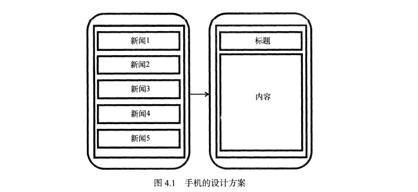
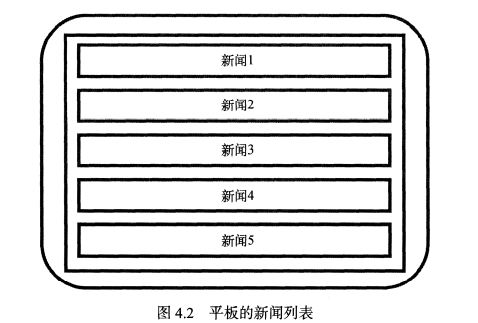
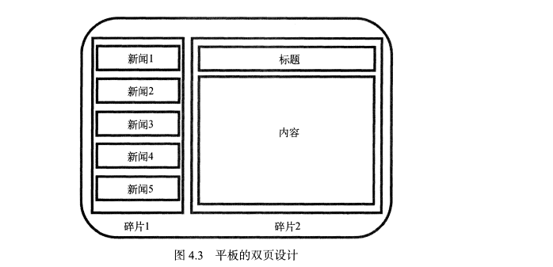
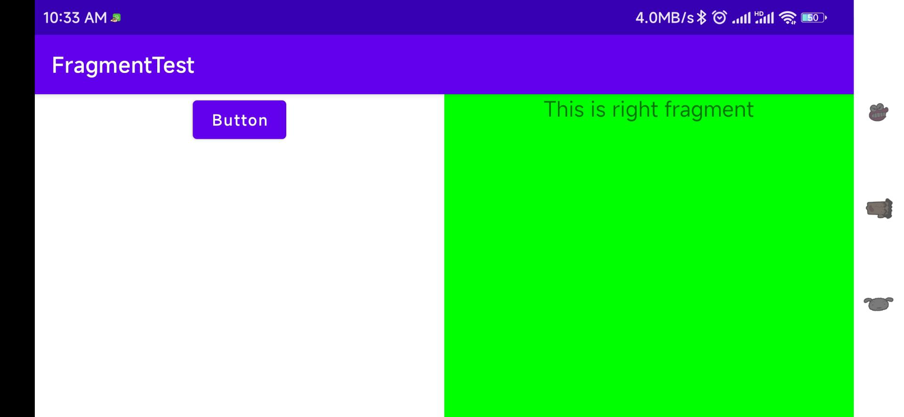
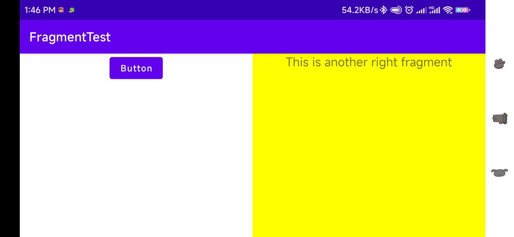

# 手机平板要兼顾———探究碎片

&emsp;&emsp;当今是移动设备发展非常迅速的时代，不仅手机已经成为了生活必需品，就连平板电脑也变得越来越普及。平板电脑和手机最大的区别就在于屏幕的大小，一般手机屏幕的大小会在3英寸到6英寸之间，而一般平板电脑屏幕的大小会在7英寸到10英寸之间。屏幕大小差距过大有可能会让同样的界面在视觉效果上有较大的差异，比如一些界面在手机上看起来非常美观，但在平板电脑上看起来就可能会有控件被过分拉长、元素之间空隙过大等情况。Android自3.0版本开始引入了碎片的概念，它可以让界面在平板上更好地展示。

## 碎片是什么

&emsp;&emsp;碎片(Fragment)是一种可以嵌入在活动当中的UI片段，它能让程序更合理和充分地利用大屏幕的空间，因而在平板上应用得非常广泛。虽然碎片对于我们来说是全新的概念，但我们学习起来会毫不费力，因为它和活动十分相似，同样都能含有布局，同样都有自己的生命周期。甚至可以将碎片理解成一个迷你型的活动，虽然这个迷你活动有可能和普通的活动一样大的。

&emsp;&emsp;那么究竟要如何使用碎片才能充分利用平板屏幕的使用空间呢？想象我们正在开发一个新闻应用，其中一个界面使用RecyclerView展示了一组新闻的标题，当点击了其中一个标题时，就打开另一个界面显示新闻的详细内容。如果是在手机中设置，我们可以将新闻标题列表放在一个活动中，将新闻的详细内容放在另一个活动中，如下图所示：



可是如果在平板上也这么设计，那么新闻标题列表会被拉长至填充满整个平板的屏幕，而新闻的标题一般都不会太长，这样将会导致界面上有大量的空白区域。



因此，更好的设计方案是将新闻标题列表界面和新闻详细内容界面分别放在两个碎片中，然后在同一个活动里引入这两个碎片，这样就可以将屏幕空间充分利用起来了。



## 碎片的使用方式

### 碎片的简单用法

&emsp;&emsp;这里我们准备先写一个最简单的碎片示例来练练手，在一个活动当中添加两个碎片，并让这连个碎片平分活动空间。新建一个左侧碎片布局left_fragment.xml,代码如下所示：

```xml
<?xml version="1.0" encoding="utf-8"?>
<LinearLayout xmlns:android="http://schemas.android.com/apk/res/android"
              android:orientation="vertical"
              android:layout_width="match_parent"
              android:layout_height="match_parent">
    <Button
            android:layout_width="wrap_content"
            android:layout_height="wrap_content"
            android:layout_gravity="center_horizontal"
            android:textAllCaps="false"
            android:text="Button"/>
</LinearLayout>
```
这个布局非常简单，只放置了一个按钮，并让它水平居中显示。然后新建右侧碎片布局right_fragment.xml，代码如下所示：

```xml
<?xml version="1.0" encoding="utf-8"?>
<LinearLayout xmlns:android="http://schemas.android.com/apk/res/android"
              android:background="#00ff00"
              android:orientation="vertical"
              android:layout_width="match_parent"
              android:layout_height="match_parent">
    <TextView
            android:layout_width="wrap_content"
            android:layout_height="wrap_content"
            android:layout_gravity="center_horizontal"
            android:textSize="20sp"
            android:text="This is right fragment"/>

</LinearLayout>
```
&emsp;&emsp;可以看到，我们将这个布局的背景色设置了绿色，并设置了一个TextView用于显示一段文本。接着新建一个leftFragment类，并让它继承自Fragment。注意，这里可能会有两个不同包下的Fragment供你选择，一个是系统内置的android.app.Fragment，一个是support-v4库中的android.support.v4.app.Fragment。这里建议使用support-v4库中的fragment，因为它可以让碎片在所有Android系统版本中保持功能一致性。比如说在Fragment中嵌套使用使用Fragment，这个功能是在Android4.2系统中才开始支持的，如果你使用的是系统内置的Fragment，那么很遗憾，4.2系统之前的设备运行你的程序就会崩溃。而使用support-v4库中的Fragment就不会出现这个问题，只要你保证使用的是最新的support-v4库就可以了。另外，我们并不需要在build.gradle文件中添加support-v4库的依赖，因为build.gradle文件中已经添加了appcompat-v7库的依赖，而这个库会将support-v4库也一起引入进来。现在编写一下LeftFragment中的代码，如下所示：

```java
package com.zj970.fragmenttest;

import android.os.Bundle;
import android.view.LayoutInflater;
import android.view.View;
import android.view.ViewGroup;
import androidx.annotation.NonNull;
import androidx.annotation.Nullable;
import androidx.fragment.app.Fragment;

/**
 * 练习碎片使用
 * @author zj970
 * @date 2022/8/8
 */
public class LeftFragment extends Fragment {
    @Nullable
    @Override
    public View onCreateView(@NonNull LayoutInflater inflater, @Nullable ViewGroup container, @Nullable Bundle savedInstanceState) {
        View view = inflater.inflate(R.layout.left_fragment,container,false);
        return view;
    }
}

```
这里仅仅是重写了Fragment的onCreateView()方法，然后在这个方法中通过LayoutInflater的inflate()方法将刚才定义的left_fragment布局动态加载进来了，整个方法简单明了。接着我们用同样的方法新建一个RightFragment类。

```java
package com.zj970.fragmenttest;

import android.os.Bundle;
import android.view.LayoutInflater;
import android.view.View;
import android.view.ViewGroup;
import androidx.annotation.NonNull;
import androidx.annotation.Nullable;
import androidx.fragment.app.Fragment;

public class RightFragment extends Fragment {

    @Nullable
    @Override
    public View onCreateView(@NonNull LayoutInflater inflater, @Nullable ViewGroup container, @Nullable Bundle savedInstanceState) {
        View view = inflater.inflate(R.layout.right_fragment, container, false);
        return view;
    }
}
```
接下来修改activity_main.xml中的代码
```xml
<?xml version="1.0" encoding="utf-8"?>
<LinearLayout
        xmlns:android="http://schemas.android.com/apk/res/android"
        xmlns:tools="http://schemas.android.com/tools"
        xmlns:app="http://schemas.android.com/apk/res-auto"
        android:layout_width="match_parent"
        android:layout_height="match_parent"
        tools:context=".MainActivity">

    <fragment
        android:id="@+id/left_fragment"
            android:name="com.zj970.fragmenttest.LeftFragment"
            android:layout_width="0dp"
            android:layout_height="wrap_content"
            android:layout_weight="1"/>

    <fragment
            android:id="@+id/right_fragment"
            android:name="com.zj970.fragmenttest.RightFragment"
            android:layout_width="0dp"
            android:layout_height="wrap_content"
            android:layout_weight="1"/>
</LinearLayout>
```
可以看到，我们使用了<fragment>标签在布局中添加碎片，其中指定的大多数属性都是熟悉的，只不过这里还需要通过android:name属性来显式指明要添加的碎片类名，注意一定要将类的包名也加上，效果如下：



正如我们所期待的一样，两个平分了整个活动的布局。不过这个例子实在是太简单了，在真正的项目中很难有什么实际的作用，因此我们马上来看一看，关于碎片的更加使用技巧。

### 动态添加碎片

&emsp;&emsp;在上一节当中，你已经学会了在布局文件中添加碎片的方法，不过碎片真正的强大之处在于，它可以在程序运行时动态地添加到活动当中。根据具体情况来动态地添加碎片，你可以将程序界面定制得更加多样化。新建another_right_fragment.xml
```xml
<?xml version="1.0" encoding="utf-8"?>
<LinearLayout xmlns:android="http://schemas.android.com/apk/res/android"
              android:orientation="vertical"
              android:background="#ffff00"
              android:layout_width="match_parent"
              android:layout_height="match_parent">
    <TextView
            android:layout_width="wrap_content"
            android:layout_height="wrap_content"
            android:layout_gravity="center_horizontal"
            android:textSize="20sp"
            android:text="This is another right fragment"/>

</LinearLayout>
```
这个布局文件的代码和right_fragment.xml中的代码基本相同，只是将背景色改成了黄色，并将显示的文字改了改。然后新建AnotherRightFragment作为另一个右侧碎片，代码如下所示：

```java
package com.zj970.fragmenttest;

import android.os.Bundle;
import android.view.LayoutInflater;
import android.view.View;
import android.view.ViewGroup;
import androidx.annotation.NonNull;
import androidx.annotation.Nullable;
import androidx.fragment.app.Fragment;

public class AnotherRightFragment extends Fragment {
    @Nullable
    @Override
    public View onCreateView(@NonNull LayoutInflater inflater, @Nullable ViewGroup container, @Nullable Bundle savedInstanceState) {
        View view = inflater.inflate(R.layout.another_right_fragment, container, false);
        return view;
    }
}

```
代码同样非常简单，在onCreateView()方法中加载了刚刚创建的another_right_fragment布局。这样我们就准备好了另外一个碎片，接下来看一下如何将它动态地添加到活动当中，修改activity_main.xml

```xml
<?xml version="1.0" encoding="utf-8"?>
<LinearLayout
        xmlns:android="http://schemas.android.com/apk/res/android"
        xmlns:tools="http://schemas.android.com/tools"
        xmlns:app="http://schemas.android.com/apk/res-auto"
        android:layout_width="match_parent"
        android:layout_height="match_parent"
        tools:context=".MainActivity">

    <fragment
        android:id="@+id/left_fragment"
            android:name="com.zj970.fragmenttest.LeftFragment"
            android:layout_width="0dp"
            android:layout_height="match_parent"
            android:layout_weight="1"/>

    <FrameLayout
            android:id="@+id/right_layout"
            android:layout_width="0dp"
            android:layout_height="match_parent"
            android:layout_weight="1"/>
</LinearLayout>
```
可以看到，现在将右侧碎片替换成了一个FrameLayout中，这个帧布局是Android中最简单的一种布局，所有的控件默认都会摆放在布局的左上角。由于这里仅需要在布局里放入一个碎片，不需要任何定位，因此非常适合使用FrameLayout。下面我们将在代码中向FrameLayout添加内容，从而实现动态添加碎片的功能，修改MainActivity中的代码

```java
package com.zj970.fragmenttest;

import android.view.View;
import android.widget.Button;
import androidx.appcompat.app.AppCompatActivity;
import android.os.Bundle;
import androidx.fragment.app.Fragment;
import androidx.fragment.app.FragmentManager;
import androidx.fragment.app.FragmentTransaction;

public class MainActivity extends AppCompatActivity implements View.OnClickListener {

    boolean flag = false;

    @Override
    protected void onCreate(Bundle savedInstanceState) {
        super.onCreate(savedInstanceState);
        setContentView(R.layout.activity_main);
        Button button = findViewById(R.id.button);
        button.setOnClickListener(this::onClick);
        replaceFragment(new RightFragment());
    }

    /**
     * Called when a view has been clicked.
     *
     * @param v The view that was clicked.
     */
    @Override
    public void onClick(View v) {
        switch (v.getId()) {
            case R.id.button:
                if (flag) {
                    replaceFragment(new RightFragment());
                    flag = !flag;
                } else {
                    replaceFragment(new AnotherRightFragment());
                    flag = !flag;
                }
                break;
            default:
                break;
        }
    }

    protected void replaceFragment(Fragment fragment) {
        FragmentManager fragmentManager = getSupportFragmentManager();
        FragmentTransaction transaction = fragmentManager.beginTransaction();
        transaction.replace(R.id.right_layout,fragment);
        transaction.commit();
    }
}
```
可以看到，首先我们给左侧碎片中的按钮注册了一个点击事件，然后调用replaceFragment()方法动态添加了RightFragment这个碎片。当点击左侧碎片中的按钮，又会调用replaceFragment()方法将右侧碎片替换成AnotherRightFragment。结合replaceFragment()方法中的代码可以看出，动态添加碎片主要分为5步。

1. 创建待添加的碎片实例。
2. 获取FragmentManager，在活动中可以直接通过调用getSupportFragmentManager()方法得到。
3. 开启一个事务，通过调用beginTransaction()方法开启。
4. 将容器内添加或替换碎片，一般使用replace()方法实现，需要传入容器的id和待添加的碎片实例
5. 提交事务，调用commit()方法来实现。

这样就完成了在活动中动态增添碎片的功能，重新运行程序，可以用按钮切换



### 在碎片中模拟返回栈

&emsp;&emsp;在上面，我们成功实现了向活动中动态添加碎片的功能，不过通过点击按钮添加了一个碎片之后，这时按下Back键程序就会直接退出。如果这里我们想模仿类似于返回栈中，在FragmentTransaction 中提供了一个addToBackStack()方法。可以用于将一个事务添加到返回栈中，修改MainActivity中的代码。

```java
package com.zj970.fragmenttest;

import android.view.View;
import android.widget.Button;
import androidx.appcompat.app.AppCompatActivity;
import android.os.Bundle;
import androidx.fragment.app.Fragment;
import androidx.fragment.app.FragmentManager;
import androidx.fragment.app.FragmentTransaction;

public class MainActivity extends AppCompatActivity implements View.OnClickListener {

    boolean flag = false;

    @Override
    protected void onCreate(Bundle savedInstanceState) {
        super.onCreate(savedInstanceState);
        setContentView(R.layout.activity_main);
        Button button = findViewById(R.id.button);
        button.setOnClickListener(this::onClick);
        replaceFragment(new RightFragment());
    }

    /**
     * Called when a view has been clicked.
     *
     * @param v The view that was clicked.
     */
    @Override
    public void onClick(View v) {
        switch (v.getId()) {
            case R.id.button:
                if (flag) {
                    replaceFragment(new RightFragment());
                    flag = !flag;
                } else {
                    replaceFragment(new AnotherRightFragment());
                    flag = !flag;
                }
                break;
            default:
                break;
        }
    }

    protected void replaceFragment(Fragment fragment) {
        FragmentManager fragmentManager = getSupportFragmentManager();
        FragmentTransaction transaction = fragmentManager.beginTransaction();
        transaction.replace(R.id.right_layout,fragment);
        transaction.addToBackStack(null);
        transaction.commit();
    }
}
```
&emsp;&emsp;这里我们在事务提交之前调用了FragmentTransaction的addToBackStack()方法，它可以接收一个名字用于描述返回栈的状态，一般传入null即可。现在重新运行程序，并点击按钮将AnotherRightFragment添加到活动中，按下Back键，你会发现程序并没有退出，而是回到了RightFragment界面，继续按下Back键，RightFragment界面也会消失，再次按下Back键，程序就会退出

### 碎片与活动之间进行通信

&emsp;&emsp;虽然碎片都是嵌入在活动中显示的，可是实际上它们的关系并没有那么亲密。你可以看出，碎片和活动都是各自存在于一个独立的类当中，他们之间并没有那么明显的方式来直接进行通信。如果想要在活动中调用碎片里的方法，或者在碎片中调用活动里的方法，应该如何实现呢？为了方便碎片和活动之间进行通信，FragmentManager提供了类似于findViewById()的方法，专门用于从布局文件中获取碎片的实例，代码如下：


> RightFragment rightFragment = (RightFragment)getFragmentManager().findFragmentById(R.id.right_fragment);

调用FragmentManager的findFragmentById()方法，就可以在活动中得到相应碎片的实例，然后就能轻松地调用碎片里的方法了。掌握了如何在活动中调用碎片里的方法，那么碎皮那又该怎样调用活动里的方法呢？其实这就更简单了，在每个碎片中都可以通过调用getActivity()方法来得到当前碎片相关联的活动实例，代码如下所示：

> MainActivity activity = (MainActivity)getActivity();

有了活动实例之后，在碎片中调用活动里的方法就变得轻而易举，另外当碎片中需要使用Context对象时，也可以使用getActivity()方法，因为获取的活动本身就是一个context对象。那么碎片与碎片之间呢？碎片与碎片之间的通信，首先在一个碎片中可以得到与它相关联的的活动，然后再通过这个活动去获取另外一个碎片的实例，这样就实现了不同碎片之间的通信功能。

## 4.3 碎片的生命周期

&emsp;&emsp;和活动一样，碎片也有自己的生命周期，并且它和活动的生命周期实在是太像了。

### 4.3.1 碎片的状态和回调

&emsp;&emsp;还记得每个活动在其生命周期内可能会有哪几种状态吗？没错，一共有运行状态、暂停状态、停止状态和销毁状态这4种。类似地，