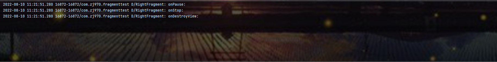

# 第4章 手机平板要兼顾———探究碎片

&emsp;&emsp;当今是移动设备发展非常迅速的时代，不仅手机已经成为了生活必需品，就连平板电脑也变得越来越普及。平板电脑和手机最大的区别就在于屏幕的大小，一般手机屏幕的大小会在3英寸到6英寸之间，而一般平板电脑屏幕的大小会在7英寸到10英寸之间。屏幕大小差距过大有可能会让同样的界面在视觉效果上有较大的差异，比如一些界面在手机上看起来非常美观，但在平板电脑上看起来就可能会有控件被过分拉长、元素之间空隙过大等情况。Android自3.0版本开始引入了碎片的概念，它可以让界面在平板上更好地展示。

## 4.1 碎片是什么

&emsp;&emsp;碎片(Fragment)是一种可以嵌入在活动当中的UI片段，它能让程序更合理和充分地利用大屏幕的空间，因而在平板上应用得非常广泛。虽然碎片对于我们来说是全新的概念，但我们学习起来会毫不费力，因为它和活动十分相似，同样都能含有布局，同样都有自己的生命周期。甚至可以将碎片理解成一个迷你型的活动，虽然这个迷你活动有可能和普通的活动一样大的。

&emsp;&emsp;那么究竟要如何使用碎片才能充分利用平板屏幕的使用空间呢？想象我们正在开发一个新闻应用，其中一个界面使用RecyclerView展示了一组新闻的标题，当点击了其中一个标题时，就打开另一个界面显示新闻的详细内容。如果是在手机中设置，我们可以将新闻标题列表放在一个活动中，将新闻的详细内容放在另一个活动中，如下图所示：


可是如果在平板上也这么设计，那么新闻标题列表会被拉长至填充满整个平板的屏幕，而新闻的标题一般都不会太长，这样将会导致界面上有大量的空白区域。


因此，更好的设计方案是将新闻标题列表界面和新闻详细内容界面分别放在两个碎片中，然后在同一个活动里引入这两个碎片，这样就可以将屏幕空间充分利用起来了。


## 4.2 碎片的使用方式

### 4.2.1 碎片的简单用法

&emsp;&emsp;这里我们准备先写一个最简单的碎片示例来练练手，在一个活动当中添加两个碎片，并让这连个碎片平分活动空间。新建一个左侧碎片布局left_fragment.xml,代码如下所示：

```xml
<?xml version="1.0" encoding="utf-8"?>
<LinearLayout xmlns:android="http://schemas.android.com/apk/res/android"
              android:orientation="vertical"
              android:layout_width="match_parent"
              android:layout_height="match_parent">
    <Button
            android:layout_width="wrap_content"
            android:layout_height="wrap_content"
            android:layout_gravity="center_horizontal"
            android:textAllCaps="false"
            android:text="Button"/>
</LinearLayout>
```
这个布局非常简单，只放置了一个按钮，并让它水平居中显示。然后新建右侧碎片布局right_fragment.xml，代码如下所示：

```xml
<?xml version="1.0" encoding="utf-8"?>
<LinearLayout xmlns:android="http://schemas.android.com/apk/res/android"
              android:background="#00ff00"
              android:orientation="vertical"
              android:layout_width="match_parent"
              android:layout_height="match_parent">
    <TextView
            android:layout_width="wrap_content"
            android:layout_height="wrap_content"
            android:layout_gravity="center_horizontal"
            android:textSize="20sp"
            android:text="This is right fragment"/>

</LinearLayout>
```
&emsp;&emsp;可以看到，我们将这个布局的背景色设置了绿色，并设置了一个TextView用于显示一段文本。接着新建一个leftFragment类，并让它继承自Fragment。注意，这里可能会有两个不同包下的Fragment供你选择，一个是系统内置的android.app.Fragment，一个是support-v4库中的android.support.v4.app.Fragment。这里建议使用support-v4库中的fragment，因为它可以让碎片在所有Android系统版本中保持功能一致性。比如说在Fragment中嵌套使用使用Fragment，这个功能是在Android4.2系统中才开始支持的，如果你使用的是系统内置的Fragment，那么很遗憾，4.2系统之前的设备运行你的程序就会崩溃。而使用support-v4库中的Fragment就不会出现这个问题，只要你保证使用的是最新的support-v4库就可以了。另外，我们并不需要在build.gradle文件中添加support-v4库的依赖，因为build.gradle文件中已经添加了appcompat-v7库的依赖，而这个库会将support-v4库也一起引入进来。现在编写一下LeftFragment中的代码，如下所示：

```java
package com.zj970.fragmenttest;

import android.os.Bundle;
import android.view.LayoutInflater;
import android.view.View;
import android.view.ViewGroup;
import androidx.annotation.NonNull;
import androidx.annotation.Nullable;
import androidx.fragment.app.Fragment;

/**
 * 练习碎片使用
 * @author zj970
 * @date 2022/8/8
 */
public class LeftFragment extends Fragment {
    @Nullable
    @Override
    public View onCreateView(@NonNull LayoutInflater inflater, @Nullable ViewGroup container, @Nullable Bundle savedInstanceState) {
        View view = inflater.inflate(R.layout.left_fragment,container,false);
        return view;
    }
}

```
这里仅仅是重写了Fragment的onCreateView()方法，然后在这个方法中通过LayoutInflater的inflate()方法将刚才定义的left_fragment布局动态加载进来了，整个方法简单明了。接着我们用同样的方法新建一个RightFragment类。

```java
package com.zj970.fragmenttest;

import android.os.Bundle;
import android.view.LayoutInflater;
import android.view.View;
import android.view.ViewGroup;
import androidx.annotation.NonNull;
import androidx.annotation.Nullable;
import androidx.fragment.app.Fragment;

public class RightFragment extends Fragment {

    @Nullable
    @Override
    public View onCreateView(@NonNull LayoutInflater inflater, @Nullable ViewGroup container, @Nullable Bundle savedInstanceState) {
        View view = inflater.inflate(R.layout.right_fragment, container, false);
        return view;
    }
}
```
接下来修改activity_main.xml中的代码
```xml
<?xml version="1.0" encoding="utf-8"?>
<LinearLayout
        xmlns:android="http://schemas.android.com/apk/res/android"
        xmlns:tools="http://schemas.android.com/tools"
        xmlns:app="http://schemas.android.com/apk/res-auto"
        android:layout_width="match_parent"
        android:layout_height="match_parent"
        tools:context=".MainActivity">

    <fragment
        android:id="@+id/left_fragment"
            android:name="com.zj970.fragmenttest.LeftFragment"
            android:layout_width="0dp"
            android:layout_height="wrap_content"
            android:layout_weight="1"/>

    <fragment
            android:id="@+id/right_fragment"
            android:name="com.zj970.fragmenttest.RightFragment"
            android:layout_width="0dp"
            android:layout_height="wrap_content"
            android:layout_weight="1"/>
</LinearLayout>
```
可以看到，我们使用了<fragment>标签在布局中添加碎片，其中指定的大多数属性都是熟悉的，只不过这里还需要通过android:name属性来显式指明要添加的碎片类名，注意一定要将类的包名也加上，效果如下：


正如我们所期待的一样，两个平分了整个活动的布局。不过这个例子实在是太简单了，在真正的项目中很难有什么实际的作用，因此我们马上来看一看，关于碎片的更加使用技巧。

### 4.2.2 动态添加碎片

&emsp;&emsp;在上一节当中，你已经学会了在布局文件中添加碎片的方法，不过碎片真正的强大之处在于，它可以在程序运行时动态地添加到活动当中。根据具体情况来动态地添加碎片，你可以将程序界面定制得更加多样化。新建another_right_fragment.xml
```xml
<?xml version="1.0" encoding="utf-8"?>
<LinearLayout xmlns:android="http://schemas.android.com/apk/res/android"
              android:orientation="vertical"
              android:background="#ffff00"
              android:layout_width="match_parent"
              android:layout_height="match_parent">
    <TextView
            android:layout_width="wrap_content"
            android:layout_height="wrap_content"
            android:layout_gravity="center_horizontal"
            android:textSize="20sp"
            android:text="This is another right fragment"/>

</LinearLayout>
```
这个布局文件的代码和right_fragment.xml中的代码基本相同，只是将背景色改成了黄色，并将显示的文字改了改。然后新建AnotherRightFragment作为另一个右侧碎片，代码如下所示：

```java
package com.zj970.fragmenttest;

import android.os.Bundle;
import android.view.LayoutInflater;
import android.view.View;
import android.view.ViewGroup;
import androidx.annotation.NonNull;
import androidx.annotation.Nullable;
import androidx.fragment.app.Fragment;

public class AnotherRightFragment extends Fragment {
    @Nullable
    @Override
    public View onCreateView(@NonNull LayoutInflater inflater, @Nullable ViewGroup container, @Nullable Bundle savedInstanceState) {
        View view = inflater.inflate(R.layout.another_right_fragment, container, false);
        return view;
    }
}

```
代码同样非常简单，在onCreateView()方法中加载了刚刚创建的another_right_fragment布局。这样我们就准备好了另外一个碎片，接下来看一下如何将它动态地添加到活动当中，修改activity_main.xml

```xml
<?xml version="1.0" encoding="utf-8"?>
<LinearLayout
        xmlns:android="http://schemas.android.com/apk/res/android"
        xmlns:tools="http://schemas.android.com/tools"
        xmlns:app="http://schemas.android.com/apk/res-auto"
        android:layout_width="match_parent"
        android:layout_height="match_parent"
        tools:context=".MainActivity">

    <fragment
        android:id="@+id/left_fragment"
            android:name="com.zj970.fragmenttest.LeftFragment"
            android:layout_width="0dp"
            android:layout_height="match_parent"
            android:layout_weight="1"/>

    <FrameLayout
            android:id="@+id/right_layout"
            android:layout_width="0dp"
            android:layout_height="match_parent"
            android:layout_weight="1"/>
</LinearLayout>
```
可以看到，现在将右侧碎片替换成了一个FrameLayout中，这个帧布局是Android中最简单的一种布局，所有的控件默认都会摆放在布局的左上角。由于这里仅需要在布局里放入一个碎片，不需要任何定位，因此非常适合使用FrameLayout。下面我们将在代码中向FrameLayout添加内容，从而实现动态添加碎片的功能，修改MainActivity中的代码

```java
package com.zj970.fragmenttest;

import android.view.View;
import android.widget.Button;
import androidx.appcompat.app.AppCompatActivity;
import android.os.Bundle;
import androidx.fragment.app.Fragment;
import androidx.fragment.app.FragmentManager;
import androidx.fragment.app.FragmentTransaction;

public class MainActivity extends AppCompatActivity implements View.OnClickListener {

    boolean flag = false;

    @Override
    protected void onCreate(Bundle savedInstanceState) {
        super.onCreate(savedInstanceState);
        setContentView(R.layout.activity_main);
        Button button = findViewById(R.id.button);
        button.setOnClickListener(this::onClick);
        replaceFragment(new RightFragment());
    }

    /**
     * Called when a view has been clicked.
     *
     * @param v The view that was clicked.
     */
    @Override
    public void onClick(View v) {
        switch (v.getId()) {
            case R.id.button:
                if (flag) {
                    replaceFragment(new RightFragment());
                    flag = !flag;
                } else {
                    replaceFragment(new AnotherRightFragment());
                    flag = !flag;
                }
                break;
            default:
                break;
        }
    }

    protected void replaceFragment(Fragment fragment) {
        FragmentManager fragmentManager = getSupportFragmentManager();
        FragmentTransaction transaction = fragmentManager.beginTransaction();
        transaction.replace(R.id.right_layout,fragment);
        transaction.commit();
    }
}
```
可以看到，首先我们给左侧碎片中的按钮注册了一个点击事件，然后调用replaceFragment()方法动态添加了RightFragment这个碎片。当点击左侧碎片中的按钮，又会调用replaceFragment()方法将右侧碎片替换成AnotherRightFragment。结合replaceFragment()方法中的代码可以看出，动态添加碎片主要分为5步。

1. 创建待添加的碎片实例。
2. 获取FragmentManager，在活动中可以直接通过调用getSupportFragmentManager()方法得到。
3. 开启一个事务，通过调用beginTransaction()方法开启。
4. 将容器内添加或替换碎片，一般使用replace()方法实现，需要传入容器的id和待添加的碎片实例
5. 提交事务，调用commit()方法来实现。

这样就完成了在活动中动态增添碎片的功能，重新运行程序，可以用按钮切换


### 4.2.3 在碎片中模拟返回栈

&emsp;&emsp;在上面，我们成功实现了向活动中动态添加碎片的功能，不过通过点击按钮添加了一个碎片之后，这时按下Back键程序就会直接退出。如果这里我们想模仿类似于返回栈中，在FragmentTransaction 中提供了一个addToBackStack()方法。可以用于将一个事务添加到返回栈中，修改MainActivity中的代码。

```java
package com.zj970.fragmenttest;

import android.view.View;
import android.widget.Button;
import androidx.appcompat.app.AppCompatActivity;
import android.os.Bundle;
import androidx.fragment.app.Fragment;
import androidx.fragment.app.FragmentManager;
import androidx.fragment.app.FragmentTransaction;

public class MainActivity extends AppCompatActivity implements View.OnClickListener {

    boolean flag = false;

    @Override
    protected void onCreate(Bundle savedInstanceState) {
        super.onCreate(savedInstanceState);
        setContentView(R.layout.activity_main);
        Button button = findViewById(R.id.button);
        button.setOnClickListener(this::onClick);
        replaceFragment(new RightFragment());
    }

    /**
     * Called when a view has been clicked.
     *
     * @param v The view that was clicked.
     */
    @Override
    public void onClick(View v) {
        switch (v.getId()) {
            case R.id.button:
                if (flag) {
                    replaceFragment(new RightFragment());
                    flag = !flag;
                } else {
                    replaceFragment(new AnotherRightFragment());
                    flag = !flag;
                }
                break;
            default:
                break;
        }
    }

    protected void replaceFragment(Fragment fragment) {
        FragmentManager fragmentManager = getSupportFragmentManager();
        FragmentTransaction transaction = fragmentManager.beginTransaction();
        transaction.replace(R.id.right_layout,fragment);
        transaction.addToBackStack(null);
        transaction.commit();
    }
}
```
&emsp;&emsp;这里我们在事务提交之前调用了FragmentTransaction的addToBackStack()方法，它可以接收一个名字用于描述返回栈的状态，一般传入null即可。现在重新运行程序，并点击按钮将AnotherRightFragment添加到活动中，按下Back键，你会发现程序并没有退出，而是回到了RightFragment界面，继续按下Back键，RightFragment界面也会消失，再次按下Back键，程序就会退出

### 4.2.4 碎片与活动之间进行通信

&emsp;&emsp;虽然碎片都是嵌入在活动中显示的，可是实际上它们的关系并没有那么亲密。你可以看出，碎片和活动都是各自存在于一个独立的类当中，他们之间并没有那么明显的方式来直接进行通信。如果想要在活动中调用碎片里的方法，或者在碎片中调用活动里的方法，应该如何实现呢？为了方便碎片和活动之间进行通信，FragmentManager提供了类似于findViewById()的方法，专门用于从布局文件中获取碎片的实例，代码如下：


> RightFragment rightFragment = (RightFragment)getFragmentManager().findFragmentById(R.id.right_fragment);

调用FragmentManager的findFragmentById()方法，就可以在活动中得到相应碎片的实例，然后就能轻松地调用碎片里的方法了。掌握了如何在活动中调用碎片里的方法，那么碎皮那又该怎样调用活动里的方法呢？其实这就更简单了，在每个碎片中都可以通过调用getActivity()方法来得到当前碎片相关联的活动实例，代码如下所示：

> MainActivity activity = (MainActivity)getActivity();

有了活动实例之后，在碎片中调用活动里的方法就变得轻而易举，另外当碎片中需要使用Context对象时，也可以使用getActivity()方法，因为获取的活动本身就是一个context对象。那么碎片与碎片之间呢？碎片与碎片之间的通信，首先在一个碎片中可以得到与它相关联的的活动，然后再通过这个活动去获取另外一个碎片的实例，这样就实现了不同碎片之间的通信功能。

## 4.3 碎片的生命周期

&emsp;&emsp;和活动一样，碎片也有自己的生命周期，并且它和活动的生命周期实在是太像了。

### 4.3.1 碎片的状态和回调

&emsp;&emsp;还记得每个活动在其生命周期内可能会有哪几种状态吗？没错，一共有运行状态、暂停状态、停止状态和销毁状态这4种。类似地，每个碎片在其生命周期内也可能会经历这几种状态，只不过在一些细小的地方会有部分区别。

- 运行状态

&emsp;&emsp;当一个碎片是可见的，并且它所关联的活动正处于运行状态时，该碎片也处于运行状态。

- 暂停状态

&emsp;&emsp;当一个活动进入暂停状态时（由于另一个未占满屏幕的活动被添加了栈顶），与它相关联的可见碎片就会进入到暂停状态。

- 停止状态

&emsp;&emsp;当一个活动进入停止状态时，与它关联的碎片就会进入到停止状态，或者通过调用FragmentTransaction的remove()方法，这时的碎片也会进入到停止状态。总的来说，进入停止状态的碎片对用户来说是完全不可见的，有可能会被系统回收。

- 销毁状态

&emsp;&emsp;碎片总是依附于活动而存在的，因此当活动被销毁时，与它相关联的碎片就会进入到销毁状态。或者通过调用FragmentTransaction的remove()、replace()方法将碎片从活动中移除，但在事务提交之前调用addToBackStack()方法，这时的碎片也会进入到销毁状态。

&emsp;&emsp;结合之前的活动状态，同样地，Fragment类也提供了一系列的回调方法，以覆盖碎片生命周期的每个环节，其中，活动中有的回调方法，碎片几乎都有，不过碎片还提供了一些附加啊的回调方法。

onAttach():当碎片和活动建立关联的时候调用。  
onCreateView():为碎片创建视图（加载布局）时调用。
onActivityCreated():确保与碎片相关联的活动一定已经创建完毕的时候调用。
onDestroyView():当与碎片关联的视图被移除的时候调用。
onDetach():当碎片和活动解除关联的时候调用。

碎片完整的生命周期示意图可参考图


### 4.3.2 体验碎片的生命周期

修改RightFragment中的代码

```java
package com.zj970.fragmenttest;

import android.content.Context;
import android.os.Bundle;
import android.util.Log;
import android.view.LayoutInflater;
import android.view.View;
import android.view.ViewGroup;
import androidx.annotation.NonNull;
import androidx.annotation.Nullable;
import androidx.fragment.app.Fragment;

public class RightFragment extends Fragment {

    private static final String TAG = "RightFragment";

    
    @Nullable
    @Override
    public View onCreateView(@NonNull LayoutInflater inflater, @Nullable ViewGroup container, @Nullable Bundle savedInstanceState) {
        View view = inflater.inflate(R.layout.right_fragment, container, false);
        Log.d(TAG, "onCreateView: ");
        return view;
    }

    @Override
    public void onAttach(@NonNull Context context) {
        super.onAttach(context);
        Log.d(TAG, "onAttach: ");
    }


    @Override
    public void onCreate(@Nullable Bundle savedInstanceState) {
        super.onCreate(savedInstanceState);
        Log.d(TAG, "onCreate: ");
    }
    
    @Override
    public void onActivityCreated(@Nullable Bundle savedInstanceState) {
        super.onActivityCreated(savedInstanceState);
        Log.d(TAG, "onActivityCreated: ");
    }

    @Override
    public void onStart() {
        super.onStart();
        Log.d(TAG, "onStart: ");
    }

    @Override
    public void onResume() {
        super.onResume();
        Log.d(TAG, "onResume: ");
    }

    @Override
    public void onPause() {
        super.onPause();
        Log.d(TAG, "onPause: ");
    }

    @Override
    public void onStop() {
        super.onStop();
        Log.d(TAG, "onStop: ");
    }

    @Override
    public void onDestroyView() {
        super.onDestroyView();
        Log.d(TAG, "onDestroyView: ");
    }

    @Override
    public void onDestroy() {
        super.onDestroy();
        Log.d(TAG, "onDestroy: ");
    }

    @Override
    public void onDetach() {
        super.onDetach();
        Log.d(TAG, "onDetach: ");
    }
}

```
我们在RightFragment中的每一个回调方法里都加入了打印日志的代码，然后重新运行程序，这时观察logcat中的打印信息，如下图所示：


&emsp;&emsp;可以看到，当RightFragment第一次被加载到屏幕上时，会依次执行onAttach()、onCreate()、onCreateView()、onActivityCreated()、onStart()和onResume()方法，然后点击按钮，此时的打印信息如下：



&emsp;&emsp;由于RightFragment重新回到了运行状态，因此onActivityCreated()、onStart()和onResume()方法会的得到执行。注意此时onCreate()和onCreateView()方法并不会执行，因为我们借助了addToBackStack()方法使得RightFragment和它的视图并没有销毁。再按下Back键退出程序，打印信息如下：


&emsp;&emsp;依次会执行onPause、onStop()、onDestroyView()、onDestroy()和onDetach()方法，最终将活动和碎片一起销毁。这样碎片完整的生命周期就体验完了。

&emsp;&emsp;另外值得一提的是，在碎片中你也是可以通过onSaveInstanceState()方法来保存数据的，因为进入停止状态的碎片有可能在系统内存不足的时候被回收。保存下来的数据在onCreate()、onCreateView()和onActivityCreated()这3个方法中都可以重新得到，他们都含有一个Bundle类型的savedInstanceState参数。

## 4.4 动态加载布局的技巧

&emsp;&emsp;虽然动态添加碎片的功能很枪法，可以解决很多实际开发中的问题，但是它毕竟只是在一个布局文件中进行一些添加和替换操作。如果程序能够根据设备的分辨率或者屏幕的大小在运行时来决定加载哪个布局，那我们可发挥的空间就更多了。

### 4.4.1 使用限定符

&emsp;&emsp;如果经常使用平板电脑，应该会发现现在很多的平板应用都采用的是双页模式（程序会在左侧的面板上显示一个包含子项的列表，在右侧的面板上显示内容），因为平板电脑的屏幕足够大、完全可以同时显示下两页的内容，但手机的屏幕一次就只能显示一页的内容，因此两个页面需要分开显示。  
&emsp;&emsp;那么怎样才能在运行时判断程序应该是使用双页模式还是单页模式呢？这就需要借助限定符（Qualifiers）来实现了。下面我们通过一个例子来学习它的用法，修改FragmentTest项目中的activity_main.xml文件：

```xml
<?xml version="1.0" encoding="utf-8"?>
<LinearLayout
        xmlns:android="http://schemas.android.com/apk/res/android"
        android:layout_width="match_parent"
        android:layout_height="match_parent">
    <fragment
            android:id="@+id/left_fragment"
            android:name="com.zj970.fragmenttest.LeftFragment"
            android:layout_width="match_parent"
            android:layout_height="wrap_content"/>
</LinearLayout>
```
这里将多余的代码都删掉，只留下一个左侧碎片，并让它充满整个父布局。接着在res目录下新建layout-large文件夹，在这个文件下新建一个布局，也叫做activity_main.xml，代码如下所示：

```xml
<?xml version="1.0" encoding="utf-8"?>
<LinearLayout
        xmlns:android="http://schemas.android.com/apk/res/android"
        android:layout_width="match_parent"
        android:layout_height="match_parent">
    <fragment
            android:id="@+id/left_fragment"
            android:name="com.zj970.fragmenttest.LeftFragment"
            android:layout_width="0dp"
            android:layout_height="match_parent"
            android:layout_weight="1"/>
    <fragment
            android:id="@+id/right_fragment"
            android:name="com.zj970.fragmenttest.RightFragment"
            android:layout_width="0dp"
            android:layout_height="match_parent"
            android:layout_weight="3"/>
</LinearLayout>
```

&emsp;&emsp;可以看到，layout/activity_main.xml中布局只包含了一个碎片，即单页模式，而layout-large/activity_main.xml布局中包含了两个碎片，即双页模式。其中large就是一个限定符，哪些屏幕被认为是large的设备就会自动加载layout-large文件夹下的布局，而小屏幕的设备则还是会加载layout文件夹下的布局。然后将MainActivity中的replaceFragment()方法里的代码注释掉

- 大屏


- 手机


这样我们就实现了在程序运行时动态加载布局的功能。

Android中有一些常见的限定符可以参见下表。

<table>
    <tr>
        <td>屏幕特征</td>
        <td>限定符</td>
        <td>描述</td>
    </tr>
    <tr>
        <td rowspan="4">大小</td>
        <td>small</td>
        <td>提供给小屏幕设备的资源</td>
    </tr>
    <tr>
        <td>normal</td>
        <td>提供给中屏幕设备的资源</td>
    </tr>
    <tr>
        <td>large</td>
        <td>提供给大屏幕设备的资源</td>
    </tr>
    <tr>
        <td>xlarge</td>
        <td>提供给超大屏幕设备的资源</td>
    </tr>
    <tr>
        <td rowspan="5">分辨率</td>
        <td>ldpi</td>
        <td>提供给低分辨率设备的资源(120dpi以下)</td>
    </tr>
    <tr>
        <td>mdpi</td>
        <td>提供给中等分辨率设备的资源(120dpi~160dpi)</td>
    </tr>
    <tr>
        <td>mdpi</td>
        <td>提供给高等分辨率设备的资源(160dpi~240dpi)</td>
    </tr>
    <tr>
        <td>xhdpi</td>
        <td>提供给超高等分辨率设备的资源(240dpi~320dpi)</td>
    </tr>
    <tr>
        <td>xxhdpi</td>
        <td>提供给超超高等分辨率设备的资源(320dpi~480dpi)</td>
    </tr>
    <tr>
        <td rowspan="2">方向</td>
        <td>land</td>
        <td>提供给横屏设备的资源</td>
    </tr>
    <tr>
        <td>port</td>
        <td>提供给竖屏设备的资源</td>
    </tr>
</table>

### 4.4.2 使用最小宽度限定符

&emsp;&emsp;在上面我们使用了large限定符成功解决了单页双页的判断问题，不过很快又有一个新的问题出现了，large到底是值多大呢？有时候我们希望可以更加灵活地为不同设备加载布局，不管他们是不是被系统认定为large,这时就可以使用最小宽度限定符(Smallest-width Qualifier)了。最小宽度限定符允许我们对屏幕的宽度指定一个最小值（以dp为单位），然后以这个最小值为临界点，屏幕宽度大于这个值的设备就加载一个布局，屏幕宽度小于这个值的设备就加载另一个布局。在res目录下新建layout-sw600dp文件夹，然后新建activity_main.xml布局

```xml
<LinearLayout xmlns:android="http://schemas.android.com/apk/res/android"
        android:layout_width="match_parent"
        android:layout_height="match_parent">
    <fragment
            android:id="@+id/left_fragment"
            android:name="com.zj970.fragmenttest.LeftFragment"
            android:layout_width="0dp"
            android:layout_height="match_parent"
            android:layout_weight="1"/>
    <fragment
            android:id="@+id/right_fragment"
            android:name="com.zj970.fragmenttest.RightFragment"
            android:layout_width="0dp"
            android:layout_height="match_parent"
            android:layout_weight="3"/>
</LinearLayout>
```

这就意味着，当程序运行在屏幕宽度大于600dp的设备上时，会加载layout-sw600dp/activity_main布局，当程序运行在屏幕宽度小于600dp的设备上时，则仍然加载默认的layout/activity_main.xml布局

## 4.5 碎片的最佳实践——一个简易版的新闻应用

&emsp;&emsp;现在已经将碎片的重要知识点掌握差不多了，碎片很多时候都是在平板开发当中使用的，主要是为了解决屏幕空间不能充分利用的问题，那是不是表明我们开发程序都需要提供一个手机版和一个pad版？确实会有不少公司这么做的，但是这样会浪费很多的人力物力。因为维护两个版本的代码成本很高，每当增加什么新功能时，需要在两份代码中各写一遍，每当发现有一个BUG时，需要在两份代码中各修改一次。因此，如何编写同时兼容手机和平板的应用程序，下面我们来尝试编写一个简易的新闻应用。

&emsp;&emsp;由于待会在编写新闻列表时会使用到RecyclerView，因此首先需要在app/build.gradle当中添加依赖库：

```groovy
dependencies {
    compile fileTree(dir: 'libs',include: ['*.jar'])
    compile 'com.android.support:appcompat-v7:24.2.1'
    testCompile 'junit:junit:4.12'
    compile 'com.android.support:recyclerView-v7:24.2.1'
}
```
接下来新建一个新闻实体类News:

```java
package com.zj970.fragmentbestpractice.entity;

public class News {
    private String title;
    private String content;

    public String getTitle() {
        return title;
    }

    public void setTitle(String title) {
        this.title = title;
    }

    public String getContent() {
        return content;
    }

    public void setContent(String content) {
        this.content = content;
    }
}

```

News类的代码比较简单的，title字段表示新闻标题，content字段表示新闻内容。接着新建布局文件news_content_frag.xml，用于作为新闻内容的标布局：

```xml
<?xml version="1.0" encoding="utf-8"?>
<RelativeLayout xmlns:android="http://schemas.android.com/apk/res/android"
                android:layout_width="match_parent"
                android:layout_height="match_parent">
    <LinearLayout
            android:id="@+id/visiblity_layout"
            android:layout_width="match_parent"
            android:layout_height="match_parent"
            android:orientation="vertical"
            android:visibility="invisible">
        <TextView
                android:id="@+id/news_title"
                android:layout_width="match_parent"
                android:layout_height="wrap_content"
                android:gravity="center"
                android:padding="10dp"
                android:textSize="20sp"/>
        <View
                android:layout_width="match_parent"
                android:layout_height="1dp"
                android:background="#000"/>
        <TextView
                android:id="@+id/news_content"
                android:layout_width="match_parent"
                android:layout_height="0dp"
                android:layout_weight="1"
                android:padding="15dp"
                android:textSize="18sp"/>
    </LinearLayout>
    <View
            android:layout_width="1dp"
            android:layout_height="match_parent"
            android:layout_alignParentLeft="true"
            android:background="#000"/>
</RelativeLayout>
```

新闻内容的布局主要可以分为两个部分，头部部分显示新闻标题，正文部分显示新闻内容，中间使用一条细线分隔开。这里的细线是利用view来实现的，将View的宽或高设置为1dp，再通过background属性给细线设置一下颜色就可以了。这里我们设置细线设置为黑色。然后新建一个NewsContentFragment类，继承自Fragment。

```java
package com.zj970.fragmentbestpractice.fragment;

import android.os.Bundle;
import android.view.LayoutInflater;
import android.view.View;
import android.view.ViewGroup;
import android.widget.TextView;
import androidx.annotation.NonNull;
import androidx.annotation.Nullable;
import androidx.fragment.app.Fragment;
import com.zj970.fragmentbestpractice.R;

public class NewsContentFragment extends Fragment {
    private View view;

    @Nullable
    @Override
    public View onCreateView(@NonNull LayoutInflater inflater, @Nullable ViewGroup container, @Nullable Bundle savedInstanceState) {
        view = inflater.inflate(R.layout.news_content_frag,container,false);
        return view;
    }

    /**
     * 刷新页面
     * @param newsTitle 新闻标题
     * @param newsContent 新闻内容
     */
    private void refresh(String newsTitle,String newsContent){
        View visibilityLayout = view.findViewById(R.id.visiblity_layout);
        visibilityLayout.setVisibility(View.VISIBLE);
        TextView newsTitleText = view.findViewById(R.id.news_title);
        TextView newsContentText = view.findViewById(R.id.news_content);
        newsContentText.setText(newsContent);
        newsTitleText.setText(newsTitle);
    }
}

```
首先在onCreateView()方法里加载了我们刚刚创建的news_content_flag布局，然后又提供了一个refresh()方法，这个方法就是利用将新闻的标题和内容显示在界面上的。然后通过findViewById()方法分别获取到新闻标题和内容的控件，然后将方法传递进来的参数设置进去。这样我们就把新闻内容的碎片和布局都创建好了，但是他们都是在双页模式中使用的，如果想要在单页模式中使用的话，我们还需要创建一个活动。新建一个NewsContentActivity,并将布局名指定成news_content，然后修改布局代码：

```xml
<?xml version="1.0" encoding="utf-8"?>
<LinearLayout
        xmlns:android="http://schemas.android.com/apk/res/android"
        xmlns:tools="http://schemas.android.com/tools"
        android:layout_width="match_parent"
        android:layout_height="match_parent"
        tools:context=".NewsContentActivity">
    <fragment
            android:id="@+id/news_content_fragment"
            android:name="com.zj970.fragmentbestpractice.fragment.NewsContentFragment"
            android:layout_width="match_parent"
            android:layout_height="match_parent"/>
</LinearLayout>
```

这里我们充分发挥了代码的复用性，直接在布局中引入了NewContentFragment，这样也就相当于把news_content_frag布局的内容自动加了进来，修改NewsContentActivity中的代码，如下所示：

```java
package com.zj970.fragmentbestpractice;

import android.content.Context;
import android.content.Intent;
import androidx.appcompat.app.AppCompatActivity;
import android.os.Bundle;
import com.zj970.fragmentbestpractice.fragment.NewsContentFragment;

public class NewsContentActivity extends AppCompatActivity {

    public static void  actionStart(Context context,String newsTitle,String newsContent){
        Intent intent = new Intent(context,NewsContentActivity.class);
        intent.putExtra("news_title",newsTitle);
        intent.putExtra("news_content",newsContent);
        context.startActivity(intent);
    }


    @Override
    protected void onCreate(Bundle savedInstanceState) {
        super.onCreate(savedInstanceState);
        setContentView(R.layout.news_cotent);
        String newsTitle = getIntent().getStringExtra("news_title");//获取传入的所有标题
        String newsContent = getIntent().getStringExtra("news_content");//获取传入的新闻内容
        NewsContentFragment newsContentFragment = (NewsContentFragment) getSupportFragmentManager().findFragmentById(R.id.news_content_fragment);
        newsContentFragment.refresh(newsTitle, newsContent);//刷新NewContentFragment界面
    }
}
```
&emsp;&emsp;可以看到，在onCreate()方法中我们通过Intent获取到了传入的新闻标题和新闻内容，然后调用FragmentManager的findFragmentById()方法得到了NewsContentFragment的实例，接着调用它的refresh()方法，并将新闻的标题和内容传入，就可以把这些数据显示出来了。注意我们这里还提供了一个actionStart()方法，它的作用是为了更好地启动活动，见2.6.3。接下来还需要再创建一个用于显示新闻列表的布局，新建一个news_title_flag.xml:

```xml
<?xml version="1.0" encoding="utf-8"?>
<LinearLayout xmlns:android="http://schemas.android.com/apk/res/android"
              android:orientation="vertical"
              android:layout_width="match_parent"
              android:layout_height="match_parent">
    <androidx.recyclerview.widget.RecyclerView
            android:id="@+id/news_title_recycle_view"
            android:layout_width="match_parent"
            android:layout_height="match_parent"/>
</LinearLayout>
```
这个布局的代码就非常简单了，里面只有一个用于显示新闻列表的RecyclerView。既然要用到RecyclerView，那么就必定少不了子项的布局。新建new_item.xml作为RecyclerView子项的布局，代码如下：

```xml
<TextView xmlns:andoird="http://schemas.android.com/apk/res/android"
          andoird:id="@+id/news_title"
          andoird:layout_height="match_parent"
          andoird:layout_width="match_parent"
          andoird:singleLine="true"
          andoird:ellipsize="end"
          andoird:textSize="18sp"
          andoird:paddingLeft="10dp"
          andoird:paddingRight="10dp"
          andoird:paddingTop="15dp"
          andoird:paddingBottom="15dp"/>

```
子项的布局也非常简单，只有一个TextView。仔细观察TextView，会发现其中有几个属性是我们之前没有见过,android:padding表示给控件的周围加上补白，这样不至于让文本内容会紧靠在边缘上。android:singleLine设置为true表示让这个TextView只能单行显示。android:ellipsize用于设定当文本的内容超出控件宽度时，文本的缩略方式，这里指定在尾部进行缩略。既然新闻列表和子项的布局都已经创建好了，那么接下来我们就需要一个用于展示新闻列表的地方。这里新建NewsTitleFragment作为展示新闻列表的碎片，代码如下：

```java
package com.zj970.fragmentbestpractice.fragment;

import android.os.Bundle;
import android.view.LayoutInflater;
import android.view.View;
import android.view.ViewGroup;
import androidx.annotation.NonNull;
import androidx.annotation.Nullable;
import androidx.fragment.app.Fragment;
import com.zj970.fragmentbestpractice.R;

public class NewsTitleFragment extends Fragment {
    private boolean isTwoPane;

    @Nullable
    @Override
    public View onCreateView(@NonNull LayoutInflater inflater, @Nullable ViewGroup container, @Nullable Bundle savedInstanceState) {
        View view = inflater.inflate(R.layout.news_title_frag,container,false);
        return view;
    }

    @Override
    public void onActivityCreated(@Nullable Bundle savedInstanceState) {
        super.onActivityCreated(savedInstanceState);
        if (getActivity().findViewById(R.id.news_content_layout) != null){
            isTwoPane = true;//可以找到news_content_layout 布局时，为双页模式
        }else{
            isTwoPane = false;//找不到news_content_layout布局时，为单页模式
        }
    }
}

```

可以看到，NewsTitleFragment中并没有多少代码，在onCreateView()方法中加载了news_title_frag布局，在onActivityCreated()方法，这个方法通过活动中能否找到一个id为news_content_layout的View来判断当前是双页模式还是单页模式，所以我们需要这个id为new_content_layout的View只有双页模式的时候出现，借助刚刚学过的限定符。首先修改activity_main.xml中的代码，如下所示：

```xml
<?xml version="1.0" encoding="utf-8"?>
<FrameLayout
        xmlns:android="http://schemas.android.com/apk/res/android"
        android:layout_width="match_parent"
        android:layout_height="match_parent">
    <fragment
            android:id="@+id/news_title_fragment"
            android:name="com.zj970.fragmentbestpractice.fragment.NewsTitleFragment"
            android:layout_width="match_parent"
            android:layout_height="match_parent"/>
</FrameLayout>
```
上述代码表示，在单页模式下，只会加载一个新闻标题的碎片，然后新建layout-600dp文件夹，在这个文件夹下再新建一个activity_main.xml文件，代码如下：

```xml
<?xml version="1.0" encoding="utf-8"?>
<LinearLayout
        xmlns:android="http://schemas.android.com/apk/res/android"
        android:layout_width="match_parent"
        android:layout_height="match_parent">

    <fragment
            android:id="@+id/news_title_fragment"
            android:layout_width="0dp"
            android:layout_height="match_parent"
            android:layout_weight="1"/>
    <FrameLayout
            android:id="@+id/news_content_layout"
            android:layout_width="0dp"
            android:layout_height="match_parent"
            android:layout_weight="3">
        <fragment
                android:id="@+id/news_content_fragment"
                android:name="com.zj970.fragmentbestpractice.fragment.NewsContentFragment"
                android:layout_width="match_parent"
                android:layout_height="match_parent"/>
    </FrameLayout>

</LinearLayout>
```

可以看出，在双页模式下我们同时引入了两个碎片，并将新闻内容的碎片放在了一个FrameLayout布局下，而这个布局的id正是news_content_layout。因此，能够找到这个布局就是双页模式，否则就是单页模式。现在我们还需要在NewsTitleFragment中通过RecyclerView将新闻列表展示出来。我们在NewsTitleFragment中新建一个内部类NewsAdapter作为RecyclerView的适配器，如下所示：

```java
package com.zj970.fragmentbestpractice.fragment;

import android.os.Bundle;
import android.view.LayoutInflater;
import android.view.View;
import android.view.ViewGroup;
import android.widget.TextView;
import androidx.annotation.NonNull;
import androidx.annotation.Nullable;
import androidx.fragment.app.Fragment;
import androidx.recyclerview.widget.RecyclerView;
import com.zj970.fragmentbestpractice.NewsContentActivity;
import com.zj970.fragmentbestpractice.R;
import com.zj970.fragmentbestpractice.entity.News;

import java.util.List;

public class NewsTitleFragment extends Fragment {
    private boolean isTwoPane;

    @Nullable
    @Override
    public View onCreateView(@NonNull LayoutInflater inflater, @Nullable ViewGroup container, @Nullable Bundle savedInstanceState) {
        View view = inflater.inflate(R.layout.news_title_frag,container,false);
        return view;
    }

    @Override
    public void onActivityCreated(@Nullable Bundle savedInstanceState) {
        super.onActivityCreated(savedInstanceState);
        if (getActivity().findViewById(R.id.news_content_layout) != null){
            isTwoPane = true;//可以找到news_content_layout 布局时，为双页模式
        }else{
            isTwoPane = false;//找不到news_content_layout布局时，为单页模式
        }
    }


    class NewsAdapter extends RecyclerView.Adapter<NewsAdapter.ViewHolder>{
        private List<News> mNewsList;

        @NonNull
        @Override
        public ViewHolder onCreateViewHolder(@NonNull ViewGroup parent, int viewType) {
            View view = LayoutInflater.from(parent.getContext()).inflate(R.layout.news_item,parent,false);
            final ViewHolder viewHolder = new ViewHolder(view);
            view.setOnClickListener(new View.OnClickListener() {
                @Override
                public void onClick(View v) {
                    News news = mNewsList.get(viewHolder.getAdapterPosition());
                    if (isTwoPane){
                        //如果是双页模式，则刷新NewsContentFragment中的内容
                        NewsContentFragment newsContentFragment = (NewsContentFragment) getFragmentManager().findFragmentById(R.id.news_content_fragment);
                        newsContentFragment.refresh(news.getTitle(),news.getContent());
                    }else {
                        //如果是单页模式，则直接启动NewsContentActivity
                        NewsContentActivity.actionStart(getActivity(),news.getTitle(),news.getContent());
                    }
                }
            });
            return viewHolder;
        }

        @Override
        public void onBindViewHolder(@NonNull ViewHolder holder, int position) {
            News news = mNewsList.get(position);
            holder.newsTitleText.setText(news.getTitle());
        }

        @Override
        public int getItemCount() {
            return mNewsList.size();
        }

        public NewsAdapter(List<News> newsList){
            this.mNewsList = newsList;
        }

        class ViewHolder extends RecyclerView.ViewHolder {
            TextView newsTitleText;
            public ViewHolder(@NonNull View itemView) {
                super(itemView);
                newsTitleText = itemView.findViewById(R.id.news_title);
            }
        }
    }
}

```
&emsp;&emsp;RecyclerView的用法已经相当熟练了，需要注意的是我们都是将适配器写成一个独立的类，其实也可以写成内部类的，这里写成内部类的好处是可以直接访问NewsTitleFragment的变量，比如isTwoPane。观察一下onCreateViewHolder()方法中注册的点击事件，首先获取到了点击项的News实例，然后通过isTwoPane变量来判断当前是单页还是双页模式，如果是单页模式就启动一个新的活动去显示新闻内容，如果是双页模式就更新新闻内容碎片的数据。仙子啊就差向RecyclerView中填充数据了。修改NewsTitleFragment代码。如下所示：

```java
package com.zj970.fragmentbestpractice.fragment;

import android.os.Bundle;
import android.view.LayoutInflater;
import android.view.View;
import android.view.ViewGroup;
import android.widget.TextView;
import androidx.annotation.NonNull;
import androidx.annotation.Nullable;
import androidx.fragment.app.Fragment;
import androidx.recyclerview.widget.LinearLayoutManager;
import androidx.recyclerview.widget.RecyclerView;
import com.zj970.fragmentbestpractice.NewsContentActivity;
import com.zj970.fragmentbestpractice.R;
import com.zj970.fragmentbestpractice.entity.News;

import java.util.ArrayList;
import java.util.List;
import java.util.Random;

public class NewsTitleFragment extends Fragment {
    private boolean isTwoPane;


    @Override
    public void onActivityCreated(@Nullable Bundle savedInstanceState) {
        super.onActivityCreated(savedInstanceState);
        if (getActivity().findViewById(R.id.news_content_layout) != null){
            isTwoPane = true;//可以找到news_content_layout 布局时，为双页模式
        }else{
            isTwoPane = false;//找不到news_content_layout布局时，为单页模式
        }
    }


    class NewsAdapter extends RecyclerView.Adapter<NewsAdapter.ViewHolder>{
        private List<News> mNewsList;

        @NonNull
        @Override
        public ViewHolder onCreateViewHolder(@NonNull ViewGroup parent, int viewType) {
            View view = LayoutInflater.from(parent.getContext()).inflate(R.layout.news_item,parent,false);
            final ViewHolder viewHolder = new ViewHolder(view);
            view.setOnClickListener(new View.OnClickListener() {
                @Override
                public void onClick(View v) {
                    News news = mNewsList.get(viewHolder.getAdapterPosition());
                    if (isTwoPane){
                        //如果是双页模式，则刷新NewsContentFragment中的内容
                        NewsContentFragment newsContentFragment = (NewsContentFragment) getFragmentManager().findFragmentById(R.id.news_content_fragment);
                        newsContentFragment.refresh(news.getTitle(),news.getContent());
                    }else {
                        //如果是单页模式，则直接启动NewsContentActivity
                        NewsContentActivity.actionStart(getActivity(),news.getTitle(),news.getContent());
                    }
                }
            });
            return viewHolder;
        }

        @Override
        public void onBindViewHolder(@NonNull ViewHolder holder, int position) {
            News news = mNewsList.get(position);
            holder.newsTitleText.setText(news.getTitle());
        }

        @Override
        public int getItemCount() {
            return mNewsList.size();
        }

        public NewsAdapter(List<News> newsList){
            this.mNewsList = newsList;
        }

        class ViewHolder extends RecyclerView.ViewHolder {
            TextView newsTitleText;
            public ViewHolder(@NonNull View itemView) {
                super(itemView);
                newsTitleText = itemView.findViewById(R.id.news_title);
            }
        }
    }

    @Nullable
    @Override
    public View onCreateView(@NonNull LayoutInflater inflater, @Nullable ViewGroup container, @Nullable Bundle savedInstanceState) {
        View view = inflater.inflate(R.layout.news_title_frag,container,false);
        RecyclerView newsTitleRecyclerView = view.findViewById(R.id.news_title_recycle_view);
        LinearLayoutManager layoutManager = new LinearLayoutManager(getActivity());
        newsTitleRecyclerView.setLayoutManager(layoutManager);
        NewsAdapter adapter = new NewsAdapter(getNews());
        newsTitleRecyclerView.setAdapter(adapter);
        return view;
    }

    private List<News> getNews(){
        List<News> newsList = new ArrayList<>();
        for (int i = 0; i <= 50; i++) {
            News news = new News();
            news.setTitle("This is news title "+i);
            news.setContent(getRandomLengthContent("This is news content "+i));
        }
        return newsList;
    }

    private String getRandomLengthContent(String content){
        Random random = new Random();
        int length = random.nextInt(20)+1;
        StringBuilder builder = new StringBuilder();
        for (int i = 0; i < length; i++) {
            builder.append(content);
        }
        return builder.toString();
    }
}

```

&emsp;&emsp;可以看到，在onCreateView()方法中添加了RecyclerView标准的使用方法，在碎片中使用RecyclerView和在活动中使用几乎是一摸一样。另外这里调用了getNews()方法来初始化50条模拟新闻数据，同样使用了一个getRandomLengthContent()方法来随机生成模拟新闻的长度，以保证每条新闻的内容差距比较大。

- 手机上效果图：


- 平板效果图


## 4.6 小结与总结

&emsp;&emsp;首先我们掌握了碎片的常见用法，随后又学习了碎片生命周期的相关内容以及动态加载布局的技巧。