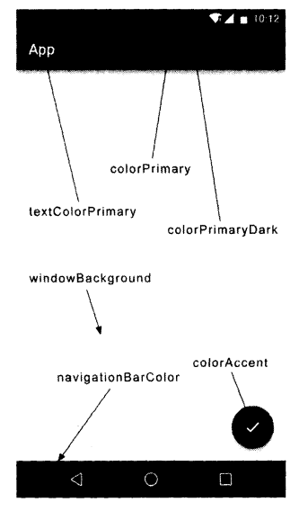
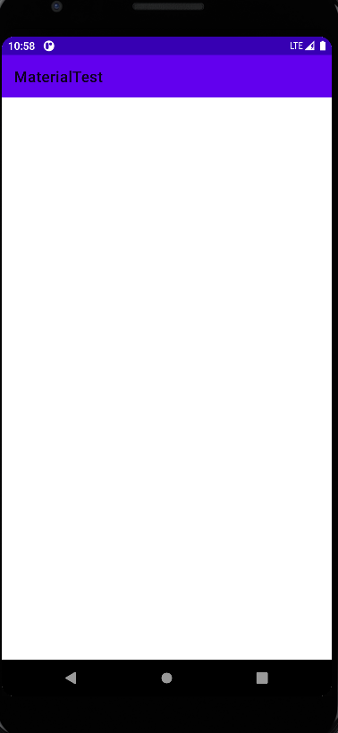
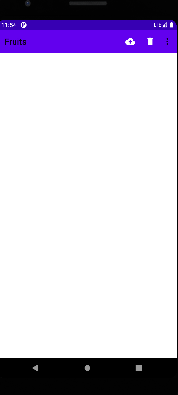
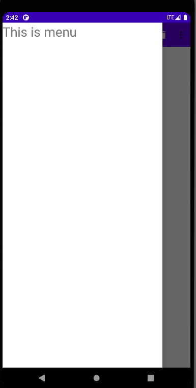
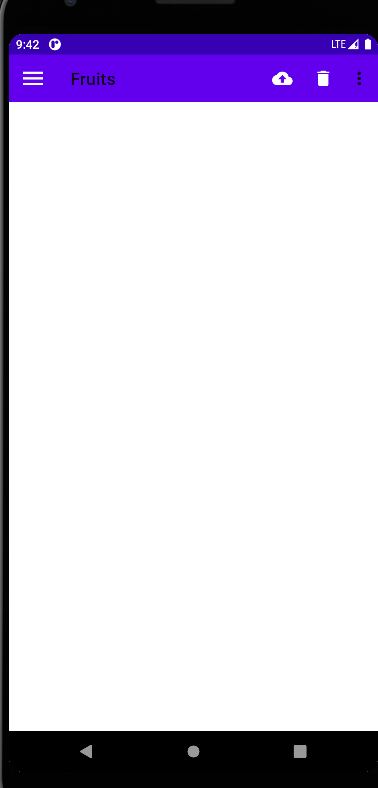
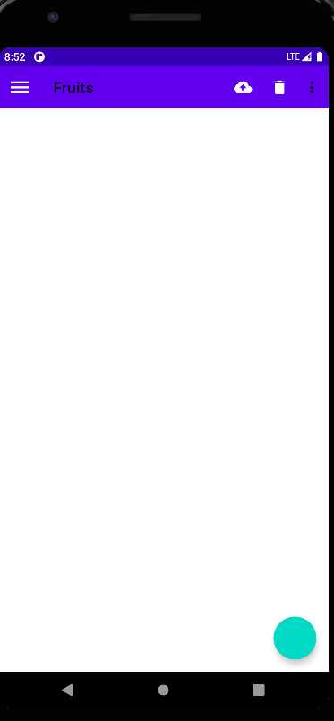
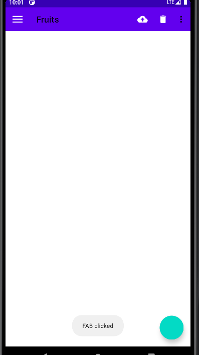
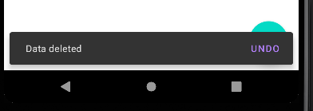
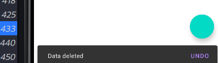

# 第12章 最佳的UI体验——MaterialDesign实战  
&emsp;&emsp;其实长久以来，大多数人都认为Android系统的UI并不算美观，至少没有iOS系统的美观。以至于很多的IT公司在进行应用界面设计的时候，为了保证双平台的统一性，强制性要求Android端的界面风格必须和iOS端一致。这种情况在现实工作当中实在太常见了，虽然我认为这是非常不合理。因为对于一般用户来说，他们不太可能会在两个操作系统上分别去使用同一个应用，但是却必须在同一个操作系统上使用不同的应用。但是却必定会操作系统上使用不同的应用。因此，同一个操作系统中各个应用之间的界面统一性要远比一个应用在双平台的界面统一性重要得多，只有这样，才能给使用者带来更好的用户体验。  
&emsp;&emsp;但问题在于，Android标准的界面设计风格并不是特别被大众所接受，很多公司都觉得自己完全可以设计出更加好看的界面，从而导致Android平台的界面风格长期难以得到统一。为了解决这个问题，谷歌也是祭出了杀手锏，在2014年Google I/O大会上重磅推出亮度一套全新的界面设计语言——Material Design。  

### 12.1 什么是 Material Design  
&emsp;&emsp;Material Design 是由谷歌的设计工程师基于传统优秀的设计原则，结合丰富的创意和科学技术所发明的一套全新的界面设计语言，包含了视觉、运动、互动效果等特性。那么谷歌凭什么认为Material Design就能解决Android平台界面风格不统一的问题呢？一言以蔽之，好看！  
&emsp;&emsp;没错。这次谷歌在界面在界面设计上确实是下足了功夫，很多媒体评论，Material Design的出现使得Android首次在UI方面超越了iOS。按照正常的思维来想，如果各个公司都无法设计出比Material Design更加出色的界面风格，那么它们就应该理所应当地使用Material Design来设计界面，从而也就能解决Android平台界面风格不统一的问题了。  
&emsp;&emsp;为了做出表率，谷歌从Android 5.0 开始，就将所有内置的应用都使用了Material Design风格来进行设计。并且在2015年的Google I/O大会上退出了一个Design Support库，这个库将Material Design中最具有代表性的一些空阿金和效果进行了封装，使得开发者在即使不了解Material Design的情况下也能非常轻松地将自己的应用Material化。b本章中我们就将对Design Support这个库进行深入学习，并且配合一些其他的控件来完成一个优秀的Material Design 应用。新建一个MaterialTest应用。

### 12.2 Toolbar 

&emsp;&emsp;Toolbar将会是我们接触的第一个Material控件。虽然对于Toolbar你暂时应该还是比较陌生的，但是对于它的另一个相关控件ActionBar，你应该有点熟悉了。  
&emsp;&emsp;回忆一下，我们曾经在3.4.1小节为了使用一个自定义的标题栏，而把系统原生的ActionBar影藏掉。没错，每个活动最顶部的那个标题栏其实就是ActionBar，之前我们编写的所有程序里一直都有ActionBar的身影。  
&emsp;&emsp;不过ActionBar由于其设计问题，被限定只能位于活动的顶部，从而不能实现一些Material Design的效果，因此官方现在已经不再使用ActionBar。现在直接讲解更加推荐使用的Toolbar。  
&emsp;&emsp;Toolbar的强大之处在于，它不仅继承了ActionBar的所有功能，而且灵活性很高，可以配合其他控件来完成一些Material Design的效果，下面我们就来具体学习一下。  
&emsp;&emsp;首先你要知道，任何一个新建的项目。默认都是会显示ActionBar的，这个想必你已经见识过太多次了。那么这个ActionBar到底是从哪里来的呢？其实这时根据项目中指定的主题来显示的，打开AndroidManifest.xml文件看一下，如下所示：  

```xml
<?xml version="1.0" encoding="utf-8"?>
<manifest xmlns:android="http://schemas.android.com/apk/res/android"
          package="com.zj970.materialtest">

    <application
            android:allowBackup="true"
            android:icon="@mipmap/ic_launcher"
            android:label="@string/app_name"
            android:roundIcon="@mipmap/ic_launcher_round"
            android:supportsRtl="true"
            android:theme="@style/Theme.MaterialDesign">
        <activity android:name=".MainActivity">
            <intent-filter>
                <action android:name="android.intent.action.MAIN"/>

                <category android:name="android.intent.category.LAUNCHER"/>
            </intent-filter>
        </activity>
    </application>

</manifest>
```
&emsp;&emsp;可以看到，这里使用android:theme属性指定了一个Theme.MaterialDesign的主题，这个是最新的，之前是指定了一个AppTheme的主题。这个主题在哪里定义的呢？打开res/values/themes.xml文件，如下所示：  

```xml
<resources xmlns:tools="http://schemas.android.com/tools">
    <!-- Base application theme. -->
    <style name="Theme.MaterialDesign" parent="Theme.MaterialComponents.DayNight.DarkActionBar">
        <!-- Primary brand color. -->
        <item name="colorPrimary">@color/purple_500</item>
        <item name="colorPrimaryVariant">@color/purple_700</item>
        <item name="colorOnPrimary">@color/white</item>
        <!-- Secondary brand color. -->
        <item name="colorSecondary">@color/teal_200</item>
        <item name="colorSecondaryVariant">@color/teal_700</item>
        <item name="colorOnSecondary">@color/black</item>
        <!-- Status bar color. -->
        <item name="android:statusBarColor" tools:targetApi="l">?attr/colorPrimaryVariant</item>
        <!-- Customize your theme here. -->
    </style>
</resources>
```
&emsp;&emsp;之前的老版本这里会定义一个叫AppTheme的主题，然后指定它的parent主题是Theme.AppCompat.Light.DarkActionBar。这个DarkActionBar是一个深色的ActionBar主题，我们之前所有的项目中自带的ActionBar就是因为指定了这个主题才出现的。同样的，在这里，也是因为指定了DarkActionBar才出现。  
&emsp;&emsp;而现在我们准备使用Toolbar来替代ActionBar，因此需要指定一个不带ActionBar的主题，通常有Theme.AppCompat.NoActionBar和Theme.AppCompat.Light.NoActionBar这两种主题可选。其中Theme.AppCompat.NoActionBar表示深色主题，它会将界面的主体颜色设成深色，陪衬颜色设成淡色。而Theme.AppCompat.Light.NoActionBar表示淡色主题，它会将界面的主题颜色设成淡色，陪衬颜色设成深色。这里我们就修改成：    

```
<style name="Theme.MaterialDesign" parent="Theme.MaterialComponents.DayNight.NoActionBar">
......
</style>
```
&emsp;&emsp;然后观察一下主题中的属性重写，这里重写了colorPrimary、colorPrimaryDark和colorAccent这3个属性的颜色。通过一张图来理解一下：  
  

&emsp;&emsp;可以看到，每个属性所指的颜色位置直接一目了然。除了上述属性之外，我们还可以通过textColorPrimary、windowBackground和navigationBarColor等属性来控制更多位置的颜色。不过维度colorAccent这个属性比较难理解，它不只是用来指定一个按钮的颜色，而是更多表达了一个强调的意思，比如一些控件的选中状态也会使用colorAccent的颜色。  
&emsp;&emsp;现在我们已经将ActionBar隐藏起来了，那么接下来看一看如何使用Toolbar；来替代ActionBar。修改activity_main.xml中的代码：  

```xml
<?xml version="1.0" encoding="utf-8"?>
<FrameLayout
        xmlns:android="http://schemas.android.com/apk/res/android"
        xmlns:tools="http://schemas.android.com/tools"
        android:layout_width="match_parent"
        android:layout_height="match_parent"
        xmlns:app="http://schemas.android.com/apk/res-auto"
        tools:context=".MainActivity">
    <androidx.appcompat.widget.Toolbar
            android:id="@+id/toolbar"
            android:layout_width="match_parent"
            android:layout_height="?android:attr/actionBarSize"
            android:background="?android:attr/colorPrimary"
            android:theme="@style/ThemeOverlay.AppCompat.ActionBar"
            app:popupTheme="@style/ThemeOverlay.AppCompat.Light"/>
</FrameLayout>
```
&emsp;&emsp;虽然这段代码不长，但是里面着实有不少的技术点是需要我们去仔细琢磨一下的。首先看一下第5行，这里使用了xmlns:app指定了一个新的命名空间。思考一下，正是由于每个布局文件都会使用xmlns:android来指定一个命名空间，因此我们才能一直使用android:id、android:layout_width等写法，那么这里指定了一个xmlns:app，也就是说现在可以使用app:attribute这样的写法了。但是为什么这里要指定一个xmlns:app的命名空间呢？这是由于Material Design是在Android 5.0系统中才出现的，而很多的Material属性在5.0之前的系统中是不存在的，为了兼容之前的老系统，我们就不能使用android:attribute这样的写法了，而是应该使用app:attribute。  
&emsp;&emsp;接下来定义了一个Toolbar控件，这里我们给Toolbar指定了一个id，将它的宽度设置了match_parent，高度设置为了actionBar的高度，背景色设置为了colorPrimary。不过下面的部分稍微有点难理解了，由于我们刚才在theme.xml中将程序的主题指定成了淡色主题，因此Toolbar现在也是淡色主题，而Toolbar上面的各种元素就会自动使用深色系，这是为了和主体颜色区别开。但是这个效果看起来就会很差，之前使用ActionBar时文字都是白色的，现在变成黑色的会很难看。那么为了能让Toolbar单独使用深色主题，这里我们使用android:theme属性，将Toolbar的主题指定成了ThemeOverlay.AppCompat.Dark.ActionBar。但是这样指定完了之后又会出现新的问题，如果ToolBar中有菜单按钮（我们在2.2.5小节z中学过），那么弹出的菜单项也会变成深色 主题，这样就再次变得十分难看，于是这里使用了app:popupTheme这个属性是在Android 5.0 系统中新增的，我们使用app:popupTheme的话就可以兼容Android 5.0 以下的系统了。接下来修改MainActivity，代码如下所示：  

```java
package com.zj970.materialtest;

import androidx.appcompat.app.AppCompatActivity;
import android.os.Bundle;
import androidx.appcompat.widget.Toolbar;

public class MainActivity extends AppCompatActivity {

    @Override
    protected void onCreate(Bundle savedInstanceState) {
        super.onCreate(savedInstanceState);
        setContentView(R.layout.activity_main);
        Toolbar toolbar = findViewById(R.id.toolbar);
        setSupportActionBar(toolbar);
    }
}
```
&emsp;&emsp;这里关键的代码只有两句，首先通过findViewById()得到Toolbar的实例，然后调用setSupportActionBar()方法并将Toolbar的实例，这样我们就做到既做到使用ToolBar又让它的外观与功能与ActionBar一致了。运行效果如下所示：  


&emsp;&emsp;这个标题栏我们再熟悉不过了，虽然看上去和之前的标题栏没什么两样，但其实它已经是Toolbar而不是ActionBar了。因此它现在也具备了实现Material Design效果的能力，这个我们在后面就会学到。接下来我们再学习一些Toolbar比较常用的功能，比如修改标题栏上显示的文字内容。这段文字内容是在AndroidManifest.xml中指定的，如下所示：  

```xml
<?xml version="1.0" encoding="utf-8"?>
<manifest xmlns:android="http://schemas.android.com/apk/res/android"
          package="com.zj970.materialtest">

    <application
            android:allowBackup="true"
            android:icon="@mipmap/ic_launcher"
            android:label="@string/app_name"
            android:roundIcon="@mipmap/ic_launcher_round"
            android:supportsRtl="true"
            android:theme="@style/Theme.MaterialDesign">
        <activity android:name=".MainActivity"
                  android:label="Fruits">
            <intent-filter>
                <action android:name="android.intent.action.MAIN"/>

                <category android:name="android.intent.category.LAUNCHER"/>
            </intent-filter>
        </activity>
    </application>

</manifest>
```

&emsp;&emsp;这里给activity增加了一个android:label属性，用于指定在Toolbar中显示的文字内容，如果没有指定的话，会默认使用application中指定的label内容，也就是我们的应用名称。不过只有一个标题的Toolbar看起来太单调了，我们还可以再添加一些action按钮来让Toolbar更加丰富一些，现在右击res目录->New->Directory，创建一个menu文件夹。然后右击menu文件夹->New->Menu resource file ，创建一个toolbar.xml文件，代码如图所示：

```xml
<?xml version="1.0" encoding="utf-8"?>
<menu xmlns:android="http://schemas.android.com/apk/res/android" xmlns:app="http://schemas.android.com/apk/res-auto">
    <item android:id="@+id/backup" android:icon="@drawable/ic_backup" android:title="Backup" app:showAsAction="always"/>
    <item android:id="@+id/delete" android:icon="@drawable/ic_delete" android:title="Delete" app:showAsAction="always"/>
    <item android:id="@+id/settings" android:icon="@drawable/ic_settings" android:title="Settings" app:showAsAction="always"/>
</menu>
```
&emsp;&emsp;接着使用app:showAsAction来指定按钮的显示位置，之所以这里再次使用了app命名空间，同样是为了能够兼容低版本的系统。showAsAction主要有以下几种值可选：always表示永远显示在Toolbar中，如果屏幕空间不够则不显示；iFRoom表示屏幕空间足够的情况下显示在Toolbar中，不够的话就显示在菜单当中；never则表示永远显示在菜单当中。注意，Toolbar中的action按钮只会显示图标，菜单中的action按钮只会显示文字。接下来的做法和2.2.5小节中的完全一致了，修改MainActivity 中的代码：  

```java
package com.zj970.materialtest;

import android.view.Menu;
import android.view.MenuItem;
import android.widget.Toast;
import androidx.annotation.NonNull;
import androidx.appcompat.app.AppCompatActivity;
import android.os.Bundle;
import androidx.appcompat.widget.Toolbar;

public class MainActivity extends AppCompatActivity {

    @Override
    protected void onCreate(Bundle savedInstanceState) {
        super.onCreate(savedInstanceState);
        setContentView(R.layout.activity_main);
        Toolbar toolbar = findViewById(R.id.toolbar);
        setSupportActionBar(toolbar);
    }

    @Override
    public boolean onCreateOptionsMenu(Menu menu){
        getMenuInflater().inflate(R.menu.toolbar,menu);
        return true;
    }

    @Override
    public boolean onOptionsItemSelected(@NonNull MenuItem item) {
        switch (item.getItemId()){
            case R.id.backup:
                Toast.makeText(this, "You clicked Backup", Toast.LENGTH_SHORT).show();
                break;
            case R.id.delete:
                Toast.makeText(this, "You clicked Delete", Toast.LENGTH_SHORT).show();
                break;
            case R.id.settings:
                Toast.makeText(this, "You clicked Settings", Toast.LENGTH_SHORT).show();
                break;
            default:
                break;
        }
        return true;
    }
}
```
&emsp;&emsp;非常简单，我们在onCreateOptionsMenu()方法中加载了toolbar.xml这个菜单文件，然后在onOptionsItemSelected()方法中处理各个按钮的点击事件。现在重新运行一下程序，效果如下所示：

&emsp;&emsp;可以看到，Toolbar上面现在出现了两个action按钮，这时因为Backup按钮指定的显示位置是always，Delete按钮指定的显示位置是ifRoom，而现在屏幕控件很充足，因此两个按钮都会显示在Toolbar中。另外一个Settings按钮由于指定的显示位置never，所以不会显示在Toolbar中，点击一下最右边的菜单按钮来展开菜单项，你就能找到Settings按钮了。另外这些action按钮都是可以响应点击事件的。

## 12.3 滑动菜单  
&emsp;&emsp;滑动菜单可以说是Material Design中最常见的效果之一了，在许多著名的应用（如Gmail、Google+等）中，都有滑动菜单的功能。虽说这个功能看上去好像挺复杂的，不过借助谷歌提供的各种工具，我们可以很轻松地实现非常炫酷的滑动菜单效果。  
### 12.3.1 DrawerLayout  
&emsp;&emsp;所谓的滑动菜单就是将一些菜单选项隐藏起来，而不是放置在主屏幕上，然后可以通过滑动的方式将菜单显示出来。这种方式既节省了屏幕空间、又实现了非常好的动画效果，是Material Design中推荐的做法。  
&emsp;&emsp;不过如果我们全靠自己去实现上述功能的话，难度恐怕就很大了。幸运的是，谷歌提供了一个DrawerLayout控件，借助这个控件，实现滑动菜单简单又方便。  
&emsp;&emsp;先来简单介绍一下DrawerLayout的用法。首先它是一个布局，在布局中允许两个直接子控件，第一个子控件是主屏幕中显示的内容，第二个子控件是滑动菜单中显示的内容。因此，我们就可以对activity_main.xml中的代码做如下修改：  

```xml
<?xml version="1.0" encoding="utf-8"?>

<androidx.drawerlayout.widget.DrawerLayout
        xmlns:android="http://schemas.android.com/apk/res/android"
        xmlns:tools="http://schemas.android.com/tools"
        xmlns:app="http://schemas.android.com/apk/res-auto"
        android:layout_height="match_parent"
        android:layout_width="match_parent"
        tools:context=".MainActivity"
        android:id="@+id/drawer_layout">
    <FrameLayout
            android:layout_width="match_parent"
            android:layout_height="match_parent">
        <androidx.appcompat.widget.Toolbar
                android:id="@+id/toolbar"
                android:layout_width="match_parent"
                android:layout_height="?android:attr/actionBarSize"
                android:background="?android:attr/colorPrimary"
                android:theme="@style/ThemeOverlay.AppCompat.ActionBar"
                app:popupTheme="@style/ThemeOverlay.AppCompat.Light"/>
    </FrameLayout>

    <TextView android:layout_width="match_parent"
              android:layout_height="match_parent"
              android:layout_gravity="start"
              android:textColor="This is menu"
              android:textSize="30sp"
              android:background="#FFF"/>
</androidx.drawerlayout.widget.DrawerLayout>

```
&emsp;&emsp;可以看到，这里最外层的控件使用了DrawerLayout，DrawerLayout中放置了两个子控件，第一个子控件是FrameLayout，用于作为主屏幕中显示的内容，当然里面还有我们刚刚定义的Toolbar。第二个子控件这里使用了一个TextView,用于作为滑动菜单中显示的内容，其实使用什么都可以，DrawerLayout并没有限制只能使用固定的控件。  
&emsp;&emsp;但是关于第二个子控件有一点需要注意，layout_gravity这个属性是必须指定的，因为我们需要告诉DrawerLayout滑动菜单是在屏幕的左边还是右边，指定left表示在滑动菜单在左边，指定right表示滑动菜单在右边。这里指定了start，表示会根据系统语言进行判断，如果系统语言是从左往右的，比如英语、汉语、滑动菜单就在左边，如果系统系统语言是右往左，比如阿拉伯语，滑动菜单就在右边。只需要改动这么多就可以了，现在重新运行一下程序，然后在屏幕的左侧边缘向右拖动，就可以让滑动菜单显示出来，如图所示： 



&emsp;&emsp;然后向左滑动菜单，或者点击一下菜单以外的区域，都可以让滑动菜单关闭，从而回到主界面。不论是展示还是隐藏滑动菜单，都是有非常流畅的动画过渡的。  
&emsp;&emsp;可以看到，我们只是稍微改动了一下布局文件，就能实现如此炫酷的效果，是不是觉得挺激动的。不过现在的滑动还是有点问题，因为只有在屏幕的左侧边缘进行拖动时才能将菜单拖出来，而很多用户可能根本就不知道有这个功能，那么该怎样提示它们呢？  
&emsp;&emsp;Material Design建议的做法是在Toolbar的最左边加入一个导航按钮，点击了按钮也会滑动菜单的内容展示出来。这样就相当于给用户提供两种打开滑动菜单的方式，防止一些用户不知道屏幕的左侧边缘是可以拖动的。然后修改MainActivity中的代码，如下所示：  

```java
package com.zj970.materialtest;

import android.view.Gravity;
import android.view.Menu;
import android.view.MenuItem;
import android.widget.Toast;
import androidx.annotation.NonNull;
import androidx.appcompat.app.ActionBar;
import androidx.appcompat.app.AppCompatActivity;
import android.os.Bundle;
import androidx.appcompat.widget.Toolbar;
import androidx.core.view.GravityCompat;
import androidx.drawerlayout.widget.DrawerLayout;

public class MainActivity extends AppCompatActivity {
    private DrawerLayout mDrawerLayout;
    @Override
    protected void onCreate(Bundle savedInstanceState) {
        super.onCreate(savedInstanceState);
        setContentView(R.layout.activity_main);
        Toolbar toolbar = findViewById(R.id.toolbar);
        setSupportActionBar(toolbar);
        mDrawerLayout = findViewById(R.id.drawer_layout);
        ActionBar actionBar = getSupportActionBar();
        if (actionBar != null){
            actionBar.setDisplayHomeAsUpEnabled(true);
            actionBar.setHomeAsUpIndicator(R.drawable.ic_menu);
        }
    }

    @Override
    public boolean onCreateOptionsMenu(Menu menu){
        getMenuInflater().inflate(R.menu.toolbar,menu);
        return true;
    }

    @Override
    public boolean onOptionsItemSelected(@NonNull MenuItem item) {
        switch (item.getItemId()){
            case android.R.id.home:
                mDrawerLayout.openDrawer(GravityCompat.START);
                break;
            case R.id.backup:
                Toast.makeText(this, "You clicked Backup", Toast.LENGTH_SHORT).show();
                break;
            case R.id.delete:
                Toast.makeText(this, "You clicked Delete", Toast.LENGTH_SHORT).show();
                break;
            case R.id.settings:
                Toast.makeText(this, "You clicked Settings", Toast.LENGTH_SHORT).show();
                break;
            default:
                break;
        }
        return true;
    }
}
```

&emsp;&emsp;这里我们并没有改动多少代码，首先调用findViewById()方法得到了DrawerLayout的实例，然后调用getSupportActionBar()方法得到了ActionBar的实例，虽然这个ActionBar的具体实现是由Toolbar来实现。接着调用ActionBar的setDisplayHomeAsUpEnabled()方法让导航按钮显示出来，又调用了setHomeAdUpIndicator()方法来设置一个导航按钮图标。实际上，Toolbar最左侧的这个按钮就叫做HomeAsUp按钮，它默认的图标是一个返回的箭头，含义是返回上一个活动。很明显，这里我们将它默认的样式和作用进行了修改。  
&emsp;&emsp;接下来在onOptionsItemSelected()方法中对HomeAsUp按钮的点击事件进行处理，HomeAsUp按钮的id永远都是android.R.id.home。然后调用DrawerLayout的openDrawer()方法将滑动菜单展示出来，注意openDrawer()方法要求传入一个Gravity参数，为了保证这里的行为和XML中定义的一致，我们传入了GravityCompat.START。现在运行一下程序：  


## 12.4 悬浮按钮和可交互提示  
&emsp;&emsp;立面设计是Material Design 中一条非常重要的设计思想，也就是说，按照Material Design的理念，应用程序的界面不仅仅只是一个平面，而应该是有立体效果的。在官方给出的示例中，最简单且最代表性的立面设计就是悬浮按钮了，这种按钮不属于主界面平面的一部分，而是位于另外一个纬度，因此就给人一种悬浮的感觉。  
&emsp;&emsp;本节中我们会对这个悬浮按钮的效果进行学习，另外还会学习一种可交互式的提示工具。关于提示工具，我们之前一直都是使用Toast，但是Toast只能用于告知用户某某事情已经发生了，用户却不能对此做出任何的响应，那么今天我们就将在这一方面进行扩展。  

### 12.4.1 FloatingActionButton  
&emsp;&emsp;FloatingActionButton是Design Support库中提供的一个控件，这个控件可以帮助我们比较轻松地实现悬浮按钮的效果。其实在之前图中，我们就已经预览过悬浮按钮是长什么样子的了，它默认会使用colorAccent来作为按钮的颜色，我们还可以通过给按钮指定一个图标来表明这个按钮的作用是什么。  
&emsp;&emsp;下面开始来具体实现。首先仍然需要提前准备好一个图标，然后修改activity_main.xml中的代码，如下所示：  

```xml
<?xml version="1.0" encoding="utf-8"?>

<androidx.drawerlayout.widget.DrawerLayout
        xmlns:android="http://schemas.android.com/apk/res/android"
        xmlns:app="http://schemas.android.com/apk/res-auto"
        android:layout_height="match_parent"
        android:layout_width="match_parent"
        android:id="@+id/drawer_layout">
    <FrameLayout
            android:layout_width="match_parent"
            android:layout_height="match_parent">
        <androidx.appcompat.widget.Toolbar
                android:id="@+id/toolbar"
                android:layout_width="match_parent"
                android:layout_height="?android:attr/actionBarSize"
                android:background="?android:attr/colorPrimary"
                android:theme="@style/ThemeOverlay.AppCompat.ActionBar"
                app:popupTheme="@style/ThemeOverlay.AppCompat.Light"/>
        <com.google.android.material.floatingactionbutton.FloatingActionButton
                android:id="@+id/fab"
                android:layout_gravity="bottom|end"
                android:layout_margin="16dp"
                android:layout_width="wrap_content"
                android:layout_height="wrap_content"/>
    </FrameLayout>

    <TextView android:layout_width="match_parent"
              android:layout_height="match_parent"
              android:layout_gravity="start"
              android:text="This is menu"
              android:textSize="30sp"
              android:background="#FFF"/>
</androidx.drawerlayout.widget.DrawerLayout>

```
&emsp;&emsp;可以看到，layout_width 和layout_height属性都指定成wrap_content，layout_gravity属性指定将这个控件放置于屏幕的右下角，其中end的工作原理和之前的start是一样的，即如果系统语言是从左往右，那么end就表示在右边。如果系统语言是右往左的，那么end就表示在左边。然后通过layout_margin属性给控件的四周留边距，紧贴着屏幕边缘肯定是不好看的，最后通过src属性给FloatingActionButton设置了一个图标。效果如下：  


&emsp;&emsp;一个漂亮的悬浮按钮就在屏幕的右下方出现了。  
&emsp;&emsp;如果你仔细观察的话，会发现这个悬浮按钮的下面还有一点阴影。其实这很好理解，因为FloatingActionButton是悬浮在当前界面上的，既然是悬浮，那么就理所应当会有投影，Design Support库连这种细节都帮我们考虑到了。  
&emsp;&emsp;说到悬浮，其实我们还可以指定FloatingActionButton的悬浮高度，如下所示：  


```
<com.google.android.material.floatingactionbutton.FloatingActionButton
                android:id="@+id/fab"
                android:layout_gravity="bottom|end"
                android:layout_margin="16dp"
                app:elevation="8dp"
                android:layout_width="wrap_content"
                android:layout_height="wrap_content"/>
```

&emsp;&emsp;这里使用app:elevation属性来给FloatingActionButton指定一个高度值，高度值越大，投影范围越大，但是投影效果越淡，高度值越小，投影范围越小，但是投影效果越浓。当然这些效果的差异其实并不怎么明显，我个人感觉使用默认的FloatingActionButton效果就已经足够了。接下来我们看一下FloatingActionButton是如何处理点击事件的，毕竟，一个按钮首先要能点击才有意义。修改MainActivity中的代码，如下所示：  

```java
package com.zj970.materialtest;

import android.view.Gravity;
import android.view.Menu;
import android.view.MenuItem;
import android.view.View;
import android.widget.Toast;
import androidx.annotation.NonNull;
import androidx.appcompat.app.ActionBar;
import androidx.appcompat.app.AppCompatActivity;
import android.os.Bundle;
import androidx.appcompat.widget.Toolbar;
import androidx.core.view.GravityCompat;
import androidx.drawerlayout.widget.DrawerLayout;
import com.google.android.material.floatingactionbutton.FloatingActionButton;

public class MainActivity extends AppCompatActivity {
    private DrawerLayout mDrawerLayout;
    @Override
    protected void onCreate(Bundle savedInstanceState) {
        super.onCreate(savedInstanceState);
        setContentView(R.layout.activity_main);
        Toolbar toolbar = findViewById(R.id.toolbar);
        setSupportActionBar(toolbar);
        mDrawerLayout = findViewById(R.id.drawer_layout);
        ActionBar actionBar = getSupportActionBar();
        if (actionBar != null){
            actionBar.setDisplayHomeAsUpEnabled(true);
            actionBar.setHomeAsUpIndicator(R.drawable.ic_menu);
        }

        FloatingActionButton fab = findViewById(R.id.fab);
        fab.setOnClickListener(new View.OnClickListener() {
            @Override
            public void onClick(View v) {
                Toast.makeText(MainActivity.this, "FAB clicked", Toast.LENGTH_SHORT).show();
            }
        });
    }

    @Override
    public boolean onCreateOptionsMenu(Menu menu){
        getMenuInflater().inflate(R.menu.toolbar,menu);
        return true;
    }

    @Override
    public boolean onOptionsItemSelected(@NonNull MenuItem item) {
        switch (item.getItemId()){
            case android.R.id.home:
                mDrawerLayout.openDrawer(GravityCompat.START);
                break;
            case R.id.backup:
                Toast.makeText(this, "You clicked Backup", Toast.LENGTH_SHORT).show();
                break;
            case R.id.delete:
                Toast.makeText(this, "You clicked Delete", Toast.LENGTH_SHORT).show();
                break;
            case R.id.settings:
                Toast.makeText(this, "You clicked Settings", Toast.LENGTH_SHORT).show();
                break;
            default:
                break;
        }
        return true;
    }
}
```

&emsp;&emsp;如果你在期待FloatingActionButton会有什么特殊用法的话，那可能就要让你失望了，它和普通的Button其实没什么两样，都是调用setOnClickListener()方法来注册一个监听器，当点击按钮时，就会执行监听器中的onClick()方法，这里我们在onClick()方法中弹出一个Toast。现在重新运行一下程序，并点击FloatingActionButton，效果如图所示：  


### 12.4.2 Snackbar  
&emsp;&emsp;现在我们已经掌握了FloatingActionButton的基本用法，不过在上一小节处理点击事件的时候，仍然是使用Toast来作为提示工具。本节学习一下Design Support库提供的更加先进的提示工具——Snackbar。  
&emsp;&emsp;首先要明确，Snackbar并不是Toast的替代品， 它们两者之间有着不同的应用场景。Toast的作用是告诉用户现在发生了什么事情，但同时用户只能被动接收这个事情，因为没有什么办法能够让用户进行选择。而Snackbar则在这方面进行了扩展，它允许在提示当中加入可交互按钮，让用户点击按钮的时候可以执行一些额外的逻辑操作。打个比方，如果我们在执行删除操作的时候只弹出一个Toast提示，那么用户要是误删了某个重要数据的话肯定会非常抓狂，但是我们增加一个Undo按钮，就相当于给用户提供了一种弥补措施。从而大大降低了事故发生的概率，提升了用户体验。Snackbar的用法也非常简单，它和Toast是基本相似的，只不过可以额外增加一个按钮的点击事件。修改MainActivity中的代码，如下所示：  

```java
package com.zj970.materialtest;

import android.view.Gravity;
import android.view.Menu;
import android.view.MenuItem;
import android.view.View;
import android.widget.Toast;
import androidx.annotation.NonNull;
import androidx.appcompat.app.ActionBar;
import androidx.appcompat.app.AppCompatActivity;
import android.os.Bundle;
import androidx.appcompat.widget.Toolbar;
import androidx.core.view.GravityCompat;
import androidx.drawerlayout.widget.DrawerLayout;
import com.google.android.material.floatingactionbutton.FloatingActionButton;
import com.google.android.material.snackbar.Snackbar;

public class MainActivity extends AppCompatActivity {
    private DrawerLayout mDrawerLayout;
    @Override
    protected void onCreate(Bundle savedInstanceState) {
        super.onCreate(savedInstanceState);
        setContentView(R.layout.activity_main);
        Toolbar toolbar = findViewById(R.id.toolbar);
        setSupportActionBar(toolbar);
        mDrawerLayout = findViewById(R.id.drawer_layout);
        ActionBar actionBar = getSupportActionBar();
        if (actionBar != null){
            actionBar.setDisplayHomeAsUpEnabled(true);
            actionBar.setHomeAsUpIndicator(R.drawable.ic_menu);
        }

        FloatingActionButton fab = findViewById(R.id.fab);
        fab.setOnClickListener(new View.OnClickListener() {
            @Override
            public void onClick(View v) {
                Snackbar.make(v,"Data deleted",Snackbar.LENGTH_LONG)
                        .setAction("Undo", new View.OnClickListener() {
                            @Override
                            public void onClick(View v) {
                                Toast.makeText(MainActivity.this, "FAB clicked", Toast.LENGTH_LONG).show();
                            }
                        }).show();
            }
        });
    }

    @Override
    public boolean onCreateOptionsMenu(Menu menu){
        getMenuInflater().inflate(R.menu.toolbar,menu);
        return true;
    }

    @Override
    public boolean onOptionsItemSelected(@NonNull MenuItem item) {
        switch (item.getItemId()){
            case android.R.id.home:
                mDrawerLayout.openDrawer(GravityCompat.START);
                break;
            case R.id.backup:
                Toast.makeText(this, "You clicked Backup", Toast.LENGTH_SHORT).show();
                break;
            case R.id.delete:
                Toast.makeText(this, "You clicked Delete", Toast.LENGTH_SHORT).show();
                break;
            case R.id.settings:
                Toast.makeText(this, "You clicked Settings", Toast.LENGTH_SHORT).show();
                break;
            default:
                break;
        }
        return true;
    }
}
```

&emsp;&emsp;可以看到，这里调用了Snackbar的make()方法来创建一个Snackbar对象，make()方法的第一参数需要传入一个View，只要是当前界面的任意一个View都可以，Snackbar会使用这个View来自动查找最外层的布局，用于展示Snackbar。第二个参数就是Snackbar中显示的内容，第三个参数是Snackbar显示的时长。这些和Toast都是类似的。  
&emsp;&emsp;接着这里又调用了一个setAction()方法来设置一个动作，从而让Snackbar不仅仅是一个提示，而是可以和用户进行交互的。简单起见，我们在动作按钮的点击事件里面弹出一个Toast提示。最后调用show()方法让Snackbar显示出来。现在重新运行一下程序，并点击悬浮按钮，效果如下所示：



&emsp;&emsp;可以看到，Snackbar从屏幕底部出现了，上面有我们所设置的提示文字，还有一个Undo按钮，按钮是可以点击的。过一段时间后Snackbar会自动从屏幕底部消失。不管是出现还是消失，Snackbar都是带有动画效果的，因此视觉体验也会比较好。不过你有没有发现一个bug，这个Snackbar竟然将我们的悬浮按钮给遮挡住了。虽说也不是什么重大的问题，因为Snackbar过一会儿就会自动消失，但这种用户体验总归是不友好的，有没有什么办法能解决一下呢？当然有，只需要借助CoordinatorLayout就可以轻松解决。

### 12.4.3 CoordinatorLayout 

&emsp;&emsp;CoordinatorLayout可以说是一个加强版的FrameLayout，这个布局也是由Design Support库提供的。它在普通情况下的作用和FrameLayout基本上一致，不过既然是Design Support库中提供的布局，那么就必然有一些Material Design的魔力了。  
&emsp;&emsp;事实上，CoordinatorLayout可以监听其所有子控件的各种事件，然后自动帮助我们做出最为合理的响应。举个简单的例子，刚才弹出的Snackbar提示将悬浮按钮遮挡住了，而如果我们能让CoordinatorLayout监听到Snackbar的弹出事件，那么它会自动将内部的FloatingActionButton向上偏移，从而确保不会被Snackbar遮挡住。至于CoordinatorLayout的使用也非常简单，我们只需要将原来的FrameLayout替换一下就可以了；了。修改activity_main.xml中的代码，如下所示：  

```xml
<?xml version="1.0" encoding="utf-8"?>

<androidx.drawerlayout.widget.DrawerLayout
        xmlns:android="http://schemas.android.com/apk/res/android"
        xmlns:app="http://schemas.android.com/apk/res-auto"
        android:layout_height="match_parent"
        android:layout_width="match_parent"
        android:id="@+id/drawer_layout">
    <androidx.coordinatorlayout.widget.CoordinatorLayout
            android:layout_width="match_parent"
            android:layout_height="match_parent">
        <androidx.appcompat.widget.Toolbar
                android:id="@+id/toolbar"
                android:layout_width="match_parent"
                android:layout_height="?android:attr/actionBarSize"
                android:background="?android:attr/colorPrimary"
                android:theme="@style/ThemeOverlay.AppCompat.ActionBar"
                app:popupTheme="@style/ThemeOverlay.AppCompat.Light"/>
        <com.google.android.material.floatingactionbutton.FloatingActionButton
                android:id="@+id/fab"
                android:layout_gravity="bottom|end"
                android:layout_margin="16dp"
                app:elevation="8dp"
                android:layout_width="wrap_content"
                android:layout_height="wrap_content"/>
    </androidx.coordinatorlayout.widget.CoordinatorLayout>

    <TextView android:layout_width="match_parent"
              android:layout_height="match_parent"
              android:layout_gravity="start"
              android:text="This is menu"
              android:textSize="30sp"
              android:background="#FFF"/>
</androidx.drawerlayout.widget.DrawerLayout>
```

&emsp;&emsp;由于CoordinatorLayout本身就是一个加强版的FrameLayout，因此这种替换不会有任何的副作用。现在重新运行一下程序，并点击悬浮按钮，效果如下所示：  



&emsp;&emsp;可以看到，悬浮按钮自动向上偏移了Snackbar的同等高度，从而确保不会被遮挡住，当Snackbar消失的时候，悬浮按钮会自动向下偏移回到原来位置。  
&emsp;&emsp;另外悬浮按钮的向上和向下偏移也是伴随这动画效果，且和Snackbar完全同步，整体效果看上去特别赏心悦目。  
&emsp;&emsp;不过我们回过头再思考一下，刚才说的是CoordinatorLayout可以监听其所有子控件的各种事件，但是Snackbar好像并不是CoordinatorLayout的子控件吧，为什么它却可以被监听到呢？  
&emsp;&emsp;其实道理很简单，还记得我们在Snackbar的make()方法中传入的第一个参数呢？这个参数就是用来指定Snackbar是基于哪个View来触发的，刚才我们传入的是FloatingActionButton本身，而FloatingActionButton是CoordinatorLayout中的子控件，因此这个事件就理所应当能被监听到了。你可以自己再做个实验，如果给Snackbar的make()方法传入一个DrawerLayout，那么Snackbar就会再次遮挡住悬浮按钮，因为DrawerLayout不是CoordinatorLayout中的子控件，CoordinatorLayout也就无法监听到Snackbar的弹出和隐藏事件了。接下来我们继续丰富MaterialTest项目，加入卡片式布局效果。  
