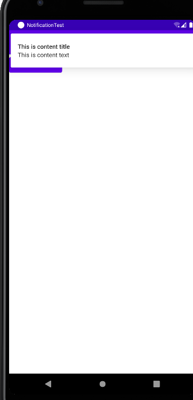
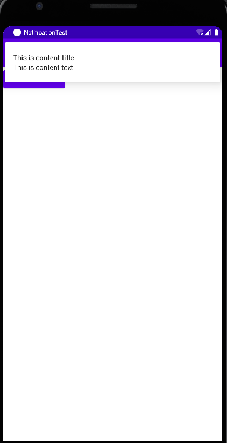
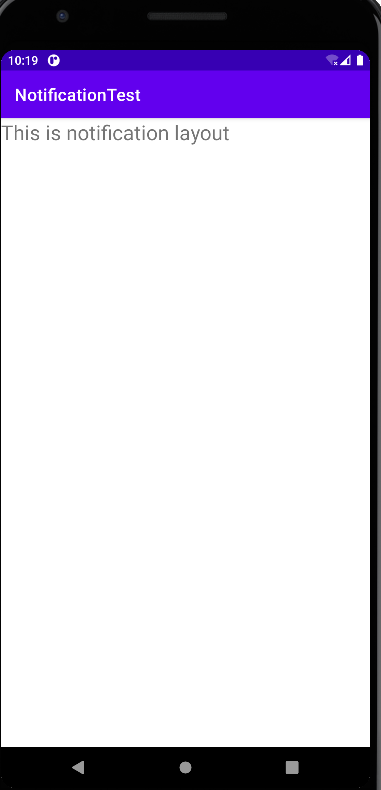
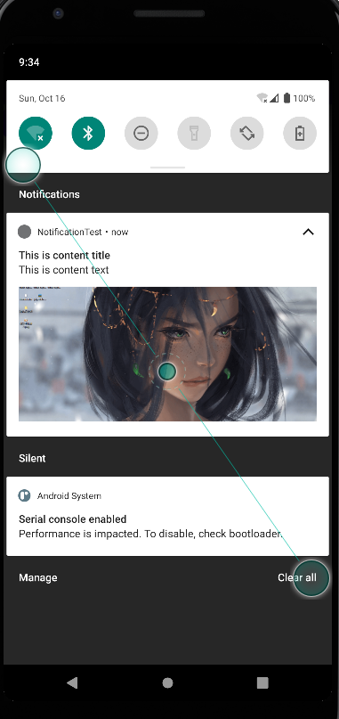
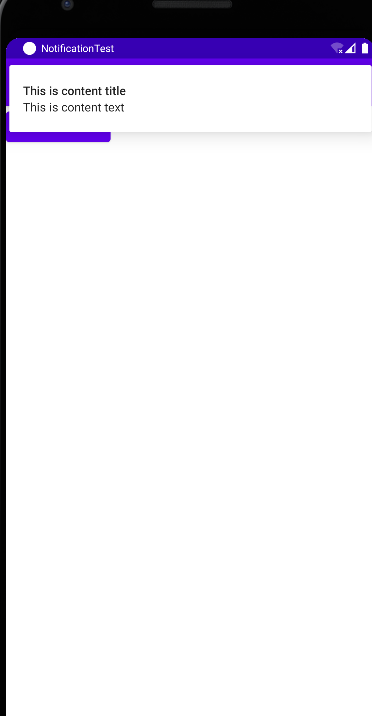

## 第8章 丰富你的程序——运用手机多媒体
&emsp;&emsp;在过去，手机的功能都比较单调，仅仅就是用来打电话和发短信的。而如今，手机在我们的生活中正扮演着越来越重要的角色，各种娱乐方式都可以在手机上进行。上班的路上太无聊，可以戴着耳机听音乐。外出旅游的时候，可以在手机上看电影。  
&emsp;&emsp;众多的娱乐方式少不了强大的多媒体功能的支持，而Android在这方面也做的非常出色。它提供了一系列的API，使得我们可以在程序中调用很多手机的多媒体资源，从而编写出更加丰富多彩的应用程序。

### 8.1 将程序运行到手机上

&emsp;&emsp;首先通过USB数据线把手机连接到电脑上。然后在手机进入到设置-》开发者选项界面，并在这个界面中勾选中USB调试选项。  
&emsp;&emsp;注意从Android 4.2 系统开始，开发者选项默认是隐藏的，你需要先进入到“关于手机”界面。然后对着最下面的版本号连续点击，就会让开发者选项显示出来。如果在Windows系统中，需要下载 Google USB tools ，在 SDK Manager -> tools中下载，如果是在Linux下，需要配置rules

### 8.2 使用通知
&emsp;&emsp;通知(Notification)是Android系统比较有特色的一个功能，当某个应用程序希望向用户发出一些提示信息，而该应用程序又不在前台运行的时候，就可以借助通知来实现。发出一条通知后，手机最上方的状态栏中会显示一个通知的图标，下拉状态栏后可以看到通知的详细内容。Android的通知功能获得了大量用户的认可和喜爱，就连ios系统也在5.0之后加入了类似的功能。

#### 8.2.1 通知的基本用法  
&emsp;&emsp;了解了通知的基本概念，下面我们就来看一下通知的使用方法吧。通知的用法还是比较灵活的，既可以在活动里创建，也可以在广播接收器里创建，也可以在服务里创建。相比广播接收器和服务，在活动里创建通知的场景还是比较少的，因为一般只有当程序进入到后台的时候我们才需要使用通知。  
&emsp;&emsp;不过，无论是在哪里创建通知，整体步骤都是相同的。首先需要一个NotificationManager来对通知进行管理，可以调用Context的getSystemService()方法获取到。getSystemService()方法接收一个字符串参数用于确定系统的哪个服务，这里我们传入Context.NOTIFICATION_SERVICE即可。因此，获取NotificationManager的实例就可以写成：  
```
NotificationManager manager = (NotificationManager) getSystemService(Context.NOTIFICATION_SERVICE);
```
&emsp;&emsp;接下来需要使用到一个Builder构造器来创建Notification对象，但问题在于，几乎Android系统的每一个版本都会对通知这个部分功能进行或多或少的修改，API不稳定性问题在通知上面突显得尤其严重。那么该如何解决这个问题呢？就是使用support库中提供的兼容API。support-v4库中提供了一个NotificationCompat类，使用这个类的构造器来提供创建Notification对象，就可以保证我们的程序在所有Android系统版本上都能正常工作了，代码如下：

```
Notification notification = new NotificationCompat.Builder(context).build();
```

&emsp;&emsp;当然，上述代码只是创建了一个空的Notification对象，并没有什么实际作用，我们可以在最终的build()方法之前连缀任意多的方法设置来创建一个丰富的Notification对象，先来看一些最基本的设置:

```
Notification notification = new NotificationCompat.Builder(context)
                            .setContentTitle("This is content title")
                            .setContentText("This is content text")
                            .setWhen(System.currentTimeMillis())
                            .setSmallIcon(R.drawble.small_icon)
                            .setLargeIcon(BitmapFactory.decodeResource(getResources(),R.drawable.large_icon))
                            .build();
```

&emsp;&emsp;上述的代码中一共调用了5个设置方法，setContentTitle()方法用于指定通知的标题内容，下拉系统状态栏就可以看到这部分内容。setContentText()方法用于指定通知的正文内容，同样下拉系统状态栏就可以看到这部分内容。setWhen()方法用于指定通知被创建的时间，以毫秒为单位，当下拉系统状态栏时，这里指定的时间会显示在相应的通知上。setSmallIcon()方法用于设置通知的小图标，注意只能使用纯alpha图层的图片进行设置，小图标会显示在系统状态栏上。setLargeIcon()方法用于设置通知的大图标，当下拉系统状态栏时，就可以看到设置的大图标了。  
&emsp;&emsp;以上工作都完成之后，只需要调用NotificationManager的notify()方法就可以让通知显示出来了。notify()方法接收两个参数，第一个参数是id，要保证为每个通知所指定的id都是不同的。第二个参数则是Notification对象，这里直接将我们刚刚创建好的Notification对象传入即可。因此，显示一个通知就可以写成：

```
manger.notify(1,notification);
```
&emsp;&emsp;到这里已经把创建通知的每一个步骤都分析完了。下面新建一个NotificationTest模块，并修改activity_main.xml中的代码:

```xml
<?xml version="1.0" encoding="utf-8"?>
<LinearLayout
        xmlns:android="http://schemas.android.com/apk/res/android"
        xmlns:tools="http://schemas.android.com/tools"
        android:layout_width="match_parent"
        android:layout_height="match_parent"
        tools:context=".MainActivity"
        android:orientation="vertical">
    <Button android:id="@+id/send_notice"
            android:layout_width="wrap_content"
            android:layout_height="wrap_content"
            android:text="Send Notice"
            android:textAllCaps="false"/>
</LinearLayout>
```
布局非常简单，里面只有一个Send notice 按钮，用于发出一条通知。接下来修改MainActivity中的代码：

```java
package com.zj970.notificationtest;

import android.app.Notification;
import android.app.NotificationManager;
import android.graphics.BitmapFactory;
import android.view.View;
import android.widget.Button;
import androidx.appcompat.app.AppCompatActivity;
import android.os.Bundle;
import androidx.core.app.NotificationCompat;

public class MainActivity extends AppCompatActivity implements View.OnClickListener{

    @Override
    protected void onCreate(Bundle savedInstanceState) {
        super.onCreate(savedInstanceState);
        setContentView(R.layout.activity_main);
        Button sendNotice = findViewById(R.id.send_notice);
        sendNotice.setOnClickListener(this::onClick);
    }

    @Override
    public void onClick(View v) {
            switch (v.getId()){
                case R.id.send_notice:
                    sendNotice();
                    break;
                default:
                    break;
            }
    }

    private void sendNotice(){
        NotificationManager manager = (NotificationManager) getSystemService(NOTIFICATION_SERVICE);
        Notification notification = new NotificationCompat.Builder(this)
                .setContentTitle("This is content title")
                .setContentText("This is content text")
                .setWhen(System.currentTimeMillis())
                .setSmallIcon(R.mipmap.ic_launcher)
                .setLargeIcon(BitmapFactory.decodeResource(getResources(),R.mipmap.ic_launcher_round)).build();
                manager.notify(1,notification);
    }

}
```
&emsp;&emsp;可以看到，我们在Send notice按钮的点击事件里面完成了通知的创建工作。这里简单起见，将通知栏的图标分别设置了。现在运行一下程序，点击按钮，你会在系统通知栏边缘看到图标。



&emsp;&emsp;在Android 26 以上需要才用新的方式来通知：

```java
package com.zj970.notificationtest;

import android.app.Notification;
import android.app.NotificationChannel;
import android.app.NotificationManager;
import android.app.PendingIntent;
import android.content.Context;
import android.content.Intent;
import android.graphics.BitmapFactory;
import android.os.Build;
import android.view.View;
import android.widget.Button;
import androidx.annotation.RequiresApi;
import androidx.appcompat.app.AppCompatActivity;
import android.os.Bundle;
import androidx.core.app.NotificationCompat;

public class MainActivity extends AppCompatActivity implements View.OnClickListener{

    @Override
    protected void onCreate(Bundle savedInstanceState) {
        super.onCreate(savedInstanceState);
        setContentView(R.layout.activity_main);
        Button sendNotice = findViewById(R.id.send_notice);
        sendNotice.setOnClickListener(this::onClick);
    }

    @Override
    public void onClick(View v) {
            switch (v.getId()){
                case R.id.send_notice:
                    if (Build.VERSION.SDK_INT < Build.VERSION_CODES.O){
                        //sdk 26 以下可以实现
                        sendNotice();
                    } else {
                        createNotificationChannel("message","消息",NotificationManager.IMPORTANCE_HIGH);
                        sendNotification("This is content title","This is content text");
                    }
                    break;
                default:
                    break;
            }
    }

    /**
     * sdk26
     */
    private void sendNotice(){
        NotificationManager manager = (NotificationManager) getSystemService(NOTIFICATION_SERVICE);
        Notification notification = new NotificationCompat.Builder(this)
                .setContentTitle("This is content title")
                .setContentText("This is content text")
                .setWhen(System.currentTimeMillis())
                .setSmallIcon(R.mipmap.ic_launcher)
                .setLargeIcon(BitmapFactory.decodeResource(getResources(),R.mipmap.ic_launcher_round)).build();
                manager.notify(1,notification);
    }

    @RequiresApi(api = Build.VERSION_CODES.O)
    private void createNotificationChannel(String channelId, String channelName, int importance){
        NotificationChannel notificationChannel = new NotificationChannel(channelId,channelName,importance);
        NotificationManager manager = (NotificationManager) getSystemService(NOTIFICATION_SERVICE);
        manager.createNotificationChannel(notificationChannel);
    }

    private void sendNotification(String title, String content) {
        Intent intent = new Intent(this, MainActivity.class);
        PendingIntent pendingIntent = PendingIntent.getActivity(this, R.string.app_name, intent, PendingIntent.FLAG_UPDATE_CURRENT);
        NotificationCompat.Builder builder = new NotificationCompat.Builder(this, "message");
        builder.setContentIntent(pendingIntent).setAutoCancel(true).setSmallIcon(R.mipmap.ic_launcher).setTicker("提示消息").setWhen(System.currentTimeMillis())
                .setLargeIcon(BitmapFactory.decodeResource(this.getResources(), R.mipmap.ic_launcher_round)).setContentTitle(title).setContentText(content);
        Notification notification = builder.build();
        NotificationManager notificationManager = (NotificationManager) this.getSystemService(Context.NOTIFICATION_SERVICE);
        notificationManager.notify(1, notification);
    }


}
```
效果图如下：



&emsp;&emsp;如果你使用过Android手机，此时应该会下意识地认为这条通知是可以点击的。但是当你去点击它的时候，你会发现没有任何效果。要实现通知的点击效果，我们还需要在代码中进行相应的设置，这就涉及了一个新的概念：PendingIntent。  
&emsp;&emsp;PendingIntent从名字上看起来就和Intent有些类似，它们之间也确实存在着不少共同点。比如它们都可以去指定某一个“意图“，都可以用于启动活动、启动服务以及发送广播等。不同的是，Intent更加倾向去执行某个动作，而PendingIntent更加倾向于在某个合适的时机去执行某个动作。所以，也可以把PendingIntent简单地理解为延迟执行的Intent。  
&emsp;&emsp;PendingIntent的用法同样很简单，它主要提供了几个静态方法用于获取PendingIntent的实例，可以根据需求来选择是使用getActivity()方法、getBroadcast()方法，还是getService()方法。这几个方法所接收的参数都是相同的，第一个参数依旧是Context，第二个参数一般用不到，通常都是传入0即可。第三个参数是一个Intent对象，我们可以通过这个对象构建出PendingIntent的“意图”。第四个参数用于确定PendingIntent的行为，有FLAG_ONE_SHOT、FLAG_NO_CREATE、FLAG_CANCEL_CURRENT和FLAG_UPDATE_CURRENT这4种值可选，每种值的具体含义可以查看文档，通常这个参数传入0就可以了。  
&emsp;&emsp;对PendingIntent有了一定的了解之后，再回头看一个NotificationCompat.Builder。这个构造器还可以再连缀一个setContentIntent()方法，接收的参数正是一个PendingIntent对象。因此，这里就可以通过PendingIntent构建出一个延迟执行的“意图”，当用户点击这条通知时就会执行相应的逻辑。  
&emsp;&emsp;现在优化一下NotificationTest项目，给刚才的通知加上点击功能，让用户点击它的时候可以启动另一个活动。首先需要准备好另一个活动，点击包->new->Activity->Empty Activity，新建NotificationActivity，布局命名为notification_layout。然后修改代码：

```xml
<?xml version="1.0" encoding="utf-8"?>
<RelativeLayout
        xmlns:android="http://schemas.android.com/apk/res/android"
        xmlns:tools="http://schemas.android.com/tools"
        android:layout_width="match_parent"
        android:layout_height="match_parent"
        tools:context=".NotificationActivity">
    <TextView android:layout_width="wrap_content"
              android:layout_height="wrap_content"
              android:text="This is notification layout"
              android:textSize="24sp"
            />

</RelativeLayout>
```
这样就把NotificationActivity这个活动准备好了，下面我们修改MainActivity中的代码，给通知加入点击功能，如下所示：

```
Intent intent = new Intent(this,NotificatinActivity.class);
PendingIntent pi = PendingIntent.getActivity(this,0,inten,0);
        NotificationCompat.Builder builder = new NotificationCompat.Builder(this, "message");
        builder.setContentIntent(pi)
                .setAutoCancel(true)
                .setSmallIcon(R.mipmap.ic_launcher)
                .setTicker("提示消息")
                .setWhen(System.currentTimeMillis())
                .setLargeIcon(BitmapFactory.decodeResource(this.getResources(), R.mipmap.ic_launcher_round))
                .setContentTitle(title).setContentText(content);

```
&emsp;&emsp;可以看到，这里先是使用Intent表达出我们想要启动NotificationActivity的“意图”，然后将构建好的Intent对象传入到PendingIntent的getActivity()方法里，以得到PendingIntent的实例，接着在NotificationCompat.Builder中调用setContentIntent()方法，把它作为参数传入即可。现在重新运行一下程序，点击按钮下拉系统状态栏点击一下该通知，就会看到NotificationActivity这个活动的界面，如下所示



&emsp;&emsp;系统状态上的通知图标还没有消失，我们需要对该通知进行取消。解决的方法有两种，一种是在NotificationCompat.Builder中再连缀一个setAutoCancel()方法，一种是显示地调用NotificationManager的cancel()方法将它取消了。

- 第一种方法写如下

```
        NotificationCompat.Builder builder = new NotificationCompat.Builder(this, "message");
        builder.setContentIntent(pendingIntent)
                .setAutoCancel(true)
                .setSmallIcon(R.mipmap.ic_launcher)
                .setTicker("提示消息")
                .setWhen(System.currentTimeMillis())
                .setLargeIcon(BitmapFactory.decodeResource(this.getResources(), R.mipmap.ic_launcher_round))
                .setContentTitle(title).setContentText(content);
```
可以看到，setAutoCancel()方法传入true，就表示当点击这个通知的时候，通知会自动取消。

- 第二种方法写法如下：

```java
package com.zj970.notificationtest;

import android.app.NotificationManager;
import androidx.appcompat.app.AppCompatActivity;
import android.os.Bundle;

public class NotificationActivity extends AppCompatActivity {

    @Override
    protected void onCreate(Bundle savedInstanceState) {
        super.onCreate(savedInstanceState);
        setContentView(R.layout.notification_layout);
        NotificationManager manager = (NotificationManager) getSystemService(NOTIFICATION_SERVICE);
        manager.cancel(1);
    }
}
```

&emsp;&emsp;这里我们在cancel()方法中传入了1，这个1就是创建通知的时候给每条通知指定的id。如果想要取消哪条通知，在cancel90方法中传入该通知的id就可以了。

#### 通知的进阶技巧

&emsp;&emsp;上一节中创建的通知属于最基本的通知，实际上，NotificationCompat.Builder中提供了非常丰富的API来让我们创建出更加多样的通知效果，这里选取比较常用的API学习。先来看看setSound()方法，它可以在通知发出的时候播放一段音频，这样就能更好地通知用户有通知到来。setSound()方法接收一个Uriz参数，所以在指定音频文件的时候还需要先获取到音频文件对应的URI。比如说，每个手机的/system/media/auto/ringtones目录下都有很多的音频文件，我们可以从中随便挑选一个音频文件，在代码中可以这样指定：

```
Notification notification = new NotificaitionCpmpat.BUilder(this)
.setSound(Uei.fromFile(new File("/system/media/audio/ringtones/MiHouse.ogg"))).build();
```
&emsp;&emsp;除了允许播放音频外，我们还可以在通知到来的时候让手机进行振动，使用的是vibrate这个属性。它是一个长整型的数组，用于设置手机静止和振动的时长，以毫秒为单位。下表为0的值表示手机静止的时长，下标为1的值表示手机振动的时长，下标为2的值又表示手机静止的时长，以此类推。所以如果想要手机通知到来的时候立刻振动1秒，然后静止1秒，再振动1秒，代码可以写成：

```
Notification notification = new NotificaitionCpmpat.BUilder(this)
.setSound(Uei.fromFile(new File("/system/media/audio/ringtones/MiHouse.ogg")))
.setVibrate(new long[]{0,1000,1000,1000}).build();
```

&emsp;&emsp;不过，想要控制手机振动还需要声明权限的。因此，我们还需要编辑AndroidManifest.xml文件，加入如下声明： 

```
<uses-permmission android:name="android.permission.VRIBRATE"/>
```
&emsp;&emsp;学会了控制通知的声音和振动，下面看一下如何在通知的时候控制手机LED灯的显示。现在手机基本上都会前置一个LED灯，当有未接电话或未读短信，而此时手机又处于锁屏状态时，LED灯就会不停闪烁，提醒用户去查看。我们可以使用setLights()方法来实现这种效果，setLights()方法接收3个参数，第一个参数用于指定LED灯的颜色，第二个参数用于指定LED灯亮起的时长，以毫秒为单位，第三个参数用于指定LED灯暗去的时长，也是以毫秒为单位。所以，当通知到来的时候，如果想要实现LED灯以绿色的灯光一闪一闪的效果，可以写成： 

```
Notification notification = new NotificaitionCpmpat.BUilder(this)
.setSound(Uri.fromFile(new File("/system/media/audio/ringtonges/luna.ogg")))
.setVibrate(new long[]{0,1000,1000,1000})
.setLights(Color.GREEN,1000,1000)
.build();
```
当然，如果你不想进行那么多繁琐的设置，也可以直接使用通知的默认效果，他会根据当前手机的环境来确定播放什么铃声，以及如何振动：

```
Notification notification = new NotificaitionCpmpat.BUilder(this)
.setDefaults(NotificationCompat.DEFAULT_ALL)
.build();
```
以上需要在真机上才能看到效果。

#### 8.2.3 通知的高级功能

&emsp;&emsp;继续观察NotificationCompat.Builder这个类，你会发现里面还有很多API是我们没有使用过的。那么下面我们就来学习一些更加强大的API的用法，从而构建出更加丰富的通知效果。  
&emsp;&emsp;先来看看setStyle()方法，这个方法允许我们构建出富文本的通知的通知内容。也就是说比如这样写：

```
Notification notification = new NotificaitionCpmpat.BUilder(this)
.setDefaults(NotificationCompat.DEFAULT_ALL)
.setContentText("Learn how to build notifications,send and sync data,and use voice actions.Get the official Android IDE and developer tools to build apps for Android.")
.build();
```

&emsp;&emsp;可以看到，通知内容是无法显示完整的，多余的部分会用省略号代替。其实这也很正常，因为通知的内容就应该言简意赅，详细内容放到点击后打开的活动当中会更加合适。  
&emsp;&emsp;但是如果真的非常需要在通知当中显示一段长文字，Android也是非常的，通过setStyle()方法就可以做到，具体写法如下：

```
Notification notification = new NotificaitionCpmpat.BUilder(this)
.setDefaults(NotificationCompat.DEFAULT_ALL)
.setContentText(new NotificationCompat.BigTextStyle().bigText("Learn how to build notifications,send and sync data,and use voice actions.Get the official Android IDE and developer tools to build apps for Android."))
.build();
```

&emsp;&emsp;我们在setStyle()方法中创建了一个NotificationCompat.BigTextStyle对象，这个对象就是用于封装长文字信息的，我们调用它的bigText()方法并将文字内容传入就可以了。除了显示长文字之外，通知里还可以显示一张大图片，具体用法也是基本相似的：

```
Notification notification = new NotificaitionCpmpat.BUilder(this)
.setStyle(new NotificationCompat.BigPictureStyle().bigPicture(BigmapFactory.decodeResource(getResources(),R.drawable.big_image)))
.build();
```

&emsp;&emsp;可以看到，这里仍然是调用的setStyle()方法，这次我们在参数中创建了一个NotificationCompat.BigPictureStyle对象，这个对象就是用于设置大图片的，然后调用它的bigPicture()方法并将图片传入。这里事先准备好一张图片，通过BitmapFactory的decodeResource()方法将图片解析成BitMap对象，再传入到bigPicture()方法中就可以为了。效果如下：



&emsp;&emsp;这样我们就把setStyle()方法中的重要内容基本都掌握了。接下来再学习一下setPriority()方法，它可以用于设置通知的重要程度。setPriority()方法接收一个整型参数用于设置这条通知的重要程度，一共有5个常量值可选：PRIORITY_DEFAULT表示默认的重要程度，和不设置效果是一样的；PRIORITY_MIN表示最低的种农药程度，系统可能只会在特定的场景才显示这条通知，比如用户下拉状态的时候；PRIORITY_LOW表示较低的重要程度，系统可能会将这类通知缩小，或改变其显示的顺序，将其排在更重要的通知之后；PRIORITY_HIGH表示较高的重要程度，系统可能会将这类通知放大，或改变其显示的顺序，将其排在比较靠前的位置；PRIORITY_MAX百世最高的重要程度，这类通知消息必须要让用户立刻看到，甚至需要用户做出响应操作。具体写法如下：

```
Notification notification = new NotificaitionCpmpat.BUilder(this)
.setPriority(NotificationCompat.PRIORITY_MAX)
.build();
```
&emsp;&emsp;这里我们将通知的重要程度设置成了最高，表示这是一条非常重要的通知，要求用户必须立刻看到。现在重新运行一下程序，并点击按钮，效果如下所示：



&emsp;&emsp;可以看到，这次的通知不是在系统状态栏显示一个小图标，而是弹出了一个横幅，并附带了通知的详细内容，这是一条非常重要的通知。不管用户现在是在玩游戏还是看电影，这条通知都会显示在最上方，以此引起用户的注意。