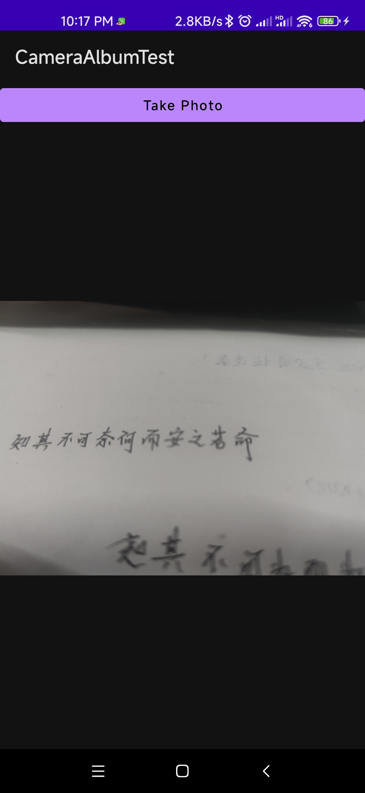
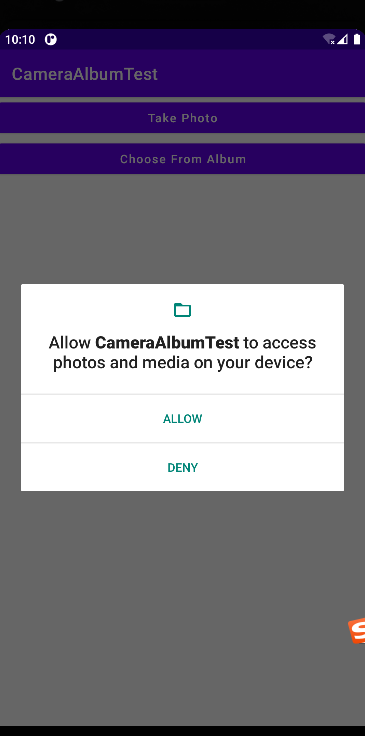
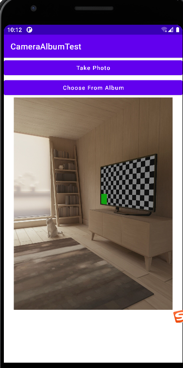

## 第8章 丰富你的程序——运用手机多媒体
&emsp;&emsp;在过去，手机的功能都比较单调，仅仅就是用来打电话和发短信的。而如今，手机在我们的生活中正扮演着越来越重要的角色，各种娱乐方式都可以在手机上进行。上班的路上太无聊，可以戴着耳机听音乐。外出旅游的时候，可以在手机上看电影。  
&emsp;&emsp;众多的娱乐方式少不了强大的多媒体功能的支持，而Android在这方面也做的非常出色。它提供了一系列的API，使得我们可以在程序中调用很多手机的多媒体资源，从而编写出更加丰富多彩的应用程序。

### 8.1 将程序运行到手机上

&emsp;&emsp;首先通过USB数据线把手机连接到电脑上。然后在手机进入到设置-》开发者选项界面，并在这个界面中勾选中USB调试选项。  
&emsp;&emsp;注意从Android 4.2 系统开始，开发者选项默认是隐藏的，你需要先进入到“关于手机”界面。然后对着最下面的版本号连续点击，就会让开发者选项显示出来。如果在Windows系统中，需要下载 Google USB tools ，在 SDK Manager -> tools中下载，如果是在Linux下，需要配置rules

### 8.2 使用通知
&emsp;&emsp;通知(Notification)是Android系统比较有特色的一个功能，当某个应用程序希望向用户发出一些提示信息，而该应用程序又不在前台运行的时候，就可以借助通知来实现。发出一条通知后，手机最上方的状态栏中会显示一个通知的图标，下拉状态栏后可以看到通知的详细内容。Android的通知功能获得了大量用户的认可和喜爱，就连ios系统也在5.0之后加入了类似的功能。

#### 8.2.1 通知的基本用法  
&emsp;&emsp;了解了通知的基本概念，下面我们就来看一下通知的使用方法吧。通知的用法还是比较灵活的，既可以在活动里创建，也可以在广播接收器里创建，也可以在服务里创建。相比广播接收器和服务，在活动里创建通知的场景还是比较少的，因为一般只有当程序进入到后台的时候我们才需要使用通知。  
&emsp;&emsp;不过，无论是在哪里创建通知，整体步骤都是相同的。首先需要一个NotificationManager来对通知进行管理，可以调用Context的getSystemService()方法获取到。getSystemService()方法接收一个字符串参数用于确定系统的哪个服务，这里我们传入Context.NOTIFICATION_SERVICE即可。因此，获取NotificationManager的实例就可以写成：  
```
NotificationManager manager = (NotificationManager) getSystemService(Context.NOTIFICATION_SERVICE);
```
&emsp;&emsp;接下来需要使用到一个Builder构造器来创建Notification对象，但问题在于，几乎Android系统的每一个版本都会对通知这个部分功能进行或多或少的修改，API不稳定性问题在通知上面突显得尤其严重。那么该如何解决这个问题呢？就是使用support库中提供的兼容API。support-v4库中提供了一个NotificationCompat类，使用这个类的构造器来提供创建Notification对象，就可以保证我们的程序在所有Android系统版本上都能正常工作了，代码如下：

```
Notification notification = new NotificationCompat.Builder(context).build();
```

&emsp;&emsp;当然，上述代码只是创建了一个空的Notification对象，并没有什么实际作用，我们可以在最终的build()方法之前连缀任意多的方法设置来创建一个丰富的Notification对象，先来看一些最基本的设置:

```
Notification notification = new NotificationCompat.Builder(context)
                            .setContentTitle("This is content title")
                            .setContentText("This is content text")
                            .setWhen(System.currentTimeMillis())
                            .setSmallIcon(R.drawble.small_icon)
                            .setLargeIcon(BitmapFactory.decodeResource(getResources(),R.drawable.large_icon))
                            .build();
```

&emsp;&emsp;上述的代码中一共调用了5个设置方法，setContentTitle()方法用于指定通知的标题内容，下拉系统状态栏就可以看到这部分内容。setContentText()方法用于指定通知的正文内容，同样下拉系统状态栏就可以看到这部分内容。setWhen()方法用于指定通知被创建的时间，以毫秒为单位，当下拉系统状态栏时，这里指定的时间会显示在相应的通知上。setSmallIcon()方法用于设置通知的小图标，注意只能使用纯alpha图层的图片进行设置，小图标会显示在系统状态栏上。setLargeIcon()方法用于设置通知的大图标，当下拉系统状态栏时，就可以看到设置的大图标了。  
&emsp;&emsp;以上工作都完成之后，只需要调用NotificationManager的notify()方法就可以让通知显示出来了。notify()方法接收两个参数，第一个参数是id，要保证为每个通知所指定的id都是不同的。第二个参数则是Notification对象，这里直接将我们刚刚创建好的Notification对象传入即可。因此，显示一个通知就可以写成：

```
manger.notify(1,notification);
```
&emsp;&emsp;到这里已经把创建通知的每一个步骤都分析完了。下面新建一个NotificationTest模块，并修改activity_main.xml中的代码:

```xml
<?xml version="1.0" encoding="utf-8"?>
<LinearLayout
        xmlns:android="http://schemas.android.com/apk/res/android"
        xmlns:tools="http://schemas.android.com/tools"
        android:layout_width="match_parent"
        android:layout_height="match_parent"
        tools:context=".MainActivity"
        android:orientation="vertical">
    <Button android:id="@+id/send_notice"
            android:layout_width="wrap_content"
            android:layout_height="wrap_content"
            android:text="Send Notice"
            android:textAllCaps="false"/>
</LinearLayout>
```
布局非常简单，里面只有一个Send notice 按钮，用于发出一条通知。接下来修改MainActivity中的代码：

```java
package com.zj970.notificationtest;

import android.app.Notification;
import android.app.NotificationManager;
import android.graphics.BitmapFactory;
import android.view.View;
import android.widget.Button;
import androidx.appcompat.app.AppCompatActivity;
import android.os.Bundle;
import androidx.core.app.NotificationCompat;

public class MainActivity extends AppCompatActivity implements View.OnClickListener{

    @Override
    protected void onCreate(Bundle savedInstanceState) {
        super.onCreate(savedInstanceState);
        setContentView(R.layout.activity_main);
        Button sendNotice = findViewById(R.id.send_notice);
        sendNotice.setOnClickListener(this::onClick);
    }

    @Override
    public void onClick(View v) {
            switch (v.getId()){
                case R.id.send_notice:
                    sendNotice();
                    break;
                default:
                    break;
            }
    }

    private void sendNotice(){
        NotificationManager manager = (NotificationManager) getSystemService(NOTIFICATION_SERVICE);
        Notification notification = new NotificationCompat.Builder(this)
                .setContentTitle("This is content title")
                .setContentText("This is content text")
                .setWhen(System.currentTimeMillis())
                .setSmallIcon(R.mipmap.ic_launcher)
                .setLargeIcon(BitmapFactory.decodeResource(getResources(),R.mipmap.ic_launcher_round)).build();
                manager.notify(1,notification);
    }

}
```
&emsp;&emsp;可以看到，我们在Send notice按钮的点击事件里面完成了通知的创建工作。这里简单起见，将通知栏的图标分别设置了。现在运行一下程序，点击按钮，你会在系统通知栏边缘看到图标。


&emsp;&emsp;在Android 26 以上需要才用新的方式来通知：

```java
package com.zj970.notificationtest;

import android.app.Notification;
import android.app.NotificationChannel;
import android.app.NotificationManager;
import android.app.PendingIntent;
import android.content.Context;
import android.content.Intent;
import android.graphics.BitmapFactory;
import android.os.Build;
import android.view.View;
import android.widget.Button;
import androidx.annotation.RequiresApi;
import androidx.appcompat.app.AppCompatActivity;
import android.os.Bundle;
import androidx.core.app.NotificationCompat;

public class MainActivity extends AppCompatActivity implements View.OnClickListener{

    @Override
    protected void onCreate(Bundle savedInstanceState) {
        super.onCreate(savedInstanceState);
        setContentView(R.layout.activity_main);
        Button sendNotice = findViewById(R.id.send_notice);
        sendNotice.setOnClickListener(this::onClick);
    }

    @Override
    public void onClick(View v) {
            switch (v.getId()){
                case R.id.send_notice:
                    if (Build.VERSION.SDK_INT < Build.VERSION_CODES.O){
                        //sdk 26 以下可以实现
                        sendNotice();
                    } else {
                        createNotificationChannel("message","消息",NotificationManager.IMPORTANCE_HIGH);
                        sendNotification("This is content title","This is content text");
                    }
                    break;
                default:
                    break;
            }
    }

    /**
     * sdk26
     */
    private void sendNotice(){
        NotificationManager manager = (NotificationManager) getSystemService(NOTIFICATION_SERVICE);
        Notification notification = new NotificationCompat.Builder(this)
                .setContentTitle("This is content title")
                .setContentText("This is content text")
                .setWhen(System.currentTimeMillis())
                .setSmallIcon(R.mipmap.ic_launcher)
                .setLargeIcon(BitmapFactory.decodeResource(getResources(),R.mipmap.ic_launcher_round)).build();
                manager.notify(1,notification);
    }

    @RequiresApi(api = Build.VERSION_CODES.O)
    private void createNotificationChannel(String channelId, String channelName, int importance){
        NotificationChannel notificationChannel = new NotificationChannel(channelId,channelName,importance);
        NotificationManager manager = (NotificationManager) getSystemService(NOTIFICATION_SERVICE);
        manager.createNotificationChannel(notificationChannel);
    }

    private void sendNotification(String title, String content) {
        Intent intent = new Intent(this, MainActivity.class);
        PendingIntent pendingIntent = PendingIntent.getActivity(this, R.string.app_name, intent, PendingIntent.FLAG_UPDATE_CURRENT);
        NotificationCompat.Builder builder = new NotificationCompat.Builder(this, "message");
        builder.setContentIntent(pendingIntent).setAutoCancel(true).setSmallIcon(R.mipmap.ic_launcher).setTicker("提示消息").setWhen(System.currentTimeMillis())
                .setLargeIcon(BitmapFactory.decodeResource(this.getResources(), R.mipmap.ic_launcher_round)).setContentTitle(title).setContentText(content);
        Notification notification = builder.build();
        NotificationManager notificationManager = (NotificationManager) this.getSystemService(Context.NOTIFICATION_SERVICE);
        notificationManager.notify(1, notification);
    }


}
```
效果图如下：


&emsp;&emsp;如果你使用过Android手机，此时应该会下意识地认为这条通知是可以点击的。但是当你去点击它的时候，你会发现没有任何效果。要实现通知的点击效果，我们还需要在代码中进行相应的设置，这就涉及了一个新的概念：PendingIntent。  
&emsp;&emsp;PendingIntent从名字上看起来就和Intent有些类似，它们之间也确实存在着不少共同点。比如它们都可以去指定某一个“意图“，都可以用于启动活动、启动服务以及发送广播等。不同的是，Intent更加倾向去执行某个动作，而PendingIntent更加倾向于在某个合适的时机去执行某个动作。所以，也可以把PendingIntent简单地理解为延迟执行的Intent。  
&emsp;&emsp;PendingIntent的用法同样很简单，它主要提供了几个静态方法用于获取PendingIntent的实例，可以根据需求来选择是使用getActivity()方法、getBroadcast()方法，还是getService()方法。这几个方法所接收的参数都是相同的，第一个参数依旧是Context，第二个参数一般用不到，通常都是传入0即可。第三个参数是一个Intent对象，我们可以通过这个对象构建出PendingIntent的“意图”。第四个参数用于确定PendingIntent的行为，有FLAG_ONE_SHOT、FLAG_NO_CREATE、FLAG_CANCEL_CURRENT和FLAG_UPDATE_CURRENT这4种值可选，每种值的具体含义可以查看文档，通常这个参数传入0就可以了。  
&emsp;&emsp;对PendingIntent有了一定的了解之后，再回头看一个NotificationCompat.Builder。这个构造器还可以再连缀一个setContentIntent()方法，接收的参数正是一个PendingIntent对象。因此，这里就可以通过PendingIntent构建出一个延迟执行的“意图”，当用户点击这条通知时就会执行相应的逻辑。  
&emsp;&emsp;现在优化一下NotificationTest项目，给刚才的通知加上点击功能，让用户点击它的时候可以启动另一个活动。首先需要准备好另一个活动，点击包->new->Activity->Empty Activity，新建NotificationActivity，布局命名为notification_layout。然后修改代码：

```xml
<?xml version="1.0" encoding="utf-8"?>
<RelativeLayout
        xmlns:android="http://schemas.android.com/apk/res/android"
        xmlns:tools="http://schemas.android.com/tools"
        android:layout_width="match_parent"
        android:layout_height="match_parent"
        tools:context=".NotificationActivity">
    <TextView android:layout_width="wrap_content"
              android:layout_height="wrap_content"
              android:text="This is notification layout"
              android:textSize="24sp"
            />

</RelativeLayout>
```
这样就把NotificationActivity这个活动准备好了，下面我们修改MainActivity中的代码，给通知加入点击功能，如下所示：

```
Intent intent = new Intent(this,NotificatinActivity.class);
PendingIntent pi = PendingIntent.getActivity(this,0,inten,0);
        NotificationCompat.Builder builder = new NotificationCompat.Builder(this, "message");
        builder.setContentIntent(pi)
                .setAutoCancel(true)
                .setSmallIcon(R.mipmap.ic_launcher)
                .setTicker("提示消息")
                .setWhen(System.currentTimeMillis())
                .setLargeIcon(BitmapFactory.decodeResource(this.getResources(), R.mipmap.ic_launcher_round))
                .setContentTitle(title).setContentText(content);

```
&emsp;&emsp;可以看到，这里先是使用Intent表达出我们想要启动NotificationActivity的“意图”，然后将构建好的Intent对象传入到PendingIntent的getActivity()方法里，以得到PendingIntent的实例，接着在NotificationCompat.Builder中调用setContentIntent()方法，把它作为参数传入即可。现在重新运行一下程序，点击按钮下拉系统状态栏点击一下该通知，就会看到NotificationActivity这个活动的界面，如下所示


&emsp;&emsp;系统状态上的通知图标还没有消失，我们需要对该通知进行取消。解决的方法有两种，一种是在NotificationCompat.Builder中再连缀一个setAutoCancel()方法，一种是显示地调用NotificationManager的cancel()方法将它取消了。

- 第一种方法写如下

```
        NotificationCompat.Builder builder = new NotificationCompat.Builder(this, "message");
        builder.setContentIntent(pendingIntent)
                .setAutoCancel(true)
                .setSmallIcon(R.mipmap.ic_launcher)
                .setTicker("提示消息")
                .setWhen(System.currentTimeMillis())
                .setLargeIcon(BitmapFactory.decodeResource(this.getResources(), R.mipmap.ic_launcher_round))
                .setContentTitle(title).setContentText(content);
```
可以看到，setAutoCancel()方法传入true，就表示当点击这个通知的时候，通知会自动取消。

- 第二种方法写法如下：

```java
package com.zj970.notificationtest;

import android.app.NotificationManager;
import androidx.appcompat.app.AppCompatActivity;
import android.os.Bundle;

public class NotificationActivity extends AppCompatActivity {

    @Override
    protected void onCreate(Bundle savedInstanceState) {
        super.onCreate(savedInstanceState);
        setContentView(R.layout.notification_layout);
        NotificationManager manager = (NotificationManager) getSystemService(NOTIFICATION_SERVICE);
        manager.cancel(1);
    }
}
```

&emsp;&emsp;这里我们在cancel()方法中传入了1，这个1就是创建通知的时候给每条通知指定的id。如果想要取消哪条通知，在cancel90方法中传入该通知的id就可以了。

#### 通知的进阶技巧

&emsp;&emsp;上一节中创建的通知属于最基本的通知，实际上，NotificationCompat.Builder中提供了非常丰富的API来让我们创建出更加多样的通知效果，这里选取比较常用的API学习。先来看看setSound()方法，它可以在通知发出的时候播放一段音频，这样就能更好地通知用户有通知到来。setSound()方法接收一个Uriz参数，所以在指定音频文件的时候还需要先获取到音频文件对应的URI。比如说，每个手机的/system/media/auto/ringtones目录下都有很多的音频文件，我们可以从中随便挑选一个音频文件，在代码中可以这样指定：

```
Notification notification = new NotificaitionCpmpat.BUilder(this)
.setSound(Uei.fromFile(new File("/system/media/audio/ringtones/MiHouse.ogg"))).build();
```
&emsp;&emsp;除了允许播放音频外，我们还可以在通知到来的时候让手机进行振动，使用的是vibrate这个属性。它是一个长整型的数组，用于设置手机静止和振动的时长，以毫秒为单位。下表为0的值表示手机静止的时长，下标为1的值表示手机振动的时长，下标为2的值又表示手机静止的时长，以此类推。所以如果想要手机通知到来的时候立刻振动1秒，然后静止1秒，再振动1秒，代码可以写成：

```
Notification notification = new NotificaitionCpmpat.BUilder(this)
.setSound(Uei.fromFile(new File("/system/media/audio/ringtones/MiHouse.ogg")))
.setVibrate(new long[]{0,1000,1000,1000}).build();
```

&emsp;&emsp;不过，想要控制手机振动还需要声明权限的。因此，我们还需要编辑AndroidManifest.xml文件，加入如下声明： 

```
<uses-permmission android:name="android.permission.VRIBRATE"/>
```
&emsp;&emsp;学会了控制通知的声音和振动，下面看一下如何在通知的时候控制手机LED灯的显示。现在手机基本上都会前置一个LED灯，当有未接电话或未读短信，而此时手机又处于锁屏状态时，LED灯就会不停闪烁，提醒用户去查看。我们可以使用setLights()方法来实现这种效果，setLights()方法接收3个参数，第一个参数用于指定LED灯的颜色，第二个参数用于指定LED灯亮起的时长，以毫秒为单位，第三个参数用于指定LED灯暗去的时长，也是以毫秒为单位。所以，当通知到来的时候，如果想要实现LED灯以绿色的灯光一闪一闪的效果，可以写成： 

```
Notification notification = new NotificaitionCpmpat.BUilder(this)
.setSound(Uri.fromFile(new File("/system/media/audio/ringtonges/luna.ogg")))
.setVibrate(new long[]{0,1000,1000,1000})
.setLights(Color.GREEN,1000,1000)
.build();
```
当然，如果你不想进行那么多繁琐的设置，也可以直接使用通知的默认效果，他会根据当前手机的环境来确定播放什么铃声，以及如何振动：

```
Notification notification = new NotificaitionCpmpat.BUilder(this)
.setDefaults(NotificationCompat.DEFAULT_ALL)
.build();
```
以上需要在真机上才能看到效果。

#### 8.2.3 通知的高级功能

&emsp;&emsp;继续观察NotificationCompat.Builder这个类，你会发现里面还有很多API是我们没有使用过的。那么下面我们就来学习一些更加强大的API的用法，从而构建出更加丰富的通知效果。  
&emsp;&emsp;先来看看setStyle()方法，这个方法允许我们构建出富文本的通知的通知内容。也就是说比如这样写：

```
Notification notification = new NotificaitionCpmpat.BUilder(this)
.setDefaults(NotificationCompat.DEFAULT_ALL)
.setContentText("Learn how to build notifications,send and sync data,and use voice actions.Get the official Android IDE and developer tools to build apps for Android.")
.build();
```

&emsp;&emsp;可以看到，通知内容是无法显示完整的，多余的部分会用省略号代替。其实这也很正常，因为通知的内容就应该言简意赅，详细内容放到点击后打开的活动当中会更加合适。  
&emsp;&emsp;但是如果真的非常需要在通知当中显示一段长文字，Android也是非常的，通过setStyle()方法就可以做到，具体写法如下：

```
Notification notification = new NotificaitionCpmpat.BUilder(this)
.setDefaults(NotificationCompat.DEFAULT_ALL)
.setContentText(new NotificationCompat.BigTextStyle().bigText("Learn how to build notifications,send and sync data,and use voice actions.Get the official Android IDE and developer tools to build apps for Android."))
.build();
```

&emsp;&emsp;我们在setStyle()方法中创建了一个NotificationCompat.BigTextStyle对象，这个对象就是用于封装长文字信息的，我们调用它的bigText()方法并将文字内容传入就可以了。除了显示长文字之外，通知里还可以显示一张大图片，具体用法也是基本相似的：

```
Notification notification = new NotificaitionCpmpat.BUilder(this)
.setStyle(new NotificationCompat.BigPictureStyle().bigPicture(BigmapFactory.decodeResource(getResources(),R.drawable.big_image)))
.build();
```

&emsp;&emsp;可以看到，这里仍然是调用的setStyle()方法，这次我们在参数中创建了一个NotificationCompat.BigPictureStyle对象，这个对象就是用于设置大图片的，然后调用它的bigPicture()方法并将图片传入。这里事先准备好一张图片，通过BitmapFactory的decodeResource()方法将图片解析成BitMap对象，再传入到bigPicture()方法中就可以为了。效果如下：


&emsp;&emsp;这样我们就把setStyle()方法中的重要内容基本都掌握了。接下来再学习一下setPriority()方法，它可以用于设置通知的重要程度。setPriority()方法接收一个整型参数用于设置这条通知的重要程度，一共有5个常量值可选：PRIORITY_DEFAULT表示默认的重要程度，和不设置效果是一样的；PRIORITY_MIN表示最低的种农药程度，系统可能只会在特定的场景才显示这条通知，比如用户下拉状态的时候；PRIORITY_LOW表示较低的重要程度，系统可能会将这类通知缩小，或改变其显示的顺序，将其排在更重要的通知之后；PRIORITY_HIGH表示较高的重要程度，系统可能会将这类通知放大，或改变其显示的顺序，将其排在比较靠前的位置；PRIORITY_MAX百世最高的重要程度，这类通知消息必须要让用户立刻看到，甚至需要用户做出响应操作。具体写法如下：

```
Notification notification = new NotificaitionCpmpat.BUilder(this)
.setPriority(NotificationCompat.PRIORITY_MAX)
.build();
```
&emsp;&emsp;这里我们将通知的重要程度设置成了最高，表示这是一条非常重要的通知，要求用户必须立刻看到。现在重新运行一下程序，并点击按钮，效果如下所示：


&emsp;&emsp;可以看到，这次的通知不是在系统状态栏显示一个小图标，而是弹出了一个横幅，并附带了通知的详细内容，这是一条非常重要的通知。不管用户现在是在玩游戏还是看电影，这条通知都会显示在最上方，以此引起用户的注意。

### 8.3 调用摄像头和相册

&emsp;&emsp;我们平时在使用QQ或微信的时候经常要和别人分享图片，这些图片可以是用手机摄像头拍摄的，也是可以从相册中选取的。类似这样的功能实在是太常见，几乎在每一个应用程序中都会有，那么本节我们就学习一下调用摄像头和相册方面的知识。

#### 8.3.1 调用摄像头拍照

&emsp;&emsp;先来看看摄像头方面的知识，现在很多的应用都会要求用户上传一张图片来作为头像，这时打开摄像头拍张照是最简单快捷。下面就让我们通过一个例子学习一下，如何才能在应用程序里调用手机的摄像头进行拍照。新建一个CameraAlbumTest项目，然后修改activity_main.xml中的代码，如下所示：

```xml
<?xml version="1.0" encoding="utf-8"?>
<LinearLayout
        xmlns:android="http://schemas.android.com/apk/res/android"
        xmlns:tools="http://schemas.android.com/tools"
        android:layout_width="match_parent"
        android:layout_height="match_parent"
        android:orientation="vertical"
        tools:context=".MainActivity">
    <Button
            android:id="@+id/take_photo"
            android:layout_width="match_parent"
            android:layout_height="wrap_content"
            android:text="Take Photo"
            android:textAllCaps="false"/>
    <ImageView android:id="@+id/picture"
               android:layout_width="wrap_content"
               android:layout_height="wrap_content"
               android:layout_gravity="center_horizontal"/>
</LinearLayout>
```

&emsp;&emsp;可以看到，布局只有两个控件，一个Button和一个ImageView。Button是用于打开摄像头进行拍照，而ImageView则是用于将排到的图片显示出来。然后开始编写调用摄像头的具体逻辑，修改MainActivity中的代码：

```java
package com.zj970.cameraalbumtest;

import android.content.Intent;
import android.graphics.Bitmap;
import android.graphics.BitmapFactory;
import android.net.Uri;
import android.os.Build;
import android.provider.MediaStore;
import android.view.View;
import android.widget.Button;
import android.widget.ImageView;
import androidx.annotation.Nullable;
import androidx.appcompat.app.AppCompatActivity;
import android.os.Bundle;
import androidx.core.content.FileProvider;
import com.android.tv.cameraalbumtest.R;

import java.io.File;
import java.io.FileNotFoundException;
import java.io.IOException;

public class MainActivity extends AppCompatActivity {
    public static final int TAKE_PHOTO = 1;
    private ImageView picture;
    private Uri imageUri;

    @Override
    protected void onCreate(Bundle savedInstanceState) {
        super.onCreate(savedInstanceState);
        setContentView(R.layout.activity_main);
        Button takePhoto = findViewById(R.id.take_photo);
        picture = findViewById(R.id.picture);
        takePhoto.setOnClickListener(new View.OnClickListener() {
            @Override
            public void onClick(View v) {
                //创建File对象，用于存储拍照后的图片
                File outputImage = new File(getExternalCacheDir(),"output_image.jpg");
                try {
                    if (outputImage.exists()){
                        outputImage.delete();
                    }
                    outputImage.createNewFile();
                }catch (IOException e){
                    e.printStackTrace();
                }
                if (Build.VERSION.SDK_INT >= 24){
                    imageUri = FileProvider.getUriForFile(MainActivity.this,"com.zj970.cameraalbumtest.fileprovider",outputImage);
                } else {
                    imageUri = Uri.fromFile(outputImage);
                }
                //启动相机程序
                Intent intent = new Intent("android.media.action.IMAGE_CAPTURE");
                intent.putExtra(MediaStore.EXTRA_OUTPUT,imageUri);
                startActivityForResult(intent,TAKE_PHOTO);
            }
        });
    }

    @Override
    protected void onActivityResult(int requestCode, int resultCode, @Nullable Intent data) {
        super.onActivityResult(requestCode, resultCode, data);
        switch (requestCode){
            case TAKE_PHOTO:
                if (resultCode == RESULT_OK){
                    try {
                        //将拍摄的照片显示出来
                        Bitmap bitmap = BitmapFactory.decodeStream(getContentResolver().openInputStream(imageUri));
                        picture.setImageBitmap(bitmap);
                    }catch (FileNotFoundException e){
                        e.printStackTrace();
                    }
                }
                break;
            default:
                break;
        }
    }
}
```

&emsp;&emsp;上述代码稍微有点复杂，我们来仔细地分析一下。在MainActivity中要做的第一件事自然是分别获取到Button和ImageView的实例，并给Button注册上点击事件，然后在Button的点击事件里开始处理调用摄像头的逻辑，我们重点看一下这部分的代码。  
&emsp;&emsp;首先这里创建了一个File对象，用于存放摄像头拍下的图片，这里我们把图片命名为output_image.kpg，并将它存放在手机SD卡的应用关联缓存目录下。什么叫作应用关联缓存目录呢？就是指SD卡中专门用于存放当前应用缓存数据的位置，调用getExternalCacheDir()方法可以得到这个目录，具体的路径是/sdcard/Android/data/<package name>/cache。那么为什么要使用应用关联缓存目录来存放图片呢？因为从Android 6.0系统开始，读写SD卡被列为了危险权限。如果将图片存放在SD卡的任何其他目录，都要进行运行时权限处理才行，而使用应用关联目录则可以跳出这一步。  
&emsp;&emsp;接着会进行一个判断，如果运行设备的系统版本低于Android 7.0，就调用Uri的formFile()方法将FIle对象转换为Uri对象，这个Uri对象标识着output_image.jpg这张图片的本地真实路径。否则，就调用FileProvider的getUriForFile()方法将File对象转换成一个封装过的Uri对象。getUriForFile()方法接收3个参数，第一个参数要求传入Context对象，第二个参数可以是任意唯一的字符串，第三个参数则是我们刚刚创建的File对象。之所以要进行这样一层转换，是因为从Android7.0系统开始，直接使用本地真实路径的Uri被认为是不安全稍微，会抛出一个FileUriExposedException异常。而FileProvider则是一种特殊的内容提供器，它使用了和内容提供器类似的机制来对数据进行保护，可以选择性地封装过的Uri共享给外部，从而提高了应用的安全性。  
&emsp;&emsp;接下来构建出了一个Intent对象，并将这个Intent的action指定为android.media.action.IMAGE_CAPTURE，再调用Intent的putExtra()方法指定图片的输出地址，这里填入刚刚得到的Uri对象，最后调用startActivityForResult()来启动活动的，因此拍完照之后会有结果返回到onActivityResult()方法中。如果发现拍照成功，就可以调用BitmapFactory的decodeStream()方法将output_image.jpg这张照片解析成Bitmap对象，然后把它设置到ImageView中显示出来。不过还没有结束，刚才提到了内容提供器，那么我们自然要在AndroidManifest.xml中对内容提供器进行注册，如下所示：

```xml
<?xml version="1.0" encoding="utf-8"?>
<manifest xmlns:android="http://schemas.android.com/apk/res/android"
          package="com.android.tv.cameraalbumtest">

    <uses-permission android:name="android.permission.WRITE_EXTERNAL_STORAGE"/>
    <application
            android:allowBackup="true"
            android:icon="@mipmap/ic_launcher"
            android:label="@string/app_name"
            android:roundIcon="@mipmap/ic_launcher_round"
            android:supportsRtl="true"
            android:theme="@style/Theme.Multimedia">
        <activity android:name="com.zj970.cameraalbumtest.MainActivity">
            <intent-filter>
                <action android:name="android.intent.action.MAIN"/>

                <category android:name="android.intent.category.LAUNCHER"/>
            </intent-filter>
        </activity>


        <provider
                android:authorities="com.zj970.cameraalbumtest.fileprovider"
                android:name="androidx.core.content.FileProvider"
                android:exported="false"
                android:grantUriPermissions="true">
            <meta-data
                    android:name="android.support.FILE_PROVIDER_PATHS"
                    android:resource="@xml/file_paths"/>
        </provider>
    </application>

</manifest>
```

&emsp;&emsp;其中，android:name属性的值是固定的，android:authorities属性的值必须要和刚才FileProvider.getUriForFile()方法中的第二个参数一致。另外，这里还在<provider>标签的内部使用<meta-data>来指定Uri的共享路径，并引用了一个@xml/file_paths资源。当然这个资源现在还是不存在的，下面我们来创建一下：  
&emsp;&emsp;右击res新建一个xml资源目录，创建一个file_paths.xml文件。然后修改file_paths.xml文件中的内容：

```xml
<?xml version="1.0" encoding="UTF-8"?>
<paths xmlns:android="http://schemas.android.com/apk/res/android">
    <external-path name="my_images" path="/"/>
</paths>
```

&emsp;&emsp;其中，external-path就是用来指定Uri共享的，name属性的值可以随便填，path属性的值表示共享的具体路径。这里设置空值表示将整个SD卡进行共享，当然也可以指定路径。另外还有一点需要注意，在Android 4.4 系统之前，访问SD卡的应用关联目录也是要声明权限，在知乎就不再需要声明权限了。

```xml
    <uses-permission android:name="android.permission.WRITE_EXTERNAL_STORAGE"/>
```

&emsp;&emsp;现在将程序运行到手机上，点击Take Photo按钮，当拍摄完成后，点击确认就会返回主界面并显示图片，最终的效果如下：



#### 8.3.2 从相册中选择照片

&emsp;&emsp;虽然调用摄像头拍照既方便又快捷，但是我们并不是每次都需要去当场拍一张照片。因为每个人的手机相册里应该都会存有许许多多张照片，直接从相册里选取一张现有的照片会比打开相机拍一张照片更加常用。一个优秀的应用程序应该将这两种选择方式都提供给用户，由用户来决定使用哪一种。下面我们就来看一下，如何才能实现从相册中选择照片的功能。在CameraAlbumTest项目的基础上进行修改，编辑activity_main.xml文件：

```xml
<?xml version="1.0" encoding="utf-8"?>
<LinearLayout
        xmlns:android="http://schemas.android.com/apk/res/android"
        xmlns:tools="http://schemas.android.com/tools"
        android:layout_width="match_parent"
        android:layout_height="match_parent"
        android:orientation="vertical"
        tools:context="com.zj970.cameraalbumtest.MainActivity">
    <Button
            android:id="@+id/take_photo"
            android:layout_width="match_parent"
            android:layout_height="wrap_content"
            android:text="Take Photo"
            android:textAllCaps="false"/>
    <Button
            android:id="@+id/choose_from_album"
            android:layout_width="match_parent"
            android:layout_height="wrap_content"
            android:text="Choose From Album"
            android:textAllCaps="false"/>
    <ImageView android:id="@+id/picture"
               android:layout_width="wrap_content"
               android:layout_height="wrap_content"
               android:layout_gravity="center_horizontal"/>
</LinearLayout>
```
然后修改MainActivity中的代码，加入从相册选择照片的逻辑，代码如下所示：

```java
package com.zj970.cameraalbumtest;

import android.Manifest;
import android.annotation.TargetApi;
import android.content.ContentUris;
import android.content.Intent;
import android.content.pm.PackageManager;
import android.database.Cursor;
import android.graphics.Bitmap;
import android.graphics.BitmapFactory;
import android.net.Uri;
import android.os.Build;
import android.provider.DocumentsContract;
import android.provider.MediaStore;
import android.view.View;
import android.widget.Button;
import android.widget.ImageView;
import android.widget.Toast;
import androidx.annotation.NonNull;
import androidx.annotation.Nullable;
import androidx.appcompat.app.AppCompatActivity;
import android.os.Bundle;
import androidx.core.app.ActivityCompat;
import androidx.core.content.ContextCompat;
import androidx.core.content.FileProvider;
import com.android.tv.cameraalbumtest.R;

import java.io.File;
import java.io.FileNotFoundException;
import java.io.IOException;
import java.io.PipedReader;
import java.security.PublicKey;

public class MainActivity extends AppCompatActivity {
    public static final int TAKE_PHOTO = 1;
    public static final int CHOOSE_PHOTO = 2;
    private ImageView picture;
    private Uri imageUri;

    @Override
    protected void onCreate(Bundle savedInstanceState) {
        super.onCreate(savedInstanceState);
        setContentView(R.layout.activity_main);
        Button takePhoto = findViewById(R.id.take_photo);
        Button chooseFromAlbum = findViewById(R.id.choose_from_album);
        picture = findViewById(R.id.picture);

        chooseFromAlbum.setOnClickListener(new View.OnClickListener() {
            @Override
            public void onClick(View v) {
                if (ContextCompat.checkSelfPermission(MainActivity.this, Manifest.permission.WRITE_EXTERNAL_STORAGE) != PackageManager.PERMISSION_GRANTED){
                    ActivityCompat.requestPermissions(MainActivity.this,new String[]{Manifest.permission.WRITE_EXTERNAL_STORAGE},1);

                }else {
                    openAlbum();
                }
            }
        });

        takePhoto.setOnClickListener(new View.OnClickListener() {
            @Override
            public void onClick(View v) {
                //创建File对象，用于存储拍照后的图片
                File outputImage = new File(getExternalCacheDir(),"output_image.jpg");
                try {
                    if (outputImage.exists()){
                        outputImage.delete();
                    }
                    outputImage.createNewFile();
                }catch (IOException e){
                    e.printStackTrace();
                }
                if (Build.VERSION.SDK_INT >= 24){
                    imageUri = FileProvider.getUriForFile(MainActivity.this,"com.zj970.cameraalbumtest.fileprovider",outputImage);
                } else {
                    imageUri = Uri.fromFile(outputImage);
                }
                //启动相机程序
                Intent intent = new Intent("android.media.action.IMAGE_CAPTURE");
                intent.putExtra(MediaStore.EXTRA_OUTPUT,imageUri);
                startActivityForResult(intent,TAKE_PHOTO);
            }
        });
    }

    @Override
    protected void onActivityResult(int requestCode, int resultCode, @Nullable Intent data) {
        super.onActivityResult(requestCode, resultCode, data);
        switch (requestCode){
            case TAKE_PHOTO:
                if (resultCode == RESULT_OK){
                    try {
                        //将拍摄的照片显示出来
                        Bitmap bitmap = BitmapFactory.decodeStream(getContentResolver().openInputStream(imageUri));
                        picture.setImageBitmap(bitmap);
                    }catch (FileNotFoundException e){
                        e.printStackTrace();
                    }
                }
                break;
            case CHOOSE_PHOTO:
                if (resultCode == RESULT_OK){
                    if (Build.VERSION.SDK_INT >= 19){
                        //4.4以及以上系统使用这个方法处理图片
                        handleImageOnKitKat(data);
                    }else {
                        //4.4以下系统使用这个方法处理图片
                        handleImageBeforeKitKat(data);
                    }
                }
            default:
                break;
        }
    }

    private void openAlbum(){
        Intent intent = new Intent("android.intent.action.GET_CONTENT");
        intent.setType("image/*");
        startActivityForResult(intent,CHOOSE_PHOTO);
    }

    @Override
    public void onRequestPermissionsResult(int requestCode, @NonNull String[] permissions, @NonNull int[] grantResults) {
        switch (requestCode){
            case 1:
                if (grantResults.length > 0 && grantResults[0] == PackageManager.PERMISSION_GRANTED){
                    openAlbum();
                 } else {
                    Toast.makeText(this, "You denied the permission", Toast.LENGTH_SHORT).show();
                }
                break;
            default:
        }
    }

    @TargetApi(19)
    private void handleImageOnKitKat(Intent data){
        String imagePath = null;
        Uri uri = data.getData();
        if (DocumentsContract.isDocumentUri(this,uri)){
            //如果是document类型的Uri，则通过document id处理
            String docId = DocumentsContract.getDocumentId(uri);
            if ("com.android.providers.media.documents".equals(uri.getAuthority())){
                String id = docId.split(":")[1];//解析出数字格式的id
                String selection = MediaStore.Images.Media._ID+"="+id;
                imagePath = getImagePath(MediaStore.Images.Media.EXTERNAL_CONTENT_URI,selection);
            } else if ("com.android.providers.downloads.documents".equals(uri.getAuthority())){
                Uri contentUri = ContentUris.withAppendedId(Uri.parse("content://downloads/public_downloads"),Long.valueOf(docId));
                imagePath = getImagePath(contentUri,null);
            }
        }else if ("content".equalsIgnoreCase(uri.getScheme())){
            //如果是content类型的Uri，则使用普通方式处理
            imagePath = getImagePath(uri,null);
        } else if ("file".equalsIgnoreCase(uri.getScheme())){
            //如果是file类型的Uri，直接获取图片路径即可
            imagePath = uri.getPath();
        }
        dispalyIamge(imagePath);
    }

    private String getImagePath(Uri uri ,String selection){
        String path = null;
        //通过Uri和selection来获取真实的图片路径
        Cursor cursor = getContentResolver().query(uri,null,selection,null,null);
        if (cursor != null){
            if (cursor.moveToNext()){
                path = cursor.getString(cursor.getColumnIndex(MediaStore.Images.Media.DATA));
            }
            cursor.close();
        }
        return path;
    }
    
    private void dispalyIamge(String imagePath){
        if (imagePath != null){
            Bitmap bitmap = BitmapFactory.decodeFile(imagePath);
            picture.setImageBitmap(bitmap);
        }else {
            Toast.makeText(this, "failed to get image", Toast.LENGTH_SHORT).show();
        }
    }

    private void handleImageBeforeKitKat(Intent data){
        Uri uri = data.getData();
        String imagePath = getImagePath(uri,null);
        dispalyIamge(imagePath);
    }
}
```

&emsp;&emsp;可以看到，在Choose From Album按钮的点击事件里我们先是进行了一个运行时的权限处理，动态申请WRITE_EXTERNAL_STORAGE这个危险权限。为什么需要申请这个权限呢？因为相册中的照片都是存储在SD卡上的，我们要从SD卡中读取照片就需要申请这个权限。WRITE_EXTERNAL_STORAGE表示同时授予程序对SD卡读和写的能力。  
&emsp;&emsp;当用户授权了权限之后会调用openAlbum()方法，这里我们先是构建出一个Intent对象，并将它的action指定为android.intent.action.Get_CONTENT。接着给这个Intent对象设置一些必要的参数，然后调用startActivityForResult()方法就可以打开相册程序选择照片了。注意在调用startActivityForResult()方法的时候，我们给第二个参数传入的值变成了CHOOSE_PHOTO，这样当从相册选择完图片回到onActivityResult()方法时，就会进入CHOOSE_PHOTO的case来处理图片。接下来的逻辑就比较复杂了，首先为了兼容新老版本的手机，我们做了一个判断，如果是4.4以上的系统用handleImageOnKitKat()方法来处理，否则就调用handleImageBeforeKitkat()方法来处理图片。之所以要这样做，是因为从android 4.4开始选取相册中的图片不再是图片的真实的Uri而是封装过的，所以从4.4开始需要对此Uri进行解析。  
&emsp;&emsp;那么handleImageOnKitKat()方法中的逻辑就基本上是如何解析出这个封装过的Uri了。这里有好几种判断情况，如果返回的是Uri是document类型的话，那就取出document id进行处理，如果不是的话，那就使用普通的方式处理。另外，如果Uri的authority是media格式的话，document id 还需要再进行一次解析，通过字符串分割的方式取出后半部分才能得到真正的数字id。取出的id用于构建新的Uri和条件语句，然后把这些值作为参数传入到getImagePath()方法中，就可以获取到图片的真实路径了。拿到图片的路径之后，再调用displayImage()方法将图片显示到界面上。  
&emsp;&emsp;相比于handleImageOnKitkat()方法，handleImageBeforeKitKat()方法中的逻辑就要简单得多了，因为它的Uri是没有封装过的，不需要任何解析，直接将Uri传入到getImagePath()方法当中就能获取到图片的真实路径了，最后同样是调用displayImage()方法将图片显示到界面上。  
&emsp;&emsp;现在将程序重新运行到手机上，点击按钮，首先会弹出权限申请



选择完图片后回到主界面，如图所示：



&emsp;&emsp;调用摄像头拍照以及从相册中选择照片是很多Android应用都会带有的功能。不过目前我们的实现还不算完美，因为某些照片即使经过裁剪后体积仍然很大，直接加载到内存中有可能会导致程序崩溃。更好的做法是根据项目的需求先对照片进行适当的压缩，然后再加载到内存中。