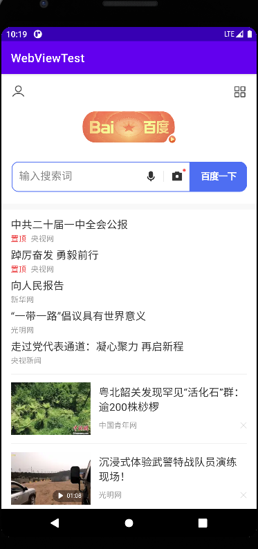

## 第9章 看看精彩的世界——使用网络技术

&emsp;&emsp;如果你在玩手机的时候不能上网，那你一定会感到特别地枯燥乏味。没错，现在早已不是玩单机的时代，不论是PC、手机、平板、还是电视，几乎都会具备上网的功能，在可遇见的未来，手表、眼镜、汽车等设备也会加入这个行列，21世纪的确是互联网的时代。  
&emsp;&emsp;当然，Android手机肯定也是可以上网的，所以作为开发者，我们就需要考虑如何利用网络来编写更加出色的应用程序，像QQ、微博、微信等常见的应用都会大量使用网络技术。本章主要会讲如何在手机端使用HTTP协议和服务器进行网络交互，并对服务器返回的数据进行解析，这也是Android中最常用的网络技术。

### WebView的用法

&emsp;&emsp;有时候我们可能会碰到一些比较特殊的需求，比如说要求在应用程序里展示一些网页，相信每个人都知道，加载和显示网页通常都是浏览器的任务，但是需求里又明确指出，不允许打开系统浏览器，而我们当然也不可能自己去编写一个浏览器，这时应该怎么办？Android早已考虑到这种需求，并提供了一个WebView控件，借助它我们就可以在自己的应用程序里嵌入一个浏览器，从而显示各种各样的网页。新建一个WebViewTest模块，然后修改activity_mani.xml中的代码，如下所示：

```xml
<?xml version="1.0" encoding="utf-8"?>
<LinearLayout
        xmlns:android="http://schemas.android.com/apk/res/android"
        xmlns:tools="http://schemas.android.com/tools"
        android:layout_width="match_parent"
        android:layout_height="match_parent"
        tools:context=".MainActivity">
    <WebView
            android:id="@+id/web_view"
            android:layout_width="match_parent"
            android:layout_height="match_parent"/>
</LinearLayout>
```

&emsp;&emsp;可以看到，我们在布局文件中使用到了一个新的控件：WebView。这个控件当然也就是用来显示网页的了，这里的写法很简单，给它设置了一个id，并让它充满整个屏幕。然后修改MainActivity中的代码，如下所示：

```java
package com.zj970.webviewtest;

import android.webkit.WebView;
import android.webkit.WebViewClient;
import androidx.appcompat.app.AppCompatActivity;
import android.os.Bundle;

public class MainActivity extends AppCompatActivity {
    private static final String URL= "https://www.baidu.com";
    @Override
    protected void onCreate(Bundle savedInstanceState) {
        super.onCreate(savedInstanceState);
        setContentView(R.layout.activity_main);
        WebView webView = findViewById(R.id.web_view);
        webView.getSettings().setJavaScriptEnabled(true);
        webView.setWebViewClient(new WebViewClient());
        webView.loadUrl(URL);
    }
}
```

&emsp;&emsp;ManiActivity中的代码很短，首先使用findViewById()方法获取了WebView的实例，然后调用WebView的getSettings()方法可以去设置一些浏览器的属性，这里我们并不去设置过多的属性，只是调用了setJavaScriptEnabled()方法来让WebView支持JavaScript脚本。  
&emsp;&emsp;接下来是非常重要的一个部分，我们调用了WebView的setWebViewClient()方法，并传入了一个WebViewClient的实例。这端代码的作用是，当需要从一个网页跳转到一个另一个网页的，我们希望目标网页仍然在当前WebView中显示，而不是打开系统浏览器。  
&emsp;&emsp;最后一步就非常简单了，调用WebView的loadUrl()方法，并将网址传入，即可展示相应网页的内容。由于本程序使用到了网络功能，访问功能是需要声明权限的，所以还需要在AndroidManifest.xml文件中加入权限："<uses-permission android:name="android.permission.INTERNET"/>"，除此之外我们还需要启用HTTP明文请求，加入android:usesCleartextTraffic="true"。

```xml
<?xml version="1.0" encoding="utf-8"?>
<manifest xmlns:android="http://schemas.android.com/apk/res/android"
          package="com.zj970.webviewtest">
    <uses-permission android:name="android.permission.INTERNET"/>
    <application
            android:allowBackup="true"
            android:icon="@mipmap/ic_launcher"
            android:label="@string/app_name"
            android:roundIcon="@mipmap/ic_launcher_round"
            android:supportsRtl="true"
            android:usesCleartextTraffic="true"
            android:theme="@style/Theme.NetworkStudy">
        <activity android:name=".MainActivity">
            <intent-filter>
                <action android:name="android.intent.action.MAIN"/>

                <category android:name="android.intent.category.LAUNCHER"/>
            </intent-filter>
        </activity>
    </application>

</manifest>
```
效果如下： 



&emsp;&emsp;可以看到，WebViewTest这个程序现在就已经具备了一个简易浏览器的功能，不仅成功将百度的首页展示了出来，还可以通过点击链接浏览更过的网页。  
&emsp;&emsp;当然，WebView还有很多更加高级的使用技巧。这里不一一赘述。