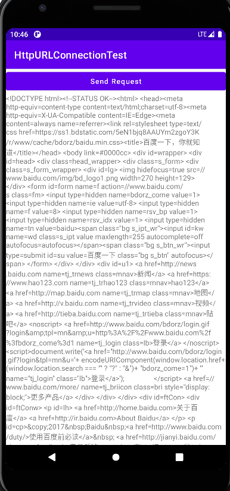

## 第9章 看看精彩的世界——使用网络技术

&emsp;&emsp;如果你在玩手机的时候不能上网，那你一定会感到特别地枯燥乏味。没错，现在早已不是玩单机的时代，不论是PC、手机、平板、还是电视，几乎都会具备上网的功能，在可遇见的未来，手表、眼镜、汽车等设备也会加入这个行列，21世纪的确是互联网的时代。  
&emsp;&emsp;当然，Android手机肯定也是可以上网的，所以作为开发者，我们就需要考虑如何利用网络来编写更加出色的应用程序，像QQ、微博、微信等常见的应用都会大量使用网络技术。本章主要会讲如何在手机端使用HTTP协议和服务器进行网络交互，并对服务器返回的数据进行解析，这也是Android中最常用的网络技术。

### 9.1 WebView的用法

&emsp;&emsp;有时候我们可能会碰到一些比较特殊的需求，比如说要求在应用程序里展示一些网页，相信每个人都知道，加载和显示网页通常都是浏览器的任务，但是需求里又明确指出，不允许打开系统浏览器，而我们当然也不可能自己去编写一个浏览器，这时应该怎么办？Android早已考虑到这种需求，并提供了一个WebView控件，借助它我们就可以在自己的应用程序里嵌入一个浏览器，从而显示各种各样的网页。新建一个WebViewTest模块，然后修改activity_mani.xml中的代码，如下所示：

```xml
<?xml version="1.0" encoding="utf-8"?>
<LinearLayout
        xmlns:android="http://schemas.android.com/apk/res/android"
        xmlns:tools="http://schemas.android.com/tools"
        android:layout_width="match_parent"
        android:layout_height="match_parent"
        tools:context=".MainActivity">
    <WebView
            android:id="@+id/web_view"
            android:layout_width="match_parent"
            android:layout_height="match_parent"/>
</LinearLayout>
```

&emsp;&emsp;可以看到，我们在布局文件中使用到了一个新的控件：WebView。这个控件当然也就是用来显示网页的了，这里的写法很简单，给它设置了一个id，并让它充满整个屏幕。然后修改MainActivity中的代码，如下所示：

```java
package com.zj970.webviewtest;

import android.webkit.WebView;
import android.webkit.WebViewClient;
import androidx.appcompat.app.AppCompatActivity;
import android.os.Bundle;

public class MainActivity extends AppCompatActivity {
    private static final String URL= "https://www.baidu.com";
    @Override
    protected void onCreate(Bundle savedInstanceState) {
        super.onCreate(savedInstanceState);
        setContentView(R.layout.activity_main);
        WebView webView = findViewById(R.id.web_view);
        webView.getSettings().setJavaScriptEnabled(true);
        webView.setWebViewClient(new WebViewClient());
        webView.loadUrl(URL);
    }
}
```

&emsp;&emsp;ManiActivity中的代码很短，首先使用findViewById()方法获取了WebView的实例，然后调用WebView的getSettings()方法可以去设置一些浏览器的属性，这里我们并不去设置过多的属性，只是调用了setJavaScriptEnabled()方法来让WebView支持JavaScript脚本。  
&emsp;&emsp;接下来是非常重要的一个部分，我们调用了WebView的setWebViewClient()方法，并传入了一个WebViewClient的实例。这端代码的作用是，当需要从一个网页跳转到一个另一个网页的，我们希望目标网页仍然在当前WebView中显示，而不是打开系统浏览器。  
&emsp;&emsp;最后一步就非常简单了，调用WebView的loadUrl()方法，并将网址传入，即可展示相应网页的内容。由于本程序使用到了网络功能，访问功能是需要声明权限的，所以还需要在AndroidManifest.xml文件中加入权限："<uses-permission android:name="android.permission.INTERNET"/>"，除此之外我们还需要启用HTTP明文请求，加入android:usesCleartextTraffic="true"。

```xml
<?xml version="1.0" encoding="utf-8"?>
<manifest xmlns:android="http://schemas.android.com/apk/res/android"
          package="com.zj970.webviewtest">
    <uses-permission android:name="android.permission.INTERNET"/>
    <application
            android:allowBackup="true"
            android:icon="@mipmap/ic_launcher"
            android:label="@string/app_name"
            android:roundIcon="@mipmap/ic_launcher_round"
            android:supportsRtl="true"
            android:usesCleartextTraffic="true"
            android:theme="@style/Theme.NetworkStudy">
        <activity android:name=".MainActivity">
            <intent-filter>
                <action android:name="android.intent.action.MAIN"/>

                <category android:name="android.intent.category.LAUNCHER"/>
            </intent-filter>
        </activity>
    </application>

</manifest>
```
效果如下： 


&emsp;&emsp;可以看到，WebViewTest这个程序现在就已经具备了一个简易浏览器的功能，不仅成功将百度的首页展示了出来，还可以通过点击链接浏览更过的网页。  
&emsp;&emsp;当然，WebView还有很多更加高级的使用技巧。这里不一一赘述。  


### 9.2 使用HTTP协议访问网络

&emsp;&emsp;使用HTTP协议，可能需要花费一本书篇幅。这里当然不会这么干，对于HTTP协议，只需要稍微了解一些就足够了，它的工作原理特别简单，就是客户端向服务器发出一条HTTP请求，服务器受到请求后会返回一些数据给客户端，然后客户端再对这些数据进行解析和处理就可以了。是不是很简单？一个浏览器的基本工作原理也就是如此了。比如说上一节中使用到的WebView控件，其实也就是我们向百度的服务器发出了一条HTTP请求，接着服务器分期出我们想要访问的是百度的首页，于是会把该网页的HTTP代码进行返回，然后WebView再调用手机浏览器的内核对返回的HTML代码进行解析，最终将页面展示出来。  
&emsp;&emsp;简单来说，WebView已经在后台帮我们处理好了发送HTTP请求、接收服务响应、解析返回数据，以及最终的界面展示这几步工作，不过由于它封装得实在太好了，反而使得我们不能那么直管地看出HTTP协议到底是如何工作的。因此，接下来就让我们通过手动发送HTTP请求的方式，来更加深入地理解一下这个过程。  

#### 9.2.1 使用HttpURLConnection  

&emsp;&emsp;在过去，Android上发送HTTP请求一般有两种方式：HttpURLConnection 和 HttpClient。不过由于HttpClient存在API数量过多、扩展困难等缺点，Android团队越来越不建议我们使用这种方式。终于在Android 6.0 系统中，HttpClient的功能完全被移除了，标志着此功能被正式弃用。  
&emsp;&emsp;首先需要获取到HttpURLConnection的实例，一般只需要new出一个URL对象，并传入目标的网络地址，然后调用一下openConnection()方法即可，如下所示：  

```
URL url = new URL("http://www.baidu.com");
HttpURLConnection connection = (HttpURLConnection) url.openConnection();
```
&emsp;&emsp;在得到了HttpURLConnection的实例之后，我们可以设置一下HTTP请求所使用的方法。常用的方法主要有两个：GET和POST。GET表示从服务器那里获取数据，而POST则表示希望提交数据给服务器，写法如下：  

```
connection.setRequestMethod("GET");
```

&emsp;&emsp;接下来就可以进行一些自由的定制，比如设置链接超时、读取超时的毫秒数，以及服务器希望得到的一些消息头等。这部分的内容根据自己的实际情况进行编写，示例写法如下：  

```
connection.setConnectTimeout(8000);
connection.setReadTimeout(8000);
```

&emsp;&emsp;之后再调用getInputStream()方法就可以获取到服务器返回的输入流了，剩下的任务就是对输入流进行读取，如下所示：  
```
InputStream in = connection.getInputStream();
```
&emsp;&emsp;最后可以调用disconnect()方法将这个HTTP连接关闭。新建一个HttpURLConnectionTest项目，修改activity_main.xml中的代码，如下所示：

```xml
<?xml version="1.0" encoding="utf-8"?>
<LinearLayout
        xmlns:android="http://schemas.android.com/apk/res/android"
        xmlns:tools="http://schemas.android.com/tools"
        android:layout_width="match_parent"
        android:layout_height="match_parent"
        android:orientation="vertical"
        tools:context=".MainActivity">
    <Button android:id="@+id/send_request"
            android:layout_width="match_parent"
            android:layout_height="wrap_content"
            android:text="Send Request"
            android:textAllCaps="false"/>
    <ScrollView
            android:layout_width="match_parent"
            android:layout_height="match_parent">
        <TextView
                android:id="@+id/response_text"
                android:layout_width="match_parent"
                android:layout_height="wrap_content"/>
    </ScrollView>

</LinearLayout>
```
由于手机屏幕的空间一般都比较小，有时候过多的内容一屏是显示不下的，借助ScrollView控件的话，我们就可以以滚动的形式查看屏幕外的那部分内容。另外，还放置了一个Button和一个TextView，Button用于发送HTTP请求，TextView用于将服务器返回的数据显示出来。接下来修改ManiActivity中的代码。

```java
package com.zj970.httpurlconnectiontest;

import android.view.View;
import android.widget.Button;
import android.widget.TextView;
import androidx.appcompat.app.AppCompatActivity;
import android.os.Bundle;

import java.io.BufferedReader;
import java.io.IOException;
import java.io.InputStream;
import java.io.InputStreamReader;
import java.net.HttpURLConnection;
import java.net.URL;

public class MainActivity extends AppCompatActivity implements View.OnClickListener{
    private static final String STRING_URL= "https://www.baidu.com";
    TextView responseText;
    @Override
    protected void onCreate(Bundle savedInstanceState) {
        super.onCreate(savedInstanceState);
        setContentView(R.layout.activity_main);
        Button sendRequest = findViewById(R.id.send_request);
        responseText = findViewById(R.id.response_text);
        sendRequest.setOnClickListener(this::onClick);

    }

    @Override
    public void onClick(View v) {
        if (v.getId() == R.id.send_request){
            sendRequestWithHttpURLConnection();
        }
    }

    private void sendRequestWithHttpURLConnection(){
        //开启线程发起网络请求
        new Thread(new Runnable() {
            @Override
            public void run() {
                HttpURLConnection connection = null;
                BufferedReader reader = null;
                try {
                    URL url = new URL(STRING_URL);
                    connection = (HttpURLConnection) url.openConnection();
                    connection.setRequestMethod("GET");
                    connection.setConnectTimeout(8000);
                    connection.setReadTimeout(8000);
                    InputStream in = connection.getInputStream();
                    //对输入流就行处理
                    reader = new BufferedReader(new InputStreamReader(in));
                    StringBuilder reponse = new StringBuilder();
                    String line;
                    while ((line = reader.readLine()) != null){
                        reponse.append(line);
                    }
                    showResponse(reponse.toString());
                } catch (Exception e){
                    e.printStackTrace();
                } finally {
                    if (reader != null){
                        try {
                            reader.close();
                        } catch (IOException e){
                            e.printStackTrace();
                        }
                    }
                }
            }
        }).start();
    }

    private void showResponse(String value){
        runOnUiThread(new Runnable() {
            @Override
            public void run() {
                //这里更新UI操作
                responseText.setText(value);
            }
        });
    }
}
```

&emsp;&emsp;可以看到， 我们在Send Request按钮的点击事件里调用了sendRequestWithHttpURLConnection发出一条Http请求，请求的目标地址就是百度的首页。接着利用BufferedReader对服务器返回的流进行读取，并将结果传入到了showResponse()方法中。而在showResponse()方法里则是调用了一个runOnUiThread()方法，然后在这个方法的匿名类参数进行操作，将返回的数据显示到界面上。那么这里为什么要用这个runOnUiThread()方法呢，这是因为Android是不允许在子线程中进行UI操作的，我们需要通过这个方法将线程切换到主线程，然后再更新UI元素。在运行之前，必须在AndroidManifest.xml申请网络权限。



&emsp;&emsp;是不是看得头晕眼花了？没错，服务器返回给我们的就是这种HTML代码，通常情况下浏览器都会将这些代码解析成漂亮的网页再展示出来。那么如果是想要提交数据给服务器应该怎么办呢？其实也不复杂，只需要将HTTP请求的方式改成POST，并在获取输入流之前将要提交数据写出即可。注意每条数据都要以键值对的形式存在，数据与数据之间用"&"符号隔开，比如说我们想要向服务器提交用户名和密码，就可以这样写：  

```
connection.setRequestMethod("POST");
DataOutputStream out = new DataOutputStream(connection.getOutputStream());
out.writeBytes("username=admin&password=123456");
```

#### 9.2.2 使用OkHttp

&emsp;&emsp;当然我们并不是只能使用HttpURLConnection，完全没有任何其他选择，事实上在开源盛行的今天，有许多出色的网络通信库都可以替代原生的HttpURLConnection，而其中OkHttp无疑是做的最出色的一个。  
&emsp;&emsp;OkHttp是由鼎鼎大名的Square公司开发的，这个公司在开源事业上面贡献良多，除了OkHttp之外，还开发了；了像Picasso、Retrofit等著名的开源项目。OkHttp不仅在接口封装上面做得简单易用，就连在底层实现上也是自成一派，比起原生的HttpURLConnection，可以说是有过之而无不及，现在已经成了广大Android开发者首选的网络通信库。那么本小节我们就来学习一下OkHttp的用法，okHttp的项目地址是：https://github.com/square/okhttp。在使用OkHttp之前，我们需要先在项目中添加OkHttp库的依赖。编辑app/build.gradle文件，在dependencies闭包中添加如下内容：

```groovy
dependencies {
    // define a BOM and its version
    implementation(platform("com.squareup.okhttp3:okhttp-bom:4.10.0"))
    // define any required OkHttp artifacts without version
    implementation("com.squareup.okhttp3:okhttp")
    implementation("com.squareup.okhttp3:logging-interceptor")
}
```
&emsp;&emsp;添加上述依赖会自动下载两个库，一个是OkHttp库，一个是Okio库，后者是前者的通信基础。首先需要创建一个OkHttpClient的实例，如下所示：
&emsp;&emsp;OkHttpClient client = new OkHttpClient();
&emsp;&emsp;接下来如果想要发出一条HTTP请求，就需要创建一个Request对象：
&emsp;&emsp;Request request = new Request.Builder().build();
&emsp;&emsp;当然，上述代码只是创建一个空的Request对象，并没有什么实际作用，我们可以在最终的build()方法之前连缀很多其他方法来丰富这个Request对象。比如可以通过url()方法来设置目标的网络地址，如下所示：

```
Request request = new Request.Builder().url("http://www.baidu.com").build();
```
&emsp;&emsp;之后调用OkHttpClient的newCall()方法来创建一个Call对象，并调用它的execute()方法来发送请求并获取服务器返回的数据，写法如下：  
```
Response response = client.newCall(request).execute();
```
&emsp;&emsp;其中Response对象就是服务器返回的数据了，我们可以使用如下写法来得到返回的具体内容：

```
String responseData = response.body().string();
```
&emsp;&emsp;如果是发起一条POST请求会比GET请求稍微复杂一点，我们需要先构建一个RequestBody对象来存放待提交的参数，如下所示：
```
RequestBody requestBody = new FormBody.Builder().add("username","admin")
                            .add("password","123456")
                            .build();
```
&emsp;&emsp;然后在Request.Builder中调用一下post()方法，并将Request.Builder中调用一下post()方法，并将RequestBody对象传入：

```
Request request = new Request.Builder()
                .url("http://www.baidu.com")
                .post(requestBody)
                .build();
```
&emsp;&emsp;接下来的操作就和GET请求一样，调用execute()方法来发送请求并获取服务器返回的数据即可。新建一个NetworkTest项目，修改MainActivity中的代码，如下所示：

```java
package com.zj970.networktest;

import android.view.View;
import android.widget.Button;
import android.widget.TextView;
import androidx.appcompat.app.AppCompatActivity;
import android.os.Bundle;
import okhttp3.OkHttpClient;
import okhttp3.Request;
import okhttp3.Response;

public class MainActivity extends AppCompatActivity implements View.OnClickListener {
    private static final String STRING_URL= "https://www.baidu.com";
    TextView responseText;
    @Override
    protected void onCreate(Bundle savedInstanceState) {
        super.onCreate(savedInstanceState);
        setContentView(R.layout.activity_main);
        Button sendRequest = findViewById(R.id.send_request);
        responseText = findViewById(R.id.response_text);
        sendRequest.setOnClickListener(this::onClick);

    }

    @Override
    public void onClick(View v) {
        if (v.getId() == R.id.send_request){
            sendRequestWithOkHttp();
        }
    }

    private void sendRequestWithOkHttp(){
        new Thread(new Runnable() {
            @Override
            public void run() {
                try {
                    OkHttpClient client = new OkHttpClient();
                    Request request = new Request.Builder().url(STRING_URL).build();
                    Response response = client.newCall(request).execute();
                    String responseData = response.body().string();
                    showResponse(responseData);
                } catch (Exception e){
                    e.printStackTrace();
                }
            }
        }).start();
    }


    private void showResponse(String value){
        runOnUiThread(new Runnable() {
            @Override
            public void run() {
                //这里更新UI操作
                responseText.setText(value);
            }
        });
    }
}
```

&emsp;&emsp;这里我们并没有做太多的改动，只是添加了一个sendRequestWithOkHttp()方法，并在SendRequest按钮的点击时事件里去调用这个方法。在这个方法中同样还是先开启一个子线程，然后在子线程中使用OkHttp发出一条Http请求，请求的目标地址还是百度的首页，Okhttp的用法也正如前面介绍一样。最后调用showResponse()方法将数据显示到界面。