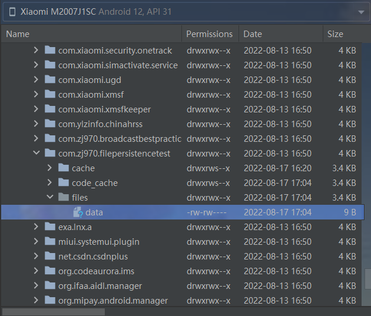
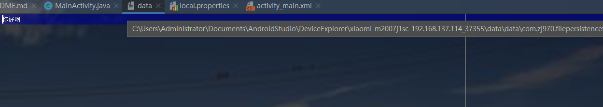
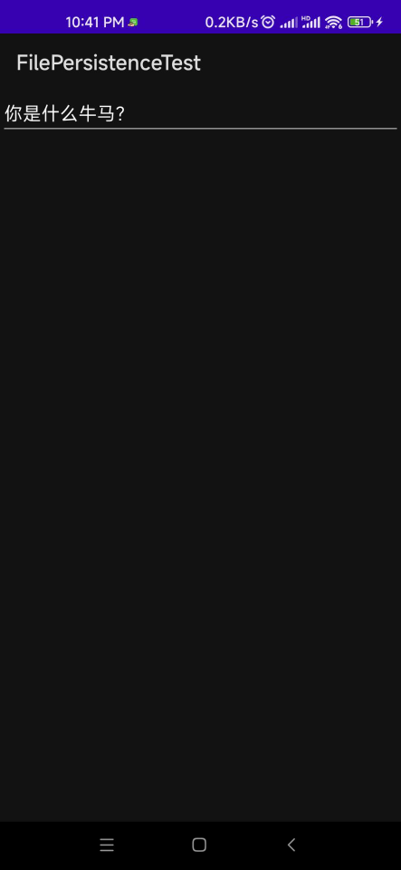
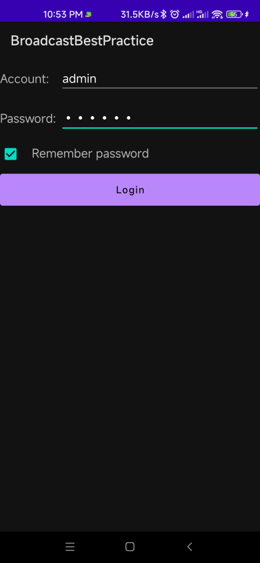
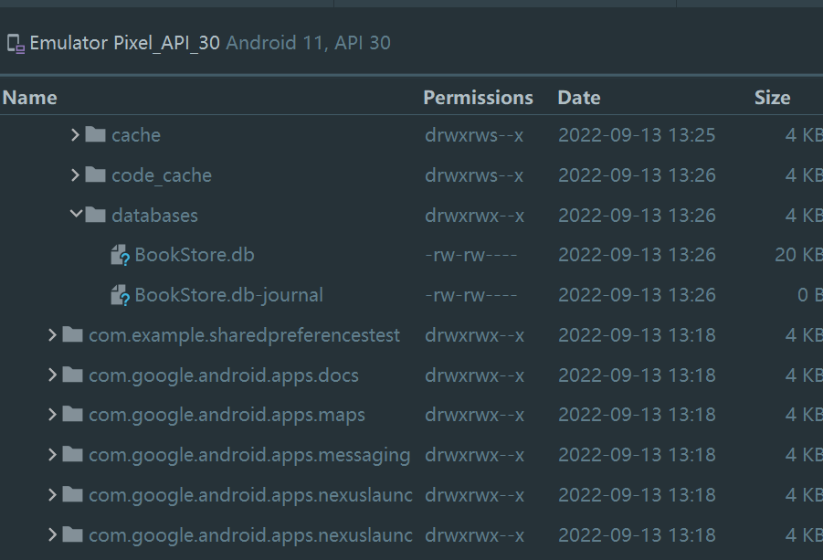
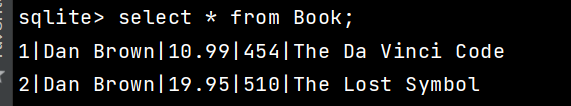
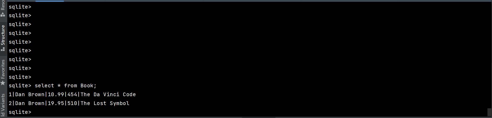
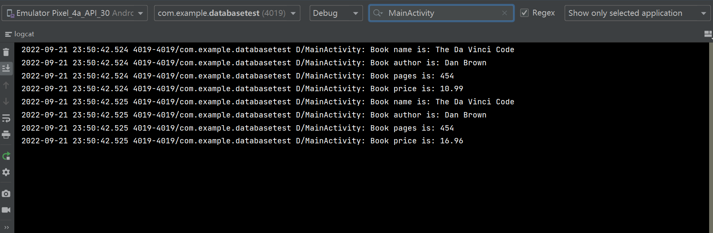

# 第6章 数据存储全方案——详解持久化技术

&emsp;&emsp;任何一个应用程序，其实说白了就是不停地和数据打交道，我们聊QQ，看新闻，刷微博，所关心的都是里面的数据，没有数据的应用程序就变成了一个空壳子，对用户来说没有任何实际用途，那么这些数据都是从哪里来呢？现在多数的数据基本上都是由用户产生的，比如你发微博、评论新闻，其实都是在产生数据。  

&emsp;&emsp;而我们前面章节所编写的众多例子中也有用到各种各样的数据，例如第3章最佳实践部分在聊天界面编写的聊天内容，第5章最佳实践部分在登录界面上输入的密码和账户。这些数据都有一个共同点，即它们都属于瞬时数据。那什么是瞬时数据呢？就是指哪些存储在内存当中，有可能会因为程序关闭或其他原因导致内存被回收而丢失的数据，这对于一些关键性的数据信息来说是绝对不能容忍的，谁都不希望发自己刚发出去的一条微博，刷新一下就没有了吧。那么怎么才能保证一些关键性数据不会丢失呢？这就需要用到数据持久化技术了。

## 6.1 持久化技术简介

&emsp;&emsp;数据持久化就是将哪些内存中的瞬时数据保存到存储设备中，保证即使在手机或电脑关机的情况下，这些数据仍然不会丢失，保存在内存中的数据是处于瞬时状态的，而保存在存储设备中的数据是处于持久状态的，持久化技术提供了一种机制可以让数据在瞬时状态和持久化状态间进行转换。

&emsp;&emsp;持久化技术被广泛应用于各种程序设计的领域当中，而本书中主要探讨的是在Android中的数据持久化技术。Android系统中主要提供了3种方式用于简单地是实现数据持久化功能，即文件存储、SharedPreference存储以及数据库存储。当然，除了这3种方式之外，还可以把数据保存在手机的SD卡中，不过使用文件、SharedPreference或数据库来保存数据会相对更简单一点，而且比起将数据保存在SD卡中会更加地安全。

## 6.2 文件存储

&emsp;&emsp;文件存储是Android中最基本的一种数据存储方式，它不对存储的内容进行任何的格式化处理，所有的数据都是原封不动地保存到文件中，因而它比较适合用于存储一些简单的文本数据或二进制数据。如果想要用文件存储的方式来存储一些较为复杂的文本数据，就需要自定义一套自己的格式规范，这样可以方便之后将数据从文件中重新解析出来。

### 6.2.1 将数据存储文件中

&emsp;&emsp;Context类中提供了一个openFileOutput()方法，可以用于将数据存储到指定的文件中，这个方法接收两个参数，第一个参数是文件名，在文件创建的时候使用的就是这个名称，注意这里指定的文件名不可以包含路径，因为所有的文件都是默认存储到/data/data/<package_name>/files/目录下的，第二个参数是文件的操作模式，主要有两种模式可选，MODE_PRIVATE和MODE_APPEND。其中MODE_PRIVATE是默认的操作模式，表示当指定同样文件名的时候，所写入的内容将会覆盖原文件中的内容，而MODE_APPEND则表示如果该文件已存在，就往文件里面追加内容，不存在就创建新文件。其实文件的操作模式本来还有两种：MODE_WORLD_READABLE和MODE_WORLD_WRITEABLE，这两种模式允许其他的应用程序对我们程序中的文件进行读写操作，不过由于这两种模式过于危险，很容易引起应用的安全性漏洞，已在Android 4.2版本中废弃。

&emsp;&emsp;openFileOutput()方法返回是一个FileOutputStream对象，得到了这个对象之后就可以使用java流的方式将数据写入到文件中了。以下是一段简单的代码示例，展示了如何将文本内容保存到文件中：

```
public void save(){
    String data = "Data to save";
    FileOutputStream out = null;
    BufferedWriter writer = null;
    try {
        out = openFileOutput("data",Context.MODE_PRIVATE);
        writer = new BufferedWriter(new OutputStreamWriter(out));
        writer.write(data);
    } catch (IOException e){
        e.printStackTrace();
    } finally{
        try {
             if  (writer != null){
             writer.close();
             }
        } catch (IOException e){
             e.printStackTrace();
        }
    }   
}             
```

&emsp;&emsp;如果你已经比较熟悉java流，理解上面的代码一定轻而易举吧。这里通过openFileOutput()方法能够得到一个FileOutputStream对象，然后再借助它构建出一个BufferedWriter对象，这样就可以通过BufferedWriter来将文本内容写入到文件中了。

&emsp;&emsp;下面我们就编写一个完整的例子，借此学习一下如何在Android项目中使用文件存储的技术。首先创建一个FilePersistenceTest项目，并修改activity_main.xml中的代码，如下所示：

```xml
<?xml version="1.0" encoding="utf-8"?>
<LinearLayout
        xmlns:android="http://schemas.android.com/apk/res/android"
        xmlns:tools="http://schemas.android.com/tools"
        android:layout_width="match_parent"
        android:layout_height="match_parent"
        tools:context=".MainActivity">
    <EditText
            android:id="@+id/edit"
            android:layout_width="match_parent"
            android:layout_height="wrap_content"
            android:hint="Type something here"/>
</LinearLayout>
```

&emsp;&emsp;这里只是在布局中加入了一个EditText，用于输入文本内容。其实现在你就可以运行一下程序了，界面上肯定会有一个文本输入框。然后在文本输入框中随意输入点什么内容，再按下Back键，这时输入的内容肯定就已经丢失了，因为它只是瞬时数据，在活动被销毁后就会被回收。而我们要做的，就是在数据被回收之前，将它存储到文件中。修改MainActivity中的代码，如下所示：

```java
package com.zj970.filepersistencetest;

import android.content.Context;
import android.widget.EditText;
import androidx.appcompat.app.AppCompatActivity;
import android.os.Bundle;

import java.io.BufferedWriter;
import java.io.FileOutputStream;
import java.io.IOException;
import java.io.OutputStreamWriter;

public class MainActivity extends AppCompatActivity {

    private EditText edit;

    @Override
    protected void onCreate(Bundle savedInstanceState) {
        super.onCreate(savedInstanceState);
        setContentView(R.layout.activity_main);
        edit = findViewById(R.id.edit);
    }

    @Override
    protected void onDestroy() {
        super.onDestroy();
        String inputText = edit.getText().toString();
    }

    public void save(String inputText){
        FileOutputStream out = null;
        BufferedWriter writer = null;
        try {
            out = openFileOutput("data", Context.MODE_PRIVATE);
            writer = new BufferedWriter(new OutputStreamWriter(out));
            writer.write(inputText);
        }catch (IOException e){
            e.printStackTrace();
        } finally {
            try{
                if (writer != null){
                    writer.close();
                }
            } catch (IOException e){
                e.printStackTrace();
            }
        }
    }
}
```

&emsp;&emsp;可以看到，首先我们在onCreate()方法中获取了EditText的实例，然后重写了onDestroy()方法中我们获取了EditText中输入的内容存储到文件中，文件命名为data。save()方法中的代码和之前的示例基本相同。


然后按下Back键关闭程序，这时我们输入的内容就已经保存在文件中了。利用Device File Explorer工具查看文件



双击文件就会下载：



### 6.2.2 从文件中读取数据

&emsp;&emsp;类似于将数据存储到文件中，Context类还提供了一个openFileInput()方法，用于从文件中读取数据。这个方法要比openFIleOutput()简单一些，它只接收一个参数，即要读取的文件名，然后系统会自动去到/data/data/<package_nem>files/目录下去加载这个文件，并返回一个FileInputStream对象，得到这个对象之后再通过java流的方式就可以将数据取出来了。下面是示例代码

```
public String load(){
    FileInputStream in = null;
    BUfferedReader reader = null;
    StringBuuilder content = new StringBulder();
    try {
        in = openFileInput("data");
        reader = new BufferedReader(new InputStreamReader(in));
        String line = "";
        while ((line = reader.readLine()) != null){
        content.append(line);
        }
     } catch (IOException e){
        e.printStrackTrace();
     } finally {
        if (reader != null){
            try {
                reader.close();
            } catch (IOException e){
                e.printStackTrace();
            }
        }
        
     }
     return content.toString();
     
}
        
```

&emsp;&emsp;在这段代码中，首先通过openFileInput()方法获取到了一个FileInputStream对对象，这样我们就可以通过BufferedReader进行一行一行地读取，把文件中所有的文本内容全部读取出来，并存放在一个StringBuilder对象中，最后将读取到的内容返回就可以了。了解了从文件中读取数据的方法，那么我门就继续完善上一小节中的例子，使得重新启动程序时Edit中能够保留我们上次输入的内容，修改MainActivity中的代码

```java
package com.zj970.filepersistencetest;

import android.content.Context;
import android.text.TextUtils;
import android.widget.EditText;
import android.widget.Toast;
import androidx.appcompat.app.AppCompatActivity;
import android.os.Bundle;

import java.io.*;

public class MainActivity extends AppCompatActivity {

    private EditText edit;

    @Override
    protected void onCreate(Bundle savedInstanceState) {
        super.onCreate(savedInstanceState);
        setContentView(R.layout.activity_main);
        edit = findViewById(R.id.edit);
        String inputText = load();
        if (!TextUtils.isEmpty(inputText)) {
            edit.setText(inputText);
            edit.setSelection(inputText.length());
            Toast.makeText(this, "Restoring succeeded", Toast.LENGTH_SHORT).show();
        }
    }

    @Override
    protected void onDestroy() {
        super.onDestroy();
        String inputText = edit.getText().toString();
        save(inputText);
    }

    public void save(String inputText) {
        FileOutputStream out = null;
        BufferedWriter writer = null;
        try {
            out = openFileOutput("data", Context.MODE_PRIVATE);
            writer = new BufferedWriter(new OutputStreamWriter(out));
            writer.write(inputText);
        } catch (IOException e) {
            e.printStackTrace();
        } finally {
            try {
                if (writer != null) {
                    writer.close();
                }
            } catch (IOException e) {
                e.printStackTrace();
            }
        }
    }

    public String load() {
        FileInputStream in = null;
        BufferedReader reader = null;
        StringBuilder content = new StringBuilder();
        try {
            in = openFileInput("ddata");
            reader = new BufferedReader(new InputStreamReader(in));
            String line = "";
            while ((line = reader.readLine()) != null) {
                content.append(line);
            }
        } catch (IOException e) {
            e.printStackTrace();

        } finally {
            if (reader != null){
                try {
                    reader.close();
                } catch (IOException e){
                    e.printStackTrace();
                }
            }
        }

        return content.toString();
    }
}
```
&emsp;&emsp;可以看到，这里的思路非常简单，在onCreate()方法中调用load()方法来读取文件中存储的文本内容，如果读取到的内容不为null，就调用EditText的setText()方法将内容填充到EditText中，并调用setSelection()方法将输入光标移动到文本的末尾位置以便于继续输入，然后弹出一句还原成功的提示。注意上述代码中在对字符串非空判断的时候使用了TextUtils.isEmpty()方法，这是一个非常好用的方法，它可以一次性进行两种空值的判断。当传入的字符串等于null或等于空字符串的时候，这个方法都会返回true，从而使得我们先单独判断这两种空值再使用逻辑运算符连接起来了。现在重新运行，效果如下：



&emsp;&esmp;文件存储的方式并不适合存储一些较为复杂的文本数据，因此，下面有Android的另外一种数据持久化的方式，它比文件存储更加简单易用，而且可以很方便地对某一指定的数据进行读写操作。

## 6.3 SharedPreferences 存储

&emsp;&emsp;不同于文件的存储方式，SharedPreferences是使用键值对的方式来存储数据的。也就是说，当保存一条数据的时候，需要给这条数据提供一个对应的键，这样在读取数据的时候就可以通过这个键把相应的值取出来。而且SharedPreferences还支持多种不同的数据类型存储，如果存储的数据类型是整型，那么读取出来的数据也是整型的；如果存储的数据是一个字符串，那么读取出来的数据仍然是字符串。

### 6.3.1 将数据存储到SharedPreferences中

&emsp;&emsp;要想使用SharedPreferences来存储数据，首先要获取到SharedPreferences对象。Android中主要提供了3种方法用于得到SharedPreferences对象。

- Context类中的getShredPreferences()方法

&emsp;&emsp;此方法接收两个参数，第一个参数用于指定SharedPreferences文件的名称，如果指定的文件不存在则会创建一个，SharedPreferences文件都是存放在<data/data/<package_name>/shared_prefs/目录下。第二个参数用于指定操作模式，目前只有MODE_PRIVATE这一种模式可选，他是默认的操作模式，和直接传入0效果是相同的，表示只有当前的应用程序才可以对这个SharedPreferences文件进行读写。其他几种操作模式均已被废弃，MODE_WORLD_READABLE和MODE_WORLD_WRITEABLE这两种模式是在Android 4.2 版本中废弃的，MODE_MULTIPROCESS是在Android 6.0版本废弃的。

- Activity类中的getPreferences()方法

&emsp;&emsp;这个方法和Context中的getSharedPreferences()方法很相似，不过它只接收一个操作模式参数，因为使用这个方法时会自动将当前活动的类名作为SharedPreferences的文件名。

- PreferenceManager类中的getDefaultSharedPreferences()方法

&emsp;&emsp;这是一个静态的方法，它接收一个Context参数，并自动使用当前应用程序的包名作为前缀来命名SharedPreferences文件。得到了SharedPreferences对象之后，就可以开始向SharedPreferences文件中存储数据了，主要分为3步实现。

1. 调用SharedPreferences对象的edit()方法来获取一个SharedPreferences.Editor对象。
2. 向SharedPreferences.Editor对象中添加数据，比如添加一个布尔型数据就使用putBoolean()方法，添加一个字符串则使用putString()方法，以此类推。
3. 调用apply()方法将添加的数据提交，从而完成数据存储操作。

&emsp;&emsp;新建一个SharedPreferencesTest模块，然后修改activity_main.xml

```xml
<?xml version="1.0" encoding="utf-8"?>
<LinearLayout
        xmlns:android="http://schemas.android.com/apk/res/android"
        xmlns:tools="http://schemas.android.com/tools"
        android:layout_width="match_parent"
        android:layout_height="match_parent"
        tools:context=".MainActivity"
        android:orientation="vertical">
    <Button android:id="@+id/save_data"
            android:layout_width="match_parent"
            android:layout_height="wrap_content"
            android:text="Save Date"
            android:textAllCaps="false"/>
</LinearLayout>
```
这里我们不做任何复杂的功能，只是简单地放置了一个按钮，用于将一些数据存储到SharedPreferences文件中。然后修改MainActivity.java中的代码

```java
package com.example.sharedpreferencestest;

import android.content.SharedPreferences;
import android.view.View;
import android.widget.Button;
import androidx.appcompat.app.AppCompatActivity;
import android.os.Bundle;

public class MainActivity extends AppCompatActivity {

    @Override
    protected void onCreate(Bundle savedInstanceState) {
        super.onCreate(savedInstanceState);
        setContentView(R.layout.activity_main);
        Button saveButton = findViewById(R.id.save_data);
        saveButton.setOnClickListener(new View.OnClickListener() {
            @Override
            public void onClick(View v) {
                SharedPreferences.Editor editor = getSharedPreferences("data",MODE_PRIVATE).edit();
                editor.putString("name","Tom");
                editor.putInt("age",19);
                editor.putBoolean("男",false);
                editor.apply();
            }
        });
    }
}
```
可以看到，这里首先给按钮注册了一个点击事件，然后通过点击事件中通过getSharedPreferences()方法指定SharedPreferences的文件名指定为data，并得到了SharedPreferences.Editor对象。接着向这人个对象中添加了3条不同类型的数据，最后调用apply()方法进行提交，从而完成了数据存储的操作。现在运行一下，进入程序，点击Save Data按钮。这是数据应该保存成功了。在/data/data/com.example.sharepreferencestest/shared_prefs/目录下，生成了一个data.xml文件

并且sharedPreferences文件是使用xml格式来对数据进行管理的。

### 6.3.2 从SharedPreferences中读取数据

&emsp;&emsp;使用SharedPreferences来存储数据是非常简单的，不过下面还有更好的消息，其实从SharedPreferences文件中读取数据会更加简单。SharedPreferences对象中提供了一系列的get方法，用于对存储的数据进行读取，每种get方法都对应了SharedPreferences.Editor中的一种put方法，比如读取一个布尔型数据就使用getBoolean()方法，读取一个字符串就使用getString()方法。这些get方法都接收两个参数，第一个参数是键，传入存储数据时使用的键就可以得到相应的值了；第二个参数是默认值，即表示当传入的键找不到对应的值会以什么样的默认值进行返回。在上述基础上修改activity_main.xml

```xml
<?xml version="1.0" encoding="utf-8"?>
<LinearLayout
        xmlns:android="http://schemas.android.com/apk/res/android"
        xmlns:tools="http://schemas.android.com/tools"
        android:layout_width="match_parent"
        android:layout_height="match_parent"
        tools:context=".MainActivity"
        android:orientation="vertical">
    <Button android:id="@+id/save_data"
            android:layout_width="match_parent"
            android:layout_height="wrap_content"
            android:text="Save Date"
            android:textAllCaps="false"/>
    <Button android:id="@+id/restore_data"
            android:layout_width="match_parent"
            android:layout_height="wrap_content"
            android:textAllCaps="false"
            android:text="Rstore Dat"/>
</LinearLayout>
```
这里增加了一个还原数据的按钮，我们希望通过点击这个按钮来从SharedPreferences文件中读取数据。修改MainActivity中的代码

```java
package com.example.sharedpreferencestest;

import android.content.SharedPreferences;
import android.util.Log;
import android.view.View;
import android.widget.Button;
import androidx.appcompat.app.AppCompatActivity;
import android.os.Bundle;

public class MainActivity extends AppCompatActivity {
    private static final String TAG = "MainActivity";
    @Override
    protected void onCreate(Bundle savedInstanceState) {
        super.onCreate(savedInstanceState);
        setContentView(R.layout.activity_main);
        Button saveButton = findViewById(R.id.save_data);
        saveButton.setOnClickListener(new View.OnClickListener() {
            @Override
            public void onClick(View v) {
                SharedPreferences.Editor editor = getSharedPreferences("data",MODE_PRIVATE).edit();
                editor.putString("name","Tom");
                editor.putInt("age",19);
                editor.putBoolean("married",false);
                editor.apply();
            }
        });

        Button restoreData = findViewById(R.id.restore_data);
        restoreData.setOnClickListener(new View.OnClickListener() {
            @Override
            public void onClick(View v) {
                SharedPreferences preferences = getSharedPreferences("data",MODE_PRIVATE);
                String name = preferences.getString("name","");
                int age = preferences.getInt("age",0);
                boolean morried = preferences.getBoolean("married",false);
                Log.d(TAG, "name: "+name);
                Log.d(TAG, "age"+age);
                Log.d(TAG, "morried is " + morried);
            }
        });
    }
}
```
&emsp;&emsp;可以看到，我们在还原数据按钮的点击事件中首先通过getSharedPreferences()方法得到了SharePreferences对象，然后分别调用它的getString()、getInt()和getBoolean()方法，去获取前面所存储的姓名、年龄和是否已婚，如果没有找到相应的值，就会使用方法中传入的默认值来代替，最后用Log将这些值打印出来。

SharePreferences存储确实要比文本存储简单方便了许多，应用场景也多了不少，比如很多应用程序的偏好设置功能其实都使用到了SharePreferences技术。那么下面就编写一个记住密码的功能，通过这个例子能够加深你对sharedPreferences的理解。 

### 6.3.3 实现记住密码功能

&emsp;&emsp;既然是实现记住密码的功能，那么我们就不需要从头去写了，因为在上一章中的最佳实践部分已经编写过一个登录界面了，有可以重用的代码为什么不用呢？修改activity_login.xml中的代码，如下所示：

```xml
<?xml version="1.0" encoding="utf-8"?>
<LinearLayout
        xmlns:android="http://schemas.android.com/apk/res/android"
        xmlns:tools="http://schemas.android.com/tools"
        android:orientation="vertical"
        android:layout_width="match_parent"
        android:layout_height="match_parent">
    <LinearLayout
            android:orientation="horizontal"
            android:layout_width="match_parent"
            android:layout_height="60dp">
        <TextView
                android:layout_width="90dp"
                android:layout_height="wrap_content"
                android:layout_gravity="center_vertical"
                android:textSize="18sp"
                android:text="Account: "/>
        <EditText
                android:id="@+id/account"
                android:layout_width="0dp"
                android:layout_height="wrap_content"
                android:layout_weight="1"
                android:layout_gravity="center_vertical"/>
    </LinearLayout>
    <LinearLayout
            android:orientation="horizontal"
            android:layout_width="match_parent"
            android:layout_height="60dp">
        <TextView
                android:layout_width="90dp"
                android:layout_height="wrap_content"
                android:layout_gravity="center_vertical"
                android:textSize="18sp"
                android:text="Password: "/>
        <EditText
                android:id="@+id/password"
                android:layout_width="0dp"
                android:layout_height="wrap_content"
                android:layout_weight="1"
                android:layout_gravity="center_vertical"
                android:inputType="textPassword"/>
    </LinearLayout>

    <Button
            android:id="@+id/login"
            android:layout_width="match_parent"
            android:layout_height="60dp"
            android:text="Login"
            android:textAllCaps="false"/>
    <LinearLayout
            android:orientation="horizontal"
            android:layout_width="match_parent"
            android:layout_height="wrap_content">
        <CheckBox
                android:id="@+id/remember_pass"
                android:layout_width="wrap_content"
                android:layout_height="wrap_content"/>
        <TextView android:layout_height="wrap_content"
                  android:layout_width="wrap_content"
                  android:textSize="18sp"
                  android:text="Remember password"/>

    </LinearLayout>
</LinearLayout>
```

&emsp;&emsp;这里使用到了这个一个新控件了CheckBox。这是一个复选框框架，用户可以通过点击的方式来进行选中和取消，我们就使用这个控件来表示用户是否需要记住密码。然后修改LoginActivity中的代码，如下所示：

```java
package com.example.broadcastbestpractice;

import android.content.Intent;
import android.content.SharedPreferences;
import android.os.Bundle;
import android.preference.PreferenceManager;
import android.view.View;
import android.widget.Button;
import android.widget.CheckBox;
import android.widget.EditText;
import android.widget.Toast;
import com.zj970.broadcastbestpractice.R;

public class LoginActivity extends BaseActivity {

    private EditText accountEidt;
    private EditText passwordEdit;
    private Button login;
    private SharedPreferences pref;
    private SharedPreferences.Editor editor;
    private CheckBox rememberPass;

    @Override
    protected void onCreate(Bundle savedInstanceState) {
        super.onCreate(savedInstanceState);
        setContentView(R.layout.activity_login);
        pref = PreferenceManager.getDefaultSharedPreferences(this);
        accountEidt = findViewById(R.id.account);
        passwordEdit = findViewById(R.id.password);
        rememberPass = findViewById(R.id.remember_pass);
        login = findViewById(R.id.login);
        boolean isRemember = pref.getBoolean("remember_password",false);
        if (isRemember){
            //将账号和密码都设置到文本框中
            String account = pref.getString("account","");
            String password = pref.getString("password","");
            accountEidt.setText(account);
            rememberPass.setText(password);
            rememberPass.setChecked(true);
        }
        login.setOnClickListener(new View.OnClickListener() {
            @Override
            public void onClick(View v) {
                String account = accountEidt.getText().toString();
                String password = passwordEdit.getText().toString();
                
                //默认账户是admin密码是123456
                if (account.equals("admin") && password.equals("123456")){
                    editor = pref.edit();
                    if (rememberPass.isChecked()){
                        //检查复选框是否被选中
                        editor.putBoolean("remember_password",true);
                        editor.putString("account",account);
                        editor.putString("password",password);
                    } else {
                        editor.clear();
                    }
                    editor.apply();
                    Intent intent = new Intent(LoginActivity.this,MainActivity.class);
                    startActivity(intent);
                    finish();
                }else {
                    Toast.makeText(LoginActivity.this, "account or password is invalid", Toast.LENGTH_SHORT).show();
                }
            }
        });
    }
}
```

&emsp;&emsp;可以看到，这里首先在onCreate()方法中获取到了SharedPreferences对象，然后调用它的getBoolean()方法去获取remember_password这个键对应的值。一开始当然不存在对应的值了，所以会使用默认值false，这样就什么都不会发生。接着在登录成功之后，会调用CheckBox的isChecked()方法来检查复选框是否被选中，如果被选中了，则表示用户想要记住密码，这时将remember_password设置为true，然后把account和password对应的值都存入到SharedPreferences文件当中并提交。如果没有被选中，就简单地调用一下clear()方法，将SharedPreferences文件的数据全部清除掉。



&emsp;&emsp;当用户选中了记住密码复选框，并成功登录一次之后，remember_password键对应的值时true了，这个时候如果再重新启动登录界面，就会从SharePreferences文件中保存的账号和密码都读取出来，并填充到文本输入框中，然后把记住密码复选框选中，这样就完成了记住密码功能了。现在重新运行一下程序，可以看到界面上多出了一个记住密码复选框。然后输入账号，密码。选中记住密码复选框，点击登录。就会跳转到MainActivity。接着在MainActivity中发出一条强制下线广播，会让程序重新回到登录界面，此时账号密码都已经自动填充到界面，但是将密码以i铭文的形式存储在SharedPreferences文件中是非常不安全的，很容易就会被别人盗取，因此在正式的项目里还需要结合一定的加密算法来对密码进行保护。

## 6.4 SQLite数据库存储

&emsp;&emsp;SQLite是一款轻量级的关系数据库，它的运算速度非常快，占用资源少，通常只需要几百kb的内存就可以了，因而特别适合在移动设备上使用。SQLite不仅支持标准的SQL语法，还遵循了数据库的ACID事务，所以上手比较快。而SQLite甚至不用设置用户和密码就可以使用。前面我们所学的文件存储和SharedPreferences存储毕竟值适用保存一些简单的数据和键值对，当需要存储大量复杂关系型数据的时候，你就会发现以上两种存储方式很难应对了。比如我们手机的短信程序中可能会有很多个绘画，每个会话中又包含了很多条信息内容，并且大部分会话还可能各自对应了电话簿中的某个联系人。很难想象如何用文件或者SharedPreferences来存储这些数据量大、结构性复杂的数据。但是用SQLite就可以做到。

### 6.4.1 创建数据库

&emsp;&emsp;Android为了让我们能够更加方便地管理数据库，专门提供了一个SQLiteOpenHelper帮助类，借助这个类就可以非常简单地对数据库进行创建和升级。SQLiteOpenHelper是一个抽象类，这意味着我们如果要使用它的话，就需要创建一个自己的帮助类去继承它。SQLiteOpenHelper中有两个抽象方法，分别是onCreate()和onUpgrade()，我们必须在自己的帮助类里面重写这两个方法，然后分别在这两个方法中去实现创建、升级数据库的逻辑。SQLiteOpenHelper中还有两个非常重要的实例方法：getReadableDatabase()和getWritableDatabase()。这两个方法都可以创建或打开一个现有的数据库（如果数据库已存在则直接打开，否则就创建一个新的数据库），并返回一个可对数据库进行读写操作的对象。不同的是，当数据库不可写入的时候（如磁盘空间已满），getReadableDatabase()方法返回的对象将以只读的方法打开数据库，而getWritableDatabase()方法则将出现异常。

&emsp;&emsp;SQLiteOpenHelper中有两个构造方法可供重写，一般使用参数少一点的那个构造方法即可。这个构造方法中接收4个参数，第一个参数是Context，必须要有它才能对数据库进行操作。第二个参数是数据库名，创建数据库时使用的就是这里指定的名称。第三个参数允许我们在查询数据的时候返回一个自定义的Cursor，一般都是传入null。第四个参数表示当前数据库的版本号，可用于对数据库进行升级操作。构建出SQLiteOpenHelper的实例之后，再调用它的getReadableDatabase()或getWritableDatabase()方法就能创建数据库了。数据文件会存放在/data/data/<package name>/databases/目录下。此时，重写的onCreate()方法也会得到执行，所以通常会在这里去处理一些创建表的逻辑。

&emsp;&emsp;这里我们希望创建一个名为BookStore.db的数据库，然后在这个数据库中新建一张Book表，表中有id(主键)、作者、价格、页数和书名等列。创建数据库表当然还是需要用建表语句的，这里也是要考虑一下你的SQL基本功，Book表的建表语句如下所示：

```sql
create table Book(
    id integer primary key auto_increment,
    author text,
    price real,
    pages integer,
    name text
)
```
&emsp;&emsp;只要你对SQL方面的知识稍微了解一些，上面的建表语句应该不难。SQLite不像其他的数据库拥有众多复杂的数据类型，它的数据类型很简单，integer表示整型,real表示浮点型,text表示文本类型,blob表示二进制类型。另外，上述建表语句中我们还使用了primary key 将id列设为主键，并用autoincrement关键字表示id列是自增长的。新建MyDatabaseHelper类继承自SQLiteOpenHelper,代码如下：

```java
package com.example.databasetest;

import android.content.Context;
import android.database.sqlite.SQLiteDatabase;
import android.database.sqlite.SQLiteOpenHelper;
import android.widget.Toast;
import androidx.annotation.Nullable;

import java.util.concurrent.Callable;

public class MyDatabaseHelper extends SQLiteOpenHelper {
    public static final String CREATE_BOOK = "create table Book ("
            +"id integer primary key autoincrement,"
            +"author text,"
            +"price real,"
            +"name text)";
    private Context mContext;

    public MyDatabaseHelper(@Nullable Context context, @Nullable String name, @Nullable SQLiteDatabase.CursorFactory factory, int version) {
        super(context, name, factory, version);
        mContext = context;
    }

    @Override
    public void onCreate(SQLiteDatabase db) {
        db.execSQL(CREATE_BOOK);
        Toast.makeText(mContext, "Create succeeded", Toast.LENGTH_SHORT).show();
    }

    @Override
    public void onUpgrade(SQLiteDatabase db, int oldVersion, int newVersion) {

    }
}

```

&emsp;&emsp;可以看到，我们把建表语句定义成了一个字符串常量，然后在onCreate()方法中又调用了SQLiteDatabase的execSQL()方法去执行这条建表语句，并弹出一个Toast提示创建成功，这样就可以保证在数据库创建完成的同时还能成功创建Book表。现在修改activity_main,xml中的代码，如下所示：

```xml
<?xml version="1.0" encoding="utf-8"?>
<LinearLayout
        xmlns:android="http://schemas.android.com/apk/res/android"
        android:orientation="vertical"
        android:layout_width="match_parent"
        android:layout_height="match_parent">
    <Button android:id="@+id/create_database"
            android:layout_width="match_parent"
            android:layout_height="wrap_content"
            android:text="Create database"/>
</LinearLayout>
```
&emsp;&emsp;布局文件很简单，就是加入了一个按钮，用于创建数据库。最后修改MainActivity中的代码，如何所示：

```java
package com.example.databasetest;

import android.app.Activity;
import android.os.Bundle;
import android.view.View;
import android.widget.Button;

public class MainActivity extends Activity {
    private MyDatabaseHelper dbHelper;
    @Override
    protected void onCreate(Bundle savedInstanceState) {
        super.onCreate(savedInstanceState);
        setContentView(R.layout.activity_main);
        dbHelper = new MyDatabaseHelper(this,"BookStore.db",null,1);
        Button createDatabase = findViewById(R.id.create_database);
        createDatabase.setOnClickListener(new View.OnClickListener() {
            @Override
            public void onClick(View v) {
                dbHelper.getWritableDatabase();
            }
        });
    }
}
```

&emsp;&emsp;这里我们在onCreate()方法中创建了一个MyDatabaseHelper对象，并且通过构造函数的参数将数据库名指定为BookStore.db这个数据库，于是会创建该数据库并调用MyDatabaseHelper中的onCreate()方法，这样Book表也就得到了创建，然后会弹出一个Toast提示创建成功。再次点Create database按钮时，会发现此时已经存在BookStore.db数据库了，因此不会再创建一次。此时BookStore.db文件，Book表无法通过File Explorer看到。因此这次我们准备换一种查看方式，使用adb shell来对数据库和表的创建情况进行检查。adb是Android SDk 中自带的一个调试工具，使用这个工具可以直接对连接在电脑上的手机或模拟器进行调试操作。它存放在sdk的platform-tools目录下，如果想要在命令行中使用这个工具，就需要先把它的路径配置到环境变量里。然后输入adb shell 进入设备的控制台，cd到应用的安装目录databases/下使用ls查看该目录的文件，这个目录下出现了两个数据库文件，一个正是我们创建的BookStore.db，而另一个BookStore.db-journal则是为了让数据库能够支持事务而产生的临时日志文件，通常情况下这个文件的大小都是0字节。接下来借助sqlite命令打开数据库，只需要输入sqlite3，后面加入数据库名即可。这时就已经打开了BookStore.db数据库，现在就可以对这个数据库中的表进行管理了。首先来看一下目前数据库中有哪些表，输入table命令，如图所示




此时数据库中有两张表（此处无root且手机无sqlite3），android_metadata表是每个数据库中都会自动生成的，不用管它。而另外一张Book表就是我们在MyDatabaseHelper中创建的，还可以通过.schema命令来查看他们的建表命令。之后键入.exit或.quit命令可以退出数据库的编辑，再键入exit命令就可以退出设备控制台了。

### 6.4.2 升级数据库

&emsp;&emsp;如果你够仔细，一定会发现MyDatabaseHelper中还有一个空方法呢！onUpgrade()方法是用于对数据库进行升级的，它在整个数据库的当中起着非常重要的作用。目前DatabaseTest项目中已经有一张Book表用于存放于输的各种详细数据，如果我们想再加一张Category表中有id(主键)、分类名和分类代码这几个列，那么建表语句就就写成：

```sql
create table Category(
    id integer primary key auto_increment,
    category_name text,
    categpry_code integer
)
```
接下来我们将这条建表语句添加到MyDatabaseHelper中，代码如下所示：

```java
package com.example.databasetest;

import android.content.Context;
import android.database.sqlite.SQLiteDatabase;
import android.database.sqlite.SQLiteOpenHelper;
import android.widget.Toast;
import androidx.annotation.Nullable;

public class MyDatabaseHelper extends SQLiteOpenHelper {
    public static final String CREATE_BOOK = "create table Book ("
            +"id integer primary key autoincrement,"
            +"author text,"
            +"price real,"
            +"name text)";

    public static final String CREATE_CATEGORY = "create table Category (" +
            "id integer primary key autoincrement," +
            "author text," +
            "pages integer," +
            "name text )";

    private Context mContext;

    public MyDatabaseHelper(@Nullable Context context, @Nullable String name, @Nullable SQLiteDatabase.CursorFactory factory, int version) {
        super(context, name, factory, version);
        mContext = context;
    }

    @Override
    public void onCreate(SQLiteDatabase db) {
        db.execSQL(CREATE_BOOK);
        db.execSQL(CREATE_CATEGORY);
        Toast.makeText(mContext, "Create succeeded", Toast.LENGTH_SHORT).show();
    }

    @Override
    public void onUpgrade(SQLiteDatabase db, int oldVersion, int newVersion) {

    }
}

```

&emsp;&emsp;看上去好像都挺对的？现在我们重新运行一下程序，并点击Create database按钮，竟然没有弹出创建成功的提示。当然，也可以通过adb工具到数据库中再去检查一下，这样你会更加地确定Category表没有创建成功！其实没有创建成功的原因不难思考，因为此时BookStore.db数据库已经存在了，之后不管我们怎样点击Create database按钮，MyDatabaseHelper中的onCreate()方法都不会再次执行，此时新添加的表也就无法得到创建了。解决这个问题的办法也非常简单，只需要将程序卸载掉，然后重新运行，这是BookStore.db数据库已经不存在，如果点击Create database按钮，MyDatabaseHelper中的onCreate()方法就会执行，这时Category表就可以创建成功了。不过，通过卸载程序的方式来新增一张表的方法过于极端，其实我们只需要巧妙地御用SQLiteOpenHelper的升级功能就可以轻松解决这个问题。修改MyDatabaseHelper中的代码：

```java
package com.example.databasetest;

import android.content.Context;
import android.database.sqlite.SQLiteDatabase;
import android.database.sqlite.SQLiteOpenHelper;
import android.widget.Toast;
import androidx.annotation.Nullable;

public class MyDatabaseHelper extends SQLiteOpenHelper {
    public static final String CREATE_BOOK = "create table Book ("
            +"id integer primary key autoincrement,"
            +"author text,"
            +"price real,"
            +"name text)";

    public static final String CREATE_CATEGORY = "create table Category (" +
            "id integer primary key autoincrement," +
            "author text," +
            "pages integer," +
            "name text )";

    private Context mContext;

    public MyDatabaseHelper(@Nullable Context context, @Nullable String name, @Nullable SQLiteDatabase.CursorFactory factory, int version) {
        super(context, name, factory, version);
        mContext = context;
    }

    @Override
    public void onCreate(SQLiteDatabase db) {
        db.execSQL(CREATE_BOOK);
        db.execSQL(CREATE_CATEGORY);
        Toast.makeText(mContext, "Create succeeded", Toast.LENGTH_SHORT).show();
    }

    @Override
    public void onUpgrade(SQLiteDatabase db, int oldVersion, int newVersion) {
        db.execSQL("drop table if exists Book");
        db.execSQL("drop table if exists Category");
        onCreate(db);
    }
}

```

可以看到，我们再onUpgrade()方法中执行了两条DROP语句，如果发现数据库中已经存在Book表或Category表了，就将这两张表删除掉，然后再调用onCreate()方法重新创建。这里先将已经存在的表删除掉，因为如果在创建表时发现这张表已经存在了，就会直接报错。接下来的问题就是如何让onUpgrade()方法能供执行了，还记得SQLiteOpenHelper的构造方法里接收的第四个参数吗？它表示当前数据库的版本号，之前我们传入的是1，现在只要传入一个比1大的数，就可以让onUpgrade()方法得到执行了，修改MainActivity中的代码，如下：

```java
package com.example.databasetest;

import android.app.Activity;
import android.os.Bundle;
import android.view.View;
import android.widget.Button;

public class MainActivity extends Activity {
    private MyDatabaseHelper dbHelper;
    @Override
    protected void onCreate(Bundle savedInstanceState) {
        super.onCreate(savedInstanceState);
        setContentView(R.layout.activity_main);
        dbHelper = new MyDatabaseHelper(this,"BookStore.db",null,2);
        Button createDatabase = findViewById(R.id.create_database);
        createDatabase.setOnClickListener(new View.OnClickListener() {
            @Override
            public void onClick(View v) {
                dbHelper.getWritableDatabase();
            }
        });
    }
}
```
这里将数据库版本号指定为2，表示我们对数据库进行升级了。现在重新运行程序，并点击Create database按钮，这时就会再次弹出创建成功的提示。为了验证一下Category表是不是已经创建成功了，我们在adb shell中打开BookStore.db数据库，然后键入.table命令（这里效果图也是没有）。

###  6.4.3 添加数据

&emsp;&emsp;现在你已经掌握了创建和升级数据库的方法，接下来就该学习一下如何对表中的数据进行操作了。其实我们可以对数据进行的操作无非有4种，即CRUD。其中C代表(Create)，R代表查询(Retrieve)，U代表更新(Update)，D代表删除(Delete)。每一种操作又各自对应了一种SQL命令，如果你比较熟悉SQL语言的话，一定会知道添加数据时使用insert，查询数据时使用select，更新数据时使用update，删除数据时使用delete。而Android提供了一系列辅助性方法打，使得在Android中即使不去编写SQL语句，也能轻松完成所有的CRUD操作。前面我们已经知道，调用SQLiteOpenHelper的getReadableDatabase()方法或getWritableDatabase()方法是可以用于创建和升级数据库的，不仅如此，这两个方法还都会返回一个SQliteDatabase对象，借助这个对象就可可以对数据进行CRUD操作了。首先学习一下如何向数据库中添加数据，SQLiteDatabase中提供了一个insert()方法，这个方法就是专门用于添加数据的。它接收3个参数，第一个参数时表名，，我们希望向哪张表中添加数据，这里就传入该表的名字。第二个参数用于在未指定添加数据的情况下给某些可为空的列自动赋值，一般我们用不到这个功能，直接传入null即可。第三个参数是一个ContValues对象，它提供了一些列的put()方法重载，用于向ContentValues中添加数据，只需要将表中的每个列名以及相应的待添加数据传入即可，首先修改activity_main.xml中的代码，如下所示：

```xml
<?xml version="1.0" encoding="utf-8"?>
<LinearLayout
        xmlns:android="http://schemas.android.com/apk/res/android"
        android:orientation="vertical"
        android:layout_width="match_parent"
        android:layout_height="match_parent">
    <Button android:id="@+id/create_database"
            android:layout_width="match_parent"
            android:layout_height="wrap_content"
            android:text="Create database"/>、
    <Button
            android:id="@+id/add_data"
            android:layout_width="match_parent"
            android:layout_height="wrap_content"
            android:text="Add data"
            android:textAllCaps="false"/>
</LinearLayout>
```
可以看到，我们在布局文件中又新增了一个按钮，稍后就会在这个按钮的点击事件里编写添加数据的逻辑，接着修改MainActivity中的代码：

```java
package com.example.databasetest;

import android.app.Activity;
import android.content.ContentValues;
import android.database.sqlite.SQLiteDatabase;
import android.database.sqlite.SQLiteOpenHelper;
import android.os.Bundle;
import android.view.View;
import android.widget.Button;

public class MainActivity extends Activity {
    private MyDatabaseHelper dbHelper;
    @Override
    protected void onCreate(Bundle savedInstanceState) {
        super.onCreate(savedInstanceState);
        setContentView(R.layout.activity_main);
        dbHelper = new MyDatabaseHelper(this,"BookStore.db",null,2);
        Button createDatabase = findViewById(R.id.create_database);
        createDatabase.setOnClickListener(new View.OnClickListener() {
            @Override
            public void onClick(View v) {
                dbHelper.getWritableDatabase();
            }
        });

        Button addData = findViewById(R.id.add_data);
        addData.setOnClickListener(new View.OnClickListener() {
            @Override
            public void onClick(View v) {
                SQLiteDatabase database = dbHelper.getWritableDatabase();
                ContentValues values = new ContentValues();

                //开始组装第一条数据
                values.put("name","The Da Vinci Code");
                values.put("author","Dan Brown");
                values.put("pages",454);
                values.put("price",16.96);
                database.insert("Book",null,values); //插入第一条数据
                values.clear();
                //开始组装第二条数据
                values.put("name","The Lost Symbol");
                values.put("author","Dan Brown");
                values.put("pages",510);
                values.put("price",19.95);
                database.insert("Book",null,values); //插入第二条数据
            }
        });
    }
}
```

&emsp;&emsp;在添加数据按钮的点击事件里面，我们先获取到了SQLiteDatabase对象，然后使用ContentValues来对要添加的数据进行组装。如果你比较细心的话就会发现，这里只对Book表中的其中四列的数据进行了封装，id那一列并没有给它赋值。这是因为在前面创建表的时候，我们就给id列设置为了自增长了。它的值会在入库的时候自动生成，所以不需要手动给他赋值了。接下来就调用了insert()方法将数据添加到表中，注意我们这里实际上添加了两台哦数据，上述代码使用了ConttentValues分别组装了两次不同的内容，并调用两次insert()方法。




### 6.4.4 更新数据

&emsp;&emsp;学习完了如何向表中添加数据，接下来我们看看怎样才能修改表中已有的数据。SQLiteDatabase中也提供了一个非常好用的update()方法，用于对数据进行更新，这个方法接收4个参数，第一个参数和insert()方法一样，也是表名，在这里指定去更新那张表里的数据。第二个参数是ContentValues对象，要把更新数据在这里组装进去。第三、四个参数用于约束更新某一行或某几行中的数据，不指定的话默认就是更新所有行。

&emsp;&emsp;那么接下来我们仍然是在DatabaseTest项目的基础上修改，看一下更新数据的具体用法。比如说刚才添加到数据库里的第一本书，由于过了畅销季，卖的不是很火了，现在需要通过降低价格的方式来吸引到更多的顾客，我们应该怎么操作呢？首先修改activity_main.xml中的代码。

```xml
<?xml version="1.0" encoding="utf-8"?>
<LinearLayout
        xmlns:android="http://schemas.android.com/apk/res/android"
        android:orientation="vertical"
        android:layout_width="match_parent"
        android:layout_height="match_parent">
    <Button android:id="@+id/create_database"
            android:layout_width="match_parent"
            android:layout_height="wrap_content"
            android:text="Create database"/>、
    <Button
            android:id="@+id/add_data"
            android:layout_width="match_parent"
            android:layout_height="wrap_content"
            android:text="Add data"
            android:textAllCaps="false"/>

    <Button
            android:id="@+id/update_data"
            android:layout_width="match_parent"
            android:layout_height="wrap_content"
            android:text="Update data"
            android:textAllCaps="false"/>
    
</LinearLayout>
```

布局文件中的代码已经非常简单了，就是添加了一个用于更新数据的按钮。然后修改MainActivity中的代码，如下所示：

```java
package com.example.databasetest;

import android.app.Activity;
import android.content.ContentValues;
import android.database.sqlite.SQLiteDatabase;
import android.database.sqlite.SQLiteOpenHelper;
import android.os.Bundle;
import android.view.View;
import android.widget.Button;

public class MainActivity extends Activity {
    private MyDatabaseHelper dbHelper;
    @Override
    protected void onCreate(Bundle savedInstanceState) {
        super.onCreate(savedInstanceState);
        setContentView(R.layout.activity_main);
        dbHelper = new MyDatabaseHelper(this,"BookStore.db",null,2);

        //创建数据库
        Button createDatabase = findViewById(R.id.create_database);
        createDatabase.setOnClickListener(new View.OnClickListener() {
            @Override
            public void onClick(View v) {
                dbHelper.getWritableDatabase();
            }
        });
        //添加数据
        Button addData = findViewById(R.id.add_data);
        addData.setOnClickListener(new View.OnClickListener() {
            @Override
            public void onClick(View v) {
                SQLiteDatabase database = dbHelper.getWritableDatabase();
                ContentValues values = new ContentValues();

                //开始组装第一条数据
                values.put("name","The Da Vinci Code");
                values.put("author","Dan Brown");
                values.put("pages",454);
                values.put("price",16.96);
                database.insert("Book",null,values); //插入第一条数据
                values.clear();
                //开始组装第二条数据
                values.put("name","The Lost Symbol");
                values.put("author","Dan Brown");
                values.put("pages",510);
                values.put("price",19.95);
                database.insert("Book",null,values); //插入第二条数据
            }
        });
        //更新数据
        Button updateData = findViewById(R.id.update_data);
        updateData.setOnClickListener(new View.OnClickListener() {
            @Override
            public void onClick(View v) {
                SQLiteDatabase db = dbHelper.getWritableDatabase();
                ContentValues values = new ContentValues();
                values.put("price",10.99);
                db.update("Book",values,"name = ?",new String[]{"The Da Vinci Code"});
            }
        });
    }
}
```
&emsp;&emsp;这里在更新数据按钮的点击事件里构建了一个ContentValues对象，并且只给它指定了一组数据，说明我们只是想把价格这一列的数据更新成10.99。然后调用了SQLiteDatabase的update()方法去执行具体的更新操作，可以看到，这里使用了第三、第四个参数来指定具体更新哪几行。第三个参数对应的是SQL语句的where部分，表示根性所有name等于?的行，而?是一个占位符，可以通过第四个参数提供的一个字符串数组为第三个参数中的每个占位指定相应的内容。因此上述代码想表达的意图是将名字是The Da Vinci Code的这本书的价格改成10.99。



### 6.4.5 删除数据
&emsp;&emsp;SQLiteDatabase中提供了一个delete()方法，专门用于删除数据，这个方法接收3个参数，第一个参数仍然是表名，第二、第三个参数又是用于约束删除某一行或某几行的数据，不指定的话默认就i是删除所有行。修改activity_main.xml中的代码:

```xml
<?xml version="1.0" encoding="utf-8"?>
<LinearLayout
        xmlns:android="http://schemas.android.com/apk/res/android"
        android:orientation="vertical"
        android:layout_width="match_parent"
        android:layout_height="match_parent">
    <Button android:id="@+id/create_database"
            android:layout_width="match_parent"
            android:layout_height="wrap_content"
            android:text="Create database"/>、
    <Button
            android:id="@+id/add_data"
            android:layout_width="match_parent"
            android:layout_height="wrap_content"
            android:text="Add data"
            android:textAllCaps="false"/>

    <Button
            android:id="@+id/update_data"
            android:layout_width="match_parent"
            android:layout_height="wrap_content"
            android:text="Update data"
            android:textAllCaps="false"/>

    <Button
            android:id="@+id/delete_data"
            android:layout_width="match_parent"
            android:layout_height="wrap_content"
            android:text="Detele data"
            android:textAllCaps="false"/>

</LinearLayout>
```
仍然是在布局文件中添加了一个按钮，用于删除数据，然后修改MainActivity中的代码，如下所示：

```java
package com.example.databasetest;

import android.app.Activity;
import android.content.ContentValues;
import android.database.sqlite.SQLiteDatabase;
import android.database.sqlite.SQLiteOpenHelper;
import android.os.Bundle;
import android.view.View;
import android.widget.Button;

public class MainActivity extends Activity {
    private MyDatabaseHelper dbHelper;
    @Override
    protected void onCreate(Bundle savedInstanceState) {
        super.onCreate(savedInstanceState);
        setContentView(R.layout.activity_main);
        dbHelper = new MyDatabaseHelper(this,"BookStore.db",null,5);

        //创建数据库
        Button createDatabase = findViewById(R.id.create_database);
        createDatabase.setOnClickListener(new View.OnClickListener() {
            @Override
            public void onClick(View v) {
                dbHelper.getWritableDatabase();
            }
        });
        //添加数据
        Button addData = findViewById(R.id.add_data);
        addData.setOnClickListener(new View.OnClickListener() {
            @Override
            public void onClick(View v) {
                SQLiteDatabase database = dbHelper.getWritableDatabase();
                ContentValues values = new ContentValues();

                //开始组装第一条数据
                values.put("name","The Da Vinci Code");
                values.put("author","Dan Brown");
                values.put("pages",454);
                values.put("price",16.96);
                database.insert("Book",null,values); //插入第一条数据
                values.clear();
                //开始组装第二条数据
                values.put("name","The Lost Symbol");
                values.put("author","Dan Brown");
                values.put("pages",510);
                values.put("price",19.95);
                database.insert("Book",null,values); //插入第二条数据
            }
        });
        //更新数据
        Button updateData = findViewById(R.id.update_data);
        updateData.setOnClickListener(new View.OnClickListener() {
            @Override
            public void onClick(View v) {
                SQLiteDatabase db = dbHelper.getWritableDatabase();
                ContentValues values = new ContentValues();
                values.put("price",10.99);
                db.update("Book",values,"name = ?",new String[]{"The Da Vinci Code"});
            }
        });
        //删除数据
        Button deleteData = findViewById(R.id.delete_data);
        deleteData.setOnClickListener(new View.OnClickListener() {
            @Override
            public void onClick(View v) {
                SQLiteDatabase db = dbHelper.getWritableDatabase();
                db.delete("Book","pages > ?",new String[]{"500"});
            }
        });
    }
}
```
可以看到，我们在删除按钮的点击事件里指明去删除Book表中的数据，并且通过第二、第三个参数来指定仅删除哪些页数超过500的书。当然这个需求很奇怪，这里也仅仅是为了做个测试。你可以先查看一下当前Book表中的数据，其中The Lost Symbol这本书的页数超过了500页，也就是当我们点击删除按钮时，这条记录应该会被删除，执行效果如下

- 先查询 


- 点击删除按钮


### 6.4.6 查询数据

&emsp;&emsp；我们都知道SQL 的全程是Structured Query Language,翻译成中文就是结构化查询语言。它的大部分功能都体现在”查“这个字上，而”增删改“至十四其中的一小部分功能。由于SQL查询设计的内容实在是太多了，这里只会介绍Android上的查询功能。SQLiteDatabase中还提供了query()方法用于对数据进行查询。这个方法的参数非常复杂，最短的一个方法重载也需要传入7个参数。那我们就先来看一下这7个参数各自的含义吧。第一个参数不用说，当然还是表名，表示我们希望从那张表中查询数据。第二个参数用于志峰去查询哪几列，如果不指定查询所有列。第三、第四个参数用于约束查询某一行或某几行的数据，不指定则默认查询所有行的数据。第五个参数用于指定需要去group by 的列，不指定则表示不对查询结果进行group by操作。第六个参数用于对group by之后的数据进行进一步与的过滤，不指定则不过滤。第七个参数用于指定查询结果的排序方式，不指定就表示使用默认的排序方式。更多详细内容可以参照下表：

<table>
    <tr align="center">
        <td>query()方法参数</td>
        <td>对应SQL部分</td>
        <td>描述</td>
    </tr>
    <tr align="center">
        <td>table</td>
        <td>from table_name</td>
        <td>指定查询的表名</td>
    </tr>
    <tr align="center">
        <td>columns</td>
        <td>select column1,column2</td>
        <td>指定查询的列名</td>
    </tr>
    <tr align="center">
        <td>selection</td>
        <td>where column = value</td>
        <td>指定where的约束条件</td>
    </tr>
    <tr align="center">
        <td>selectionArgs</td>
        <td>-</td>
        <td>为where中的占位符提供具体的值</td>
    </tr>
    <tr align="center">
        <td>groupBy</td>
        <td>group by column</td>
        <td>指定需要group by的列</td>
    </tr>
    <tr align="center">
        <td>having</td>
        <td>having column = value</td>
        <td>对group by后的结果进一步约束</td>
    </tr>
    <tr align="center">
        <td>orderBy</td>
        <td>order by column1,column2</td>
        <td>指定查询结果的排序方式</td>
    </tr>
</table>


&emsp;&emsp;虽然query()方法参数非常多，但是我们不必为每一条查询语句都指定所有的参数，多数情况下只需要传入少数几个参数就可完成操作了。调用query()方法后会返回一个Cursor对象，查询到的所有数据都将从这个对象中取出。修改activity_main.xml中的代码


```xml
<?xml version="1.0" encoding="utf-8"?>
<LinearLayout
        xmlns:android="http://schemas.android.com/apk/res/android"
        android:orientation="vertical"
        android:layout_width="match_parent"
        android:layout_height="match_parent">
    <Button android:id="@+id/create_database"
            android:layout_width="match_parent"
            android:layout_height="wrap_content"
            android:text="Create database"/>、
    <Button
            android:id="@+id/add_data"
            android:layout_width="match_parent"
            android:layout_height="wrap_content"
            android:text="Add data"
            android:textAllCaps="false"/>

    <Button
            android:id="@+id/update_data"
            android:layout_width="match_parent"
            android:layout_height="wrap_content"
            android:text="Update data"
            android:textAllCaps="false"/>

    <Button
            android:id="@+id/delete_data"
            android:layout_width="match_parent"
            android:layout_height="wrap_content"
            android:text="Detele data"
            android:textAllCaps="false"/>

    <Button
            android:id="@+id/query_data"
            android:layout_width="match_parent"
            android:layout_height="wrap_content"
            android:text="Query data"
            android:textAllCaps="false"/>

</LinearLayout>
```
然后修改MainActivity中的代码

```java
package com.example.databasetest;

import android.app.Activity;
import android.content.ContentValues;
import android.database.Cursor;
import android.database.sqlite.SQLiteDatabase;
import android.database.sqlite.SQLiteOpenHelper;
import android.os.Bundle;
import android.util.Log;
import android.view.View;
import android.widget.Button;

public class MainActivity extends Activity {
    private static final String TAG = "MainActivity";
    private MyDatabaseHelper dbHelper;
    @Override
    protected void onCreate(Bundle savedInstanceState) {
        super.onCreate(savedInstanceState);
        setContentView(R.layout.activity_main);
        dbHelper = new MyDatabaseHelper(this,"BookStore.db",null,5);

        //创建数据库
        Button createDatabase = findViewById(R.id.create_database);
        createDatabase.setOnClickListener(new View.OnClickListener() {
            @Override
            public void onClick(View v) {
                dbHelper.getWritableDatabase();
            }
        });
        //添加数据
        Button addData = findViewById(R.id.add_data);
        addData.setOnClickListener(new View.OnClickListener() {
            @Override
            public void onClick(View v) {
                SQLiteDatabase database = dbHelper.getWritableDatabase();
                ContentValues values = new ContentValues();

                //开始组装第一条数据
                values.put("name","The Da Vinci Code");
                values.put("author","Dan Brown");
                values.put("pages",454);
                values.put("price",16.96);
                database.insert("Book",null,values); //插入第一条数据
                values.clear();
                //开始组装第二条数据
                values.put("name","The Lost Symbol");
                values.put("author","Dan Brown");
                values.put("pages",510);
                values.put("price",19.95);
                database.insert("Book",null,values); //插入第二条数据
            }
        });
        //更新数据
        Button updateData = findViewById(R.id.update_data);
        updateData.setOnClickListener(new View.OnClickListener() {
            @Override
            public void onClick(View v) {
                SQLiteDatabase db = dbHelper.getWritableDatabase();
                ContentValues values = new ContentValues();
                values.put("price",10.99);
                db.update("Book",values,"name = ?",new String[]{"The Da Vinci Code"});
            }
        });
        //删除数据
        Button deleteData = findViewById(R.id.delete_data);
        deleteData.setOnClickListener(new View.OnClickListener() {
            @Override
            public void onClick(View v) {
                SQLiteDatabase db = dbHelper.getWritableDatabase();
                db.delete("Book","pages > ?",new String[]{"500"});
            }
        });

        //查询数据
        Button queryData = findViewById(R.id.query_data);
        queryData.setOnClickListener(new View.OnClickListener() {
            @Override
            public void onClick(View v) {
                SQLiteDatabase db = dbHelper.getWritableDatabase();
                Cursor cursor = db.query("Book",null,null,null,null,null,null);
                if (cursor.moveToFirst()){
                    do {
                        //遍历Cursor对象取出数据并打印
                        String name = cursor.getString(cursor.getColumnIndex("name"));
                        String author = cursor.getString(cursor.getColumnIndex("author"));
                        int pages = cursor.getInt(cursor.getColumnIndex("pages"));
                        double price = cursor.getDouble(cursor.getColumnIndex("price"));
                        Log.d(TAG, "Book name is: "+name);
                        Log.d(TAG, "Book author is: "+author);
                        Log.d(TAG, "Book pages is: "+pages);
                        Log.d(TAG, "Book price is: "+price);
                    } while (cursor.moveToNext());
                    cursor.close();
                }
            }
        });
    }
}
```
&emsp;&emsp;可以看到，我们首先在查询的点击事件里面调用了SQLiteDatabase中的query()方法去查询数据，这里只使用到了第一个参数，后面全为null。表示希望查到这张表中的所有数据。查询完后就得到了一个Cursor对象，接着我们调用它的moveToFirst()方法将数据的指针移动到第一行的位置，然后进行了一个循环当中，去遍历查询到的每一行数据，在这个循环中可以通过Cursor的getColumnIndex()方法获取到某一列在表中对应的位置索引，然后将这个索引传入到相应的取值方法中，就可以得到从数据库中读取到的数据了。然后通过Log.d打印出来，效果如下：

