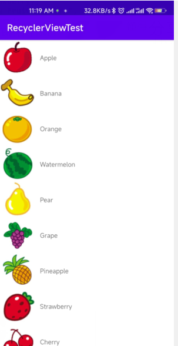
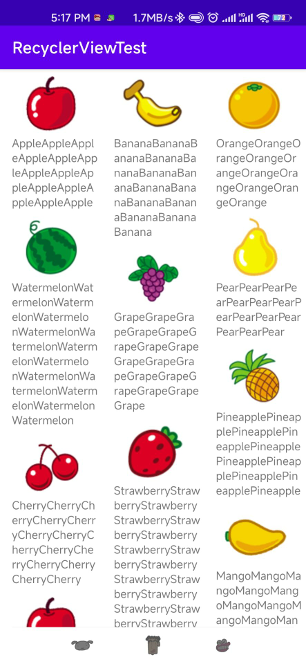

# 更强大的滚动控件——RecyclerView

&emsp;&emsp;ListView由于其强大的功能，在过去的Android开发当中可以是贡献卓越，直到今天仍然还有不计其数的程序继续使用着ListView。不过ListView并不是完全没有缺点，比如说如果我们不使用一些技巧来提升它的运行效率，那么ListView的性能就会比较差。还有，ListView的拓展性也不够好，它只能实现数据纵向滚动的效果，如果我们想实现横向滚动的效果，ListView是做不到的。

&emsp;&emsp;为此，Android提供了一个更强大的滚动控件——RecyclerView。它可以说一个增强版的ListView，不仅可以轻松实现和ListView同样的效果，还优化了ListView中存在的各种不足之处。目前Android官方更加推荐使用RecyclerView，未来也会有更多的程序逐渐从ListView转向RecyclerView，那么本节我们就来详细讲解一下RecyclerView的使用方法。

## RecyclerView的基本使用

&emsp;&emsp;和百分比布局类似，RecyclerView也属于新增的控件，为了让RecyclerView在所有Android版本上都能使用，Android团队采取了同样的方式，将RecyclerView定义在了support库当中，因此，想要使用RecyclerView这个控件，首先需要在项目的build.gradle中添加相应的版本依赖库才行。

```groovy
        dependencies {
        implementation 'com.android.support:recyclerview-v7:28.0.0'
        }
dependencies {
    //implementation 'com.android.support:appcompat-v7:28.0.0'
    //implementation 'com.android.support:recyclerview-v7:28.0.0'
    implementation 'androidx.recyclerview:recyclerview:1.2.0-alpha05'
    implementation 'androidx.appcompat:appcompat:1.2.0'
    implementation 'com.google.android.material:material:1.2.1'
    implementation 'androidx.constraintlayout:constraintlayout:2.0.1'
    testImplementation 'junit:junit:4.+'
    androidTestImplementation 'androidx.test.ext:junit:1.1.2'
    androidTestImplementation 'androidx.test.espresso:espresso-core:3.3.0'
}
```
这里使用的是androidx实现

```xml
<?xml version="1.0" encoding="utf-8"?>
<LinearLayout
        xmlns:android="http://schemas.android.com/apk/res/android"
        xmlns:tools="http://schemas.android.com/tools"
        android:orientation="vertical"
        android:layout_width="match_parent"
        android:layout_height="match_parent"
        tools:context=".MainActivity">
    <android.support.v7.widget.RecyclerView
            android:id="@+id/recycler_view"
            android:layout_width="match_parent"
            android:layout_height="match_parent"/>

</LinearLayout>
```

&emsp;&emsp;在布局中加入一个RecyclerView控件也是非常简单的，先为RecyclerView指出一个id，然后将宽度和高度都设置为match_parent，这样RecyclerView就充满整个布局空间。需要注意的是，由于RecyclerView并不是内置在系统SDK当中，所以需要把完整的包路径指定出来。这里我们想要使用RecyclerView实现和ListView相同的效果，因此需要准备一份同样的资源。

&emsp;&emsp;同样新建一个fruit类，以及为RecyclerView准备一个适配器,新建一个FruitAdapter类，让这个适配器继承自RecyclerView.Adapter，并将泛型指定为FruitAdapter.ViewHolder。其中viewHoler是我们在FruitAdapter中定义的一个内部类。

```java
package com.zj970.recyclerviewtest.Adapter;

import android.support.annotation.NonNull;
import android.support.v7.widget.RecyclerView;
import android.view.LayoutInflater;
import android.view.View;
import android.view.ViewGroup;
import android.widget.ImageView;
import android.widget.TextView;
import com.zj970.recyclerviewtest.R;
import com.zj970.recyclerviewtest.entity.Fruit;

import java.util.List;

public class FruitAdapter extends RecyclerView.Adapter<FruitAdapter.ViewHolder> {

    /**
     * 水果集合
     */
    private List<Fruit> mFruitList;

    public FruitAdapter(List<Fruit> fruitList){
        this.mFruitList = fruitList;
    }


    @NonNull
    @Override
    public ViewHolder onCreateViewHolder(@NonNull ViewGroup viewGroup, int i) {
        View view = LayoutInflater.from(viewGroup.getContext()).inflate(R.layout.fruit_item,viewGroup,false);
        ViewHolder  viewHolder = new ViewHolder(view);
        return viewHolder;
    }

    @Override
    public void onBindViewHolder(@NonNull ViewHolder viewHolder, int i) {
        Fruit fruit = mFruitList.get(i);
        viewHolder.fruitName.setText(fruit.getName());
        viewHolder.fruitImage.setImageResource(fruit.getImageId());
    }

    @Override
    public int getItemCount() {
        return mFruitList.size();
    }

   static class ViewHolder extends RecyclerView.ViewHolder{
        ImageView fruitImage;
        TextView fruitName;

       public ViewHolder(@NonNull View itemView) {
           super(itemView);
           fruitImage = itemView.findViewById(R.id.fruit_image);
           fruitName = itemView.findViewById(R.id.fruit_name);
       }
   }
}
```

&emsp;&emsp;虽然这段代码看上去好像很长，但其实它比ListView更容易理解，我们首先定义了一个内部类ViewHolder，ViewHolder要继承自RecyclerView.ViewHolder。然后ViewHolder的构造函数中要传入一个View参数，这个参数通常就是RecyclerView子项的最外层布局，那么我们可以就可以通过findViewById()方法来得到布局中的ImageView和TextView的实例了。接着往下看，FruitAdapter中也有一个构造函数，这个方法用于把要展示的数据源传进来，并赋值给一个全局变量mFruitList，我们后续的操作都将在这个数据源的基础上进行。继续往下看，FruitAdapter是继承自Recycler.Adapter的，那么就必须重写onCreateViewHolder()、onBindViewHolder()和getItemCount()这三个方法。onCreateViewHolder()方法是用来创建一个ViewHolder实例，我们在这个方法中将fruit_item布局加载进来，然后创建一个viewHolder实例的，我们在这个方法章将fruit_item布局加载进来，然后创建一个ViewHolder实例，并把加载出来的布局传入构造函数中，最后将ViewHolder的实例返回。onBindViewHolder()方法是用于对RecyclerView子项的数据进行赋值的，会在每个子项被滚动到屏幕内的时候执行，这里我们通过i获得当前项Fruit实例，然后再将数据设置到ViewHolder的ImageView和TextView当中即可。getItemCount()方法就非常简单了，它用于告诉RecyclerView一共有多少子项，直接返回数据源的长度就行了。

```java
package com.zj970.recyclerviewtest;

import android.support.v7.widget.LinearLayoutManager;
import android.support.v7.widget.RecyclerView;
import androidx.appcompat.app.AppCompatActivity;
import android.os.Bundle;
import com.zj970.recyclerviewtest.Adapter.FruitAdapter;
import com.zj970.recyclerviewtest.entity.Fruit;

import java.util.ArrayList;
import java.util.List;

public class MainActivity extends AppCompatActivity {
    /**
     * Initialize the fruit container
     */
    private List<Fruit> fruitList = new ArrayList<>();

    @Override
    protected void onCreate(Bundle savedInstanceState) {
        super.onCreate(savedInstanceState);
        setContentView(R.layout.activity_main);
        
        initFruits();
        RecyclerView recyclerView = findViewById(R.id.recycler_view);
        LinearLayoutManager linearLayoutManager = new LinearLayoutManager(this);
        recyclerView.setLayoutManager(linearLayoutManager);
        FruitAdapter fruitAdapter = new FruitAdapter(fruitList);
        recyclerView.setAdapter(fruitAdapter);
    }

    /**
     * 初始化水果
     */
    private void initFruits(){
        for (int i = 0; i < 2; i++) {
            Fruit apple = new Fruit("Apple",R.drawable.apple_pic);
            fruitList.add(apple);
            Fruit banana = new Fruit("Banana",R.drawable.banana_pic);
            fruitList.add(banana);
            Fruit orange = new Fruit("Orange",R.drawable.orange_pic);
            fruitList.add(orange);
            Fruit watermelon = new Fruit("Watermelon",R.drawable.watermelon_pic);
            fruitList.add(watermelon);
            Fruit pear = new Fruit("Pear",R.drawable.pear_pic);
            fruitList.add(pear);
            Fruit grape = new Fruit("Grape",R.drawable.grape_pic);
            fruitList.add(grape);
            Fruit pineapple = new Fruit("Pineapple",R.drawable.pineapple_pic);
            fruitList.add(pineapple);
            Fruit strawberry = new Fruit("Strawberry",R.drawable.strawberry_pic);
            fruitList.add(strawberry);
            Fruit cherry = new Fruit("Cherry",R.drawable.cherry_pic);
            fruitList.add(cherry);
            Fruit mango = new Fruit("Mango",R.drawable.mango_pic);
            fruitList.add(mango);
        }
    }
}
```

&emsp;&emsp;可以看到，这里使用了一个同样的initFruits()方法，用于初始化所有的水果数据。接着在OnCreate()方法中我们先获取到RecyclerView实例，然后创建了一个LinearLayoutManager对象，并将它设置到RecyclerView当中。LayoutManager用于指定RecyclerView的布局方式，这里我们使用的LinearLayoutManager是线性布局的意思，可以实现和ListView类似的布局效果。接下来我们创建了FruitAdapter的实例，并将水果数据传入到FruitAdapter的构造函数中，最后调用RecyclerView的setAdapter()方法来完成适配器设置，这样RecyclerView和数据之间的关联就建立完成了。



## 实现横向滚动和瀑布式布局

&emsp;&emsp;我们已经知道，ListView的扩展性并不好，它只能实现纵向滚动的效果，如果想要进行横向滚动的话，ListView就做不到了。那么RecyclerView怎么做到？

```xml
<?xml version="1.0" encoding="utf-8"?>
<LinearLayout xmlns:android="http://schemas.android.com/apk/res/android"
              android:layout_width="100dp"
              android:layout_height="wrap_content"
              android:orientation="vertical">

    <ImageView
            android:id="@+id/fruit_image"
            android:layout_width="wrap_content"
            android:layout_height="wrap_content"
            android:layout_gravity="center_horizontal"/>

    <TextView
            android:id="@+id/fruit_name"
            android:layout_width="wrap_content"
            android:layout_height="wrap_content"
            android:layout_gravity="center_horizontal"
            android:layout_marginLeft="10dp"/>

</LinearLayout>
```
&emsp;&emsp;可以看到，我们将LinearLayout改成垂直方向排列，并将宽度设置为100dp。这里将宽度指定为固定值是因为每种水果的文字长度不一致，如果使用wrap_content的话，Recycler的子项就会有长有短，非常不美观；而如果用match_parent的话，就会导致宽度过长，一个子项占满整个屏幕。然后我们将ImageView和TextView都设置成了布局中水平居中，并且使用了layout_marginTop属性让文字和图片之间保持一些距离，接下来修改MainActivity

```java
package com.zj970.recyclerviewtest;

/*import android.support.v7.widget.LinearLayoutManager;
import android.support.v7.widget.RecyclerView;*/
import androidx.appcompat.app.AppCompatActivity;
import android.os.Bundle;
import androidx.recyclerview.widget.LinearLayoutManager;
import androidx.recyclerview.widget.RecyclerView;
import com.zj970.recyclerviewtest.Adapter.FruitAdapter;
import com.zj970.recyclerviewtest.entity.Fruit;

import java.util.ArrayList;
import java.util.List;

public class MainActivity extends AppCompatActivity {
    /**
     * Initialize the fruit container
     */
    private List<Fruit> fruitList = new ArrayList<>();

    @Override
    protected void onCreate(Bundle savedInstanceState) {
        super.onCreate(savedInstanceState);
        setContentView(R.layout.activity_main);

        initFruits();
        RecyclerView recyclerView = findViewById(R.id.recycler_view);
        LinearLayoutManager linearLayoutManager = new LinearLayoutManager(this);
        linearLayoutManager.setOrientation(LinearLayoutManager.HORIZONTAL);
        recyclerView.setLayoutManager(linearLayoutManager);
        FruitAdapter fruitAdapter = new FruitAdapter(fruitList);
        recyclerView.setAdapter(fruitAdapter);
    }

    /**
     * 初始化水果
     */
    private void initFruits(){
        for (int i = 0; i < 2; i++) {
            Fruit apple = new Fruit("Apple",R.drawable.apple_pic);
            fruitList.add(apple);
            Fruit banana = new Fruit("Banana",R.drawable.banana_pic);
            fruitList.add(banana);
            Fruit orange = new Fruit("Orange",R.drawable.orange_pic);
            fruitList.add(orange);
            Fruit watermelon = new Fruit("Watermelon",R.drawable.watermelon_pic);
            fruitList.add(watermelon);
            Fruit pear = new Fruit("Pear",R.drawable.pear_pic);
            fruitList.add(pear);
            Fruit grape = new Fruit("Grape",R.drawable.grape_pic);
            fruitList.add(grape);
            Fruit pineapple = new Fruit("Pineapple",R.drawable.pineapple_pic);
            fruitList.add(pineapple);
            Fruit strawberry = new Fruit("Strawberry",R.drawable.strawberry_pic);
            fruitList.add(strawberry);
            Fruit cherry = new Fruit("Cherry",R.drawable.cherry_pic);
            fruitList.add(cherry);
            Fruit mango = new Fruit("Mango",R.drawable.mango_pic);
            fruitList.add(mango);
        }
    }
}
```

&emsp;&emsp;MainActivity中只加入了linearLayoutManager.setOrientation(LinearLayoutManager.HORIZONTAL)，调用了LinearLayoutManager的setOrientation()方法来设置布局的排列方向，默认是纵向排列的，我们传入LinearLayoutManager.HORIZONTAL来表示让布局横向排列，这样就可以实现横向排列了。


&emsp;&emsp;你可以用手指在水平方向上滑动来查看屏幕外的数据。为什么ListView很难或者根本无法实现的效果在RecyclerView上这么轻松就能实现了呢？这主要得益于RecycleView出色的设计。ListView的布局排列是由自身去管理的，而RecyclerView则将这个工作交给了LayoutManager，LayoutManager中制定出各种不同排列方式的布局了。除了LinearLayoutManager之外，RecyclerView还给我们提供了GridLayoutManager和StaggeredGridLayoutManager这两种内置的布局排列方式，GridLayoutManager可用于实现网络布局，StaggeredGridLayoutManager可以用于实现瀑布流布局。

&emsp;&emsp;这里实现瀑布流布局。首先更改一下fruit_item.xml中的代码，如下所示：

```xml
<?xml version="1.0" encoding="utf-8"?>
<LinearLayout xmlns:android="http://schemas.android.com/apk/res/android"
              android:layout_width="match_parent"
              android:layout_height="wrap_content"
              android:layout_margin="5dp"
              android:orientation="vertical">

    <ImageView
            android:id="@+id/fruit_image"
            android:layout_width="wrap_content"
            android:layout_height="wrap_content"
            android:layout_gravity="center_horizontal"/>

    <TextView
            android:id="@+id/fruit_name"
            android:layout_width="wrap_content"
            android:layout_height="wrap_content"
            android:layout_gravity="left"
            android:layout_marginLeft="10dp"/>

</LinearLayout>
```

&emsp;&emsp;这里做了几处小的调整，首先将LinearLayout的宽度由100dp改成了match_parent，因为瀑布流布局的宽度应该是根据布局的列数来自动适配的，而不是一个固定值。另外我们使用了layout_margin属性来让子项之间互留一点间距，这样就不至于所有子项都紧贴在一起。还有就是将TextView的对齐属性改成了居左对齐，因为待会我们会将文字的长度变长，如果还是居中显示就会感觉怪怪的。紧接着修改MainActivity中的代码

```java
package com.zj970.recyclerviewtest;

/*import android.support.v7.widget.LinearLayoutManager;
import android.support.v7.widget.RecyclerView;*/
import androidx.appcompat.app.AppCompatActivity;
import android.os.Bundle;
import androidx.recyclerview.widget.LinearLayoutManager;
import androidx.recyclerview.widget.RecyclerView;
import androidx.recyclerview.widget.StaggeredGridLayoutManager;
import com.zj970.recyclerviewtest.Adapter.FruitAdapter;
import com.zj970.recyclerviewtest.entity.Fruit;

import java.util.ArrayList;
import java.util.List;
import java.util.Random;

public class MainActivity extends AppCompatActivity {
    /**
     * Initialize the fruit container
     */
    private List<Fruit> fruitList = new ArrayList<>();

    @Override
    protected void onCreate(Bundle savedInstanceState) {
        super.onCreate(savedInstanceState);
        setContentView(R.layout.activity_main);

        initFruits();
        RecyclerView recyclerView = findViewById(R.id.recycler_view);
        StaggeredGridLayoutManager layoutManager = new StaggeredGridLayoutManager(3,StaggeredGridLayoutManager.VERTICAL);
        //LinearLayoutManager linearLayoutManager = new LinearLayoutManager(this);
        //linearLayoutManager.setOrientation(LinearLayoutManager.HORIZONTAL);
        //recyclerView.setLayoutManager(linearLayoutManager);
        recyclerView.setLayoutManager(layoutManager);
        FruitAdapter fruitAdapter = new FruitAdapter(fruitList);
        recyclerView.setAdapter(fruitAdapter);
    }

    /**
     * 初始化水果
     */
    private void initFruits(){
        for (int i = 0; i < 2; i++) {
            Fruit apple = new Fruit(getRandomLangthName("Apple"),R.drawable.apple_pic);
            fruitList.add(apple);
            Fruit banana = new Fruit(getRandomLangthName("Banana"),R.drawable.banana_pic);
            fruitList.add(banana);
            Fruit orange = new Fruit(getRandomLangthName("Orange"),R.drawable.orange_pic);
            fruitList.add(orange);
            Fruit watermelon = new Fruit(getRandomLangthName("Watermelon"),R.drawable.watermelon_pic);
            fruitList.add(watermelon);
            Fruit pear = new Fruit(getRandomLangthName("Pear"),R.drawable.pear_pic);
            fruitList.add(pear);
            Fruit grape = new Fruit(getRandomLangthName("Grape"),R.drawable.grape_pic);
            fruitList.add(grape);
            Fruit pineapple = new Fruit(getRandomLangthName("Pineapple"),R.drawable.pineapple_pic);
            fruitList.add(pineapple);
            Fruit strawberry = new Fruit(getRandomLangthName("Strawberry"),R.drawable.strawberry_pic);
            fruitList.add(strawberry);
            Fruit cherry = new Fruit(getRandomLangthName("Cherry"),R.drawable.cherry_pic);
            fruitList.add(cherry);
            Fruit mango = new Fruit(getRandomLangthName("Mango"),R.drawable.mango_pic);
            fruitList.add(mango);
        }
    }

    private String getRandomLangthName(String name){
        Random random = new Random();
        int length = random.nextInt(20)+1;
        StringBuffer buffer = new StringBuffer();
        for (int i = 0; i < length; i++) {
            buffer.append(name);
        }
        return buffer.toString();
    }
}
```

&emsp;&emsp;首先，在onCreate()方法中，我们创建了一个StaggeredGridLayoutManager的实例。StaggeredGridLayoutManager的构造函数接收两个参数，第一个是用于指定布局的列数，传入3表示会把布局分为3列；第二个参数用于指定布局的排列方向，传入StaggeredGridLayoutManager.VERTICAL表示会让布局纵向排列，最后再把创建好的实例设置到RecyclerView当中就可以了，就是这么简单！

&emsp;&emsp;没错，仅仅修改了一行代码，我们就已经成功实现瀑布流布局的效果了。不过由于瀑布流布局需要各个子项的高度不一致才能看出明显的效果，为此我又使用了一个小技巧。这里我们把眼光聚焦再getRandomLengthName()这个方法上，这个方法使用了Random对象来创造一个1到20之间的随机数，然后将参数中传入的字符串重复随机遍。在initFruits()方法中，每个水果的名字都改成调用getRandomLengthName()方法上，这样就保证各水果名字的长短差距比较大，子项的高度也就各不相同了。效果图如下所示：



## RecyclerView的点击事件

&emsp;&emsp;和ListView一样，RecyclerView也必须能影响点击事件才可以，不然的话就没什么实际的用途了。不过不同于ListView的是，RecyclerView并没有提供类似于setOnItemClickListener()这样的注册监听器方法