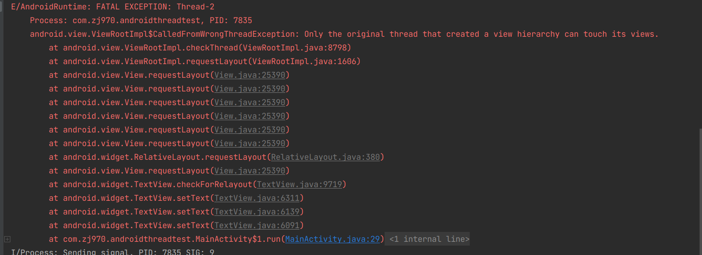
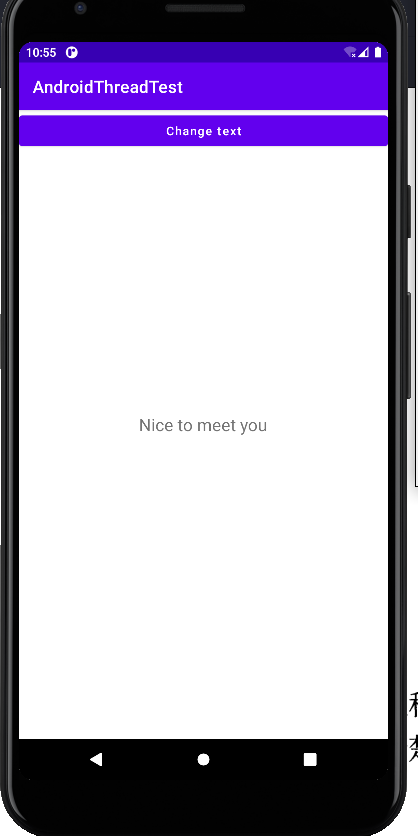
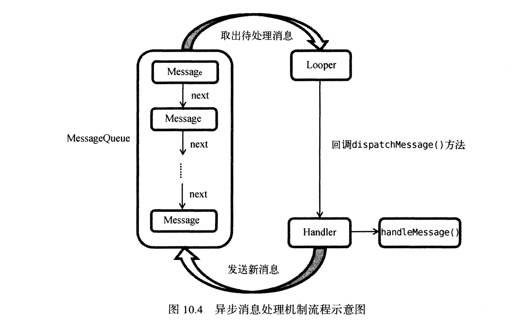
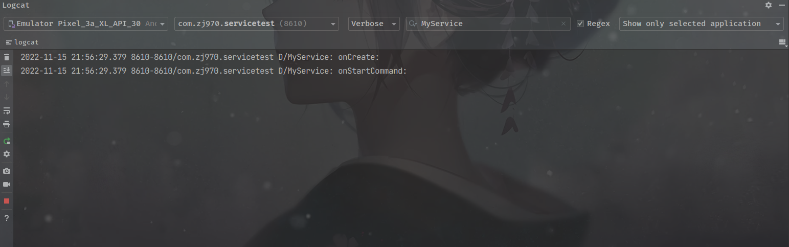
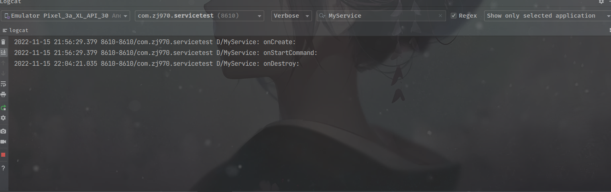
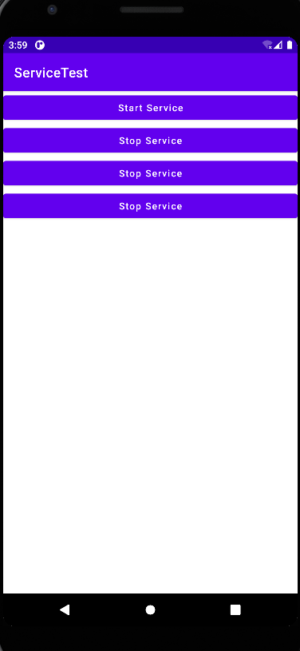
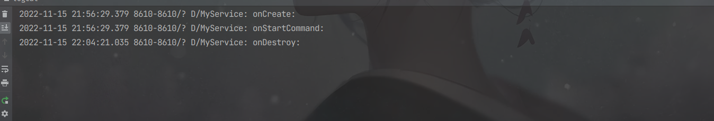
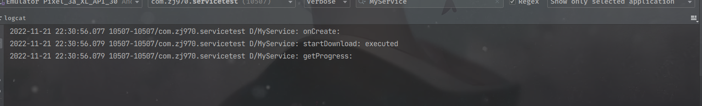
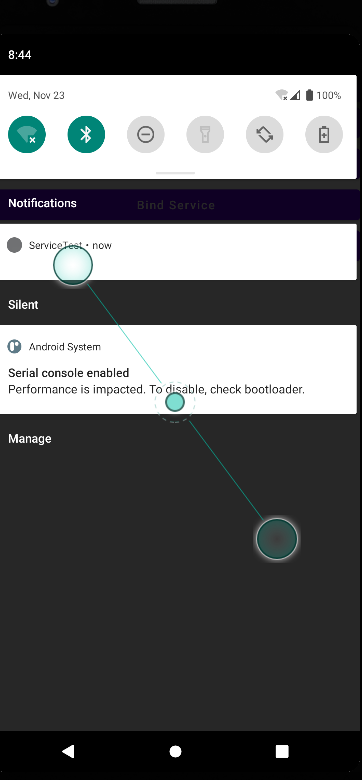
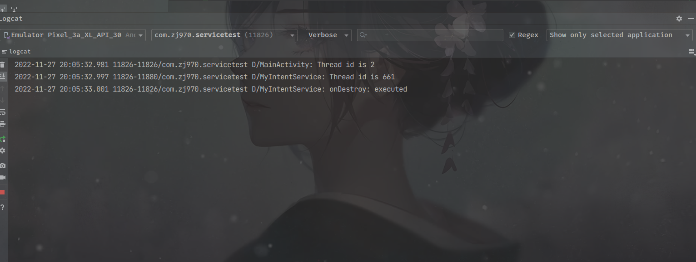

# 第10章 后台默默的劳动者——探究服务  

&emsp;&emsp;记得在我上大学的时候，iPhone是属于少数人才拥有的稀有物品，Android甚至还没面世，那个时候全球的手机市场是由诺基亚统治着的。当时我觉得诺基亚的Symbian操作系统做得特别出色，因为比起一般的手机，它可以支持后台功能。那个时候能够一边打着电话、听着音乐，一边在后台挂着QQ是件非常酷的事情。所以我也曾经单纯地认为，支持后台的手机就是智能手机。  
&emsp;&emsp;而如今，Symbian早已风光不再，Android和iOS占据了大部分的智能市场份额，Windows Phone 也占据了一小部分，目前已是三分天下的局面。在这三大智能手机操作系统中，iOS和WindowsPHone一开始都是不支持后台的，后来逐渐意识到这个功能的重要性，才加入了后台功能。而Android则是沿用了Symbian的老系统，从 一开始就支持后台功能，这使得应用程序即使在关闭的情况下仍然可以在后台继续运行。不管怎么说，后台功能属于四大组件之一，其重要程度不言而喻，那么我们自然要好好学习它的用法了。  

## 10.1 服务是什么

&emsp;&emsp;服务(Service)是Android中实现程序后台运行的解决方案，它它非常适合去执行那些不需要和用户交而且还要求长期运行的任务。服务的运行不依赖任何用户界面，即使程序被切换到后台，或者用户打开了另外一个应用程序，服务仍然能够保持正常运行。  
&emsp;&emsp;不过需要注意的是，服务并不是运行在一个独立的进程当中的，而是依赖于创建服务时所在的应用程序进程。当某个应用程序进程被杀掉时，所以依赖于该进程的服务也会停止运行。  
&emsp;&emsp;另外，也不要被服务的后台概念所迷惑，实际上服务并不会自动开启线程，所有的代码都是默认运行在主线程当中。也就是说，我们需要在服务的内部手动创建子线程，并在这里执行具体的任务，否则就有可能出现主线程被阻塞住的情况。那么本章的第一堂课，我们就先来学习一下Android多线程编程的知识。  

## 10.2 Android多线程编程  

&emsp;&emsp;熟悉Java的你，对多线程编程一定不会陌生吧。当我们需要执行一些耗时操作，比如说发起一条网络请求时，考虑到网速等其他原因，服务器未必立刻响应我们的请求，如果不将这类操作放在子线程里去运行，就会导致主线程被阻塞住，从而影响用户对软件正常使用，那么就让我们从线程的基本用法开始学习吧。  

### 10.2.1 线程的基本用法  

&emsp;&emsp;Android多线程编程其实并不比Java多线程编程特殊，基本都是使用相同的语法。比如说，定义一个线程只需要新建一个类继承自Thread，然后重写父类的run()方法，并在里面编写耗时逻辑即可，如下所示：  

```
class MyThread extends Thread{
    @Override
    public void run(){
        //处理相关的逻辑
    }
}
```

&emsp;&emsp;那么该如何开启这个线程呢？其实也很简单，只需要new出MyThread的实例，然后调用它的start()方法，这样run()方法中的代码就会在子线程中运行了，如下所示：  

```
new MyThread().start();
```

&emsp;&emsp;当然，使用继承的方式耦合性有点高，更多的时候我们都会选择使用实现Runnable接口的方式定义一个线程，如下所示：  

```
class MyThread implements Runnable{
    @Override
    public void run(){
        //处理具体的逻辑
    }
}
```

&emsp;&emsp;如果使用了这种写法，启动线程的方法也需要进行相应的改变，如下所示：  

```
MyThread myThread = new MyThread();
new Thread(myThread).start();
```
&emsp;&emsp;可以看到，Thread的构造函数接收一个Runnable参数，而我们new 出的MyThread正是一个实现了Runnable接口的对象，所以可以直接将它传入到Thread的构造函数里。接着调用Thread的start()方法，run()方法中的代码就会在子线程当中运行了。  
&emsp;&emsp;当然，如果你不想专门再定义一个类去实现Runnable接口，也可以使用匿名类的方式，这种方式更加常见，如下所示：  

```
new Thread(new Runnable(){
       @Override
       public void run(){
        //处理相关逻辑
       }

}).start();
```

&emsp;&emsp;以上几种线程的使用方式相信你并不会感到陌生，因为在Java中创建和启动线程也是使用同样的方式，了解了线程的基本用法后，下面我们来看一下Android多线程与Java多线程编程不同的地方。  

### 10.2.2 在子线程中更新UI

&emsp;&emsp;和许多其他的GUI库一样，Android的UI也是线程不安全的。也就是说，如果想要更新应用程序的UI元素，则 必须在主线程中进行，否则就会出现异常。  
&emsp;&emsp;眼见为实，新建一个AndroidThreadTest模块，然后修改activity_main.xml中的代码： 

```xml
<?xml version="1.0" encoding="utf-8"?>
<RelativeLayout
        xmlns:android="http://schemas.android.com/apk/res/android"
        xmlns:tools="http://schemas.android.com/tools"
        android:layout_width="match_parent"
        android:layout_height="match_parent"
        android:orientation="vertical"
        tools:context=".MainActivity">
    <Button
            android:id="@+id/change_text"
            android:layout_width="match_parent"
            android:layout_height="wrap_content"
            android:textAllCaps="false"
            android:text="Change text"/>

    <TextView
            android:id="@+id/text"
            android:layout_width="wrap_content"
            android:layout_height="wrap_content"
            android:layout_centerInParent="true"
            android:text="Hello world"
            android:textSize="20sp"/>

</RelativeLayout>
```

&emsp;&emsp;布局文件中定义了两个控件，TextView用于在屏幕的正中央显示一个Hello World字符串，Button用于改变TextView中显示的内容，我们希望在点击Button后可以把TextView中显示的字符串改成 Nice to meet you。 修改MAinActivity中代码，如下所示：  

```java
package com.zj970.androidthreadtest;

import android.view.View;
import android.widget.Button;
import android.widget.TextView;
import androidx.appcompat.app.AppCompatActivity;
import android.os.Bundle;

public class MainActivity extends AppCompatActivity implements View.OnClickListener{

    TextView text;

    @Override
    protected void onCreate(Bundle savedInstanceState) {
        super.onCreate(savedInstanceState);
        setContentView(R.layout.activity_main);
        text = findViewById(R.id.text);
        Button changeText = findViewById(R.id.change_text);
        changeText.setOnClickListener(this::onClick);
    }

    @Override
    public void onClick(View v) {
        switch (v.getId()){
            case R.id.change_text:
                new Thread(new Runnable() {
                    @Override
                    public void run() {
                        text.setText("Nice to meet you");
                    }
                }).start();
                break;
            default:
                break;
        }
    }
}
```

&emsp;&emsp;可以看到，我们在Change Text按钮的点击事件里面开启个子线程，然后在子线程中调用TextView的setText()方法将显示的字符串改成Nice to meet you。代码的逻辑非常简单，只不过我们是在子线程更新UI的。现在运行一下程序，并点击一下按钮，会发现程序崩溃了，如图所示：  



&emsp;&emsp;由此证实了Android确实是不允许子线程里去执行一些耗时任务，然后根据任务的执行结果来更新相应的UI控件，这该如何是好呢？  
&emsp;&emsp;对于这种情况，Android提供了一套异步消息处理机制，完美地解决了在子线程进行UIc操作的问题。本小节中我们先来学习一下异步消息处理的使用方法，下一小节中再去分析它的原理。修改MainActivity中的代码:  

```java
package com.zj970.androidthreadtest;

import android.os.Handler;
import android.os.Message;
import android.view.View;
import android.widget.Button;
import android.widget.TextView;
import androidx.appcompat.app.AppCompatActivity;
import android.os.Bundle;

public class MainActivity extends AppCompatActivity implements View.OnClickListener{
    public static final int UPDATE_TEXT = 1;
    TextView text;

    private Handler handler = new Handler(){
        public void handleMessage(Message msg){
            switch (msg.what){
                case UPDATE_TEXT:
                    //这里进行UI操作
                    text.setText("Nice to meet you");
                    break;
                default:
                    break;
            }
        }
    };

    @Override
    protected void onCreate(Bundle savedInstanceState) {
        super.onCreate(savedInstanceState);
        setContentView(R.layout.activity_main);
        text = findViewById(R.id.text);
        Button changeText = findViewById(R.id.change_text);
        changeText.setOnClickListener(this::onClick);
    }

    @Override
    public void onClick(View v) {
        switch (v.getId()){
            case R.id.change_text:
                new Thread(new Runnable() {
                    @Override
                    public void run() {
                        Message message = new Message();
                        message.what = UPDATE_TEXT;
                        handler.sendMessage(message);//将Message对象发送出去
                    }
                }).start();
                break;
            default:
                break;
        }
    }
}
```  
&emsp;&emsp;这里我们先是定义了一个整型常量UPDATE_TEXT，用于表示更新TextView这个动作。然后新增一个Handler对象，并重写父类的handleMessage()方法，在这里对具体的Message进行处理。如果发现Message的what字段的值等于UPDATE_TEXT，就将TextView显示的内容改成Nice to meet you。  
&emsp;&emsp;下面再来看一下Change Text按钮的点击事件中的代码。可以看到，这次我们并没有子线程里直接进行UI操作，而是创建了一个Message(android.os.Message)对象，并将它的what字段的值指定为UPDATE_TEXT，然后调用Handler的sendMessage()方法将这条Message发送出去。很快，Handler就会收到这条Message，并在handleMessage()方法中对它进行处理。注意此时UI操作。接下来对Message携带的what字段的值进行判断，如果等于UPDATE_TEXT，就将TextView显示的内容改成Nice to meet you。  
&emsp;&emsp;现在重新运行程序，可以看到屏幕的正中央显示着Hello world。如果等于UPDATE_TEXT，就将TextView显示的内容改成Nice to meet you。

  

&emsp;&emsp;这样你就已经掌握了Android异步消息处理的基本用法，使用这种机制就可以出色地解决掉在子线程中更新UI问题。不过恐怕你对它的工作原理还不是很清楚，下面我们就来分析一下Android异步消息处理机制到底是如何工作的。  

### 10.2.3 解析异步消息处理机制  

&emsp;&emsp;Android中的异步消息处理主要由4个部分组成：Message、Handler、MessageQueue和Looper。其中Message和Handler在上一小节中我们已经接触过了，而MessageQueue和Looper对于你来说还是全新的概念，下面我就对这4个部分进行一下简单的介绍。  

1. Message  

&emsp;&emsp;Message是线程之间传递的消息，它可以在内部携带少量的信息，用于在不同线程之间交换数据。上一个小节中我们使用到了Message的what字段，除此之外还可以使用arg1和arg2字段来携带一些整型数据，使用obj字段携带一个Object对象。
    
2. Handler  

&emsp;&emsp;Handler顾名思义也就是处理者的意思，它主要是用于发送和处理消息的。发送消息一般是使用Han的sendMessage()方法，而发出的消息经过一系列地辗转处理后，最终会传递到Handler的handleMessage()方法中。  

3. MessageQueue  

&emsp;&emsp;MessageQueue是消息队列的意思，它主要用于存放通过Handler发送的消息。这部分消息会一直存在于消息队列中，等待被处理。每个线程中会有一个MessageQueue对象。  

4. Looper  

&emsp;&emsp;Looper是每个线程中的MessageQueue的管家，调用Looper的loop()方法后，就会进入到一个无限循环当中，然后每当发现MessageQueue中存在一条消息，就会将它取出，并传递到Handler的handleMessage()方法中。每个线程也只会有一个Looper对象。

&emsp;&emsp;了解了Message、Handler、MessageQueue以及Looper的基本概念后，我们再来把异步消息处理的整个流程梳理一遍。首先需要在主线程当中创建一个Handler对象，并重新handleMessage()方法。然后当子线程中需要进行UI操作时，就创建一个Message对象，并通过Handler将这条消息发送出去。之后这条消息就会被添加到MessageQueue的队列中等待被处理，而Looper则会一直尝试从MessageQueue中取出待处理的消息，最后分发回Handler的handleMessage()方法中。由于Handler是在主线程中创建的，所以此时handlerMessage()方法的代码也会在主线程中运行，于是我们在这里就可以安心地进行UI操作了。整个异步消息处理机制的流程示意如图所示：  

  

&emsp;&emsp;一条Message经过这样一个流程的辗转调用，也就从子线程进入到了主线程，从不能更新UI变成可以更新UI，整个异步消息处理的核心思想也就是如此。  
&emsp;&emsp;而我们在第9章中使用到的runOnUiThread()方法其实就是一个异步消息处理机制的接口封装，它虽然表面上看起来用法更为简单，但其实背后的实现原题如上图的描述是一模一样。  

### 10.2.4 使用AsyncTask  

&emsp;&emsp;不过为了更加方便我们在子线程中对UI进行操作，Android还提供了另外一些好用的工具，比如AsyncTask。借助AsyncTask，即使你对异步消息处理机制完全不了解，也可以十分简单地从子线程切换到主线程，当然，AsyncTask背后的实现原理也是基于异步消息处理机制的，只是Android帮我们做了很好的封装而已。  
&emsp;&emsp;首先来看一下AsyncTask的基本用法，由于AsyncTask是一个抽象类，所以如果我们想要使用它，就必须要创建一个子类去继承它。在继承时我们可以为AsyncTask类指定3个泛型参数，这3个参数的用途如下。  
- Params。在执行AsyncTask时需要传入的参数，可用于在后台任务中使用。  
- Progress。后台任务执行时，如果需要在界面上显示当前的进度，则使用这里指定的泛型作为进度单位。  
- Result。当任务执行完毕后，如果需要对结果进行返回，则使用这里指定的泛型作为返回值类型。  

&emsp;&emsp;因此，一个最简单的自定义AsyncTask就可以写成如下方式：  

```
class DownloadTask extends AsyncTask<Void,Integer,Boolean>{

}
```

&emsp;&emsp;这里我们把AsyncTask的第一个泛型参数指定为Void，表示在执行AsyncTask的时候不需要传入参数给后台任务。第二个泛型参数指定为Integer，表示使用整型数据来作为进度显示单位。第三个泛型参数指定为Boolean，则表示使用布尔型数据来反馈执行结果。  
&emsp;&emsp;当然，目前我们定义的DownloadTask还是一个空任务，并不能进行任何实际的操作，我们还需要去重写AsyncTask中的几个方法才能完成对任务的定制。经常需要去重写的方法有以下4个。  

1. onPreExecute()

&emsp;&emsp;这个方法会在后台任务开始执行之前调用，用于进行一些界面上的初始化操作，比如显示一个进度条对话框等。  

2. doInBackground(Params...)

&emsp;&emsp;这个方法中的所有代码都会在子线程中运行，我们应该在这里去处理所有的耗时任务。任务一旦完成就可以通过return语句来将任务的执行结果返回，如果AsyncTask的第三个泛型参数指定的是Void，就可以不返回任务结果。注意，在这个方法中不可以进行UI操作的，如果需要更新UI元素，比如说反馈当前任务的执行进度，可以调用publishProgress(Progress...)方法来完成。  

3. onProgressUpdate(Progress...)

&emsp;&emsp;当后台任务中调用了publishProgress(Progress...)方法后，onProgressUpdate(Progress...)方法就会很快被调用，该方法中携带的参数就是在后天任务中传递过来的。在这个方法中可以对UI进行操作，利用参数中的数值就可以对界面元素进行相应的更新。  

4. onPostExecute(Result)

&emsp;&emsp;当后台任务执行完毕并通过return语句进行返回时，这个方法很快会被调用。返回的数据会作为参数传递到此方法中，可以利用参数中的数据来进行一些UI操作，比如说提醒任务执行的结果，以及关闭掉进度条对话框等。  
&emsp;&emsp;因此，一个比较完整的自定义AsyncTask就可以写成如下方式：  

```
class DownloadTask extends AsyncTask<Void,Integer,Boolean>{
    @Override
    protexted void onPreExecute(){
        progressDialog.show();//显示进度对话框
    }
    
    @Override
    protected Boolean doInBackground(Void...  params){
    try {
        while(true){
            int downloadPercent = doDownload();//这是一个虚构的方法
            publishProgress(downloadPercent);
            if  (downloadPercent >= 100){
                break;
                }
        }
    } catch (Exception e){
        return false;
        }
        return true;
    }
    
    @Override
    protexted void onProgressUpdate(Integer... values){
        //在这里更新下载进度
        progressDialog.setMessage("Downloaded" + values[0] + "%");
    }
    
    @Override void onPostExecute(Boolean result){
         progressDialog.dismiss();//关闭进度对话框
        //在这里提示下载结果
        if (result){
            Toast.makeText(context,"Download succeeded",Toast.LENGTH_SHORT).show();
        }else{
            Toast.makeText(context,"Download failed",Toast.LENGTH_SHORT).show();
        }
    }
}
```
&emsp;&emsp;在这个DownloadTask中，我们在doInBackground()方法里去执行具体的下载任务。这个方法里的代码都是在子线程中运行的，因而不会影响到主线程的运行。注意这里虚构了一个doDownload()方法，这个方法用于计算当前的下载进度并返回，我们假设这个方法已经存在了。在得到了当前的下载进度后，下面该考虑如何计算当前的下载进度并返回，我们假设这个方法已经存在了。在得到了当前的下载进度后，下面该考虑如何把它显示到界面上了，由于doInBackground()方法是在子线程中运行的，这里肯定不能进行UI操作，所以我们可以调用publishProgress()方法并将当前的下载进度传进来，这样onProgressUpdate()方法就会很快被调用，在这里就可以进行UI操作了。  
&emsp;&emsp;当下载完成后，doInBackground()方法会返回一个布尔型变量，这样onPostExecute()方法就会很快被调用，这个方法也是在主线程中运行的。然后在这里我们会根据下载的结果弹出相应的Toast提示，从而完成整个DownloadTask任务。  
&emsp;&emsp;简单来说，使用AsyncTask的诀窍就是，在doInBackground()方法中执行具体的耗时任务，在onProgressUpdate()方法中进行UI操作，在onPostExecute()方法中执行一些任务的收尾工作。  
&emsp;&emsp;如果想要启动这个任务，只需要编写以下代码即可：  

````
new DownloadTask().execute();
````
&emsp;&emsp;以上就是AsyncTask()的基本用法，怎么样，是不是感觉简单方便多了，我们并不需要去考虑什么异步消息处理机制，也不需要专门使用一个Handler来发送和接收消息，只需要调用一下publishProgress()方法，就可以轻松地从子线程切换到UI操作了。  

## 10.3 服务的基本用法

&emsp;&emsp;了解了Android多线程编程的技术之后，下面就让我们进入到本章的正题，开始对服务的相关内容进行学习。作为Android 四大组件之一，服务也少不了有很多非常重要的知识点，那我们自然要从最基本的用法开始学习了。  

### 10.3.1 定义一个服务  

&emsp;&emsp;新建一个ServiceTest项目，然后右击->new->service->service。将服务名命名为MyService，Exported属性表示是否允许除了当前程序之外的其他程序访问这个服务，Enable属性表示是否启动这个服务。将这两个属性都勾中，点击Finish完成创建。

```java

package com.zj970.servicetest;

import android.app.Service;
import android.content.Intent;
import android.os.IBinder;

public class MyService extends Service {
    public MyService() {
    }

    @Override
    public IBinder onBind(Intent intent) {
        // TODO: Return the communication channel to the service.
        throw new UnsupportedOperationException("Not yet implemented");
    }
}
```

&emsp;&emsp;可以看到，MyService是继承自Service类的，说明这是一个服务。目前MyService中可以算是空空如也，但有一个onBind()方法特别醒目。这个方法是Service中唯一的一个抽吸方法，所以必须在子类中实现。我们会在后面小节中使用到onBind()方法。  
&emsp;&emsp;既然是定义一个服务，自然应该在服务中去处理一些事情了，那处理事情的逻辑应该写在哪里呢？这里就可以重写Service中的另外一些方法了，如下所示：  

```java
package com.zj970.servicetest;

import android.app.Service;
import android.content.Intent;
import android.os.IBinder;

public class MyService extends Service {
    public MyService() {
    }

    @Override
    public IBinder onBind(Intent intent) {
        // TODO: Return the communication channel to the service.
        throw new UnsupportedOperationException("Not yet implemented");
    }

    @Override
    public void onCreate() {
        super.onCreate();
    }

    @Override
    public int onStartCommand(Intent intent, int flags, int startId) {
        return super.onStartCommand(intent, flags, startId);
    }

    @Override
    public void onDestroy() {
        super.onDestroy();
    }
}
```

&emsp;&emsp;可以看到，这里我们又重写了onCreate()、pnStartCommand()和onDestroy()这3个方法，它们是每个服务中最常用到的3个方法了、其中onCreate()方法会在服务创建的时候调用，onStartCommand()方法会在每次服务启动的时候调用，onDestroy()方法会在服务销毁的时候调用。  
&emsp;&emsp;通常情况下，如果我们希望服务一旦启动就立即去执行某个动作，就可以将逻辑写在onStartCommand()方法里。而当服务销毁时，我们又应该在onDestroy()方法中去回收那些不再使用的资源。  
&emsp;&emsp;另外需要注意，每一个服务都需要在AndroidManifest.xml文件中进行注册才能生效，不知道你有没有发现，这时Android四大组件共有的特点。  

AndroidManifest.xml如下：

```xml
<?xml version="1.0" encoding="utf-8"?>
<manifest xmlns:android="http://schemas.android.com/apk/res/android"
          package="com.zj970.servicetest">

    <application
            android:allowBackup="true"
            android:icon="@mipmap/ic_launcher"
            android:label="@string/app_name"
            android:roundIcon="@mipmap/ic_launcher_round"
            android:supportsRtl="true"
            android:theme="@style/Theme.ServerStudy">
        <service
                android:name=".MyService"
                android:enabled="true"
                android:exported="true">
        </service>

        <activity android:name=".MainActivity">
            <intent-filter>
                <action android:name="android.intent.action.MAIN"/>

                <category android:name="android.intent.category.LAUNCHER"/>
            </intent-filter>
        </activity>
    </application>

</manifest>
```

### 10.3.2 启动和停止服务  

&emsp;&emsp;定义好了服务之后，接下来就应该考虑如何去启动以及停止这个服务。启动和停止的方法当然你也不会陌生，主要是借助Intent来实现的，下面就让我们在ServiceTest项目中尝试去启动以及停止MyService这个服务。首先修改activity_main.xml中的代码：  

```xml
<?xml version="1.0" encoding="utf-8"?>
<LinearLayout
        xmlns:android="http://schemas.android.com/apk/res/android"
        xmlns:tools="http://schemas.android.com/tools"
        android:orientation="vertical"
        android:layout_width="match_parent"
        android:layout_height="match_parent"
        tools:context=".MainActivity">

    <Button
            android:id="@+id/start_service"
            android:layout_width="match_parent"
            android:layout_height="wrap_content"
            android:text="Start Service"
            android:textAllCaps="false"/>
    <Button
            android:id="@+id/stop_service"
            android:layout_width="match_parent"
            android:layout_height="wrap_content"
            android:text="Stop Service"
            android:textAllCaps="false"/>
</LinearLayout>
```

&emsp;&emsp;这里我们在布局文件中加入了两个按钮，分别是用于启动服务和停止服务。修改MainActivity中的代码：  

```java
package com.zj970.servicetest;

import android.content.Intent;
import android.view.View;
import android.widget.Button;
import androidx.appcompat.app.AppCompatActivity;
import android.os.Bundle;

public class MainActivity extends AppCompatActivity implements View.OnClickListener
{

    @Override
    protected void onCreate(Bundle savedInstanceState) {
        super.onCreate(savedInstanceState);
        setContentView(R.layout.activity_main);
        Button startService = findViewById(R.id.start_service);
        Button stopService = findViewById(R.id.stop_service);
        startService.setOnClickListener(this::onClick);
        stopService.setOnClickListener(this::onClick);
    }

    @Override
    public void onClick(View v) {
        switch (v.getId()){
            case R.id.start_service:
                Intent startIntent = new Intent(this,MyService.class);
                startService(startIntent);//开始服务
                break;
            case R.id.stop_service:
                Intent stopService = new Intent(this,MyService.class);
                stopService(stopService);//停止服务
                break;
            default:
                break;
        }
    }
}
```

&emsp;&emsp;可以看到，这里在onCreate()方法中分别获取到了Start Service按钮和Stop Service按钮的实例，并给它们注册了点击事件。然后在Start Service按钮的点击事件里，我们构建出了一个Intent对象，并调用了startService()方法来启动MyService这个服务。在Stop Service按钮的点击事件里，我们同样是构建出了一个Intent对象，并调用stopService()方法来停止MyService这个服务。startService()和stopService()方法都是定义在Context类中的，所以我们在活动里可以直接调用这两个方法。注意，这里完全是由活动来决定服务何时停止的，如果没有Stop Service按钮，服务则会一直处于运行状态。那服务有没有什么办法让自己停止下来呢？当然可以，只需要在MyService的任何一个位置调用stopSelf()方法就能让这个服务停止下来的。  

&emsp;&emsp;那么接下来又有一个问题需要思考了，我们如何才能证实服务已经成功启动或者停止了呢？最简单的办法就是在MyService的几个方法加入打印日志，如下所示：  

```java
package com.zj970.servicetest;

import android.app.Service;
import android.content.Intent;
import android.os.IBinder;
import android.util.Log;

public class MyService extends Service {
    private static final String TAG = "MyService";
    public MyService() {
    }

    @Override
    public IBinder onBind(Intent intent) {
        // TODO: Return the communication channel to the service.
        throw new UnsupportedOperationException("Not yet implemented");
    }

    @Override
    public void onCreate() {
        super.onCreate();
        Log.d(TAG, "onCreate: ");
    }

    @Override
    public int onStartCommand(Intent intent, int flags, int startId) {
        Log.d(TAG, "onStartCommand: ");
        return super.onStartCommand(intent, flags, startId);
    }

    @Override
    public void onDestroy() {
        Log.d(TAG, "onDestroy: ");
        super.onDestroy();
    }
}
```

运行一下程序，点击Start Service按钮，打印日志如下：  



&emsp;&emsp;MyService中的onCreate()和onStartCommand()方法都执行了，说明这个服务确实已经成功启动，亦可以通过adb shell service list查看，在点击Stop Service按钮，打印如图所示：  



&emsp;&emsp;由此证明，MyService确实已经停止下来。虽然我们已经学会了启动服务以及停止读物的方法，但onCreate()方法和onStartCommand()方法到底有什么区别呢？因为刚刚点击Start Service按钮后两个方法都执行了。  
&emsp;&emsp;其实onCreate()方法是在服务第一次创建的时候调用的，而onStartCommand()方法则在每次启动服务的时候都会调用，由于刚才我们是第一次点击Start Service按钮，服务此时还未创建过，所以两个方法都会执行，之后如果你再连续点击几次startService按钮，就发现只有onStartCommand()方法可以得到执行。

### 10.3.3 活动和服务进行通信

&emsp;&emsp;上以小节中我们学习了启动和停止服务的方法，不知道你有没有发现，虽然服务是在活动里启动的，但是在启动了服务之后，活动与服务基本上就没有什么关系了。确实如此，我们在活动里调用了startService()方法来启动MyService这个服务，然后MyService的onCreate()和onStartCommand()方法就会得到执行。之后服务会一直处于运行状态，但具体运行的是什么逻辑，活动就控制不了。这就类似于活动通知了服务一下：“你可以启动了！”然后服务就去忙自己的事情了，但活动并不知道服务去做了什么事情，但活动并不知道服务到底去做了什么事情，以及完成得如何。  
&emsp;&emsp;那么有没有什么办法能让活动与服务的关系更加紧密些呢？例如在活动中指挥服务干什么，服务就去干什么。当然可以，这就需要借助我们刚刚忽略的onBind()方法了。  
&emsp;&emsp;比如说，目前我们希望在MyService里提供一些下载功能，然后在活动中决定什么时候开始下载，以及随时查看下载进度。实现这个功能的思路是创建一个专门的Binder对象来对下载功能进行管理，修改NyService中的代码：  

````java
package com.zj970.servicetest;

import android.app.Service;
import android.content.Intent;
import android.os.Binder;
import android.os.IBinder;
import android.util.Log;

public class MyService extends Service {
    private static final String TAG = "MyService";
    private DownloadBinder mBinder = new DownloadBinder();
    public MyService() {
    }

    @Override
    public IBinder onBind(Intent intent) {
        // TODO: Return the communication channel to the service.
        return mBinder;
    }

    @Override
    public void onCreate() {
        super.onCreate();
        Log.d(TAG, "onCreate: ");
    }

    @Override
    public int onStartCommand(Intent intent, int flags, int startId) {
        Log.d(TAG, "onStartCommand: ");
        return super.onStartCommand(intent, flags, startId);
    }

    @Override
    public void onDestroy() {
        Log.d(TAG, "onDestroy: ");
        super.onDestroy();
    }
    
    class DownloadBinder extends Binder{
        public void startDownload(){
            Log.d(TAG, "startDownload: executed");
        }
        public int getProgress(){
            Log.d(TAG, "getProgress: ");
            return 0;
        }
    }
}
````
&emsp;&emsp;可以看到，这里我们新建了一个DownloadBinder类，并让它继承自Binder，然后在它的内部提供了开始下载以及查看下载进度的方法。当然这只是两个模拟方法，并没有实现真正的功能，我们在两个方法中分别打印了一行日志。  
&emsp;&emsp;接着，在MyService中创建了DownloadBinder的实例，然后在onBind()方法里返回了这个实例，这样MyService中的工作就全部完成了。  
&emsp;&emsp;下面就要看一看，在活动中如何去调用服务里的这些方法了。首先需要在布局文件里新增两个按钮，修改activity_main.xml中的代码，如下所示：  

```xml
<?xml version="1.0" encoding="utf-8"?>
<LinearLayout
        xmlns:android="http://schemas.android.com/apk/res/android"
        xmlns:tools="http://schemas.android.com/tools"
        android:orientation="vertical"
        android:layout_width="match_parent"
        android:layout_height="match_parent"
        tools:context=".MainActivity">

    <Button
            android:id="@+id/start_service"
            android:layout_width="match_parent"
            android:layout_height="wrap_content"
            android:text="Start Service"
            android:textAllCaps="false"/>
    <Button
            android:id="@+id/stop_service"
            android:layout_width="match_parent"
            android:layout_height="wrap_content"
            android:text="Stop Service"
            android:textAllCaps="false"/>

    <Button
            android:id="@+id/bind_service"
            android:layout_width="match_parent"
            android:layout_height="wrap_content"
            android:text="Bind Service"
            android:textAllCaps="false"/>

    <Button
            android:id="@+id/unbind_service"
            android:layout_width="match_parent"
            android:layout_height="wrap_content"
            android:text="Unbind Service"
            android:textAllCaps="false"/>
</LinearLayout>
```

&emsp;&emsp;这两个按钮分别是用于绑定和取消绑定服务的，那到底谁需要去和服务绑定呢？当然就是活动了。当一个活动和服务绑定之后，就可以调用该服务里的Binder提供的方法。修改MainActivity中的代码，如下所示： 

```java
package com.zj970.servicetest;

import android.content.ComponentName;
import android.content.Intent;
import android.content.ServiceConnection;
import android.os.IBinder;
import android.util.Log;
import android.view.View;
import android.widget.Button;
import androidx.appcompat.app.AppCompatActivity;
import android.os.Bundle;

public class MainActivity extends AppCompatActivity implements View.OnClickListener {
    private MyService.DownloadBinder downloadBinder;

    private ServiceConnection connection = new ServiceConnection() {
        @Override
        public void onServiceConnected(ComponentName name, IBinder service) {
            downloadBinder = (MyService.DownloadBinder) service;
            downloadBinder.startDownload();
            downloadBinder.getProgress();
        }

        @Override
        public void onServiceDisconnected(ComponentName name) {

        }
    };

    @Override
    protected void onCreate(Bundle savedInstanceState) {
        super.onCreate(savedInstanceState);
        setContentView(R.layout.activity_main);
        Button startService = findViewById(R.id.start_service);
        Button stopService = findViewById(R.id.stop_service);
        Button bindService = findViewById(R.id.bind_service);
        Button unbindService = findViewById(R.id.unbind_service);
        startService.setOnClickListener(this::onClick);
        stopService.setOnClickListener(this::onClick);
        bindService.setOnClickListener(this::onClick);
        unbindService.setOnClickListener(this::onClick);

    }

    @Override
    public void onClick(View v) {
        switch (v.getId()){
            case R.id.start_service:
                Intent startIntent = new Intent(this,MyService.class);
                startService(startIntent);//开始服务
                break;
            case R.id.stop_service:
                Intent stopService = new Intent(this,MyService.class);
                stopService(stopService);//停止服务
                break;
            case R.id.bind_service:
                Intent bindIntent = new Intent(this,MyService.class);
                bindService(bindIntent,connection,BIND_AUTO_CREATE);//绑定服务
                break;
            case R.id.unbind_service:
                unbindService(connection);//解绑服务
                break;
            default:
                break;
        }
    }
}
```
&emsp;&emsp;可以看到，这里我们首先创建了一个ServiceConnected的匿名类，在里面重写onServiceConnected()方法和onServiceDisconnected()方法，这两个方法分别会在活动与服务成绑定以及解除绑定的时候调用。在onServiceConnected()方法中，我们又通过向下转型得到了DownloadBinder的实例，有了这个实例，活动和服务之间的关系就变得非常紧密了。现在我们可以在活动中根据具体的场景来调用DownloadBinder中的任何public()方法，即实现了指挥服务干什么的功能。这里仍然只是做了简单的测试，在onServiceConnected()方法中调用了DownloadBinder的startDownload()和getProgress()方法。  
&emsp;&emsp;当然，现在活动和服务其实还没进行绑定呢，这个功能调用一下unBindService()方法就可以了，这也是Unbind Service按钮的点击事件里实现的功能。现在让我们重新运行一下程序。界面如下所示：  



点击一下Bind Service，打印logcat中的日志

  

&emsp;&emsp;可以看到，首先是MyService的onCreate()方法得到了执行，然后startDownload()和getProgress()方法都得到了执行，说明我们确实已经在活动里成功调用了服务里提供的方法了。  
&emsp;&emsp;另外需要注意，任何一个服务在整个应用程序范围内都是通用的，即MyService不仅可以和MainActivity办法定。还可以和任何一个其他的活动进行绑定，而且在绑定完成周它们都可以获取到相同的DownloadBinder实例。  

## 10.4 服务的生命周期  

&emsp;&emsp;之前我们学习过了活动以及碎片的声明周期。类似地，服务也有自己的生命周期。类似地，服务也有自己的生命周期，前面我们使用到的onCreate()、onStartCommand()、onBind()和onDestroy()等方法都是在服务的生命周期可能回调的方法。  
&emsp;&emsp;一旦在项目的任何位置调用了Context的startService()方法，相应的服务就会启动起来，并回调onStartCommand()方法。如果这个服务之前还没有创建过，onCreate()方法会先于onStartCommand()方法执行。服务启动了之后会一直保持运行状态，直到stopService()方法或stopSelf()方法被调用。注意，虽然每调用一次startService()方法，onStartCommand()就会执行一次，但实际上每个服务都只会存在一个实例。所有不管你调用了多少次startService()方法，只需要调用要从stopService或stopSelf()方法，服务就会停止下来。  
&emsp;&emsp;另外，还可以调用Context的bindService()来获取一个服务的持久连接，这时就会回调服务中的onBind()方法。类似地，如果这个服务之前还没有创建过，onCreate()方法会先于onBind()方法执行。之后，调用方可以获取到onBind()方法里返回的IBinder对象的实例，这样就能自由地和服务进行通信了。只要调用方和服务之间的连接没有断开，服务就会一直保持运行状态。  
&emsp;&emsp;当调用了startService()方法后，又去调用stopService()方法，这时服务中的onDestroy()方法就会执行，表示服务已经销毁了。类似地，当调用了bindService()方法后，又去调用unBindService()方法。onDestroy()方法也会执行，这两种情况都很好理解。但是需要注意，我们是完全有可能对一个服务既调用了startService()方法，又调用了bindService()方法的，这种情况该如何才能让服务销毁掉呢？必须要以上两种条件同时都不满足，服务才能被销毁。所以，这种情况下同时调用stopService()和unbindService()方法，onDestroy()方法才会执行。  

## 10.5 服务的更多技巧 

&emsp;&emsp;以上所学的都是关于服务最基本的一些用法和概念，当然也是最常用的。不过，仅仅满足于此显然是不够的，关于服务的更多高级使用技巧还在等着我们呢。下面就赶快去看一看。  

### 10.5.1 使用前台服务 

&emsp;&emsp;服务几乎都是在后台运行的，一直以来它都是默默地做着辛苦的工作。但是服务的系统优先极还是比较低的，当系统出现内存不足的情况时，就有可能会回收掉正在后天运行的服务。如果你希望服务可以一直保持运行状态，而不会由于系统内存不足的原因导致被回收，就可以考虑使用前台服务。前台服务和普通服务最大的区别就在于，它会一直有一个正在运行的图标在系统的状态栏显示，下拉状态栏后可以看到更加详细的信息，非常类似于通知的效果。当然有时候你也可能不仅仅是为了防止服务被回收掉才使用前台服务的，有些项目由于特殊的需求会要求必须使用前台服务，比如说彩云天气这款天气预报应用，它的服务在后台更新天气数据的同时，还会在系统状态栏一直显示当前的天气信息。那么我们就来看一下如何才能创建一个前台服务。其实并不复杂，修改MyService中的代码：  

```java
package com.zj970.servicetest;

import android.app.Notification;
import android.app.PendingIntent;
import android.app.Service;
import android.content.Intent;
import android.graphics.BitmapFactory;
import android.os.Binder;
import android.os.IBinder;
import android.util.Log;

public class MyService extends Service {
    private static final String TAG = "MyService";
    private DownloadBinder mBinder = new DownloadBinder();
    public MyService() {
    }

    @Override
    public IBinder onBind(Intent intent) {
        // TODO: Return the communication channel to the service.
        return mBinder;
    }

    @Override
    public void onCreate() {
        super.onCreate();
        Log.d(TAG, "onCreate: ");
        Intent intent = new Intent(this,MainActivity.class);
        PendingIntent pi = PendingIntent.getActivity(this,0,intent,0);
        Notification notification = new Notification.Builder(this)
                .setContentTitle("This is content title")
                .setContentText("This is content text")
                .setWhen(System.currentTimeMillis())
                .setSmallIcon(R.mipmap.ic_launcher)
                .setLargeIcon(BitmapFactory.decodeResource(getResources(),R.mipmap.ic_launcher))
                .setContentIntent(pi)
                .build();
        startForeground(1,notification);
    }

    @Override
    public int onStartCommand(Intent intent, int flags, int startId) {
        Log.d(TAG, "onStartCommand: ");
        return super.onStartCommand(intent, flags, startId);
    }

    @Override
    public void onDestroy() {
        Log.d(TAG, "onDestroy: ");
        super.onDestroy();
    }
    
    class DownloadBinder extends Binder{
        public void startDownload(){
            Log.d(TAG, "startDownload: executed");
        }
        public int getProgress(){
            Log.d(TAG, "getProgress: ");
            return 0;
        }
    }
}
```

&emsp;&emsp;可以看到，这里只是修改了onCreate()方法中的代码，相信这部分代码你会非常熟悉。没错！就是我们在第8章学习的创建通知的方法。只不过这次在构建出Notification对象后并没有使用NotificationManager来将通知显示出来，而是调用了StartForeground()方法。这个方法接收两个参数，第一个参数是通知的id，类似于notify()方法的第一个参数，第二个参数则是构建出的Notification对象。调用startForeground()方法后就会让MyService变成一个前台服务，并在系统状态栏上显示出来。  
&emsp;&emsp;现在重新运行一下程序，并点击Start Service或Bind Service 按钮，MyService就会前台服务的模式启动了，并且在系统状态栏会显示一个通知图标，下拉状态栏后可以看到该通知的详细内容，如下所示：  

  

&emsp;&emsp;在测试过程中，发现已经不适配，修改代码如下： 

```java
package com.zj970.servicetest;

import android.app.*;
import android.content.Context;
import android.content.Intent;
import android.graphics.BitmapFactory;
import android.graphics.Color;
import android.os.Binder;
import android.os.Build;
import android.os.IBinder;
import android.util.Log;
import androidx.annotation.RequiresApi;
import androidx.core.app.NotificationCompat;

import static androidx.core.app.NotificationCompat.PRIORITY_MIN;

public class MyService extends Service {
    private static final String TAG = "MyService";
    private DownloadBinder mBinder = new DownloadBinder();
    public MyService() {
    }

    @Override
    public IBinder onBind(Intent intent) {
        // TODO: Return the communication channel to the service.
        return mBinder;
    }

    @Override
    public void onCreate() {
        super.onCreate();
        Log.d(TAG, "onCreate: ");
        startForeground1();
    }
/*
    @Override
    public void onCreate() {
        super.onCreate();
        Intent intent = new Intent(this,MainActivity.class);
        PendingIntent pi = PendingIntent.getActivity(this,0,intent,0);

        if (Build.VERSION.SDK_INT >= Build.VERSION_CODES.O) {
            NotificationChannel channel = new NotificationChannel("1", "This is content title", NotificationManager.IMPORTANCE_LOW);
            NotificationManager manager = (NotificationManager) getSystemService(Context.NOTIFICATION_SERVICE);
            if (manager == null)
                return;
            manager.createNotificationChannel(channel);
            Notification notification = new Notification.Builder(this)
                    .setContentTitle("This is content title")
                    .setContentText("This is content text")
                    .setWhen(System.currentTimeMillis())
                    .setSmallIcon(R.mipmap.ic_launcher)
                    .setLargeIcon(BitmapFactory.decodeResource(getResources(),R.mipmap.ic_launcher))
                    .setContentIntent(pi)
                    .build();
            //startForeground(1,notification);
        }
    }*/

    @Override
    public int onStartCommand(Intent intent, int flags, int startId) {
        Log.d(TAG, "onStartCommand: ");
        return super.onStartCommand(intent, flags, startId);
    }

    @Override
    public void onDestroy() {
        Log.d(TAG, "onDestroy: ");
        super.onDestroy();
    }

    /**
     * 启动前台服务
     */
    private void startForeground1() {
        String channelId = null;
        // 8.0 以上需要特殊处理
        if (Build.VERSION.SDK_INT >= Build.VERSION_CODES.O) {
            channelId = createNotificationChannel("kim.hsl", "ForegroundService");
        } else {
            channelId = "";
        }
        NotificationCompat.Builder builder = new NotificationCompat.Builder(this, channelId);
        Notification notification = builder.setOngoing(true)
                .setSmallIcon(R.mipmap.ic_launcher)
                .setPriority(PRIORITY_MIN)
                .setCategory(Notification.CATEGORY_SERVICE)
                .build();
        startForeground(1, notification);
    }

    /**
     * 启动前台服务
     */
    private void startForeground() {
        String channelId = null;
        // 8.0 以上需要特殊处理
        if (Build.VERSION.SDK_INT >= Build.VERSION_CODES.O) {
            channelId = createNotificationChannel("kim.hsl", "MyService");
        } else {
            channelId = "";
        }
        Intent intent = new Intent(this,MainActivity.class);
        PendingIntent pi = PendingIntent.getActivity(this,0,intent,0);
        NotificationCompat.Builder builder = new NotificationCompat.Builder(this, channelId);
        Notification notification = new Notification.Builder(this)
                .setContentTitle("This is content title")
                .setContentText("This is content text")
                .setWhen(System.currentTimeMillis())
                .setSmallIcon(R.mipmap.ic_launcher)
                .setLargeIcon(BitmapFactory.decodeResource(getResources(),R.mipmap.ic_launcher))
                .setContentIntent(pi)
                .build();
        startForeground(1, notification);
    }

    /**
     * 创建通知通道
     * @param channelId
     * @param channelName
     * @return
     */

    @RequiresApi(Build.VERSION_CODES.O)
    private String createNotificationChannel(String channelId, String channelName){
        NotificationChannel chan = new NotificationChannel(channelId,
                channelName, NotificationManager.IMPORTANCE_NONE);
        chan.setLightColor(Color.BLUE);
        chan.setLockscreenVisibility(Notification.VISIBILITY_PRIVATE);
        NotificationManager service = (NotificationManager) getSystemService(Context.NOTIFICATION_SERVICE);
        service.createNotificationChannel(chan);
        return channelId;
    }
    
    class DownloadBinder extends Binder{
        public void startDownload(){
            Log.d(TAG, "startDownload: executed");
        }
        public int getProgress(){
            Log.d(TAG, "getProgress: ");
            return 0;
        }
    }
}
```
并且申请权限 <uses-permission android:name="android.permission.FOREGROUND_SERVICE" />

### 10.5.2 使用IntentService

&emsp;&emsp;话说回来，在本章一开始的时候我们就已经知道，服务中的代码都是默认运行在主线程当中的，如果直接在服务里去处理一些耗时的逻辑，就很容易出现ANR(Application Not Responding)的情况。  
&emsp;&emsp;所以这个时候就需要用到Android多线程编程的技术，我们应该在服务的每个具体的方法里开启一个子线程，然后在这里去处理那些耗时的逻辑。因此，一个比较标准的服务就可以写成如下形式:  

``` 
public class MyService extends Service{
    ...
    
    @Override
    public int onStartCommand(Intent intent ,int flags, int startId){
        new Thread(new Runnable（）{
            @Override
            public void run(){
                //处理具体的逻辑
            }
        }）.start();
        retrun super.onStartCommand(intent, flags, startId);
    }
}
```

&emsp;&emsp;但是，这种服务一旦运行之后，就会一直处于运行状态，必须调用stopService()或者stopSelf()方法才能让服务停止下拉。所以，如果想要实现让一个服务在执行完毕后自动停止的功能，就可以这样写：  

```
public class MyService extends Service{
    ...
    
    @Override
    public int onStartCommand(Intent intent ,int flags, int startId){
        new Thread(new Runnable（）{
            @Override
            public void run(){
                //处理具体的逻辑
                stopSelf();
            }
        }）.start();
        retrun super.onStartCommand(intent, flags, startId);
    }
}
```

&emsp;&emsp;虽然这种写法并不复杂，但是总会有一些程序员忘记开启线程，或者忘记调用stopSelf()方法。为了可以简单地创建一个异步的、会自动停止的服务。Android专门提供了一个IntentService类，这个类就很好地解决了前面所提到的两种尴尬，下面我们就来看一下它的用法。  
&emsp;&emsp;新建一个MyIntentService类继承自IntentService，代码如下所示：  

```java
package com.zj970.servicetest;

import android.app.IntentService;
import android.content.Intent;
import android.util.Log;
import androidx.annotation.Nullable;

/**
 * <p>
 *
 * </p>
 *
 * @author: zj970
 * @date: 2022/11/25
 */
public class MyIntentService extends IntentService {
    private static final String TAG = "MyIntentService";
    public MyIntentService() {
        super("MyIntentService");//调用父类的有参构造函数
    }

    /**
     * Creates an IntentService.  Invoked by your subclass's constructor.
     *
     * @param name Used to name the worker thread, important only for debugging.
     */
    public MyIntentService(String name) {
        super(name);
    }

    @Override
    protected void onHandleIntent(@Nullable Intent intent) {
        //打印当前线程的id
        Log.d(TAG,"Thread id is "+ Thread.currentThread().getId());
    }

    @Override
    public void onDestroy() {
        super.onDestroy();
        Log.d(TAG, "onDestroy: executed ");
    }
}

```

&emsp;&emsp;这里首先要提供一个无参的构造函数，并且必须在其内部调用父类的有参构造函数。然后要在子类中去实现onHandleIntent()这个抽象方法，在这个方法中可以去处理一些具体的逻辑，而且不用担心ANR的问题，因为这个方法已经是在子线程中运行的了。这里为了证实一下，我们在onHandleIntent()方法中打印了当前线程的id。另外根据IntentService的特性，这个服务在运行结束后应该是会自动停止的，所以我们又重写了onDestroy()方法，在这里也打印了一行日志，以证实服务是不会停止了。  
&emsp;&emsp;接下来修改activity_main.xml中代码，加入一个用于启动MyIntentService这个服务的按钮，如下所示： 

```xml
<?xml version="1.0" encoding="utf-8"?>
<LinearLayout
        xmlns:android="http://schemas.android.com/apk/res/android"
        xmlns:tools="http://schemas.android.com/tools"
        android:orientation="vertical"
        android:layout_width="match_parent"
        android:layout_height="match_parent"
        tools:context=".MainActivity">

    <Button
            android:id="@+id/start_service"
            android:layout_width="match_parent"
            android:layout_height="wrap_content"
            android:text="Start Service"
            android:textAllCaps="false"/>
    <Button
            android:id="@+id/stop_service"
            android:layout_width="match_parent"
            android:layout_height="wrap_content"
            android:text="Stop Service"
            android:textAllCaps="false"/>

    <Button
            android:id="@+id/bind_service"
            android:layout_width="match_parent"
            android:layout_height="wrap_content"
            android:text="Bind Service"
            android:textAllCaps="false"/>

    <Button
            android:id="@+id/unbind_service"
            android:layout_width="match_parent"
            android:layout_height="wrap_content"
            android:text="Unbind Service"
            android:textAllCaps="false"/>


    <Button
            android:id="@+id/start_intent_service"
            android:layout_width="match_parent"
            android:layout_height="wrap_content"
            android:text="Start Intent Service"
            android:textAllCaps="false"/>
</LinearLayout>
```

然后修改MainActivity中的代码，如下所示：  

```java
package com.zj970.servicetest;

import android.app.IntentService;
import android.content.ComponentName;
import android.content.Context;
import android.content.Intent;
import android.content.ServiceConnection;
import android.os.Build;
import android.os.IBinder;
import android.util.Log;
import android.view.View;
import android.widget.Button;
import androidx.appcompat.app.AppCompatActivity;
import android.os.Bundle;

public class MainActivity extends AppCompatActivity implements View.OnClickListener {
    private static final String TAG = "MainActivity";
    private MyService.DownloadBinder downloadBinder;

    private ServiceConnection connection = new ServiceConnection() {
        @Override
        public void onServiceConnected(ComponentName name, IBinder service) {
            downloadBinder = (MyService.DownloadBinder) service;
            downloadBinder.startDownload();
            downloadBinder.getProgress();
        }

        @Override
        public void onServiceDisconnected(ComponentName name) {

        }
    };

    @Override
    protected void onCreate(Bundle savedInstanceState) {
        super.onCreate(savedInstanceState);
        setContentView(R.layout.activity_main);
        Button startService = findViewById(R.id.start_service);
        Button stopService = findViewById(R.id.stop_service);
        Button bindService = findViewById(R.id.bind_service);
        Button unbindService = findViewById(R.id.unbind_service);
        startService.setOnClickListener(this::onClick);
        stopService.setOnClickListener(this::onClick);
        bindService.setOnClickListener(this::onClick);
        unbindService.setOnClickListener(this::onClick);

        Button startIntentService = findViewById(R.id.start_intent_service);
        startIntentService.setOnClickListener(this::onClick);

    }

    @Override
    public void onClick(View v) {
        switch (v.getId()){
            case R.id.start_service:
                Intent startIntent = new Intent(this,MyService.class);
                startService(startIntent);//开始服务
                break;
            case R.id.stop_service:
                Intent stopService = new Intent(this,MyService.class);
                stopService(stopService);//停止服务
                break;
            case R.id.bind_service:
                Intent bindIntent = new Intent(this,MyService.class);
                bindService(bindIntent,connection,BIND_AUTO_CREATE);//绑定服务
                break;
            case R.id.unbind_service:
                unbindService(connection);//解绑服务
                break;
            case R.id.start_intent_service:
                //打印主线程的id
                Log.d(TAG, "Thread id is "+ Thread.currentThread().getId());
               Intent intentService = new Intent(this,MyIntentService.class);
               startService(intentService);
               break;
            default:
                break;
        }
    }

    /**
     * Android 8.0及以后,启动服务的形式已经变了
     */
    private void mStartService(Context context) {
        Intent intent = new Intent(context, MyService.class);
        if (Build.VERSION.SDK_INT >= Build.VERSION_CODES.O) {
            context.startForegroundService(intent);
        } else {
            context.startService(intent);
        }
    }


}
```

&emsp;&emsp;可以看到，我们在Start IntentService按钮的点击事件里面去启动MyIntentService这个服务，并在这里打印了一下主线程的id，稍后用于和IntentService 进行对比。你会发现其实IntentService的用法和普通的服务没有什么两样。最后不要忘记，服务都是需要在AndroidManifest.xml中注册的。  
&emsp;&emsp;当然你也可以使用Android Studio提供的快捷方式创建IntentService，不过由于这样会自动生成一些我们用不到的代码，因此这里采用手动创建的方式，现在重写运行一下程序，点击Start IntentService按钮，观察logcat的打印日志：



&emsp;&emsp;可以看到，不仅MyIntentService和MainActivity所在的线程id不一样，而且onDestroy()方法也得到了了执行，说明MyIntentService在运行完毕后确实自动停止了。集开启线程和自动停止于一身，IntentService还是博得了不少程序原的喜爱。

## 10.6 服务的最佳实践——完整版的下载示例  
&emsp;&emsp;本章中你已经掌握了很多关于服务的使用技巧，但是当在真正的项目里需要用到服务的时候，可能还会有一些棘手的问题让你不知所措。因此，下面我们就来综合运用一下，尝试一下一个在服务中经常会使用到的功能——下载。  
&emsp;&emsp;本节中我们将要编写一个完整版的下载示例，其中会设计第7、8、9和10章的部分内容，算是目前为止综合程度最高的一个例子。常见创建一个ServiceBestPractice项目，然后开始本节的学习之旅。  
&emsp;&emsp;首先添加一个OkHttp的依赖，待会在编写网络相关的功能时，我们将使用OkHttp进行实现。  
&emsp;&emsp;接下来需要定义一个回调接口，用于对下载过程中的各种状态进行监听和回调。新建一个DownloadListener接口，代码如下所示：  

```java
/**
 * <p>
 *
 * </p>
 *
 * @author: zj970
 * @create: 2022/11/28
 * @FileName: IDownloadListener
 */

package com.zj970.servicebestpractice.service;

/**
 * <p>
 * 用于对下载过程中的各种状态进行监听和回调
 * </p>
 * @author: zj970
 * @date: 2022/11/28
 */
public interface IDownloadListener {
    void onProgress(int progress);
    void onSuccess();
    void onFailed();
    void onPaused();
    void onCanceled();
}

```  

&emsp;&emsp;可以看到，这里我们一共定义了5个回调方法，onProgress()方法用于通知当前的下载进度，onSuccess()方法用于通知下载成功事件，onFailed()方法用于通知下载失败事件，onPaused()方法用于通知下载暂时事件，onCanceled()方法用于通知下载取消事件。  
&emsp;&emsp;回调接口定义好了之后，下面我们就可以开始编写下载功能了。这里我准备使用本章中刚学的AsyncTask来进行实现，新建一个DownloadTask继承自AsyncTask，代码如下所示：  

```java
package com.zj970.servicebestpractice;

import android.content.Intent;
import android.content.pm.PackageManager;
import android.os.AsyncTask;
import android.os.Environment;
import com.zj970.servicebestpractice.service.IDownloadListener;
import okhttp3.OkHttpClient;
import okhttp3.Request;
import okhttp3.Response;

import java.io.File;
import java.io.IOException;
import java.io.InputStream;
import java.io.RandomAccessFile;

/**
 * <p>
 *
 * </p>
 *
 * @author: zj970
 * @date: 2022/11/28
 */
public class DownloadTask extends AsyncTask<String, Integer,Integer> {
    public static final int TYPE_SUCCESS = 0;
    public static final int TYPE_FAILED = 1;
    public static final int TYPE_PAUSED = 2;
    public static final int TYPE_CANCELED = 3;

    private IDownloadListener listener;

    private boolean isCanceled = false;

    private boolean isPaused = false;

    private int lastProgress;

    public DownloadTask(IDownloadListener listener) {
        this.listener = listener;
    }

    @Override
    protected Integer doInBackground(String... params) {
        InputStream is = null;
        RandomAccessFile savedFile = null;
        File file = null;
        try {
            long downloadedLength = 0;//记录已下载的文件长度
            String downloadUrl = params[0];
            String fileName = downloadUrl.substring(downloadUrl.lastIndexOf("/"));
            String directory = Environment.getExternalStoragePublicDirectory(Environment.DIRECTORY_DOWNLOADS).getPath();
            file = new File(directory + fileName);
            if (file.exists()){
                downloadedLength = file.length();
            }
            long contentLength = getContentLength(downloadUrl);
            if (contentLength == 0){
                return TYPE_FAILED;
            } else if (contentLength == downloadedLength){
                //已下载字节和文件总字节相等，说明已经下载完成了
                return TYPE_SUCCESS;
            }

            OkHttpClient client = new OkHttpClient();
            Request request = new Request.Builder()
                    //断点下载，指定从哪个字节开始下载
                    .addHeader("RANGE","bytes = " + downloadedLength + "-")
                    .url(downloadUrl)
                    .build();
            Response response = client.newCall(request).execute();
            if (response != null){
                is = response.body().byteStream();
                savedFile = new RandomAccessFile(file,"rw");
                savedFile.seek(downloadedLength);//跳过已下载的字节
                byte[] b = new byte[1024];
                int total = 0;
                int len;
                while ((len = is.read(b)) != -1){
                    if (isCanceled){
                        return TYPE_CANCELED;
                    } else if (isPaused){
                        return TYPE_PAUSED;
                    } else {
                        total += len;
                        savedFile.write(b,0,len);
                        //计算已下载的百分比
                        int progress = (int) ((total + downloadedLength) * 100 / contentLength);
                        publishProgress(progress);
                    }
                }
                response.body().close();
                return TYPE_SUCCESS;
            }
        } catch (Exception e){
            e.printStackTrace();
        } finally {
            try {
                if (is != null){
                    is.close();
                }
                if (savedFile != null){
                    savedFile.close();
                }

                if (isCanceled && file != null){
                    file.delete();
                }
            } catch (Exception e){
                e.printStackTrace();
            }
        }
        return TYPE_FAILED;
    }


    @Override
    protected void onProgressUpdate(Integer... values) {
        int progress = values[0];
        if (progress > lastProgress){
            listener.onProgress(progress);
            lastProgress = progress;
        }
    }

    @Override
    protected void onPostExecute(Integer status) {
        switch (status){
            case TYPE_SUCCESS:
                listener.onSuccess();
                break;
            case TYPE_FAILED:
                listener.onFailed();
                break;
            case TYPE_PAUSED:
                listener.onPaused();
                break;
            case TYPE_CANCELED:
                listener.onCanceled();
            default:
                break;
        }
    }

    public void pauseDownload(){
        isPaused = true;
    }

    public void cancelDownload(){
        isCanceled = true;
    }

    public long getContentLength(String downloadUrl) throws IOException{
        OkHttpClient client = new OkHttpClient();
        Request request = new Request.Builder().url(downloadUrl).build();
        Response response = client.newCall(request).execute();
        if (response != null && response.isSuccessful()){
            long contentLength = response.body().contentLength();
            response.close();
            return contentLength;
        }
        return 0;
    }

}

```

&emsp;&emsp;这段代码就比较长了，我们需要一步一步地进行分析。首先看一下AsyncTask中的3个泛型参数：第一个泛型参数指定为String，表示在执行AsyncTask的时候需要传入一个字符串参数给后台任务；第二个泛型参数指定为Integer，表示使用整型数据来作为进度显示单位；第三个泛型参数指定为Integer，则表示使用整型数据来反馈执行结果。  
&emsp;&emsp;接下来我们定义了4个整型常量用于表示下载的状态，TYPE_SUCCESS表示下载成功，TYPE_FAILED表示下载失败，TYPE_PAUSED表示暂停下载，TYPE_CANCELED表示取消下载。然后在DownloadTask的构造函数要求传入一个刚刚定义的DownloadListener参数，我们会就会将下载的状态通过这个参数进行回调。  
&emsp;&emsp;接着就是重写doInBackground()、onProgressUpdate()和onPostExecute()这3个方法了，我们之前已经学习过这3个方法各自的作用，因此在这里它们各自所负责的任务也是明确的：doInBackground()方法用于在后台执行具体的下载逻辑、onProgressUpdate()方法用于在界面上更行当前的下载进度，onPostExecute()用于通知最终的下载结果。  
&emsp;&emsp;那么先来看一下doInBackground()方法，首先我们从参数中获取到了下载的URL地址，并根据URL地址解析出了下载的文件名，然后指定将文件下载到Environment.DIRECTORY_DOWNLOADS目录下，也就是SD卡的Download目录。我们还要判断一下Download目录中是不是已经存在要下载的文件了，如果已经存在的话则读取已下载的字节数，这样就可以在后面启用断点续传的功能。接下来先是调用了getContentLength()方法来获取待下载文件的总长度，如果长度等于0说明文件有问题，直接返回TYPE_FAILED，如果文件长度等于已下载文件长度，那么就说明文件已经下载完了，直接返回TYPE_SUCCESS即可。紧接着使用OkHttp来发送一条网络请求，需要注意的是，这里在请求中添加了一个header，用于告诉服务器我们想要从哪个字节开始下载，因为已下载过的部分就不需要再重新下载了。接下来读取服务器响应的数据，并使用Java的文件流方式，不断从网络上读取数据，不断写入到本地，一直到文件全部下载完成为止。这个过程中，我们还需要判断用户有没有触发暂停或者取消的操作，如果有的话则返回TYPE_PAUSED或TYPE_CANCELED来中断下载，如果没有的话则实时计算当前的下载进度，然后调用publishProgress()方法进行通知。暂停和取消操作都是使用一个布尔型的变量来进行控制的，调用pauseDownload()或cancelDownload()方法即可更改变量的值。  
&emsp;&emsp;接下来看一下onProgressUpdate()方法，这个方法就简单得多了，它首先从参数中获取到当前的下载进度，然后和上一次的下载进度进行对比，如果有变化的话则调用DownloadListener的onProgress()方法来通知下载进度更新。  
&emsp;&emsp;最后是onPostExecute()方法，也非常简单，就是根据参数中传入的下载状态来进行回调。下载成功就调用DownloadListener的onSuccess()方法，下载失败就调用onFailed()方法，暂停下载就调用onPaused()方法，取消下载就调用onCanceled()方法。  
&emsp;&emsp;这样我们就把具体的下载功能完成了，下面为了保证DownloadTask可以一直在后台运行，我们还需要创建一个下载的服务。右击com.example.servicebestpractice->New->Service->Service，新建DownloadService，然后修改其中的代码，如下所示