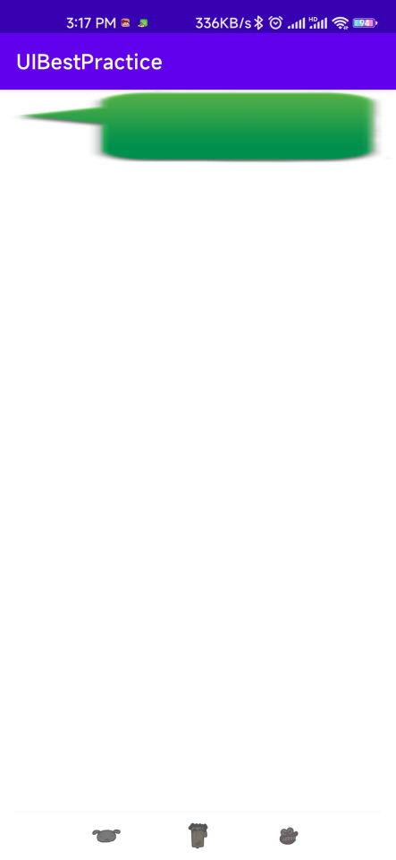
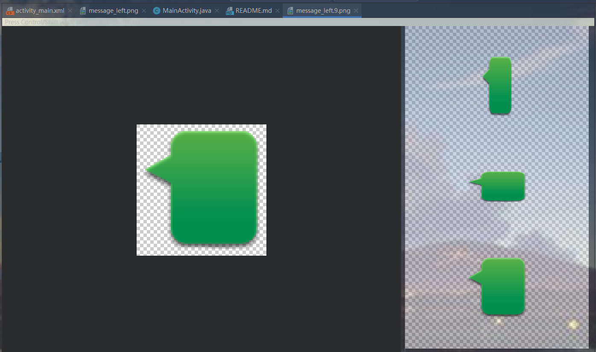
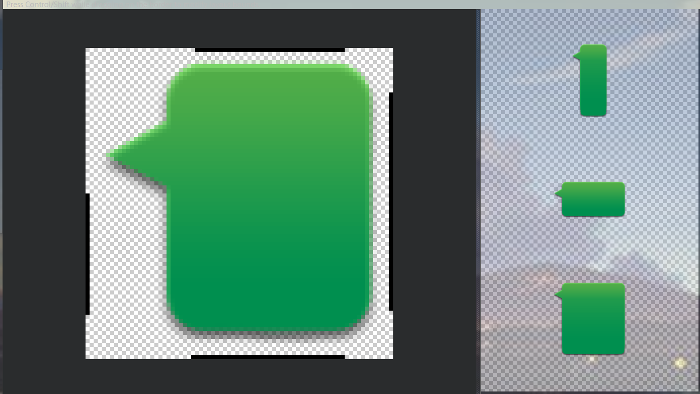
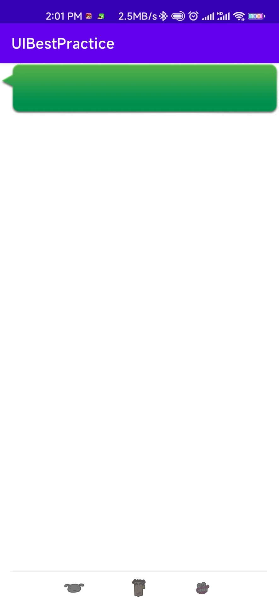

# 编写界面的最佳实践

&emsp;&emsp;既然学习了那么多UI开发的知识，也是时候实战一下了。这次我们要综合运用前面所学的大量内容来编写一个较为复杂且相当美观的聊天界面。

## 制作 Nine-Patch 图片

&emsp;&emsp;在实战正式开始之前，我们还需要学习一下如何制作Nine-Patch图片。你可能之前还没有听说过这个名词，它是一种被特殊处理过的png图片，能够指定哪些区域可以被拉伸、哪些区域不可以。那么Nine-Patch图片到底有什么实际作用呢？我们还是通过一个例子来看一下吧。比如说项目中有一张气泡样式的图片message_left.png


我们将这张图片设置为LinearLayout的背景图片，修改activity_main.xml中的代码，如下展示：

```xml
<?xml version="1.0" encoding="utf-8"?>
<LinearLayout
        xmlns:android="http://schemas.android.com/apk/res/android"
        xmlns:tools="http://schemas.android.com/tools"
        android:layout_width="match_parent"
        android:layout_height="wrap_content"
        android:background="@drawable/message_left"
        tools:context=".MainActivity">
</LinearLayout>
```
将LinearLayout的宽度指定为match_parent，然后将它的背景图设置为message_left，现在运行程序，效果如图所示




&emsp;&emsp;可以看到，由于message_left的宽度不足以填满整个屏幕的宽度，整张图片被均匀地拉伸了！这种效果非常差，用户肯定不能容忍的，这时候我们就可以使用Nine-Patch图片来进行改善。在Android sdk 目录下有一个tools文件夹，在这个文件夹中先找到 draw9patch.bat文件，我们就是使用它来制作Nine-Patch图片的。这里找不到draw9patch.bat,可以直接在AS里或IDEA里右键选中图片直接create 9-Patch file,然后就可以编辑了。



我们可以在图片的四个边框绘制一个个小黑点，在上边框和左边框绘制的部分表示当图片需要拉伸时拉伸黑点标记的区域，在下边框和右边框绘制的部分表示内容会被放置的区域。使用鼠标在图片的边缘拖动就可以进行绘制了，按住Shift键拖动就可以进行擦除



最终运行如图所示：



这样当图片需要拉伸的时候，就可以只拉伸指定的区域，程序在外观上也有了很大的改进。有了这个知识储备之后，我们就可以进入实战环节了。

## 编写精美的聊天界面

&emsp;&emsp;既然是要编写一个聊天界面，那就肯定要有收到的消息和发出的消息。所以还需要制作一个message_right.9.png作为发出消息的背景图。由于待会用到RecyclerView，因此需要先导入包implementation 'androidx.recyclerview:recyclerview:1.2.0-alpha05'

```groovy
dependencies {
    implementation 'androidx.recyclerview:recyclerview:1.2.0-alpha05'
    implementation 'androidx.appcompat:appcompat:1.2.0'
    implementation 'com.google.android.material:material:1.2.1'
    implementation 'androidx.constraintlayout:constraintlayout:2.0.1'
    testImplementation 'junit:junit:4.+'
    androidTestImplementation 'androidx.test.ext:junit:1.1.2'
    androidTestImplementation 'androidx.test.espresso:espresso-core:3.3.0'
}
```

接下来开始编写主界面，修改activity_main.xml中的代码

```xml
<?xml version="1.0" encoding="utf-8"?>
<LinearLayout
        xmlns:android="http://schemas.android.com/apk/res/android"
        xmlns:tools="http://schemas.android.com/tools"
        android:layout_width="match_parent"
        android:layout_height="match_parent"
        android:background="#d8e0e8"
        android:orientation="vertical"
        tools:context=".MainActivity">

    <androidx.recyclerview.widget.RecyclerView
            android:layout_width="match_parent"
            android:layout_height="0dp"
            android:layout_weight="1"/>

    <LinearLayout
            android:layout_width="match_parent"
            android:layout_height="wrap_content">

        <EditText
                android:id="@+id/input_text"
                android:layout_width="0dp"
                android:layout_height="wrap_content"
                android:layout_weight="1"
                android:hint="Type something here"
                android:maxLines="2"/>

        <Button
                android:id="@+id/send"
                android:layout_width="wrap_content"
                android:layout_height="wrap_content"
                android:text="Send"
                android:textAllCaps="false"/>
    </LinearLayout>


</LinearLayout>
```
我们在主界面中放置了一个RecyclerView用于显示聊天的消息内容，又放置了一个EditText用于输入消息，还放置了一个Button用于发送消息。这里用到的所有属性都是我们之前学到过的，相信你理解起来应该i不费力。然后定义消息的实体类，新建Msg

```java
package com.zj970.uibestpractice.entity;

/**
 * 消息的实体类
 * @author zj970
 * @date 2022/08/04
 */
public class Msg {

    public static final int TYPE_RECEIVED = 0;
    public static final int TYPE_SENT = 1;
    private String content;
    private int type;

    public Msg(String content, int type){
        this.content = content;
        this.type = type;
    }

    public String getContent() {
        return content;
    }

    public int getType() {
        return type;
    }
}

```
Msg类中只有两个字段，content表示消息的内容，type表示消息的类型。其中消息类型有两个值可选，TYPE_RECEIVED表示这是一条收到的消息，TYPE_SENT表示这是一条发出的消息，接着编写RecyclerView子项的布局，新建msg_item.xml,如下：

```xml
<?xml version="1.0" encoding="utf-8"?>
<LinearLayout xmlns:android="http://schemas.android.com/apk/res/android"
              android:paddingTop="10dp"
              android:layout_width="match_parent"
              android:layout_height="wrap_content">
    <LinearLayout
            android:id="@+id/left_layout"
            android:layout_width="wrap_content"
            android:layout_height="wrap_content"
            android:layout_gravity="left"
            android:background="@drawable/message_left">
        <TextView
                android:id="@+id/left_msg"
                android:layout_width="wrap_content"
                android:layout_height="wrap_content"
                android:layout_gravity="center"
                android:layout_margin="10dp"
                android:background="#fff"/>
    </LinearLayout>

    <LinearLayout
            android:id="@+id/right_layout"
            android:layout_width="wrap_content"
            android:layout_height="wrap_content"
            android:layout_gravity="right"
            android:background="@drawable/message_right">
        <TextView
                android:id="@+id/right_msg"
                android:layout_width="wrap_content"
                android:layout_height="wrap_content"
                android:layout_gravity="center"
                android:layout_margin="10dp"/>
    </LinearLayout>
</LinearLayout>
```
这里我们收到的消息聚左对齐，发出的消息居右对齐，并且分别使用message_left.9.png和message_right.9.png作为背景图，你可能会有些疑惑，怎么能让收到的消息和发出的消息都放在同一个布局中？不用担心，还记得我们前面学过的可见属性吗？只要稍后在代码中根据消息的类型来决定隐藏和显示哪种消息就可以了。接下来需要创建RecyclerView的适配器类，新建类MsgAdapter,代码如下所示：
