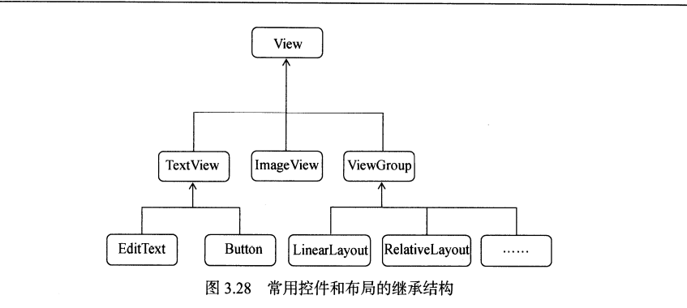

# 3. 系统控件不够用？创建自定义控件

&emsp;&emsp;可以看到，我们所用的所有控件都是直接或间接继承自View的，所用的所有布局都是直接或间接继承自ViewGroup的。View是Android中最基本的一种UI组件，它可以在屏幕上绘制一块矩形区域，并能响应这块区域的各种事件，因此，我们使用的各种事件。因此，我们使用的各种控件其实就是View的基础之上又添加了各自特有的功能。而ViewGroup则是一种特殊的View,它可以包含很多子View和子ViewGroup,是一个用于放置控件和布局的容器。