# 第3章 软件也要拼脸蛋——UI开发的点点滴滴
## 3.2 常用控件的使用方法

### 3.2.1 TextView

TextView 是Android中最简单的一个控件，它主要用于在界面上显示一段文本信息。

```xml
<TextView
    android:id = "@+id/text_view"
    android:layout_width="match_parent"
    android:layout_height="wrap_content"
    android:text="This is TextView"
/>
```

- android:id给当前控件定义了一个唯一的标识符
- android:layout_width 和 android:layout_height 指定了控件的宽度和高度。Android中所有的控件都有这两个属性，可选值有3种：
  - match_parent 表示让当前控件的大小和父布局的大小一样，也就是由父布局来决定当前控件的大小。
  - fill_parent 和 match_parent 意义相同，更推荐用 match_parent
  - wrap_content 表示让当前控件的大小能够刚好包含住里面的内容，也就是由控件的内容决定当前控件的大小。
- 除了使用上述值，也可以对控件的高和宽指定一个固定的大小，但是这样做会在不同手机屏幕的适配方面出现问题

```xml
<TextView
    android:id = "@+id/text_view"
    android:layout_width="match_parent"
    android:layout_height="wrap_content"
    android:gravity="center"
    android:text="This is TextView"
/>
```

我们使用android:gravity来指定文字的对齐方式，可选值有top、bottom、left、right、center等，可以使用 "|" 来同时指定多个值，这里我们指定的center，效果等同于 center_vertical | center_horizontal，表示文字在垂直和水平方向都居中对齐。

另外我们还可以对 TextView 中文字大小和颜色进行修改

```xml
    <TextView
            android:id="@+id/text_view"
            android:layout_width="match_parent"
            android:layout_height="wrap_content"
            android:gravity="center"
            android:textSize="24sp"
            android:textColor="#00ff00"
            android:text="Hello World!"/>
```

通过android:textSize属性可以指定文字的大小，通过android:textColor属性可以指定文字的颜色，在Android中字体大小使用sp作为单位，非文字一律使用dp为单位。
更多内容了解[Android developer](https://developer.android.google.cn/reference/kotlin/android/widget/TextView?hl=en)

### 3.2.2 Button

Button是程序用于和用户进行交互的一个重要控件。

```xml
 <Button
            android:id="@+id/button"
            android:layout_width="match_parent"
            android:layout_height="wrap_content"
            android:text="Button"
            android:textAllCaps="false"/>
```
由于系统会对Button中的所有英文字母自动进行大写转换，可以使用 android:textAllCaps="false" 来禁用到默认特性

### 3.2.3 EditText

EditText是程序用于和用户进行交互的另一个重要的控件，它允许用户在控件里输入和编辑内容，并可以在程序中对这些内容进行处理。EditText的应用场景非常普遍，在进行发短信、发微信、发微博等操作时，你不得不使用EditText。

```xml
    <EditText
            android:id="@+id/edit_text"
            android:layout_width="match_parent"
            android:layout_height="wrap_content"/>
```

Android控件的使用规律：给控件定义一个id，再指定控件的高度和宽度，然后再适当加入一些控件特有的属性

增加EditText提示功能 android:hint="Type something here"，当我们输入任何内容时，该提示文本就会消失

```xml
<EditText
            android:id="@+id/edit_text"
            android:layout_width="match_parent"
            android:layout_height="wrap_content"
            android:hint="Type something there"/>
```

&emsp;&emsp;不过，随着输入的内容不断增多，EditText会被不断地拉长，这时由于EditText的高度是指定的是wrap_content,因此它总能包含住里面的内容，但是输入内容过多时，界面就变得非常难看

我们可以使用 android:maxLines 属性来解决这个问题

```xml
<EditText
            android:id="@+id/edit_text"
            android:layout_width="match_parent"
            android:layout_height="wrap_content"
            android:hint="Type something there"
            android:maxLines="2"/>
```
这里通过android:maxLines指定了EditText的最大行数为两行，当输入的内容超过两行时，文本就会向上滚动，而EditText则不会继续拉伸

### 3.2.4 ImageView

&emsp;&emsp;ImageView 是用于在界面上展示图片的一个控件，它可以让我们的程序界面变得更加丰富多彩。学习这个控件需要提前准备一些图片，这些图片通常放在 ”drawable“ 开头的目录下的。

```xml
<ImageView
            android:id="@+id/image_1"
            android:layout_width="wrap_content"
            android:layout_height="wrap_content"
            android:src="@drawable/img_1"/>
```
&emsp;&emsp;可以看到，这里使用android:src属性给ImageView指定了一张图片。由于图片的宽和高都是未知的，所有将ImageView的宽和高都设定了wrap_content，这样就保证了不管图片的尺寸是多少，图片都可以完整地显示出来。

### 3.2.5 ProgressBar

&emsp;emsp;ProgressBar用于在界面上显示一个进度条，表示我们的程序正在加载一些数据。

```xml
 <ProgressBar
            android:id="@+id/progress_bar"
            android:layout_width="match_parent"
            android:layout_height="wrap_content"/>

```

&emsp;&emsp;旋转的进度条表明我们的程序正在加载数据，那么数据总有加载完的时候。此时需要Android控件的可见属性。所有的Android控件都具有这个属性，可以通过android:visibility进行指定，可选值有3种：
- visible 表示控件是可见的，这个值是默认值，不指定的时候就是可见的
- invisible 表示控件不可见，但它仍然占据原来的位置和大小，只是变为透明状态了。
- gone 不仅不可见，而且不再占用任何屏幕空间

&emsp;&emsp;我们还可以通过代码来设置控件的可见性，使用的是setVisibility()方法，可以传入View.VISIBLE、View.INVISIBLE和View.GONE这三种值  
另外我们还可以给ProgressBar指定不同的样式，通过style属性可以将它指定成水平进度条

```xml
<ProgressBar
            android:id="@+id/progress_bar"
            android:layout_width="match_parent"
            android:layout_height="wrap_content"
            style="?android:attr/progressBarStyleHorizontal"
            android:max="100"/>
```
### 3.2.6 AlertDialog

&emsp;&emsp;AlertDialog 可以在当前的界面弹出一个对话框，这个对话框是置顶于所有界面元素之上的，能够屏蔽掉其他控件的交互能力，因此 AlertDialog 一般都是用于提示一些非常重要的内容或者警告信息。比如为了防止用户误删重要内容，在删除之前弹出一个确认对话框

```
/**
     * 展示AlertDialog的使用
     */
    public void button_AlertDialog(){
        AlertDialog.Builder dialog = new AlertDialog.Builder(MainActivity.this);//1. 实例化AlertDialog
        dialog.setTitle("This is Dialog");//2. 设置标题
        dialog.setMessage("Something important.");//3. 设置内容
        dialog.setCancelable(false);//4. 可否取消的属性
        /**
         * 确定按钮点击事件
         */
        dialog.setPositiveButton("OK", new DialogInterface.OnClickListener() {
            @Override
            public void onClick(DialogInterface dialog, int which) {

            }
        });
        /**
         * 取消按钮点击事件
         */
        dialog.setNegativeButton("Cancle", new DialogInterface.OnClickListener() {
            @Override
            public void onClick(DialogInterface dialog, int which) {

            }
        });
        dialog.show();
    }

```
首先通过AlertDialog.Builder创建一个AlertDialog实例，然后可以为这个对话框设置标题、内容、可否取消等属性，接下来调用setPositiveButton()方法为对话框设置确定点击按钮的点击事件，调用setNegativeButton()方法设置取消按钮点击事件，最后调用show()方法将对话框显示出来

### 3.2.7 ProgressDialog

ProgressDialog 和 AlertDialog有点类似，都可以弹出一个对话框，都能屏蔽掉其他控件的交互能力。不同的是，ProgressDialog会在对话框中显示一个进度条，一般用于表示当前操作比较耗时，让用户耐心地等待。它的用法噶和AlertDialog也比较相似

```
/**
     * 展示ProgressDialog的使用
     */
    public void buttonProgressDialog(){
        ProgressDialog progressDialog = new ProgressDialog(MainActivity.this);
        progressDialog.setTitle("This is ProgressDialog");
        progressDialog.setMessage("Loading...");
        progressDialog.setCancelable(true);
        progressDialog.show();
    }
```
&emsp;&emsp;可以看到，这里也是先构建一个ProgressDialog对象，然后同样可以设置标题、内容、可否取消等属性，最后也是通过调用show()方法将ProgressDialog显示出来。  

&emsp;&emsp;注意：如果在setCancelable()中传入了false,表示ProgressDialog是不能通过Back键取消掉的，这时你就一定要在代码中做好控制，当数据加载完成后必须调用ProgressDialog的dismiss()方法来关闭对话框，否则ProgressDialog将会一直存在。

---

## 3.3 详解4种基本布局

&emsp;&emsp;一个丰富的界面总是要由很多个控件组成的，那我们如何才能让各个控件都有条不紊地摆放在界面上，而不是乱糟糟的呢？这就需要借助布局来实现了。布局是一种可用于放置很多控件的容器，它可以按照一定的规律调整内部控件的位置，从而编写出精美的界面。

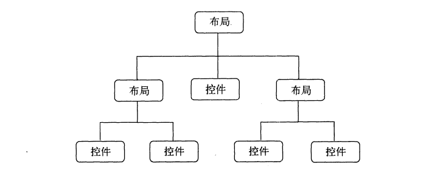

### 3.3.1 线性布局

&emsp;&emsp;LinearLayout又称作线性布局，是一种非常常用的布局。正如它的名字所描述的一样，这个布局会将它所包含的控件在线性方向依次排列。既然是线性排列，不止一个方向，之前所有的控件都是在垂直方向上排列，这是由于我们通过指定了android:orientation属性指定了排列方向是vertical，如果指定的是horizontal，控件就会在水平方向上排列了。

```xml
<?xml version="1.0" encoding="utf-8"?>
<LinearLayout
        xmlns:android="http://schemas.android.com/apk/res/android"
        xmlns:tools="http://schemas.android.com/tools"
        android:orientation="vertical"
        android:layout_width="match_parent"
        android:layout_height="match_parent"
        tools:context=".LayoutPractice">
    <Button
            android:id="@+id/button_1"
            android:layout_width="wrap_content"
            android:layout_height="wrap_content"
            android:text="Button 1"
            android:textAllCaps="false"
            android:textSize="28sp"/>
    <Button
            android:id="@+id/button_2"
            android:layout_width="wrap_content"
            android:layout_height="wrap_content"
            android:text="Button 2"
            android:textAllCaps="false"
            android:textSize="28sp"/>
    <Button
            android:id="@+id/button_3"
            android:layout_width="wrap_content"
            android:layout_height="wrap_content"
            android:text="Button 3"
            android:textAllCaps="false"
            android:textSize="28sp"/>

</LinearLayout>
```

&emsp;&emsp;我们在LinearLayout中添加了3个Button，每个Button的长和宽都是wrap_content，并指定了排列方向是vertical。控件在垂直方向依次排列。

&emsp;&emsp;将android:orientation属性的值改成了horizontal，这就意味着要让LinearLayout中的控件在水平方向上依次排列。当然如果不指定android:orientation属性的值，默认的排列方向就是horizontal。

&emsp;&emsp;这里需要注意，如果LinearLayout的排列方向是horizontal，内部的控件就绝对不能将宽度指定为match_parent，因为这样的话，单独一个控件就会将整个水平方向占满，其他的控件就没有可放置的位置了。同样的道理,如果是LinearLayout的排列方向是vertical,内部的控件就不能将高度指定为match_parent。

&emsp;&emsp;首先来看android:layout_gravity属性，它和我们上一节中学到的android:gravity属性看起来有些相似，这两个属性有什么区别呢？其实从名字就可以看出，android:gravity用于指定文字在控件中的对齐方式，而android:layout_gravity用于指定控件在布局中的对齐方式。android:layout_gravity的可选值和android:gravity差不多，但是需要注意，当LinearLayout的排列方向是horizontal时，只有垂直方向上的对齐方式才会生效，因为此时水平方向上的长度是不固定的，每添加一个控件，水平方向上的长度都会改变，因而无法指定该方向上的对齐方式。同样的道理，当LinearLayout的排列方向是vertical时，只有水平方向的对齐方式才会生效。 

```xml
<?xml version="1.0" encoding="utf-8"?>
<LinearLayout
        xmlns:android="http://schemas.android.com/apk/res/android"
        xmlns:tools="http://schemas.android.com/tools"
        android:orientation="horizontal"
        android:layout_width="match_parent"
        android:layout_height="match_parent"
        tools:context=".LayoutPractice">
    <Button
            android:id="@+id/button_1"
            android:layout_width="wrap_content"
            android:layout_height="wrap_content"
            android:text="Button 1"
            android:layout_gravity="top"
            android:textAllCaps="false"
            android:textSize="28sp"/>
    <Button
            android:id="@+id/button_2"
            android:layout_width="wrap_content"
            android:layout_height="wrap_content"
            android:text="Button 2"
            android:layout_gravity="center_vertical"
            android:textAllCaps="false"
            android:textSize="28sp"/>
    <Button
            android:id="@+id/button_3"
            android:layout_width="wrap_content"
            android:layout_height="wrap_content"
            android:text="Button 3"
            android:layout_gravity="bottom"
            android:textAllCaps="false"
            android:textSize="28sp"/>
</LinearLayout>
```

&emsp;&emsp;接下来我们学习下LinearLayout中的另一个重要属性——android:layout_weight。这个属性允许我们使用比例的方式来指定控件的大小，它在手机屏幕的适配性方面可以起到非常重要的作用。比如我们正在编写一个消息发送界面，需要一个文本编辑框和一个发送按钮。

```xml
<?xml version="1.0" encoding="utf-8"?>
<LinearLayout
        xmlns:android="http://schemas.android.com/apk/res/android"
        xmlns:tools="http://schemas.android.com/tools"
        android:orientation="horizontal"
        android:layout_width="match_parent"
        android:layout_height="match_parent"
        tools:context=".LayoutPractice">
  <EditText
          android:id="@+id/input_message"
          android:layout_width="0dp"
          android:layout_height="wrap_content"
          android:layout_weight="1"
          android:text="Type something"/>
  <Button
          android:id="@+id/send"
          android:layout_width="0dp"
          android:layout_height="wrap_content"
          android:layout_weight="1"
          android:text="Send"
          android:textAllCaps="false"/>
</LinearLayout>
```
&emsp;&emsp;你会发现这里竟然将EditText和Button的宽度都指定成了0dp，这样文本编辑框和按钮还能显示出来吗？不用担心，由于我们使用了android:layout_weight属性，此时控件的宽度就不应该再由android:layout_width来决定，这里指定成0dp是一种比较规范的写法。另外，dp是Android中用于指定控件大小，间距等属性的单位。

&emsp;&emsp;然后在EditText和Button里都将android:layout_weight属性的值都设定为1，这表示EditText和Button将在水平方向平分宽度。

&emsp;&emsp;为什么将android:layout_weight属性的值同时指定为1就会平分屏幕宽度呢？其实原理也很简单，系统会先把LinearLayout下所有指定的layout_weight值相加，得到一个总值，然后每个控件所占大小的比列就是用该控件的layout_weight值除以刚才算出的总值。因此如果想让EditText占据屏幕宽度的3/5，Button占据屏幕宽度的2/5，只需要将EditText的layout_weight改为3，Button的layout_weight的值改成2就可以了.

我们还可以通过指定部分控件的layout_weight值来实现更好的效果。

```xml
<?xml version="1.0" encoding="utf-8"?>
<LinearLayout
        xmlns:android="http://schemas.android.com/apk/res/android"
        xmlns:tools="http://schemas.android.com/tools"
        android:orientation="horizontal"
        android:layout_width="match_parent"
        android:layout_height="match_parent"
        tools:context=".LayoutPractice">
    <EditText
            android:id="@+id/input_message"
            android:layout_width="0dp"
            android:layout_height="wrap_content"
            android:layout_weight="1"
            android:text="Type something"/>
    <Button
            android:id="@+id/send"
            android:layout_width="wrap_content"
            android:layout_height="wrap_content"
            android:text="Send"
            android:textAllCaps="false"/>
</LinearLayout>
```
&emsp;&emsp;这里我们仅指定了EditText的android:layout_weight属性，并且Button的宽度改回wrap_content。这表示Button的宽度仍然按照wrap_content来计算，而EditText则会占满屏幕所有的剩余空间。使用这种方式编写的界面，不仅会在各种屏幕的适配方面会非常好，而且看起来也更加舒服。 

### 3.3.2 相对布局

&emsp;&emsp;RelativeLayout又称做相对布局，也是一种非常常用的布局。和LinearLayout的排列规则不同，RelativeLayout显得更加随意一些，它可以通过相对定位的方式让控件出现在布局的任何位置。也正因为如此，RelativeLayout中的属性非常多，不过这些属性都是有规律可循的，其实并 并不难理解和记忆。

```xml
<?xml version="1.0" encoding="utf-8"?>
<RelativeLayout
        xmlns:android="http://schemas.android.com/apk/res/android"
        xmlns:tools="http://schemas.android.com/tools"
        android:layout_width="match_parent"
        android:layout_height="match_parent"
        tools:context=".RelativeLayoutPractice">
    <Button
            android:id="@+id/button1"
            android:layout_width="wrap_content"
            android:layout_height="wrap_content"
            android:layout_alignParentLeft="true"
            android:layout_alignParentTop="true"
            android:textAllCaps="false"
            android:text="Button 1"/>
    <Button
            android:id="@+id/button2"
            android:layout_width="wrap_content"
            android:layout_height="wrap_content"
            android:layout_alignParentRight="true"
            android:layout_alignParentTop="true"
            android:textAllCaps="false"
            android:text="Button 2"/>
    <Button
            android:id="@+id/button3"
            android:layout_width="wrap_content"
            android:layout_height="wrap_content"
            android:layout_centerInParent="true"
            android:textAllCaps="false"
            android:text="Button 3"/>
    <Button
            android:id="@+id/button4"
            android:layout_width="wrap_content"
            android:layout_height="wrap_content"
            android:layout_alignParentBottom="true"
            android:layout_alignParentLeft="true"
            android:text="Button 4"
            android:textAllCaps="false"/>
    <Button
            android:id="@+id/button5"
            android:layout_width="wrap_content"
            android:layout_height="wrap_content"
            android:layout_alignParentBottom="true"
            android:layout_alignParentRight="true"
            android:text="Button 5"
            android:textAllCaps="false"/>

</RelativeLayout>
```

&emsp;&emsp;我们让Button 1和父布局的左上角对齐，Button 2和父布局的右上角对齐，Button 3居中对齐，Button 4和父布局的左下角对齐，Button 5和父布局的右下角对齐。虽然android:layout_alignParentLeft、android:layout_alignParentRight、android:layout_alignParentTop、android:layout_alignParentBottom、android:layout_centerInParent这几个属性虽然没有接触过，但是见名明义。

上面例子中的每个控件都是相对于父布局进行定位的。也可以相对于控件进行定位。

```xml
<?xml version="1.0" encoding="utf-8"?>
<RelativeLayout
        xmlns:android="http://schemas.android.com/apk/res/android"
        xmlns:tools="http://schemas.android.com/tools"
        android:layout_width="match_parent"
        android:layout_height="match_parent"
        tools:context=".RelativeLayoutPractice">
  <Button
          android:id="@+id/button3"
          android:layout_width="wrap_content"
          android:layout_height="wrap_content"
          android:layout_centerInParent="true"
          android:textAllCaps="false"
          android:text="Button 3"/>
    <Button
            android:id="@+id/button1"
            android:layout_width="wrap_content"
            android:layout_height="wrap_content"
            android:layout_above="@+id/button3"
            android:layout_toLeftOf="@+id/button3"
            android:textAllCaps="false"
            android:text="Button 1"/>
    <Button
            android:id="@+id/button2"
            android:layout_width="wrap_content"
            android:layout_height="wrap_content"
            android:layout_above="@+id/button3"
            android:layout_toRightOf="@+id/button3"
            android:textAllCaps="false"
            android:text="Button 2"/>
    <Button
            android:id="@+id/button4"
            android:layout_width="wrap_content"
            android:layout_height="wrap_content"
            android:layout_below="@+id/button3"
            android:layout_toLeftOf="@+id/button3"
            android:text="Button 4"
            android:textAllCaps="false"/>
    <Button
            android:id="@+id/button5"
            android:layout_width="wrap_content"
            android:layout_height="wrap_content"
            android:layout_below="@+id/button3"
            android:layout_toRightOf="@+id/button3"
            android:text="Button 5"
            android:textAllCaps="false"/>

</RelativeLayout>
```
&emsp;&emsp;这次代码稍微复杂一点，不过仍然有规律可循。android:layout_above属性可以让一个控件位于另外一个控件的上方，需要为这个属性指定相对控件id的引用，这里我们填入了@+id/button3，表示让该控件位于Button 3的上方。其他属性也都是相似的，android:layout_below表示让一个控件位于另一个控件的下方，android:layout_toLeftOf表示让一个控件位于另一个控件的左侧，android:layout_toRightOf表示让一个控件位于另一个控件的右侧。注意，当一个控件去引用另一个控件的id时，该控件一定要定义在引用控件的后面，不然会出现找不到id的情况。

&emsp;&emsp;RelativeLayout中还有另外一组相对于控件进行定位的属性，android:layout_alignLeft表示让一个控件的左边缘和另一个控件的左边缘对齐，android:layout_alignRight表示让一个控件的右边缘和另一个控件的右边缘对齐。此外，还有android:layout_alignTop和android:layout_alignBottom，道理都是一样。

### 3.3.3 帧布局

&emsp;&emsp;FrameLayout又称作帧布局，它相比前面两种布局就简单太多了，因此它的应用场景也少了很多。这种布局没有方便的定位方式，所有的控件都会默认摆放在布局的左上角。

```xml
<?xml version="1.0" encoding="utf-8"?>
<FrameLayout
        xmlns:android="http://schemas.android.com/apk/res/android"
        xmlns:tools="http://schemas.android.com/tools"
        android:layout_width="match_parent"
        android:layout_height="match_parent"
        tools:context=".FrameLayoutPractice">
    <TextView
            android:id="@+id/text_view"
            android:layout_width="wrap_content"
            android:layout_height="wrap_content"
            android:text="This is TextView"
            android:textColor="@color/black"
            android:textSize="28sp"/>
    <ImageView
            android:id="@+id/image_view"
            android:layout_width="wrap_content"
            android:layout_height="wrap_content"
            android:src="@drawable/img_1"/>
</FrameLayout>
```

可以看到，文字和图片都是位于布局的左上角。由于ImageView是在TextView之后添加的，因此图片压在了文字上面。当然除了这种默认效果之外，我们还可以使用layout_gravity属性来指定控件在布局中的对齐方式，和LinearLayout的方式相同。

```xml
<?xml version="1.0" encoding="utf-8"?>
<FrameLayout
        xmlns:android="http://schemas.android.com/apk/res/android"
        xmlns:tools="http://schemas.android.com/tools"
        android:layout_width="match_parent"
        android:layout_height="match_parent"
        tools:context=".FrameLayoutPractice">
    <TextView
            android:id="@+id/text_view"
            android:layout_width="wrap_content"
            android:layout_height="wrap_content"
            android:text="This is TextView"
            android:layout_gravity="left"
            android:textColor="@color/black"
            android:textSize="28sp"/>
    <ImageView
            android:id="@+id/image_view"
            android:layout_width="wrap_content"
            android:layout_height="wrap_content"
            android:layout_gravity="center"
            android:src="@drawable/img_1"/>
</FrameLayout>
```
我们指定TextView在FrameLayout中居左对齐，ImageView居中对齐，总体来说，FrameLayout由于定位的方式的欠缺，导致它的应用场景也比较少。

### 3.3.4 百分比布局

&emsp;&emsp;前面介绍的3种布局都是从Android 1.0 版本中就开始支持了，一直沿用到现在，可以说是满足了绝大多数场景的界面设计需求。不过只有LinearLayout支持使用layout_weight属性来事项按比例指定控件大小的功能，其他两种都不支持。比如说,如果想用RelativeLayout来实现让两个按钮按比例平分的效果，则是比较困难的。

&emsp;&emsp;为此，Android引入了一种全新的布局方式来解决此问题——百分比布局。在这种布局中，我们可以不再使用wrap_content、match_parent等方式来指定控件的大小，而是允许直接指定控件在布局中所占的百分比，这样的话就可以轻轻松松实现平分布局甚至是任意比例分割布局的效果。

&emsp;&emsp;由于LinearLayout本身已经支持按比例指定控件的大小了，因此百分比布局只为FrameLayout和RelativeLayout进行功能扩展，提供了PercentFrameLayout和PercentRelativeLayout。这两个全新布局需要在build.gradle中添加依赖，打开app/build.gradle文件

```groovy
dependencies{
  implementation 'androidx.percentlayout:percentlayout:1.0.0'
}
```
由于使用的Android studio版本较高，不使用原书的 com.android.support:percent:24.2.1，修改布局时，不仅需要修改button设置，还需要设置头tag
> <android.percentlayout.widget.PercentFrameLayout xmlns:app="http://schems.android.com/apk/res-auto"

而且每次修改gradle文件后都需要Sync Now，同步一下工程。

```xml
<?xml version="1.0" encoding="utf-8"?>
<androidx.percentlayout.widget.PercentFrameLayout xmlns:app="http://schemas.android.com/apk/res-auto"
        xmlns:android="http://schemas.android.com/apk/res/android"
        xmlns:tools="http://schemas.android.com/tools"
        android:layout_width="match_parent"
        android:layout_height="match_parent"
        tools:context=".PercentPractice">

    <Button
            android:id="@+id/button7"
            android:layout_gravity="left|top"
            android:layout_width="match_parent"
            android:layout_height="match_parent"
            android:text="东"
            app:layout_widthPercent="50%"
            app:layout_heightPercent="50%"/>


    <Button
            android:id="@+id/button8"
            android:layout_gravity="right|top"
            android:layout_width="match_parent"
            android:layout_height="match_parent"
            android:text="西"
            app:layout_widthPercent="50%"
            app:layout_heightPercent="50%"/>
    <Button
            android:id="@+id/button9"
            android:layout_gravity="left|bottom"
            android:layout_width="match_parent"
            android:layout_height="match_parent"
            android:text="南"
            app:layout_widthPercent="50%"
            app:layout_heightPercent="50%"/>
    <Button
            android:id="@+id/button10"
            android:layout_gravity="right|bottom"
            android:layout_width="match_parent"
            android:layout_height="match_parent"
            android:text="北"
            app:layout_widthPercent="50%"
            app:layout_heightPercent="50%"/>

</androidx.percentlayout.widget.PercentFrameLayout>
```

这里之所以能使用app前缀的属性是因为刚才定义了app的命名空间。

## 3.4 系统控件不够用？创建自定义控件

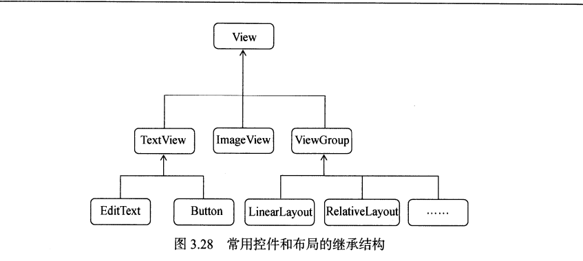

&emsp;&emsp;可以看到，我们所用的所有控件都是直接或间接继承自View的，所用的所有布局都是直接或间接继承自ViewGroup的。View是Android中最基本的一种UI组件，它可以在屏幕上绘制一块矩形区域，并能响应这块区域的各种事件，因此，我们使用的各种事件。因此，我们使用的各种控件其实就是View的基础之上又添加了各自特有的功能。而ViewGroup则是一种特殊的View,它可以包含很多子View和子ViewGroup,是一个用于放置控件和布局的容器。

### 3.4.1 引入布局

&emsp;&emsp;如果你用过iPhone应该会知道，几乎每一个iPhone应用的界面顶部都会有一个标题栏，标题栏上会有一到两个按钮可用于返回或其他操作（iPhone没有实体返回键）。现在很多Android程序也都喜欢模仿iPhone的风格，在界面的顶部放置一个标题栏。虽然Android系统已经给每个活动提供了标题栏功能。但这里我们决定先不使用它，而是创建一个自定义的标题栏。

```xml
<?xml version="1.0" encoding="utf-8"?>
<LinearLayout xmlns:android="http://schemas.android.com/apk/res/android"
              android:layout_width="match_parent"
              android:layout_height="match_parent"
              android:background="@drawable/title_bg">
    <Button
            android:id="@+id/title_back"
            android:layout_width="wrap_content"
            android:layout_height="wrap_content"
            android:layout_gravity="center"
            android:layout_margin="5dp"
            android:text="Back"
            android:background="@drawable/back_bg"
            android:textAllCaps="false"
            android:textColor="#fff"/>
    <TextView
            android:id="@+id/title_text"
            android:layout_width="0dp"
            android:layout_height="wrap_content"
            android:layout_gravity="center"
            android:layout_weight="1"
            android:gravity="center"
            android:text="Title Text"
            android:textColor="#fff"
            android:textSize="24sp"/>

    <Button
            android:id="@+id/title_edit"
            android:layout_width="wrap_content"
            android:layout_height="wrap_content"
            android:layout_gravity="center"
            android:layout_margin="5dp"
            android:text="Edit"
            android:background="@drawable/edit_bg"
            android:textAllCaps="false"
            android:textColor="#fff"/>
</LinearLayout>
```
$emsp;$emsp;可以看到，我们在Linearlayout中分别加入了两个Button和一个TextView，左边的Button可用于返回，右边的Button可用于编辑，中间的TextView则可以显示一段标题文本。android:background用于为布局或者控件指定一个背景，可以用颜色或图片来进行填充，另外android:layout_margin这个属性，它可以指定控件在上下左右方向上偏移的距离，当然也可以使用android:layout_marginLeft或android:layout_marginTop等属性来单独指定控件在某个方向上偏移的距离。

现在标题栏布局已经编写完成，使用标题栏。

```xml
<?xml version="1.0" encoding="utf-8"?>
<LinearLayout
        xmlns:android="http://schemas.android.com/apk/res/android"
        xmlns:tools="http://schemas.android.com/tools"
        android:layout_width="match_parent"
        android:layout_height="match_parent"
        tools:context=".MainActivity">
        <include layout="@layout/title"
                android:layout_height="wrap_content"
                android:layout_width="wrap_content"/>
</LinearLayout>
```
我们是只需要一行include语句将标题栏布局引进来，然后再把系统自带的标题栏隐藏掉。
```java
package com.zj970.uicustomviews;

import androidx.appcompat.app.ActionBar;
import androidx.appcompat.app.AppCompatActivity;
import android.os.Bundle;

public class MainActivity extends AppCompatActivity {

    @Override
    protected void onCreate(Bundle savedInstanceState) {
        super.onCreate(savedInstanceState);
        setContentView(R.layout.activity_main);

        /**
         * 隐藏系统自带的标题
         */
        ActionBar actionBar = getSupportActionBar();
        if (actionBar!=null){
            actionBar.hide();
        }
    }
}
```

### 3.4.2 创建自定义控件
$emsp;$emsp;引入布局的技巧确实解决了重复编写布局代码的问题，但是如果布局中有一些控件要求能够响应事件，我们还需要在每个活动中为这些控件单独编写一次事件注册的代码。比如说标题栏中的返回按钮，其实不管是在哪个活动中，这个按钮的功能都是相同的，即销毁当前活动。而如果在每一个活动中都需要重新注册一遍返回按钮的点击事件，无疑会增加很多重复的代码，这种情况最好使用自定义控件的方式来解决。

- 撰写对应拓展类

```java
package com.zj970.uicustomviews.custom;

import android.app.Activity;
import android.content.Context;
import android.util.AttributeSet;
import android.view.LayoutInflater;
import android.view.View;
import android.widget.Button;
import android.widget.LinearLayout;
import android.widget.Toast;
import androidx.annotation.Nullable;
import com.zj970.uicustomviews.R;

/**
 * 自定义控件
 */
public class TitleLayout extends LinearLayout {
    public TitleLayout(Context context, @Nullable AttributeSet attrs) {
        super(context, attrs);
        LayoutInflater.from(context).inflate(R.layout.title,this);
        Button titleBack = findViewById(R.id.title_back);
        Button titleEdit = findViewById(R.id.title_edit);
        titleBack.setOnClickListener(new OnClickListener() {
            @Override
            public void onClick(View v) {
                ((Activity) getContext()).finish();
            }
        });

        titleEdit.setOnClickListener(new OnClickListener() {
            @Override
            public void onClick(View v) {
                Toast.makeText(getContext(),"You clicked Edit button",Toast.LENGTH_LONG).show();
            }
        });
    }
}

```

在布局文件中添加这个自定义控件
```xml
<?xml version="1.0" encoding="utf-8"?>
<LinearLayout
        xmlns:android="http://schemas.android.com/apk/res/android"
        xmlns:tools="http://schemas.android.com/tools"
        android:layout_width="match_parent"
        android:layout_height="match_parent"
        tools:context=".MainActivity">
        <com.zj970.uicustomviews.custom.TitleLayout
                android:layout_width="match_parent"
                android:layout_height="wrap_content"/>
</LinearLayout>
```
添加自定义控件和添加普通控件的方式基本上是一样的，只不过在添加自定义控件的时候，我们需要指定控件的完整类名，包名在这里是无法省略。

## 3.5 最常用和最难用的控件——ListView
### 3.5.1 ListView的简单用法
```xml
<?xml version="1.0" encoding="utf-8"?>
<LinearLayout
        xmlns:android="http://schemas.android.com/apk/res/android"
        xmlns:tools="http://schemas.android.com/tools"
        android:layout_width="match_parent"
        android:layout_height="match_parent"
        tools:context=".MainActivity">
    <ListView
            android:id="@+id/list_view"
            android:layout_width="match_parent"
            android:layout_height="match_parent"/>
</LinearLayout>
```
这里我们使ListView占满整个布局空间,然后在代码中修改

```java
package com.zj970.listview;

import android.widget.ArrayAdapter;
import android.widget.ListView;
import androidx.appcompat.app.AppCompatActivity;
import android.os.Bundle;

public class MainActivity extends AppCompatActivity {

    private String[] data = {"Apple","Banana","Orange","Watermelon","Pear","Grape","Pineapple","Strawberry","Cherry","Mango",
            "Apple","Banana","Orange","Watermelon","Pear","Grape","Pineapple","Strawberry","Cherry","Mango"};

    @Override
    protected void onCreate(Bundle savedInstanceState) {
        super.onCreate(savedInstanceState);
        setContentView(R.layout.activity_main);
        ArrayAdapter<String> adapter = new ArrayAdapter<String>(MainActivity.this, android.R.layout.simple_expandable_list_item_1,data);
        ListView listView = findViewById(R.id.list_view);
        listView.setAdapter(adapter);
    }
}
```
&emsp;&emsp;既然ListView是用于展示大量数据的，那我们就应该先将数据提供好。这些数据可以是从网上下载的，也可以是从数据库中读取的，应该视具体的应用场景而定。这里我们就简单的使用了一个data数组来测试，里面包含了很多水果的名称。

&emsp;&emsp;不过，数组中的数据无法直接传递给ListView的，我们还需要借助适配器来完成。Android中提供了很多适配器的实现类，其中我认为最好用的就是ArrayAdapter。它可以通过泛型来指定要适配的数据类型，然后在构造函数中把要适配的数据传入。ArrayAdapter有多个构造函数的重载，你应该根据实际情况选择最合适的一种。这里由于我们提供的数据都是字符串，因此将ArrayAdapter的泛型指定为String，然后在ArrayAdapter的构造函数中依次传入当前上下文，List_item_1作为ListView子项布局的id，这是一个Android内置的布局文件，里面只有一个TextVIew，可用于简单地显示一段文本。这样适配器对象就构建好了。

最后，还需要调用ListView的setAdapter()方法，将构建好的适配器对象传递进来，这样ListView和数据之间的关联就建立完成了。

### 3.5.2 定制ListView的界面

&emsp;&emsp;只能显示一段文本的ListView实在是太单调了，我们现在就来对ListView的界面进行定制，让它可以显示更加丰富的内容。

&emsp;&emsp;首先需要准备好一组照片，分别对应上面提供的每一种水果，待会我们要这些水果名称旁边都有一个图样。

接着定义一个实体类，作为ListView适配器的适配类型。新建类Fruit

```java
package com.zj970.listview.entity;

/**
 * 水果实体类
 */
public class Fruit {
    /**
     * 水果名字
     */
    private String name;

    /**
     * 水果图片id
     */
    private int imageId;

    /**
     * 构造水果实体类的有参构造----默认的构造器
     * @param name 水果名
     * @param imageId 水果图片id
     */
    public Fruit(String name,int imageId){
        this.name = name;
        this.imageId = imageId;
    }

    public String getName() {
        return name;
    }

    public void setName(String name) {
        this.name = name;
    }

    public int getImageId() {
        return imageId;
    }

    public void setImageId(int imageId) {
        this.imageId = imageId;
    }
}

```

Fruit类中只有两个字段，name表示水果名字，imageId表示水果对应图片的资源id。然后需要为ListView的子项指定一个我们自定义的布局，在layout目录下新建fruit_item.xml

```xml
<?xml version="1.0" encoding="utf-8"?>
<LinearLayout xmlns:android="http://schemas.android.com/apk/res/android"
              android:layout_width="match_parent"
              android:layout_height="match_parent">
    
    <ImageView
            android:id="@+id/fruit_image"
            android:layout_width="wrap_content"
            android:layout_height="wrap_content"/>
    <TextView
            android:id="@+id/fruit_name"
            android:layout_width="wrap_content"
            android:layout_height="wrap_content"
            android:layout_gravity="center_vertical"
            android:layout_marginLeft="10dp"/>

</LinearLayout>
```

&emsp;&emsp;在这个布局中，我们定义了一个ImageView用于显示水果的图片，又定义了一个TextView用于显示水果的名称，并让TextView在垂直方向上居中显示。接下来需要创建一个自定义的适配器，这个适配器继承自ArrayAdapter，并将泛型指定为Fruit类。新建类FruitAdapter，代码如下：

```java
package com.zj970.listview.adapter;

import android.content.Context;
import android.view.LayoutInflater;
import android.view.View;
import android.view.ViewGroup;
import android.widget.ArrayAdapter;
import android.widget.ImageView;
import android.widget.TextView;
import androidx.annotation.NonNull;
import androidx.annotation.Nullable;
import com.zj970.listview.R;
import com.zj970.listview.entity.Fruit;

import java.util.List;

/**
 * 自定义适配器，继承ArrayAdapter
 */
public class FruitAdapter extends ArrayAdapter<Fruit> {
    private int resourceId;

    /**
     * Constructor
     *
     * @param context  The current context.
     * @param resource The resource ID for a layout file containing a TextView to use when
     *                 instantiating views.
     * @param objects  The objects to represent in the ListView.
     */
    public FruitAdapter(@NonNull Context context, int resource, @NonNull List<Fruit> objects) {
        super(context, resource, objects);
        this.resourceId = resource;
    }

    @NonNull
    @Override
    public View getView(int position, @Nullable View convertView, @NonNull ViewGroup parent) {
        Fruit fruit = getItem(position);//获得当前项的Fruit示例
        View view = LayoutInflater.from(getContext()).inflate(resourceId,parent,false);
        ImageView fruitImage = view.findViewById(R.id.fruit_image);
        TextView fruitName = view.findViewById(R.id.fruit_name);
        fruitImage.setImageResource(fruit.getImageId());
        fruitName.setText(fruit.getName());
        return view;
    }
}

```

&emsp;&emsp;FruitAdapter重写了弗雷的一组构造函数，用于将上下文、ListView子项布局的id和数据都传递进来。另外又重写了getView()方法，这个方法在每个子项都被滚到了屏幕内的时候会被调用。在getView()方法中，首先通过getItem()方法得到当前项的Fruit实例，然后使用LayoutInflater来为这个子项加载我们传入的布局。

&emsp;&emsp;这里LayoutInflater的inflate()方法接收3个参数，前面两个参数我们已经知道什么意思了，第三个参数指定成false，表示只让我们在父布局中声明的layout属性生效，但不为这个View添加父布局，一旦View有了父布局之后，它就不能再添加到ListView中了。

&emsp;&emsp;我们继续往下看，接下来调用View的findViewById()方法分别获取到ImageView和TextView的实例，并分别调用它们的setImageResource()和setText()方法来设置显示的图片和文字，最后将布局返回。修改MainActivity

```java
package com.zj970.listview;

import android.widget.ArrayAdapter;
import android.widget.ListView;
import androidx.annotation.Nullable;
import androidx.appcompat.app.AppCompatActivity;
import android.os.Bundle;
import com.zj970.listview.adapter.FruitAdapter;
import com.zj970.listview.entity.Fruit;

import java.util.ArrayList;
import java.util.List;

public class MainActivity extends AppCompatActivity {
    /**
     * Initialize the fruit container
     */
    private List<Fruit> fruitList = new ArrayList<>();

    @Override
    protected void onCreate(@Nullable Bundle savedInstanceState) {
        super.onCreate(savedInstanceState);
        setContentView(R.layout.activity_main);
        initFruits();
        FruitAdapter adapter = new FruitAdapter(MainActivity.this,R.layout.fruit_item,fruitList);
        ListView listView = findViewById(R.id.list_view);
        listView.setAdapter(adapter);
    }

    /**
     * 初始化水果
     */
    private void initFruits(){
        for (int i = 0; i < 2; i++) {
            Fruit apple = new Fruit("Apple",R.drawable.apple_pic);
            fruitList.add(apple);
            Fruit banana = new Fruit("Banana",R.drawable.banana_pic);
            fruitList.add(banana);
            Fruit orange = new Fruit("Orange",R.drawable.orange_pic);
            fruitList.add(orange);
            Fruit watermelon = new Fruit("Watermelon",R.drawable.watermelon_pic);
            fruitList.add(watermelon);
            Fruit pear = new Fruit("Pear",R.drawable.pear_pic);
            fruitList.add(pear);
            Fruit grape = new Fruit("Grape",R.drawable.grape_pic);
            fruitList.add(grape);
            Fruit pineapple = new Fruit("Pineapple",R.drawable.pineapple_pic);
            fruitList.add(pineapple);
            Fruit strawberry = new Fruit("Strawberry",R.drawable.strawberry_pic);
            fruitList.add(strawberry);
            Fruit cherry = new Fruit("Cherry",R.drawable.cherry_pic);
            fruitList.add(cherry);
            Fruit mango = new Fruit("Mango",R.drawable.mango_pic);
            fruitList.add(mango);
        }
    }
}
```

&emsp;&emsp;可以看到，这里添加了一个initFruits()方法，用于初始化所有的水果数据。在Fruit类的构造函数中将水果的名字和对应的图片id传入，然后把创建好的对象添加到水果列表中。另外我们使用了一个for循环将所有的水果数据添加了两遍，这是因为如果只添加一遍的话，数据不足以充满整个屏幕。接着在onCreate()方法中创建了FruitAdapter对象，并将FruitAdapter作为适配器传递给ListView,这样就可以定制ListView界面了。

### 3.5.3 提升ListView的运行效率

&emsp;&emsp;之所以说这个ListView这个控件很难用，就是因为它有很多细节可以优化，其中运行效率就是很重要的一点。目前我们ListView的运行效率是很低的，因为在FruitAdapter的getView()方法中，每次都会将布局重新加载了一遍，当ListView快速滚动的时候，这就会成为性能的瓶颈。仔细观察会发现，getView()方法中还有一个converView参数，这个参数用于将之前加载好的布局进行缓存，以便之后可以进行重用。修改FruitAdapter中的代码。

```java
package com.zj970.listview.adapter;

import android.content.Context;
import android.view.LayoutInflater;
import android.view.View;
import android.view.ViewGroup;
import android.widget.ArrayAdapter;
import android.widget.ImageView;
import android.widget.TextView;
import androidx.annotation.NonNull;
import androidx.annotation.Nullable;
import com.zj970.listview.R;
import com.zj970.listview.entity.Fruit;

import java.util.List;

/**
 * 自定义适配器，继承ArrayAdapter
 */
public class FruitAdapter extends ArrayAdapter<Fruit> {
    private int resourceId;

    /**
     * Constructor
     *
     * @param context  The current context.
     * @param resource The resource ID for a layout file containing a TextView to use when
     *                 instantiating views.
     * @param objects  The objects to represent in the ListView.
     */
    public FruitAdapter(@NonNull Context context, int resource, @NonNull List<Fruit> objects) {
        super(context, resource, objects);
        this.resourceId = resource;
    }

    @NonNull
    @Override
    public View getView(int position, @Nullable View convertView, @NonNull ViewGroup parent) {
        Fruit fruit = getItem(position);//获得当前项的Fruit示例
/*        View view = LayoutInflater.from(getContext()).inflate(resourceId,parent,false);
        ImageView fruitImage = view.findViewById(R.id.fruit_image);
        TextView fruitName = view.findViewById(R.id.fruit_name);
        fruitImage.setImageResource(fruit.getImageId());
        fruitName.setText(fruit.getName());*/
        View view;
        if (convertView == null){
            view = LayoutInflater.from(getContext()).inflate(resourceId,parent,false);
        }
        else  {
            view = convertView;
        }
        ImageView fruitImage = view.findViewById(R.id.fruit_image);
        TextView fruitName = view.findViewById(R.id.fruit_name);
        fruitImage.setImageResource(fruit.getImageId());
        fruitName.setText(fruit.getName());
        return view;
    }
}

```

&ensp;&emsp;可以看到，我们在getView()方法中进行了判断，如果convertView为null，则使用LayoutInflater去加载布局，如果不为null则直接对convertView进行重用。这样就大大提升了ListView的运行效率，在快速滚动的时候也可以表现出更好的性能。

&ensp;&emsp;不过，目前我们这份代码还是可以继续优化的，虽然现在已经不会去重复去加载布局，但是每次在getView()方法中还是会调用View的findViewById()方法来获取一次控件的实例。我们可以借助一个ViewHolder来对这不放呢性能进行优化，修改FruitAdapter中的代码

```java
package com.zj970.listview.adapter;

import android.content.Context;
import android.view.LayoutInflater;
import android.view.View;
import android.view.ViewGroup;
import android.widget.ArrayAdapter;

import android.widget.ImageView;
import android.widget.TextView;
import androidx.annotation.NonNull;
import androidx.annotation.Nullable;
import com.zj970.listview.R;
import com.zj970.listview.entity.Fruit;
import java.util.List;

/**
 * 自定义适配器，继承ArrayAdapter
 */
public class FruitAdapter extends ArrayAdapter<Fruit> {
    private int resourceId;

    /**
     * Constructor
     *
     * @param context  The current context.
     * @param resource The resource ID for a layout file containing a TextView to use when
     *                 instantiating views.
     * @param objects  The objects to represent in the ListView.
     */
    public FruitAdapter(@NonNull Context context, int resource, @NonNull List<Fruit> objects) {
        super(context, resource, objects);
        this.resourceId = resource;
    }

    @NonNull
    @Override
    public View getView(int position, @Nullable View convertView, @NonNull ViewGroup parent) {
        Fruit fruit = getItem(position);//获得当前项的Fruit示例
/*        View view = LayoutInflater.from(getContext()).inflate(resourceId,parent,false);
        ImageView fruitImage = view.findViewById(R.id.fruit_image);
        TextView fruitName = view.findViewById(R.id.fruit_name);
        fruitImage.setImageResource(fruit.getImageId());
        fruitName.setText(fruit.getName());*/
        View view;
/*        if (convertView == null) {
            view = LayoutInflater.from(getContext()).inflate(resourceId, parent, false);
        } else {
            view = convertView;
        }
        ImageView fruitImage = view.findViewById(R.id.fruit_image);
        TextView fruitName = view.findViewById(R.id.fruit_name);
        fruitImage.setImageResource(fruit.getImageId());
        fruitName.setText(fruit.getName());
       */
        ViewHolder viewHolder;
        if (convertView == null){
            view = LayoutInflater.from(getContext()).inflate(resourceId,parent,false);
            viewHolder = new ViewHolder();
            viewHolder.fruitImage = view.findViewById(R.id.fruit_image);
            viewHolder.fruitName = view.findViewById(R.id.fruit_name);

            view.setTag(viewHolder);
        }else{
            view = convertView;
            viewHolder = (ViewHolder) view.getTag();
        }
        viewHolder.fruitImage.setImageResource(fruit.getImageId());
        viewHolder.fruitName.setText(fruit.getName());

        return view;
    }

    class ViewHolder{
        ImageView fruitImage;
        TextView fruitName;
    }
}

```

我们新增了一个内部类ViewHolder，用于对空降的实例进行缓存。当convertView为null的时候，创建一个ViewHolder对象，并将控件的实例都存放在ViewHolder里，然后调用View的setTag()方法，把ViewHolder重新取出。这样所有控件的实例都缓存在了ViewHolder里，就没有必要每次都通过findViewById()方法来获取控件实例了。

### 3.5.4 ListView的点击事件

$emsp;$emsp;话说回来，ListView的滚动毕竟只是满足了我们视觉上的效果，可是如果ListView中的子项不能点击的话，这个控件就没有什么实际的用途了。因此，本小节我们就来学习一下ListView如何才能响应用户的点击事件。修改MainActivity

```java
package com.zj970.listview;

import android.view.View;
import android.widget.AdapterView;
import android.widget.ArrayAdapter;
import android.widget.ListView;
import android.widget.Toast;
import androidx.annotation.Nullable;
import androidx.appcompat.app.AppCompatActivity;
import android.os.Bundle;
import com.zj970.listview.adapter.FruitAdapter;
import com.zj970.listview.entity.Fruit;

import java.util.ArrayList;
import java.util.List;

public class MainActivity extends AppCompatActivity {

/*    private String[] data = {"Apple","Banana","Orange","Watermelon","Pear","Grape","Pineapple","Strawberry","Cherry","Mango",
            "Apple","Banana","Orange","Watermelon","Pear","Grape","Pineapple","Strawberry","Cherry","Mango"};

    @Override
    protected void onCreate(Bundle savedInstanceState) {
        super.onCreate(savedInstanceState);
        setContentView(R.layout.activity_main);
        ArrayAdapter<String> adapter = new ArrayAdapter<String>(MainActivity.this, android.R.layout.simple_list_item_1,data);
        ListView listView = findViewById(R.id.list_view);
        listView.setAdapter(adapter);
    }*/

    /**
     * Initialize the fruit container
     */
    private List<Fruit> fruitList = new ArrayList<>();

    @Override
    protected void onCreate(@Nullable Bundle savedInstanceState) {
        super.onCreate(savedInstanceState);
        setContentView(R.layout.activity_main);
        initFruits();
        FruitAdapter adapter = new FruitAdapter(MainActivity.this,R.layout.fruit_item,fruitList);
        ListView listView = findViewById(R.id.list_view);
        listView.setAdapter(adapter);

        //增加点击事件
        listView.setOnItemClickListener(new AdapterView.OnItemClickListener() {
            @Override
            public void onItemClick(AdapterView<?> parent, View view, int position, long id) {
                Fruit fruit = fruitList.get(position);
                Toast.makeText(MainActivity.this, fruit.getName(), Toast.LENGTH_SHORT).show();
            }
        });
    }

    /**
     * 初始化水果
     */
    private void initFruits(){
        for (int i = 0; i < 2; i++) {
            Fruit apple = new Fruit("Apple",R.drawable.apple_pic);
            fruitList.add(apple);
            Fruit banana = new Fruit("Banana",R.drawable.banana_pic);
            fruitList.add(banana);
            Fruit orange = new Fruit("Orange",R.drawable.orange_pic);
            fruitList.add(orange);
            Fruit watermelon = new Fruit("Watermelon",R.drawable.watermelon_pic);
            fruitList.add(watermelon);
            Fruit pear = new Fruit("Pear",R.drawable.pear_pic);
            fruitList.add(pear);
            Fruit grape = new Fruit("Grape",R.drawable.grape_pic);
            fruitList.add(grape);
            Fruit pineapple = new Fruit("Pineapple",R.drawable.pineapple_pic);
            fruitList.add(pineapple);
            Fruit strawberry = new Fruit("Strawberry",R.drawable.strawberry_pic);
            fruitList.add(strawberry);
            Fruit cherry = new Fruit("Cherry",R.drawable.cherry_pic);
            fruitList.add(cherry);
            Fruit mango = new Fruit("Mango",R.drawable.mango_pic);
            fruitList.add(mango);
        }
    }
}
```

&emsp;&emsp;可以看到，我们使用setOnItemClickListener()方法为ListView注册了一个监听器，当用户点击了ListView中的任何一个子项时，就会回调onItemClick()方法。在这个方法中可以通过position参数判断出用户点击的是哪一个子项，然后获取到相应的水果，并通过Toast将水果的名字显示出来。

## 3.6 更强大的滚动控件——RecyclerView

&emsp;&emsp;ListView由于其强大的功能，在过去的Android开发当中可以是贡献卓越，直到今天仍然还有不计其数的程序继续使用着ListView。不过ListView并不是完全没有缺点，比如说如果我们不使用一些技巧来提升它的运行效率，那么ListView的性能就会比较差。还有，ListView的拓展性也不够好，它只能实现数据纵向滚动的效果，如果我们想实现横向滚动的效果，ListView是做不到的。

&emsp;&emsp;为此，Android提供了一个更强大的滚动控件——RecyclerView。它可以说一个增强版的ListView，不仅可以轻松实现和ListView同样的效果，还优化了ListView中存在的各种不足之处。目前Android官方更加推荐使用RecyclerView，未来也会有更多的程序逐渐从ListView转向RecyclerView，那么本节我们就来详细讲解一下RecyclerView的使用方法。

###  3.6.1 RecyclerView的基本使用

&emsp;&emsp;和百分比布局类似，RecyclerView也属于新增的控件，为了让RecyclerView在所有Android版本上都能使用，Android团队采取了同样的方式，将RecyclerView定义在了support库当中，因此，想要使用RecyclerView这个控件，首先需要在项目的build.gradle中添加相应的版本依赖库才行。

```groovy
        dependencies {
        implementation 'com.android.support:recyclerview-v7:28.0.0'
        }
dependencies {
    //implementation 'com.android.support:appcompat-v7:28.0.0'
    //implementation 'com.android.support:recyclerview-v7:28.0.0'
    implementation 'androidx.recyclerview:recyclerview:1.2.0-alpha05'
    implementation 'androidx.appcompat:appcompat:1.2.0'
    implementation 'com.google.android.material:material:1.2.1'
    implementation 'androidx.constraintlayout:constraintlayout:2.0.1'
    testImplementation 'junit:junit:4.+'
    androidTestImplementation 'androidx.test.ext:junit:1.1.2'
    androidTestImplementation 'androidx.test.espresso:espresso-core:3.3.0'
}
```
这里使用的是androidx实现

```xml
<?xml version="1.0" encoding="utf-8"?>
<LinearLayout
        xmlns:android="http://schemas.android.com/apk/res/android"
        xmlns:tools="http://schemas.android.com/tools"
        android:orientation="vertical"
        android:layout_width="match_parent"
        android:layout_height="match_parent"
        tools:context=".MainActivity">
    <android.support.v7.widget.RecyclerView
            android:id="@+id/recycler_view"
            android:layout_width="match_parent"
            android:layout_height="match_parent"/>

</LinearLayout>
```

&emsp;&emsp;在布局中加入一个RecyclerView控件也是非常简单的，先为RecyclerView指出一个id，然后将宽度和高度都设置为match_parent，这样RecyclerView就充满整个布局空间。需要注意的是，由于RecyclerView并不是内置在系统SDK当中，所以需要把完整的包路径指定出来。这里我们想要使用RecyclerView实现和ListView相同的效果，因此需要准备一份同样的资源。

&emsp;&emsp;同样新建一个fruit类，以及为RecyclerView准备一个适配器,新建一个FruitAdapter类，让这个适配器继承自RecyclerView.Adapter，并将泛型指定为FruitAdapter.ViewHolder。其中viewHoler是我们在FruitAdapter中定义的一个内部类。

```java
package com.zj970.recyclerviewtest.Adapter;

import android.support.annotation.NonNull;
import android.support.v7.widget.RecyclerView;
import android.view.LayoutInflater;
import android.view.View;
import android.view.ViewGroup;
import android.widget.ImageView;
import android.widget.TextView;
import com.zj970.recyclerviewtest.R;
import com.zj970.recyclerviewtest.entity.Fruit;

import java.util.List;

public class FruitAdapter extends RecyclerView.Adapter<FruitAdapter.ViewHolder> {

    /**
     * 水果集合
     */
    private List<Fruit> mFruitList;

    public FruitAdapter(List<Fruit> fruitList){
        this.mFruitList = fruitList;
    }


    @NonNull
    @Override
    public ViewHolder onCreateViewHolder(@NonNull ViewGroup viewGroup, int i) {
        View view = LayoutInflater.from(viewGroup.getContext()).inflate(R.layout.fruit_item,viewGroup,false);
        ViewHolder  viewHolder = new ViewHolder(view);
        return viewHolder;
    }

    @Override
    public void onBindViewHolder(@NonNull ViewHolder viewHolder, int i) {
        Fruit fruit = mFruitList.get(i);
        viewHolder.fruitName.setText(fruit.getName());
        viewHolder.fruitImage.setImageResource(fruit.getImageId());
    }

    @Override
    public int getItemCount() {
        return mFruitList.size();
    }

   static class ViewHolder extends RecyclerView.ViewHolder{
        ImageView fruitImage;
        TextView fruitName;

       public ViewHolder(@NonNull View itemView) {
           super(itemView);
           fruitImage = itemView.findViewById(R.id.fruit_image);
           fruitName = itemView.findViewById(R.id.fruit_name);
       }
   }
}
```

&emsp;&emsp;虽然这段代码看上去好像很长，但其实它比ListView更容易理解，我们首先定义了一个内部类ViewHolder，ViewHolder要继承自RecyclerView.ViewHolder。然后ViewHolder的构造函数中要传入一个View参数，这个参数通常就是RecyclerView子项的最外层布局，那么我们可以就可以通过findViewById()方法来得到布局中的ImageView和TextView的实例了。接着往下看，FruitAdapter中也有一个构造函数，这个方法用于把要展示的数据源传进来，并赋值给一个全局变量mFruitList，我们后续的操作都将在这个数据源的基础上进行。继续往下看，FruitAdapter是继承自Recycler.Adapter的，那么就必须重写onCreateViewHolder()、onBindViewHolder()和getItemCount()这三个方法。onCreateViewHolder()方法是用来创建一个ViewHolder实例，我们在这个方法中将fruit_item布局加载进来，然后创建一个viewHolder实例的，我们在这个方法章将fruit_item布局加载进来，然后创建一个ViewHolder实例，并把加载出来的布局传入构造函数中，最后将ViewHolder的实例返回。onBindViewHolder()方法是用于对RecyclerView子项的数据进行赋值的，会在每个子项被滚动到屏幕内的时候执行，这里我们通过i获得当前项Fruit实例，然后再将数据设置到ViewHolder的ImageView和TextView当中即可。getItemCount()方法就非常简单了，它用于告诉RecyclerView一共有多少子项，直接返回数据源的长度就行了。

```java
package com.zj970.recyclerviewtest;

import android.support.v7.widget.LinearLayoutManager;
import android.support.v7.widget.RecyclerView;
import androidx.appcompat.app.AppCompatActivity;
import android.os.Bundle;
import com.zj970.recyclerviewtest.Adapter.FruitAdapter;
import com.zj970.recyclerviewtest.entity.Fruit;

import java.util.ArrayList;
import java.util.List;

public class MainActivity extends AppCompatActivity {
    /**
     * Initialize the fruit container
     */
    private List<Fruit> fruitList = new ArrayList<>();

    @Override
    protected void onCreate(Bundle savedInstanceState) {
        super.onCreate(savedInstanceState);
        setContentView(R.layout.activity_main);
        
        initFruits();
        RecyclerView recyclerView = findViewById(R.id.recycler_view);
        LinearLayoutManager linearLayoutManager = new LinearLayoutManager(this);
        recyclerView.setLayoutManager(linearLayoutManager);
        FruitAdapter fruitAdapter = new FruitAdapter(fruitList);
        recyclerView.setAdapter(fruitAdapter);
    }

    /**
     * 初始化水果
     */
    private void initFruits(){
        for (int i = 0; i < 2; i++) {
            Fruit apple = new Fruit("Apple",R.drawable.apple_pic);
            fruitList.add(apple);
            Fruit banana = new Fruit("Banana",R.drawable.banana_pic);
            fruitList.add(banana);
            Fruit orange = new Fruit("Orange",R.drawable.orange_pic);
            fruitList.add(orange);
            Fruit watermelon = new Fruit("Watermelon",R.drawable.watermelon_pic);
            fruitList.add(watermelon);
            Fruit pear = new Fruit("Pear",R.drawable.pear_pic);
            fruitList.add(pear);
            Fruit grape = new Fruit("Grape",R.drawable.grape_pic);
            fruitList.add(grape);
            Fruit pineapple = new Fruit("Pineapple",R.drawable.pineapple_pic);
            fruitList.add(pineapple);
            Fruit strawberry = new Fruit("Strawberry",R.drawable.strawberry_pic);
            fruitList.add(strawberry);
            Fruit cherry = new Fruit("Cherry",R.drawable.cherry_pic);
            fruitList.add(cherry);
            Fruit mango = new Fruit("Mango",R.drawable.mango_pic);
            fruitList.add(mango);
        }
    }
}
```

&emsp;&emsp;可以看到，这里使用了一个同样的initFruits()方法，用于初始化所有的水果数据。接着在OnCreate()方法中我们先获取到RecyclerView实例，然后创建了一个LinearLayoutManager对象，并将它设置到RecyclerView当中。LayoutManager用于指定RecyclerView的布局方式，这里我们使用的LinearLayoutManager是线性布局的意思，可以实现和ListView类似的布局效果。接下来我们创建了FruitAdapter的实例，并将水果数据传入到FruitAdapter的构造函数中，最后调用RecyclerView的setAdapter()方法来完成适配器设置，这样RecyclerView和数据之间的关联就建立完成了。

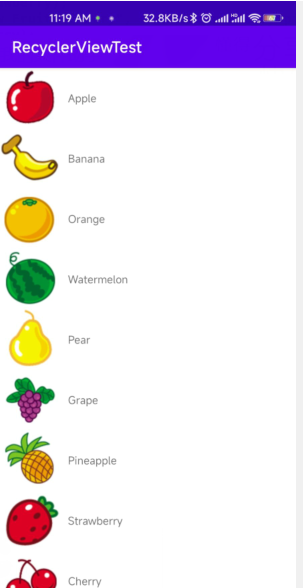

### 3.6.2 实现横向滚动和瀑布式布局

&emsp;&emsp;我们已经知道，ListView的扩展性并不好，它只能实现纵向滚动的效果，如果想要进行横向滚动的话，ListView就做不到了。那么RecyclerView怎么做到？

```xml
<?xml version="1.0" encoding="utf-8"?>
<LinearLayout xmlns:android="http://schemas.android.com/apk/res/android"
              android:layout_width="100dp"
              android:layout_height="wrap_content"
              android:orientation="vertical">

    <ImageView
            android:id="@+id/fruit_image"
            android:layout_width="wrap_content"
            android:layout_height="wrap_content"
            android:layout_gravity="center_horizontal"/>

    <TextView
            android:id="@+id/fruit_name"
            android:layout_width="wrap_content"
            android:layout_height="wrap_content"
            android:layout_gravity="center_horizontal"
            android:layout_marginLeft="10dp"/>

</LinearLayout>
```
&emsp;&emsp;可以看到，我们将LinearLayout改成垂直方向排列，并将宽度设置为100dp。这里将宽度指定为固定值是因为每种水果的文字长度不一致，如果使用wrap_content的话，Recycler的子项就会有长有短，非常不美观；而如果用match_parent的话，就会导致宽度过长，一个子项占满整个屏幕。然后我们将ImageView和TextView都设置成了布局中水平居中，并且使用了layout_marginTop属性让文字和图片之间保持一些距离，接下来修改MainActivity

```java
package com.zj970.recyclerviewtest;

/*import android.support.v7.widget.LinearLayoutManager;
import android.support.v7.widget.RecyclerView;*/
import androidx.appcompat.app.AppCompatActivity;
import android.os.Bundle;
import androidx.recyclerview.widget.LinearLayoutManager;
import androidx.recyclerview.widget.RecyclerView;
import com.zj970.recyclerviewtest.Adapter.FruitAdapter;
import com.zj970.recyclerviewtest.entity.Fruit;

import java.util.ArrayList;
import java.util.List;

public class MainActivity extends AppCompatActivity {
    /**
     * Initialize the fruit container
     */
    private List<Fruit> fruitList = new ArrayList<>();

    @Override
    protected void onCreate(Bundle savedInstanceState) {
        super.onCreate(savedInstanceState);
        setContentView(R.layout.activity_main);

        initFruits();
        RecyclerView recyclerView = findViewById(R.id.recycler_view);
        LinearLayoutManager linearLayoutManager = new LinearLayoutManager(this);
        linearLayoutManager.setOrientation(LinearLayoutManager.HORIZONTAL);
        recyclerView.setLayoutManager(linearLayoutManager);
        FruitAdapter fruitAdapter = new FruitAdapter(fruitList);
        recyclerView.setAdapter(fruitAdapter);
    }

    /**
     * 初始化水果
     */
    private void initFruits(){
        for (int i = 0; i < 2; i++) {
            Fruit apple = new Fruit("Apple",R.drawable.apple_pic);
            fruitList.add(apple);
            Fruit banana = new Fruit("Banana",R.drawable.banana_pic);
            fruitList.add(banana);
            Fruit orange = new Fruit("Orange",R.drawable.orange_pic);
            fruitList.add(orange);
            Fruit watermelon = new Fruit("Watermelon",R.drawable.watermelon_pic);
            fruitList.add(watermelon);
            Fruit pear = new Fruit("Pear",R.drawable.pear_pic);
            fruitList.add(pear);
            Fruit grape = new Fruit("Grape",R.drawable.grape_pic);
            fruitList.add(grape);
            Fruit pineapple = new Fruit("Pineapple",R.drawable.pineapple_pic);
            fruitList.add(pineapple);
            Fruit strawberry = new Fruit("Strawberry",R.drawable.strawberry_pic);
            fruitList.add(strawberry);
            Fruit cherry = new Fruit("Cherry",R.drawable.cherry_pic);
            fruitList.add(cherry);
            Fruit mango = new Fruit("Mango",R.drawable.mango_pic);
            fruitList.add(mango);
        }
    }
}
```

&emsp;&emsp;MainActivity中只加入了linearLayoutManager.setOrientation(LinearLayoutManager.HORIZONTAL)，调用了LinearLayoutManager的setOrientation()方法来设置布局的排列方向，默认是纵向排列的，我们传入LinearLayoutManager.HORIZONTAL来表示让布局横向排列，这样就可以实现横向排列了。


&emsp;&emsp;你可以用手指在水平方向上滑动来查看屏幕外的数据。为什么ListView很难或者根本无法实现的效果在RecyclerView上这么轻松就能实现了呢？这主要得益于RecycleView出色的设计。ListView的布局排列是由自身去管理的，而RecyclerView则将这个工作交给了LayoutManager，LayoutManager中制定出各种不同排列方式的布局了。除了LinearLayoutManager之外，RecyclerView还给我们提供了GridLayoutManager和StaggeredGridLayoutManager这两种内置的布局排列方式，GridLayoutManager可用于实现网络布局，StaggeredGridLayoutManager可以用于实现瀑布流布局。

&emsp;&emsp;这里实现瀑布流布局。首先更改一下fruit_item.xml中的代码，如下所示：

```xml
<?xml version="1.0" encoding="utf-8"?>
<LinearLayout xmlns:android="http://schemas.android.com/apk/res/android"
              android:layout_width="match_parent"
              android:layout_height="wrap_content"
              android:layout_margin="5dp"
              android:orientation="vertical">

    <ImageView
            android:id="@+id/fruit_image"
            android:layout_width="wrap_content"
            android:layout_height="wrap_content"
            android:layout_gravity="center_horizontal"/>

    <TextView
            android:id="@+id/fruit_name"
            android:layout_width="wrap_content"
            android:layout_height="wrap_content"
            android:layout_gravity="left"
            android:layout_marginLeft="10dp"/>

</LinearLayout>
```

&emsp;&emsp;这里做了几处小的调整，首先将LinearLayout的宽度由100dp改成了match_parent，因为瀑布流布局的宽度应该是根据布局的列数来自动适配的，而不是一个固定值。另外我们使用了layout_margin属性来让子项之间互留一点间距，这样就不至于所有子项都紧贴在一起。还有就是将TextView的对齐属性改成了居左对齐，因为待会我们会将文字的长度变长，如果还是居中显示就会感觉怪怪的。紧接着修改MainActivity中的代码

```java
package com.zj970.recyclerviewtest;

/*import android.support.v7.widget.LinearLayoutManager;
import android.support.v7.widget.RecyclerView;*/
import androidx.appcompat.app.AppCompatActivity;
import android.os.Bundle;
import androidx.recyclerview.widget.LinearLayoutManager;
import androidx.recyclerview.widget.RecyclerView;
import androidx.recyclerview.widget.StaggeredGridLayoutManager;
import com.zj970.recyclerviewtest.Adapter.FruitAdapter;
import com.zj970.recyclerviewtest.entity.Fruit;

import java.util.ArrayList;
import java.util.List;
import java.util.Random;

public class MainActivity extends AppCompatActivity {
    /**
     * Initialize the fruit container
     */
    private List<Fruit> fruitList = new ArrayList<>();

    @Override
    protected void onCreate(Bundle savedInstanceState) {
        super.onCreate(savedInstanceState);
        setContentView(R.layout.activity_main);

        initFruits();
        RecyclerView recyclerView = findViewById(R.id.recycler_view);
        StaggeredGridLayoutManager layoutManager = new StaggeredGridLayoutManager(3,StaggeredGridLayoutManager.VERTICAL);
        //LinearLayoutManager linearLayoutManager = new LinearLayoutManager(this);
        //linearLayoutManager.setOrientation(LinearLayoutManager.HORIZONTAL);
        //recyclerView.setLayoutManager(linearLayoutManager);
        recyclerView.setLayoutManager(layoutManager);
        FruitAdapter fruitAdapter = new FruitAdapter(fruitList);
        recyclerView.setAdapter(fruitAdapter);
    }

    /**
     * 初始化水果
     */
    private void initFruits(){
        for (int i = 0; i < 2; i++) {
            Fruit apple = new Fruit(getRandomLangthName("Apple"),R.drawable.apple_pic);
            fruitList.add(apple);
            Fruit banana = new Fruit(getRandomLangthName("Banana"),R.drawable.banana_pic);
            fruitList.add(banana);
            Fruit orange = new Fruit(getRandomLangthName("Orange"),R.drawable.orange_pic);
            fruitList.add(orange);
            Fruit watermelon = new Fruit(getRandomLangthName("Watermelon"),R.drawable.watermelon_pic);
            fruitList.add(watermelon);
            Fruit pear = new Fruit(getRandomLangthName("Pear"),R.drawable.pear_pic);
            fruitList.add(pear);
            Fruit grape = new Fruit(getRandomLangthName("Grape"),R.drawable.grape_pic);
            fruitList.add(grape);
            Fruit pineapple = new Fruit(getRandomLangthName("Pineapple"),R.drawable.pineapple_pic);
            fruitList.add(pineapple);
            Fruit strawberry = new Fruit(getRandomLangthName("Strawberry"),R.drawable.strawberry_pic);
            fruitList.add(strawberry);
            Fruit cherry = new Fruit(getRandomLangthName("Cherry"),R.drawable.cherry_pic);
            fruitList.add(cherry);
            Fruit mango = new Fruit(getRandomLangthName("Mango"),R.drawable.mango_pic);
            fruitList.add(mango);
        }
    }

    private String getRandomLangthName(String name){
        Random random = new Random();
        int length = random.nextInt(20)+1;
        StringBuffer buffer = new StringBuffer();
        for (int i = 0; i < length; i++) {
            buffer.append(name);
        }
        return buffer.toString();
    }
}
```

&emsp;&emsp;首先，在onCreate()方法中，我们创建了一个StaggeredGridLayoutManager的实例。StaggeredGridLayoutManager的构造函数接收两个参数，第一个是用于指定布局的列数，传入3表示会把布局分为3列；第二个参数用于指定布局的排列方向，传入StaggeredGridLayoutManager.VERTICAL表示会让布局纵向排列，最后再把创建好的实例设置到RecyclerView当中就可以了，就是这么简单！

&emsp;&emsp;没错，仅仅修改了一行代码，我们就已经成功实现瀑布流布局的效果了。不过由于瀑布流布局需要各个子项的高度不一致才能看出明显的效果，为此我又使用了一个小技巧。这里我们把眼光聚焦再getRandomLengthName()这个方法上，这个方法使用了Random对象来创造一个1到20之间的随机数，然后将参数中传入的字符串重复随机遍。在initFruits()方法中，每个水果的名字都改成调用getRandomLengthName()方法上，这样就保证各水果名字的长短差距比较大，子项的高度也就各不相同了。效果图如下所示：

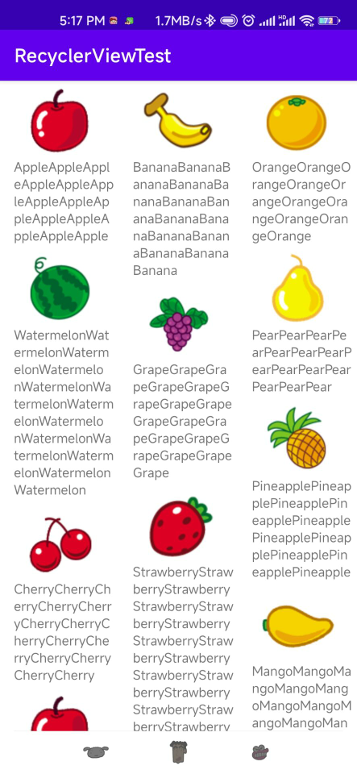

### 3.6.3 RecyclerView的点击事件

&emsp;&emsp;和ListView一样，RecyclerView也必须能影响点击事件才可以，不然的话就没什么实际的用途了。不过不同于ListView的是，RecyclerView并没有提供类似于setOnItemClickListener()这样的注册监听器方法，而是需要我们自己给子项具体的View去注册点击事件，相比于ListView来说，实现起来要复杂一些。那么你可能就有疑问了，为什么RecyclerView在各方面的设计都要优先于ListView，偏偏在点击事件上的处理并不人性化，setOnItemClickListener()方法注册的是子项的点击事件，但如果我是点击的是子项里具体的某一个按钮呢？虽然ListView也是能做到的，但是实现起来就相对比较麻烦了。为此，RecyclerView干脆直接摈弃了子项点击事件的监听器，所有的点击事件都由具体的View去注册，就再没有这个困扰了。下面我们来具体学习一下如何在RecyclerView中注册点击事件，修改FruitAdapter中的代码，如下所示：

```java
package com.zj970.recyclerviewtest.Adapter;

/*import android.support.annotation.NonNull;
import android.support.v7.widget.RecyclerView;*/

import android.view.LayoutInflater;
import android.view.View;
import android.view.ViewGroup;
import android.widget.ImageView;
import android.widget.TextView;
import android.widget.Toast;
import androidx.annotation.NonNull;
import androidx.recyclerview.widget.RecyclerView;
import com.zj970.recyclerviewtest.R;
import com.zj970.recyclerviewtest.entity.Fruit;

import java.util.List;

public class FruitAdapter extends RecyclerView.Adapter<FruitAdapter.ViewHolder> {

    static class ViewHolder extends RecyclerView.ViewHolder {
        View fruitView;
        ImageView fruitImage;
        TextView fruitName;

        public ViewHolder(@NonNull View itemView) {
            super(itemView);
            fruitView = itemView;
            fruitImage = itemView.findViewById(R.id.fruit_image);
            fruitName = itemView.findViewById(R.id.fruit_name);
        }
    }

    /**
     * 水果集合
     */
    private List<Fruit> mFruitList;

    public FruitAdapter(List<Fruit> fruitList) {
        this.mFruitList = fruitList;
    }


    @Override
    public ViewHolder onCreateViewHolder(@NonNull ViewGroup viewGroup, int i) {
        View view = LayoutInflater.from(viewGroup.getContext()).inflate(R.layout.fruit_item, viewGroup, false);
        final ViewHolder viewHolder = new ViewHolder(view);
        viewHolder.fruitView.setOnClickListener(new View.OnClickListener() {
            @Override
            public void onClick(View v) {
                int position = viewHolder.getAdapterPosition();
                Fruit fruit = mFruitList.get(position);
                Toast.makeText(v.getContext(),"You clicekd view "+fruit.getName(),Toast.LENGTH_SHORT).show();
            }
        });
        viewHolder.fruitImage.setOnClickListener(new View.OnClickListener() {
            @Override
            public void onClick(View v) {
                int position = viewHolder.getAdapterPosition();
                Fruit fruit = mFruitList.get(position);
                Toast.makeText(v.getContext(),"You clicekd image "+fruit.getName(),Toast.LENGTH_SHORT).show();
            }
        });
        return viewHolder;
    }

    @Override
    public void onBindViewHolder(@NonNull ViewHolder viewHolder, int i) {
        Fruit fruit = mFruitList.get(i);
        viewHolder.fruitName.setText(fruit.getName());
        viewHolder.fruitImage.setImageResource(fruit.getImageId());
    }

    @Override
    public int getItemCount() {
        return mFruitList.size();
    }
}

```

&emsp;&emsp;我们先是修改了ViewHolder,在ViewHolder中添加了fruitView变量来保存子项最外层布局的实例，然后在onCreateViewHolder()方法中注册点击事件就可以了。这里分别为最外层布局和ImageView都注册了点击事件，RecyclerView的强大之处也在这里，它可以轻松实现子项中任意控件或布局的点击事件。我们在两个点击事件中先获取了用户点击的position，然后通过position拿到相应的Fruit实例，再用Toast分别弹出两种不同的内容以示区别。现在重新运行代码，并点击香蕉的图片部分和菠萝文字部分，效果如图所示，由于TextView并没有注册点击事件，因此点击文字这个事件会被子项的最外层布局捕捉到。

<figure>
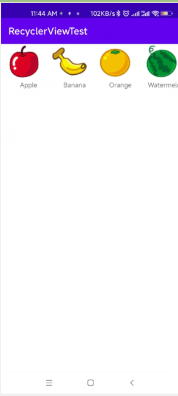

</figure>

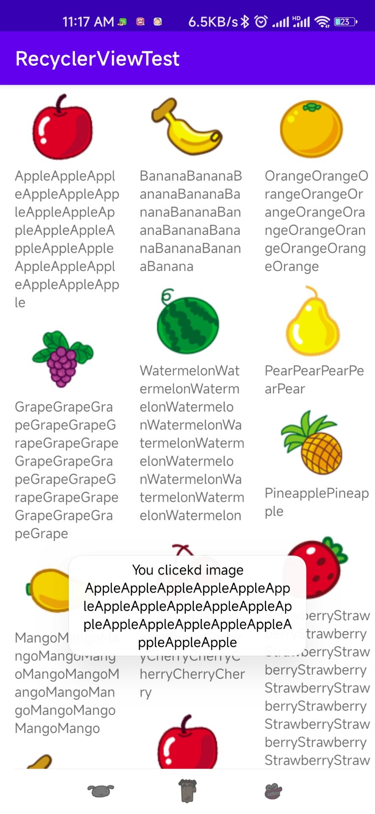
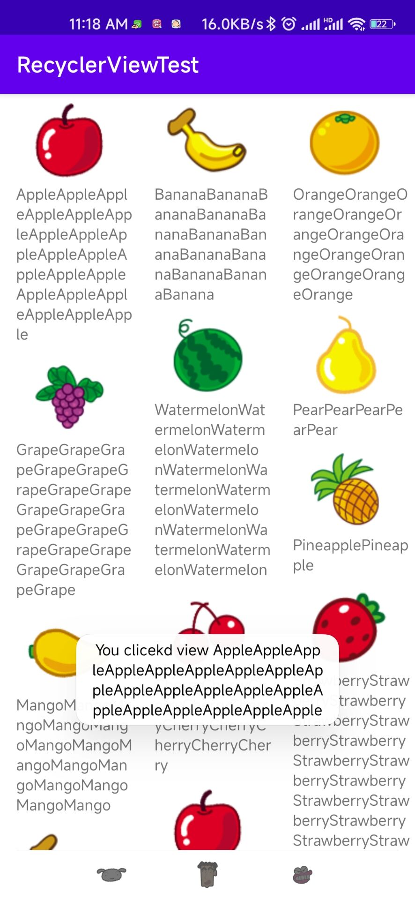

## 3.7 编写界面的最佳实践

&emsp;&emsp;既然学习了那么多UI开发的知识，也是时候实战一下了。这次我们要综合运用前面所学的大量内容来编写一个较为复杂且相当美观的聊天界面。

### 3.7.1 制作 Nine-Patch 图片

&emsp;&emsp;在实战正式开始之前，我们还需要学习一下如何制作Nine-Patch图片。你可能之前还没有听说过这个名词，它是一种被特殊处理过的png图片，能够指定哪些区域可以被拉伸、哪些区域不可以。那么Nine-Patch图片到底有什么实际作用呢？我们还是通过一个例子来看一下吧。比如说项目中有一张气泡样式的图片message_left.png


我们将这张图片设置为LinearLayout的背景图片，修改activity_main.xml中的代码，如下展示：

```xml
<?xml version="1.0" encoding="utf-8"?>
<LinearLayout
        xmlns:android="http://schemas.android.com/apk/res/android"
        xmlns:tools="http://schemas.android.com/tools"
        android:layout_width="match_parent"
        android:layout_height="wrap_content"
        android:background="@drawable/message_left"
        tools:context=".MainActivity">
</LinearLayout>
```
将LinearLayout的宽度指定为match_parent，然后将它的背景图设置为message_left，现在运行程序，效果如图所示

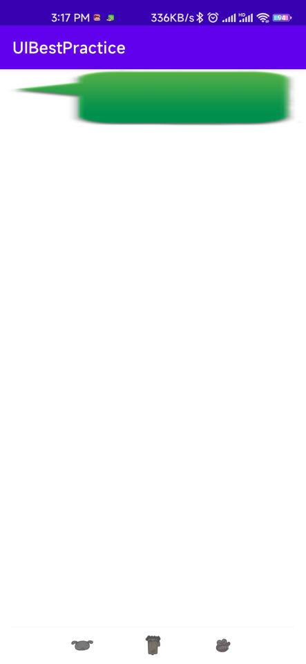


&emsp;&emsp;可以看到，由于message_left的宽度不足以填满整个屏幕的宽度，整张图片被均匀地拉伸了！这种效果非常差，用户肯定不能容忍的，这时候我们就可以使用Nine-Patch图片来进行改善。在Android sdk 目录下有一个tools文件夹，在这个文件夹中先找到 draw9patch.bat文件，我们就是使用它来制作Nine-Patch图片的。这里找不到draw9patch.bat,可以直接在AS里或IDEA里右键选中图片直接create 9-Patch file,然后就可以编辑了。

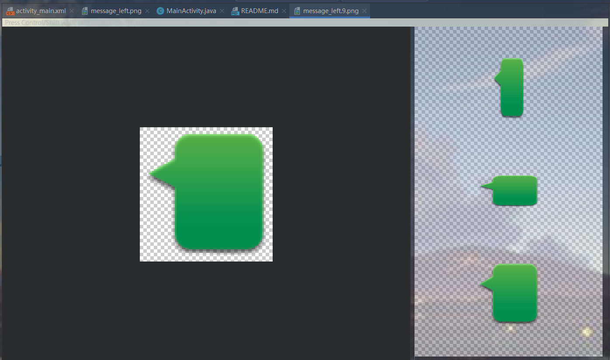

我们可以在图片的四个边框绘制一个个小黑点，在上边框和左边框绘制的部分表示当图片需要拉伸时拉伸黑点标记的区域，在下边框和右边框绘制的部分表示内容会被放置的区域。使用鼠标在图片的边缘拖动就可以进行绘制了，按住Shift键拖动就可以进行擦除


最终运行如图所示：

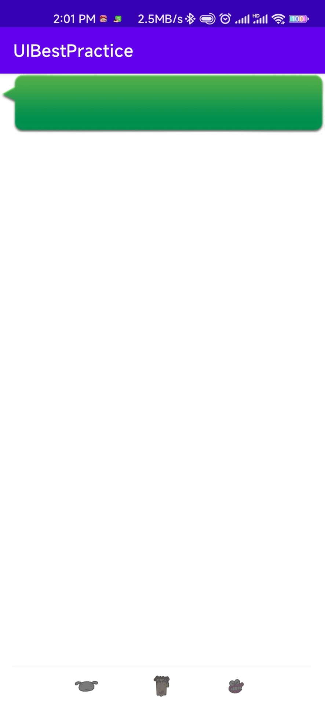

这样当图片需要拉伸的时候，就可以只拉伸指定的区域，程序在外观上也有了很大的改进。有了这个知识储备之后，我们就可以进入实战环节了。

### 3.7.2 编写精美的聊天界面

&emsp;&emsp;既然是要编写一个聊天界面，那就肯定要有收到的消息和发出的消息。所以还需要制作一个message_right.9.png作为发出消息的背景图。由于待会用到RecyclerView，因此需要先导入包implementation 'androidx.recyclerview:recyclerview:1.2.0-alpha05'

```groovy
dependencies {
    implementation 'androidx.recyclerview:recyclerview:1.2.0-alpha05'
    implementation 'androidx.appcompat:appcompat:1.2.0'
    implementation 'com.google.android.material:material:1.2.1'
    implementation 'androidx.constraintlayout:constraintlayout:2.0.1'
    testImplementation 'junit:junit:4.+'
    androidTestImplementation 'androidx.test.ext:junit:1.1.2'
    androidTestImplementation 'androidx.test.espresso:espresso-core:3.3.0'
}
```

接下来开始编写主界面，修改activity_main.xml中的代码

```xml
<?xml version="1.0" encoding="utf-8"?>
<LinearLayout
        xmlns:android="http://schemas.android.com/apk/res/android"
        xmlns:tools="http://schemas.android.com/tools"
        android:layout_width="match_parent"
        android:layout_height="match_parent"
        android:background="#d8e0e8"
        android:orientation="vertical"
        tools:context=".MainActivity">

    <androidx.recyclerview.widget.RecyclerView
            android:layout_width="match_parent"
            android:layout_height="0dp"
            android:layout_weight="1"/>

    <LinearLayout
            android:layout_width="match_parent"
            android:layout_height="wrap_content">

        <EditText
                android:id="@+id/input_text"
                android:layout_width="0dp"
                android:layout_height="wrap_content"
                android:layout_weight="1"
                android:hint="Type something here"
                android:maxLines="2"/>

        <Button
                android:id="@+id/send"
                android:layout_width="wrap_content"
                android:layout_height="wrap_content"
                android:text="Send"
                android:textAllCaps="false"/>
    </LinearLayout>


</LinearLayout>
```
我们在主界面中放置了一个RecyclerView用于显示聊天的消息内容，又放置了一个EditText用于输入消息，还放置了一个Button用于发送消息。这里用到的所有属性都是我们之前学到过的，相信你理解起来应该i不费力。然后定义消息的实体类，新建Msg

```java
package com.zj970.uibestpractice.entity;

/**
 * 消息的实体类
 * @author zj970
 * @date 2022/08/04
 */
public class Msg {

    public static final int TYPE_RECEIVED = 0;
    public static final int TYPE_SENT = 1;
    private String content;
    private int type;

    public Msg(String content, int type){
        this.content = content;
        this.type = type;
    }

    public String getContent() {
        return content;
    }

    public int getType() {
        return type;
    }
}

```
Msg类中只有两个字段，content表示消息的内容，type表示消息的类型。其中消息类型有两个值可选，TYPE_RECEIVED表示这是一条收到的消息，TYPE_SENT表示这是一条发出的消息，接着编写RecyclerView子项的布局，新建msg_item.xml,如下：

```xml
<?xml version="1.0" encoding="utf-8"?>
<LinearLayout xmlns:android="http://schemas.android.com/apk/res/android"
              android:paddingTop="10dp"
              android:layout_width="match_parent"
              android:layout_height="wrap_content">
    <LinearLayout
            android:id="@+id/left_layout"
            android:layout_width="wrap_content"
            android:layout_height="wrap_content"
            android:layout_gravity="left"
            android:background="@drawable/message_left">
        <TextView
                android:id="@+id/left_msg"
                android:layout_width="wrap_content"
                android:layout_height="wrap_content"
                android:layout_gravity="center"
                android:layout_margin="10dp"
                android:background="#fff"/>
    </LinearLayout>

    <LinearLayout
            android:id="@+id/right_layout"
            android:layout_width="wrap_content"
            android:layout_height="wrap_content"
            android:layout_gravity="right"
            android:background="@drawable/message_right">
        <TextView
                android:id="@+id/right_msg"
                android:layout_width="wrap_content"
                android:layout_height="wrap_content"
                android:layout_gravity="center"
                android:layout_margin="10dp"/>
    </LinearLayout>
</LinearLayout>
```
这里我们收到的消息聚左对齐，发出的消息居右对齐，并且分别使用message_left.9.png和message_right.9.png作为背景图，你可能会有些疑惑，怎么能让收到的消息和发出的消息都放在同一个布局中？不用担心，还记得我们前面学过的可见属性吗？只要稍后在代码中根据消息的类型来决定隐藏和显示哪种消息就可以了。接下来需要创建RecyclerView的适配器类，新建类MsgAdapter,代码如下所示：

```java
package com.zj970.uibestpractice.adapter;

import android.view.LayoutInflater;
import android.view.View;
import android.view.ViewGroup;
import android.widget.LinearLayout;
import android.widget.ListView;
import android.widget.TextView;
import androidx.annotation.NonNull;
import androidx.recyclerview.widget.RecyclerView;
import com.zj970.uibestpractice.R;
import com.zj970.uibestpractice.entity.Msg;

import java.util.List;

public class MsgAdapter extends RecyclerView.Adapter<MsgAdapter.ViewHolder> {
    private List<Msg> mMsgList;
    static class ViewHolder extends RecyclerView.ViewHolder{
        LinearLayout leftLayout;
        LinearLayout rightLayout;

        TextView leftMsg;
        TextView rightMsg;

        public ViewHolder(View v){
            super(v);
            leftLayout = v.findViewById(R.id.left_layout);
            rightLayout = v.findViewById(R.id.right_layout);
            leftMsg = v.findViewById(R.id.left_msg);
            rightMsg = v.findViewById(R.id.right_msg);
        }

    }
    public MsgAdapter(List<Msg> msgList){
        mMsgList = msgList;
    }
    
    @NonNull
    @Override
    public ViewHolder onCreateViewHolder(@NonNull ViewGroup parent, int viewType) {
        View view = LayoutInflater.from(parent.getContext()).inflate(R.layout.msg_item,parent,false);
        return new ViewHolder(view);
    }
    @Override
    public void onBindViewHolder(@NonNull ViewHolder holder, int position) {
        Msg msg = mMsgList.get(position);
        if (msg.getType() == Msg.TYPE_RECEIVED){
            //如果是收到的消息，则显示左边的消息布局，将右边的消息布局隐藏
            holder.leftLayout.setVisibility(View.VISIBLE);
            holder.rightLayout.setVisibility(View.GONE);
            holder.leftMsg.setText(msg.getContent());
        }else if (msg.getType()==Msg.TYPE_SENT){
            //如果是发出的消息，则显示左边的消息布局，将左边的消息布局隐藏
            holder.rightLayout.setVisibility(View.VISIBLE);
            holder.leftLayout.setVisibility(View.GONE);
            holder.rightMsg.setText(msg.getContent());
        }
    }

    /**
     * Returns the total number of items in the data set held by the adapter.
     *
     * @return The total number of items in this adapter.
     */
    @Override
    public int getItemCount() {
        return mMsgList.size();
    }
}

```
以上代码你应该非常熟悉了，和我们学习RecyclerView那一节的代码基本上是一样的，只不过在onBindViewHolder()方法中增加了对消息类型的判断。如果这条消息是收到的，则显示左边的消息布局，如果这条消息是发出的，则显示右边的消息布局。最后修改MainActivity中的代码，来为RecyclerView初始化一些数据，并给发送按钮加入事件响应，代码如下：

```java
package com.zj970.uibestpractice;

import android.view.View;
import android.widget.Button;
import android.widget.EditText;
import androidx.appcompat.app.AppCompatActivity;
import android.os.Bundle;
import androidx.recyclerview.widget.LinearLayoutManager;
import androidx.recyclerview.widget.RecyclerView;
import com.zj970.uibestpractice.adapter.MsgAdapter;
import com.zj970.uibestpractice.entity.Msg;

import java.util.ArrayList;
import java.util.List;

public class MainActivity extends AppCompatActivity {

    private List<Msg> msgList = new ArrayList<>();
    private EditText inputText;
    private Button send;
    private RecyclerView msgRecyclerView;
    private MsgAdapter adapter;

    @Override
    protected void onCreate(Bundle savedInstanceState) {
        super.onCreate(savedInstanceState);
        setContentView(R.layout.activity_main);
        initMsg();//初始化消息
        inputText = findViewById(R.id.input_text);
        send = findViewById(R.id.send);
        msgRecyclerView = findViewById(R.id.msg_recycler_view);
        LinearLayoutManager layoutManager = new LinearLayoutManager(this);
        msgRecyclerView.setLayoutManager(layoutManager);
        adapter = new MsgAdapter(msgList);
        msgRecyclerView.setAdapter(adapter);
        send.setOnClickListener(new View.OnClickListener() {
            @Override
            public void onClick(View v) {
                String content = inputText.getText().toString();
                if (!"".epuals(content)){
                    Msg msg = new Msg(content,Msg.TYPE_SENT);
                    msgList.add(msg);
                    adapter.notifyItemInserted(msgList.size() -1);//当有新消息时，刷新ListView中的显示
                    msgRecyclerView.scrollToPosition(msgList.size() - 1);//将ListView定位到最后一行
                    inputText.setText("");//清空输入框的内容
                }
            }
        });

    }


    /**
     * 初始化消息
     */
    private void initMsg(){
        Msg msg1 = new Msg("Hello guy.",Msg.TYPE_RECEIVED);
        msgList.add(msg1);
        Msg msg2 = new Msg("Hello!Who is that?",Msg.TYPE_SENT);
        msgList.add(msg2);
        Msg msg3 = new Msg("This is Tom.Nice talking to you.",Msg.TYPE_RECEIVED);
        msgList.add(msg3);
    }
}
```
&emsp;&emsp;在initMsgs()方法中我们先初始化了几条数据用于在RecyclerView中显示。然后在发送按钮的点击事件里获取了EditText中的内容，如果内容不为null则创建一个新的msg对象，并把它添加到msgList列表中去。之后又调用了适配器的notifyItemInserted()方法，用于通知列表有新的数据插入，这样新增的一条消息才能够在RecyclerView中显示。接着调用RecyclerView中的scrollToPosition()方法将输入的内容填空。

&emsp;&emsp;这样所有的工作就能完成了。运行结果如下

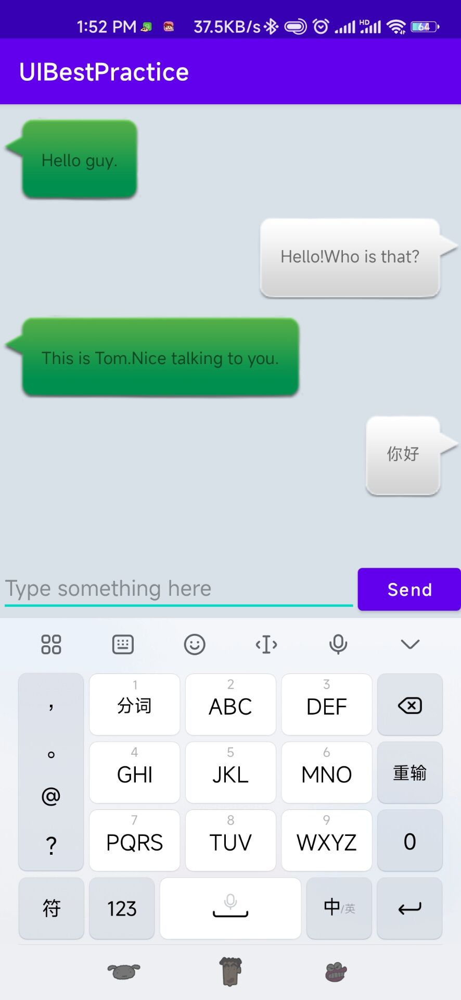

## 3.8 小结与点评

&emsp;&emsp;本章从Android中的一些常见控件开始入手，依次介绍了基本布局的用法，自定义控件的方法，ListView的详细用法以及RecyclerView的使用，基本已经将重要的UI知识全部覆盖了。想想在开始的时候我说不推荐使用可视化的编辑工具，而是应该全部使用XML的方式来编写界面，现在你是不是已经感受使用XML非常简单了呢？以后不论面对多么复杂的界面，我希望都可以信心满满，因为真正了解界面编写的原理之后，时没有什么能够难到我们的。
