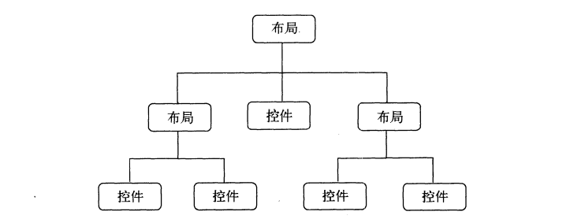

# 1. 常用控件的使用方法

## 1.1 TextView

TextView 是Android中最简单的一个控件，它主要用于在界面上显示一段文本信息。

```xml
<TextView
    android:id = "@+id/text_view"
    android:layout_width="match_parent"
    android:layout_height="wrap_content"
    android:text="This is TextView"
/>
```

- android:id给当前控件定义了一个唯一的标识符
- android:layout_width 和 android:layout_height 指定了控件的宽度和高度。Android中所有的控件都有这两个属性，可选值有3种：
  - match_parent 表示让当前控件的大小和父布局的大小一样，也就是由父布局来决定当前控件的大小。
  - fill_parent 和 match_parent 意义相同，更推荐用 match_parent
  - wrap_content 表示让当前控件的大小能够刚好包含住里面的内容，也就是由控件的内容决定当前控件的大小。
- 除了使用上述值，也可以对控件的高和宽指定一个固定的大小，但是这样做会在不同手机屏幕的适配方面出现问题

```xml
<TextView
    android:id = "@+id/text_view"
    android:layout_width="match_parent"
    android:layout_height="wrap_content"
    android:gravity="center"
    android:text="This is TextView"
/>
```

我们使用android:gravity来指定文字的对齐方式，可选值有top、bottom、left、right、center等，可以使用 "|" 来同时指定多个值，这里我们指定的center，效果等同于 center_vertical | center_horizontal，表示文字在垂直和水平方向都居中对齐。

另外我们还可以对 TextView 中文字大小和颜色进行修改

```xml
    <TextView
            android:id="@+id/text_view"
            android:layout_width="match_parent"
            android:layout_height="wrap_content"
            android:gravity="center"
            android:textSize="24sp"
            android:textColor="#00ff00"
            android:text="Hello World!"/>
```

通过android:textSize属性可以指定文字的大小，通过android:textColor属性可以指定文字的颜色，在Android中字体大小使用sp作为单位，非文字一律使用dp为单位。
更多内容了解[Android developer](https://developer.android.google.cn/reference/kotlin/android/widget/TextView?hl=en)

## 1.2 Button

Button是程序用于和用户进行交互的一个重要控件。

```xml
 <Button
            android:id="@+id/button"
            android:layout_width="match_parent"
            android:layout_height="wrap_content"
            android:text="Button"
            android:textAllCaps="false"/>
```
由于系统会对Button中的所有英文字母自动进行大写转换，可以使用 android:textAllCaps="false" 来禁用到默认特性

## 1.3 EditText

EditText是程序用于和用户进行交互的另一个重要的控件，它允许用户在控件里输入和编辑内容，并可以在程序中对这些内容进行处理。EditText的应用场景非常普遍，在进行发短信、发微信、发微博等操作时，你不得不使用EditText。

```xml
    <EditText
            android:id="@+id/edit_text"
            android:layout_width="match_parent"
            android:layout_height="wrap_content"/>
```

Android控件的使用规律：给控件定义一个id，再指定控件的高度和宽度，然后再适当加入一些控件特有的属性

增加EditText提示功能 android:hint="Type something here"，当我们输入任何内容时，该提示文本就会消失

```xml
<EditText
            android:id="@+id/edit_text"
            android:layout_width="match_parent"
            android:layout_height="wrap_content"
            android:hint="Type something there"/>
```

&emsp;&emsp;不过，随着输入的内容不断增多，EditText会被不断地拉长，这时由于EditText的高度是指定的是wrap_content,因此它总能包含住里面的内容，但是输入内容过多时，界面就变得非常难看

我们可以使用 android:maxLines 属性来解决这个问题

```xml
<EditText
            android:id="@+id/edit_text"
            android:layout_width="match_parent"
            android:layout_height="wrap_content"
            android:hint="Type something there"
            android:maxLines="2"/>
```
这里通过android:maxLines指定了EditText的最大行数为两行，当输入的内容超过两行时，文本就会向上滚动，而EditText则不会继续拉伸

## 1.4 ImageView

&emsp;&emsp;ImageView 是用于在界面上展示图片的一个控件，它可以让我们的程序界面变得更加丰富多彩。学习这个控件需要提前准备一些图片，这些图片通常放在 ”drawable“ 开头的目录下的。

```xml
<ImageView
            android:id="@+id/image_1"
            android:layout_width="wrap_content"
            android:layout_height="wrap_content"
            android:src="@drawable/img_1"/>
```
&emsp;&emsp;可以看到，这里使用android:src属性给ImageView指定了一张图片。由于图片的宽和高都是未知的，所有将ImageView的宽和高都设定了wrap_content，这样就保证了不管图片的尺寸是多少，图片都可以完整地显示出来。

## 1.5 ProgressBar

&emsp;emsp;ProgressBar用于在界面上显示一个进度条，表示我们的程序正在加载一些数据。

```xml
 <ProgressBar
            android:id="@+id/progress_bar"
            android:layout_width="match_parent"
            android:layout_height="wrap_content"/>

```

&emsp;&emsp;旋转的进度条表明我们的程序正在加载数据，那么数据总有加载完的时候。此时需要Android控件的可见属性。所有的Android控件都具有这个属性，可以通过android:visibility进行指定，可选值有3种：
- visible 表示控件是可见的，这个值是默认值，不指定的时候就是可见的
- invisible 表示控件不可见，但它仍然占据原来的位置和大小，只是变为透明状态了。
- gone 不仅不可见，而且不再占用任何屏幕空间

&emsp;&emsp;我们还可以通过代码来设置控件的可见性，使用的是setVisibility()方法，可以传入View.VISIBLE、View.INVISIBLE和View.GONE这三种值  
另外我们还可以给ProgressBar指定不同的样式，通过style属性可以将它指定成水平进度条

```xml
<ProgressBar
            android:id="@+id/progress_bar"
            android:layout_width="match_parent"
            android:layout_height="wrap_content"
            style="?android:attr/progressBarStyleHorizontal"
            android:max="100"/>
```
## 1.6 AlertDialog

&emsp;&emsp;AlertDialog 可以在当前的界面弹出一个对话框，这个对话框是置顶于所有界面元素之上的，能够屏蔽掉其他控件的交互能力，因此 AlertDialog 一般都是用于提示一些非常重要的内容或者警告信息。比如为了防止用户误删重要内容，在删除之前弹出一个确认对话框

```
/**
     * 展示AlertDialog的使用
     */
    public void button_AlertDialog(){
        AlertDialog.Builder dialog = new AlertDialog.Builder(MainActivity.this);//1. 实例化AlertDialog
        dialog.setTitle("This is Dialog");//2. 设置标题
        dialog.setMessage("Something important.");//3. 设置内容
        dialog.setCancelable(false);//4. 可否取消的属性
        /**
         * 确定按钮点击事件
         */
        dialog.setPositiveButton("OK", new DialogInterface.OnClickListener() {
            @Override
            public void onClick(DialogInterface dialog, int which) {

            }
        });
        /**
         * 取消按钮点击事件
         */
        dialog.setNegativeButton("Cancle", new DialogInterface.OnClickListener() {
            @Override
            public void onClick(DialogInterface dialog, int which) {

            }
        });
        dialog.show();
    }

```
首先通过AlertDialog.Builder创建一个AlertDialog实例，然后可以为这个对话框设置标题、内容、可否取消等属性，接下来调用setPositiveButton()方法为对话框设置确定点击按钮的点击事件，调用setNegativeButton()方法设置取消按钮点击事件，最后调用show()方法将对话框显示出来

## 1.7 ProgressDialog

ProgressDialog 和 AlertDialog有点类似，都可以弹出一个对话框，都能屏蔽掉其他控件的交互能力。不同的是，ProgressDialog会在对话框中显示一个进度条，一般用于表示当前操作比较耗时，让用户耐心地等待。它的用法噶和AlertDialog也比较相似

```
/**
     * 展示ProgressDialog的使用
     */
    public void buttonProgressDialog(){
        ProgressDialog progressDialog = new ProgressDialog(MainActivity.this);
        progressDialog.setTitle("This is ProgressDialog");
        progressDialog.setMessage("Loading...");
        progressDialog.setCancelable(true);
        progressDialog.show();
    }
```
&emsp;&emsp;可以看到，这里也是先构建一个ProgressDialog对象，然后同样可以设置标题、内容、可否取消等属性，最后也是通过调用show()方法将ProgressDialog显示出来。  

&emsp;&emsp;注意：如果在setCancelable()中传入了false,表示ProgressDialog是不能通过Back键取消掉的，这时你就一定要在代码中做好控制，当数据加载完成后必须调用ProgressDialog的dismiss()方法来关闭对话框，否则ProgressDialog将会一直存在。

---

# 2. 详解4种基本布局

&emsp;&emsp;一个丰富的界面总是要由很多个控件组成的，那我们如何才能让各个控件都有条不紊地摆放在界面上，而不是乱糟糟的呢？这就需要借助布局来实现了。布局是一种可用于放置很多控件的容器，它可以按照一定的规律调整内部控件的位置，从而编写出精美的界面。



## 2.1 线性布局

&emsp;&emsp;LinearLayout又称作线性布局，是一种非常常用的布局。正如它的名字所描述的一样，这个布局会将它所包含的控件在线性方向依次排列。既然是线性排列，不止一个方向，之前所有的控件都是在垂直方向上排列，这是由于我们通过指定了android:orientation属性指定了排列方向是vertical，如果指定的是horizontal，控件就会在水平方向上排列了。

```xml
<?xml version="1.0" encoding="utf-8"?>
<LinearLayout
        xmlns:android="http://schemas.android.com/apk/res/android"
        xmlns:tools="http://schemas.android.com/tools"
        android:orientation="vertical"
        android:layout_width="match_parent"
        android:layout_height="match_parent"
        tools:context=".LayoutPractice">
    <Button
            android:id="@+id/button_1"
            android:layout_width="wrap_content"
            android:layout_height="wrap_content"
            android:text="Button 1"
            android:textAllCaps="false"
            android:textSize="28sp"/>
    <Button
            android:id="@+id/button_2"
            android:layout_width="wrap_content"
            android:layout_height="wrap_content"
            android:text="Button 2"
            android:textAllCaps="false"
            android:textSize="28sp"/>
    <Button
            android:id="@+id/button_3"
            android:layout_width="wrap_content"
            android:layout_height="wrap_content"
            android:text="Button 3"
            android:textAllCaps="false"
            android:textSize="28sp"/>

</LinearLayout>
```

&emsp;&emsp;我们在LinearLayout中添加了3个Button，每个Button的长和宽都是wrap_content，并指定了排列方向是vertical。控件在垂直方向依次排列。

&emsp;&emsp;将android:orientation属性的值改成了horizontal，这就意味着要让LinearLayout中的控件在水平方向上依次排列。当然如果不指定android:orientation属性的值，默认的排列方向就是horizontal。

&emsp;&emsp;这里需要注意，如果LinearLayout的排列方向是horizontal，内部的控件就绝对不能将宽度指定为match_parent，因为这样的话，单独一个控件就会将整个水平方向占满，其他的控件就没有可放置的位置了。同样的道理,如果是LinearLayout的排列方向是vertical,内部的控件就不能将高度指定为match_parent。

&emsp;&emsp;首先来看android:layout_gravity属性，它和我们上一节中学到的android:gravity属性看起来有些相似，这两个属性有什么区别呢？其实从名字就可以看出，android:gravity用于指定文字在控件中的对齐方式，而android:layout_gravity用于指定控件在布局中的对齐方式。android:layout_gravity的可选值和android:gravity差不多，但是需要注意，当LinearLayout的排列方向是horizontal时，只有垂直方向上的对齐方式才会生效，因为此时水平方向上的长度是不固定的，每添加一个控件，水平方向上的长度都会改变，因而无法指定该方向上的对齐方式。同样的道理，当LinearLayout的排列方向是vertical时，只有水平方向的对齐方式才会生效。 

```xml
<?xml version="1.0" encoding="utf-8"?>
<LinearLayout
        xmlns:android="http://schemas.android.com/apk/res/android"
        xmlns:tools="http://schemas.android.com/tools"
        android:orientation="horizontal"
        android:layout_width="match_parent"
        android:layout_height="match_parent"
        tools:context=".LayoutPractice">
    <Button
            android:id="@+id/button_1"
            android:layout_width="wrap_content"
            android:layout_height="wrap_content"
            android:text="Button 1"
            android:layout_gravity="top"
            android:textAllCaps="false"
            android:textSize="28sp"/>
    <Button
            android:id="@+id/button_2"
            android:layout_width="wrap_content"
            android:layout_height="wrap_content"
            android:text="Button 2"
            android:layout_gravity="center_vertical"
            android:textAllCaps="false"
            android:textSize="28sp"/>
    <Button
            android:id="@+id/button_3"
            android:layout_width="wrap_content"
            android:layout_height="wrap_content"
            android:text="Button 3"
            android:layout_gravity="bottom"
            android:textAllCaps="false"
            android:textSize="28sp"/>
</LinearLayout>
```

&emsp;&emsp;接下来我们学习下LinearLayout中的另一个重要属性——android:layout_weight。这个属性允许我们使用比例的方式来指定控件的大小，它在手机屏幕的适配性方面可以起到非常重要的作用。比如我们正在编写一个消息发送界面，需要一个文本编辑框和一个发送按钮。

```xml
<?xml version="1.0" encoding="utf-8"?>
<LinearLayout
        xmlns:android="http://schemas.android.com/apk/res/android"
        xmlns:tools="http://schemas.android.com/tools"
        android:orientation="horizontal"
        android:layout_width="match_parent"
        android:layout_height="match_parent"
        tools:context=".LayoutPractice">
  <EditText
          android:id="@+id/input_message"
          android:layout_width="0dp"
          android:layout_height="wrap_content"
          android:layout_weight="1"
          android:text="Type something"/>
  <Button
          android:id="@+id/send"
          android:layout_width="0dp"
          android:layout_height="wrap_content"
          android:layout_weight="1"
          android:text="Send"
          android:textAllCaps="false"/>
</LinearLayout>
```
&emsp;&emsp;你会发现这里竟然将EditText和Button的宽度都指定成了0dp，这样文本编辑框和按钮还能显示出来吗？不用担心，由于我们使用了android:layout_weight属性，此时控件的宽度就不应该再由android:layout_width来决定，这里指定成0dp是一种比较规范的写法。另外，dp是Android中用于指定控件大小，间距等属性的单位。

&emsp;&emsp;然后在EditText和Button里都将android:layout_weight属性的值都设定为1，这表示EditText和Button将在水平方向平分宽度。

&emsp;&emsp;为什么将android:layout_weight属性的值同时指定为1就会平分屏幕宽度呢？其实原理也很简单，系统会先把LinearLayout下所有指定的layout_weight值相加，得到一个总值，然后每个控件所占大小的比列就是用该控件的layout_weight值除以刚才算出的总值。因此如果想让EditText占据屏幕宽度的3/5，Button占据屏幕宽度的2/5，只需要将EditText的layout_weight改为3，Button的layout_weight的值改成2就可以了.

我们还可以通过指定部分控件的layout_weight值来实现更好的效果。

```xml
<?xml version="1.0" encoding="utf-8"?>
<LinearLayout
        xmlns:android="http://schemas.android.com/apk/res/android"
        xmlns:tools="http://schemas.android.com/tools"
        android:orientation="horizontal"
        android:layout_width="match_parent"
        android:layout_height="match_parent"
        tools:context=".LayoutPractice">
    <EditText
            android:id="@+id/input_message"
            android:layout_width="0dp"
            android:layout_height="wrap_content"
            android:layout_weight="1"
            android:text="Type something"/>
    <Button
            android:id="@+id/send"
            android:layout_width="wrap_content"
            android:layout_height="wrap_content"
            android:text="Send"
            android:textAllCaps="false"/>
</LinearLayout>
```
&emsp;&emsp;这里我们仅指定了EditText的android:layout_weight属性，并且Button的宽度改回wrap_content。这表示Button的宽度仍然按照wrap_content来计算，而EditText则会占满屏幕所有的剩余空间。使用这种方式编写的界面，不仅会在各种屏幕的适配方面会非常好，而且看起来也更加舒服。 

## 2.2 相对布局

&emsp;&emsp;RelativeLayout又称做相对布局，也是一种非常常用的布局。和LinearLayout的排列规则不同，RelativeLayout显得更加随意一些，它可以通过相对定位的方式让控件出现在布局的任何位置。也正因为如此，RelativeLayout中的属性非常多，不过这些属性都是有规律可循的，其实并 并不难理解和记忆。

```xml
<?xml version="1.0" encoding="utf-8"?>
<RelativeLayout
        xmlns:android="http://schemas.android.com/apk/res/android"
        xmlns:tools="http://schemas.android.com/tools"
        android:layout_width="match_parent"
        android:layout_height="match_parent"
        tools:context=".RelativeLayoutPractice">
    <Button
            android:id="@+id/button1"
            android:layout_width="wrap_content"
            android:layout_height="wrap_content"
            android:layout_alignParentLeft="true"
            android:layout_alignParentTop="true"
            android:textAllCaps="false"
            android:text="Button 1"/>
    <Button
            android:id="@+id/button2"
            android:layout_width="wrap_content"
            android:layout_height="wrap_content"
            android:layout_alignParentRight="true"
            android:layout_alignParentTop="true"
            android:textAllCaps="false"
            android:text="Button 2"/>
    <Button
            android:id="@+id/button3"
            android:layout_width="wrap_content"
            android:layout_height="wrap_content"
            android:layout_centerInParent="true"
            android:textAllCaps="false"
            android:text="Button 3"/>
    <Button
            android:id="@+id/button4"
            android:layout_width="wrap_content"
            android:layout_height="wrap_content"
            android:layout_alignParentBottom="true"
            android:layout_alignParentLeft="true"
            android:text="Button 4"
            android:textAllCaps="false"/>
    <Button
            android:id="@+id/button5"
            android:layout_width="wrap_content"
            android:layout_height="wrap_content"
            android:layout_alignParentBottom="true"
            android:layout_alignParentRight="true"
            android:text="Button 5"
            android:textAllCaps="false"/>

</RelativeLayout>
```

&emsp;&emsp;我们让Button 1和父布局的左上角对齐，Button 2和父布局的右上角对齐，Button 3居中对齐，Button 4和父布局的左下角对齐，Button 5和父布局的右下角对齐。虽然android:layout_alignParentLeft、android:layout_alignParentRight、android:layout_alignParentTop、android:layout_alignParentBottom、android:layout_centerInParent这几个属性虽然没有接触过，但是见名明义。

上面例子中的每个控件都是相对于父布局进行定位的。也可以相对于控件进行定位。

```xml
<?xml version="1.0" encoding="utf-8"?>
<RelativeLayout
        xmlns:android="http://schemas.android.com/apk/res/android"
        xmlns:tools="http://schemas.android.com/tools"
        android:layout_width="match_parent"
        android:layout_height="match_parent"
        tools:context=".RelativeLayoutPractice">
  <Button
          android:id="@+id/button3"
          android:layout_width="wrap_content"
          android:layout_height="wrap_content"
          android:layout_centerInParent="true"
          android:textAllCaps="false"
          android:text="Button 3"/>
    <Button
            android:id="@+id/button1"
            android:layout_width="wrap_content"
            android:layout_height="wrap_content"
            android:layout_above="@+id/button3"
            android:layout_toLeftOf="@+id/button3"
            android:textAllCaps="false"
            android:text="Button 1"/>
    <Button
            android:id="@+id/button2"
            android:layout_width="wrap_content"
            android:layout_height="wrap_content"
            android:layout_above="@+id/button3"
            android:layout_toRightOf="@+id/button3"
            android:textAllCaps="false"
            android:text="Button 2"/>
    <Button
            android:id="@+id/button4"
            android:layout_width="wrap_content"
            android:layout_height="wrap_content"
            android:layout_below="@+id/button3"
            android:layout_toLeftOf="@+id/button3"
            android:text="Button 4"
            android:textAllCaps="false"/>
    <Button
            android:id="@+id/button5"
            android:layout_width="wrap_content"
            android:layout_height="wrap_content"
            android:layout_below="@+id/button3"
            android:layout_toRightOf="@+id/button3"
            android:text="Button 5"
            android:textAllCaps="false"/>

</RelativeLayout>
```
&emsp;&emsp;这次代码稍微复杂一点，不过仍然有规律可循。android:layout_above属性可以让一个控件位于另外一个控件的上方，需要为这个属性指定相对控件id的引用，这里我们填入了@+id/button3，表示让该控件位于Button 3的上方。其他属性也都是相似的，android:layout_below表示让一个控件位于另一个控件的下方，android:layout_toLeftOf表示让一个控件位于另一个控件的左侧，android:layout_toRightOf表示让一个控件位于另一个控件的右侧。注意，当一个控件去引用另一个控件的id时，该控件一定要定义在引用控件的后面，不然会出现找不到id的情况。

&emsp;&emsp;RelativeLayout中还有另外一组相对于控件进行定位的属性，android:layout_alignLeft表示让一个控件的左边缘和另一个控件的左边缘对齐，android:layout_alignRight表示让一个控件的右边缘和另一个控件的右边缘对齐。此外，还有android:layout_alignTop和android:layout_alignBottom，道理都是一样。

## 2.3 帧布局

&emsp;&emsp;FrameLayout又称作帧布局，它相比前面两种布局就简单太多了，因此它的应用场景也少了很多。这种布局没有方便的定位方式，所有的控件都会默认摆放在布局的左上角。

```xml
<?xml version="1.0" encoding="utf-8"?>
<FrameLayout
        xmlns:android="http://schemas.android.com/apk/res/android"
        xmlns:tools="http://schemas.android.com/tools"
        android:layout_width="match_parent"
        android:layout_height="match_parent"
        tools:context=".FrameLayoutPractice">
    <TextView
            android:id="@+id/text_view"
            android:layout_width="wrap_content"
            android:layout_height="wrap_content"
            android:text="This is TextView"
            android:textColor="@color/black"
            android:textSize="28sp"/>
    <ImageView
            android:id="@+id/image_view"
            android:layout_width="wrap_content"
            android:layout_height="wrap_content"
            android:src="@drawable/img_1"/>
</FrameLayout>
```

可以看到，文字和图片都是位于布局的左上角。由于ImageView是在TextView之后添加的，因此图片压在了文字上面。当然除了这种默认效果之外，我们还可以使用layout_gravity属性来指定控件在布局中的对齐方式，和LinearLayout的方式相同。

```xml
<?xml version="1.0" encoding="utf-8"?>
<FrameLayout
        xmlns:android="http://schemas.android.com/apk/res/android"
        xmlns:tools="http://schemas.android.com/tools"
        android:layout_width="match_parent"
        android:layout_height="match_parent"
        tools:context=".FrameLayoutPractice">
    <TextView
            android:id="@+id/text_view"
            android:layout_width="wrap_content"
            android:layout_height="wrap_content"
            android:text="This is TextView"
            android:layout_gravity="left"
            android:textColor="@color/black"
            android:textSize="28sp"/>
    <ImageView
            android:id="@+id/image_view"
            android:layout_width="wrap_content"
            android:layout_height="wrap_content"
            android:layout_gravity="center"
            android:src="@drawable/img_1"/>
</FrameLayout>
```
我们指定TextView在FrameLayout中居左对齐，ImageView居中对齐，总体来说，FrameLayout由于定位的方式的欠缺，导致它的应用场景也比较少。

## 2.4 百分比布局

&emsp;&emsp;前面介绍的3种布局都是从Android 1.0 版本中就开始支持了，一直沿用到现在，可以说是满足了绝大多数场景的界面设计需求。不过只有LinearLayout支持使用layout_weight属性来事项按比例指定控件大小的功能，其他两种都不支持。比如说,如果想用RelativeLayout来实现让两个按钮按比例平分的效果，则是比较困难的。

&emsp;&emsp;为此，Android引入了一种全新的布局方式来解决此问题——百分比布局。在这种布局中，我们可以不再使用wrap_content、match_parent等方式来指定控件的大小，而是允许直接指定控件在布局中所占的百分比，这样的话就可以轻轻松松实现平分布局甚至是任意比例分割布局的效果。

&emsp;&emsp;由于LinearLayout本身已经支持按比例指定控件的大小了，因此百分比布局只为FrameLayout和RelativeLayout进行功能扩展，提供了PercentFrameLayout和PercentRelativeLayout。这两个全新布局需要在build.gradle中添加依赖，打开app/build.gradle文件

```groovy
dependencies{
  implementation 'androidx.percentlayout:percentlayout:1.0.0'
}
```
由于使用的Android studio版本较高，不使用原书的 com.android.support:percent:24.2.1，修改布局时，不仅需要修改button设置，还需要设置头tag
> <android.percentlayout.widget.PercentFrameLayout xmlns:app="http://schems.android.com/apk/res-auto"

而且每次修改gradle文件后都需要Sync Now，同步一下工程。